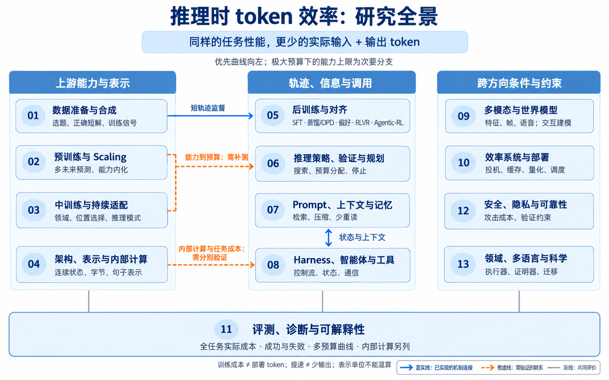

# 00 总论：怎样让同样的任务少用 token

[返回目录](../README.md) · [13 章与交叉索引](../sources/coverage.md) · [研究机会](research-opportunities.md)

这份地图面向准备进入该领域的研究者：围绕推理时的性能—token 曲线，各方向在解决什么问题，方法怎样关联，哪些认识已有支持，哪些仍有争议，以及下一步可以验证什么。**首要目标是相同性能下减少整项任务的实际 token；极大预算下的能力上限是次要分支。** 小团队的资源限制影响行动顺序，不用于把预训练、架构或科学应用提前从地图中删除。

正文按研究方向组织，生命周期作为交叉索引。资料截止日为 **2026-09-09**。这是沿综述及其引用、公开索引和明确缺口展开的选择性研究地图，不能据“本轮未找到直接证据”断言某个领域不存在相关工作。[范围与发现链](../sources/coverage.md)

## 1. 先统一问题：我们究竟在把哪条曲线向左移


蓝线与红线是概念示意，不是实验测量。横向箭头表达本地图优先关注的“相同性能，更少实际推理 token”；纵向箭头表达同预算提高性能。训练成本、隐藏计算和非文本单位另列。后面的研究全景图解释各方向怎样研究这个目标。

设一项任务经过 $`K`$ 次模型调用，调用 $`k`$ 实际读入 $`I_k`$ 个 token、生成 $`O_k`$ 个 token，本地图的主成本为：

```math
C=\sum_{k=1}^{K}(I_k+O_k).
```

输入包括实际读入的历史、检索材料、工具说明和工具观察；输出包括可取得用量的思考与答案。摘要器、路由器、验证器、子代理和失败重试，只要属于方法执行，都进入这本账。工具返回文本在被模型读入时计数，不在“工具返回”和“下次输入”重复计算；多轮重读则每轮都算。

用 $`S(\pi)`$ 表示策略 $`\pi`$ 在固定任务分布与判分下的成功率，用 $`C(\pi)`$ 表示其平均实际成本。给定目标成功率 $`s`$，关注：

```math
C^*(s)=\inf_{\pi:S(\pi)\ge s}\mathbb E[C(\pi)].
```

直观上，这问的是“达到同样质量，最少要花多少 token”。降低最大长度会改变一个工作点；在多个预算上重新评测，才有机会判断一段曲线是否改善。有限实验只支持测到的工作点和预算范围，不能证明全局最优前沿。

一个教学例子：原方法每轮读 4,000、写 500 个 token，完成任务用 3 轮，成本为 13,500。摘要后每轮读 2,000、写 500，但用 5 轮，加上摘要器的 2,000 输入与 300 输出，成本变成 14,800。上下文变短了，整项任务反而更贵。这个例子没有模型实验含义，只说明为什么需要完整账目。

| 必须分开的量 | 例子 | 与主目标的关系 |
| --- | --- | --- |
| 部署实际 token | 全部调用的输入、输出、失败与重试 | 主横轴；同时展示输入和输出分项 |
| 训练与开发投入 | 教师采样、数据合成、提示搜索、优化更新 | 决定小团队能否负担和能否摊销 |
| 计算、延迟、费用 | GPU 时间、缓存、量化、不同模型价格 | 可改善而不减少 token；单独报告 |
| 非文本或内部表示 | 视觉位置、语音帧、latent 步、句子向量 | 单位不同，不能直接相加或宣称零成本 |

缓存命中仍有逻辑输入 token，但价格和实际计算可能较低。隐藏推理用量不可得时保留缺失；换 tokenizer 时同时记录参考分词或字节长度。详见[评测与诊断](11-evaluation/index.md)。

## 2. 13 个方向，各自改变什么



全景在各章完成后综合生成。蓝实线表示已实现的机制连接，橙虚线表示需验证的联系，灰线表示共同评价；分组用于导航，不表示所有方法都具有直接 token 节省证据。

| 方向 | 通俗机制与主要路线 | 本轮证据位置 |
| --- | --- | --- |
| [01 数据准备与合成](01-data/index.md) | 选哪些题、保留哪条正确解、压缩哪些表达；数据难度决定可学信号 | 最短正确轨迹直接涉及输出长度；文档清洗与配比主要提供能力基础 |
| [02 预训练与 Scaling](02-pretraining/index.md) | 用多未来预测、规模分配或句子级预测，提前学会运行时所需的能力 | MTP、LCM 的核心结果尚不足以证明同质量少推理 token |
| [03 中训练与持续适配](03-midtraining/index.md) | 熟悉领域、选择训练损失位置、协调长上下文和推理模式 | Rho-1 等说明信号选择有效；部署时少检索、少纠错的联系需补测 |
| [04 架构、表示与内部计算](04-architecture/index.md) | 用连续状态继续思考，或把字节、句子编码成不同计算单位 | Coconut/CODI 与 BLT 改变的对象不同；必须补记内部计算 |
| [05 后训练与对齐](05-posttraining/index.md) | SFT、蒸馏与 OPD、偏好优化、RLVR、Agentic-RL 改变轨迹和策略 | 输出压缩、预算服从与效率奖励已有较密集直接证据，也有高预算能力损失 |
| [06 推理策略、验证与规划](06-reasoning/index.md) | 分解、搜索、验证、置信停止；把预算花到更有希望的路径 | Snell、DeepConf 等研究预算分配；收益依赖难度、验证信号和辅助开销 |
| [07 Prompt、知识、检索、上下文与记忆](07-context/index.md) | 少读无关材料，保留可回找的信息，控制历史重读 | LLMLingua-2、RECOMP、遮蔽与摘要竞争；复杂记忆未必更省 |
| [08 Harness、智能体与工具](08-agents/index.md) | 将可确定的控制流交给程序，减少模型调用、通信和冗余观察 | ReWOO、LLMCompiler、MEM1、AgentPrune 改变调用结构；路由省钱需另算 token |
| [09 多模态与世界模型](09-multimodal/index.md) | 选择、合并图像位置和视频帧，压缩语音特征；建模环境以辅助规划 | FastV、PruMerge、LongVU、SpeechPrune 主要测特征预算；世界模型的任务级证据仍薄弱 |
| [10 效率系统与部署](10-systems/index.md) | 投机解码、缓存、量化、调度和端侧部署降低执行成本 | 精确投机解码保持目标输出分布；提速不能写成少生成 token |
| [11 评测、诊断与可解释性](11-evaluation/index.md) | 统一成本分母，区分成功与失败长度，诊断冗余与截断 | 预算曲线、逐题账和干预实验互补；相关性诊断不等于可安全删减 |
| [12 安全、隐私、可靠性与治理](12-safety/index.md) | 防止攻击诱发无效长思考；在验证约束下控制资源消耗 | OverThink、RecurGuard 给出攻击与防护证据；防护本身也要计成本 |
| [13 领域、多语言与 AI for Science](13-domains/index.md) | 将计算交给执行器或证明器，用专业知识和语言策略减少试错 | PAL、MGSM、Prover-V2 说明能力路线；跨领域任务成本不能由正确率代替 |

表中“直接”始终限定为论文实际测量的量。只测输出的论文，提供输出效率证据；只测视觉特征数的论文，提供特征预算证据；二者都还不能自动填入统一的任务总成本曲线。

## 3. 上游能力：把运行时的难点提前学会

数据、预训练和中训练共有一个吸引人的设想：模型更懂问题，部署时便不必反复解释、搜索和纠错。这个因果链分成两段——训练改变了能力，以及能力改变了达到目标成功率所需的 token。许多上游论文只测了第一段。

[数据章](01-data/index.md)里，最短正确自训练先为同题产生多条解，验证正确后选短解，再训练部署模型。这里已经有通向输出长度的明确监督。它与全局只挑短样本不同：后者可能把难题整类移除。它也与 TokenSkip 不同：前者换解法，后者主要压缩已有解法的表达。两者可以组合，但“两个部件各自有效”不等于组合收益已经得到验证。

[预训练章](02-pretraining/index.md)里，MTP 通过多个未来位置的预测目标训练共享表示；推理时仍可使用普通自回归解码，也可用额外预测头做草稿。前一种路径考察学到了什么，后一种还改变执行方式。LCM 把句子向量作为建模单位，却仍需文字编码与解码。它们都值得进入地图，但不能拿训练 FLOPs、解码加速或较少句子步冒充较少任务 token。

[中训练章](03-midtraining/index.md)进一步把分布适配与位置选择分开。Rho-1 根据当前模型与参考模型的损失差选择学习信号；未选位置仍可能参与全文前向和上下文构建。领域继续训练、长上下文训练和推理模式混合则改变模型适应的使用条件。可检验的新问题是：在固定检索、工具和预算策略后，这些能力变化究竟减少了哪类运行时开销？现有材料不足以给出通用肯定答案。

## 4. 后训练与运行时策略：压缩表达，还是改变计算策略

[后训练章](05-posttraining/index.md)把“更短”拆成几条不同路线。SFT 可以选择短解或删除低价值文字；System 2→1 蒸馏试图把外显过程内化；CoT-Valve 学习可调长度的参数方向；偏好优化用难度和正确长度构造比较；RLVR 在生成过程中学习收益与长度的权衡。Agentic-RL 又把工具选择和观察加入轨迹。PEFT 是实现适配的方法，其训练成本优势不等于部署效率结论。

GKD/OPD 特别容易被混用。它们关注学生会实际访问什么前缀、教师如何在这些前缀上提供信号。2026 年 OPSD 原文的关键样本效率结果是训练采样 token；本文没有把它升级为推理长度缩短。若要用 OPD 做效率研究，仍需明确教师目标和部署预算实验。

《[The Art of Efficient Reasoning](05-posttraining/reference/The-Art-of-Efficient-Reasoning.md)》是效率后训练的重要对照。它联合考察数据、奖励和优化，并分析先适应长度、再改善推理的训练过程。容易获得正奖励的数据、正确/错误轨迹的长度分布，以及不同预算下的表现，使“加个长度惩罚”这个提案必须面对更具体的机制问题。它仍有任务、模型和评价口径边界；Mean@8 与 Pass@8 的变化也提醒我们，平均改善可能伴随搜索潜力损失。

[运行时策略](06-reasoning/index.md)处理另一面：模型不变时，预算应花在长链、更多样本还是验证搜索？Snell 的按难度分配与 DeepConf 的局部置信过滤说明，预算效用并不均匀。Chain of Draft 则以提示约束表达。训练预算服从、预测预算和运行时硬停止是三个可组合部件。好的研究需要判断节省来自更好路径、较少重复表达，还是更早放弃难题。

## 5. 上下文与智能体：一次少读，还是整项任务少读

[上下文章](07-context/index.md)区分本次输入压缩与跨轮状态管理。LLMLingua-2 学习哪些 token 值得保留；RECOMP 选择或生成与问题相关的检索证据，无益时可以不添加；ICAE 用连续记忆替代部分文字输入，需要白盒接口。长期任务中的遮蔽、摘要和 LightMem 则还决定以后会反复读什么。

这里最有用的竞争证据来自《The Complexity Trap》：简单观察遮蔽是强基线，摘要有时延长任务。因而，“摘要压到了原来的几分之一”只是局部结果。真正的问题是有没有保住错误线索、状态和出处，是否需要回读，以及被压缩的信息日后会被使用多少次。

[智能体章](08-agents/index.md)把调用结构加入分析。ReWOO 分离规划、执行和汇总，减少让模型逐轮读观察再决定下一步的开销；LLMCompiler 用依赖图并行或编排工具；MEM1 学习较紧凑的工作状态；AgentPrune 控制多代理通信。它们分别改变控制流、状态和信息拓扑，不能把所有收益都归于“多智能体”。RouteLLM 分配强弱模型，其费用优势也不能直接兑换为 token 降幅。

跨章关系有明确与待验证两类：TokenSkip 使用压缩器构造训练数据，是已实现的连接；状态压缩与动态停止可以组合，则是需要实验的提案。地图中的路线箭头表示机制联系，不默认表示优劣、发表先后或全部原论文之间存在引用关系。

## 6. 表示、系统和领域：不要让计量单位替方法获胜

[连续推理](04-architecture/index.md)将某些文字步骤换成隐状态计算；[多模态压缩](09-multimodal/index.md)删减或合并特征位置。它们可能有效，却与从 2,000 个文本 token 减到 1,000 个文本 token 不是同一个实验。BLT 的字节/patch、LCM 的句子向量和视频帧选择都需要自己的计算分项与保真约束。2026 年 LongVU-TTT 的新适配结果也必须与其训练/测试时更新成本一起解释。

[系统章](10-systems/index.md)提供一个清楚的边界案例：精确投机解码通过草稿、接受检验和残差采样保持目标模型分布。它能减少大模型串行调用，最终文本长度分布却没有因此改变。草稿模型还会产生额外计算。量化、KV 缓存、服务调度和端侧执行同样重要，但应先说明改变的是哪个成本量。

[领域章](13-domains/index.md)以 PAL、跨语言 CoT 和形式化证明说明另一类迁移：让执行器做计算、改变推理语言、利用证明器反馈。提高正确率说明方法有用，尚不足以证明完成同样任务更省 token。科学环境还需计入工具执行、错误证明、实验查询和专业验证；世界模型可能减少真实交互，但本轮尚未获得足以建立通用任务 token 前沿的直接证据。

## 7. 哪些认识较稳，哪些仍有争议

| 证据状态 | 当前可以采用的认识 | 应保留的限制 |
| --- | --- | --- |
| 多条路线支持的条件性认识 | 某些外显推理、输入材料和代理消息含可去除冗余 | TokenSkip、LLMLingua-2、AgentPrune 的任务与基线不同，不能合并成统一节省比例 |
| 多预算实验反复提示 | 难度、预算和正确性共同决定压缩收益 | The Art、L1、Snell 的目标不同；服从预算不代表最小成本 |
| 明确竞争/反例 | 更复杂的摘要、更强的压缩和更短的轨迹不保证整体更好 | System 2→1、Complexity Trap 等提供失效条件，而非“压缩总是无效” |
| 测量上可明确区分 | 能力、输出长度、任务总量、美元、延迟和内部计算需要分别计量 | 不完整 usage 不能靠假设补成完整任务账 |
| 仍待解决 | 在新题族、长任务和不同模型下，保持质量且稳定向左 | 状态保真、难题恢复、验证开销和分布变化仍缺共同结论 |
| 本轮直接证据较少 | 预训练/中训练到部署长度、世界模型、隐私与治理到任务成本 | 这是检索与证据边界，不是断言相关研究不存在 |

[安全章](12-safety/index.md)补充一个经常被忽略的约束：正常任务平均省 token，不代表在恶意输入下不会被诱发长思考。OverThink 展示了此类攻击；RecurGuard 的防护仍面临自适应攻击。可靠性约束下应同时观察正常成功率、攻击成功与成本尾部，不能用一条平均曲线掩盖资源耗尽风险。

公开企业资料另有独立位置：[OpenAI 与 Anthropic 的公开实践](../sources/vendor-practice.md)。这些材料可说明公开采用的接口和工程方案；私有训练算法、内部评测和未披露架构不由本文推测。多篇综述引用同一实验，也不构成多份独立支持。

## 8. 从地图进入行动

对小团队，优先顺序是本地图的分析判断：先在已有模型和环境上比较任务状态、工具结果选择和预算停止机制，再决定是否训练内化。效率后训练同样值得做，但最近邻已经密集，必须正面比较 The Art、短轨迹 SFT、难度偏好和预算控制；只换优化器名字或加入长度惩罚不足以建立差异。

每章提供行动入口：最近邻、缺少的证据、最小区分实验、否证条件和资源需求。[选题卡](research-opportunities.md)把它们汇成可执行起点。地图帮助查重和设计实验；本轮未运行新模型训练，也未通过读者对照实验证明提出的 idea 重复率下降。

阅读路径为：本总论 → 相关章节概要与方法 → 关键论文精读 → 最近邻与实验卡。精读有独立页面和固定版本；它们由 Luna 按校准 prompt 生产，主代理按每 10 篇抽 1 篇实施质量检查，不宣称逐篇全文核验。[阅读协议](../sources/README.md) · [培训记录](../meta/calibration.md)

<!-- 同一总论保留已有小节锚点；旧整套正文见历史分支。 -->
<a id="00-总论把性能token-曲线向左上移动"></a>
<a id="1-先定义任务再定义效率"></a>
<a id="2-一项任务应该记哪些-token"></a>
<a id="3-不同阶段怎样改变同一张图"></a>
<a id="4-已经有行业共识了吗"></a>
<a id="5-用-grpo-练习区分直觉和准确表述"></a>
<a id="6-从想法到可证伪实验"></a>
<a id="练习"></a>
<a id="00-总论围绕性能token-曲线研究路线怎样连接"></a>
<a id="1-共同目标与三本成本账"></a>
<a id="2-先看全图每个阶段究竟在改变什么"></a>
<a id="3-数据预训练和中训练把运行时的困难提前解决"></a>
<a id="4-后训练少写过程选更好路径还是学会停下来"></a>
<a id="5-上下文减少重复读入又允许找回细节"></a>
<a id="6-harness让哪些调用发生哪些不必发生"></a>
<a id="7-openai-与-anthropic-公开采用了什么"></a>
<a id="8-目前知道什么还不知道什么"></a>
<a id="9-从地图进入一个可负担的新问题"></a>
