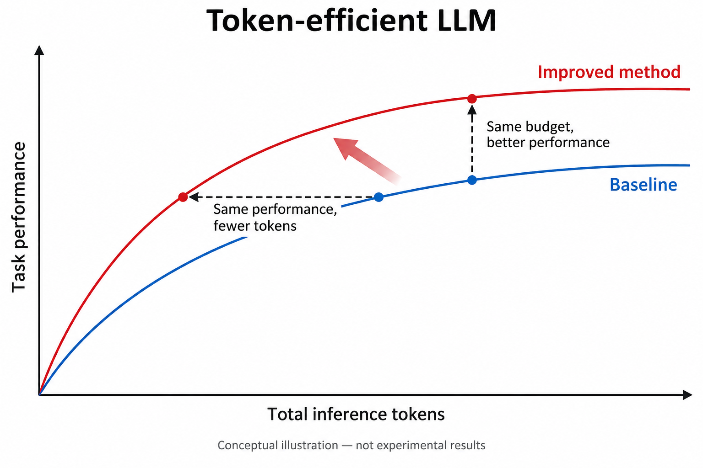
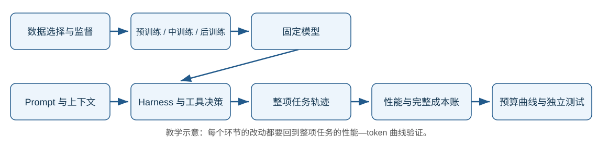

# 00 总论：围绕性能—token 曲线，研究路线怎样连接

[返回目录](../README.md) · [下一章：数据准备](01-data.md)

这个领域没有一项称作“token 效率”的统一技术。研究者分别在改变模型学到什么、需要写多少推理、运行时读哪些信息，以及整项任务要调用多少次模型。**本地图优先讨论保持任务性能、向左减少 token 的方法**；极大预算下冲击能力上限是相关分支，但不作为小团队的默认起点。

阅读本章后，应能按问题找到代表路线；再读任一分论，应能识别最近邻方法、比较证据并提出有差异的实验。检索截止日为 **2026-09-09**，分类和证据缺口见[覆盖索引](../sources/coverage.md)。

## 1. 共同目标与三本成本账



这是保留的概念插画，没有模型实验数值。在固定任务与判分下，横轴是完成整项任务的实际模型输入+输出 token，纵轴是性能。降低预算上限、缩短单轮上下文或提高某个综合分，都不自动证明曲线向左移动。

一次任务有若干模型调用，主口径为：

```math
C=\sum_k (I_k+O_k).
```

其中输入 $`I_k`$ 包含真正读入的历史、工具定义和观察；输出 $`O_k`$ 包含可取得用量的思考和回答。部署中的摘要器、路由器、子代理、验证调用、重试全部计入。工具文本只有读入模型时进入这本账，不能在工具返回和下一次输入重复记一次；反复重读则每次都记。

| 账目 | 包含什么 | 如何用于选题 |
| --- | --- | --- |
| 部署账：主横轴 | 所有方法侧模型调用，包括失败 | 检验同样任务质量是否更少 token |
| 开发/训练账 | 教师采样、提示搜索、训练与适配 | 判断小团队能否承担、能否摊销 |
| 评测账 | 独立 grader、模拟用户、环境运行 | 判断证据生产是否可重复、可扩展 |

缓存命中仍是输入 token，但可能更便宜；隐藏思考用量不可得时标为缺失；不同 tokenizer 额外报参考分词或字节长度。latent、视觉 patch 与扩散步另列内部计算，不能当作零成本。正式定义、成对统计与原生基准分见[09 章](09-evaluation.md)，完整手算见[技术专题](technical/00-overview.md)。

## 2. 先看全图：每个阶段究竟在改变什么



保留图展示生命周期；下面的表展示其中相互竞争或可组合的路线。箭头表示研究问题或方法的演进关系，不表示所有后作都优于前作。

| 阶段 | 主要研究路线与代表方法 | 一句话区分 | 当前证据位置 |
| --- | --- | --- | --- |
| [数据](01-data.md) | FineWeb/DCLM；DoReMi；Rho-1；s1/最短正确轨迹 | 分别选文档、调领域比例、选 loss 位置、选问题/解法 | 前三类主要提高训练能力；轨迹选择更直接影响输出长度 |
| [预训练](02-pretraining.md) | Chinchilla→Beyond Chinchilla；Tokenizer Choice→BLT；NTP→MTP | 分别重配训练/部署成本、改变表示、预测多个未来位置 | 不等于天然少说话；要另测部署曲线 |
| [中训练](03-midtraining.md) | DAPT/TAPT；长上下文数据工程；Rho-1；SmolLM3 分阶段配方 | 补领域知识、扩可读范围、强调有用信号、协调能力/模式 | 能力基础，部署长度直接证据较少；中训练并无统一边界 |
| [SFT/蒸馏](04-sft-distillation.md) | System2→1；最短自训练；C3oT/TokenSkip；CoT-Valve；GKD/OPD | 隐去过程、选短解、压缩文字、控制长度、在学生前缀上教学 | 若干直接缩短结果，也有困难推理能力损失 |
| [偏好优化](05-preference-rl.md) | RLHF/RLAIF→DPO/SimPO；TALE/DAST | 反馈来源、优化器、预算/难度偏好分别是不同变量 | 通用偏好训练不是效率结果；长度偏好需要难度校准 |
| [RLVR/Agentic-RL](06-rlvr-agentic.md) | O1-Pruner/Arora–Zanette；L1；Search-R1/ReTool | 按题惩罚冗长、训练服从预算、学何时用工具 | 数学输出较易验证；开放工具场景完整成本仍有缺口 |
| [Prompt/上下文](07-prompt-context.md) | DSPy/GEPA；LLMLingua 系列/RECOMP；遮蔽/摘要；ReadAgent/AgentFold；软压缩 | 改行为、少读无关文本、维护可回读状态，或换成连续记忆 | 输入节省较直接；可能增加轮数、漏证据或转移计算 |
| [Harness/编排](08-harness-agents.md) | ReAct→LLMCompiler；FrugalGPT→RouteLLM；SC/ToT；S²-MAD/AgentPrune；BATS/DEER | 决定谁执行、如何搜索通信、何时停止 | 省钱、提速与省 token 必须分别看；多代理不自动经济 |
| [评测](09-evaluation.md) | OckBench/OTB；THINK-Bench；AppWorld/网页/桌面/SWE；CostBench | 分别看长度折中、过程、状态成功和有价格的决策 | 互补且会重叠，没有单一原生指标完整覆盖主目标 |
| [相邻方向](10-other-directions.md) | 投机解码/EAGLE；Coconut/CODI/Huginn；Dream；FastV/PruMerge | 少大模型串行调用、换推理表示、去噪生成、压视觉位置 | 改善的常是计算或内部表示，须和文本 token 分开 |

读图时还要看到跨阶段关系：TokenSkip 用输入压缩器生成输出压缩训练标签；TALE 同时涉及预算预测和后训练；Agentic-R1 主要通过蒸馏学习工具策略；MTP 同时涉及训练目标与推测解码。这正是仅按训练阶段列名词容易遗漏的部分。[交叉索引与来源](../sources/coverage.md)

## 3. 数据、预训练和中训练：把运行时的困难提前解决

**数据路线的核心是“学什么”，而不只是“有没有脏样本”。** FineWeb/DCLM 在受控预算下比较过滤；DoReMi 调领域份额；Rho-1 即使读入全文，也只让部分位置贡献训练损失。它们可以让同规模模型更有能力，却没有因此证明任务输出会缩短。到 s1、最短正确自训练，选择对象变成题目和解法：前者保留少量高价值难题，后者保留同题较短的正确路径。二者不能用“小数据”混为一谈。[数据原文链](../sources/early-stages.md)

**预训练存在两种不同的经济问题。** Chinchilla 研究给定训练算力如何分配参数量和训练数据；Beyond Chinchilla 将后续部署量纳入，研究是否值得多训练一个更小模型。Tokenizer Choice/BLT 改变同一内容怎样编码，MTP 则让模型同时学习多个未来位置。这些方案可能降低部署计算或改进能力；MTP 加速逐字生成并不等于模型生成更少字。[02 章实验边界](02-pretraining.md)

**中训练将“通用能力”变成“特定使用条件下的能力”。** DAPT/TAPT 让模型熟悉领域/任务文本；长上下文数据工程处理长文分布与长度；分阶段配方平衡语言、代码、推理与模式。若模型更懂领域，它可能少检索少试错；但能读128K也可能只是读得更多，不能把窗口扩大当作效率证据。[03 章](03-midtraining.md)

对小团队，前两阶段主要是选择和复用已有模型配方的知识。除非发现能用公开小模型验证的明确机制，不应把自建大语料、从头训练和专用架构视为默认成本。这里限制的是科研与计算投入，不是安装环境的难度。

## 4. 后训练：少写过程、选更好路径，还是学会停下来

SFT 与蒸馏至少有五个竞争问题。**答案蒸馏**试图将昂贵推理内化成直接回答；**最短正确自训练**从已有解里选短解；**C3oT/TokenSkip**分别通过改写和删词压缩表达；**CoT-Valve**学习可调长度的参数方向；**GKD/OPD**让教师在学生实际访问的前缀上纠错。最后一种主要解决训练/部署分布差异，本身没有“必须变短”的目标。[04 章](04-sft-distillation.md)

区别有实际后果。System2→1 蒸馏在若干任务成功，却在原论文 GSM8K 设置中由52.77%降到7.13%；不能把省掉推理都叫作学会了隐式推理。TokenSkip 某个 Qwen14B/GSM8K 配置从约313降至219 CoT tokens、分数接近，但高压缩和困难任务仍会退化。这些是各自设置下的证据，不构成两个方法的横向排名。[原文卡 P02/P05](../sources/posttraining-map.md)

**偏好训练将“想要怎样的回答”变成比较信号。** RLHF/RLAIF 说明反馈来自人还是AI；PPO、DPO、SimPO 说明怎样更新。TALE 寻找/预测预算，DAST 则把题目难度和正确长度一起用于偏好选择，避免所有题一律越短越好。用 DPO 训练过，不等于已研究 token 效率；贡献可能在偏好构造而非优化器。[05 章](05-preference-rl.md)

**RLVR 进一步在生成过程中学习取舍。** O1-Pruner 用参考模型校准长度与正确性，Arora–Zanette 用题内长度统计，L1 则训练模型服从用户预算。GRPO 是其中可用的更新工具，不能决定奖励是否经济。Search-R1/ReTool 将搜索和代码执行加入动作空间，可能把很长的文字计算交给工具，也可能增加搜索次数与回传内容。需要从回答长度转向整个任务的输入、输出、失败与验证。[06 章](06-rlvr-agentic.md)

## 5. 上下文：减少重复读入，又允许找回细节

这里首先区分**选择、压缩与记忆**。RECOMP 从检索结果中挑证据或摘要，无益时可以不添加；LLMLingua 从文本里删 token，LongLLMLingua 加入问题相关性和排序，LLMLingua-2 改为监督重要性分类器。它们处理的是本次输入。AutoCompressors/ICAE 一类软压缩则训练连续记忆表示，需要模型内部接口，不能直接当作黑盒 API 的短文本。[07 章](07-prompt-context.md)

长任务还有另一个维度：同一日志被读了多少次。Observation masking 不再回传旧的大段观察；摘要将历史改写；ReadAgent 保留 gist 并按需回读；AgentFold 主动折叠不同粒度的历史。较高级的记忆方式增加了压缩与管理开销，必须击败简单遮蔽基线。The Complexity Trap 的软件任务结果表明摘要有时延长轨迹，某些模型模式也会损失成功率。[上下文原文链](../sources/context-agents-map.md)

DSPy/GEPA 改的是指令与调用程序，可以与这些信息管理方式组合。其离线提示搜索属于开发账；部署时长提示和额外模块仍进入主账。它们给出自动优化路线，尚不能替代对 token 目标和泛化集的明确设计。

## 6. Harness：让哪些调用发生，哪些不必发生

ReAct 把思考与工具反馈交替起来；LLMCompiler 将能预先确定的依赖表达成图，程序化工具调用则让代码批量执行并筛选结果。这里节省的是让模型反复表达和读取确定性控制流的开销。按需 tool search 减少预载工具说明，属于另一个可组合变量。[08 章](08-harness-agents.md)

FrugalGPT/RouteLLM 分配强弱模型，主要目标常是费用；Self-Consistency/ToT 通过多次采样或搜索提高预算收益，可能花更多 token。S²-MAD/AgentPrune 则控制多代理的参与者、接收者和通信边。它们相对昂贵讨论基线能明显节省，但仍须对照强单代理和同预算独立采样，避免只证明“比最冗长的系统好”。

停止控制又是一条路线：BATS 给出剩余工具预算并组织规划/验证，DEER 用试答和置信度判断是否继续；L1 将预算服从学进模型。预算提示、训练约束和运行时硬限制是三层不同机制。小团队可先研究一层的净收益，再判断是否值得训练内化，不必先开发完整智能体平台。

## 7. OpenAI 与 Anthropic 公开采用了什么

| 企业公开路径 | 能确认的方案 | 不能从披露推出什么 |
| --- | --- | --- |
| OpenAI：InstructGPT→o1/推理模型 | 人类偏好训练、RL 推理、可调 reasoning effort 与自适应思考 | o1 使用 GRPO，或某个长度奖励就是私有实现 |
| OpenAI：Codex 与 API 工具能力 | Codex-Max 发布报告 thinking-token 改善；compaction、tool search、缓存接口 | 加密压缩状态等于 Coconut，或缓存就是少输入 token |
| Anthropic：Constitutional AI→Agent 工程 | AI反馈；just-in-time retrieval、压缩/笔记；lead–worker 研究系统 | 多代理天然更省；一篇厂商博客代表独立行业共识 |
| Anthropic：advanced tool use | Tool Search、Programmatic Tool Calling，按需读 schema 和程序筛选结果 | 工具说明缩短比例等于全任务 token 降幅 |

[企业一手证据和披露边界](../sources/vendor-practice.md)、[Anthropic Agent 工程原文卡 H11/H12](../sources/context-agents-map.md)。公开采用说明工程相关性；内部评测需要按原任务解释，不能和开放论文数字拼成排行榜。

## 8. 目前知道什么，还不知道什么

| 证据状态 | 本地图支持的表述 | 依据与限制 |
| --- | --- | --- |
| 基础范式/采用情况 | 监督训练、偏好反馈、工具反馈循环、上下文管理构成多种公开系统的基础 | InstructGPT/CAI、GKD、ReAct 与企业文档；采用不表示最优 |
| 多方支持的条件性结果 | 某些显式推理、输入和多代理消息含可去除冗余 | 最短自训练/TokenSkip/DAST，RECOMP/LLMLingua，S²-MAD/AgentPrune；研究群组、任务与教师可能相关 |
| 有明确反例 | 无条件删过程、提高压缩率、增加摘要复杂度都可能伤害能力或增加轮数 | System2→1、TokenSkip/PruMerge、Complexity Trap |
| 尚未解决 | 如何在新题族、新环境和新模型下稳定地同质量少 token | 长度服从、难度估计、状态保真、相关错误与验证成本仍不统一 |
| 测量缺口 | 输出节省、美元节省和过程分不能自动支持完整任务前沿 | OckBench/OTB 实现差异、THINK 指标、工具费用与输入重读 |

因此研究地图给出的不是统一最优配方，而是一组可以相互检验的竞争解释。真正有意义的 idea 要指出：已有方法在哪种情形失败，你改变了哪个机制，什么结果会否定你的解释。

## 9. 从地图进入一个可负担的新问题

本地图的选题判断是：**先用现成模型和环境验证状态保留、工具结果选择或停止机制，再决定是否训练。** 数学短链适合作为便宜的机制实验，但已有最短SFT、压缩、偏好和长度RL等密集前作；“GRPO加长度惩罚”本身不够形成新意。[研究机会与模型角色](research-opportunities.md)

起步比较应至少包含默认配置、简洁/预算提示、一个廉价工程基线，以及该路线最近的公开方法。先冻结开发/测试与完整成本账，再按题族和难度分析：短了是因为解法更好、少读了历史，还是提前放弃了难题？只有前两类在质量约束下成立，才支持目标曲线的改善。

每章结尾的“初步 idea—最近邻—待检验差异”用于帮助查重。尚未开展读者或研究 Agent 的对照实验，不能把这种设计直接写成“重复概率显著降低”的实测结论。可检验的验收方案见[交付审查](../meta/research-map-audit.md)。

[下一步：数据准备](01-data.md) · [跨阶段索引](../sources/coverage.md) · [推导与教学代码](technical/README.md)

<a id="00-总论把性能token-曲线向左上移动"></a>
<a id="1-先定义任务再定义效率"></a>
<a id="2-一项任务应该记哪些-token"></a>
<a id="3-不同阶段怎样改变同一张图"></a>
<a id="4-已经有行业共识了吗"></a>
<a id="5-用-grpo-练习区分直觉和准确表述"></a>
<a id="6-从想法到可证伪实验"></a>
<a id="练习"></a>

旧版小节链接已保留。原来的推导、算例和练习见[本章技术专题](technical/00-overview.md)。
