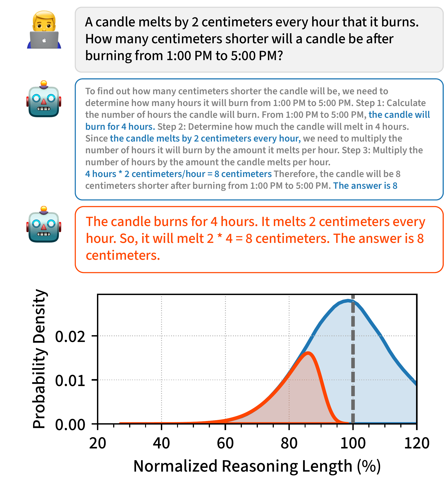
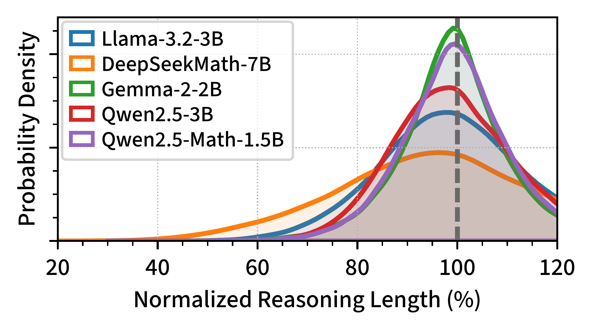
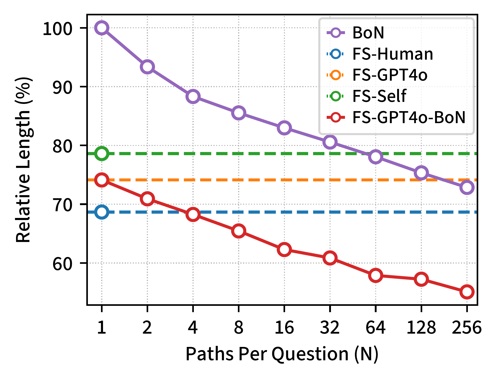
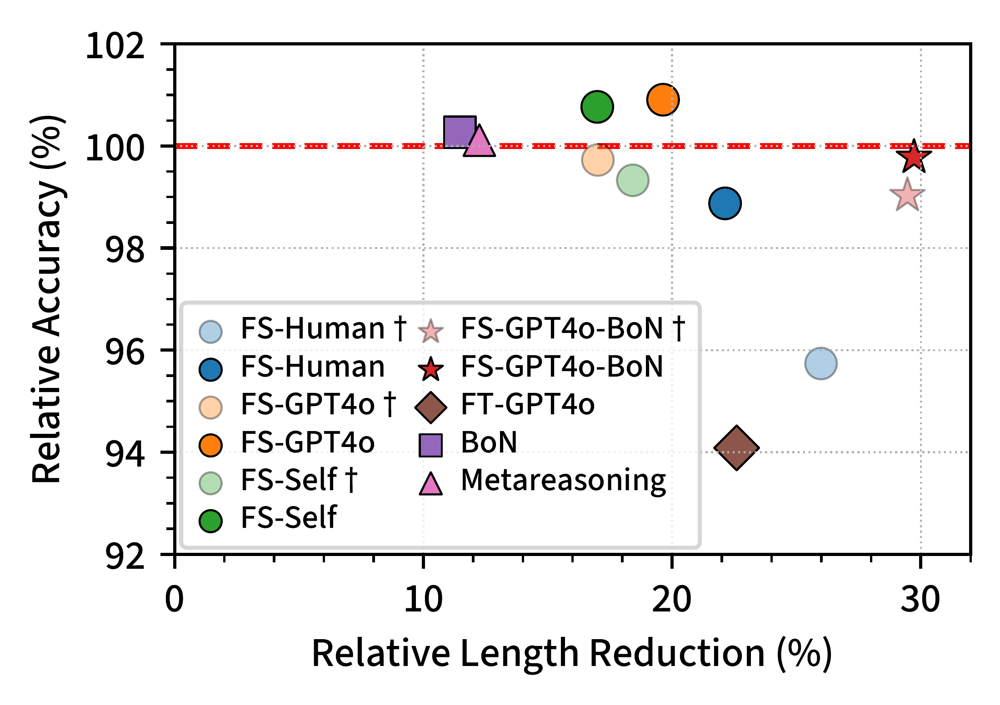
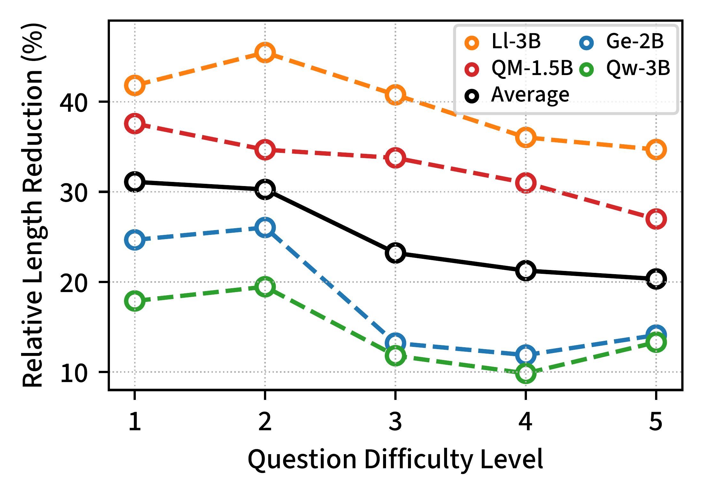
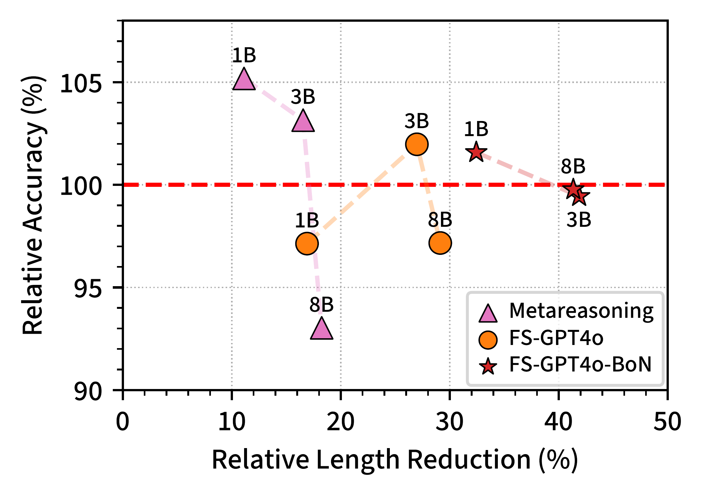
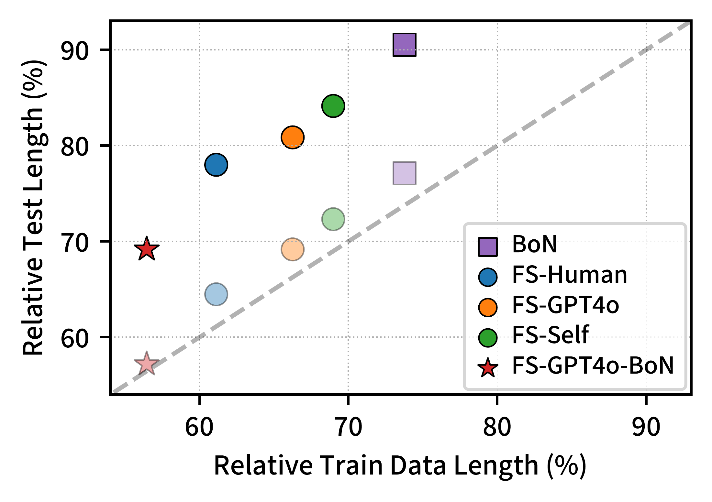

# Self-Training Elicits Concise Reasoning in Large Language Models：正文级中文精读

[所属章节](../index.md) · [来源与阅读状态](../../../sources/papers.json)


**作者**：Tergel Munkhbat、Namgyu Ho、Seo Hyun Kim、Yongjin Yang、Yujin Kim、Se-Young Yun（KAIST AI） <br>
**年份**：2025；Findings of ACL 2025 <br>
**固定版本**：arXiv v3，2025-06-10，26 页 <br>
**原始链接**：[arXiv 摘要页](https://arxiv.org/abs/2502.20122)、[v3 PDF](https://arxiv.org/pdf/2502.20122v3)、[作者代码](https://github.com/TergelMunkhbat/concise-reasoning)

## 实际阅读范围

本文按 v3 PDF 阅读了摘要、正文第 1–5 节、图 1–7、表 1–5，以及正文为理解主结论所需的附录 C、D.1–D.9、E、F 的实验细节、完整结果和样例。arXiv 源码 URL 为 [https://arxiv.org/src/2502.20122v3](https://arxiv.org/src/2502.20122v3)，本次公开读取工具未能取得 tar 源包，因此没有声称复用了作者原始图像资产；图示均用正文图号和 PDF 页码定位。

## 1. 问题：CoT 有用，但默认轨迹可能过长

链式思考让模型通过中间 token 获得额外计算；每个中间 token 都意味着一次顺序解码和一次参数前向，因此输出 token 数会影响解码延迟和推理成本。作者的观察是，模型的默认 reasoning trace 经常重复题意、解释已经显然的步骤、重复措辞；但同一个模型的随机输出分布中已经存在较短且正确的轨迹。论文的核心假设不是“短答案总是更好”，而是：模型已经拥有某种简洁推理能力，只是默认分布没有把它作为首选。用这些模型自身分布中的短正确样本做监督，可以把能力蒸馏回模型，部署时不再需要多次采样或长 few-shot 提示。

图 1 用蜡烛题展示差异：原模型轨迹会先重复“确定燃烧时长”“确定每小时融化量”等题面与步骤，简洁轨迹直接写出 $`4\times2=8`$；两者答案都正确。图 2 则把每道题的正确轨迹长度除以该题多次正确轨迹的平均长度，显示五个模型在 100% 左侧都有相当概率质量。DeepSeekMath-7B 已是绝对长度较短的模型，但仍有 8.37% 的样本能用少于其题目平均正确长度一半的 token 解题（正文 §2.1，图 2）。

这里的“默认长度”是题目级多次随机生成的**正确路径平均长度**，不是贪心路径长度：贪心输出可能答错，且对表面提示和数值扰动敏感。这个定义适合检验“同一题是否存在更短正确轨迹”，但它是离线分析定义，不等于实际部署时每题都能得到该平均值。

 **图 1（PDF 第 1 页）**：上方为冗余的原模型轨迹，下方为保留关键计算的短轨迹，旁边是 Llama-3.1-8B 在 GSM8K 上正确轨迹长度分布。橙色区域代表作者选作训练的较短正确输出，蓝色区域代表默认输出的典型区域。

 **图 2（PDF 第 2 页）**：Llama-3.2-3B、Gemma-2-2B、Qwen2.5-3B、Qwen2.5-Math-1.5B、DeepSeekMath-7B 的归一化正确轨迹长度核密度。灰线 100% 是每题正确路径平均长度；左侧质量说明“短而正确”并非罕见异常。

## 2. 先排除只改提示词的方案

作者在 GSM8K 上比较默认 prompt、Be Concise、Estimated Budget、Fixed Budget 和四个手工 prompt，在五个主模型上计算准确率与输出长度；MATH 上有对应附加结果（表 1、表 6）。默认 prompt 要求逐步推理并以 “The answer is” 收尾；Be Concise 只追加“be concise”；Estimated Budget 让模型先估算 token 预算；Fixed Budget 约束 100 words；手工 prompt 强调只保留名字、数字、运算等关键步骤。

提示词确实可能缩短输出，却不能稳定守住正确率。GSM8K 平均上，Fixed Budget 把长度降到默认的 67.8%，同时准确率降到 89.9%；也就是约 32.2% 的长度减少伴随 10.1% 的相对准确率下降（表 1）。更激进的 Hand Crafted 4 平均长度只有 48.8%，准确率却只有 61.3%。不同模型差异也很大：某些 prompt 对通用 Llama 有效，对 Qwen2.5-Math 这类任务专用模型几乎没有简洁化效果，甚至会改变错误率。作者因此将提示词实验视为“输出变短—能力受损”的反例，而不是主方案。

## 3. 方法：从模型自己的短正确路径构造监督

### 3.1 朴素 Best-of-N（BoN）

给训练集中的每道题采样 $`N`$ 条 reasoning path，用 Python 解析最终答案，只在正确路径中选择 token 数最短的一条，再以普通监督微调训练模型。选择是**逐题**进行的：不能把所有题的样本混在一起只取全局最短，因为简单题会占据训练集，难题可能完全没有监督。论文明确排除 $`N`$ 条中没有任何正确路径的题（正文 §3.1）。

可跟踪的教学伪代码如下；“正确”依赖数据集 oracle label 与解析器，不是按长度猜测：

```text
for question q in training_set:
    candidates = sample_N_paths(model, q)
    valid = [r for r in candidates if parse(r.final_answer) == label(q)]
    if valid:
        add_to_ft_set(q, argmin(valid, key=output_token_count))
fine_tune(model, ft_set)
```

BoN 的问题是样本效率低。图 3 显示 $`N`$ 与收集到的相对长度大致呈 log-linear 关系：想再压短一点，需要指数式增加生成路径。主实验把 naive BoN 的预算固定为每题 16 条。

### 3.2 Few-shot Conditioning：先改变分布，再取短样本

作者给模型 8 个简洁推理示例，让模型在生成新训练样本时先处于“简洁风格”分布。示例有三种来源：人工 GSM8K CoT（FS-Human）、GPT-4o 生成并人工过滤的示例（FS-GPT4o）、目标模型自己生成并由 GPT-4o 验证的示例（FS-Self）。MATH 的示例按类别抽取：代数两题，其余几何、中级代数、预代数、数论、计数与概率、微积分预备各一题，避免 8-shot 全部被简单或单一类别占据。

FS 在只生成一条路径时已经能明显变短；图 3 中 8-shot 的水平线比 naive BoN 取 $`N=256`$ 还短，说明 few-shot 比盲目增加采样更高效。最终方案 FS-GPT4o-BoN 在 8-shot 条件下再采样多条候选，并在其中取最短正确路径。作者认为 few-shot 改变分布、BoN 做局部选择，两者的收益近似可加。

### 3.3 为什么仍要训练，以及为什么要做 augmentation

直接在测试时使用 few-shot + BoN 会带来长输入提示和重复采样，表 5 显示这会把推理前处理成本推高；微调的目的就是把这部分分布移动内部化，部署时恢复为一次普通贪心解码。FS 的弱点是固定的少量示例可能让难题生成不出足够长的正确轨迹，也可能让极简单题保留不必要步骤。

因此对每道题把 FS（1 条）或 FS-BoN（16 条）候选，与默认零样本分布另采的 $`N=16`$ 条候选合并，再从合并池取最短正确路径。这一 augmentation 不是把所有题混选，而是给每题保留一条“难题可能需要更长推理”的后备覆盖。作者将其默认用于 FS 方法，并在图 4 及表 2 的 “No Aug” 行消融。附录 D.5 显示 augmentation 会把先前不可解的长正确样本加入训练集，也会用更短的默认样本替换已有解；平均训练样本长度变化不大，但正确训练样本数增加，准确率因此提高。

 **图 3（PDF 第 4 页）**：横轴为每题路径数 $`N`$，纵轴为相对长度；曲线包含 BoN、FS-Human、FS-GPT4o、FS-Self、FS-GPT4o-BoN。图的重点是单纯扩大 $`N`$ 的边际收益递减，而 8-shot 条件能在很小生成预算下直接把分布推向更短区域。

## 4. 实验设计与成本口径

主模型为 Llama-3.2-3B、Gemma-2-2B、Qwen2.5-3B、Qwen2.5-Math-1.5B、DeepSeekMath-7B；规模实验另用 Llama-3.2-1B、3B 和 Llama-3.1-8B。任务是 GSM8K（训练 7,473、测试 1,319）和 MATH（训练 7,500、MATH-500 测试 500），均为 MIT 许可的英文数学推理数据。选择这些任务的条件是：CoT 对任务有明显作用、最终答案而非解释被评分、模型准确率处于可观察的中等区间。

指标有两个。accuracy 用 Python 解析最终数值答案；length 是评测集**所有输出**（包括错误输出）的平均输出 token 数，因为错误轨迹同样消耗部署成本。相对准确率是方法准确率除以基线准确率，相对长度是方法平均长度除以默认零样本平均长度；评测统一使用贪心解码。输入 token 没有纳入主成本指标：不同方法输入大体相似，而输出 decode 是顺序过程，单 token 延迟更高。训练数据生成和分布分析使用 $`T=0.7`$ 采样，GSM8K/MATH 最大输出分别为 512/1024 token；微调 batch size 16、1 epoch、学习率 $`10^{-5}`$，最多 469 steps，使用 bfloat16。主实验共约 1,000 H100 GPU hours；作者强调真正占预算的是生成，微调相对很小。

预算匹配：naive BoN 每题 16 条；Rational Metareasoning（RM）为 4 次迭代、每次 4 条；FS 单独 1 条；FS-BoN 为 16 条再加默认分布 16 条。作者另给 Budget-Matched 版本，使用 8 条 few-shot 分布 + 8 条默认分布。

## 5. 主结果：短很多，但保留能力取决于组合方式

表 2 是五模型平均结果。GSM8K 默认基线准确率 78.06%、长度 241.87 token。FS-GPT4o-BoN 的准确率 75.88%（相对 97.00%），长度 153.38 token（相对 64.25%，即减少 35.75%）；预算匹配版本准确率 76.24%（97.44%），长度 160.59（67.15%）。MATH 默认 46.40%、480.37 token；FS-GPT4o-BoN 为 47.36%（相对 102.56%）和 364.33 token（76.30%，减少 23.70%）；Budget-Matched 为 47.52%（101.58%）和 384.43 token（80.43%）。所以摘要所说的“平均约 30% 输出 token 减少且平均准确率保持”是跨两个数据集、五个模型的聚合表述，单个数据集存在 GSM8K 的约 3 个百分点相对下降，也存在 MATH 的相对上升，不能写成每个模型都无损。

对照组揭示了组合的必要性：naive BoN 的 GSM8K/MATH 相对长度为 87.17%/89.89%，平均只减少约 12%/10%；RM 与它相近，说明额外的 utility reward 和四轮 expert iteration 并未同时带来更高准确率和更短轨迹。外部人工 CoT 与 GPT-4o CoT 微调能缩短，但相对准确率分别只有 83.82%/75.61%（Human）与 97.65%/90.52%（GPT-4o），明显不如保持模型自身分布的 self-training。Direct Answer 的长度几乎为零，却只有 19.70%/15.08% 的绝对准确率，构成“压掉 CoT 也压掉能力”的反例。

FS-Human 的 GSM8K 长度更短（161.72 token，67.96%），但 MATH 只有 87.78% 相对长度，且准确率下降更明显；FS-GPT4o 与 FS-Self 更稳。FS-GPT4o-BoN 取得最大压缩，但未必每个单模型都是最优：例如主表的 Llama-3.2-3B GSM8K 为 119.89 token、77.79% 准确率，Qwen2.5-Math-1.5B 为 124.56 token、80.74% 准确率；DeepSeekMath-7B 为 124.14 token、80.74% 准确率。完整 per-model 结果见表 13（GSM8K）和表 14（MATH），应与聚合值一起读。

 **图 4（PDF 第 6 页）**：横轴为相对长度减少率，纵轴为相对准确率；相同颜色/形状表示相同 FS 来源，浅色点为无 augmentation。FS-GPT4o-BoN 位于更靠右且总体接近 100% 准确率的位置；外部 GPT-4o CoT 位于 self-training 方法形成的较差 Pareto 区域。图表达的是平均 trade-off，不是每一道题的保证。

## 6. 难度、覆盖偏差与长度迁移

**难度适配。** MATH 难度 1–5 从基础代数到高级微积分。图 5 显示简单题（难度 1–2）的长度减少率约 20%–40%，难题减少更少。作者将其解释为：原模型在简单题上有更多冗余，微调后能够少写；难题仍保留细节。这一结果支持“按问题复杂度分配预算”，但它是分组平均相关现象，不能证明模型先显式估计难度后再决定预算。

**覆盖偏差。** 逐题选择是关键的覆盖保护。附录 D.3 在不做 augmentation 的 FS-GPT4o-BoN 上比较“每题选最短”与“跨所有题全局选最短”：前者平均相对准确率 99.03%、相对长度 70.54%，后者长度更短至 64.33%，但准确率降到 96.03%；Gemma-2-2B 的准确率尤其从 90.53% 降到 75.81%。这直接说明只追求全局最短会过采样容易题、丢掉难题监督。augmentation 则用默认分布补回难题的正确样本。

**长度是否真的迁移。** 图 7 将只含正确样本的训练数据相对长度与测试输出长度关联：短训练样本对应短测试输出，说明微调把数据分布的长度属性迁移给模型，而不是只在训练集上筛出好看的样本。作者没有把这种相关性写成严格因果证明；正确样本训练长度与评测集所有输出长度的口径仍不同。

 **图 5（PDF 第 7 页）**：横轴 MATH 难度等级，纵轴 token 减少率，分别画四个模型和平均线；难度越高，减少率越低，显示压缩保留了难题的更长推理需求。

 **图 6（PDF 第 8 页）**：Llama 1B、3B、8B 的规模实验。模型越大，FS 方法的压缩率总体越高；准确率保持与规模没有强单调关系。FS-GPT4o-BoN 在三种规模均比 RM 和单独 FS 压得更多，8B 上尤其能保持相对准确率。

 **图 7（PDF 第 8 页）**：训练数据相对长度与测试长度的散点关系；实心点为所有测试输出，浅色点为正确输出。它支持“监督长度被微调迁移”的机制解释。

## 7. 反例、扩展和实际效率

跨任务实验把在 GSM8K 上训练的模型测试到 MATH，或反向测试。GSM8K→MATH 的相对准确率 99.21%、相对长度 88.34%；MATH→GSM8K 为 98.53%、90.36%（表 9），即 OOD 仍有约 10–12% 压缩，但不是主任务内的 24–36% 压缩。MMLU-Pro 的 business、chemistry、physics 上，三模型随机 7:3 划分的 FS-GPT4o-BoN 平均相对准确率 116.51%、相对长度 73.18%；naive BoN 为 119.10% 和 92.16%（表 10）。这说明方法不只适用于数学，但这些领域结果来自较小的三模型集合和随机划分，不能外推到所有知识任务。

不同 8-shot 示例集的稳健性见表 11：Llama-3.2-3B 与 Qwen2.5-Math-1.5B 在 GSM8K、MATH 换用两组随机示例后仍明显缩短，但具体长度会波动。例如 Llama GSM8K 从原始示例 119.89 token 变为 114.23 或 128.93；Qwen Math 从 124.56 变为 125.04 或 146.60。因而“对 exemplar 不敏感”应理解为总体趋势稳健，不是长度点估计完全不变。

真实工程指标也有报告。单张 H100、vLLM 上，GSM8K 1319 题的 Llama-3.2-3B 从 16 秒降到 10 秒（37.50%），Qwen2.5-Math-1.5B 从 17 秒降到 8 秒（52.94%）；MATH-500 分别从 17→13 秒（23.53%）和 13→11 秒（15.38%），表 7。固定 batch size 128、HuggingFace 解码的峰值显存只降 2.50%–6.25%（表 8），远小于 token 和时间下降；vLLM 会自动占用可用显存，因此作者没有把其默认显存读数当作比较。

样例也揭示压缩主要删什么。表 3 的 Llama-3.1-8B 题目“长袍需要 2 bolts 蓝纤维和一半白纤维”中，原轨迹重复题意并列出三步，微调后直接写 $`2/2=1`$、$`2+1=3`$。表 15–18 中 Llama 和 DeepSeek 的样本呈现相同模式：删掉题意复述和礼貌性句子，保留数值运算；这不是把推理改成只报最终答案。

## 8. 与 token 效率研究的关系

本文实际优化的是**输出 token 数**，并以 wall-clock decode latency 作为辅助验证；没有测量总 token、FLOPs、每题 monetary cost、训练摊销后的完整成本前沿，也没有研究隐藏 reasoning token 或多轮 agent 轨迹。它的优势在于把“短正确样本的存在”转成可部署的一次贪心生成：训练阶段可以花生成预算，部署阶段减少输出。若服务场景输入很长、输入价格占主要部分，本文的输出口径不能直接等于总成本下降；若题目需要可审计的完整证明，删掉冗余的同时也可能删掉用户需要的解释，论文的只评分最终答案设定没有覆盖这一约束。

局限还包括：主结果是中等规模、英文、数学为主的模型；self-training 的正确性依赖 Python answer parser，MATH 对 Gemma/Qwen 使用了模型特定增强解析器；FS-GPT4o 依赖外部 GPT-4o 生成示例，FS-Self 的 8 个示例仍用 GPT-4o 逐一验证；训练数据生成约占 1,000 H100 GPU hours，不能忽略离线成本；augmentation 虽补足难题覆盖，却同时增加默认分布的生成预算。最后，“模型拥有潜在简洁能力”由随机轨迹分布与迁移实验支持，但没有因果实验隔离词法删减、提示风格和监督选择的全部作用。

**可复用判断**：若要把该方法用于新的推理任务，应至少保持三项约束：按题目而不是全局选择短正确路径；给难题保留默认分布的后备样本；将训练生成成本与部署解码收益分开核算。否则可能得到更短的平均输出，却只是因为训练集覆盖偏向简单题，或因为模型退化为直接回答。
