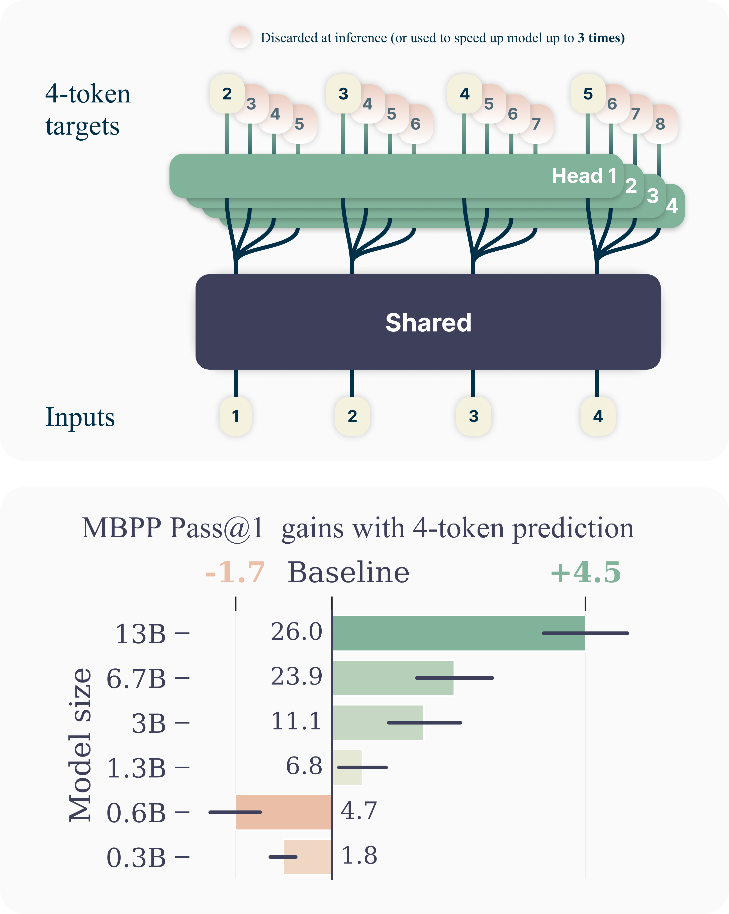

# 02 预训练：从预测下一个 token 到理解样本效率

上一章：[数据](01-data.md) · [返回总览](../README.md) · 下一章：[中训练](03-midtraining.md)

## 学习目标

本章解释自回归语言建模如何把文本变成学习信号，推导下一 token 预测的损失，理解分词、数据选择和多 token 预测各自改变什么。你还会运行一个小型分词器和二元语言模型。它们足以说明概率与计数，不代表 Transformer 的推理能力。

预训练通常让模型从广泛文本中学习可迁移的表示与生成能力。这里先讨论常见的自回归范式；掩码语言模型、扩散语言模型等也存在，不能把本章公式理解成所有语言模型的唯一训练方式。更好的预训练可以提高固定部署预算下的能力，但训练样本效率、计算吞吐和完成任务的 token 效率必须分别测量。

## 1. 直觉：一句文本提供许多有条件的预测题

对“模型 预测 下一个 词元”，模型可以在看到“模型”时预测“预测”，看到“模型 预测”时预测“下一个”。真实的 tokenizer 可能把这些词切成不同的单元；为了讲解，先把空格分隔的项视作 token。

训练时，前缀来自数据中的真实文本，目标也是数据中的下一个 token。这个做法称为 teacher forcing。推理时，前缀可能包含模型自己采样出来的内容，因此某一步的错误会改变后续条件。训练损失是在数据前缀上测得的；实际任务表现还受自生成前缀、停止策略和工具交互影响。


*图 1：本教程自制概念图。上方表示不同监督目标；下方强调从目标改善到部署 token 曲线仍需要评测。箭头表示信息条件，不表示作者实验得到的数值收益。*

## 2. 从序列概率推导训练损失

令原始文本为 $`s`$ ，固定 tokenizer 为 $`T`$ ，编码序列为 $`z_{1:L}=T(s)`$ 。 $`z_t`$ 是词表 $`V`$ 中的离散编号， $`L\gt 0`$ 为序列长度。为简化表述，序列包含结束标记；初始前缀由起始标记提供。概率链式法则给出：

```math
p_\theta(z_{1:L})=\prod_{t=1}^{L}p_\theta(z_t\mid z_{\lt t}).
```

这是按顺序展开联合概率的恒等关系。模型的近似在于用有限参数和有限上下文表达每个条件概率，而不是链式法则本身需要相邻 token 独立。

取负对数，把乘积变为求和。对包含 $`N_{\rm tok}\gt 0`$ 个有效目标 token 的语料，常用逐 token 平均负对数似然：

```math
\mathcal L_{\rm NTP}(\theta)
=-\frac{1}{N_{\rm tok}}\sum_{i}\sum_{t=1}^{L_i}
\log p_\theta(z_{i,t}\mid z_{i,\lt t}).
```

NTP 是 next-token prediction，即下一 token 预测。这里默认各有效位置权重相同，padding 不参与损失。把每篇文档的平均损失再平均，则会赋予短文档更高的每 token 权重，是另一个目标，不能不加说明地交换。softmax 为各词表项提供正概率，避免对零取对数。

为什么这个目标有意义？令 $`P(v\mid c)`$ 是数据在前缀 $`c`$ 下的真实条件分布。固定这个前缀，在有限词表、模型对真实分布支持集给出正概率的条件下：

```math
\mathbb E_{v\sim P(\cdot\mid c)}[-\log p_\theta(v\mid c)]
=H(P(\cdot\mid c))+
D_{\rm KL}\!\left(P(\cdot\mid c)\Vert p_\theta(\cdot\mid c)\right).
```

第一项是数据自身的不确定性，与模型参数无关；第二项衡量预测分布和数据分布的差异。训练是在数据出现的前缀上压低这种差异。它不直接要求模型遵守“给出最短正确解答”，因为这一偏好必须体现在数据或后续目标中。

困惑度定义为 $`\mathrm{PPL}=\exp(\mathcal L)`$ ，前提是损失使用自然对数，并且评估口径固定。不同 tokenizer 的 token 单位不同，PPL 不能直接横比。文本级比较可辅助报告每 UTF-8 byte 的负对数概率，但仍应固定文本、编码、边界与概率计算约定；它也不是任务正确率。

## 3. 数据选择：已有证据与可以迁移的实验方法

“训练数据会影响模型能力”是基础事实；“教育质量过滤在所有任务都最优”则不是。两类代表工作说明如何把前一句变成可检验的实验。

**FineWeb / FineWeb-Edu** 系统研究网页抽取、过滤和去重；教育子集利用模型标注训练分类器。论文报告在所选知识与推理评测上的收益，同时展示某些全局去重选择没有优于逐 crawl 去重。这给我们的启示是：过滤比例越大，并不自动表示有效信息越多。[FineWeb §3–4](https://arxiv.org/html/2406.17557v1#S3)

**DataComp-LM（DCLM）** 提供共同数据池、训练设置和评测任务，以比较筛选与混合方法。其基线研究模型质量过滤，但基线配方不是所有语言、规模和任务的统一答案。可复用的是把数据作为主要变量的实验结构。[DCLM 原论文](https://arxiv.org/html/2406.11794v1)、[官方项目](https://www.datacomp.ai/dclm/)

实际设计时至少分开两个问题。第一，在训练 token 固定时，哪个数据方案产生更好的模型？第二，达到目标能力需要多少训练 token？前者是固定预算比较，后者是样本效率曲线。如果数据选择还改变了文档长度、重复次数或训练步数，就应记录这些变化，否则无法解释收益来自哪一项。

与本教程主指标连接还需要第三步：在同一任务集上测完整推理的成本—性能曲线。例如新底座在不思考模式下就能完成旧底座需要长推理的任务，才可能减少部署 token。仅仅验证集 NTP loss 更低，不能直接得出这个结论。

## 4. 分词：改变计量单位，也改变学习难度

token 不是词的同义词。一个汉字、一个英语词、一段空白或代码符号，都可能被编码成一个或多个 token。BPE（byte-pair encoding）的基本思想是不断合并训练语料中频繁相邻的单元；SentencePiece 提供包括 BPE 和 unigram 在内的子词建模实现。[SentencePiece 官方实现](https://github.com/google/sentencepiece)

令一组非空测试文本为 $`s_1,\ldots,s_m`$ ，一个简单的长度指标是：

```math
r_T=\frac{\sum_i|T(s_i)|}{\sum_i|s_i|_{\rm char}}.
```

这里分母是 Unicode 字符数，而非字节数；语言之间的字符含义不同，所以应分语言、代码和数学表达式分别报告。 $`r_T`$ 越小，表示这些固定文本被切成的 token 越少。它没有说明模型会生成什么，也没有测量真实计算时间。

扩大词表往往能把常见表达编码得更短，却增加嵌入表或输出层规模；具体开销还取决于权重共享、模型维度和推理实现。对于已有模型，替换 tokenizer 会破坏 token ID 与嵌入语义的对应关系，不能只换一个配置文件就期待原能力保留。

跨模型比较还有一个计量问题：模型 A 的一百 token 和模型 B 的一百 token 可能承载不同文本长度。因此对同一底座的方法实验，优先固定 tokenizer；研究 tokenizer 本身时，同时报告各自 token 数、相同原文的字符或字节数、任务质量、延迟和计算资源。这样才能区分编码变化与推理步骤减少。

## 5. 多 token 预测：增加监督，不必然减少输出

Gloeckle 等人的 MTP（multi-token prediction）方法在共享主干上增加多个输出头，用同一个前缀预测多个未来位置。它是一个有实验依据的典型方法，不能替代 NTP 成为本章默认假设。[MTP 原论文](https://arxiv.org/html/2404.19737v1)

为说明条件变量，设共享表示 $`h_t=f_\theta(z_{\le t})`$ ，第 $`k`$ 个头预测 $`z_{t+k}`$ ，最大跨度为 $`K\ge1`$ 。一种简化损失为：

```math
\mathcal L_{\rm MTP}
=-\frac{1}{Z}\sum_t\sum_{k=1}^{K}
\mathbf1[t+k\le L]\,\lambda_k
\log p_{\theta,k}(z_{t+k}\mid z_{\le t}),
\quad
Z=\sum_t\sum_{k=1}^{K}\mathbf1[t+k\le L]\lambda_k\gt 0.
```


权重 $`\lambda_k\ge0`$ ，只计算序列内有效目标。更远的头需要从共享表示预测更远位置，可能改变学习到的表示。但是，第 2 个头的条件中没有第 1 个头实际采样出的 token。把多个头的边缘分布相乘，相当于额外作了条件独立近似；它一般不等于整段未来的真实联合分布。

MTP 可能通过更好的训练信号提高任务质量，也可以用于候选生成与验证以加速解码。前者有机会让性能曲线上移，后者首先改变的是吞吐或延迟。即使一次前向能提交四个 token，最终答案仍可能有相同的 token 数；若用了额外候选模型，内部提案成本还要另记。不能从每秒生成速度直接推断完整任务的 token 效率。



*图 2：Fabian Gloeckle et al.，论文 [Better & Faster Large Language Models via Multi-token Prediction，v1，Figure 1](https://arxiv.org/html/2404.19737v1)；CC BY 4.0；作者原图，无修改。文件来源记录见 [provenance](../assets/papers/provenance.json)。*

原图上半部画出四个头共享主干：在第一个输入位置，四个目标分别对应后面的第 2–5 个 token。下半部是作者在 MBPP 上相对 NTP 的 pass@1 变化；小模型还出现负增益，因此不能把收益外推为任意规模都成立。原图误差线是按数据样本 bootstrap 得到的 90% 置信区间。图中的解码提速说明与下方任务质量结果属于不同指标，都没有直接给出完整任务总 token 的成本曲线。

## 6. CPU 实验：亲手看见 token 和条件概率

运行：

```bash
python3 examples/tokenization_lab.py --mode bpe
python3 examples/tokenization_lab.py --mode ntp
```

[完整代码](../examples/tokenization_lab.py)中的 BPE 从字符起步，允许跨空白合并，并在频次相同时作确定性排序。它保留字符，因此能检查解码后与原文本完全一致；它没有生产级 tokenizer 的字节回退、预分词和特殊 token 规则。

程序只用合成训练文本学习 merge，不在测试句子上学习。英语训练的 merge 对中文句子可能毫无帮助；加入中文训练文本后可以压缩中文词组，但同样的 merge 数量也需要在语言之间分配。读输出时请对比 `chars`、`utf8_bytes` 和 `tokens` 三列，不能把它们混用。

第二个实验使用二元模型，把完整前缀近似为前一个 token。对计数 $`n(u,v)`$ 与平滑系数 $`\alpha\gt 0`$ ，预测为：

```math
\hat p(v\mid u)=\frac{n(u,v)+\alpha}
{\sum_{w\in V}n(u,w)+\alpha|V|}.
```

分母保证同一条件下概率和为一。代码会检查这一点，打印在 `model` 后出现 `reads / predicts / proves` 的概率，以及保留句子的 NLL 和 PPL。词表来自合成训练语料，遇到未知测试词会明确报错，而不会悄悄把测试词拿来训练。

这个模型没有注意力、参数优化和多步规划。它的价值是让损失的分子、分母与条件变量都能看见。把其中的计数表替换为 Transformer，需要张量库和训练基础设施；本章并未执行那种实验。

## 7. 局限与练习

预训练实验通常需要比这个教学例子大得多的规模，小模型的数据排序也未必在大模型上保留。更低损失可能主要改善常见词预测，而对少数高价值任务帮助有限。高频合并也可能改变数字和标识符的切分方式，其下游影响需要任务实验，不能由压缩率直接决定。

1. 把 BPE 的最大合并次数从 24 改成 8 和 48。分别记录三类测试文本的 token 数，不据此推断任务准确率。
2. 将 NTP 示例改成三元模型。明确新条件包含什么；未见过的前缀如何平滑？
3. 用两个相关的随机变量构造反例，说明两个未来位置的边缘概率乘积不等于联合概率。
4. 为“教育数据能让模型少思考”写出最小实验：固定哪些训练条件，部署时测哪些预算，什么结果会推翻假设？

## 主源参考

- [FineWeb](https://arxiv.org/html/2406.17557v1)：抽取、过滤、去重及教育子集消融。
- [DataComp-LM](https://arxiv.org/html/2406.11794v1)：控制数据实验与评测框架。
- [SentencePiece](https://github.com/google/sentencepiece)：真实子词训练与编码工具。
- [Better & Faster Large Language Models via Multi-token Prediction](https://arxiv.org/html/2404.19737v1)：共享主干、多未来位置监督及解码实验。

下一章：[中训练：让现有底座适应领域和上下文](03-midtraining.md)。
