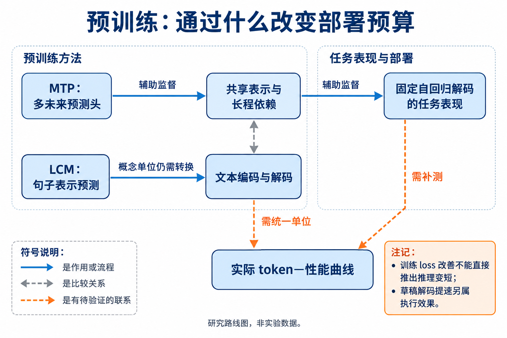

# 02 预训练与 Scaling：更好的底座能否少用外部推理

[上一章：数据](../01-data/index.md) · [总论](../00-overview.md) · [下一章：中训练](../03-midtraining/index.md)

预训练值得研究，是因为模型在部署时需要显式完成的工作，可能已经有一部分被写进参数和表示。问题是哪些训练目标和规模选择改变了这种分工，以及怎样证明它减少了达到相同性能所需的推理 token。训练 loss 更低、预训练样本更少和每秒生成更快，分别回答别的问题。

## 本章地图：三个通向部署的中间环节



本图由主代理综合正文关系后使用 GPT-Image 生成；连线表示文中说明的流程、比较或待验证联系，不表示统一性能排名。

| 路线 | 要改变的中间环节 | 代表入口 | 当前证据位置 |
|---|---|---|---|
| 让表示学习到更远的依赖 | 一个位置不仅学习下一 token，还学习多个未来位置 | Multi-token Prediction | 有代码能力和样本效率结果，缺完整部署 token 前沿 |
| 改变预测单位 | 用字节 patch、句子或概念表示承担不同粒度的计算 | BLT、Large Concept Models | 表示与计算前沿证据，跨单位 token 不能直接等同 |
| 用训练投入换取底座能力 | 让更多题在较低外部预算下可解 | scaling 与 test-time compute 的联合比较 | 有训练/推理计算交换分析，直接归因仍受模型和配方混杂 |

本次补读的高效推理综述在预训练部分也主要讨论 latent/concept 表示和次二次序列计算；不能因为小节叫“预训练”，就把其全部引文当作推理 token 减少的结果。[综述 §预训练相关部分](https://arxiv.org/abs/2503.21614v2)

## MTP：同一个历史表示承担多个预测任务

Gloeckle 等的 Multi-token Prediction（MTP）在共享 Transformer 主干上增加多个未来预测头。训练时，每个位置都利用多个未来 token 的监督；部署时既可以只使用第一个头，也可以把额外的头用于自草稿解码。这两种部署方式让我们能够区分训练目标的作用与解码器的作用。[原论文 §2](https://arxiv.org/abs/2404.19737v1)

设输入历史为 $`x_{\le t}`$，共享主干输出 $`h_t=f_\theta(x_{\le t})`$。第 $`k`$ 个头预测 $`x_{t+k}`$，预测跨度为 $`K\ge1`$。忽略 padding 后，一个说明性损失为：

```math
\mathcal L_{\mathrm{MTP}}=
-\frac{1}{Z}\sum_t\sum_{k=1}^{K}
\mathbf 1[t+k\le T]\lambda_k
\log p_{\theta,k}(x_{t+k}\mid x_{\le t}),\quad
Z=\sum_t\sum_k\mathbf 1[t+k\le T]\lambda_k>0.
```

其中 $`T`$ 是序列长度，$`\lambda_k\ge0`$ 表示各预测距离的权重。上式显式写出边界和归一化，只用于解释多个监督项怎样回到主干；原方法的 head 结构和实验配置以论文为准。

第 2 个头没有看到第 1 个头实际采样出的词。因此，把两个头的边缘分布相乘，不会自动得到真实的未来联合分布。考虑教学分布：未来两个 token 只可能为 `AB` 或 `CD`，各占一半。两个独立边缘头都可以完全学对各位置的分布，但独立采样仍会产生原分布没有的 `AD` 或 `CB`。这解释了为什么额外预测头可以作为监督或候选，却需要明确的验证过程才能作为最终输出。

```python
# 教学例：两个未来位置的边缘分布不能恢复位置间相关性。
first = {"A": 0.5, "C": 0.5}
second = {"B": 0.5, "D": 0.5}
independent = {a + b: pa * pb
               for a, pa in first.items() for b, pb in second.items()}
# AB、AD、CB、CD 都是 0.25；真实联合分布只有 AB 和 CD。
```


图为作者 Figure 1 的既有原资产，上半部展示共享主干和多个预测头，下半部给出代码任务的结果。它连接的是训练结构和所测任务表现；多头数没有直接给出回答压缩率。署名与许可见[既有资产记录](../../assets/README.md)。

### 公平比较和两条效果链

论文的等总参数比较在增加 head 层时减少相应主干层，避免把“额外容量”直接归入训练目标收益。训练实现还依次处理各 head 的 logits/反向传播，以降低同时物化大词表张量的峰值内存。后一个改动改善训练实现，不直接支持部署 token 结论。

第一条链是 **MTP 监督 → 主干表示变化 → 普通自回归解题表现**。只保留下一 token 头仍可观察预训练效果，因此可将解码加速从比较中分离。第二条链是 **额外头提出候选 → 主头验证 → 一次前向接受多个 token**。第二条链改变每个已生成 token 的计算代价，最终序列可以保持原来的长度。[原论文 §3.2–3.7](https://arxiv.org/abs/2404.19737v1)

| 证据 | 比较条件 | 对本章问题的含义 |
|---|---|---|
| 代码任务随规模出现收益，小模型可能退化 | 0.3B–13B，MBPP/HumanEval，多预测跨度 | 辅助目标是否有利依赖容量，不能只引用最大模型 |
| 7B/200B 代码训练中，4-token 方案在部分主指标更好 | 相同训练规模，跨度1/2/4/6/8 | 最佳跨度依任务变化，APPS 与 HumanEval 不完全一致 |
| 自草稿解码达到约3倍代码加速 | 指定 greedy、batch、固定生成长度配置 | 支持生成速度，不说明模型少写了三分之二 |
| 自然语言选择题、GSM8K 等有混合结果 | 不同训练量及预测跨度 | “更远监督有利于推理”仍是有条件命题 |

完整主实验和参数条件见[论文精读](reference/2404.19737.md)。合成 induction 和算法任务支持作者关于长程信息的解释，但相关性、任务上的控制实验与普遍因果结论仍有距离。

## 表示变化与训练投入：怎样避免换一个问题

### Large Concept Models：预测句子表示，还要承担编码与解码

Large Concept Models（LCM）把句子经SONAR编码为连续表示，在这个空间中预测后续句子，再由解码器恢复文字。与逐token预测相比，一个预测位置对应更粗的语义单位，但编码器和文字解码器仍是完整系统的一部分。[原论文](https://arxiv.org/abs/2412.08821)

令第 $`t`$ 句的表示为 $`z_t=E(s_t)`$，Base-LCM可通过平方误差学习预测：

```math
\widehat z_{t+1}=f_\theta(z_{\le t}),\qquad
\mathcal L_{\mathrm{MSE}}=\mathbb E\|z_{t+1}-\widehat z_{t+1}\|_2^2.
```

在平方可积等条件下，平方误差的最优预测对应条件均值。若下一句存在不同方向的合理延续，平均表示未必对应最合适的单个句子。因此论文还研究扩散式连续预测和量化变体，以表达更丰富的条件分布。扩散变体增加去噪步骤，量化改变表示与预测接口，都不能按一个普通token的成本计算。


[查看原图，可放大](../../assets/papers/2412.08821/fig-intro-idea-part-1.pdf) · [论文来源](https://arxiv.org/abs/2412.08821v2)


[查看原图，可放大](../../assets/papers/2412.08821/fig-intro-idea-part-2.pdf) · [论文来源](https://arxiv.org/abs/2412.08821v2)

作者概念图展示文本编码、概念序列建模与文字解码的分工。论文的摘要、摘要扩展、长上下文和多语言实验说明表示路线的用途，也包含SONAR表示脆弱性、固定解码器及规模条件等限制。它没有给出足以把更少概念位置等同为更少端到端token或更低实际延迟的完整证据。[精读](reference/2412.08821.md)

BLT 用局部字节模块和动态 patch 分配大模型计算；Large Concept Models 在句子表示空间预测。它们让“一个预测位置承载什么”成为可研究变量。若一段文本变成更少 patch 或句子单元，token 轴的单位已经改变。应该同时报告原始文本量、内部表示步数、性能与计算，才能判断节省来自更经济的解法，还是更粗的编码。[BLT 精读](../04-architecture/reference/2412.09871.md) · [LCM 原文](https://arxiv.org/abs/2412.08821)

Chinchilla 和 Beyond Chinchilla-Optimal 可以帮助确定训练/部署成本的背景，但本章不会以它们的训练最优配比替代推理 token 问题。联合比较还可从 Snell 等的训练与测试时计算交换分析进入：底座越弱，增加推理未必补回缺失的能力；底座更强，也不意味着外部推理的所有预算都有相同收益。相关实验的横轴包含 FLOPs 假设，应按其原口径阅读。[联合比较](../06-reasoning/reference/2408.03314.md)

## 认识、缺口与最小研究

已有原文支持“预训练目标、表示和模型规模能改变后续任务能力”，也支持这些收益并非跨任务统一。对于“仅改变预训练方案，后训练和部署程序保持可比，在多个实际 token 预算下稳定左移”，本次覆盖仍缺足够直接证据。这个缺口不证明方向无人研究，也不能由训练效率综述自动填平。

适合小团队的切入点是受控比较公开 checkpoint 或小规模辅助目标，而不是从头复制大模型训练。首先在相同 tokenizer、后训练数据和部署策略下比较多个实际预算；再检查收益是否仍存在于不使用草稿解码时。若只见吞吐提高、换 tokenizer 后数字变小，或训练后能力提高但同等性能所需 token 未减少，就应分别报告结果，不能把它们合成一个“推理更省”的结论。

阅读顺序是 MTP 的目标与反例 → 架构章的 BLT/连续表示 → 推理章的训练/测试计算交换。研究想法应明确自己改变的是学习目标、表示单位还是预算策略，才能找到正确的最近邻。
