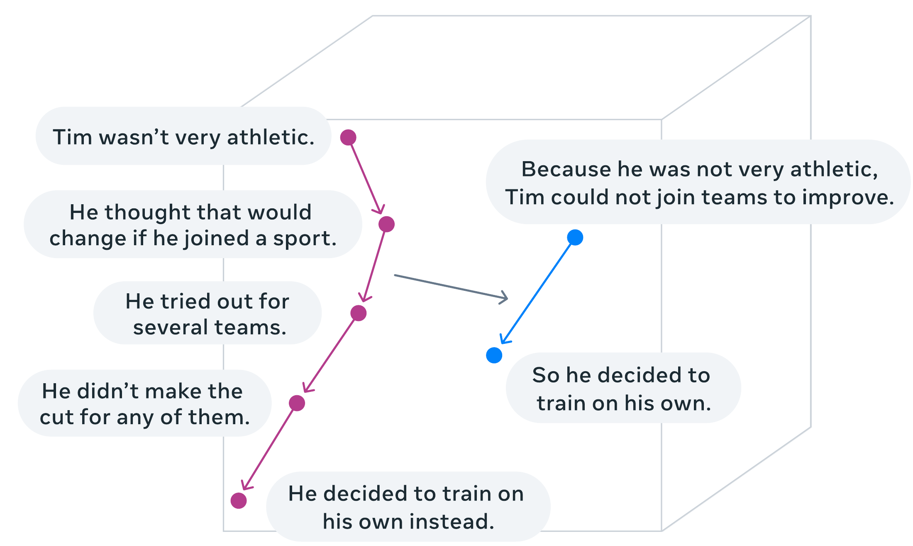
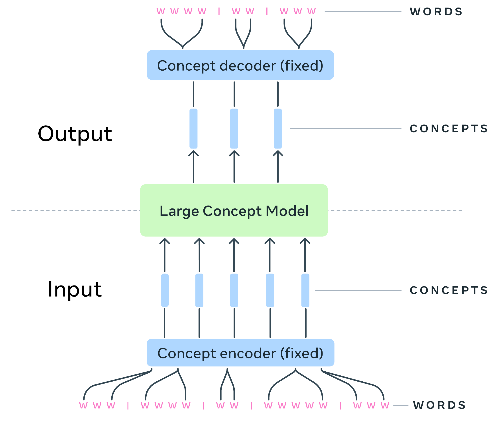
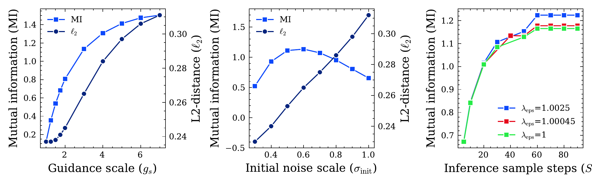
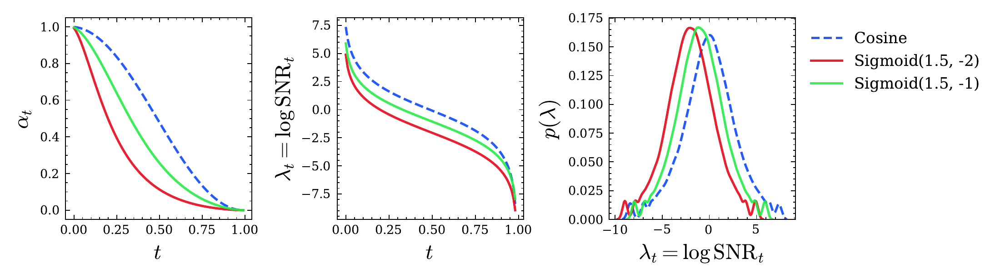
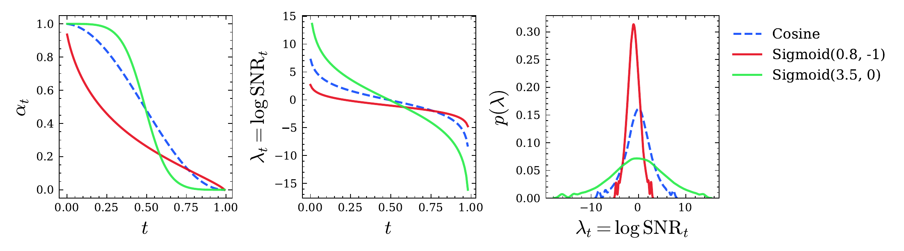
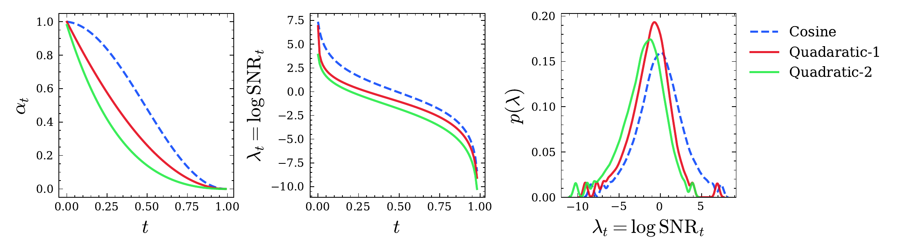
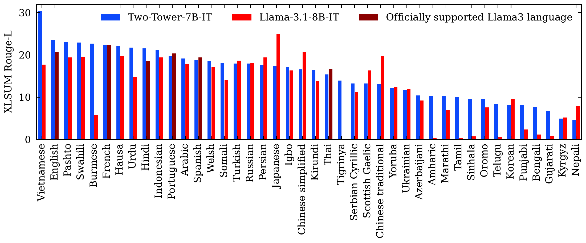
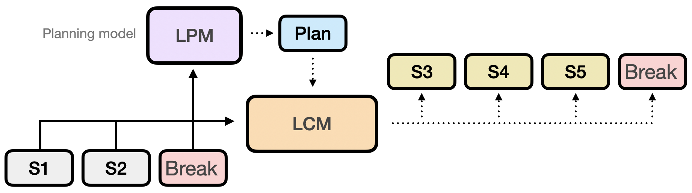

# Large Concept Models: Language Modeling in a Sentence Representation Space

[所属章节](../index.md) · [来源与阅读状态](../../../sources/papers.json)


**作者**：LCM team；Loïc Barrault、Paul-Ambroise Duquenne、Maha Elbayad、Artyom Kozhevnikov、Belen Alastruey、Pierre Andrews、Mariano Coria、Guillaume Couairon、Marta R. Costa-jussà、David Dale、Hady Elsahar、Kevin Heffernan、João Maria Janeiro、Tuan Tran、Christophe Ropers、Eduardo Sánchez、Robin San Roman、Alexandre Mourachko、Safiyyah Saleem、Holger Schwenk（FAIR at Meta） <br>
**年份/固定版本**：2024，arXiv:2412.08821v2（论文标注日期 2024-12-12，v2 页面日期 2024-12-15） <br>
**原始链接**：[arXiv 2412.08821v2](https://arxiv.org/abs/2412.08821v2)，[作者实现](https://github.com/facebookresearch/large_concept_model) <br>
**实际阅读范围**：固定缓存的 `paper.pdf`、`paper.txt` 与作者 LaTeX 工程 `lcm.tex`；完整阅读正文第 1–8 节、正文表 1–13、图 1–17及相关公式。附录只通过正文引用补读了与分段、LPCM 提示词和评价提示有关的必要上下文；未把附录其余内容当作正文结论。

## 先给结论：这到底改变了什么

Large Concept Model（LCM）把语言建模的基本预测单位从离散子词换成“concept”。在这篇 proof-of-concept 中，concept 具体被固定成一句话的 SONAR 句子向量：输入文本先分句，SONAR 编码器把每句映射成一个 $`d_{\mathrm{SONAR}}`$ 维连续向量，LCM 自回归地预测下一句向量，最后 SONAR 解码器把向量还原成文字。因此模型本体既不直接看到输入语言，也不直接输出某个语言的 token；语言和模态主要由冻结的 encoder/decoder 负责。

这不是把一个普通 token 换成一个更大的 token。一个 concept 通常覆盖约 10–20 个 token，但它是经过句子编码器压缩后的固定维度语义向量；编码、解码、分句和句向量内部生成都有真实计算。LCM 的“更短序列”只降低了 Transformer 主体处理的序列长度，并不自动等于端到端的同倍数加速。作者确实报告了理论 FLOPs 曲线：总成本包含 SONAR 编码、LCM 预测、SONAR 解码；平均句长很短（$`le 10`$ tokens）时普通 LLM 反而更便宜，LCM 的优势依赖于足够长的句子和长上下文（§2.5.1，图 13）。论文没有报告端到端 wall-clock、真实吞吐、能耗或完整质量–成本前沿。

文章的实验证据有两层。1.6B、FineWeb-edu 预训练的对比显示，直接 MSE 回归会生成“候选续句的平均向量”，而扩散式 One-Tower/Two-Tower 和量化模型更能保持上下文相关性；其中扩散模型的互信息（MI）稳定较高。7B Two-Tower 在英文摘要、长文摘要和摘要扩展上达到部分可比质量，但仍明显输给强 token LLM 的流利度或若干事实/覆盖指标。它在完全只用英语训练的条件下，通过 SONAR 的多语言空间对 XLSum 做了零样本迁移；这证明了表示空间的迁移能力，不能单独证明 LCM 的推理能力在所有语言上优于 token LLM。

## 1. 动机、对象与端到端数据流

作者观察到当前主流 decoder-only LLM 都做 $`p(x_n\mid x_{<n})`$ 的 next-token prediction。人类在写演讲、论文或长文时，往往先安排较高层的叙事结构，再落实为不同语言的词。LCM 因而试图让模型先在“抽象、语言/模态无关”的空间中进行预测。论文只研究两个层级：subword token 与 concept，并把 concept 的实际代理定义为句子（语音中可对应一个 utterance）。

给文本 $`w_{1:N}`$，分句器输出句子 $`s_1,\ldots,s_N`$。冻结的 SONAR encoder $`E`$ 产生

```math
x_n=E(s_n)\in\mathbb{R}^{d_{\mathrm{SONAR}}}.
```

LCM $`f_\theta`$ 读取前缀向量并生成下一个概念 $`\hat x_n`$；SONAR decoder $`D`$ 再产生

```math
\hat s_n=D(\hat x_n).
```

一旦已有概念序列不变，同一序列可以解码成不同语言或支持的模态。于是摘要、续写等“在概念上”的操作有潜在零样本跨语言/跨模态性质。但这个性质依赖 $`E,D`$ 的共享语义空间和重构质量；LCM 本身不是自动拥有多语言知识的模块。SONAR 的文本空间覆盖 200 种语言，语音输入 76 种语言、英语语音输出，论文还提到实验性 ASL encoder，但本文不使用 ASL（表 1，§2.1）。





图 1 左图把摘要画成 5 个输入 concept 映射到 2 个输出 concept；右图是“分句 → SONAR 编码 → LCM 推理 → SONAR 解码”的总流程，星号表示 encoder/decoder 冻结。读图时最容易误读的是：LCM 输出仍是一列连续向量，不能直接当作文字；每个向量都需要 decoder 才能检查是否落在自然句子流形附近。

## 2. SONAR 表示空间：为什么一个 concept 不是 token

SONAR 是 encoder–decoder 架构：encoder 和 decoder 之间是固定维度 bottleneck，训练目标混合了 200 语言进出英语的机器翻译、去噪自编码以及 bottleneck 的显式 MSE；文本空间训练后再通过 teacher–student 扩展到语音（§2.1，图 2）。LCM 不训练它，而是直接把其 bottleneck 当作概念空间。选择 SONAR 的理由是跨语言语义相似度和 bitext mining 表现、开放可用的多语言 decoder，以及能把文本/语音放入对齐空间。

这个选择同时制造了论文的核心风险：SONAR 主要用短句、双语翻译数据训练。它保证的是局部语义几何，不保证任意松散相关句子的全局概率几何。链接、引用、数字、代码等文本可能有很高的普通重构 BLEU，却对 embedding 的小扰动非常脆弱；这些样本在通用预训练语料中并不少见。因此“连续向量”并不代表句子成为平滑、密集、可随意插值的真实连续数据（§6）。

分句是表示质量的一部分，而不是预处理细节。作者比较规则式 SpaCy 和预测式 Segment any Text（SaT），并给两者加最大字符长度上限。用约 1 万篇文档、约 50 万句做 SONAR encode→decode，指标是重构 Auto-BLEU。无上限的两种方法在长句上明显退化；加 200 字符上限后，SaT Capped 对所有长度略稳定地优于 SpaCy Capped，所以训练数据使用 SaT Capped（§2.2，图 3）。这也意味着 concept 的实际粒度同时受自然句法边界和 200 字符工程上限影响。

## 3. 四类 LCM：定义、训练目标与生成过程

### 3.1 Base-LCM：MSE 预测一个确定向量

Base-LCM 是 decoder-only Transformer 外加输入 PreNet 和输出 PostNet。PreNet 对 SONAR 向量做 robust scaling（减中位数、除 IQR），再线性映射到 $`d_{\mathrm{model}}`$；PostNet 反向线性映射并 denormalize：

```math
\mathrm{PreNet}(x)=\mathrm{normalize}(x)W_{pre}^{\top}+b_{pre},\qquad
\mathrm{PostNet}(h)=\mathrm{denormalize}(hW_{post}^{\top}+b_{post}).
```

对文档向量序列 $`x_{1:N}`$，模型只用前缀预测真值下一句：

```math
\hat x_n=f_\theta(x_{<n}),\qquad
\mathcal L_{\mathrm{Base}}(\theta)=\mathbb E_{x\sim q}\left[\sum_{n=1}^{N}\|f_\theta(x_{<n})-x_n\|_2^2\right].
```

若一个前缀后面有多种合理续句，MSE 会趋向这些候选在 SONAR 空间的均值。均值可能不对应任何自然句子，因而训练时 $`ell_2`$ 低，解码后 round-trip $`ell_2`$ 却不一定低，且上下文互信息差。作者用 `End of text.` 的 SONAR 向量作为训练后缀；推理时若输出与该向量 cosine 相似度超过 0.9，或与上一输出 cosine 相似度超过 0.9，则停止。后一个规则也可能截断重复模式，不能与模型真正学到的停止分布混为一谈。

### 3.2 扩散 LCM：在连续空间拟合下一句的条件分布

扩散的动机是：同一个前缀有多个语义上合理的下一句，应该学习 $`p_\theta(x_n\mid x_{<n})`$ 而非单点回归。固定一个位置，记真值为 $`x^0`$，前向加噪的边缘分布是

```math
q(x^t\mid x^0)=\mathcal N(\alpha_t x^0,\sigma_t^2I),\qquad
x^t=\alpha_t x^0+\sigma_t\epsilon,\quad \epsilon\sim\mathcal N(0,I).
```

方差保持过程满足 $`\alpha_t^2=\mathrm{sigmoid}(\lambda_t)`$、$`\sigma_t^2=1-\mathrm{sigmoid}(\lambda_t)`$，$`\lambda_t=\log(\alpha_t^2/\sigma_t^2)`$ 是 log-SNR。论文比较 cosine、quadratic 和自定义 sigmoid schedule，并把离散方差 schedule 重缩放到 terminal SNR 为零。反向链从 $`x^T\sim\mathcal N(0,I)`$ 开始，网络做 $`x^0`$-prediction；简化目标是

```math
\mathcal L(\theta)=\mathbb E_{t,x^0,\epsilon}\left[\omega(t)\left\|x^0-\mu_\theta(\alpha_t x^0+\sigma_t\epsilon,t)\right\|_2^2\right].
```

默认 $`\omega(t)=1`$，另测 clamped-SNR 权重和根据样本 fragility 的权重。推理采用 $`S=40`$ 个采样步（训练 $`T=100`$），并测试 classifier-free guidance、初始噪声尺度 $`\sigma_{init}`$、guidance rescale 与 epsilon scaling。每一个生成的 concept 都要进行一套逆扩散迭代；因此“一个句向量一步”仍不是一次 Transformer 前向。

**One-Tower。** 单个因果 Transformer 同时接收前缀的干净向量和待预测位置的带噪向量，并拼接对应 timestep embedding。训练时把序列交错成干净/带噪输入，attention mask 保证预测某位置只能看前面的干净句子，不看不应见的噪声；一次前向可对文档中的每个位置取不同 timestep 并并行训练。随机丢弃 self-attention（$`p=0.15`$）提供无条件分支，供 CFG 使用（§2.3.3，图 6–7）。

**Two-Tower。** contextualizer 先用因果 Transformer 编码 $`x_{<n}`$；denoiser 再从噪声向量反复去噪，并通过 cross-attention 读取上下文。denoiser 的每层用 timestep 产生 AdaLN 的通道缩放 $`\gamma`$、偏移 $`\beta`$ 和 residual gate $`\alpha`$：

```math
[\beta,\gamma,\alpha]=\mathrm{SiLU}(\mathrm{embed}(t))W_t+b_t,
\qquad y=x+\alpha\,\mathrm{Block}((1+\gamma)x+\beta).
```

残差块零初始化，初始为 identity。训练时 contextualizer 输出右移一位，cross-attention 用因果 mask；前置零向量使模型可预测第一个句子。随机删除 cross-attention 行（$`p_{cfg}=0.15`$）得到无条件 denoising 样本。Two-Tower 之所以被扩展到 7B，是因为浅 contextualizer 在长上下文时显存更省。

### 3.3 Quant-LCM：把句向量离散化，但仍需多次粗到细预测

作者指出文本句子虽表示成连续向量，真实可生成对象仍是离散、组合的句子集合，所以尝试 RVQ。用 15M 个 Common Crawl 英语句子训练 64 个 codebook，每个 8192 个单位；第 $`k`$ 个 codebook 量化前一轮残差，最终向量是各 centroid 的累加。增加 codebook 数会提高 encode→decode BLEU，但 64 个 codebook 的性能约为连续 SONAR 的 70%（FLORES devtest，图 9）。作者还用 120 万英语句子微调 decoder，让它适应只使用前 $`k`$ 个 codebook 的中间表示。

Quant-LCM 从全零中间向量开始，逐个 codebook 预测 residual centroid 并累加，因此仍有 64 个细化步骤。Quant-LCM-d 对下一个 codebook 的 8192 个 index 做 softmax cross-entropy；为避免输出维度变成 $`64\times8192`$，把 codebook index 作为输入条件。Quant-LCM-c 直接 MSE 预测连续 residual，并可选取最近 centroid，或按

```math
p(c_i\mid\hat r)=\frac{\exp(-\beta\|c_i-\hat r\|_2^2)}{\sum_k\exp(-\beta\|c_k-\hat r\|_2^2)}
```

采样。前者得到离散对比目标和 top-$`p`$/top-$`k`$/temperature 控制，后者更接近连续回归。论文的量化结果较弱，作者将其归因于 SONAR 没有按“高效可量化”设计，64 个 codebook 带来组合稀疏性。

## 4. 1.6B 预训练对比：模型是否学会下一句

### 条件与评价

所有变体约 1.6B 可训练参数，在 FineWeb-edu 上训练 250k steps，32 张 A100，batch size 229k concepts；文档最多 wrap 到 128 句。Base-LCM 为 32 层、$`d_{model}=2048`$、16 heads；One-Tower 为 32 blocks、32 heads、$`T=100`$；Two-Tower 为 5 层 contextualizer + 13 层 denoiser。默认推理 $`S=40`$、$`g_{scale}=3`$、$`g_{rescale}=0.7`$、$`\sigma_{init}=0.6`$、$`\lambda_{eps}=1.00045`$。

评估用 ROC-stories、C4、Wikipedia-en、Gutenberg 的独立 dev/test 子集（表 2）；数据从数千句到 Gutenberg 的数百句/长文不等。teacher-forcing 下报告：

* $`\ell_2=\|\hat x_n-x_n\|_2`$：向量本身的误差；
* round-trip $`\ell_{2-r}=\|E(D(\hat x_n))-x_n\|_2`$：检测输出离开可解码自然句流形后 decoder 的修正；
* CA（contrastive accuracy）：真值句相对同批其他句（排除邻近真值）是否比预测向量更近；
* PAR：预测向量对前文最大 cosine 相似度与真值对应值之比，>1 表示更像复制/改写前文；
* MI：GPT-2 对生成句的无条件与给定前 10 句 perplexity 差，每 token 归一化，衡量上下文互信息。

这组指标不是标准 token likelihood；尤其 MI 用小 GPT-2 评估解码文字，可能受 SONAR decoder 的语言风格影响。

### 主结果（表 3）

Base-LCM 在所有语料上 $`ell_2`$ 最低，例如 C4 0.204、Wikipedia 0.229，但 CA/MI 很差（C4 CA 69.1%、MI -0.105；Wikipedia CA 69.6%、MI 0.071）。这正是 MSE 把多种候选平均掉的现象：向量距离小，不代表落在正确自然句模式上。

扩散与量化模型的 round-trip 误差大致相近，但 MI 通常扩散最高。C4：One-Tower 的 MI 1.110、Two-Tower 1.134，Quant-LCM-c 0.715、Quant-LCM-d 0.359；Wikipedia：One-Tower 1.202、Two-Tower 1.307，Quant-c 0.744、Quant-d 0.323。CA 并非所有地方都扩散占优：C4 Quant-d 81.1% 高于 Two-Tower 75.4%，但 MI 低，说明“更像某个候选”与“和上下文连贯”不是同一指标。Quant-c 比 Quant-d 的 MI 更好，作者推测 codebook index 的交叉熵比连续 MSE 更难学习。One-Tower/Two-Tower 没有跨语料一致的胜负，论文总体结论是扩散变体比 Base/Quant 更适合下一句生成。

在 Cosmopedia stories 上 instruction-tune 后，One-Tower（ROUGE-L 33.40、Coherence 0.968）和 Two-Tower（33.64、0.938）显著高于 Base（23.69、0.482）及 Quant-c/d（30.87/28.01；0.847/0.704），但同数据训练的 1.4B smaLlama 仍最高（34.88、0.984；表 4）。所以“连续概念推理”在 coherence 上有效，却没有超过 token LLM 的整体下游质量。



图 10 的三个 sweep 给出实际推理条件的代价–效果关系：guidance scale 提高会提高 MI，也增加 PAR，同时 $`ell_2`$ 变差；$`\sigma_{init}`$ 在 0.5–0.7 的 MI 最好，较大值通常生成更长句；增加采样步数提高 MI，但收益递减、质量提升很小。论文没有把每步 wall-clock 或 energy 计入质量前沿。







图 5 不是质量图，而是比较 $`\alpha_t`$、log-SNR 和训练时间在各噪声水平的分布。表 5 显示 quadratic-1/2 的 MI 高于 cosine；宽 sigmoid $`(\delta,\gamma)=(3.5,0)`$ 在 C4/Wikipedia CA 最高（80.3%/83.7%），但 $`ell_2`$ 较差。窄、尖的 sigmoid $`(0.8,-1)`$ 更像回归器，MI 和 CA 低。图 11 在不同 guidance 下复核：宽 schedule 的 CA 全面较高、MI 接近 cosine，说明噪声覆盖分布会改变“对比候选”与“回归均值”的倾向，不能只看单一 MSE。

表 6 的 clamped-SNR weighting 没有改善生成质量；fragility weighting 只带来 CA 小幅提升（C4 75.4%→76.5%，Wikipedia 78.8%→80.7%），因此作者仍默认简单 $`\omega(t)=1`$。

## 5. 计算分析与 SONAR fragility

图 13 用理论 Transformer FLOPs 比较 Llama2-7B、Two-Tower-7B 和 1.6B。LCM 的 Transformer 序列是句子数，不是 token 数；作者在 x 轴用总 Llama2 token 数，同时改变平均句长。若 200 tokens 被分成 10 句（每句 20），成本高于分成 5 句（每句 40），因为 concept 数翻倍。曲线显示长上下文时 LCM 的主干复杂度增长慢；但总成本必须加上 (1) SONAR encode，(2) LCM sentence-space prediction，(3) SONAR decode。平均句长 $`le10`$ token 时普通 LLM 更省。图中是理论 FLOPs，不是实测时间或 token 成本；也没有把多步 diffusion 的实现常数完整拆出成可复现的服务价格。

fragility 定义为对 SONAR 向量加不同强度噪声后，解码文本与原文的语义分数下降：

```math
\mathrm{fragility}(w)=-\mathbb E_{\alpha\sim U[0,1],\epsilon\sim\mathcal N(0,I)}[\mathrm{score}(w,w_{\alpha,\epsilon})],
```

其中

```math
x_{\alpha,\epsilon}=\mathrm{denormalize}(\sqrt{1-\alpha}\,\mathrm{normalize}(E(w))+\sqrt{\alpha}\epsilon),\qquad
w_{\alpha,\epsilon}=D(x_{\alpha,\epsilon}).
```

作者用 Auto-Encoding BLEU 或独立 mGTE cosine 作为 score。对 5000 万片段、每片 9 个 $`\alpha\in\{0.1,\ldots,0.9\}`$ 扰动，发现最脆弱的 5% 通常是 hyperlink、reference、唯一 ID、数字、code-switched 或代码；短的技术短语也可能比普通长句更脆弱。长度超过约 250 字符的样本尤其困难，错误分句也会制造短但脆弱的片段。

作者用加噪 embedding 微调 SONAR decoder：在 FLORES/CNN-DailyMail/Gutenberg/C4 上 Auto-BLEU 从基础 decoder 的 79.5/75.9/70.5/75.7 提到 88.0/87.6/85.6/87.5（表 7）。这是 decoder 鲁棒性的证据，不是 LCM 端到端正确性的证据；fragility 的绝对值还显著依赖 decoder 版本（图 14–15）。

## 6. 7B 模型、摘要与摘要扩展

作者选择 Two-Tower 扩展为 7B：5 层 contextualizer、14 层 denoiser、$`d_{model}=4096`$、32 heads；预训练 2.3B 文档、2.7T tokens、142.4B sentences/concepts，124k steps、256 张 A100、batch 1M concepts，最大上下文 2048 concepts。之后按 Chung et al. 风格 instruction tune，数据总 389M sentences，其中 53M 为 answer targets，答案才回传梯度；每个答案后加 `End of response.`。这一训练规模让句子级序列数极大，但并不意味着 142.4B 个概念等价于 142.4B 个互相独立的高质量语义类别。

评价包含 ROUGE-L、源 3-gram overlap OVL-3、重复 4-gram REP-4、CoLA 流利度、SEAHORSE 的 SH-4（归因）和 SH-5（主旨覆盖）。CNN/DailyMail 与 XSum 的输入/摘要句数和 Llama2 token 四分位数见表 9；LCFO 是约 5k words 长文，要求 20%、10%、5% 的摘要。

**CNN/DailyMail 与 XSum（表 10）。** CNN/DailyMail 上 Two-Tower-7B-IT ROUGE-L 36.47，接近 T5-3B 37.56、高于 Gemma 31.14 和 Llama 34.97，但低于 Mistral 36.06 以外的流利度取舍；其 REP-4 0.757，接近 ground truth 0.684，低于 Gemma/Llama 的重复。它的 CoLA 0.767、SH-4 0.723、SH-5 0.459，均低于多数 LLM，且作者指出模型型指标可能偏向 LLM 风格。XSum 上 LCM 的 ROUGE-L 23.71 高于所有列出基线（T5 17.11、Gemma 18.20、Mistral 21.22、Llama 20.35），OVL-3 0.106、REP-4 0.464 较低，但 CoLA 0.683、SH-4 0.358、SH-5 0.284 明显弱。这里“更抽象/少复制”与“更流利/覆盖更多”分开，不能只用 ROUGE-L 宣称全面胜出。

**LCFO 长上下文（表 11）。** LCM 在 5% 条件 ROUGE-L 26.88、10% 29.38，优于 Gemma/Mistral，20% 为 31.74，接近 Gemma 33.32；Llama-3.1-8B-IT 在三种比例分别 37.67/42.85/46.92，显著更高。LCM 的 word ratio 0.060/0.089/0.140，较接近短摘要目标，但 SH-5 0.196/0.183/0.187 低于 Llama 的 0.314/0.310/0.315。作者提醒 Llama 的优势可能来自数据污染或其他模型无法处理长上下文。

**摘要扩展（表 12）。** 输入摘要，输出更长、保留要点且自洽的文本；目标不是逐字重建原文，因此 ROUGE-L 只是可恢复内容量的代理。CNN/DailyMail 上 LCM word ratio 6.3，ROUGE-L 30.85，OVL-3 0.726，REP-4 2.911，CoLA 0.474；XSum 上 ratio 7.1、ROUGE-L 23.82、OVL-3 0.561、REP-4 1.542、CoLA 0.603。Gemma/Llama 在 XSum ratio 约 19.5/19.8 并更接近原文，LCM 更愿意生成改写句，但 fluency 明显低。原因是 SONAR decoder 来自翻译任务，会倾向于 paraphrase；这体现了冻结 decoder 的跨语言优势与文本保真度的冲突。

## 7. 跨语言零样本：迁移来自 SONAR，结果要按语言解释

XLSum 覆盖 45 语言。作者只报告 SONAR 支持的 42 语言，排除 Pidgin、拉丁字母 Serbian 和西里尔字母 Uzbek；LCM 从未见过非英语训练数据，也没有使用英语 XLSum 训练集。比较对象是官方 instruction 支持 8 语种的 Llama-3.1-8B-IT。ROUGE-L 强依赖语言的分词和 stemming；韩语、泰卢固语、泰米尔语若使用更合适的处理可能改变数值（§4.2）。

图 16 的结论是：LCM 英语 ROUGE-L 23.5 对 Llama 20.7；在两者共同正式支持的六种语言（英语、法语、印地语、葡萄牙语、西班牙语、泰语）平均 20.2 对 19.7。LCM 对官方未支持的低资源语言也常有不错分数，例如 Southern Pashto、Burmese、Hausa、Welsh 都超过 20，Vietnamese 达 30.4。这里真正被测试的是“英语训练的 LCM + 多语言 SONAR encoder/decoder”能否把同一概念空间迁移出去；不能归因成 LCM 主干学到了这些语言的 lexical knowledge。论文没有报告逐语言置信区间、端到端代价或 encoder/decoder 各自的误差分解。



## 8. 高层计划：LPCM 是结构化消融，不是独立 planner

作者进一步提出 paragraph 级计划：LCM 生成一段后输出 break concept，另一个 Large Planning Model 生成下一段的高层 plan concept，LCM 再同时看历史和 plan。正文实验用单模型 LPCM 简化：多任务预测 break concepts 和 plan concepts，而不是理想的跨多个 concept 的 paragraph plan。

预处理先用 SaT paragraph splitter 分段，每段少于 10 句，合并过小段；再用 Llama-3.1-8B-IT 为约 320M paragraphs 生成 topic description，覆盖 1.5B concepts、约 30B tokens。基线是同参数、同数据、同 steps、看不到 break/plan 的 One-Tower。Cosmopedia held-out instruction-tuned 输出由 Llama-3.1-8B-IT 打 0–5 coherence 分，且不把特殊 break/plan concept 放进评分；在人类标注校验中 prompt 的 Krippendorff $`\alpha=0.48`$，较原 coherence model 改善。

表 13：LPCM $`2.82\pm0.62`$，baseline $`2.74\pm0.70`$，paired t-test 达 99.9% 显著。这个结果支持额外结构能改善长文 coherence，但 plan concept 是由另一个 LLM 合成、评分也由 LLM judge，不能把它当成端到端人工事实性证明。



## 9. 这篇论文对 token 效率研究真正提供的前沿与缺口

它提供的是一条“预训练表示路线”：先用可复用的句子编码器把多语言/模态文本对齐到概念空间，再让一个大模型预测概念序列。若概念真的比 token 更长，Transformer 的自注意力序列可缩短；若表示空间还能保持语义、可解码和跨语言共享，则高层计划、编辑、摘要等任务可能更自然。扩散让同一前缀的多候选续句可采样，量化让 softmax、temperature、top-k 等离散控制重新出现。

但 token 前沿没有被论文“免费突破”。

1. **概念不是普通 token。** 一句 concept 的生成要经历分句、SONAR encode、LCM（扩散还要 $`S`$ 次 denoising，量化还要多 codebook）、SONAR decode；图 13 的 FLOPs 包括三段但没有实测服务开销。
2. **更短序列取决于句长与分段。** 长度、错误边界、超过 200–250 字符的脆弱句会直接损害表示；过细切分又增加 concept 数和注意力成本。
3. **连续几何并未解决离散文本。** 句子集合是离散组合对象；扩散对平滑连续数据的优势在此受限，MSE 的均值问题、无效向量、decoder 投影偏差仍在。
4. **准确率和事实性缺少 token softmax 的对比结构。** 论文承认 diffusion 不能直接集成 next-token 那种对固定词表的 contrastive objective；代码、数学、多选等高精度任务没有被验证。
5. **表示路线把 encoder/decoder 成本和偏差外置。** SONAR 训练于短翻译句，fragility 对链接、数字、代码、专名尤其不利；冻结它避免了端到端跨模态竞争，却也阻止 LCM 为自身预测目标重塑表示。
6. **实验不是完整成本曲线。** 论文给了不同 guidance、noise schedule 和 sample steps 的局部曲线，并给理论 FLOPs，不报告 token/FLOP/延迟预算下的质量包络、训练成本、显存峰值、吞吐或能耗；因此不能把“序列缩短”写成已验证的端到端 token efficiency。

作者自己把当前结果定性为 proof of concept，承认距离旗舰 LLM 仍很远。未来关键不是简单增加 concept 维度，而是学习更适合预测的、可重构又能表达高层语义的表示；需要研究一对多句子到多个 concept、全局而非局部的几何、连续/离散混合目标、多样本 beam search 以及更严格的多语言/多模态数据。

## 10. 图表索引与复用说明

本稿只在 `[temporary reading packet]` 复制作者工程中的原始图，复用条件为论文声明的 CC BY-NC-SA 4.0（需署名、非商业、相同方式共享），不裁剪、不重新绘制：

* `fig:intro:idea`：图 1，`fig-intro-space-comms.pdf` + `fig-intro-lcm-comms.pdf`；总流程和概念摘要示意。
* `fig:archi:sonar`：图 2，`fig-archi-sonar2.png`；SONAR 文本 bottleneck 与 speech teacher–student。
* `fig:sent_segmentation`：图 3，`segmentation_bleu_score_new.pdf`；分句长度与 Auto-BLEU。
* `fig:archi:baselcm`：图 4，`mse_lcm.pdf`；Base-LCM PreNet/Transformer/PostNet。
* `fig:noise_schedules`：图 5，`lineplots/sigmoid_snrs.pdf`、`outlier_sigmoid_snrs.pdf`、`scaled_linear_snrs.pdf`；噪声 schedule。
* `fig:archi:difflcm`、`fig:archi:interleaved_training`、`fig:archi:twotower:attn`：图 6–8，`interleaved_and_two_tower.pdf`、`interleaved_training.pdf`、`two_tower_training.pdf`；扩散推理和训练 mask。
* `fig:auto_bleu_quant`：图 9，`quant_auto_encoding_bleu.pdf`；codebook 数与量化重构。
* `fig:arch:ablation:inference`、`fig:arch:schedules:sweep`：图 10–11，`lineplots/inference_analysis.pdf`、`schedules_comp.pdf`；推理超参和 schedule sweep。
* `fig:ablation:flops`：图 13，`lineplots/th_flops.pdf`；理论 FLOPs，不是实测延迟。
* `fig:fragility_analysis`、`fig:fragility_analysis_dist`：图 14–15，`bleu_cossim_alpha_len.pdf`、`blue_cos_dist_kde.pdf`；fragility。
* `fig:scale:xlsum`：图 16，`lineplots/xlsum_rouge_l.pdf`；多语言 ROUGE-L。
* `LPCM`：图 17，`LPCM.png`；break/plan 条件结构。
