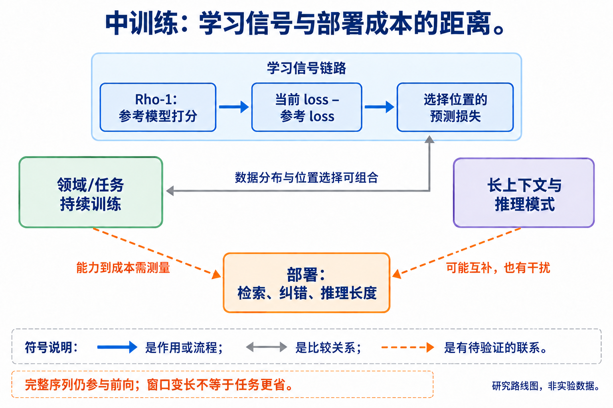

# 03 中训练与持续适配：补充能力怎样改变推理预算

[上一章：预训练](../02-pretraining/index.md) · [总论](../00-overview.md) · [下一章：架构与表示](../04-architecture/index.md)

中训练没有完全统一的阶段边界。本章用它指通用预训练之后、面向后续任务条件进行的持续语言建模或能力适配，重点调查补充领域知识、选择推理信号和扩大有效上下文三条路线。分类依据实际训练操作及测量，不依据论文是否在标题中使用 mid-training。

## 本章地图：能力补充与效率目标之间仍有一段距离



本图由主代理综合正文关系后使用 GPT-Image 生成；连线表示文中说明的流程、比较或待验证联系，不表示统一性能排名。

| 路线 | 代表入口 | 可能减少的部署工作 | 本次证据边界 |
|---|---|---|---|
| 领域/任务持续预训练 | DAPT/TAPT、Don’t Stop Pretraining | 补知识后可能少检索、少纠错 | 原实验主要测任务能力，没有完整推理 token 账 |
| 有选择地学习推理信号 | Rho-1 的 Selective Language Modeling | 改善底座可用的解题表示 | 训练 loss 位置减少，部署输出长度尚未证明减少 |
| 长上下文与推理阶段组合 | 长上下文数据工程、SmolLM3 公开配方 | 可能减少切分/回读，也可能增加读入量 | 窗口能力、跨能力干扰和任务成本须分别观察 |

三条路线可组合，也会冲突。更熟悉领域的模型可能用短答解决旧模型需要检索的问题；扩大窗口则可能让系统把更多信息一次塞入模型。两种现象都需要测量，不能从“继续训练后分数更高”直接推导长度方向。[旧来源的具体读取范围](../../sources/early-stages.md)

## Rho-1：保留上下文，只选择部分预测误差

Rho-1 的问题是：文档级过滤之后，一段文本内部的 token 是否都值得用相同权重训练？它的 Selective Language Modeling（SLM）仍读入完整序列，通过参考模型与当前模型的损失差异选择训练信号。这里减少的是进入目标函数的位置，不能理解成从推理 prompt 删除文字。[原论文 §2](https://arxiv.org/abs/2404.07965v1)

先在高质量数据上得到参考模型 $`p_{\mathrm{ref}}`$。给定序列 $`x_{1:T}`$，位置 $`i`$ 的参考损失和当前模型损失为：

```math
\ell_i^{\mathrm{ref}}=-\log p_{\mathrm{ref}}(x_i\mid x_{<i}),\qquad
\ell_i^\theta=-\log p_\theta(x_i\mid x_{<i}),\qquad
e_i=\ell_i^\theta-\ell_i^{\mathrm{ref}}.
```

式子要求目标 token 的概率为正。$`e_i`$ 是 excess loss：若参考模型认为某位置容易，而当前模型还不会，差值较大；若两者都觉得它困难，差值未必大。因此只按当前 loss 取最高，会与按 excess loss 选择得到不同结果。参考模型表达的是目标分布的偏好，不是通用正确性 oracle。

对一个 batch 的有效位置选取 excess loss 最高的非空集合 $`S`$，对应目标写为：

```math
\mathcal L_{\mathrm{SLM}}=\frac{1}{|S|}\sum_{i\in S}\ell_i^\theta.
```

原论文用选择比例控制 $`|S|`$。上式按实际选中数量归一化，便于说明边界；实现中的比例取整、并列值和分布式排序不能从这个简式推断。

```python
def selected_positions(current_loss, reference_loss, keep):
    # 教学示例：keep 为正整数；并列时按位置稳定排序。
    assert len(current_loss) == len(reference_loss)
    assert 1 <= keep <= len(current_loss)
    excess = [a - b for a, b in zip(current_loss, reference_loss)]
    return sorted(range(len(excess)), key=lambda i: (-excess[i], i))[:keep]

selected_positions([3.0, 2.0, 0.2], [2.9, 0.4, 0.1], 1)
# 返回 [1]：当前 loss 最高的第0项并非 excess loss 最高项。
```

假设第 0 个位置没有被选中，它依然作为后续位置的上下文参与前向计算；从后续位置传播的梯度也可能经过它的表示。准确表述是该位置没有直接贡献自身的预测损失，不能笼统说“这个 token 不参与任何梯度”或“前向成本按保留率同比下降”。参考模型打分也需要另计成本。


[查看原图，可放大](../../assets/papers/2404.07965/fig4.pdf) · [论文来源](https://arxiv.org/abs/2404.07965v1)

### 原实验说明了什么

数学持续训练从 TinyLlama-1.1B 和 Mistral-7B 出发，使用 OpenWebMath；一般域实验使用 SlimPajama、StarCoderData 和数学语料。原论文对 selected-token 数量和完整语料数量有专门口径，它们不是部署输出 token。[原论文 §3、表1–3](https://arxiv.org/abs/2404.07965v1)

| 比较 | 原论文报告 | 对部署效率的含义 |
|---|---|---|
| TinyLlama 数学继续训练，SLM 对 CLM | 表1平均分由21.6到38.1，选中训练 token 口径为9B对15B | 支持训练选择和任务能力改善；没有测得部署少40% |
| Mistral 数学继续训练，SLM 对 CLM | 表1平均分由55.8到66.2，选中口径为10.5B对15B | 同样属于间接链条，需另测实际推理长度 |
| 再接受共同的 ToRA 工具轨迹微调 | 表2中两种底座有不同下游表现 | 说明初始化与后训练有交互，不能只归因于一个阶段 |

这里最有研究价值的区别，是“把同样训练任务做得更好”与“改变部署时解决问题的方法”。Rho-1 主要确立前一段。主实验、选择比例、参考模型规模和一般域结果见[正文级精读](reference/2404.07965.md)。

## 领域适配、长上下文与推理模式的关系

DAPT/TAPT 分别针对领域和任务相关文本继续语言建模，提供“需要学什么知识分布”的路线。Rho-1 则进一步选择同一文本中的学习位置；二者操作的粒度不同，可以组合但不能自动把收益相加。对用户关心的目标，需要追加的比较是：继续训练后是否减少检索次数、重复纠错或显式推理长度，并保持任务质量。[Don’t Stop Pretraining](https://aclanthology.org/2020.acl-main.740/)

长上下文数据工程解决模型是否学会利用较长信息条件。它可以与输入压缩竞争：一条路线增强直接读取，另一条路线选择或编码必要信息。它们也可以组合，但更多上下文能力并不要求每次都读满窗口。SmolLM3 的公开阶段配方还报告推理训练与长上下文能力之间的干扰，以及通过 checkpoint 合并恢复部分能力的做法；这是一个公开配方中的观察，不能外推为所有中训练的普遍规律。[SmolLM3 官方说明](https://huggingface.co/blog/smollm3)

## 认识、争议与行动入口

中训练能改变领域能力和训练信号利用方式，已有具体方法与任务实验。本次纳入文献对“同等性能更少部署 token”的直接测量仍有限。将它列为间接路线，是为了明确下一步缺什么实验，而不是用泛训练知识填满章节。

可检验的设计是从同一公开基座构造普通继续训练与选择性继续训练两个分支，再使用相同后训练和部署程序。固定测试题、tokenizer、判分与预算网格，比较知识密集问题和计算密集问题是否出现不同变化；同时检查长上下文、非目标领域和高预算能力是否退化。若两个模型任务分数更接近，却需要同样甚至更多推理 token，结论应停留在能力适配。

阅读顺序：Rho-1 → 领域持续预训练的对照 → 长上下文/模式干扰 → [后训练](../05-posttraining/index.md)和[上下文管理](../07-context/index.md)。一个新想法需要说明它改变数据分布、损失位置还是训练阶段组合，并用消融排除“只是多训练了一段时间”的解释。
