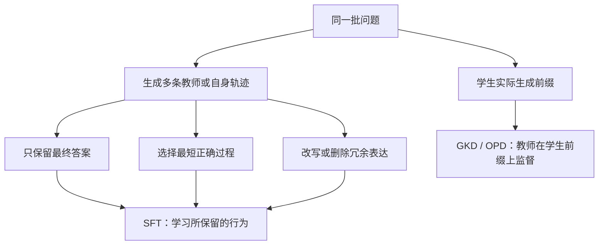

# 04 SFT、蒸馏与 OPD：把昂贵解法变成便宜行为

[返回目录](../README.md) · [上一章：中训练](03-midtraining.md) · [下一章：偏好优化](05-preference-rl.md)

本章的共同问题是：先花预算获得高质量解法，能否让模型以后用更少 token 复现能力？**关键区别在于让学生学什么、在哪些前缀上学、是否保留中间计算。** 换成小模型通常降低每 token 成本；只有轨迹变短且性能保持，才直接推动本项目的横轴。

## 1. 五条路线怎样分化

| 路线 | 代表方法 | 学习对象与机制 | 最容易混淆的地方 |
| --- | --- | --- | --- |
| 只学结果 | Distilling System 2 into System 1 | 昂贵流程生成并筛选答案，学生直接作答 | 丢掉推理文字也可能丢掉必要计算 |
| 选择天然短解 | Shortest-correct self-training、Learn to Skip Steps | 多轨迹中挑短且正确的，或在结构化任务学跳步 | 选短题和同题选短解不是一回事 |
| 压缩且可控 | C3oT、TokenSkip、CoT-Valve | 分别改写、删除文字、调节参数方向 | 表达压缩、解法捷径和参数插值不是同机制 |
| 在学生状态上蒸馏 | GKD、On-policy Distillation | 学生自己走，教师在学生实际遇到的前缀上指导 | OPD 解决分布错配，不天然解决冗长 |
| 把思考换成连续表示 | Coconut、CODI | 不再逐字写思考，改用隐状态计算 | 少可见 token 不代表少计算；详见[10 章](10-other-directions.md) |

来源与已读章节见[后训练原文卡 P01–P15](../sources/posttraining-map.md)。这是按机制分类；SFT、LoRA、KL 只是承载这些机制的工具。

图为本地图自绘的机制关系图，不表示所有方法都使用同一数据或教师；连续推理另见10章。

## 2. 从“直接答”到“保留短推理”：失败推动了路线分化

System 2 蒸馏先让模型做昂贵的重述、筛选或推理，再把最终行为教回模型。对于一些简单操作或评判，复杂流程能够内化；但在 GSM8K 上，Llama2-70B-chat 的 CoT 单次 52.77%/270 tokens，丢掉过程后只有 7.13%/18。**省掉几乎全部过程并没有保持数学能力。**[原文表 4](https://arxiv.org/html/2407.06023v3)

因此另一支不删除全部计算，而是寻找更短的正确过程。Shortest-correct self-training 每题采多条，选自然产生的短解；Learn to Skip Steps 在有明确步骤结构的合成任务学习合并/跳步。前者靠采样找到捷径，后者还利用人工结构。它们的限制也不同：采样可能找不到难题短解，合成步骤规律可能无法迁移到真实问题。[自训练](https://arxiv.org/html/2502.20122v3)、[跳步学习](https://arxiv.org/html/2411.01855v1)

## 3. 可控压缩的三种“旋钮”

C3oT 用教师把长 CoT 改写为短 CoT，再用长/短条件训练；TokenSkip 保留原轨迹中的关键 token，使用不同保留比例训练；CoT-Valve 学习从长到短的参数方向，通过系数改变输出长度。它们分别操作文本语义、token 保留和模型参数，不能只用“压缩 CoT”一词抹平差异。[C3oT](https://arxiv.org/html/2412.11664v1)、[TokenSkip](https://arxiv.org/html/2502.12067v3)、[CoT-Valve](https://arxiv.org/html/2502.09601v1)

TokenSkip 借用了 LLMLingua-2 的输入重要性模型，将它用来制作输出训练数据，这是跨阶段迁移的典型例子。其比例控制可以帮助扫描曲线，却不是严格长度上限。CoT-Valve 的系数也不是可直接跨模型迁移的统一预算单位。若需要明确 token 上限，应对照[06 章 L1](06-rlvr-agentic.md)；若需要按难度决定预算，应对照[05 章 DAST](05-preference-rl.md)。

## 4. OPD：教师教学生实际会犯的错误

离线教师轨迹展示的是教师自己能走通的路径，学生部署时偏离一步后，未必知道如何继续。GKD 因而让学生先生成，再在这些前缀上匹配教师分布；还可混合教师/学生数据，并比较不同散度。Thinking Machines 的公开 OPD 配方以学生 rollout 和教师 token log-prob 为核心，是这种思想的工程实例。[GKD](https://arxiv.org/html/2306.13649v3)、[OPD 实践](https://thinkingmachines.ai/blog/on-policy-distillation/)

这条路线值得关注，因为高效学生不能只背教师的正确长解，还要在自己的状态分布上行动。但 OPD 教师如果倾向长链，学生仍可能学长。DeepSeek-V3 报告中的 V2.5 蒸馏消融就是反例：MATH-500 成绩 74.6→83.2，长度 769→1,510。**蒸馏增强能力与压缩行为需要分别验证。**[报告表 9](https://arxiv.org/html/2412.19437v2)

## 5. 关键实验支持什么

| 方法 | 模型/任务/配置 | 结果和证据边界 |
| --- | --- | --- |
| C3oT | Llama2-7B，GSM8K，长短条件 | 37.38%→36.92%，输出约压缩 56.67%；有小幅性能损失 |
| TokenSkip | Qwen2.5-14B-Instruct，GSM8K，greedy，比例 0.7 | 93.1%/313.11→93.4%/218.62 CoT tokens；是有利点估计，非统计等效性证明 |
| TokenSkip 的限制 | Llama3.1-8B，MATH-500，强压缩 | 难题退化明显；不能把上一个模型的最佳点外推 |
| CoT-Valve | QwQ-32B-Preview，GSM8K | 约 741→225 tokens，95.07%→94.92%；参数控制仍有取舍 |
| GKD/OPD | T5 教师学生、摘要/翻译/数学；或 Qwen 教师学生 | 支持能力迁移和训练效率；缺少同质量整项任务 token 的统一比较 |

这些来自原论文的点不组成排行榜。多项独立工作支持“部分任务存在可学的短过程”，但跨域、困难题和长期 Agent 中能保留多少能力仍未形成统一结论。最高压缩率不适合成为唯一目标。

## 6. 阅读顺序与选题去重

先读 System 2 蒸馏的成功与失败，再读 shortest-correct→C3oT→TokenSkip，理解“选择/改写/删除”；随后用 CoT-Valve 与 L1 区分控制方式，最后读 GKD/OPD 判断训练分布问题。

| 初步 idea | 最近邻 | 需要证明的新差异 |
| --- | --- | --- |
| 教师长想，学生只答 | System 2→1、普通蒸馏 | 哪些任务的计算能内化，哪些必须留给推理时？ |
| 用重要性删 CoT 后做 SFT | TokenSkip | 重要性是否体现关键推理状态，而非只保留读起来像答案的词？ |
| 用学生生成轨迹接受教师指导 | GKD/OPD | 效率约束如何改变教师反馈，且能否修复短链中的错误？ |
| 给模型一个连续长度旋钮 | CoT-Valve、TokenSkip、L1 | 旋钮在未见难度/领域上是否仍可校准？ |

本地图的研究机会判断：在固定离线生成预算下，对比最短正确 SFT、可控压缩和带效率目标的学生轨迹蒸馏；以未见题族、难度分层与真实失败成本为证据。仅把 OPD 接到某个模型上，还没有说明新机制是什么。

推导和算例见[SFT/蒸馏技术专题](technical/04-sft-distillation.md)与[推理长度控制专题](efficient-reasoning-recipes.md)。

旧版小节链接已保留。原来的推导、算例和练习见[本章技术专题](technical/04-sft-distillation.md)。
