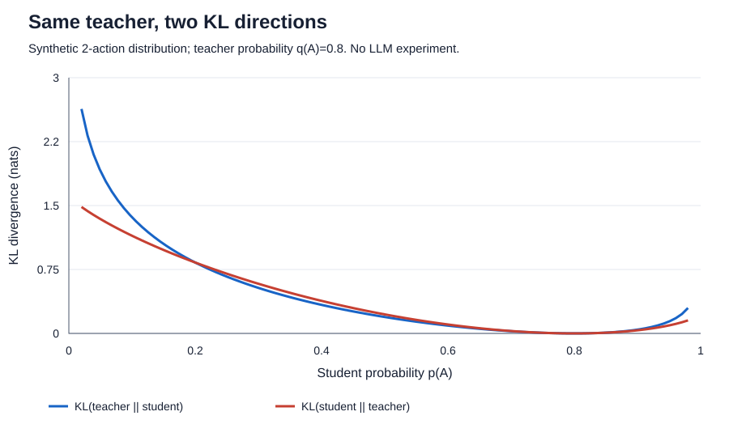

# 04｜SFT 与蒸馏：把什么行为教给学生？

[上一章：中训练](03-midtraining.md) · [下一章：偏好优化](05-preference-rl.md)

完成本章后，你应该能够解释三个问题：SFT 的训练标签是什么；按 token 和按回答平均损失有什么不同；为什么让教师评价学生自己生成的内容，会与直接模仿教师答案产生不同效果。本章默认你已理解自回归模型：给定前缀，模型输出下一个 token 的概率。

## 1. 我们要改善的是部署曲线

先想一个实际任务：读几份材料，查出一个事实，给出可核验答案。模型 A 写了很短的答案，却查了十次资料；模型 B 最终回答较长，但只查了两次。不能只看最后一段文字就说 A 更节省。

本教程把一次部署任务的成本定义为所有模型调用的 token 总和：

$$
C_{\mathrm{deploy}}=\sum_{k=1}^{K}(N^{\mathrm{in}}_k+N^{\mathrm{out}}_k).
$$

这里 $K$ 包括主模型、子智能体、摘要器和重试；$N^{\mathrm{in}}_k$、$N^{\mathrm{out}}_k$ 是第 $k$ 次调用的输入、输出 token。工具返回文本再次送入模型时属于输入成本，普通程序内部处理的字节不直接算 LLM token。缓存命中 token、计费金额和时延可以另报，不能悄悄换掉横轴。同一文本用不同 tokenizer 计数可能不同，比较模型家族时应报告计数方式。

纵轴 $Q$ 是固定任务集上的成功率或质量分。给每种方法不同预算，画出 $(C,Q)$ 点；若一个点的成本更低且质量不差，它支配另一个点。没有被支配的点组成 Pareto frontier。训练方法的价值要在这条曲线上检验：训练损失降低、小模型参数减少、输出变短，都不是部署曲线改善的充分证据。

教师生成、教师打分和训练本身的成本记入另一张离线账本 $C_{\mathrm{offline}}$。这样既能比较部署行为，也能在需要时算训练投入要经过多少次部署才能收回。在线部署仍使用教师时，其调用必须回到部署账本，不能藏到离线成本里。

## 2. SFT：在给定示范前缀下预测下一个 token

监督微调（Supervised Fine-Tuning，SFT）使用示范对 $(x_i,y_i)$。$x_i$ 是问题和上下文，$y_i=(y_{i,1},\ldots,y_{i,T_i})$ 是希望模型产生的回答。训练时给模型看到正确答案的前缀，让它预测下一个 token，称为 teacher forcing。这里的 teacher 不一定是一台教师模型，也可以只是数据里的标准序列。

令

$$
\ell_{i,t}=-\log\pi_\theta(y_{i,t}\mid x_i,y_{i,<t}),
$$

其中 $\theta$ 是学生参数，$\pi_\theta$ 是学生概率。目标 token 的概率从 $0.1$ 增加到 $0.5$，负对数损失就降低。训练不会先执行答案再判断正确性；它默认标签值得模仿。因此，语法正确、单测通过、事实真实与损失小是不同属性。

对聊天或工具轨迹，通常只在要学习的 assistant 输出位置计算损失：包括推理、工具调用参数和最终回答。用户消息、工具观察可以作为输入，但不应无意间当作学生必须生成的目标。不同目标任务也可能有不同 mask；重要的是明确损失到底覆盖哪些 token。停止符也是行为的一部分，丢掉结束标记可能让模型学不好何时停止。

一个合格的效率示范不只是“把原答案砍短”：应保留必要信息、可执行工具参数和失败恢复。代码中的必要检查、引用中的出处、复杂任务中的验证步骤，都可能增加局部长度却降低整任务失败和重试成本。SFT 会模仿可见模式，不能自动理解我们删掉的是冗余还是关键步骤。

## 3. 长度归一化改变了谁拥有更大权重

对一个 batch，两个常见目标是：

$$
L_{\mathrm{token}}=\frac{\sum_i\sum_{t=1}^{T_i}\ell_{i,t}}{\sum_iT_i},
\qquad
L_{\mathrm{seq}}=\frac1B\sum_{i=1}^{B}\frac1{T_i}\sum_{t=1}^{T_i}\ell_{i,t}.
$$

$B$ 是回答数，$T_i$ 只数被监督的位置。前者让每个目标 token 权重相同；后者先平均每条回答，再让每条回答权重相同。batch 中有一条 2-token 回答和一条 8-token 回答，前者把 80% 的 token 权重给长回答，后者两条各占 50%。若所有 token 损失恰好都是 1，两种总损失都显示 1，但梯度中各样本的权重仍不一样。

这不是两种“谁更正确”的选择。若长任务本来更复杂，降低其总权重可能削弱复杂能力；若训练库只是重复冗长解释，token 平均又可能让这些内容占据太多更新。跨设备、梯度累积和 sequence packing 时，也要确认分母是全局有效 token 数还是每个小 batch 的局部数。名称相同的“平均损失”不一定是相同目标。

尤其不要把 $1/T_i$ 理解成长度惩罚：这里 $T_i$ 来自固定标签，优化时没有对生成长度求导。它重新分配训练权重，并不直接奖励部署时少生成 token。研究长度归一化时应控制数据、训练 token 预算和推理预算，否则容易把多训练了一批数据的收益归到公式上。

## 4. 蒸馏：模仿答案，还是模仿概率分布？

最容易复用的是序列蒸馏：让较强教师生成答案，筛选后给学生做 SFT。它需要教师文本，不一定需要 logits。若教师答案总是很长，学生也可能学到长解释；“由大变小”主要减少每 token 的计算成本，不保证 token 个数下降。教师错误也可能被继承，筛选需要同时考虑正确性、难度覆盖和行为多样性。

另一类做法使用教师的软分布。固定一个前缀 $h$，记教师分布为 $q(v\mid h)$、学生分布为 $p_\theta(v\mid h)$，$v$ 遍历词表。经典分布蒸馏常最小化

$$
D_{\mathrm{KL}}(q\|p_\theta)=\sum_v q_v\log\frac{q_v}{p_{\theta,v}}.
$$

教师在多个合理候选上的概率也成为监督。温度 $\tau$ 可用 $\operatorname{softmax}(z/\tau)$ 软化 logits；这里的温度和生成时采样温度应分别记录。并非只有这一个蒸馏目标，下面的图展示反向 KL 的另一种惩罚形状。[经典蒸馏论文](https://arxiv.org/abs/1503.02531)



图 4-1：本教程自绘的二动作概率例子，教师 $q(A)=0.8$；不是大模型实验。两条曲线都在学生等于教师时为零，但离开该点后的梯度不同。两者都不是可以为负的“相似度分数”。

## 5. OPD：让教师在学生会走到的地方纠正它

离线教师示范有一个问题：学生部署时可能很早就走到教师示范从未出现的前缀。例如教师第一轮检索正确，学生第一轮却搜错关键词，接下来需要纠错，而不是继续背教师的第二轮动作。

On-Policy Distillation（OPD）的关键是**学生先生成，教师再评价学生生成的前缀或动作**。典型循环为：取任务；学生采样；在相同前缀上取得教师概率反馈；更新学生；重新采样。这里的 on-policy 指样本来自正在学习的策略附近，不是泛指“教师在线连接着”。OPD 与选择何种散度是两个维度，不能把所有 OPD 都定义成反向 KL。[GKD：在自生成轨迹上蒸馏](https://arxiv.org/abs/2306.13649)

一个常见方向是

$$
D_{\mathrm{KL}}(p_\theta\|q)
=\mathbb E_{v\sim p_\theta}[\log p_\theta(v)-\log q(v)].
$$

这叫 student-to-teacher 的反向 KL；上一节的 $D_{\mathrm{KL}}(q\|p_\theta)$ 是 teacher-to-student 的正向 KL。名称会随作者约定变动，最安全的办法永远是写清楚两个分布的位置。反向目标对学生大量生成而教师低概率的动作惩罚较强；“偏向某些模式”的直觉不是所有有限容量模型上的普遍保证。

固定一个状态和教师分布，以下取温度 $\tau=1$、学生 $p=\operatorname{softmax}(z)$，则可直接推出：

$$
\frac{\partial D_{\mathrm{KL}}(q\|p)}{\partial z_j}=p_j-q_j,
\qquad
\frac{\partial D_{\mathrm{KL}}(p\|q)}{\partial z_j}
=p_j\left(\log\frac{p_j}{q_j}-D_{\mathrm{KL}}(p\|q)\right).
$$

本章代码用完整的小词表验证这两条梯度。实际大词表中，教师可能只返回学生所采样 token 的 logprob。这样的接口可以构造采样估计，却不能假装已经拿到了全词表软标签。只有文本输出的教师，通常需要改成答案蒸馏或其他评价方式。[OPD 实践说明](https://thinkingmachines.ai/blog/on-policy-distillation/)

对单个采样 token，$\widehat d_t=\log p(y_t|h_t)-\log q(y_t|h_t)$ **可能为负**；只有在对应分布下取期望后的 KL 保证非负。常见局部 OPD 配方把 $-\widehat d_t$ 当作反馈，在采样时冻结学生旧 logprob 和教师 logprob，再用策略梯度类目标更新当前学生。不要一边声称优势是固定反馈，一边无意中让梯度穿过它。上述概率必须定义在一致的动作/词表空间上；教师与学生 tokenizer 不同时，需要额外的对齐设计，不能直接逐下标相减。

还有一层细节：学生决定了**状态访问分布**。对完整回答 $y\sim p_\theta$，固定教师 $q$，完整反向 KL 梯度是

$$
\nabla_\theta D_{\mathrm{KL}}(p_\theta(y)\|q(y))
=\mathbb E_{y\sim p_\theta}\!\left[
\log\frac{p_\theta(y)}{q(y)}\nabla_\theta\log p_\theta(y)
\right].
$$

式中的常数项通过概率归一化消掉，要求教师在学生支持集上有非零概率。把采样出的历史固定，再对每一步做局部 KL，是一种具体训练选择；它不自动等于上式的完整轨迹梯度。实现可能还使用旧策略、重要性权重、裁剪及不同信用分配，复现时需要读清楚。

## 6. 跑一次标准库实验

在仓库根目录运行，无需 GPU 或第三方 Python 包：

```bash
python3 examples/posttraining_lab.py --section sft --self-test
```

想直接调用核心函数：

```python
from examples.posttraining_lab import forward_kl_grad, reverse_kl_grad

student_logits = [0.4, -0.2, 0.0]
teacher = [0.7, 0.2, 0.1]
print(forward_kl_grad(student_logits, teacher))
print(reverse_kl_grad(student_logits, teacher))
```

输出包含两个不同方向的 KL、梯度以及长回答权重。`--self-test` 用有限差分独立检查解析梯度。这个程序只有离散概率运算，没有加载模型，也没有展示 SFT 或 OPD 的真实性能收益。

练习：把教师第三个动作的概率改为很小但非零，并让学生很偏爱它，比较两个梯度；再把 2/8 的示范长度改为 2/80，解释两种平均方式的权重。最后设计一对“更短却更容易重试”和“稍长但一次成功”的轨迹，说明为何单条输出长度不足以选蒸馏数据。

进一步阅读：[GKD 原论文](https://arxiv.org/abs/2306.13649)、[OPD 官方说明](https://thinkingmachines.ai/blog/on-policy-distillation/)、[OpenCodeReasoning §4.1 的过滤消融](https://arxiv.org/html/2504.01943v1#S4.SS1)。最后一篇提供的是特定 SFT 条件下的经验，不能从“过滤可能丢失困难题”推出错误答案普遍更值得模仿。下一章讨论：当我们更容易比较两个回答，而不是写出唯一示范时，如何训练？
