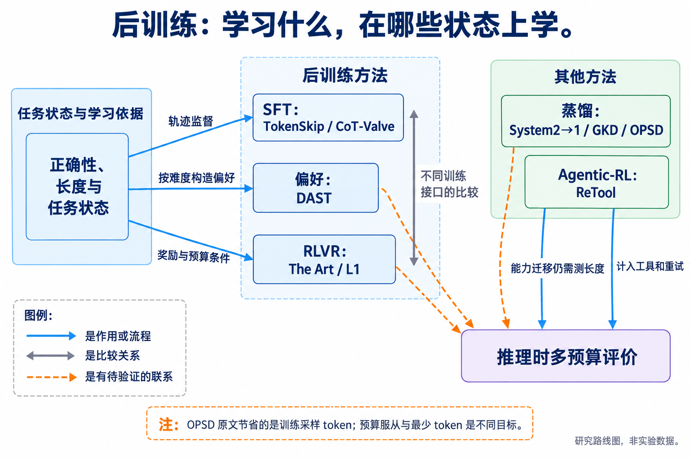
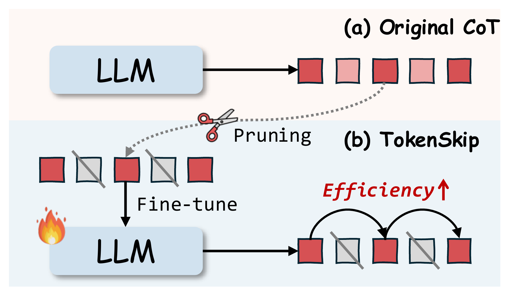
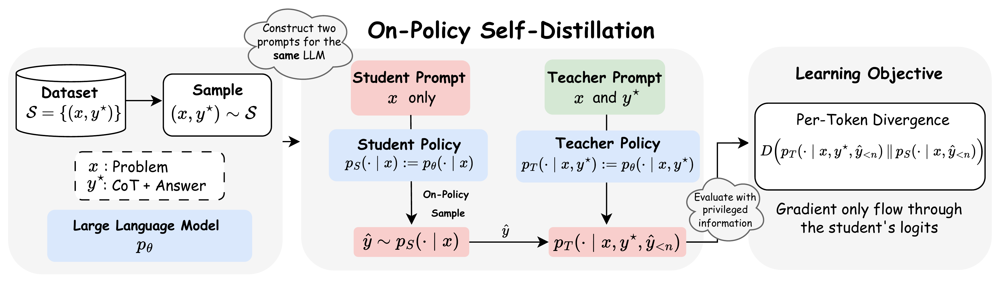
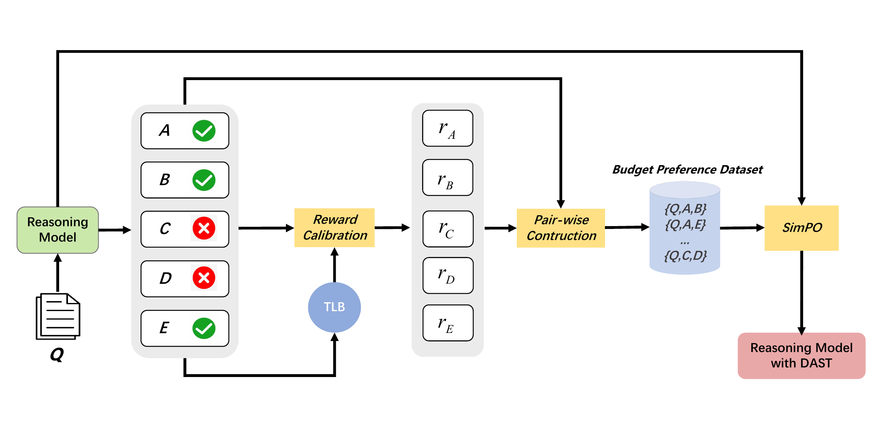
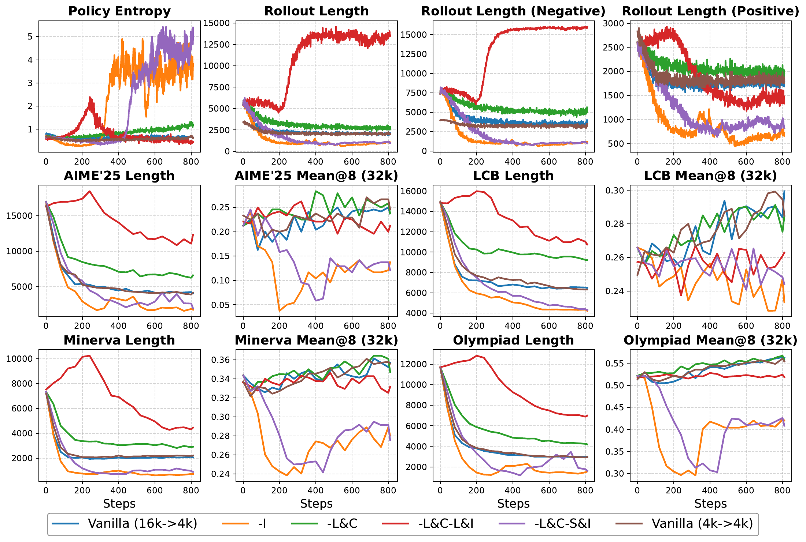
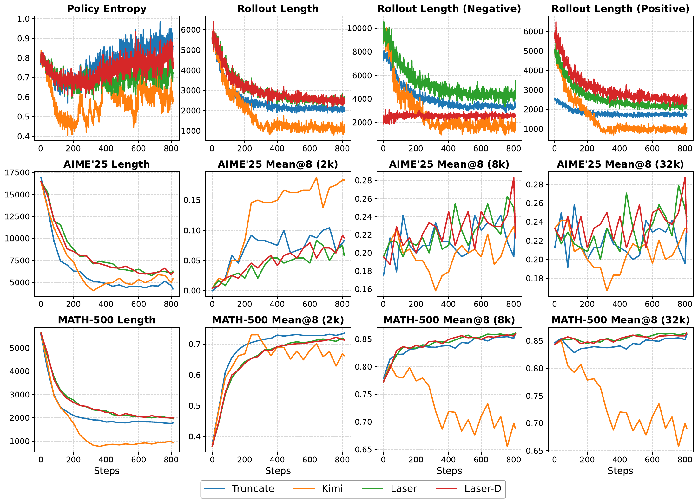
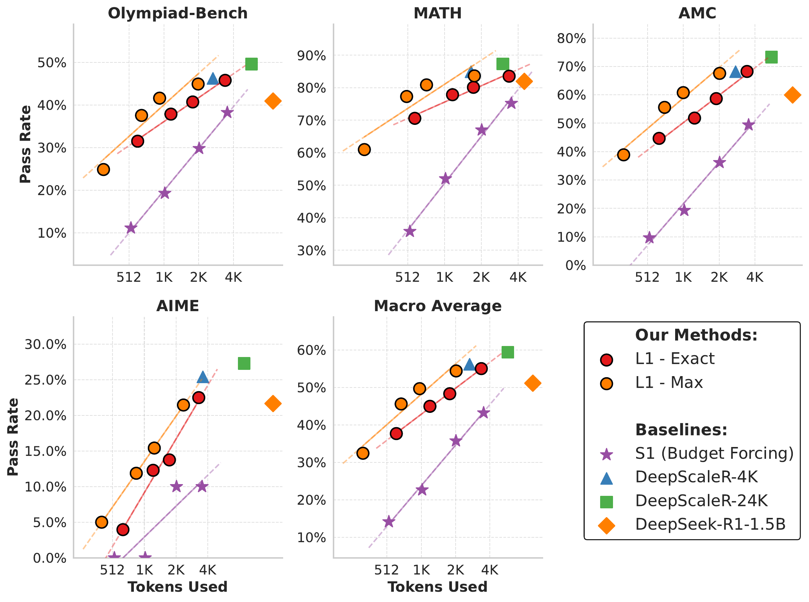
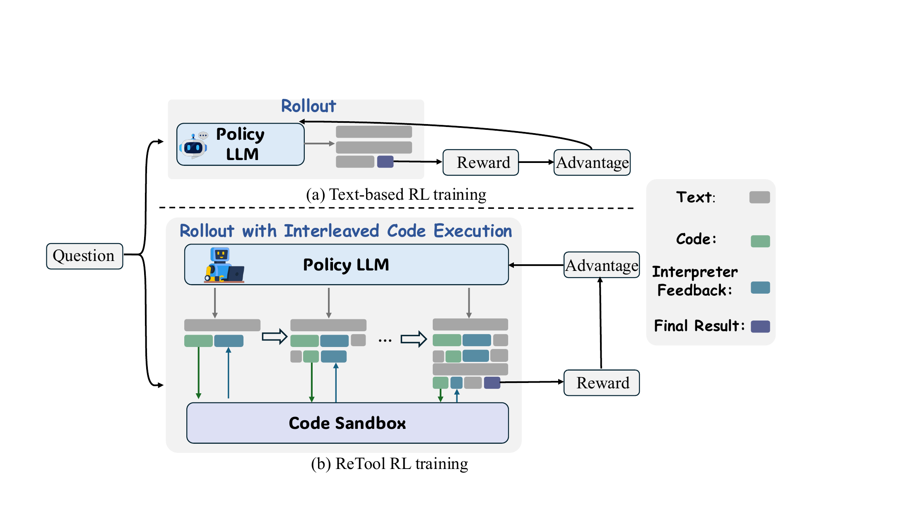

# 05 后训练与对齐：学习短表达、好解法和合适的停止策略

[上一章：架构与表示](../04-architecture/index.md) · [总论](../00-overview.md) · [下一章：推理与验证](../06-reasoning/index.md)

后训练能够直接改变模型部署时的行为，但“训练过一个更高效的模型”包含多种不同贡献：有的方法选择较短解法，有的方法删除表达冗余，有的方法教预算服从，有的方法让模型转向工具。它们使用的 SFT、偏好优化或 RL 更新工具，不能替代对具体学习信号的解释。

## 本章地图：监督对象和状态分布决定路线差异



本图由主代理综合正文关系后使用 GPT-Image 生成；连线表示文中说明的流程、比较或待验证联系，不表示统一性能排名。

| 分支 | 核心问题与代表方法 | 与其他路线的关系 |
|---|---|---|
| SFT | 最短正确自训练、TokenSkip、CoT-Valve：让模型模仿哪一种短过程？ | 数据选择改变解法，TokenSkip 改表达，CoT-Valve 增加长度控制接口 |
| 蒸馏与 OPD | System2→1、GKD、OPSD：教师教结果、轨迹、分布还是表示？ | on-policy 改变学生看到的前缀；是否变短取决于额外的目标和数据 |
| 偏好优化 | DAST：简单题与困难题应该偏好什么长度？ | 同正确性类别内的偏好构造，与通用 SimPO 优化器分开 |
| RLVR | The Art、L1：如何兼顾正确性、长度、稳定性与预算条件？ | 奖励、数据和采样分布共同影响学习；预算服从与少用 token 是不同目标 |
| Agentic-RL | ReTool、记忆策略 RL：怎样从反馈中学会有效动作？ | 工具和记忆扩大动作空间；成本从一条输出扩展为整个任务 |

PEFT/LoRA 提供较低成本的适配参数化方式，可承载不同目标；单独使用 LoRA 不会自动产生推理长度收益。公开工业实践也应按披露范围理解：已发表的偏好训练、RL 和蒸馏说明这些范式被使用，不能据此推断闭源系统使用某个具体长度奖励。[企业公开来源](../../sources/vendor-practice.md)

## SFT：选择解法与压缩表达

### TokenSkip：将重要性选择转成可控生成

TokenSkip 使用已有重要性模型对推理轨迹中的 token 评分，在指定保留比例下形成压缩后的 CoT，再微调目标模型。压缩器原本用于输入压缩，把它用于输出训练标签，是与上下文研究的直接联系。部署时模型根据压缩条件生成，不需要先完整写出长链再删词。[原文](https://arxiv.org/abs/2502.12067v3)

设原轨迹为 $`y_{1:T}`$，重要性为 $`s_t`$，保留比例为 $`r\in(0,1]`$，选择集合为 $`S_r`$。压缩文本保持选中 token 的原序：

```math
S_r=\mathrm{TopK}(s_{1:T},k_r),\qquad
\widetilde y_r=(y_t:t\in S_r\text{，按原位置排序}),
\qquad
\mathcal L=-\sum_t\log\pi_\theta(\widetilde y_{r,t}\mid x,r,\widetilde y_{r,\lt t}).
```

$`k_r`$ 是由比例与具体实现确定的保留数量。这个简式强调筛选与训练的顺序，不规定作者实现之外的取整或并列处理。模型学到的是在压缩条件下生成的概率分布，因此 $`r`$ 是软控制条件，不是每个新题都严格实现的 token 上限。

例如，一条解法先重复题意，再给出 `2×3=6`，最后重复结论；删除重复叙述与删除 `×3` 有完全不同的后果。重要性评分要服务于可恢复的推理信息，而不是仅保留读起来像答案的词。与[最短正确选择](../01-data/index.md)相比，TokenSkip 可以压缩同一条轨迹的表达；它未必寻找到了另一种更短算法。



[查看原图，可放大](../../assets/papers/2502.12067/fig1.pdf) · [论文来源](https://arxiv.org/src/2502.12067v3)

作者总览图把离线选择与目标模型微调分开。图中被删掉的文字是训练数据构造结果，不能理解为部署时已经发生的在线早停。

原文在 LLaMA/Qwen 及不同推理任务上比较压缩比例。在特定 Qwen2.5-14B/GSM8K 设置中，约313到219的 CoT 长度伴随接近的分数；高压缩率和困难任务仍有退化。因此它是可控表达压缩的代表方案，不是所有题都能按比例无损缩短的证据。[完整实验与条件](reference/2502.12067.md)

### CoT-Valve：把长度控制放在参数方向上

CoT-Valve 学习从较长到较短推理行为的参数变化，并在推理时调整其强度。用 LoRA 的说明性写法表示某层更新：

```math
W(\alpha)=W_0+\alpha BA.
```

$`W_0`$ 是基座权重，$`A,B`$ 构成低秩更新，$`\alpha`$ 调整更新幅度。这里的 $`\alpha`$ 控制模型参数，不是删掉一段输出的比例。即使参数随 $`\alpha`$ 线性变化，生成长度和准确率也不会被保证线性变化。

论文还研究 MixChain、渐进压缩和增强版本，以不同长度的训练轨迹建立可用控制范围。读方法时应跟踪两步：先用什么监督形成长度方向，再用哪个系数取部署工作点。单纯为已有 LoRA 随意插值，不会自动得到论文的长度方向。[原文](https://arxiv.org/abs/2502.09601)


[查看原图，可放大](../../assets/papers/2502.09601/main.pdf) · [论文来源](https://arxiv.org/abs/2502.09601v1)

作者方法图连接轨迹构造、参数训练和推理旋钮。教学上可用 $`\alpha=0,0.5,1`$ 三个设置理解参数更新幅度，但这些数值不承诺输出恰好为长、中、短三个固定长度。原文某些模型/任务可大幅缩短，AIME 和更强压缩下仍会损失能力；应扫描多个工作点并保留原模型与简单提示基线。[精读](reference/2502.09601.md)

## 蒸馏：先确定教师究竟传递什么

### System 2→1：有些过程可内化，有些任务会失去必要计算

System 2→1 先让教师进行更昂贵的重述、注意力筛选、比较或 CoT 推理，过滤其输出，再把最终行为教回模型。部署时学生直接完成相应任务，省去教师流程。这个结构和“训练时用大模型，部署时用小模型”有交集，但也可以在相同模型上内化一个多步流程。[原文](https://arxiv.org/abs/2407.06023v3)

其关键区别是监督中保留什么。若只训练最终答案，学生仍需从参数中完成原本依赖中间计算的任务。论文在部分重述、筛选和比较任务上成功，在 GSM8K 的 CoT 蒸馏中却出现严重退化，原 CoT 的约52.77%在对应表格设置下变为约7.13%。这说明“教师能做、答案也正确”并不足以保证过程可以被直接删掉。[精读：四类流程与数学反例](reference/2407.06023.md)

这条路线与 TokenSkip 形成有用对照：前者尝试省去流程，后者保留压缩后的中间表达；[CODI](../04-architecture/index.md)则给学生留下连续计算空间并进行表示对齐。比较时应固定任务和训练信息，判断损失来自缺少计算位置、监督难度还是数据覆盖。

### GKD：在学生真正访问的前缀上教学

离线蒸馏主要展示教师自己的轨迹。学生部署时偏离这些轨迹后，会遇到训练数据没有覆盖的前缀。GKD 让学生自采样，再让教师在相同前缀上提供分布监督，可混合教师数据和学生生成数据。[原文](https://arxiv.org/abs/2306.13649v3)

令学生前缀为 $`y_{<t}`$，教师、学生的下一 token 分布分别为 $`p_T`$、$`p_S`$。以 forward KL 为例：

```math
D_{\mathrm{KL}}(p_T\Vert p_S)
=\sum_{v\in V}p_T(v)\log\frac{p_T(v)}{p_S(v)}.
```

这个式子要求教师有正质量的位置在学生中也有正概率，零概率项按连续约定处理。前缀由谁产生和分布用哪种散度比较，是两个独立变量。GKD 研究 forward/reverse KL、JSD 及数据混合，不应把 OPD 简化成固定的一种 KL 方向。

一个二选项教学例：教师在下一步给出 `[0.8,0.2]`，学生给出 `[0.5,0.5]`。分布蒸馏会让学生学习两种选项的相对偏好，而不只对本次采到的一个 token 加分。但若教师也偏好长链，这个目标没有任何项要求学生缩短。论文的摘要、翻译、数学等实验支持分布迁移，不能自动支持推理 token 前沿左移。[精读](reference/2306.13649.md)

### 2026 OPSD：特权上下文能改善教学，论文的 token 节省发生在训练侧

Self-Distilled Reasoner 的学生只看题目，教师分支额外看参考解，再对学生实际生成的前缀提供全词表监督。实验中教师使用初始策略作为稳定目标，学生接受更新；“同一基座”不意味着蒸馏时两个分支都沿相同梯度更新。[原文 §3](https://arxiv.org/abs/2601.18734v3)

```math
\widehat y\sim\pi_\theta(\cdot\mid x),\qquad
\mathcal L=\mathbb E\left[
\frac1{|\widehat y|}\sum_t
D\!\left(p_T(\cdot\mid x,y^*,\widehat y_{\lt t})\Vert
\pi_\theta(\cdot\mid x,\widehat y_{\lt t})\right)\right].
```

其中 $`y^*`$ 是只进入教师条件的参考解，非空学生轨迹上的平均损失只更新学生分支。论文还分析全词表散度的重尾贡献和逐项裁剪；其目的包括避免少数风格词主导训练。



[查看原图，可放大](../../assets/papers/2601.18734/fig-opsd-overview.pdf) · [论文来源](https://arxiv.org/abs/2601.18734v3)

作者图中参考解通向教师，学生 rollout 同时提供两个分支要评价的前缀。它没有在部署时把参考答案交给学生。

这篇原文特别容易产生目标偏移：其 token-efficiency 对照是 OPSD 的训练采样量与 GRPO 的训练采样量，涉及不同 rollout 数、长度上限及训练步数。论文没有测量部署回答的 token 曲线。因此本地图将它归为有价值的 OPD 改进和间接能力路线，不能把“训练少采样”写成“以后回答更短”。[精读：训练预算及负面结果](reference/2601.18734.md)

## 偏好优化：DAST 按难度改变长度偏好的方向

DAST 对每题采样多个回答，用经验正确率和正确轨迹长度确定 Token Length Budget（TLB）。设 $`p`$ 为采样正确率，$`L_r`$ 为正确回答平均长度，$`L_{\max}`$ 为采样上限，则在存在正确候选时：

```math
L_b=pL_r+(1-p)L_{\max}.
```

若没有正确候选，使用 $`L_{\max}`$ 的分支约定，不能先计算一个未定义的 $`L_r`$ 再乘零。容易题的预算更接近已有正确解的长度，困难题保留更长的探索空间。这个预算依赖当前模型及采样，不能被当作题目固有属性。[原文 §3.1](https://arxiv.org/abs/2503.04472v3)

对长度为 $`L_i`$ 的候选，定义 $`\lambda=(L_i-L_b)/L_b`$，要求 $`L_b>0`$。作者用不同分支校准正确与错误回答：

```math
R_i=\begin{cases}
\max(-0.5\lambda+0.5,0.1),&\text{正确},\\
\min(0.9\lambda-0.1,-0.1),&\text{错误}.
\end{cases}
```

正确回答在过长时失去奖励，错误回答在过短时更受惩罚。设教学预算 $`L_b=100`$：正确的50-token回答得0.75，正确的150-token回答得0.25；错误的50-token回答得−0.55，错误的100-token回答得−0.1。这个例子说明同样缩短50 token，在两个正确性条件下有相反偏好；它不证明更长错误答案一定能在未来变正确。

DAST 由此构造两类关键偏好：DCP 在两个正确回答间偏好更短者，DICP 在适当范围内的两个错误回答间偏好更充分探索者。再按奖励间隔筛选成对数据，用 SimPO 优化。设 $`s_\theta(y)=|y|^{-1}\log\pi_\theta(y\mid x)`$，winner/loser 非空，则目标为：

```math
\mathcal L_{\mathrm{SimPO}}
=-\mathbb E\log\sigma\bigl(\beta[s_\theta(y_w)-s_\theta(y_l)]-\gamma\bigr).
```

训练工具仍是通用 SimPO；本方法的区别主要来自按题预算、分正确性类别的长度信号和配对规则。



[查看原图，可放大](../../assets/papers/2503.04472/figure-2.pdf) · [论文来源](https://arxiv.org/src/2503.04472v3)

作者图里的预算进入奖励校准，校准后的排序进入偏好对，最后才进入优化器。原文在 DS-32B/MATH-500 报告95.8准确率及46.0%的输出压缩率，并用 DCP/DICP 消融、难度分层和阈值分析说明取舍。阈值选择还使用了部分 MATH-500 样本，应将调参条件与独立泛化证据分开。[精读](reference/2503.04472.md)

## RLVR：奖励、正信号密度和预算服从

### The Art：同一个长度目标可以产生不同训练动力学

The Art 把数据、rollout、奖励和优化放在统一实验协议下比较。设 $`c(y)\in\{0,1\}`$ 为正确性，$`L(y)`$ 为生成长度，目标为 $`L_T`$，其截断奖励是：

```math
R_T(y)=c(y)\,\mathbf1[L(y)\le L_T].
```

正确且短得1，其余类别得0。零奖励、从 loss 中 mask 掉，以及经过组内比较后的负优势，是三个不同对象。对于四条轨迹“短正确、长正确、短错误、长错误”，该奖励为 `[1,0,0,0]`；若将长正确项 mask，它不接受该项更新，不能写成仍得到正奖励。若一个组全是零奖励，任务优势为零，公式不会自动产生长度梯度。



[查看原图，可放大](../../assets/papers/2602.20945/fig6.pdf) · [论文来源](https://arxiv.org/html/2602.20945v3)

作者奖励对照图展示不同 mask 策略与直接限制采样长度的训练结果。只保留会把短长度与正确性耦合的信号，可能导致作者所称的 short-is-correct 陷阱；完全不约束长轨迹也可能让模型转向过长错误输出。这些是完整训练动态的观察，不能只由一组奖励向量推出全部因果。

数据选择影响是否经常出现可学习的正样本。作者在其模型和 DeepScaleR 设置中观察到 Easy 数据更稳定，较大 rollout 数能改善正信号密度，同时增加训练采样成本。训练常先经历长度适应，再进入较短预算内的推理精炼；只观察早期变短会遗漏后续准确率恢复，也会把永久退化误认为成功。



[查看原图，可放大](../../assets/papers/2602.20945/fig3.pdf) · [论文来源](https://arxiv.org/html/2602.20945v3)

图中正、负样本长度与多预算性能需要同时阅读。论文比较2K–32K预算，在不同奖励下出现不同取舍；Qwen3扩展实验中，部分模型 Mean@8 保持或提高，但 Pass@8 下降。不能据此声称所有模型、所有预算均无损。更完整的数据、奖励与 off-policy 陈旧度分析见[精读](reference/2602.20945.md)。

### L1：教模型接近预算，或者允许它提前结束

L1 将目标长度 $`b`$ 加入输入，并用 RL 学习长度服从。Exact 模式同时考虑正确性与绝对长度误差：

```math
r_{\mathrm{Exact}}=c(y)-\alpha|b-L(y)|.
```

论文 Exact 设置的 $`\alpha=0.0003`$。目标512、正确回答480 token时，奖励为0.9904；正确且512 token时为1。这也说明 Exact 不只奖励节省：一个已经答对的短回答仍可能被鼓励向目标长度靠近。

Max 变体使用有界乘法形式：

```math
r_{\mathrm{Max}}=c(y)\mathrm{clip}\bigl(\alpha[b-L(y)]+0.5,0,1\bigr).
```

长度恰好等于预算时，正确回答得0.5；足够短才饱和到1，超预算后逐渐下降。Max 的 $`\alpha`$ 不能未经核实就照搬 Exact 的数值。奖励是软约束，严格运行时上限仍由部署程序执行。[原文 §3](https://arxiv.org/abs/2503.04697v2)



[查看原图，可放大](../../assets/papers/2503.04697/figure2-main-results.pdf) · [论文来源](https://arxiv.org/abs/2503.04697v2)

原文的多预算图显示低预算下相对 budget-forcing 的收益，也揭示更严格长度服从与高预算能力之间的取舍。其 soft violation 与 hard violation 报告口径不同；未定义清楚的事件不能自行补成统一硬保证。[精读](reference/2503.04697.md)

## Agentic-RL：工具反馈扩大了可学习的策略空间

ReTool 先用代码增强的轨迹冷启动，再让模型在 RL rollout 中调用解释器、读取结果或报错、继续生成。论文使用 PPO，最终奖励来自答案等价性，而不是直接按工具调用次数或长度惩罚。它研究的是模型何时把计算交给工具，以及如何利用反馈完成任务。[原文 §2](https://arxiv.org/abs/2504.11536v2)

若 $`G(\tau)`$ 表示轨迹中由模型生成的位置，解释器返回的文本可作为后续上下文，但不作为模型需要拟合的目标。教学上可写为：

```math
\text{模型损失只累计 }t\in G(\tau),\qquad
C(\tau)=\sum_k[I_k+O_k].
```

第二个式子仍计入被实际读回的工具结果。loss mask 不意味着它在部署账上免费。以求一百个平方的和为教学例，模型可以生成 `sum(i*i for i in range(1,101))`，读取338350后组织答案；也可能因为代码错误而增加重试。这个小例子解释动作空间，不是论文复现。



[查看原图，可放大](../../assets/papers/2504.11536/fig-model-rl.pdf) · [论文来源](https://arxiv.org/abs/2504.11536v2)

作者流程图中，解释器反馈进入下一次模型条件，奖励评估最后的答案。主实验对照 text-based RL，报告任务正确率和行为演化；response length下降没有完整给出输入、输出、工具和执行计算分项，不能直接解释成全任务同比节省。代码自校正案例也不能替代自校正成功率统计。[精读](reference/2504.11536.md)

工具与记忆策略还可以通过 SFT、蒸馏或 RL 学得，名称中出现 Agent 不决定训练类别。[MEM1](../08-agents/reference/2506.15841.md)提供联合训练记忆和推理的另一条路线，部署行为在智能体章展开。

## 稳定认识、争议与研究入口

相对稳定的认识是：部分显式表达和轨迹有可学习的冗余；正确性、难度与长度不能独立优化；训练/部署前缀分布和信号构造共同影响效果。争议集中在是否学到更好的计算策略、困难题和高预算能力是否保留，以及结果能否跨领域、基座和交互环境迁移。

小团队选题应先列最近邻：删 CoT 已有 TokenSkip，参数长度旋钮已有 CoT-Valve，难度偏好已有 DAST，预算服从已有 L1，数据/奖励/优化配方已有 The Art，学生前缀蒸馏已有 GKD/OPSD。下一步实验需要隔离新增机制，并与简单提示、最短正确 SFT 和合适的奖励基线比较。按训练数据难度、测试难度和实际预算分层，保留全部失败成本；若改进只在一个最优点、一个已见题族或更高训练投入下成立，结论就应限制在这些条件。
