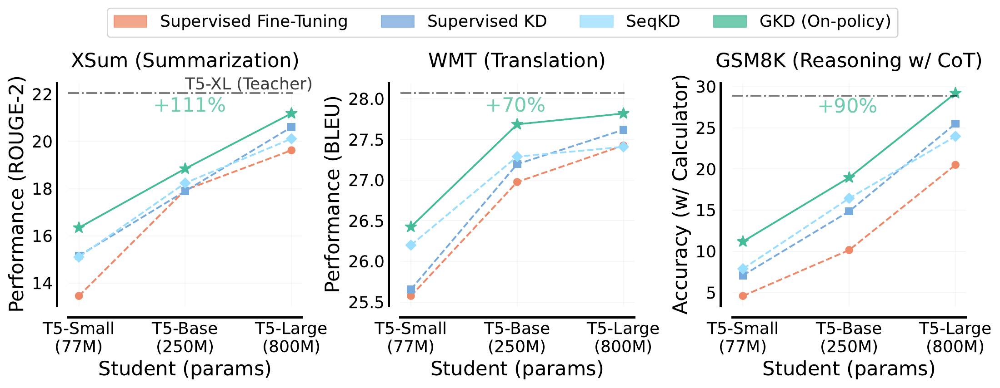
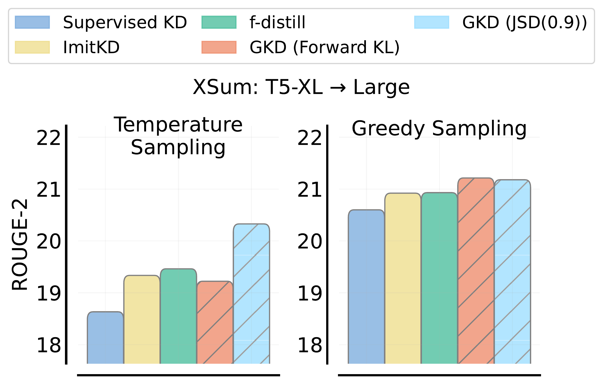
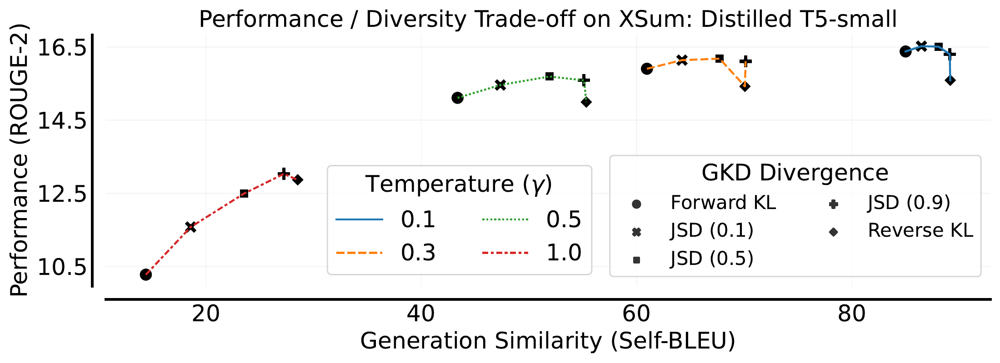
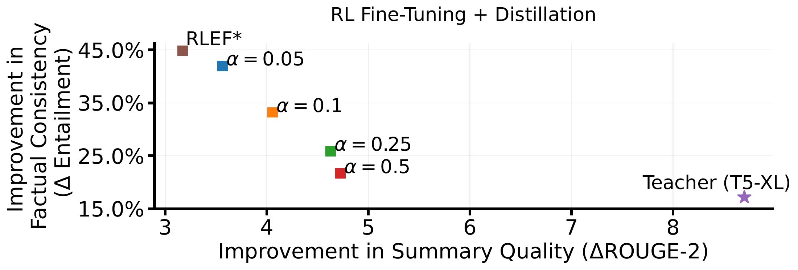
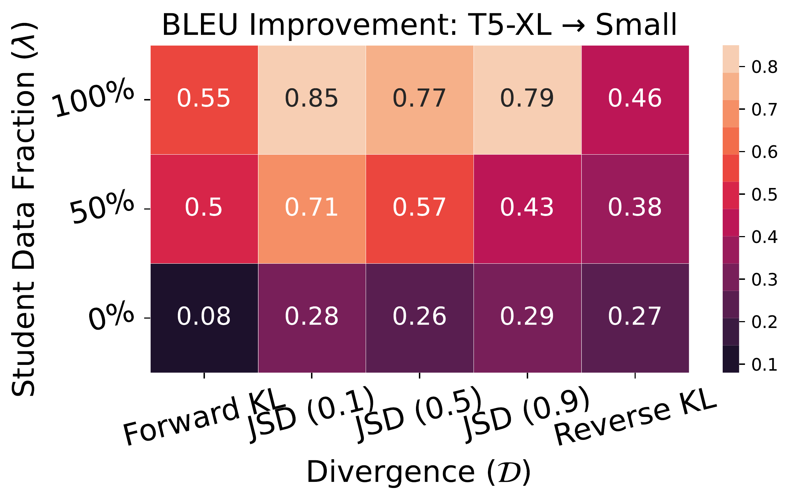
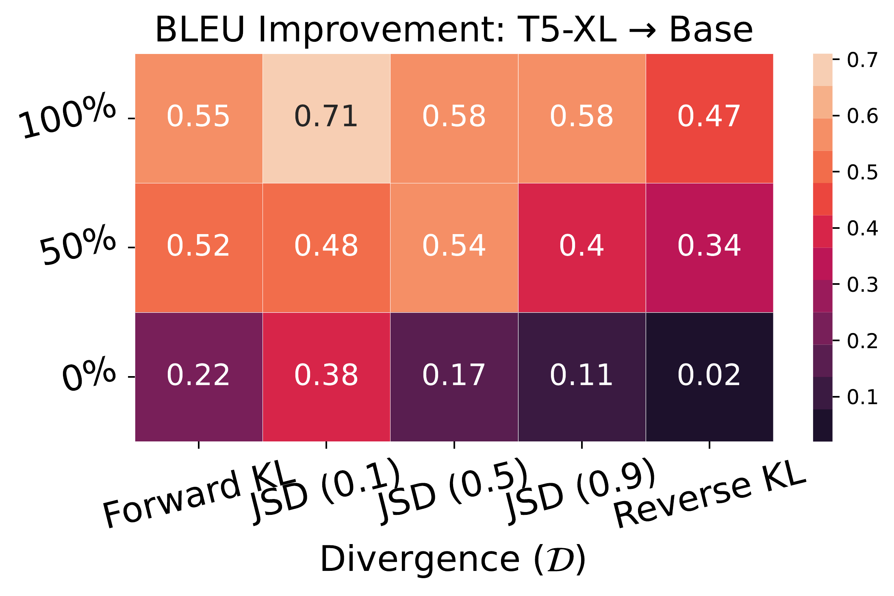
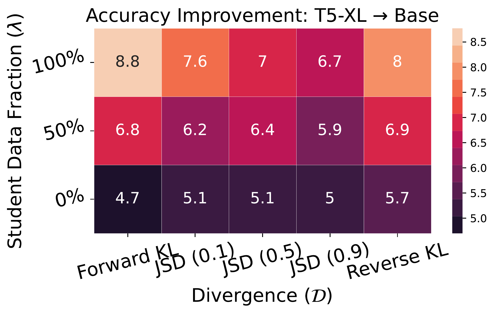
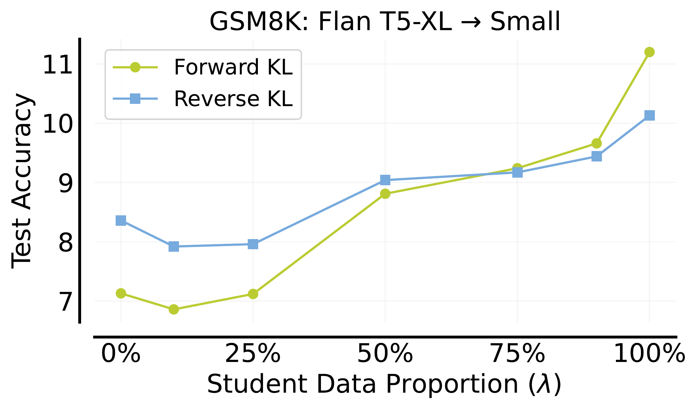
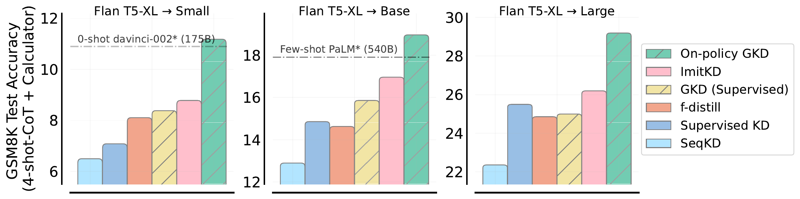

# On-Policy Distillation of Language Models: Learning from Self-Generated Mistakes（GKD）

[所属章节](../index.md) · [来源与阅读状态](../../../sources/papers.json)


作者：Rishabh Agarwal、Nino Vieillard、Yongchao Zhou、Piotr Stanczyk、Sabela Ramos、Matthieu Geist、Olivier Bachem；发表于 ICLR 2024。本文固定版本为 arXiv `2306.13649v3`（2024-01-17）：[原文](https://arxiv.org/abs/2306.13649v3)，[开放许可](http://creativecommons.org/licenses/by/4.0/)。本文依据固定 PDF、正文抽取文本和随附 TeX 工程阅读；正文第 1–6 节、正文图 1–10 及与正文结果直接相关的附录 A.1–A.7 均核对，未逐项展开参考文献和所有附录图的训练日志。

## 这篇论文要解决什么

知识蒸馏把大而强的 teacher 的行为迁移到小 student，以降低部署时的参数量、显存和推理成本。自回归语言模型的特殊困难在于：训练时常把固定的人工答案或 teacher 生成的答案喂给 student；部署时却让 student 按自己的历史逐 token 生成。一次早期错误会改变后续前缀，因而 student 在训练中看到的前缀分布和推理中自己会走到的前缀分布不同。这是 imitation learning 中的 train–inference distribution mismatch。

GKD（Generalized Knowledge Distillation）的核心是把蒸馏写成带交互式专家的模仿学习：对输入 $`x`$，让 student 自己生成输出 $`y`$，再在这条真实会被 student 访问的轨迹的每个前缀上查询 teacher 的 token 分布。student 因而能在“自己犯错”的状态上得到 teacher 的密集反馈。GKD 同时把两件事参数化：轨迹来自固定数据还是 student（混合比例 $`\lambda`$），以及 teacher/student token 分布之间用哪种散度（forward KL、reverse KL 或广义 JSD）。论文的实验结论是，on-policy 数据通常比固定输出更重要，但最佳散度随任务、student 容量和评估采样温度变化。

## 先把两个“分布”分开

给定输入 $`x`$ 和已生成前缀 $`y_{<n}`$，自回归模型输出词表 $`\mathbb V`$ 上的下一 token 分布。teacher 记为 $`p_T(\cdot\mid y_{<n},x)`$，student 记为 $`p_S^\theta(\cdot\mid y_{<n},x)`$。完整序列的概率是逐 token 概率之积，$`p(y\mid x)=\prod_n p(y_n\mid y_{<n},x)`$；论文为简洁把 $`p(y_n\mid y_{<n},x)`$ 写成 $`p(y_n\mid x)`$。生成采用温度为 $`\gamma`$ 的 softmax；训练 student 固定 $`\gamma=1`$，生成 on-policy 轨迹时允许有随机性，评估则用 greedy（$`\gamma\to0`$）、温度采样或 beam search。

这里有两个容易混淆、但必须分别讨论的分布。

1. **前缀/轨迹分布**：固定数据方法从 $`(X,Y)`$ 抽取人工或 teacher 输出，故每个前缀来自 $`q_{\mathrm{fixed}}(y_{<n}\mid x)`$；on-policy GKD 从 $`y\sim p_S^\theta(\cdot\mid x)`$ 采样，故前缀来自当前 student 的 $`p_S^\theta`$。后者随参数更新而改变，正是与部署分布对齐的对象。
2. **同一前缀下的下一 token 分布**：在已访问的 $`y_{<n}`$ 上，teacher 与 student 各有一个词表分布，散度只比较这两个条件分布。teacher 不负责产生整条 on-policy 轨迹；它在 student 轨迹的状态上提供 logits/概率标签。

因此，“on-policy”改变的是**在哪些前缀上计算 token-level loss**，不是把 teacher 变成 student，也不是直接最小化完整序列分布的 KL。轨迹采样的梯度不回传：论文明确把 $`p_S^\theta(y\mid x)`$ 当作采样分布、停止梯度，避免需要对离散采样求导并保持训练稳定。

## 散度：方向、容量不足与一个两 token 例子

对离散分布 $`P,Q`$，

```math
D_{KL}(P\|Q)=\sum_{c\in\mathcal C}P(c)\log\frac{P(c)}{Q(c)}.
```

本文把 $`D_{KL}(p_T\|p_S)`$ 称为 forward KL，把 $`D_{KL}(p_S\|p_T)`$ 称为 reverse KL。前者是常规 supervised KD 的方向：teacher 的每个高概率 token 都要求 student 覆盖，和在经验标签分布下的 maximum likelihood 一致；后者更 mode-seeking，倾向集中在 teacher 的主要模式。有限容量 student 无法精确复制 teacher 的多峰分布时，forward KL 可能为了覆盖全部 teacher 支持而把质量分给 teacher 极不可能的 token，造成采样时幻觉；reverse KL 会舍弃部分模式，换取生成样本更像 teacher，但可能牺牲多样性。

具体地，假设某个前缀下词表只有 $`a,b,c`$，teacher 为 $`P=(0.60,0.35,0.05)`$，student 受限于只能表达“单一主模式”，候选 $`Q_a=(0.90,0.08,0.02)`$ 或 $`Q_b=(0.05,0.90,0.05)`$。$`Q_a`$ 抓住 teacher 主峰，$`Q_b`$ 抓住次峰。若 student 必须用一个窄分布覆盖 teacher 的两个峰，forward KL 会惩罚 $`P(a)>0`$ 而 $`Q(a)`$ 太小，也惩罚 $`P(b)>0`$ 而 $`Q(b)`$ 太小，倾向把质量铺到两个区域（实际参数化可能落在两峰之间的无意义区域）；reverse KL 在 $`Q`$ 给质量的位置要求 $`P`$ 也有质量，因此倾向选 $`Q_a`$ 或 $`Q_b`$ 的一个模式。这个例子是对“mode-covering/mode-seeking”的教学化解释，不是论文的额外实验；论文正文图 A.16 用混合分布和单峰 Gaussian 展示同一现象。

论文使用有界的广义 Jensen–Shannon 散度：

```math
D_{JSD(\beta)}(P\|Q)=\beta D_{KL}(P\|M)+(1-\beta)D_{KL}(Q\|M),
\qquad M=\beta P+(1-\beta)Q,
```

其中 $`0<\beta<1`$。当 $`\beta\to0`$，按比例归一化后的梯度接近 forward KL；当 $`\beta\to1`$，行为接近 reverse KL。JSD 在分布支持不相交时仍有界。故 $`\beta=0.1`$ 通常更像覆盖 teacher，$`\beta=0.9`$ 更像选择 teacher 的高概率模式，$`\beta=0.5`$ 居中。它们不是“教师和学生完整序列概率的三个不同算法”，而是对每个已访问前缀的下一 token 分布计算，再取平均。

对输出 $`y`$，论文将 token-level 散度平均为：

```math
D(p_T\|p_S^\theta)(y\mid x)=\frac1{L_y}\sum_{n=1}^{L_y}
D\bigl(p_T(\cdot\mid y_{\lt n},x)\|p_S^\theta(\cdot\mid y_{\lt n},x)\bigr).
```

分母 $`L_y`$ 是该输出的 token 长度；因此公式本身不是把长输出的损失按 token 总和累加，而是每条轨迹先做长度平均，再按样本求期望。

## 从 supervised KD 到 GKD

固定 ground-truth 输出时，SFT 最小化 $`\mathbb E_{(x,y)\sim(X,Y)}[-\log p_S^\theta(y\mid x)]`$。SeqKD 用 teacher 生成的高概率序列替代人工 $`y`$，但仍是固定输出训练。Supervised KD 保持固定 $`(X,Y)`$ 的轨迹，在每个前缀查询 teacher 全词表概率，目标为 $`D_{KL}(p_T\|p_S)`$。

GKD 统一这些方法：

```math
\begin{aligned}
L_{GKD}(\theta)=&(1-\lambda)\,\mathbb E_{(x,y)\sim(X,Y)}
 [D(p_T\|p_S^\theta)(y\mid x)]\\
&+\lambda\,\mathbb E_{x\sim X,\;y\sim p_S^\theta(\cdot\mid x)}
 [D(p_T\|p_S^\theta)(y\mid x)].
\end{aligned}
```

$`\lambda=0`$ 是 supervised GKD/KD，$`\lambda=1`$ 是纯 on-policy GKD；$`0<\lambda<1`$ 是混合。Algorithm 1 每步先抽 $`u\sim U[0,1]`$：若 $`u\le\lambda`$，从 $`X`$ 取输入并由 student 采样输出；否则从 $`(X,Y)`$ 取固定样本，然后用 teacher 分布计算散度并更新 $`\theta`$。这等价于按比例混合两种轨迹来源。若只有未标注 $`X`$，on-policy 项仍可运行；若没有 teacher 查询，则只能退化为 SFT/SeqKD。

训练过程可跟踪为：

```text
给定 teacher pT、初始已 SFT 的 student pS、输入集 X 和可选配对集 (X,Y)
重复 K 步：
  按 lambda 选择一批固定输出，或让 student 在每个 x 上按 gamma=1 采样 y
  对 y 的每个前缀请求 teacher 与 student 的词表概率
  对每条 y 平均 D，再对 batch 平均；只对 student 参数反向传播
```

作者特别假设 student 已有“足够可用”的生成质量；随机初始化 student 可能产生 teacher 无法提供有意义反馈的长错误轨迹。实验均从 supervised FT student 开始，这与 RLHF 先 SFT、再 online RL 的两阶段流程相似。

## 与 RL fine-tuning 的结合

当目标是不可微的序列奖励 $`r(y)`$（例如摘要事实一致性），可把 on-policy GKD 当作 teacher 正则项：

```math
J(\theta)=\mathbb E_{x\sim X}\left[(1-\alpha)\mathbb E_{y\sim p_S^\theta}[r(y)]
-\alpha\mathbb E_{y\sim p_S^\theta}[D(p_T\|p_S^\theta)(y\mid x)]\right].
```

$`\alpha=0`$ 是纯 RL，$`\alpha=1`$ 是纯 on-policy distillation。论文把它用于 XSum：奖励是 T5-XXL NLI 分类器给出的 textual entailment 分数，JSD(0.9) 作为蒸馏项。增大 $`\alpha`$，ROUGE-2 提升而事实一致性改善减小，形成可调折中。作者建议在已有 RLHF/RLAIF 流程中用 reverse KL 或 JSD(0.9) 作为接近初始 policy 的正则。这里也不能把该项解释成“自动压缩推理长度”：它约束 token 分布，奖励项决定任务性质；论文未将推理长度作为目标。

## 实验共同条件

教师是约 3B 参数的 T5-XL，student 是 T5-small（77M，教师大约 38 倍）、T5-base（250M，12 倍）、T5-large（800M，3.8 倍）。除任务特殊设置外，所有方法从相同 supervised FT student checkpoint 开始。GKD 比较 forward KL、reverse KL、JSD(0.1/0.5/0.9)，并比较 $`\lambda=1,0.5,0`$。基线含 SeqKD、Supervised KD，以及可视为 $`\lambda=0.5`$ 的 forward-KL ImitKD 和 total-variation f-distill。

训练成本不是零：GKD 每步还要 student 采样并在轨迹上获得 teacher logits。附录报告 GSM8K 上，相对于固定输出采样，student 采样开销约为 1.8×（38× teacher/student）、2×（12×）、2.2×（3.8×）；RL+GKD 因已有 student 采样且只需 teacher inference，额外开销相对小。作者强调真实部署的大头通常是服务推理而非一次 fine-tuning。论文没有给出统一的总 token、FLOPs、端到端美元成本曲线，也没有把训练中生成 token 数转化为“压缩了多少 token”。

## 主实验一：XSum 摘要

XSum 是新闻文章—人工摘要数据集，指标为 validation split 上的 ROUGE-2（作者说 ROUGE-1/ROUGE-L 趋势类似）。Teacher/student 都先在 XSum 上 supervised FT。训练 40K steps、batch 32、最大输入/输出 1024/64；通常 LR 0.0003（T5-small forward KL 用 0.001；reverse KL 对高 LR 更敏感），评估既有 greedy 也有温度采样。图 1 的总体对比使用 greedy；图 2/3 的温度采样为 $`\gamma=1`$，相应实验把 teacher softmax temperature 设为 0.1。



图 1 横向比较 student 尺寸。ground-truth FT 与 Supervised KD 用固定人工摘要，SeqKD 用 teacher 摘要，GKD 用 student 自采样；WMT 的 GKD 用 JSD(0.1)，XSum/GSM8K 用 forward KL。三种 student 尺寸上 GKD 都超过常见 baseline；作者概括相对初始 student 的平均收益相对 baseline 提升为摘要 2.1×。T5-small 的摘要表现还超过 PaLM 540B 的 few-shot 结果，作者据此强调 task-specific 蒸馏的参数效率；这是性能/参数比较，不是 token 或推理时延测量。



图 2 固定 teacher→T5-large，分别看 greedy 和温度采样。on-policy GKD 变体总体优于 Supervised KD、ImitKD、f-distill；JSD(0.9) 在两种评估方式都表现强。图 3 使用 T5-small，训练输入只有 1K（0.5%）、10K（5%）、50K（25%）XSum 例子。一个重要比较是：只用 5% 数据、且没有 ground-truth summary 的 on-policy GKD，超过使用完整训练集人工摘要的 Supervised KD 与 ImitKD，说明数据效率来自访问 student 实际前缀而不是单纯更多标签。



图 4 改变生成温度，横轴用 Self-BLEU 衡量 diversity（100 近似确定性，0 是最大多样性），纵轴是 ROUGE-2。沿 forward KL→JSD(0.1)→JSD(0.5)→JSD(0.9)→reverse KL，mode-seeking 增强，通常多样性下降；在 $`\gamma=1`$ 高温时 JSD(0.5/0.9) 和 reverse KL 常带来更高质量。降低温度本身就减少多样性，也会缩小不同散度的性能差距。故“最佳散度”不是独立于解码策略的常数。

附录图 A.12/A.13 对 student 尺寸、$`\lambda`$ 和散度展开数值。温度采样下 on-policy reverse KL/JSD(0.9) 通常最好，forward KL 较差；greedy 下不同散度差异小，但 on-policy 和 mixed 仍明显超过 supervised。比如 T5-small 温度采样初始固定学生约 13.4，$`\lambda=1`$ 的不同变体可达约 14.5–15.5；greedy 初始约 13.4，on-policy 约 16.3–16.6（这些是图中具体格子的 ROUGE-2，差异依赖散度）。



RL+GKD 实验从 T5-base 出发，以 NLI entailment 为 reward，横轴报告相对初始 student 的 ROUGE-2 改善，纵轴报告事实一致性改善。$`\alpha`$ 从 0.05、0.1、0.25 到 0.5 时，沿着“奖励一致性—摘要质量”曲线移动：蒸馏权重更大，ROUGE-2 更高；纯 RLEF*（向原 student 正则）和 12× 大 teacher 作为参照。GKD+RL 在 ROUGE-2 上超过 RLEF*，事实一致性超过 teacher。该结果证明的是一个可调的目标组合，不是 GKD 单独保证事实正确。

## 主实验二：WMT14 英译德

WMT14 en→de 用 validation BLEU，teacher 是 supervised FT T5-XL，BLEU 约 28、teacher temperature 1.0；评估 beam search。训练 100K steps、batch 32、tokenized input/output 上限各 80，LR 0.0003、warmup 5K，结果平均 3 seeds。




图 6 报告蒸馏后 student 相对初始 student 的 BLEU 增量，分别为 T5-small（初始 25.58）和 T5-base（26.98）。横轴按 forward KL、JSD(0.1/0.5/0.9)、reverse KL，纵轴按 $`\lambda=0,0.5,1`$ 排列。纯 on-policy 和 mixed 基本一致优于仅固定 supervised 数据；JSD 变体通常优于两种 KL，student 变大后差距缩小。正文图 1 和附录图 A.15 进一步表明纯 on-policy GKD 超过 SeqKD/Supervised KD；在 small/base 平均上，最佳 on-policy GKD 的 BLEU 增量比 ImitKD 高 53%、比 f-distill 高 162%。

这组结果把数据分布的作用与散度方向分开：WMT 的解码是 beam search，故不能把 XSum 温度采样下 mode-seeking 的结论直接搬来；图 1 对 WMT 选 JSD(0.1)，而 XSum/GSM8K 选 forward KL，恰好体现任务依赖。

## 主实验三：GSM8K 多步算术推理

GSM8K 是需要多步推理的年级数学题。输入前置 Wei 等人的 4 个 CoT exemplars；监督起点使用 Magister 等人从 PaLM-540B 生成的约 5.3K 条 problem–CoT 对，Flan-T5 student/teacher 先 SFT 10K steps。评估在 test split 上检查最终答案，使用外部 calculator；teacher Flan-T5-XL 准确率 27.9。蒸馏训练 40K steps、batch 32、最大 input/output 512/320、teacher temperature 0.1，结果平均 3 seeds，greedy evaluation。




图 7 比较 Flan T5-XL→T5-base 的准确率增量（初始 student 10.16，teacher 27.9）。只用固定 CoT（$`\lambda=0`$）或固定+student 混合，通常都落后于纯 student-generated CoT；forward KL 很强，reverse KL 也不错，尤其固定数据时。图 8 逐渐提高 student-generated 数据比例，至少超过 25% 后性能通常继续提升。这说明 CoT 的收益不是“复述 teacher 的正确思路”这么简单，而是 student 自己会生成的错误推理前缀需要被 teacher 纠正。



图 9 在 small/base/large 三种 student 上与 Supervised KD、SeqKD、ImitKD、f-distill 及外部 GPT-3 davinci-002/PaLM 参考比较；on-policy GKD 全尺寸占优。正文没有把每一条 CoT 的 token 长度、失败轨迹比例或计算器调用成本报告成曲线，因而不能从准确率图推出“GKD 让推理更短”。它展示的是最终答案正确率和蒸馏的迁移能力。

附录 A.1 的 self-distillation 用相同架构/尺寸的 Flan-T5-large：teacher 是 GSM8K SFT 模型（20.5%），未在 GSM8K 训练的 student 为 14.4%；on-policy GKD 变体超过 supervised KD，甚至超过 teacher。这是有趣的自蒸馏现象，但不改变主实验的 teacher/student 容量假设。

## 主实验四：任务无关 instruction tuning

为检验蒸馏后能否迁移到未知下游任务，作者用 FLAN T5-XL teacher 蒸馏到 FLAN T5-Base（正文图示和文字有时称 T5-base；固定 TeX 的 task-agnostic 段落也如此）。训练数据是 FLAN2021 的 5.36M 个例子、62 个语言理解/生成任务；训练 50K steps、batch 128、LR 0.0001、输入/输出上限 2048/256、teacher temperature 1，greedy evaluation。持出评估是 MMLU 57 任务和 BBH 23 任务，报告标准 few-shot prompt 的 exact-match，按任务不加权平均；评估任务未进入蒸馏数据。由于 teacher 在线生成 SeqKD 的成本，未运行 SeqKD。

图 10 的起点是 student MMLU 35.6%、BBH 31.25%，teacher 分别 52.4%、41%。on-policy reverse KL 比 Supervised KD、ImitKD 和 on-policy forward KL 更好，作者报告 held-out MMLU 约 +1 个百分点、BBH 约 +2 个百分点的绝对提升。作者的解释是 reverse KL 的 mode-seeking 使模型集中于 instruction 的主意图、少关注不相关细节；这是合理假设，不是由该图单独证明的因果机制。

## 结果应该怎样归因

可以直接归于论文证据的结论有三条：第一，改变轨迹来源到 student on-policy 前缀，在 XSum、WMT、GSM8K 以及 FLAN instruction tuning 上大体有效；第二，散度的优劣依任务和评估采样而变，XSum 温度采样偏好 mode-seeking，WMT 的 JSD 变体表现较强，GSM8K greedy 下 forward KL 很强；第三，GKD 的损失可和 sequence-level RL reward 共同优化。

由公式可推出但论文没有单独定理证明的是：student 在自己的前缀上获得 teacher 反馈会减少 covariate shift；停止对采样分布求导后，更新是“在当前 policy 状态分布上改进 conditional action 分布”，并非完整 policy-gradient。forward/reverse KL 的覆盖/模式选择解释来自容量不足下的优化性质，不能写成所有任务都适用的保证。教学上的“三 token 例子”也只是说明方向取舍，不是论文实验数据。

## 与“推理时 token 效率”的关系

GKD 的直接目标是**模型蒸馏和部署参数/推理成本**：teacher 约 3B，student 77M–800M，论文展示小模型在同一任务上保持或提高 ROUGE/BLEU/accuracy。它没有把“输出 token 数”“输入 token 数”“总 token”“FLOPs/每 token latency”作为主要评价轴，也没有报告 CoT 平均长度、错误轨迹长度或 token budget 下的准确率。因此，GKD 能让推理更便宜的证据主要来自更小 student 的参数量，而不是证明每个答案用更少 token。

尤其在 GSM8K，CoT 是方法的一部分，准确率提升可能伴随相同、更多或更少的 reasoning tokens；正文没有测量，不能默认 OPD/GKD 压缩长度。教师大小、student 部署效率和训练期 student sampling 开销是另一组变量：student 更小降低服务成本，但训练期 on-policy sampling 仍有额外开销；这不是“推理更短”。若研究 token efficiency，应另设固定准确率/质量下的输出 token、首 token 延迟、总 decode FLOPs、失败重采样次数和训练成本等测量。

## 局限与需要谨慎的地方

作者的 teacher/student 均为 T5/Flan-T5，并从 supervised FT 初始化；随机初始化 student、开放式 RL 反馈和现代 decoder-only LLM 的规模外推并未在本文正文验证。on-policy 计算开销随 teacher/student 比例上升，论文给的是 GSM8K 相对固定输出的约 1.8×–2.2×采样开销，而非完整 wall-clock 或货币成本。散度选择需要同时调 teacher/student 温度和评估解码；把 JSD(0.9) 在 XSum 的优势推广到 greedy 或 WMT 会失真。RL+GKD 的 factuality 使用一个 NLI reward，不能等同人工事实核验。任务无关实验只在 held-out MMLU/BBH 的平均 exact match 上报告短期 checkpoint，不足以证明所有新任务都提升。最后，本文没有提供 token-level reasoning 长度或成本前沿，所以“token-efficient”只能作为小模型部署的间接关系，不能作为 OPD 压缩推理序列的结论。

## 正文图与可复用资产

正文关键图已从作者随附 TeX 工程复制到 `assets/`，原图均来自论文固定版本、许可为 CC BY 4.0，未裁剪：

- `fig1_intro_gkd.pdf`：Figure 1，方法总览及三任务学生尺寸比较。
- `fig2_xsum_baselines.pdf`：Figure 2，XSum baseline 与温度/greedy 对比。
- `fig3_xsum_data_scaling.pdf`：Figure 3，XSum 数据比例。
- `fig4_diversity_performance.pdf`：Figure 4，散度、温度、ROUGE-2 与 Self-BLEU。
- `fig5_rl_gkd.pdf`：Figure 5，RLAIF reward 与 GKD 的折中。
- `fig6_wmt_small.pdf`、`fig6_wmt_base.pdf`：Figure 6，WMT 的 $`\lambda`$×散度消融。
- `fig7_gsm8k_ablation.pdf`、`fig8_gsm8k_data.pdf`：Figure 7–8，GSM8K 消融与 on-policy 比例。
- `fig9_gsm8k_baselines.pdf`：Figure 9，GSM8K baseline 比较。
- `figA_jsd.pdf`：正文引用的 JSD/forward/reverse 行为补充图资产。

这些图的复用依据是 source manifest 中的 [CC BY 4.0](http://creativecommons.org/licenses/by/4.0/)；`source/` 保留原 PDF、文本和 TeX。
