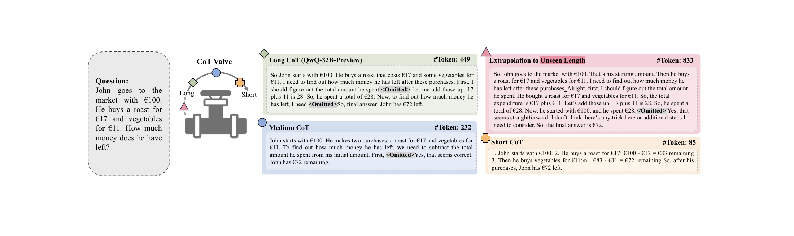
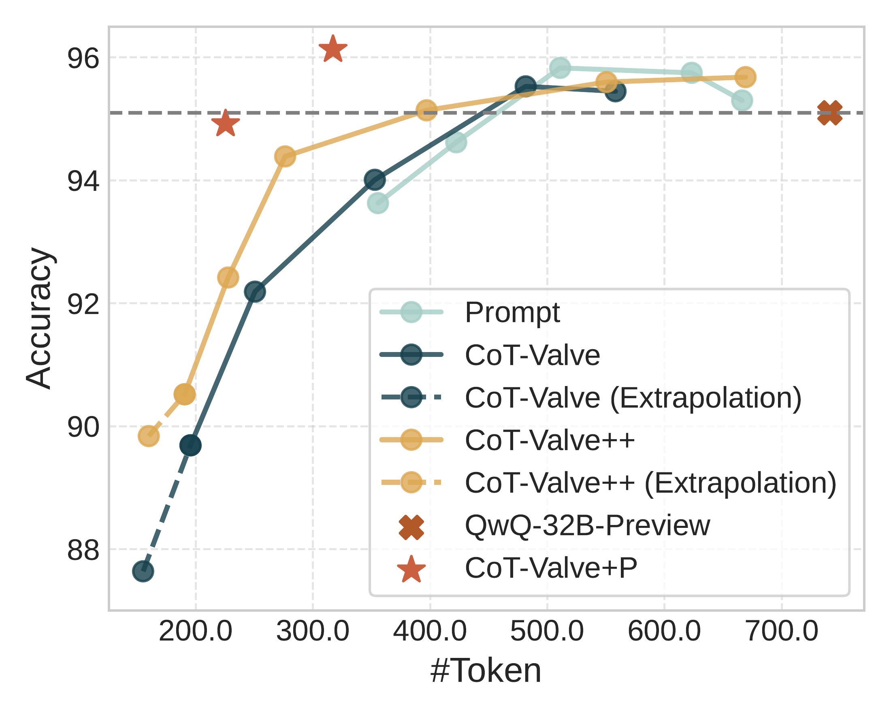
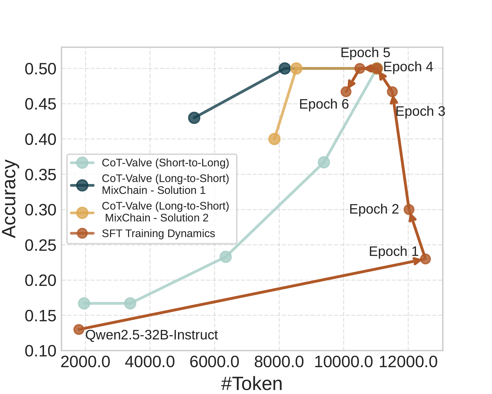
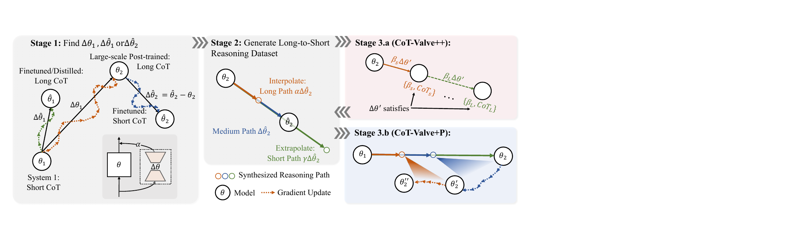
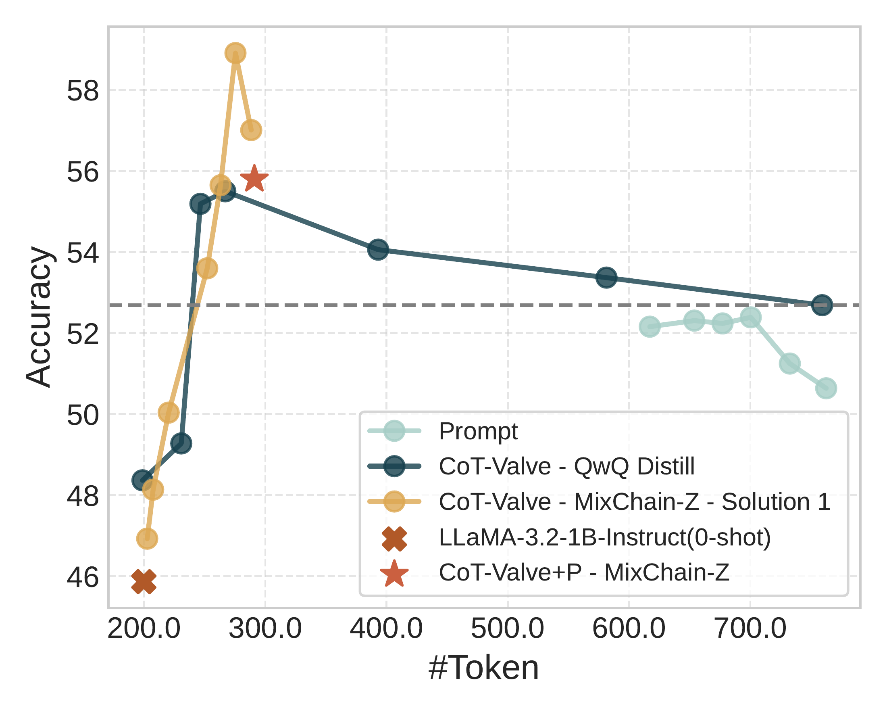

# CoT-Valve：可按长度压缩的 Chain-of-Thought 调优

[所属章节](../index.md) · [来源与阅读状态](../../../sources/papers.json)


- **作者**：Xinyin Ma、Guangnian Wan、Runpeng Yu、Gongfan Fang、Xinchao Wang（National University of Singapore）
- **年份与版本**：2025；arXiv:2502.09601v1（2025-02-13）
- **原始链接**：[arXiv:2502.09601v1](https://arxiv.org/abs/2502.09601v1)，[PDF](https://arxiv.org/pdf/2502.09601v1)
- **固定材料**：`source/paper.pdf`、`source/paper.txt`、`source/tex/acl_latex.tex`，版本由 `source/source-manifest.json` 固定为 `2502.09601v1`。
- **实际阅读范围**：正文第 1–5 节（引言、相关工作、方法、实验、结论），正文所有图表；为解释实验设置和正文结论补读附录 A–B 的实现、数据统计、DoRA、LoRA 模块和 prompt-control 分析。参考文献只用于辨认基线关系。

## 1. 论文要解决什么问题

Chain-of-Thought（CoT）让模型把多步解题显式写出来，通常提高数学和代码任务的正确率，但推理成本随着中间 token 增长。作者观察到两个不对称现象：简单问题上，QwQ、DeepSeek-R1 等模型经常写出远超需要的链；困难问题仍可能需要长链。于是目标不是把所有回答压成固定短度，而是让**一个模型**能按需要在长、 中、短推理之间切换，并在简单问题上减少输出，在困难问题上保留测试时扩展能力。

已有的 prompt 控制方法在提示里写“少于 N tokens”，或使用特殊 summary token，但控制粗且不可靠。本文提出 CoT-Valve：寻找参数空间中一个方向 $`\Delta\theta`$，沿这个方向移动时，模型生成链的长度系统性变化。把这个方向放进一个低秩 LoRA 分支，推理时仅改变 LoRA 分支的强度 $`\alpha`$，就能使用同一个底座模型产生不同长度的 CoT。

这里的“长度控制”是分布和平均行为的控制，不是硬 token 上限。模型仍可能提前结束、超过目标或在复杂题上答错；真正的最大生成长度仍由推理框架的 `max token` 参数决定。论文报告的是答案中的平均 token 数和准确率，而非严格满足每道题的预算比例。

## 2. 核心方法：把长度当作参数方向

### 2.1 从生成概率到可学习的长度方向

给定问题 $`q`$、最终答案 $`a`$，以及由 $`n`$ 个 token 组成的中间思路 $`t_1,\ldots,t_n`$，模型参数为 $`\theta`$ 时，论文写出联合生成关系（式 1）：

```math
p(a\mid t_1,\ldots,t_n,q;\theta)\prod_{i=1}^{n}p(t_i\mid t_{<i},q;\theta).
```

若另有较短的正确思路 $`t_1,\ldots,t_m`$，其中 $`m<n`$，目标是找到参数改变量 $`\Delta\theta`$，使模型在短思路上仍能生成正确答案：

```math
\max_{\Delta\theta}\;\mathbb E_{(q,a)\sim D}\left[p(a\mid t_{1:m},q;\theta+\Delta\theta)\prod_{i=1}^{m}p(t_i\mid t_{<i},q;\theta+\Delta\theta)\right].
```

这个目标的关键是：训练样本的最终答案不变，变化主要发生在中间推理链。因此 $`\Delta\theta`$ 可以看成把模型从长-CoT 行为推向短-CoT 行为的 task vector。论文并没有声称任意两个 checkpoint 的差都必然是纯“长度方向”；它依赖于成对数据、正确答案过滤和实际测得的长度随 $`\alpha`$ 变化。

### 2.2 LoRA 作为可调“阀门”

论文用 LoRA 表示这个方向。对原线性层权重 $`W`$，LoRA 以低秩增量替换为

```math
W' = W + \Delta W,\qquad \Delta W = B A,
```

其中 $`A`$、$`B`$ 的秩为 $`r`$，训练参数量远小于完整权重。这里不需要把 LoRA 的全部参数并入底座：可以将它保存为一个额外分支，在推理时缩放该分支。用 $`\alpha`$ 表示方向强度时，可以理解为

```math
\theta_\alpha = \theta + \alpha\Delta\theta.
```

论文的经验方向是：底座/弱方向（较小 $`\alpha`$）产生较长、更复杂的链，较大 $`\alpha`$ 产生更短的链。$`0<\alpha<1`$ 是在长、短行为之间插值；$`\alpha>1`$ 是外推，尝试超出训练长度范围的更短链。具体方向取决于如何得到 $`\Delta\theta`$，不能把“增大 alpha 总会缩短”当作数学保证。

**可跟踪算例。** 设某题从一条模型链得到 500 token，从另一个短链 checkpoint 得到 120 token。若 LoRA 方向近似连接二者，$`\alpha=0`$ 可保持约 500 token 的行为，$`\alpha=0.5`$ 可能落在约 300 token，$`\alpha=1`$ 接近短链，$`\alpha=1.5`$ 则尝试更短的外推。实际输出仍是离散自回归采样，长度不会按线性函数精确变化，而且准确率可能先升后降。

### 2.3 CoT-Valve 的三阶段流程



图 1（`assets/teaser_v9.pdf`）以 John 用 €100 买东西为例，展示同一问题的 long/medium/short 三条正确路径，示例数字分别约 449、232、85 token。长版本反复解释，短版本只保留减法步骤；它说明目标是删去冗余表达而保留解题信息，并不说明所有任务都可压到 85 token。


图 2（`assets/main_v8.pdf`）把训练流程分为三步：

1. **得到方向。** 从已有的 post-trained/distilled 长-CoT 模型与 base LLM、或从带标注解答的冷启动训练，得到一个能把链变长/变短的参数更新 $`\Delta\theta`$。
2. **构造 MixChain。** 固定同一问题和答案，通过不同 $`\alpha`$ 生成从长到短的多个正确路径，并过滤错误答案。每题有一组长度递减的 solution。
3. **用 MixChain 改良方向。** CoT-Valve++ 在训练中显式输入长度因子 $`\beta`$，使方向上多个位置都对应相应长度；CoT-Valve+P 则按长到短的阶段渐进压缩，而不是直接用最短链训练。

### 2.4 MixChain 的两种来源

论文区分三类训练数据：

- **Ground-truth/cold start**：GSM8K、PRM800K 等已有人工或模型合成解答，用作初始训练。
- **MixChain-C（cold-start）**：先用带解答数据训练出可控模型，再沿其方向生成多个长度的答案。
- **MixChain-Z（zero-shot）**：没有完整解释时，用 base LLM $`\theta_1`$ 与已有 reasoning model $`\theta_2`$ 的 checkpoint 差构造方向，例如 LLaMA-3.1-8B → DeepSeek-R1-Distill-Llama-8B，或 Qwen-32B-Instruct → QwQ-32B-Preview，再按 $`\alpha`$ 生成链。

MixChain-Z 的“从一个 checkpoint 到另一个 checkpoint 的更新”在训练内部是黑箱；作者强调 base model 的质量显著影响合成数据质量。所有数据集都过滤最终答案错误的链。附录表 9 给出规模：GSM8K Ground-Truth 为 7,473 条、平均 121.8 token；GSM8K MixChain-C 为 22,419 条、平均 294.8 token；GSM8K MixChain-Z 为 6,863 条，四种解的平均长度约 116.0–497.2 token；PRM12K MixChain-Z 为 8,841 条，平均长度约 172.3–1003.2 token；LIMO Ground-Truth 817 条，平均 6984.1 token，MixChain-C 的 solution 1/2 平均约 2994.7/4890.6 token。长度使用 QwQ-32B-Preview tokenizer 统计。

### 2.5 CoT-Valve++：训练方向上的多个长度

初始 CoT-Valve 只要求 $`\alpha=1`$ 的方向能完成训练目标，但部署时会在整条方向上使用多种 $`\alpha`$，造成训练—推理不一致。CoT-Valve++ 为每个 MixChain 样本加入归一化长度因子 $`\beta`$：

```math
\beta=1-\frac{m-m_{\min}}{m_{\max}-m_{\min}},
```

其中 $`m`$ 是该样本思路长度，$`m_{\min}`$、$`m_{\max}`$ 是同一问题中最短和最长解的长度。于是短解的 $`\beta`$ 较大、长解较小。新目标（式 3）用 $`\theta+\beta\Delta\theta'`$ 生成对应解。这个比例只有在 $`m_{\max}>m_{\min}`$ 时有意义；论文给出的样本构造隐含了这个非空分母条件。它也只是把长度位置编码进训练目标，不保证 token 长度线性等于 $`\beta`$。

### 2.6 CoT-Valve+P：渐进式压缩

CoT-Valve+P 借鉴逐步剪枝：先用较长解训练，再在下一轮换成更短解，逐轮推进，最后才到最短解。作者的动机是短链可能缺少小模型学习所需的中间结构，直接短链 SFT 会损失能力；逐步缩短让模型先学会解题，再学会少说。

可以用如下教学伪代码追踪其控制逻辑（不是论文训练代码）：

```text
model = base_model
for solution_group in [long, medium, short, shortest]:
    train(model, questions + solution_group, one_stage=True)
    evaluate(model, held_out_questions)
return model_with_valve
```

这里的 `solution_group` 是同一问题的正确解集合，且每一轮都重新训练模型；推理时仍用 $`α`$ 选择链长度。它与把生成结果硬截断不同：截断可能在计算未完成时丢掉必要步骤，而 CoT-Valve 让模型学习在较早位置结束。

## 3. token、指标和比较口径

论文主要测量两件事：最终答案准确率和答案中的生成 token 数。没有报告端到端 wall-clock latency、GPU energy、FLOPs、KV-cache 内存或真实金钱成本，因此 ACU 只是一个代理指标，不能直接等同于部署成本。定义为

```math
\mathrm{ACU}=\frac{\mathrm{Accuracy}}{\#\mathrm{Params}\times\#\mathrm{Tokens}}.
```

表中 ACU 统一乘 $`10^2`$ 展示。它把参数规模和 token 数放入分母，若只比较同一模型，主要反映准确率/token 的权衡；跨模型时还混合了模型大小。准确率定义并不完全统一：LLaMA-3.1-8B 报 strict match，LLaMA-3.2-1B 报 flexible match；QwQ、R1-Distill 和 Qwen-2.5B-LIMO 优先抽取 `\boxed{}`，找不到才取回答最后一位。AIME 使用 30 题，作者在其主要实验中使用 greedy decoding 以减少随机性。

## 4. 正文主实验

### 4.1 实验设置

模型覆盖四类情形：QwQ-32B-Preview、DeepSeek-R1-Distill-Llama-8B 等已有长推理模型的长到短压缩；LLaMA-3.1-8B、LLaMA-3.2-1B-Instruct 从短-CoT 向 QwQ 蒸馏的短到长控制；以及 Qwen2.5-32B-Instruct 经 LIMO 先训练长链、再压缩的 short-long-short。大多数实验使用 LoRA，Qwen LIMO 实验用 full fine-tuning。训练问题来自 GSM8K、PRM12K 或 LIMO，评测为 GSM8K（相对容易）和 AIME24（困难）。

附录实现参数显示训练并不完全同一：LLaMA-3.1-8B 与 LLaMA-3.2-1B 用 8 张 A5000 24GB，LoRA rank 32、`lora_alpha=64`，推理最大 2048 token；QwQ 用 2 张 H100 80GB，batch 64、最多 5 epoch、学习率 $`10^{-5}`$、LoRA rank 2、`lora_alpha=8`，GSM8K/AIME 最大生成长度 4192/8192；R1-Distill 设最大 token 30K；Qwen-32B-LIMO 用 4 张 H100，最大序列 16K，先训练 10 epoch，再训练压缩模型 5 epoch。各组的模型、数据和解码设定不同，表中数字应按组内比较阅读，不能拼成跨论文排行榜。

### 4.2 QwQ 在 GSM8K：压缩、泛化和基线



图 3(a)（`assets/gsm8k_qwq.pdf`）横轴为生成 token、纵轴为准确率；每条相连曲线是一个模型在不同控制强度下的点。Prompt 曲线能缩短到一定程度，但 CoT-Valve、外推和 CoT-Valve++ 可以继续走到更短区域。作者的核心表 1 如下（ACU 为 $`\times10^2`$）：

| 训练/方法 | GSM8K 准确率 | token | ACU |
|---|---:|---:|---:|
| QwQ-32B-Preview（基线） | 95.1 | 741.1 | 0.40 |
| Prompt（Han et al.） | 93.6 | 355.5 | 0.82 |
| Prompt（Ding et al.） | 95.5 | 617.7 | 0.48 |
| CoT-Valve，Ground-Truth | 94.0 | 352.8 | 0.83 |
| CoT-Valve++，MixChain-C | 94.4 | 276.3 | 1.07 |
| CoT-Valve+P，MixChain-Z（较长点） | 96.1 | 317.1 | 0.95 |
| CoT-Valve+P，MixChain-Z（更短点） | 94.9 | 225.5 | 1.32 |
| Overthink，SFT | 94.8 | 749.5 | 0.40 |
| Overthink，SimPO | 94.8 | 326.2 | 0.91 |
| O1-Pruner，SFT | 95.7 | 717 | 0.42 |
| O1-Pruner | 96.5 | 534 | 0.56 |

这些结果支持“在轻微准确率损失下缩短，或在相近长度下保持/提高准确率”的判断。最短点 225.5 token 的准确率 94.9%，相较 741.1 token、95.1% 基线，token 约减少 70%，但这只是 GSM8K 平均数；它不意味着每题有固定 70% 的预算削减，也没有测量延迟。

### 4.3 AIME24：困难任务仍需要更长链

表 2 同时报告 QwQ（训练集 GSM8K）和 Qwen-32B-LIMO（训练集 LIMO）在 AIME24 的 30 题结果：

| 方法 | AIME 正确数 | token | ACU |
|---|---:|---:|---:|
| QwQ-32B-Preview | 14/30 | 6827.3 | 0.021 |
| Prompt（Han） | 13/30 | 6102.5 | 0.022 |
| Prompt（Ding） | 13/30 | 5562.3 | 0.024 |
| Overthink | 13/30 | 5154.5 | 0.026 |
| CoT-Valve（GSM8K 训练） | 14/30 | 5975.0 | 0.024 |
| CoT-Valve++（MixChain-C） | 13/30 | 5360.5 | 0.025 |
| CoT-Valve+P（MixChain-Z） | 13/30 | 4629.6 | 0.029 |
| Qwen-32B-LIMO | 15/30 | 10498.2 | 0.015 |
| CoT-Valve（LIMO） | 11/30 | 6365.2 | 0.018 |
| SFT，MixChain，solution 1 | 13/30 | 5368.0 | 0.025 |
| CoT-Valve，MixChain，solution 1 | 15/30 | 8174.8 | 0.019 |

对 QwQ，CoT-Valve+P 将 token 从约 5155（Overthink）降至 4629.6，准确数也从 13/30 降至 13/30，属于相同准确率下的压缩。作者还指出，Qwen 的 Long-to-Short 过程在同等 15/30 正确数下为 8174.8 token，少于 Gemini-Flash-Thinking 的 10810.5 token；但 Qwen、Gemini、QwQ 的模型和训练条件不同，不能把它作为普适优越性证明。

这一组也是边界证据：困难 AIME 并没有显示“越短越好”。在 QwQ 上最短点仍保留很长的平均链；在 Qwen short-long-short 设置中，先学长链再压缩通常比直接短到长更稳，但压缩可能牺牲一个正确题。作者把这解释为复杂任务仍需要 test-time scaling。

### 4.4 DeepSeek-R1-Distill-Llama-8B

表 3 的基准是 R1-Distill-Llama-8B，使用 MixChain-Z GSM8K：

| 方法 | GSM8K | token | AIME24 | token |
|---|---:|---:|---:|---:|
| LLaMA-3.1-8B 0-shot | 15.7% | 915.0 | 0/30 | 1517.6 |
| R1-Distill-Llama-8B | 87.1% | 1636.6 | 14/30 | 12359.9 |
| CoT-Valve | 87.3% | 1315.2 | 6/30 | 7410.5 |
| CoT-Valve+P，MixChain-Z | 84.0% | 755.2 | 11/30 | 9039.0 |

GSM8K 上基础 CoT-Valve 几乎维持准确率并减少约 20% token；渐进压缩进一步减半左右 token，但准确率降到 84.0%。AIME 上两种压缩模型都明显低于 R1-Distill 的 14/30，说明 GSM8K 训练得到的压缩方向不能自动保留困难数学能力。这个跨数据集能力损失是不能被“ACU 更高”掩盖的。

### 4.5 短到长：LLaMA-3.2-1B 和 LLaMA-3.1-8B


图 3(b)（`assets/gsm8k_llama1b.pdf`）和表 4 说明，CoT-Valve 也能把一个较弱短-CoT 模型向更长思路推移；更有意思的是，中等长度可能比最长蒸馏链更准确。LLaMA-3.2-1B 的 GSM8K（Flexible Match）结果：

| 方法 | 准确率 | token | ACU |
|---|---:|---:|---:|
| 0-shot | 45.9 | 199.8 | 22.973 |
| SFT，QwQ Distill | 52.7 | 759.3 | 6.941 |
| CoT-Valve，QwQ Distill | 55.5 | 267.0 | 20.786 |
| CoT-Valve+P，MixChain-Z | 55.8 | 291.0 | 19.175 |
| SFT，MixChain-Z，solution 1 | 57.0 | 288.4 | 19.764 |
| CoT-Valve，MixChain-Z，solution 1 | 58.9 | 275.4 | 21.387 |

表 4 的“CoT-Valve - QwQ Distill”比直接 SFT QwQ 链从 759.3 降到 267.0 token，同时准确率从 52.7 提到 55.5；solution 1 进一步达到 58.9%。表 5 的 LLaMA-3.1-8B（Strict Match）也显示同样趋势：基础模型 15.7%、915.0 token，QwQ Distill SFT 76.3%、644.8 token，CoT-Valve 77.5%、569.8 token，CoT-Valve+P 77.1%、371.2 token，MixChain-Z solution 1 的直接 SFT 75.7%、264.1 token。CoT-Valve+P 的准确率略低于 CoT-Valve，但显著节省 token。



图 3(c)（`assets/limo_qwen.pdf`）展示 Qwen2.5-32B-Instruct 经 LIMO 后在 AIME 的 short-long-short 轨迹。图中各点包含从短到长的 CoT-Valve 训练结果、长到短的 MixChain 结果以及普通 SFT 的 epoch 动态。普通训练早期链变长，但准确率没有相同幅度增长；后期 token 下降而准确率上升。这不能简单当成 CoT-Valve 的效果，因为 training dynamics 是另一条训练过程，作者的结论是 CoT-Valve 在长度—准确率平面上提供了更平滑、可控的路径。

## 5. 消融、敏感性和失败现象

### 5.1 同一问题的不同长度并不等价

表 6 用 LLaMA-3.2-1B 只训练 MixChain-Z 中一种 solution。虽然所有 solution 都导向正确答案，长度约从 279.6 到 497.2 token，但效果并不单调：solution 1 为 57.0%/288.4 token，solution 2 为 55.1%/330.0，solution 3 为 56.5%/414.6，solution 4 为 52.5%/558.3；Ground-Truth solution 0 为 43.8%/139.4。最短和最长都不适合这个小模型，中等偏短链最好。由此可见，压缩不是删除 token 越多越好；中间步骤的组织质量比单纯长度更重要。

### 5.2 Progressive Compression 消融

表 7 在 QwQ 上比较不同阶段的 solution 序列。基线为 95.07%/741.1 token；只用 Ground-Truth solution 0 的五 epoch 为 92.19%/250.5，说明直接极短训练会伤害能力。逐步使用 `4+3`、`4+3+2`、`4+3+2+1`、`4+3+2+1+0` 的五个阶段，最终分别得到 94.84%/458.4、94.84%/339.9、96.13%/317.1、94.92%/225.5。最短的渐进方案保持接近基线准确率并大幅缩短输出，但中间点 96.13% 反而最高，说明性能—长度并非单调关系。

### 5.3 与 prompt 控制的短端比较

表 8 在 QwQ 与 LLaMA-3.2-1B 上比较 prompt 的最短点和 CoT-Valve 的最佳/最短点：QwQ prompt 为 93.6%/355.5 token，CoT-Valve 最佳为 94.4%/276.3，最短为 87.5%/133.8；1B prompt 为 52.5%/621.0，CoT-Valve 最佳为 55.5%/267.0，最短为 50.4%/247.0。作者还指出提示中要求“少于 20 tokens”时，QwQ 仍可能生成超过 350 token（附录表 12），所以 prompt 是软意图而非硬约束。CoT-Valve 的短端也会掉点，因而“能生成更短”不等于“短点始终可用”。

### 5.4 DoRA 插值分析

附录表 10 在 LLaMA-3.2-1B 上用 DoRA，改变 $`\alpha`$ 得到：$`\alpha=0`$ 为 45.9%/199.8 token，0.125 为 47.5%/219.4，0.25 为 50.2%/233.4，0.5 为 57.1%/257.7，0.75 为 55.0%/466.3，1.0 为 54.5%/772.7。链长随 $`\alpha`$ 增加，但准确率在中间强度最高，而长-CoT 端并不最好。附录文字报告 $`\alpha=0.5`$ 约 55.72%/257.7，与表格四舍五入略有差异，本文保留原表口径，不把差异解释成新结果。

### 5.5 哪些层的低秩分支更影响长度

附录表 11 在 QwQ 上只对不同模块加 LoRA：K+V 得 95.0%/687.7 token，Q 得 95.2%/621.4，O 得 95.2%/484.2，Attention 全部为 94.2%/284.2，MLP 为 93.5%/221.8，所有线性层为 92.4%/227.6。作者据此推测 attention 的 Q/K/V 本身对缩短不如 O 投影、MLP 重要；这是局部模块消融支持的解释，不是对所有架构的因果定律。

## 6. 论文结论与实际边界

作者的主要结论有三层。第一，LoRA 参数空间中确实可以找到一个在实验上可操作的 CoT 长度方向；单一模型通过 $`α`$ 插值和外推即可产生多种长度。第二，MixChain 把同一问题的长短正确解放在一起，CoT-Valve++ 改善了控制精度，CoT-Valve+P 让短链训练更稳。第三，短链有时不仅便宜还更准，尤其在 GSM8K 和小模型蒸馏上；但困难 AIME 和过度外推显示，缩短可能牺牲能力，且不同长度正确解的可学习性不等价。

与推理时 token 目标的关系是：CoT-Valve 提供的是一个**可调的平均长度—准确率旋钮**，适合按任务难度选择 $`α`$ 或按一组候选强度做路由。它没有在每道题上严格满足 token budget，也没有根据题目难度自动决定 $`α`$；作者只提出未来做更细粒度控制。部署时仍需同时设置 `max_new_tokens`，监视答案正确性和过早结束。若把“225 token 平均”当成硬预算，或把 ACU 当作实际延迟，就超出了论文证据。

## 7. 局限与待验证问题

1. **长度方向来源不稳定。** MixChain-Z 依赖两个已有 checkpoint 的差分；差分中包含能力、格式和风格变化，论文没有证明它只改变 CoT 长度。
2. **训练和评测任务偏数学。** 主实验是 GSM8K、AIME24 和 LIMO 数学设置，尚未证明对代码、科学问答、开放域任务同样有效。
3. **复杂任务的能力损失。** R1-Distill 在 AIME 为 14/30，而 CoT-Valve 为 6/30、+P 为 11/30；短链压缩的成本必须按能力目标评估。
4. **指标缺少系统成本。** 只报告 token、参数和 ACU，未报告延迟、吞吐、KV-cache、训练成本、能耗或完整任务成本前沿。
5. **准确率口径和训练条件不完全统一。** strict/flexible match、`boxed` 抽取规则、不同最大生成长度、不同 LoRA rank 和训练数据会影响横向比较。
6. **长度与语义不是同一件事。** 作者过滤最终答案错误，但没有对中间推理的事实、否定词、步骤依赖做语义完整性审计；一条更短链可能答案碰巧正确，不能自动视为更好的解释。
7. **外推边界未知。** $`\alpha>1`$ 能在若干实验中产生训练区间之外的短链，但外推越远越可能破坏答案；论文没有给出跨任务、跨模型的统一失效阈值。

这些边界意味着 CoT-Valve 更像可学习的长度条件化机制和压缩训练方案，而不是严格的 token 预算器。若继续研究，优先需要按题目难度学习路由、在保持 AIME 等困难能力的同时报告完整准确率—token—延迟曲线，并验证方向是否可在不同模型族和非数学任务迁移。

## 8. 图片清单与定位

正文重要图均从 LaTeX 工程 `figures/` 原资产复制，未裁剪、未改编。论文采用 arXiv 页面标示的 CC BY 4.0 许可，复用时应保留作者、论文题名和来源链接。

- ：Fig. 1，`assets/teaser_v9.pdf`；同一题目的长/中/短链示例，支持解释 LoRA 阀门的可变长度行为。
- ：Fig. 2，`assets/main_v8.pdf`；Stage 1 得方向、Stage 2 生成 MixChain、Stage 3 用 CoT-Valve++/CoT-Valve+P 改良的流程图。
- 

：Fig. 3 总图；由下列三个独立资产组成，`assets/gsm8k_qwq.pdf`、`assets/gsm8k_llama1b.pdf`、`assets/limo_qwen.pdf`，分别为 GSM8K-QwQ、GSM8K-LLaMA-3.2-1B、AIME-Qwen/LIMO 的长度—准确率关系。
- 

：正文 Fig. 4（LaTeX label），`assets/gsm8k_qwq.pdf`；QwQ 在 GSM8K 的方法曲线。
- 

：正文 Fig. 5（LaTeX label），`assets/gsm8k_llama1b.pdf`；1B 模型的长度—准确率曲线。
- ：正文 Fig. 3(c) 子图，`assets/limo_qwen.pdf`；Qwen/LIMO 的 short-to-long、long-to-short 和训练 epoch 动态。
