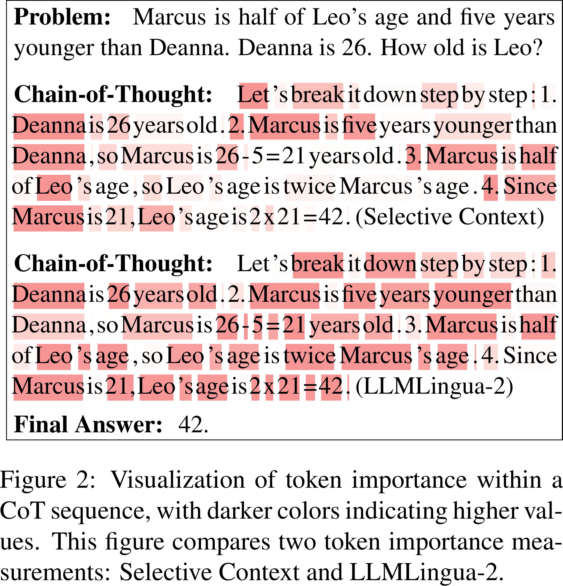
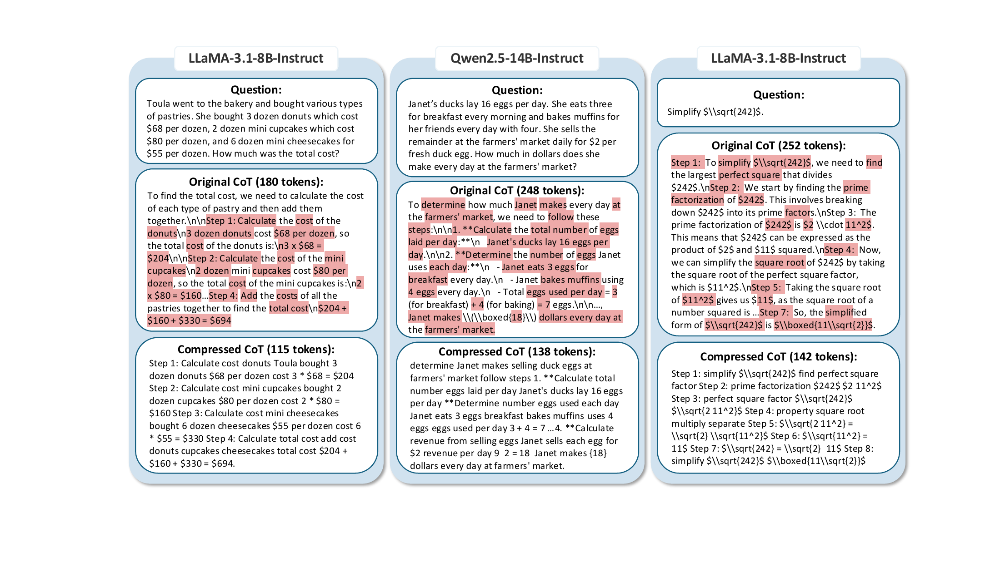
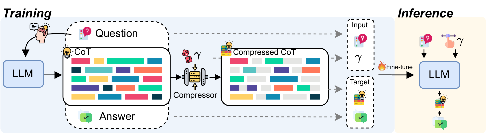
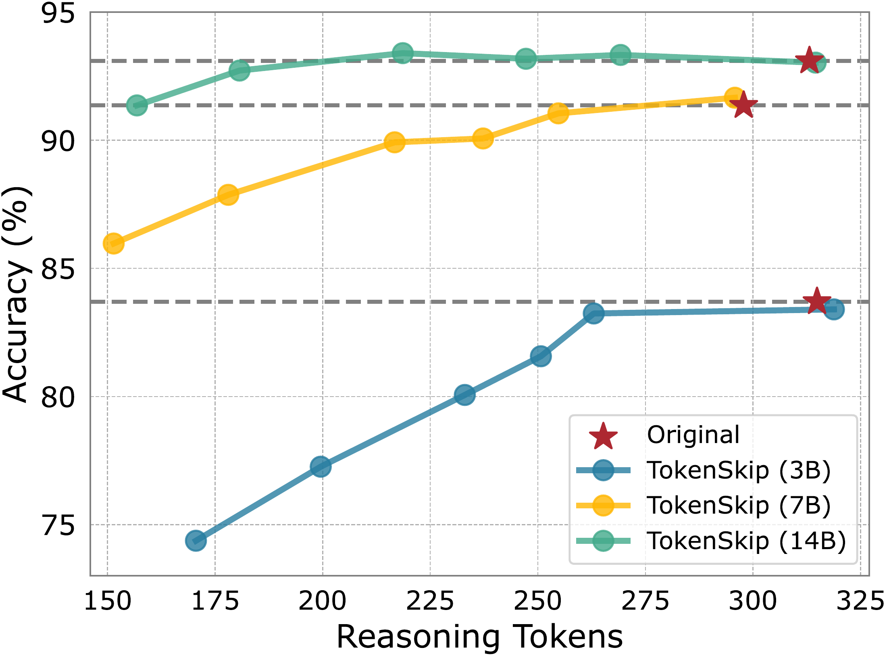
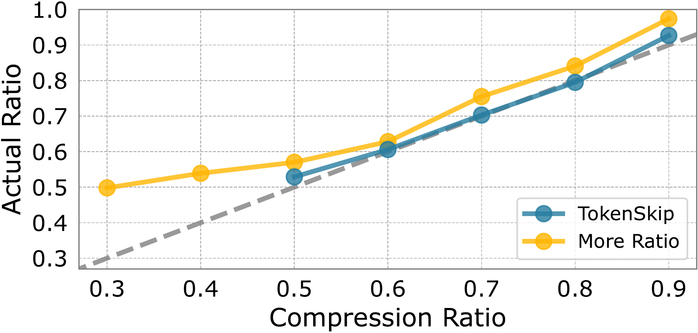
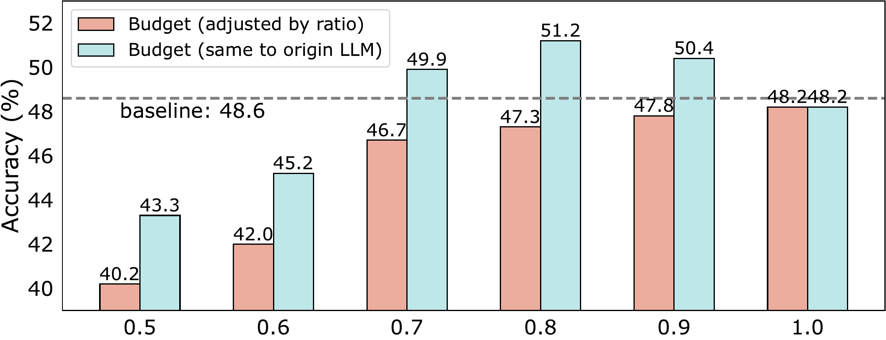

# TokenSkip：可控的 LLM 思维链压缩

[所属章节](../index.md) · [来源与阅读状态](../../../sources/papers.json)


- **作者**：Heming Xia, Chak Tou Leong, Wenjie Wang, Yongqi Li, Wenjie Li
- **年份/版本**：2025；arXiv v3（2025-09-16，EMNLP 2025 Long Paper camera-ready）
- **原始链接**：[arXiv:2502.12067](https://arxiv.org/abs/2502.12067)，[PDF](https://arxiv.org/pdf/2502.12067)，[作者代码](https://github.com/hemingkx/TokenSkip)
- **实际阅读范围**：完整阅读 v3 正文 §1–§6（含 Figure 1–10、Table 1），并补读 Appendix A（Figure 11–12）、Appendix B（实现细节、Qwen 3B/7B/14B 表 2、prompt 表 3）和 Appendix C（MATH-500/GSM8K/MMLU-STEM 的跨域表 4、CommonsenseQA 表 5）。arXiv HTML/PDF 文本可读；作者 TeX 源码下载端点在本环境返回失败，因此没有声称已取得源工程或复用其原始图片文件。

## 1. 问题：把 CoT 的“生成长度”变成一个可控旋钮

Chain-of-Thought 让模型把复杂题拆成若干中间步骤，但自回归解码意味着每多生成一个 token，就增加一次串行解码、KV cache 和注意力计算。论文将问题具体化为：CoT 中每个 token 是否都同样参与最终答案？如果有些只是连接词、套话或已经被后续数值表达覆盖的重复信息，就可以保留关键的数学内容、删除冗余，并让模型学会从一个关键 token 直接跳到下一个关键 token。这里的目标是**保留同一推理过程中的关键离散信息并删去表达冗余**，不是把题目换成另一道更短的题，也不是只在推理结束后截断字符串。

论文的核心观察是，删 token 后的序列仍可能携带足够语义；未微调的 LLaMA-3.1-8B-Instruct 也能根据压缩 CoT 恢复较完整的推理（Figure 3；Appendix A 给出 LLaMA-3.1-8B-Instruct 和 GPT-4o 的恢复提示与输出）。这只是恢复能力的可行性示例，不能当作压缩模型正确率的因果证明。


**图 1 读法**：左侧是普通 CoT，模型把所有中间 token 顺序生成；右侧是先找出语义重要 token、再微调模型，使其在推理时跨过低重要 token，直接学习关键 token 之间的 shortcut。图示表达的是方法流程和意图，不是速度测量。

## 2. 为什么使用 LLMLingua-2：重要性分数会直接决定训练标签

### 2.1 两种 token importance

对 CoT $`c=(c_1,\ldots,c_m)`$，Selective Context 用一个因果语言模型的 token surprise：

```math
I_1(x_i)=-\log P(x_i\mid x_{<i};\theta_{M_L}).
```

越难由左上下文预测，分数越高。但论文指出两点偏差：因果 LM 的困惑度受位置影响，句末 token 往往因上下文更完整而显得“容易”；同时单向注意力看不到 token 右侧信息，所以低 surprise 不等于低事实贡献。

TokenSkip 因此采用 LLMLingua-2 的双向 BERT-like compressor。LLMLingua-2 先用 GPT-4 给 token 做“重要/不重要”压缩标签，再以 token classification 目标训练一个小的双向模型；在使用时，以双向模型对每个 token 的预测概率作为重要性：

```math
I_2(x_i)=P(x_i\mid x_{\le n};\theta_{M_B}).
```

这一步对 TokenSkip 的作用不是运行时再调用 GPT-4，而是**离线生成 SFT 的压缩标签**：给定原始模型产生的正确 CoT，LLMLingua-2 为每个 token 输出分数；分数排序后选定保留集合；该集合形成训练目标中的“压缩 CoT”。所以 LLMLingua-2 的判断错误会被蒸馏进训练数据，重要性度量的选择会改变模型最终学到的跳跃模式。论文 Figure 2 里，数字、算式等携带约束的信息通常更深色、更重要；“so”“since”等连接词一般更浅。作者还明确比较了 Selective Context、LLMLingua-2 和 GPT-4o：LLMLingua-2 比 Selective Context 更好，而 GPT-4o 的人工式裁剪仍显示更高潜力，但其 API 成本使大规模标签生成不实用（Figure 8，正文 §4.3）。



**图 2 读法**：同一个 Marcus/Leo/Deanna 年龄题的 CoT 上，两种指标用颜色显示 token importance；颜色不是正确率，不能把深色直接解释成“模型一定需要该词”，它只是压缩标签的局部依据。

### 2.2 按压缩率生成子序列

设目标模型为 $`M`$，一条 CoT 为 $`c=(c_1,\ldots,c_m)`$，期望保留比例为 $`\gamma\in[0,1]`$。先计算 $`I(c_i)`$，再取分数的经验 $`\gamma`$ 分位数作为阈值：

```math
I_\gamma=Q_\gamma(I(c_1),\ldots,I(c_m)),
\qquad
c_e=\{c_i\mid I(c_i)\ge I_\gamma,1\le i\le m\}.
```

论文把 $`\gamma`$ 称为 compression ratio，数值越小表示保留越少、压缩越强；实际保留率不一定正好等于设定值，因为阈值并列、tokenization 和生成停止都会造成差异，因而另报 ActRatio。重要的是 $`c_e`$ 是原 CoT token 的抽取子序列：它不凭空增加新词，但删除否定词、条件词或关系词仍可能改变语义，因此“子序列”不等于“语义必然等价”。答案 token 序列 $`a`$ 不参与剪枝。

一个具体的 Figure 10 例子是 LLaMA-3.1-8B-Instruct 解 $`\sqrt{242}`$：原 CoT 约 252 tokens，压缩后 142 tokens；压缩结果仍保留 $`242=2\cdot11^2`$、平方根分解和 $`11\sqrt2`$ 等关键数值/公式，而删除大段“我们现在要……”“这意味着……”的复述。另一个 Qwen2.5-14B-Instruct 鸭蛋题从 248 到 138 tokens，仍保留 $`16-3-4=9`$、$`9\times2=18`$。这些例子说明论文所说的“删表达、保约束”，不是减少题目难度。



**图 10 读法**：每个样本同时给问题、原 CoT 和压缩 CoT；红色标出两者共有的 token。图中可见步骤编号和数字/方程仍在，连接性自然语言减少；有些压缩文本语法并不完整，作者依赖模型的下一次生成来学习跨越这些空缺。

## 3. TokenSkip 的训练与部署

### 3.1 离线构造数据

给训练集 $`D`$ 的每道题先由目标 LLM 生成一条 CoT，过滤掉最终答案错误的轨迹。对剩余样本随机抽取 $`\gamma`$，从集合

```math
\{0.5,0.6,0.7,0.8,0.9,1.0\}
```

中采样，在 CoT 上运行 LLMLingua-2 剪枝；$`\gamma=1`$ 的样本保留原始 CoT，用来避免模型只学会短文本。训练样本格式为

```text
Q [EOS] γ [EOS] Compressed-CoT A
```

这里的 $`\gamma`$ 是显式条件：同一个问题可以对应不同保留比例，模型不需要从问题本身猜目标长度。训练集大小不会因每个比例复制成多份；每个样本一次随机选比例。GSM8K 有 7,473 条正确生成样本，MATH 有 7,500 条（正文 §1；MATH 训练用全训练集，评测用 MATH-500）。

### 3.2 SFT 损失

令 $`y=(\tilde c_1,\ldots,\tilde c_{m'},a_1,\ldots,a_t)`$ 为压缩 CoT 与未变答案的串联，模型在条件 $`(x,\gamma)`$ 下进行普通自回归最大似然训练：

```math
\mathcal L=-\sum_{i=1}^{l}\log P(y_i\mid x,\gamma,y_{<i};\theta_M).
```

论文 Eq. (5) 的排版写成“最小化 $`\sum\log P`$”，缺少常见的负号；结合“minimize”及标准 SFT 语义，应读作上式的负对数似然（这是对公式排版的解释，不是作者另行定义的损失）。答案 $`a`$ 原样保留，并与 CoT 一起计算 token-level loss；文中没有报告对 CoT 和答案分别加权，也没有报告长度归一化或额外的跳跃奖励。LoRA 用于低成本微调：rank $`r=8`$、$`\alpha=16`$，只更新约 0.2% 参数（Qwen2.5-14B）。

### 3.3 推理

部署时给同一格式的输入 `Q [EOS] γ [EOS]`，进行贪心自回归解码，模型输出压缩 CoT 和答案。它没有在生成时调用 compressor，也没有在每一步做动态 token 删除；“跳过”已经通过 SFT 形成生成策略。论文报告的“token”主要是平均 CoT 输出 token，不含问题输入；正文没有把总序列 token、FLOPs、KV cache 峰值或训练成本折算成统一的端到端前沿。



**图 4 读法**：训练左半部是“目标 LLM 生成原 CoT → compressor 产生多个 $`\gamma`$ 的压缩 CoT → 混合比例 SFT”；推理右半部是“问题和目标 $`\gamma`$ → 直接生成压缩 CoT”。图中箭头显示条件传递，但不代表压缩器参与在线延迟。

## 4. 实验设置与公平比较

模型是 LLaMA-3.1-8B-Instruct，以及 Qwen2.5-Instruct 3B/7B/14B；任务主要为 GSM8K 和 MATH-500。训练使用各自训练集，MATH 因计算成本在与 Lightman et al. 相同的 500 题测试集上评测。指标是准确率、平均 CoT token 数、单样本推理延迟和 ActRatio；贪心解码。延迟在单张 RTX 3090、batch size 1 测量。GSM8K 最大生成长度为 512，MATH 为 1024；但 MATH-500 中有许多样本会达到上限，论文额外将 TokenSkip 的 max_len 调为 $`\text{max\_len}\times\gamma`$，并在 Figure 9 比较“按比例缩短预算”和“沿用原模型预算”两种条件。训练是 3 epochs、peak LR $`5\times10^{-5}`$ cosine decay、AdamW、warmup 0.1、PyTorch 2.1/CUDA 12.1、2×3090。

基线包括三种简洁提示（BeConcise、OnlyNumbers、AbbreWords）、要求减少固定比例的 LC-Prompt，以及硬性截断 Truncation。它们比较的是同一任务和模型的准确率/CoT token/延迟；提示法的目标比例不等于实际比例，硬截断能达到长度却可能在中途切断推理，因此是必要的对照。

## 5. 主实验结果

### 5.1 LLaMA-3.1-8B-Instruct：Table 1

原模型 GSM8K 为 86.2% / 213.17 CoT tokens / 5.96 s；MATH-500 为 48.6% / 502.60 / 16.37 s。

TokenSkip 的完整曲线（设定 $`\gamma`$；括号为相对原模型准确率变化）如下：

| $`\gamma`$ | GSM8K acc / tokens / latency / ActRatio | MATH-500 acc / tokens / latency / ActRatio |
|---|---|---|
| 1.0 | 86.7 (+0.5) / 213.60 / 5.98 / 1.00 | 48.2 (-0.4) / 504.79 / 16.43 / 1.00 |
| 0.9 | 86.1 (-0.1) / 198.01 / 5.65 / 0.93 | 47.8 (-0.8) / 448.31 / 15.26 / 0.89 |
| 0.8 | 84.3 (-1.9) / 169.89 / 5.13 / 0.80 | 47.3 (-1.3) / 398.94 / 13.39 / 0.79 |
| 0.7 | 82.5 (-3.7) / 150.12 / 4.36 / 0.70 | 46.7 (-1.9) / 349.13 / 11.55 / 0.69 |
| 0.6 | 81.1 (-5.1) / 129.38 / 3.81 / 0.61 | 42.0 (-6.6) / 318.36 / 10.58 / 0.63 |
| 0.5 | 78.2 (-8.0) / 113.05 / 3.40 / 0.53 | 40.2 (-8.4) / 292.17 / 9.67 / 0.58 |

因此在 GSM8K，ActRatio 0.53 时 CoT 减少约 47%、延迟 1.8×，准确率下降 8.0 个百分点；在 MATH-500，ActRatio 0.69 时 token 减少约 31%、延迟 1.4×，准确率下降 1.9 个百分点。论文摘要所强调的“40% 压缩、<0.4% 下降”来自更强的 Qwen2.5-14B，而不是 LLaMA 的所有任务。

对照显示了“同题换短解”和“TokenSkip”差别：MATH-500 上简洁提示的 ActRatio 只有 0.94–0.97，几乎没有压缩；LC-Prompt 目标设 0.5 时实际仅 0.89。Truncation 在 GSM8K 设 0.5 时准确率从 86.2% 降到 7.0%（下降 79.2 个百分点），MATH-500 从 48.6% 降到 27.4%（下降 21.2 个百分点），即它只是切短输出，未教模型跨越删掉的推理。



**图 5 读法**：横轴是 reasoning tokens，纵轴是准确率，三条 Qwen 曲线与原模型点比较；模型规模越大，向左移动时下降越慢。它不是一个固定模型的“所有预算”曲线，3B/7B/14B 每条曲线均由离散 $`\gamma`$ 运行组成。

### 5.2 Qwen2.5-Instruct 3B/7B/14B：GSM8K 完整跨规模结果

Appendix Table 2 给出全量数据，实际比例分别因生成行为而变化：

- **3B**：原模型 83.7%、314.87 tokens；$`\gamma=0.9/0.8/0.7/0.6/0.5`$ 得 83.2/81.6/80.1/77.3/74.4%，tokens 262.99/250.71/233.03/199.55/170.55，ActRatio 0.83/0.79/0.73/0.63/0.54。强压缩到 0.5 时下降 9.3 个百分点。
- **7B**：原模型 91.4%、297.83；对应准确率 91.1/90.1/89.9/87.9/86.0%，tokens 254.77/237.27/216.73/178.07/151.44，ActRatio 0.86/0.80/0.73/0.60/0.51。$`\gamma=0.7`$ 仅下降 1.5 个百分点。
- **14B**：原模型 93.1%、313.11；对应准确率 93.3/93.2/93.4/92.7/91.4%，tokens 269.22/247.24/218.62/180.68/156.85，ActRatio 0.86/0.79/0.70/0.57/0.50。$`\gamma=0.6`$ 仍只下降 0.4 个百分点（180.68 tokens，相对原 42.3% 减少），$`\gamma=0.5`$ 下降 1.7 个百分点。

模型规模越大，压缩时准确率越稳；作者将其解释为更大模型更能学习关键 token 之间的 shortcut。这是跨规模相关性和作者解释，不是对内部机制的直接证明。



**图 6 读法**：横轴是设定 compression ratio，纵轴是实际 ActRatio；默认比例集（0.5–1.0）接近对角线，加入 0.3/0.4 的 More Ratio 后低端明显偏离。

## 6. 分析、失败与额外任务

### 6.1 高压缩失败不是线性外推

作者额外训练含 $`\gamma=0.3,0.4`$ 的 More Ratio。低端 ActRatio 大幅偏离目标，作者归因于一次删掉太多关键 token，训练样本丧失必要信息；加入低比例还会降低整体比例遵循性。论文没有给出 More Ratio 在所有任务上的准确率表，因此不能把 30%/40% 设定外推成可用强压缩结果。

### 6.2 是否真的在跳低重要 token

对 Qwen2.5-14B 在 GSM8K 生成 $`\gamma=1.0`$ 和 $`0.7`$，只出现在完整 CoT 的 token 视为 skipped，同时出现在压缩 CoT 的视为 retained。Figure 7 显示 skipped 的 LLMLingua-2 importance 分布偏低，retained 偏高，支持“按重要性学习选择”的行为，但这是相关性证据，不是 token 级必要性实验。

### 6.3 重要性指标消融

Figure 8 在 LLaMA-3.1-8B/GSM8K 比较 LLMLingua-2、Selective Context 和 GPT-4o（使用 `gpt-4o-2024-08-06`）。GPT-4o 被提示按比例删冗余且不得新增 token，作为人工/强指标上界。LLMLingua-2 曲线优于 Selective Context；GPT-4o 更好但 API 成本高。由此 LLMLingua-2 的重要性标签既是方法的关键依赖，也是成本与质量折衷。

### 6.4 固定长度预算下的额外收益

MATH-500 中，若把 TokenSkip 的 max_len 也按 $`\gamma`$ 缩短，强制预算会混入“没生成完”的损失。Figure 9 把预算恢复为原模型同样的 1024：$`\gamma=0.7,0.8,0.9`$ 的准确率比原模型分别高约 1.3–2.6 个百分点（图中具体点约 49.9、51.2、50.4 对基线 48.6；而按比例预算对应约 46.7、47.3、47.8）。这说明在相同最大步数内，较短的已学会 CoT 可能为答案留下更多完成空间；它不是“压缩后免费提升”，而是改变了格式和预算分配的联合实验。

### 6.5 跨域和跨任务

Appendix C.1：在 MATH 训练集微调 LLaMA-3.1-8B，再测 MATH-500（域内）、GSM8K 和 MMLU-STEM（域外）。MMLU-STEM 原模型 58.5%、356.31 tokens；$`\gamma=0.6`$ 为 59.2%、225.33 tokens、ActRatio 0.63，$`\gamma=0.5`$ 为 58.1%、188.87、0.53，说明约 40%–47% token 减少时仍接近原准确率。GSM8K 域外则从 86.2%/213.17 降到 $`\gamma=0.5`$ 的 76.6%/122.55（ActRatio 0.58），跨域并不总是平稳。

Appendix C.2：CommonsenseQA 用 9,700 条训练样本微调，在 validation 评测 Qwen2.5 7B/14B。7B 原模型 80.3%、272.13 tokens；$`\gamma=0.5`$ 为 80.6%、128.43、ActRatio 0.47。14B 原模型 82.1%、247.81；$`\gamma=0.5`$ 为 82.1%、121.03、0.49。作者据此报告非数学任务上约 50% CoT 压缩而无准确率下降，但这是英文常识选择题的一个数据集，不能泛化到所有任务。



**图 9 读法**：两组柱/曲线分别是按比例调整的预算与沿用原预算；后者在 0.7–0.9 出现优势，提示“压缩格式”与“可用最大长度”应分开报告。

## 7. 训练成本、未测量的效率与局限

作者报告 7B 约 2 小时、14B 约 2.5 小时在两张 RTX 3090 上完成 LoRA SFT；Qwen2.5-14B 只训练约 0.2% 参数。论文测量的是生成 CoT token、单样本 wall-clock latency 和准确率；未报告训练 FLOPs、LLMLingua-2 离线标注时间、压缩器显存、端到端服务吞吐、KV cache 峰值、输入+输出总 token 成本，亦未展示 10,000 token 长 CoT 的实测延迟。因而“token 减少”可合理指向自回归输出成本，但不能替换成完整部署成本改善。

正文限制包括：未测试 Qwen2.5-32B/72B；LLMLingua-2 不是数学数据专门训练，可能不善于数值/数学表达；未测试 QwQ-32B-Preview 等长 CoT 模型。实验也集中于英语数学与一个常识任务，$`\gamma`$ 只覆盖 0.5–1.0 的主曲线，极低比例失败。恢复图展示了可解释性线索，但恢复文本是另一次生成，不能证明压缩序列与原始逐 token 轨迹等价。

## 8. 与推理时 token 效率的关系

TokenSkip 提供的是一个离线 compressor + 条件 SFT + 运行时显式比例控制的离散 CoT 方案：在有短输出需求时，选择已训练的 $`\gamma`$，让模型直接生成更短但仍含关键数值/方程的推理。其最有用的经验不是“所有 token 都可删”，而是：**比例条件需要进入训练样本；重要性标签决定哪些表达被删；答案必须保持原样；实际 ActRatio、延迟和正确率必须同时测量；低于约 0.5 的比例不能从主曲线线性外推。** 对研究 token-efficient reasoning 的启发是把“压缩后语义是否可恢复”“输出 token 是否减少”“任务正确率是否保持”“同一长度预算下是否完成更多计算”分成不同验收问题，而不是把短答案或硬截断当作 CoT 压缩。
