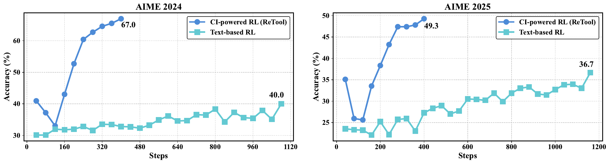
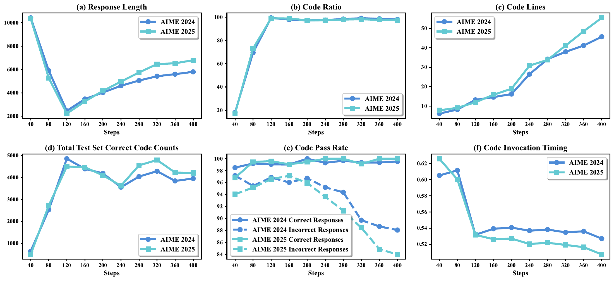
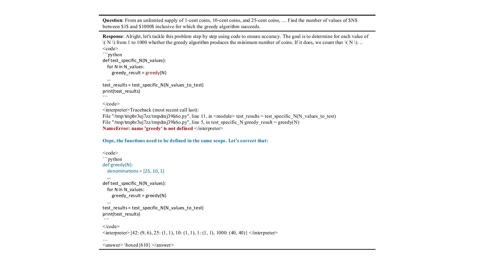
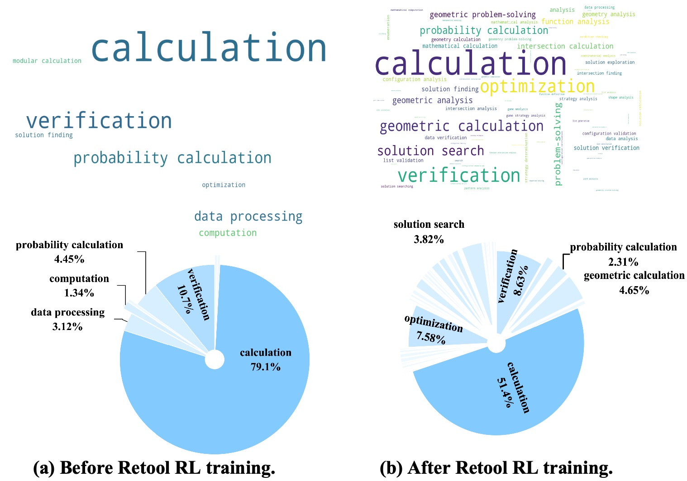
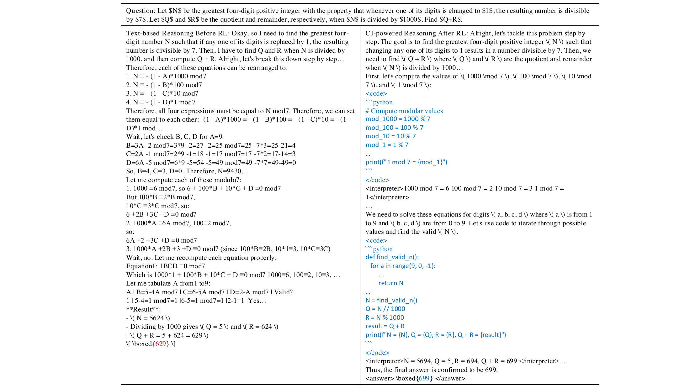
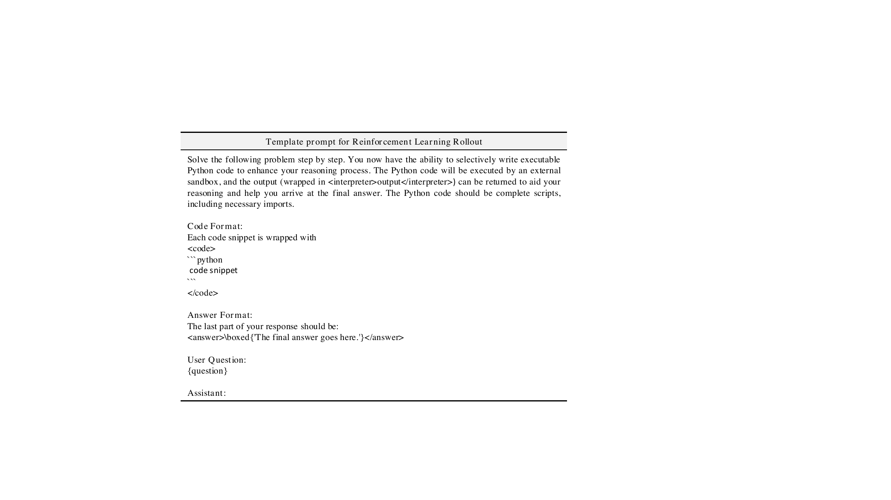
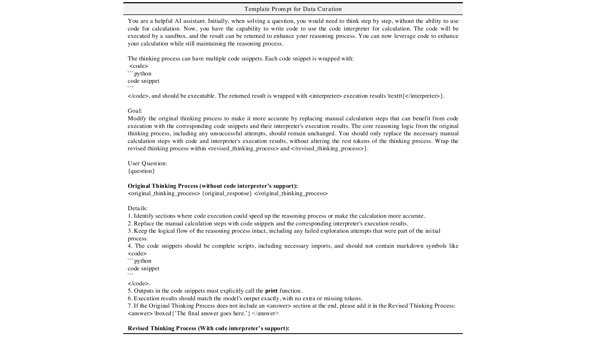

# ReTool: Reinforcement Learning for Strategic Tool Use in LLMs

[所属章节](../index.md) · [来源与阅读状态](../../../sources/papers.json)


**作者**：Jiazhan Feng、Shijue Huang、Xingwei Qu、Ge Zhang、Yujia Qin、Baoquan Zhong、Chengquan Jiang、Jinxin Chi、Wanjun Zhong（ByteDance Seed） <br>
**年份**：2025（论文日期 2025-04-15；固定阅读版本为 arXiv v2，提交/更新日期 2025-04-17） <br>
**原始链接**：[arXiv:2504.11536v2](https://arxiv.org/abs/2504.11536v2)，[项目页](https://retool-rl.github.io/) <br>
**实际阅读范围**：固定版 PDF 全文（摘要、引言、第 2 节方法、第 3 节实验、第 4 节相关工作、第 5 节结论、参考文献）及 LaTeX 源文件；补读附录中两个 rollout/数据构造提示模板的图。正文的主表、训练行为图和案例图均已从源工程提取。附录没有额外实验表或正式局限性章节。

## 1. 问题、动机与贡献

ReTool 针对的是这样一类数学推理：语言模型能够写出很长的自然语言思维链，却在精确枚举、数值计算、几何或复杂方程中容易算错。代码解释器（code interpreter，CI）提供一个可执行的外部接口，模型可以把某一段计算写成代码，获得运行结果，再把结果插回后续推理。论文的关键问题不是“给模型接一个工具后会不会更准”，而是：能否让模型通过结果奖励自主学会**何时调用工具、调用什么代码、如何读懂结果、执行失败后如何修正**。

论文将已有两类路线区分开来。纯文本 CoT/RL 只在语言序列中探索；提示或 SFT 的工具使用则主要模仿预先整理的调用模式，超出数据分布时未必会自适应。ReTool 先用合成的代码增强轨迹建立冷启动能力，再在 PPO rollout 中实时执行代码，只依据最终答案是否正确给奖励，让工具调用策略成为结果驱动的决策过程。

作者的主要贡献有三点：

1. 一个两阶段训练框架：代码增强冷启动 SFT，加上与异步代码沙箱交互的 PPO。
2. 一个能在自然语言、代码和解释器反馈之间暂停/恢复的多轮 rollout；错误消息也会返回给模型，因此轨迹中可以出现自我修正。
3. 在 AIME2024/2025 上的主实验与行为分析，报告了更少训练步数下的准确率、代码调用频率、调用时机、代码可执行性及自校正案例。

## 2. 方法：从问题到可执行的混合轨迹

### 2.1 冷启动数据如何建立工具能力

第一步从多种数学推理来源收集文本轨迹（包括 OpenThoughts 等开源数据），经过人工专家和 DeepSeek-R1 双重筛选，得到高质量文本推理集 $`\mathcal{D}_{\text{init}}`$。第二步用结构化提示把其中适合程序计算的人工计算段替换为代码及解释器结果，形成代码增强轨迹。作者对转换结果执行两阶段检查：

- **格式检查**：保证代码边界和调用语法一致，使后续 RL 能可靠识别 `</code>` 触发器。
- **答案检查**：删除最终答案与题目正确答案不一致的样本。

得到的 $`\mathcal{D}_{\text{CI}}`$ 用于 SFT。它给模型一个“问题—文字分析—代码—运行结果—继续分析—答案”的初始分布，但并不直接证明模型已经学会在所有问题上选择正确的工具时机。表 1 中只做冷启动的模型仍被拿来和 RL 模型比较，正是为了区分这两部分贡献。

### 2.2 在线代码执行与结果插入

rollout 的对象不是单一文本，而是交错序列

```math
[t_1 \oplus c_1 \oplus f_1 \oplus t_2 \oplus c_2 \oplus f_2 \oplus \cdots \oplus o],
```

其中 $`t_i`$ 是自然语言片段，$`c_i`$ 是模型生成的代码，$`f_i`$ 是沙箱返回的成功输出或错误信息，$`o`$ 是最终回答。模型通过 `<code>...</code>` 标出代码。生成器遇到 `</code>` 后暂停；系统解析代码 $`c_1`$ 并发送到 CI。执行完成后，系统把结果包进 `<interpreter>...</interpreter>`，接到上下文末尾，再恢复模型生成。模型可以直接给最终答案，也可以继续写下一段代码。

贯穿机制的例子来自 Figure 4。题目要求枚举 1 到 1000 中贪心换币算法成功的 $`N`$ 的数量。模型第一次代码调用 `greedy()`，但忘记定义函数，沙箱返回 `NameError`。模型读到反馈后写出“函数需要在同一作用域定义，让我们修正”，第二次代码补上 `greedy` 和测试函数，得到结果并给出 $`\boxed{610}`$。这里“错误反馈→解释错误→修改代码→重新执行”是一个真实的交互闭环；论文声称训练数据没有明确教过该自校正行为，因此把它作为 RL 中涌现的行为案例。应把“涌现”理解为作者对一个案例的解释，而不是独立的因果证明。

教学化伪代码如下，触发与 mask 的细节按论文原文保持：

```text
for question q in batch:
    prefix = q
    while not final_answer(prefix):
        segment = policy.generate_until(prefix, ["</code>", final_answer_marker])
        if segment ends with "</code>":
            code = parse_code(segment)
            feedback = sandbox.execute(code)       # value or error text
            prefix = prefix + segment + "<interpreter>" + feedback + "</interpreter>"
        else:
            prefix = prefix + segment
    r = +1 if equivalent(extract_answer(prefix), gold(q)) else -1
    update_PPO_on_model_tokens(prefix, r)
```

伪代码中最后一行的 `model_tokens` 不包括外部反馈 token；这是对论文 loss mask 的教学化表达，不代表作者公开了全部 veRL 实现顺序或优势估计细节。

### 2.3 PPO、奖励与 loss mask

论文将 PPO 目标写为（$`q,a`$ 来自数据集，$`o_{\le t}`$ 来自旧策略 rollout）：

```math
\mathcal{J}_{\mathrm{PPO}}(\theta)=
\mathbb{E}\left[\min\left(
\frac{\pi_\theta(o_t\mid q,o_{<t};\mathrm{CI})}
{\pi_{\theta_{\mathrm{old}}}(o_t\mid q,o_{<t};\mathrm{CI})}\hat A_t,
\mathrm{clip}\left(\frac{\pi_\theta(o_t\mid q,o_{<t};\mathrm{CI})}
{\pi_{\theta_{\mathrm{old}}}(o_t\mid q,o_{<t};\mathrm{CI})},1-\epsilon,1+\epsilon\right)\hat A_t
\right)\right].
```

与普通文本 PPO 的关键差别是条件上下文包含 CI 返回的中间结果，且一次 rollout 可以多轮暂停和执行。最终答案提取后用规则验证：

```math
R(a,\hat a)=
\begin{cases}
1,&\mathrm{is\_equivalent}(a,\hat a),\\
-1,&\text{otherwise}.
\end{cases}
```

$`a`$ 是标准答案，$`\hat a`$ 是模型输出的答案。模型必须用规定格式（例如 `\boxed{}`），从而可以规则化抽取。作者**没有**额外奖励代码可执行性、调用次数、调用时机或解释器反馈质量；只优化最终结果，理由是减少 reward hacking 并保留更丰富的探索。于是一次含有多次错误执行但最后答对的轨迹仍得到正结果奖励；答错的轨迹为负奖励。论文没有在正文给出逐 token 优势、组采样或终止失败的更细实现，因此不应把该 $`\pm1`$ 奖励写成逐步人工标注奖励。

训练时把 `<interpreter>...</interpreter>` 的外部输出从 loss 计算中 mask 掉。模型学习的是自己生成的自然语言与代码，而不是“模仿”沙箱生成的 token；反馈仍保留在上下文中，因而可以影响之后生成。这个设计同时避免把外部 token 的概率误差传入策略损失，但论文只给出稳定性/保持连贯性的解释，没有给出 mask 与不 mask 的单独消融。

### 2.4 成本相关工程

实现基于 veRL 的 PPO。主设置为 AdamW、初始学习率 $`10^{-6}`$、最大预期序列长度 16,384、mini-batch 512、KL 系数 0.0；冷启动 SFT 两个 epoch，主 backbone 是 Qwen2.5-32B-Instruct。为减少 rollout 显存，代码终止触发时缓存执行前全部 KV cache，只对解释器反馈及其后缀继续计算并追加 KV cache。沙箱是异步 worker pool，pods 按容量取任务，以避免慢线程阻塞所有 rollout。

这里的“成本”有两层：

- **模型短推理长度**：Figure 3(a) 报告 RL 前约 10k、RL 后约 6k 的平均 response length，作者据此称最终长度短约 40%。图表未明确写出单位，论文也没有拆分 prompt、自然语言、代码、反馈和答案的 token；因此只能称为作者的 response-length 指标，不能精确转换为模型输入/输出 token 节省。
- **总运行成本**：论文未报告每题真实生成 token 总数、CI 调用次数/执行时间、sandbox CPU/GPU、端到端延迟、训练 FLOPs、GPU 小时或金钱成本。KV-cache reuse 和异步沙箱是工程上的成本降低设计，但没有给出前后实测比率。400 对 1080 的训练步数比较是优化步数，不是总计算成本；不同轨迹长度、并发度和解释器开销仍可能改变总成本。

## 3. 实验设置与主结果

### 3.1 评价与基线

任务是 MATH Olympiad 风格的 AIME2024 和 AIME2025。为估计 pass@1，作者把评价集合重复 32 次，报告平均准确率；推理 temperature=1.0、top-p=0.7。表 1 同时列出已发表基线和在 Qwen2.5-32B-Instruct 上的消融。对外部基线，作者说明直接从相应论文复制 avg@k 并作为 pass@1，因此这些数字不必然与 ReTool 的 32 次重复流程具有完全相同的生成预算或评测协议。

### 3.2 表 1 的逐项解读

| 模型/条件 | AIME2024 | AIME2025 | 论文含义 |
|---|---:|---:|---|
| Qwen2.5-Math-72B-Instruct | 30.0 | — | 文本/数学基线 |
| Qwen2.5-Math-72B-Instruct-TIR | 40.0 | — | 工具集成基线 |
| Sky-T1 | 43.3 | — | 已发表基线 |
| OpenAI o1-preview | 44.6 | 37.9 | 已发表基线 |
| DeepSeek-R1-Zero-Qwen-32B | 47.0 | — | 已发表基线 |
| QwQ-32B-Preview | 50.0 | 33.5 | 已发表基线 |
| s1-32B | 56.7 | — | 已发表基线 |
| ReTool（Qwen2.5-32B-Instruct） | **67.0** | **49.3** | 400 steps 的 CI-powered RL |
| ReTool（DeepSeek-R1-Distill-Qwen-32B） | **72.5** | **54.3** | 更强 backbone 的扩展设置 |
| 无训练，base model | 26.7 | — | Qwen2.5-32B-Instruct 原始模型 |
| 无 CI，text-based RL | 40.0 | 36.7 | 含文本冷启动 SFT，训练超过 1000 steps |
| 无 RL，仅 cold-start | 40.9 | 34.5 | 推理时仍接入 CI |

主干 Qwen2.5-32B-Instruct 的 ReTool 在 AIME2024 为 67.0%、AIME2025 为 49.3%，论文强调只需 400 training steps；文本 RL 为 40.0% 和 36.7%，且超过 1000/文中图示约 1080 steps。这个对比同时说明两件事：工具交错的 RL 带来更高准确率，且在优化步数口径下收敛更快。它不能单独证明端到端 GPU 成本更低，因为 CI 执行成本和每步序列长度未报告。

冷启动模型在 AIME2024 达 40.9%，接近文本 RL 的 40.0%，但超过 base 的 26.7%；AIME2025 为 34.5%。因此代码增强 SFT 本身已经传授了一部分工具使用能力，最终 67.0/49.3 的额外提升归因于 RL 探索仍是作者的核心主张。DeepSeek-R1-Distill-Qwen-32B backbone 下达到 72.5/54.3，但这项数字改变了 backbone，适合说明 ReTool 可叠加在更强初始化上，不适合当作仅由 RL 机制造成的增益。

图 1（正文首页）绘制了 Qwen2.5-32B-Instruct 的 AIME2024/2025 随 training steps 变化：ReTool 曲线分别到约 67.0/49.3，text-based RL 约 40.0/36.7。横轴说明了训练步数差异，但图中没有给每个点的数值表，不能从曲线外推完整的准确率—成本前沿。

## 4. RL 中工具行为如何变化

Figure 3 在每个保存 checkpoint 上对 AIME2024/2025 生成结果统计六项行为指标。它们是输出分析，不是额外训练目标：

1. **Response length**：初期从约 10k 快速下降，之后缓慢回升，最终约 6k，作者称比 RL 前短 40%。解释是代码替代了冗长手算，后期更复杂、更多样的代码又让长度回升。由于没有单位和分项 token 表，“短推理”结论只能限于 response length。
2. **Code ratio**：含代码的回答比例总体上升，终点接近 98%。这说明调用 CI 成为几乎普遍的行为，但不等于每次调用都必要或成功。
3. **Code lines**：平均代码行数单调增加，终点近似为 RL 前的五倍。作者把它作为代码策略复杂度的粗略迹象；代码行数本身不等价于计算量或质量。
4. **Total test-set correct code counts**：测试集中的正确代码计数由约 1k 升至约 5k，反映可执行代码使用增多。论文没有明确该计数对样本、调用还是代码片段去重，因此不应把它当作“正确率”。
5. **Code pass rate**：对最终答错的回答，统计最后一段代码的平均通过率；答对回答的通过率一直接近 100%，答错回答的通过率下降。该定义不是所有代码调用的平均 pass rate，也不是最终答案正确率。作者据此认为代码可执行性会影响后续推理。
6. **Invocation timing**：用代码起始位置除以整段 response 长度。曲线下降表示代码更早出现，作者解释为模型学会更早决定何时使用工具。这个分数依赖输出长度，不能直接比较绝对时间。

这些行为趋势与奖励设计之间存在一个需要谨慎的关系：奖励只看最终答案，代码比例、行数和更早调用都是在正/负结果反馈下共同演化出的相关现象；论文没有因果消融证明“更早调用”本身导致准确率提升。

Figure 5 用 Doubao-1.5-pro 根据上下文给代码片段分类，再统计出现超过一次的代码用途。RL 前后都以 calculation、verification 为主，RL 后用途更分散。这个分析依赖另一个模型的分类，标签定义、提示、跨分类一致性和完整频数表没有在正文给出，所以它支持“用途多样化”的探索性结论，不能作为人工标注的精确比例。

## 5. 代表性案例与局限

Figure 6 对同一四位数整除问题并排展示 RL 前的文本推理和 RL 后的 CI-powered 推理。文本版本手工展开模运算，途中出现重新计算和数值错误，最后得到 $`629`$；CI 版本先用代码计算 $`1000,100,10,1\pmod 7`$，再穷举数字条件，解释器返回 $`N=5694,Q=5,R=694,Q+R=699`$，最后给出 $`\boxed{699}`$。这很好地说明了“模型负责约束/策略，代码负责枚举/精确计算”的分工，但这是单个案例，不能代表所有数学题。

Figure 4 的 `greedy()` 未定义案例说明错误反馈可以成为下一轮生成的上下文。论文把它称为“aha moment”，但没有统计自校正成功率、失败类型分布或与无错误反馈版本的对照。因而最稳妥的表述是“观察到一个自校正案例”，而非已经证明模型具备一般的元认知能力。

正文没有单列 limitation；结合报告范围，可以明确列出以下边界：

- 评价集中在 AIME2024/2025，主要验证数学题和 Python 式 CI，未报告开放域、非数学工具、长时交互或真实用户任务。
- 训练 backbone、冷启动数据规模/组成、数据去重与污染控制、PPO rollout 数量、每题最大调用次数等关键复现实验细节未充分公开。
- 外部 baseline 的 avg@k 被作为 pass@1，且模型规模、提示、采样和训练预算来自不同文献；表 1 的横向比较应视为参考，而不是严格同协议 head-to-head。
- 终局奖励在格式错误和答案错误时都归为 $`-1`$；没有代码可执行性奖励，可能使“答对但代码冗余/多次失败”和“高效正确”无法区分。论文也没有报告错误反馈 mask、KV-cache reuse、异步沙箱各自的消融。
- token 效率证据只有 response length 的曲线；未拆分输入/输出/隐藏推理/解释器输出，也未给总 token、延迟、FLOPs、GPU 小时或费用。因此不能把 40% 的长度下降等同于 40% 的总成本下降。
- 异步 sandbox 会改变吞吐，但并发数、执行超时、失败重试、资源隔离和安全边界没有在正文交代；这些因素会影响真实部署成本和可复现性。

## 6. 与推理时 token 效率的关系

ReTool 提供了一个有针对性的机制假设：把可验证的枚举/计算交给代码，可以让模型用更短的自然语言轨迹完成同一任务；同时，RL 让模型学习工具的调用位置和错误恢复，而不是始终照搬固定模板。Figure 3 中最终 response length 从约 10k 到约 6k、code ratio 接近 98%、代码行数增加，是这一假设的正文证据。对推理时系统而言，值得关注的是“模型生成 token + 解释器反馈 token + 工具执行时间”的联合预算，而非只看文字答案长度。

不过，论文当前只测量了第一部分的粗粒度代理。解释器反馈被插回上下文却被 loss mask；它仍可能消耗上下文窗口和推理计算。更复杂的代码会减少语言 token，却可能增加 CI 调用次数、CPU 时间和错误重试。于是 ReTool 的可证实结论是“在 AIME 上，RL 后的平均 response length 变短，同时准确率提升”，而不是“总推理成本已被完整测量并下降”。后续研究应按题目记录模型输入/输出 token、代码 token、反馈 token、调用次数、执行时延、峰值显存和总能耗，并给出准确率—总成本曲线，才能判断这种工具化推理的真实效率边界。

## 图表与资产

以下资产来自论文随附 LaTeX 工程，原论文许可证见 [arXiv license](http://arxiv.org/licenses/nonexclusive-distrib/1.0/)。它们仅作为主代理整合时的可复用原始资产；没有裁剪。

- ：Figure 1，AIME2024/2025 上 ReTool 与 text-based RL 的训练步数—准确率曲线；源文件 [`assets/code-rl.pdf`](../../../assets/papers/2504.11536/fig-main-results.pdf)。横轴是 steps，纵轴是 accuracy (%)，展示 32B Qwen backbone 的收敛差异。
- ：Figure 2，text-only rollout 与交错 CI rollout 对照；源文件 [`assets/method.pdf`](../../../assets/papers/2504.11536/fig-model-rl.pdf)。左侧只有 policy→reward/advantage，右侧显示 policy、sandbox、interpreter feedback 和 reward 的闭环。
- ：Figure 3，六个 CI 行为指标随 RL steps 的变化；源文件 [`assets/training_process_bold.pdf`](../../../assets/papers/2504.11536/fig-cog.pdf)。需结合上文定义读取，不能把 code pass rate 当答案准确率。
- ：Figure 4，`greedy()` 未定义后自校正；源文件 [`assets/aha.pdf`](../../../assets/papers/2504.11536/fig-aha.pdf)。箭头顺序是错误反馈→模型反思→补定义→成功执行→答案。
- ：Figure 5，RL 前后代码用途词云；源文件 [`assets/pie_chart.png`](../../../assets/papers/2504.11536/fig-purpose.png)。分类器为 Doubao-1.5-pro，图中频数是重复出现用途的词云呈现。
- ：Figure 6，同题 text-based 与 CI-powered reasoning 对照；源文件 [`assets/case1.pdf`](../../../assets/papers/2504.11536/fig-case1.pdf)。左侧手算导致 629，右侧程序枚举得到 699。
- ：附录 Figure 7，rollout prompt 模板；源文件 [`assets/prompt.pdf`](../../../assets/papers/2504.11536/fig-rollout-prompt.pdf)。用于说明 `<code>`/`<interpreter>` 格式。
- ：附录 Figure 8，数据构造提示模板；源文件 [`assets/prompt2.pdf`](../../../assets/papers/2504.11536/fig-data-prompt.pdf)。只为理解冷启动转换流程补读，正文没有相应实验结果。
