# The Art of Efficient Reasoning: Data, Reward, and Optimization：正文级中文精读

[所属章节](../index.md) · [来源与阅读状态](../../../sources/papers.json)


- **作者**：Taiqiang Wu、Zenan Xu、Bo Zhou、Ngai Wong（Wu、Xu 等贡献相同；Bo Zhou、Ngai Wong 为通讯作者）
- **年份/固定版本**：2026；arXiv:2602.20945v3（正文标注 2026-03-20，PDF 首页日期为 2026-03-23）
- **原始链接**：[arXiv:2602.20945v3](https://arxiv.org/abs/2602.20945v3)；项目页 [wutaiqiang.github.io/project/Art](https://wutaiqiang.github.io/project/Art)
- **实际阅读范围**：固定版本 PDF `source/paper.pdf` 与其全文抽取 `source/paper.txt`；完整阅读正文第 1–6 节、图 2–7、表 1–2，及用于解释主结论的附录 A–G（图 8–14、表 3–7 和案例）。参考文献未逐条核验原论文。PDF 共 21 页；作者 TeX 工程已取得于 `source/tex/`，但未核验实现代码与数据下载页。

## 1. 问题：让模型少想，但不要把推理能力压掉

长 Chain-of-Thought（CoT）通常提高 LLM 的推理成功率，却增加输出 token、延迟和部署成本。本文把“高效推理”限定为在 RL 中通过奖励塑形，使模型产生**短且正确**的 reasoning trajectory。它的中心问题不是提出一个新架构，而是拆解一个看似简单的 RL 配方：训练提示怎么选、每个提示采样多少条 rollout、正确/错误且长短不同的 rollout 分别给什么奖励，以及 on-policy 与有陈旧度的 off-policy 更新如何共同决定长度和准确率。

论文强调，不能只看一个最终平均长度或一个宽松预算下的分数。其两个更细的观察量是：（1）训练中按“正确/错误”条件分组的 rollout 长度分布；（2）下游任务在一组预算 $`B\in\{2k,4k,8k,16k,32k\}`$ 下的表现。前者能发现模型是把冗余删掉，还是把有效推理也删掉；后者能区分“在 2k 内勉强完成”与“在 32k 仍保留上限能力”。作者报告约 0.2 million GPU hours 是统一协议下的总体实验规模，不能据此归属于某一个模型或单一实验。主要规律随后迁移到 Qwen3 0.6B–30B。

本文的两个下游指标都以同一题目上的 8 次采样为单位。若第 $`j`$ 题的 8 条答案中有 $`c_j`$ 条通过 verifier，则 Mean@8 是每题正确比例的平均：$`\mathrm{Mean@8}=\frac1M\sum_{j=1}^{M}\frac{c_j}{8}`$；它衡量 8 次采样的期望正确率，分母是题目数 $`M`$ 与每题的 8 次试验。Pass@8 是至少有一条正确答案的题目比例：$`\mathrm{Pass@8}=\frac1M\sum_{j=1}^{M}\mathbf1(c_j\ge1)`$，分母只有题目数 $`M`$。因此同一题若 8 条中从 1 条变为 4 条正确，Mean@8 会上升而 Pass@8 不变；这正是论文所说增大训练 rollout 数主要降低可解题上的方差，而未必扩展原本完全不会的题目。

## 2. 训练对象和基本奖励

给定 prompt $`x`$（来自训练集 $`D`$），策略 $`\pi_\theta`$ 对同一 prompt 生成 $`N`$ 条 reasoning rollout，记为 $`\{y_1,\ldots,y_N\}`$。每条 $`y_i`$ 有可验证的正确性和长度 $`L(y_i)`$。RL 用这些奖励做组内相对的 policy-gradient 更新；具体实现是 GRPO，论文没有在正文展开 GRPO 的优势归一化或 KL 项，而是把注意力放在 rollout、奖励和更新数据的新旧程度上。

最普通的 outcome-supervised reward 只有正确性：

```math
R_{\rm vanilla}(x,y_i)=\mathbf 1(y_i\text{ correct}).
```

本文主线采用截断（truncation）策略。先要求答案正确，再要求长度不超过目标 $`L_T`$：

```math
R_T(x,y_i)=\mathbf 1(y_i\text{ correct})\,\mathbf 1(L(y_i)\le L_T). \tag{2}
```

因此短且正确的 rollout 得 1；长且正确、短且错误、长且错误都得 0。这里的“负奖励”在正文多数地方实际上指零回报/负样本，而非数值小于零的奖励。训练 rollout 上限为 $`L_R`$，目标长度为 $`L_T`$。基础实验使用 batch size 128、每个 prompt $`N=8`$、$`L_R=16k`$、$`L_T=4k`$、学习率 $`10^{-6}`$，clip-high ratio 0.28；骨干是 DeepSeek-R1-Distill-Qwen-1.5B。

为比较既有奖励，附录 A 给出三种具体形式。Kimi-1.5 先在组内用

```math
\tilde L(y_i)=\frac{L(y_i)-L_{\min}}{L_{\max}-L_{\min}}
```

该式要求组内 $`L_{\max}>L_{\min}`$；若一组 rollout 长度恰好相同，原论文没有说明实现保护（例如 epsilon 或特殊分支），本文不替作者补充算法。

归一化长度，再用

```math
R_{\rm Kimi}=\mathbf1(\text{correct})[1+\alpha(0.5-\tilde L)]
 +\mathbf1(\text{incorrect})\min(0,\alpha(0.5-\tilde L)),
```

其中 $`\alpha=0.4`$。这会对正确回答按相对短长加减分，也会对过长的错误回答施加惩罚。Laser 是正确性基础分加短于 $`L_T`$ 的 bonus：

```math
R_{\rm Laser}=\mathbf1(\text{correct})[1+\alpha\mathbf1(L\lt L_T)].
```

Laser-D 另外给长错误 rollout 一个探索 bonus：

```math
R_{\rm Laser-D}=\mathbf1(\text{correct})[1+\alpha\mathbf1(L\lt L_T)]
 +\mathbf1(\text{incorrect})\alpha\mathbf1(L\ge L_T).
```

这三种基线很重要，因为它们并非在同一预算下始终同向：一种奖励可能在 2k 有利，在 32k 却导致能力塌陷。

## 3. 两阶段训练动力学

 图 3（PDF 第 2 页）把长度、正确性条件长度、策略熵和五个预算下的 AIME’25/MATH-500 曲线放在一起。不同奖励的共同结构是：

**阶段 I：长度适应（length adaptation）。** 初期，优化主要在满足长度约束。截断带来的零回报迫使策略避开过长 rollout；平均 rollout 长度例如从约 6k 快速降到约 2k，曲线近似指数衰减。策略熵同时明显下降，说明分布收缩到较短且可获奖励的轨迹子空间。此阶段的指标下降不应直接解释为能力永久损失。

**阶段 II：推理精炼（reasoning refinement）。** 当长度稳定在目标预算附近，长度曲线进入平台，更新转为在可行长度范围内优化正确率。Mean@8 继续变化或恢复，策略熵反而回升，表示模型在固定 token 约束下探索更高的信息密度，而不是简单继续删词。

这个解释也说明为什么只报告训练结束时的长度不够：同样的短长度，可能来自阶段 I 的“放弃推理”，也可能来自阶段 II 的“压缩后保留有效步骤”。

### 预算会改变结论

在 2k 这样严格的上限下，主要矛盾是能否快速塞进窗口；Kimi 这类激进长度奖励通常更好。到 32k，过度压缩会损害原本的上限推理能力，Kimi 出现停滞或 collapse。Laser 在 32k 呈 U 形：先因压缩而下降，后在精炼阶段恢复。截断基线在不同预算间较均衡。因此作者把 $`\{2k,4k,8k,16k,32k\}`$ 的联合报告视为必要协议；仅看宽预算或严格预算都会偏置结论。

**图注读法：** 图 3 的每一列分别是策略熵、总 rollout 长度、负样本长度、正样本长度，以及每个预算的下游指标；图 9–10（附录，PDF 第 13–14 页附近）把这种预算依赖扩展至 AIME’25、MATH-500、AMC、Minerva Math、Olympiad Bench 和 LiveCodeBench。它们显示 Kimi 在 2k 的收益和 32k 的停滞/塌陷并存，而截断的恢复更平衡。

## 4. 数据：正奖励密度比“难题越多越好”更关键

作者把 DeepScaleR 按每个 prompt 的 $`N=8`$ rollout pass rate 切开：DeepScaleR-Easy 为 pass rate $`>0.5`$，DeepScaleR-Hard 为 $`\le0.5`$。全量、Easy、Hard 的训练都用相同 rollout 上限和目标长度来比较，因而变化主要来自“一个组里能否找到足够的正确短轨迹”。

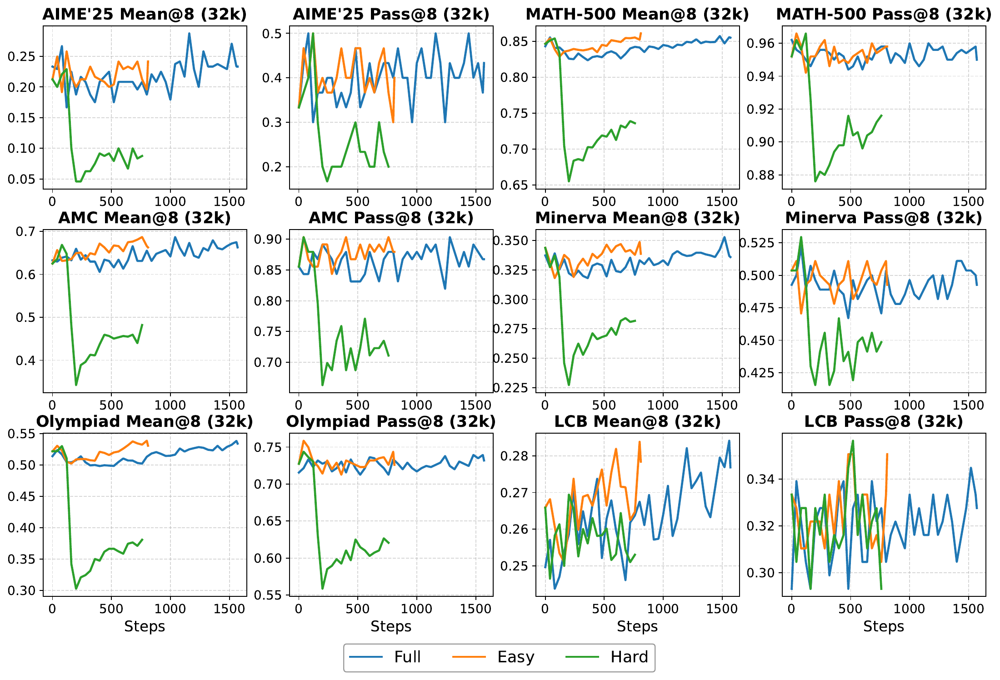 图 4（PDF 第 3 页）显示只训练 Hard 会 catastrophic failure：策略熵剧烈上冲，长度提前塌缩，AMC、Olympiad 等指标显著下降。作者将其归因于正样本稀疏和组归一化：例如奖励组 $`\{1,0,0,0\}`$ 的正样本 advantage 大于 $`\{1,1,1,0\}`$。但这应理解为作者对训练动力学的经验解释，不是说“全零组自动产生长度梯度”；若一组奖励全为零，组相对优势本身应为零，不能凭公式推出更新。可观察到的 collapse 还依赖跨组采样、模型分布和实现细节。

只训练 Easy 则熵低而稳定，长度平滑下降至目标附近；在 AIME’25 这类相对困难的测试上，性能与全量训练相当甚至略高。作者的解释是 Easy 提供密集而有效的正奖励，让模型先学会长度适应而不牺牲推理；所得长度偏置随后可跨难度泛化。附录图 11（$`L_R=16k,L_T=8k`$）与图 12（$`L_R=L_T=4k`$）在多 benchmark 上复现：Hard 曲线常在适应阶段后剧烈波动或坍塌，Easy 多数与 Full 持平或更好。

这不是“永远只用简单数据”的定理：论文只在数学 DeepScaleR 上训练，代码和十域私有 OOD 测试用于验证长度偏置的迁移；它没有比较更多领域混合或课程学习。可操作的训练原则是先保证正奖励密度，再用更难题扩充能力边界。

### rollout 数 $`N`$

在 Easy 上比较 $`N\in\{8,12,16,24\}`$，保持 $`L_R=16k,L_T=4k`$。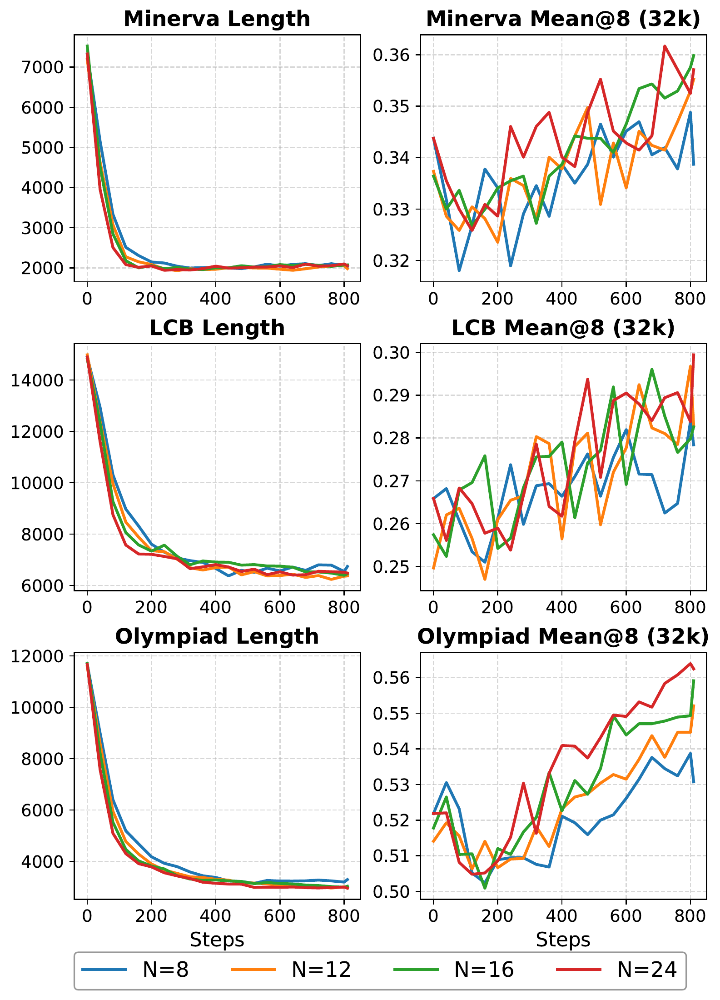 图 5（PDF 第 4 页）中 $`N`$ 越大，越容易在同一 prompt 找到短且正确的轨迹，长度适应更快（例如 $`N=24`$ 的长度比 $`N=8`$ 衰减快），但最终长度 floor 相近。数学任务的精炼恢复更快、渐近 Mean@8 更高；LCB 上 $`N=8`$ 与 $`N=24`$ 差距很小，说明代码生成的探索瓶颈不只是 rollout 数。

附录 C 的更广结果还揭示 Mean@8 与 Pass@8 的区别：增大训练 $`N`$ 通常提高 Mean@8，却很少显著提高 Pass@8。这意味着它主要降低可解问题上的策略方差，而不是把原先完全不会的问题变成会做；代价是采样和训练计算增加。作者报告的 token/长度指标是生成 token 长度与预算条件，未报告端到端延迟、FLOPs、每题电费或每个正确答案的成本。

## 5. 奖励：正确性与长度不能被错误耦合

表 1 将负样本拆为四类：正确短、正确长、错误短、错误长。Vanilla 给四格 $`(1,0,0,0)`$。记号“−”代表 mask（不纳入更新），0 代表明确作为负样本处理：

|策略|正确短|正确长|错误短|错误长|
|---|---:|---:|---:|---:|
|Vanilla|1|0|0|0|
|−I|1|0|−|−|
|−L&C|1|−|0|0|
|−L&C−S&I|1|−|−|0|
|−L&C−L&I|1|−|0|−|

**四条轨迹算例（教学用）。** 假设一个 prompt 的四条 rollout 依次是：$`y_1`$“正确且短”、$`y_2`$“正确且长”、$`y_3`$“错误且短”、$`y_4`$“错误且长”。在 Vanilla/截断奖励下，奖励向量是 $`(1,0,0,0)`$：只有 $`y_1`$作为正样本，其余三条是零回报负样本。−I 的 mask 只保留正确性相关的两条，向量可写成 $`(1,0,-,-)`$；−L&C 将长且正确的项 mask，得到 $`(1,-,0,0)`$；−L&C−S&I 得到 $`(1,-,-,0)`$；−L&C−L&I 得到 $`(1,-,0,-)`$。这里的“−”只是该项不参加更新，表格展示的是奖励/是否纳入更新的结果，不规定任何额外的 mask 执行顺序。这个算例只帮助跟踪表 1 的差异，不把四条轨迹的排列或组归一化误当作论文额外算法。

 图 6（PDF 第 5 页，$`N=24,L_R=16k,L_T=4k`$）展示三种失败和一个较好的折中。

1. **“short is correct” 陷阱（−I 与 −L&C−S&I）。** −I 只留下正确样本的长度对比：短正确为正，长正确为负；错误样本完全 mask。−L&C−S&I 则留下短正确正奖励和长错误负信号。两者都把正确性和短长度绑定成错误因果关系。−I 在约 400 steps 后熵爆炸、长度陡降，模型直接放弃推理；−L&C−S&I 类似。

2. **只训练短 rollout 的漏洞（−L&C−L&I）。** 所有长轨迹都 mask，于是有效信号只有短正确正、短错误 0。约 200 steps 后模型学会钻空子，开始生成很长且几乎全错的输出；它没有像前一类一样完全 collapse，是因为长轨迹没有被明确惩罚，但也没有被正确性约束。

3. **不对长且正确施加这项惩罚（−L&C）。** 长正确被 mask，错误短/长仍为 0。下游模型生成更长，却能超过 Vanilla 的性能；这显示长度控制和能力之间存在可调 trade-off。这里的 mask 表示不把长正确样本用于该项奖励更新，不能表述成它被直接作为正向学习信号；较好的性能是图 6 的经验结果。

作者还比较了直接把采样上限降到目标长度的 Vanilla（$`L_R=L_T=4k`$）。相较 $`L_R=16k\to L_T=4k`$，两者正样本大致同长，但后者的负样本更短（约 4k 对约 6k）。在前者中，短正确相对短错误的差别没有被显式的长度惩罚放大，因而形成“正确且短”的隐式偏置，并达到更好的 Pareto 前沿：性能更高、输出略短。作者的经验建议是：如果可以，把采样上限直接设为目标长度，既减少长度陷阱又节省 rollout 成本。

## 6. off-policy：陈旧 rollout 加速，但留下稳定性债务

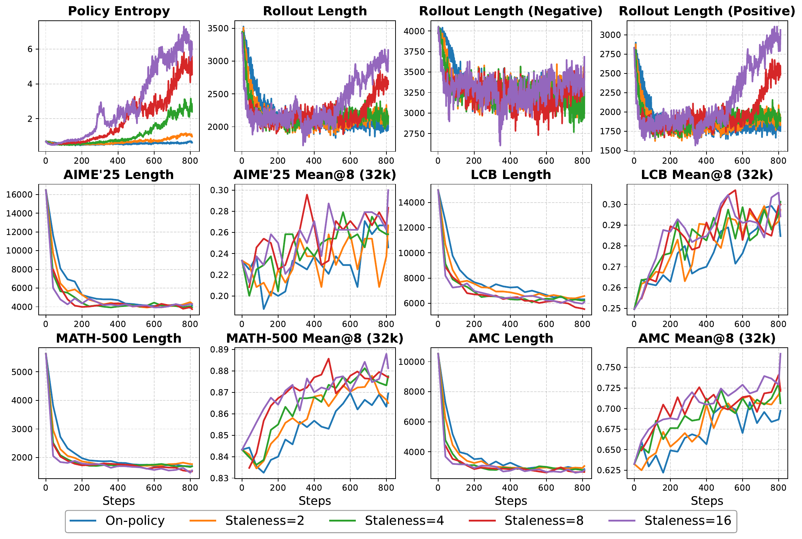 论文在 $`L_R=L_T=4k,N=24`$ 的稳健设置下引入 staleness $`S\in\{2,4,8,16\}`$，让更新使用相对当前策略更旧的 rollout。图 7（PDF 第 6 页）显示 $`S`$ 越大，长度适应越快；之后更早进入推理精炼，截止约 800 steps 时高 $`S`$（例如 16）准确率甚至高于 on-policy。

代价是潜在不稳定：$`S=16`$ 在约 400 steps 后策略熵剧烈上升，正样本长度重新上漂，说明效率与能力的平衡开始失守。本文没有观察到文献所说的立即 catastrophic collapse，作者归因于 Easy 数据和 $`N=24`$ 提供了密集奖励；这不是对所有模型和数据的安全保证。最终 Qwen3 实验明确不用 off-policy，理由正是大模型/脆弱模型的稳定性风险。作者给出的建议是：小 staleness 可作为加速手段，大型或脆弱模型优先保持 on-policy，并监控熵和正样本长度反弹。

## 7. 跨领域与跨模型结果

虽然训练 prompt 全是数学，LiveCodeBench（LCB）上的动态仍与数学任务相似：Kimi 在 2k 最好，预算放宽后差距缩小，说明学到的是一种长度偏置而不完全依赖题型。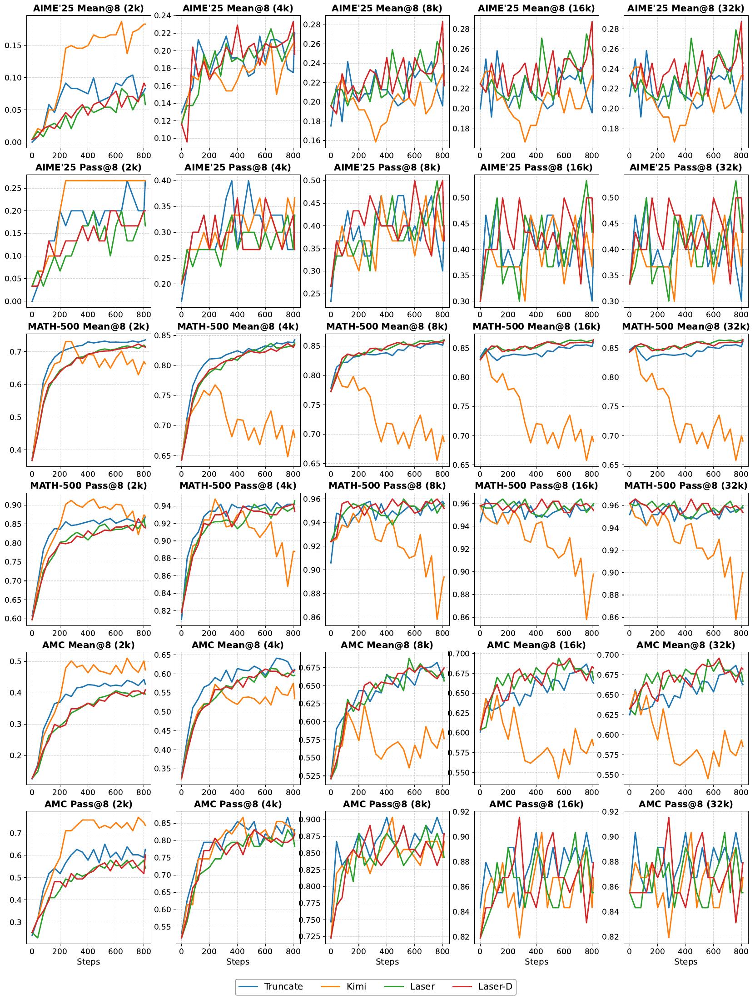

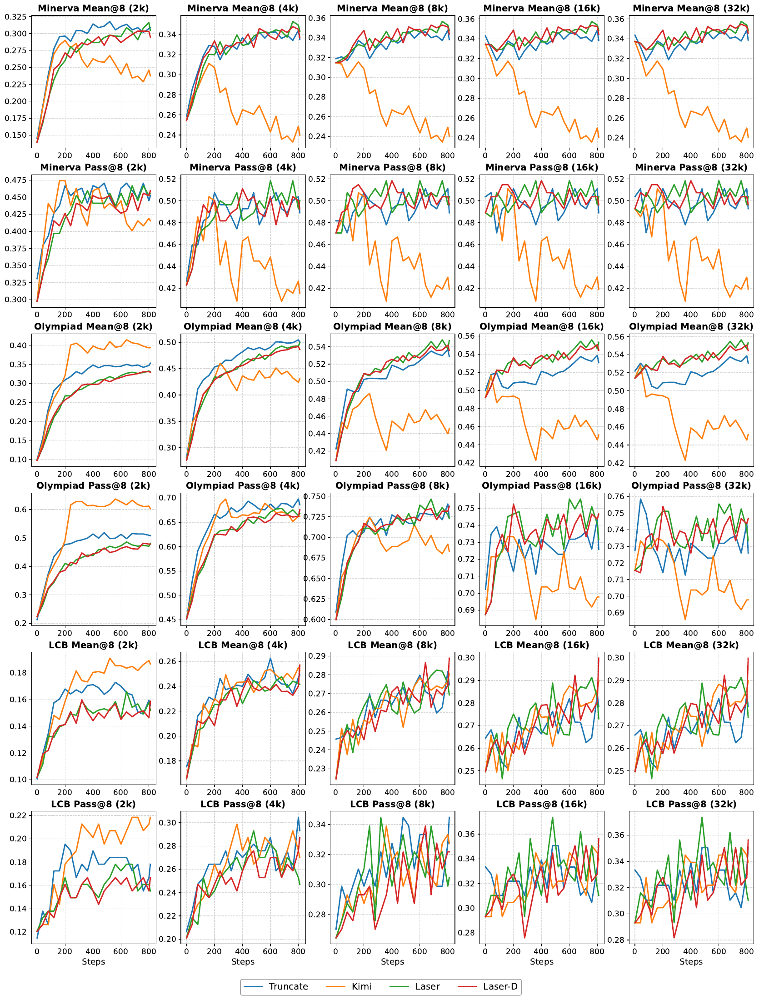 论文还在一个含 10 个领域的私有 OOD benchmark 上测试 Qwen3-30B：Instruct 的平均 Length 从 5622 降至 3735，Mean@4 从 25.2 变 24.9、Pass@4 从 37.6 变 36.9；Thinking 的 Length 从 9285 降到 8077，Mean@4 从 30.7 变 30.0、Pass@4 从 44.6 变 43.1。表 3 的各域有涨有跌，结论是总体压缩而性能近似保持，不能读成每个领域都无损。

Qwen3 主实验（表 2，AIME’25）采用作者从上述规律改出的设定：始终 $`N=24`$，从 DeepScaleR-Easy 采样；多数模型把 $`L_R`$ 与 $`L_T`$ 对齐，Instruct 模型因原本短而设较大的 $`L_R`$ 和较小 $`L_T`$ 以继续压缩；不用 off-policy。结果（Vanilla → Ours，括号外顺序为 Mean@8、Pass@8、Length）：

|模型|Vanilla|Ours（选定训练 step）|
|---|---|---|
|Qwen3-0.6B|13.33，26.67，14.9k|24.58，36.67，8.9k（640）|
|Qwen3-1.7B|35.00，60.00，17.7k|38.75，60.00，11.2k（560）|
|Qwen3-4B-Instruct-2507|45.42，66.67，9.1k|46.67，70.00，4.8k（1440）|
|Qwen3-4B-Thinking-2507|75.83，90.00，20.9k|76.25，86.67，16.0k（200）|
|Qwen3-8B|65.83，86.67，17.9k|67.08，83.33，12.8k（100）|
|Qwen3-30B-A3B-Instruct-2507|60.83，83.33，6.9k|60.83，76.67，5.1k（600）|
|Qwen3-30B-A3B-Thinking-2507|84.17，96.67，17.3k|86.25，96.67，14.8k（120）|

这组结果支持跨规模的长度/性能折中，但也包含反例：4B-Thinking、8B、30B-Instruct 的 Pass@8 下降，30B-Instruct 的 Mean@8 不变。故“15%–47.3% 压缩且保持或提升 Mean@8”是整体摘要式结论，不能替换逐模型检查。

## 8. 自适应目标长度与案例

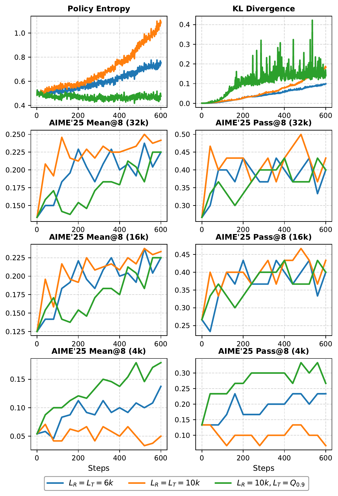 附录 G 将 $`L_T`$ 设为正确 rollout 长度的 90% 分位数。这样始终约 10% 正确答案成为超长负样本，产生更强的长度信号；Qwen3-0.6B 在 4k 预算下变短且性能更好。但在 32k 下性能相当或更差，KL 曲线有许多尖峰，提示梯度快速变化和潜在不稳定。论文没有把自适应 $`L_T`$ 当作主方法，只把它列为未来探索。

附录 D 的案例把机制具体化。一个复数几何题中，Hard 训练的回答跳过 double-check，呈现“更短但少验证”的 collapse；Easy 训练仍给出正确面积 $`10+\pi\approx13.1416`$。圆锥体积题中，Hard 回答压缩为直接套 $`V=\frac13Bh=65`$，而 Easy 回答保留检查，二者正确。另一组 vanilla/Ours 对比中，题目是 $`\binom{31}{28}`$。Vanilla 反复写 “Hmm/Let me think”、重述题目、逐位做冗长除法；Ours 先用对称性 $`\binom{31}{28}=\binom{31}{3}`$，再算 $`31\cdot30\cdot29/6=4495`$。圆锥题的 Ours 也先算 $`30\times6.5=195`$，再除以 3。案例的意义是奖励塑造的不只是字符数：模型把同一正确解组织成更密集、较少对话填充的数学结构；但这些是定性示例，不是独立正确率证据。

## 9. 论文结论、可推出解释与局限的边界

作者结论是：高效推理训练存在“长度适应→推理精炼”两阶段；应使用条件正确的长度分布和多预算评测；Easy prompt、高正奖励密度和较大 $`N`$ 有助于稳定蒸馏；奖励要避免制造“短必然正确”的错误因果；适度 off-policy 可加速但要监控熵与长度反弹；数学训练得到的长度偏置可以迁移到代码和私有多域任务。

可作教学解释、但不能当作数学必然的是：在 Hard 数据上作者观察到正奖励稀疏、熵上冲和长度塌缩；长度是容易被策略改变的表面变量，可能因跨组样本分布而成为捷径。若某组奖励全为零，组相对优势本身应为零，公式不会自动产生长度梯度；因此“长度支配更新”是对完整训练动力学的作者归因，而不是由单个奖励向量直接推出。将 $`L_R`$ 设为 $`L_T`$ 会改变长错误/长正确样本的暴露方式，论文观察到它降低了长度陷阱，但没有给出完整因果识别或理论收敛证明。

局限包括：训练域主要是数学 DeepScaleR，代码只是验证迁移，创作等领域未测；$`L_R,L_T`$ 仍是固定规则，adaptive 结果只覆盖 toy setting；没有极大 Qwen3-235B-A22B；只研究 reward-shaping RL，未深入更细粒度过程监督；未报告真实端到端延迟、FLOPs、训练成本拆分，或把统一任务的输入、输出与系统成本合并成一条完整前沿。论文已经报告 $`2k`$–$`32k`$ 多预算性能曲线，缺少的是统一成本口径下的完整 token-quality 前沿，而不是缺少预算曲线。因而“减少 token”在本文应理解为 rollout 输出长度和给定预算下的生成 token，不能推成部署总成本同比下降。论文还提出未来可研究将 notebook/calculator 等工具纳入推理以提升每 token 信息密度。

## 10. 图与资产记录

以下标记供总稿整合。作者 TeX 与原始 PDF 图已取得，许可为 arXiv 页面所示 [CC BY-NC-ND 4.0](https://creativecommons.org/licenses/by-nc-nd/4.0/)；原资产应保持完整原样，不裁剪或改字。文件位于 `source/tex/figures/`，中文解说与原图分开。

- 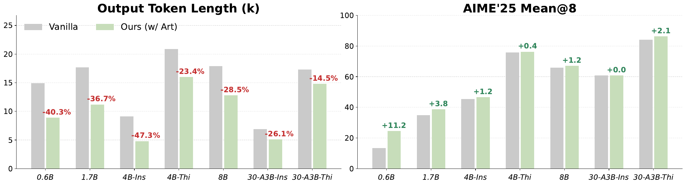 图 2，正文首页/第 1 页：Qwen3 0.6B–30B 的 AIME’25 输出长度与 Mean@8 对比；标注长度下降 15%–47.3%及各模型分数增量。原资产：`source/tex/figures/aime25_qwen3_cot_compression.pdf`。
-  图 3，正文 PDF 页 2：DeepSeek-R1-Distill-Qwen-1.5B 的策略熵、总/正/负长度和 2k/8k/32k 指标，揭示两阶段及预算依赖。原资产：`source/tex/figures/two_stage.pdf`。
-  图 4，正文 PDF 页 3：Full/Easy/Hard 训练的熵、长度与多 benchmark 曲线；Hard 的熵上冲和长度塌缩是正奖励稀疏证据。原资产：`source/tex/figures/data_diff_all_16k_4k.pdf`。
-  图 5，正文 PDF 页 4：Easy 数据上 $`N=8,12,16,24`$ 的长度与 Mean@8；大 $`N`$ 加速长度适应并提高数学精炼，但 LCB 差距小。原资产：`source/tex/figures/rollout_n.pdf`。
-  图 6，正文 PDF 页 5：负 rollout mask 策略及 $`L_R=4k`$ 对照；定位三种奖励失败模式。原资产：`source/tex/figures/reward_neg.pdf`。
-  图 7，正文 PDF 页 6：staleness 2/4/8/16 与 on-policy 的长度、熵、AIME/LCB/Minerva/AMC 曲线。原资产：`source/tex/figures/off_policy.pdf`。
-  图 8，附录 PDF 页 12 左右：自适应 $`L_T=Q_{0.9}`$ 在 4k/16k/32k 的性能及 KL 尖峰。原资产：`source/tex/figures/adaptive.pdf`。
- 

 图 9–10，附录 PDF 页 13–14：六个数学/代码 benchmark 下各奖励策略的五预算轨迹。原资产分别为 `source/tex/figures/two_stage_all_results_1.pdf`、`source/tex/figures/two_stage_all_results_2.pdf`。
- 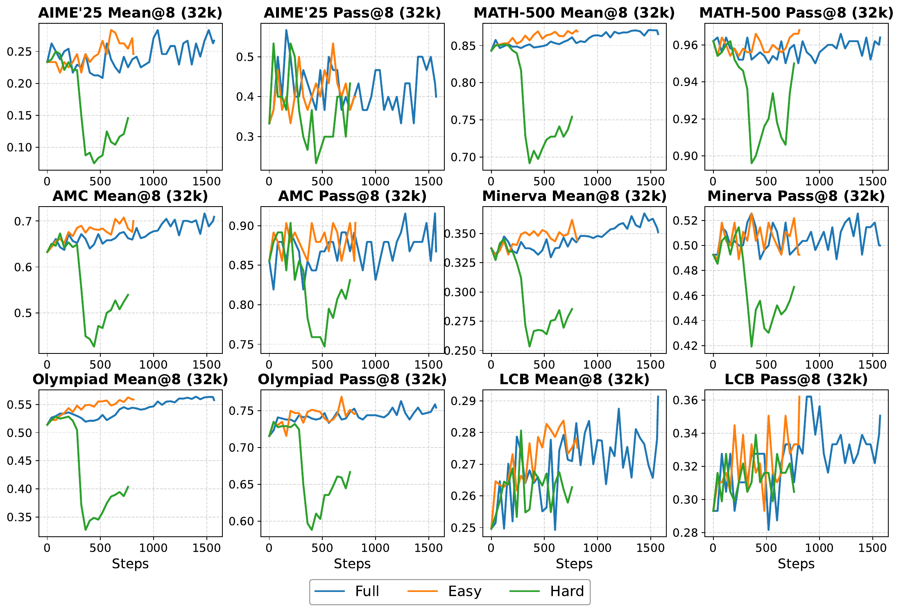

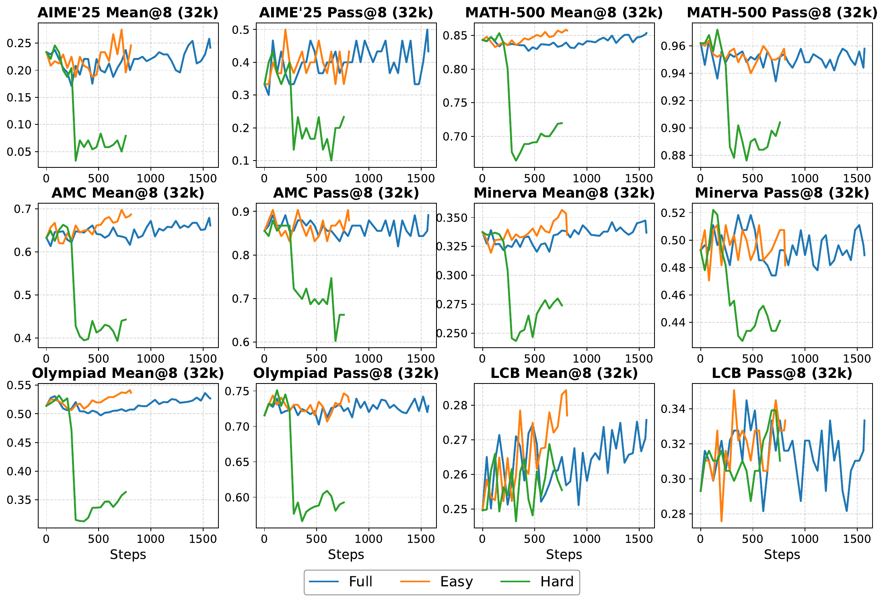

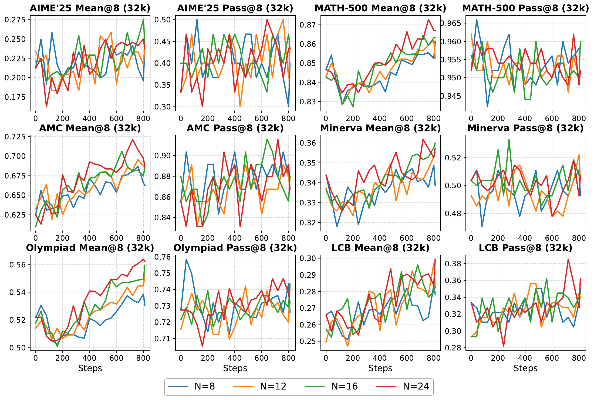

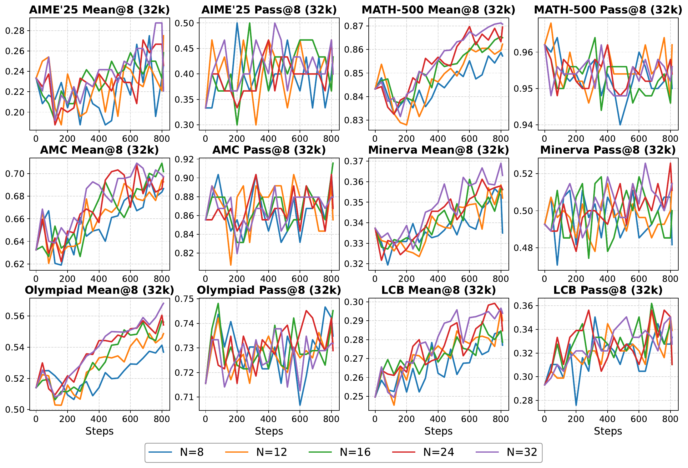 图 11–14，附录 PDF 页 15–18 左右：Full/Easy/Hard 与多 $`N`$ 在两组 $`L_R,L_T`$ 下的补充结果。原资产为 `source/tex/figures/data_diff_all_16k_8k.pdf`、`source/tex/figures/data_diff_all_4k_4k.pdf`、`source/tex/figures/data_rollout_N_16k_4k.pdf`、`source/tex/figures/data_rollout_N_4k_4k.pdf`。

## 与推理时 token 目标的关系

本文最直接的启示是把“短”当作受正确性约束的策略分布目标，而不是独立的长度最小化目标。部署侧应同时记录输出 token、正确/错误条件长度和不同上限下的质量；训练侧应优先保证足够正样本，避免用负样本 mask 把“短”与“正确”绑定。$`L_R=L_T`$ 可作为便宜而稳健的初始配方，$`N`$ 与 Easy 数据能提高正奖励密度，但各自增加采样成本；off-policy 和自适应 $`L_T`$ 只应在熵、KL、长度反弹可监控时使用。论文没有测量实际延迟、FLOPs 或成本，所以不能把其长度比率直接当作系统级成本比率。
