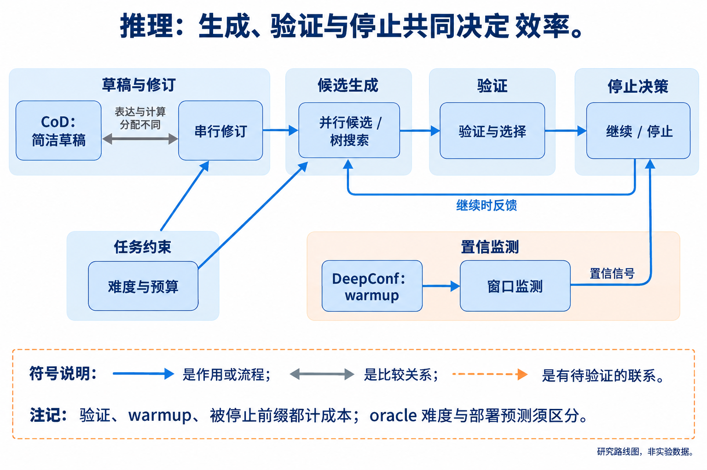
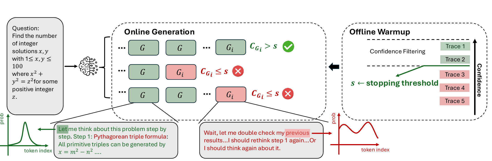
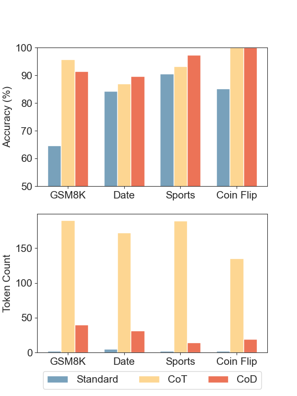

# 06 推理、验证与规划：把预算分配给有收益的计算

[上一章：后训练](../05-posttraining/index.md) · [总论](../00-overview.md) · [下一章：上下文](../07-context/index.md)

同一个模型可以直接回答、写一条长链、生成多个候选，也可以搜索、验证后停止。这些程序会产生不同的性能—token 曲线。本章关注如何组织推理计算，以及如何判断新增 token 是否带来足够的成功收益。

## 本章地图：生成、判断与停止要一起比较



本图由主代理综合正文关系后使用 GPT-Image 生成；连线表示文中说明的流程、比较或待验证联系，不表示统一性能排名。

| 路线 | 代表方法 | 改变了什么 | 主要限制 |
|---|---|---|---|
| 简化每一步表达 | Chain of Draft | 用短草稿代替完整自然语言叙述 | 软提示可能失效，任务仍可能需要完整过程 |
| 在串行与并行之间分配预算 | Compute-optimal test-time scaling | 修订次数、候选数、搜索宽度和深度 | 最优选择依赖题目难度与验证器，常有 oracle 成分 |
| 根据置信信号筛选或停止 | DeepConf | 低质量候选不必都生成到底 | 置信度未必等于正确概率，warmup 和误停有成本 |
| 学习服从长度或按难度调整 | L1、DAST | 把部分预算策略写入模型 | 训练成本、迁移与困难题能力需另测 |

Self-Consistency 和 Tree of Thoughts 提供多路径与树搜索的基础结构；实际效率取决于生成了多少候选、怎样评价及何时停止。将搜索或早停加到同一底座上也可能改善可达到的前沿，评测时要让基线使用合理的预算设置，而不是只比较一个默认工作点。

## 按难度选择搜索与修订

Snell 等把测试时计算拆成两类：改变候选答案的生成分布，例如对前一答案进行修订；改变如何评价和选择候选，例如用 process reward model（PRM）进行 Best-of-N、beam search 或 lookahead search。二者的好处和失败模式不同。[原论文](https://arxiv.org/abs/2408.03314v1)

修订沿同一路径增加串行计算，模型可以利用前一次错误，但也可能把正确答案改错。并行采样增加候选多样性，若每个候选都来自同一个错误模式，增加数量的收益也会很小。PRM 搜索则把预算放在被评分为有希望的部分解上；评分器一旦被利用，搜索越多反而可能更偏离正确性。

设候选策略集合为 $`\Pi`$，题目或题组为 $`x`$，预算为 $`B`$，$`S`$ 是任务得分，$`C`$ 是约定口径的消耗。理想选择可写成：

```math
\pi^*(x,B)\in\underset{\pi\in\Pi}{\mathrm{arg\,max}}
\mathbb E[S\mid x,\pi],\qquad
\mathbb E[C\mid x,\pi]\le B.
```

这里的“最优”相对于被考虑的策略集合，而不是所有可能算法。真实部署还不知道每题的期望成功率。论文因此区分根据真实表现划分的 oracle difficulty 与可预测的难度；读者需要检查图中哪一种难度用于选择策略。


[查看原图，可放大](../../assets/papers/2408.03314/fig-search_methods.pdf) · [论文来源](https://arxiv.org/html/2408.03314v1)

作者的搜索图展示不同预算支出位置：Best-of-N 多生成完整候选，beam search 反复保留部分路径，lookahead 还为评价当前路径生成后续内容。比较中 verifier 和用于评分的额外生成都应进入相应成本口径。

下面是说明策略选择的教学例，不是原论文实验：

```python
# 每项为（估计成功率，包含验证的实际token）；预算=1000。
options = {"direct": (0.55, 200),
           "revise": (0.73, 850),
           "sample_and_verify": (0.76, 1200)}
feasible = {k: v for k, v in options.items() if v[1] <= 1000}
choice = max(feasible, key=lambda k: feasible[k][0])  # revise
```

若漏记验证成本，最后一种方案会被错误纳入可行集合。若难题上的修订成功率只有0.40，选择也会改变。因此一个统一“所有题都多想几轮”的策略难以代替按难度测量。

原文在 MATH 等设置中发现，修订与搜索的收益随难度变化；部分原本正确的回答经过修订会变错，PRM 优化也有被利用的现象。训练与测试时计算交换分析使用近似 FLOPs 模型，其中预训练和推理计算与参数量、处理 token 数相联系，不能把跨模型结果直接改写成同单位 token 的排行榜。[完整设置、负面结果与预算条件](reference/Compute-optimal-Test-Time-Scaling.md)

## DeepConf：先判断哪些局部信号值得继续生成

DeepConf 从模型下一 token 的概率分布构造置信信号。其 token confidence 使用 top-$`k`$ 候选的对数概率负平均，而不是采样 token 的单一概率。令这些候选的概率为正，定义：

```math
C_i=-\frac1k\sum_{j=1}^{k}\log P_i(j),\qquad
C_G=\frac1{|G|}\sum_{i\in G}C_i.
```

$`G`$ 是非空的局部窗口。作者比较全轨迹平均、最低若干窗口的平均、最小窗口值和末段平均，试图避免全局平均掩盖局部退化。这些量的判别效果由经验验证；不能把其数值解释为已校准的答案正确概率。[原文 §3](https://arxiv.org/abs/2508.15260v1)

离线版本已经有全部完整候选，只能改变过滤和投票；在线版本先生成 warmup 轨迹，得到阈值，再在新轨迹产生过程中监测窗口。若窗口信号低于阈值，就终止该条候选。已生成的前缀已经消耗 token，不能在统计中删除。



[查看原图，可放大](../../assets/papers/2508.15260/figure-4-online-diagram.pdf) · [论文来源](https://arxiv.org/abs/2508.15260v1)

图中的 warmup、局部停止和最终候选聚合是三个环节。以教学分数为例，阈值为3，连续窗口分数是4、5、2，第三个窗口会触发停止；统计成本时仍计入前面全部生成。阈值的获得也要计入warmup成本。

对于保留的完整轨迹，置信度可作为答案投票权重。若 $`w_t\ge0`$ 且总权重为正，则候选答案 $`a`$ 的权重和与共识度可写为：

```math
V(a)=\sum_t w_t\mathbf1[\mathrm{answer}(t)=a],\qquad
\rho=\frac{\max_aV(a)}{\sum_aV(a)}.
```

达到共识阈值或采样预算后停止继续采样。答案规范化方式也会影响投票，数学上等价但字符串不同的答案不应在未经说明时被当成独立意见。

论文在 AIME、HMMT、BRUMO 和 GPQA 等任务上比较多个模型。离线准确率与在线 token 节省是不同设置；64次重抽样来自已有轨迹池，不能当作64批完全独立的新题。激进保留比例通常节省更多，也有过度自信错误和准确率退化；保守比例保留更多候选，但成本较高。研究新停止信号时，必须同时比较误停正常难题和未能停止错误冗余的成本。[精读：完整在线/离线实验](reference/DeepConf.md)

## Chain of Draft：压缩表达可以是一个强的无训练基线

Chain of Draft（CoD）在提示中要求每步仅保留简洁草稿，用有限词数概括中间计算，最后输出答案。它没有改变权重，也没有外部验证器或严格 token 计数器。“每步五个词”的指令是一种表达约束，不等于每步恰好五个 tokenizer token。[原文](https://arxiv.org/abs/2502.18600)

例如教学题“原有12件，卖出5件，又收到8件”，详细CoT可能解释每一阶段的含义，草稿可写成 `12−5=7; 7+8=15`。这条短草稿仍保留两次状态更新，和直接猜15的计算接口不同。它也可能丢掉单位或关键条件，因此不能只用字符更少评价。



[查看原图，可放大](../../assets/papers/2502.18600/fig1_plot.png) · [论文来源](https://arxiv.org/pdf/2502.18600v2)

作者图比较 Standard、CoT 和 CoD 的任务表现与输出量。正文的 GSM8K、日期、体育和硬币状态等实验包含不同模型、zero-shot及小模型条件；不是每项都稳定获益。它适合作为训练型方法必须面对的低成本基线：若一个训练方法不能超过同预算的简洁提示，研究贡献需要进一步解释。[精读](reference/Chain-of-Draft.md)

## Budget forcing：外部解码控制与软提示的区别

s1 的 budget forcing 由解码过程控制思考长度：需要继续计算时，抑制或替换结束思考的标记并追加类似 “Wait” 的延续提示；达到预算时转入答案生成。这改变的是运行时控制，和 Chain of Draft 的简洁提示、L1 学到的预算服从属于不同层次。[s1 原文](https://arxiv.org/abs/2501.19393)

它可以研究额外思考是否提高性能，也可以限制输出，但设定预算不等于实际任务成本。不同停止策略产生的工作点需要在相同判分下比较，强制继续也可能重复错误。较长的奖励算例与执行控制教学见[算例附录](../appendix/worked-examples.md)，不将这些教学输出当作模型实验。

## 认识与行动入口

较稳定的认识是预算收益具有任务与难度依赖，候选质量和验证成本共同决定搜索效率。仍有争议的是如何在未知题目上估计难度、何时可相信内部置信度，以及怎样防止验证器和预算控制造成系统性偏差。高预算能力研究也有价值，但不能只通过增加候选数量来证明小团队关心的低预算左移。

可先固定基座和验证器，在同一测试集上扫描草稿提示、串行修订、并行采样和置信停止，报告每种方法的实际总 token 分布与性能。预算策略只在开发集选择，独立测试按难度和题族分层。若优势来自遗漏warmup或验证成本、使用oracle难度、只保留成功轨迹，结论需要退回相应有限条件。下一步可沿[评测与诊断](../11-evaluation/index.md)检查这些漏洞。
