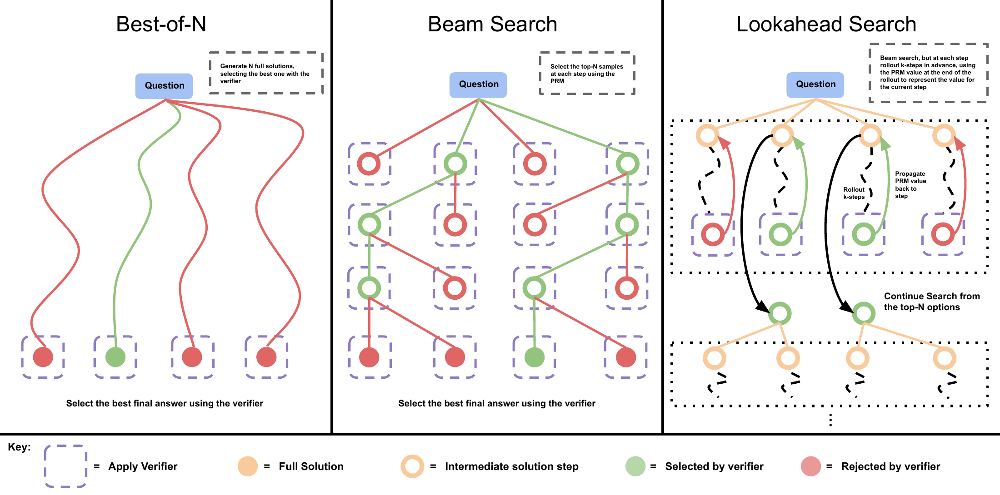
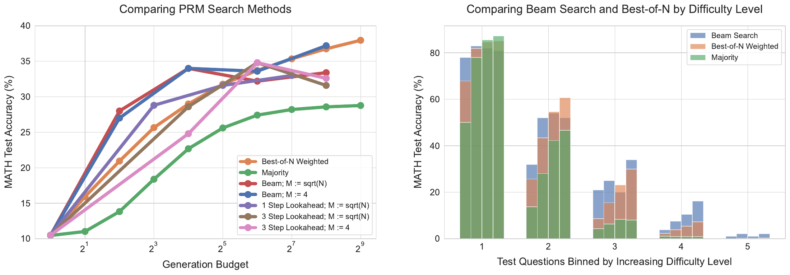
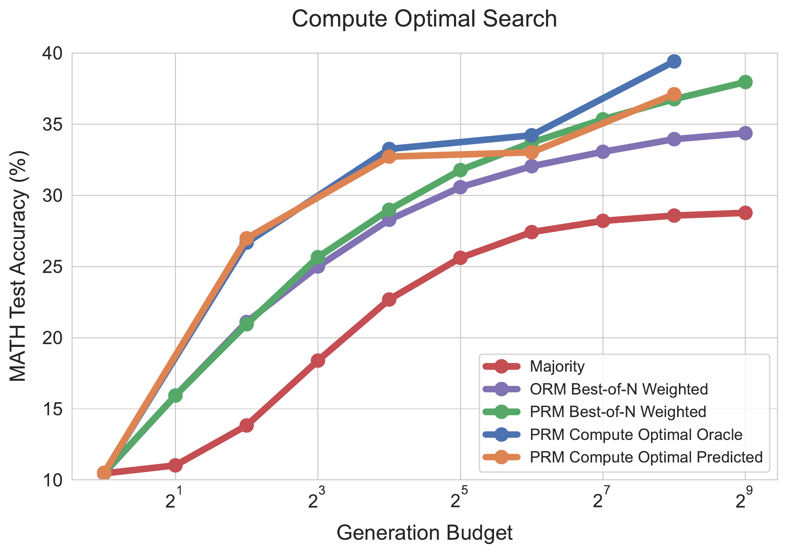
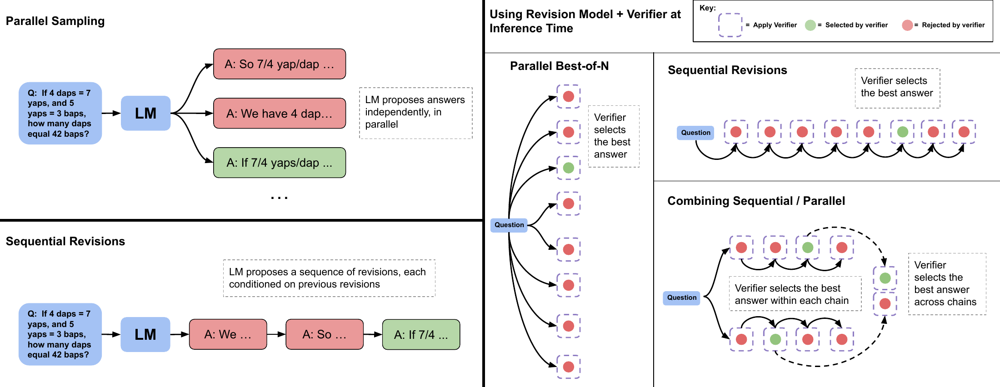
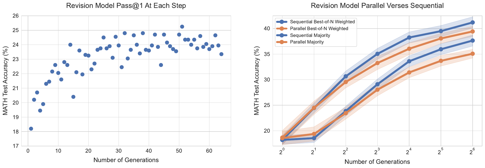
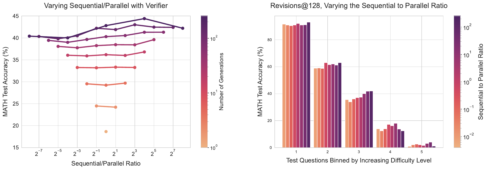
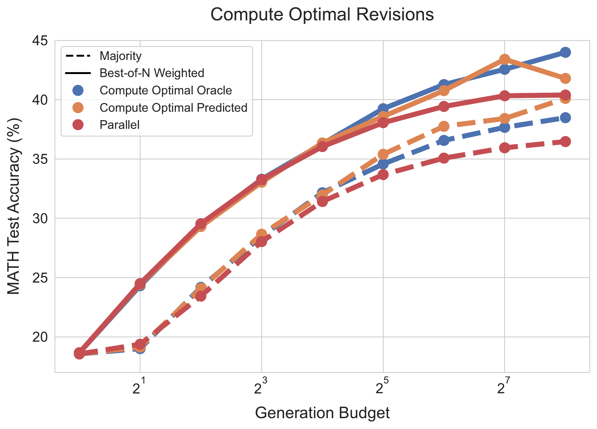

# Scaling LLM Test-Time Compute Optimally can be More Effective than Scaling Model Parameters

[所属章节](../index.md) · [来源与阅读状态](../../../sources/papers.json)


**作者**：Charlie Snell, Jaehoon Lee, Kelvin Xu, Aviral Kumar（equal advising；Snell 为 UC Berkeley，其余作者来自 Google DeepMind） <br>
**年份与固定版本**：2024，arXiv:2408.03314v1，提交于 2024-08-06。 <br>
**原始链接**：[arXiv 摘要页](https://arxiv.org/abs/2408.03314)；[v1 HTML 全文](https://arxiv.org/html/2408.03314v1)。 <br>
**实际阅读范围**：v1 HTML 正文第 1–8 节、图 1–9 的文字与图注，以及附录 A–M 的文字图注和训练/聚合/提示细节。本文固定版本没有在本临时目录取得原始 TeX 压缩包和图像二进制，因此图像只保留正文定位与读图说明，不声称已复用原图。

## 这篇论文要解决什么

问题不是“把一次回答生成得更长”本身，而是：给定一个问题和固定的推理预算，应该怎样把预算分配给候选生成、验证、树搜索或连续修订，才能最大化答案正确率？作者把测试时计算（test-time compute）分成两个互补轴：

1. **改变 proposer（提议分布）**：模型先产生答案，再把此前尝试放进上下文，连续修订；这使后一个样本不再独立于前一个样本。
2. **优化 verifier（验证器）**：保持基础模型的候选分布，利用过程奖励模型（PRM）对中间步骤评分，并用 best-of-N、beam search 或 lookahead search 选择/扩展候选。

核心观察是策略效果强烈依赖题目相对于基础模型的难度。容易题已有较大概率答对，连续修订可以利用局部错误修正；中等或困难题需要探索不同高层解法，独立采样或 PRM 搜索更合适；最难题中，所有测试时策略都几乎没有收益。于是论文把“最优策略”定义为题目条件下、预算固定时选超参数的最优分布，而不是把一种方法的曲线外推到所有题。

## 统一视角与最优策略

设题目为 $`q`$，正确答案为 $`y^*(q)`$，测试时策略超参数为 $`\theta`$，预算为 $`N`$。论文定义 $`\mathrm{Target}(\theta,N,q)`$ 为该策略诱导的输出 token 分布，并定义：

```math
\theta^{*}_{q,a^{*}(q)}(N)=\underset{\theta}{\mathrm{arg\,max}}
\mathbb{E}_{y\sim\mathrm{Target}(\theta,N,q)}
[\mathbf{1}_{y=y^{*}(q)}].
```

这里的 $`\theta`$ 可以是 beam width、lookahead 步数、并行与顺序修订的比例等。这个定义是 oracle 式的：它使用真实正确性来选择题目级最优策略，部署时不能直接得到。作者的可操作近似是把问题按难度分成五个分位桶，在验证集上逐桶选择策略，再到测试折评估。为避免同一测试样本既选策略又评估，使用每个 difficulty bin 的两折交叉验证。

难度来自**基础模型视角**，不是 MATH 数据集人工难度。oracle difficulty 对每道题用基础模型 2048 个样本的 pass@1 估计，再按五个分位数分桶。这个定义需要真实答案检查器，只用于分析上界。model-predicted difficulty 改为对同样的 2048 个样本取 PRM 的最终答案分数平均值，再按五分位数分桶；因此无需答案标签，但仍要生成并评分 2048 个样本。论文不把这项成本计入测试预算，明确承认它在生产环境会很贵；未来可训练直接预测题目难度的模型，或边解决边更新难度。

一个直观例子：若预算为 128 次生成，简单题可把 128 次组织成一条（或少量）连续修订链，让模型反复改局部算术错误；困难题则可先产生多个独立起点，再在每条链上做较少修订。该比例必须在独立验证折上按难度桶选，不能用题目答案事后挑选单题最优结果。

## 实验条件和公平比较

所有主实验使用 MATH 的 12k train/500 test split（与 Lightman et al. 的设置一致），基础模型是 PaLM 2-S*（Codey）。模型被专门微调为能进行 MATH 分步作答、验证或修订，因为作者认为当时现成 LLM 的自我修正和验证能力不足；因此结果首先是“具备能力微调的 PaLM 2-S*”上的机制研究，而不是零样本通用 LLM 结论。生成答案使用 4-shot、换行分隔的步骤格式，示例来自 PRM800k phase-1 training split 的 GPT-4 正确解；最终答案使用 Lightman 等人发布的 grading function。

文中的生成预算通常以从基础模型采出的 answer/sample 数计，而不是总 token 数、wall-clock latency 或美元成本。lookahead 的成本按 $`N(k+1)`$ 次 sample 计；因此不同长度答案和 PRM 前向开销没有被完整换算为 token/FLOPs。后文的 pretraining–inference 交换才显式使用 FLOPs 近似。

## PRM 训练与搜索

### 为什么不用 PRM800k 直接训练

作者发现直接用 PRM800k（GPT-4 生成、人工标注的数据）训练的 PRM 很容易被 PaLM 2-S* 的 best-of-N 利用，推测原因是生成分布发生偏移。于是按 Math-Shepherd 风格做无人工标注训练：从基础模型每道题的每个步骤继续做 Monte Carlo rollout，用后续正确率估计该步骤的 reward-to-go，作为 soft label。PRM 是每一步输出 $`[0,1]`$ 的二分类器，以 binary cross-entropy 训练：

```math
\mathcal{L}=-[y\log \hat y+(1-y)\log(1-\hat y)].
```

训练细节（附录 D）：AdamW，学习率 $`3\times10^{-5}`$，batch size 128，dropout 0.05，betas $`(0.9,0.95)`$；从原 PRM800k training split 随机留出 10% 题目做验证并早停。每题使用 16 个基础模型样本，每个步骤再用 16 次 Monte Carlo rollout 估 value；无法解析最终答案的样本被过滤，作者报告这会改善 PRM。

虽然 PRM 在推理时评分每一步，整条答案的分数比较了 min、product 和 last-step 三种聚合。**last-step 分数最好**（附录 E），与先前工作偏好 min 不同，作者推测 soft MC return label 的分布造成了差异。它在形式上近似 ORM，但该 PRM 仍优于单独训练的 ORM，说明逐步训练可能提供了更好的表示学习。附录 F 中 PRM 相对 ORM 的优势随 best-of-N 样本数增加而扩大。

### 三种搜索

* **Best-of-N weighted**：独立生成 $`N`$ 个完整答案，PRM 用最后一步给每个答案评分；相同最终答案的分数相加，选择总分最大的答案。这比只取单个最高分候选更稳健。
* **Beam search**：初始采 $`N`$ 个步骤，按 PRM step score 保留 top $`N/M`$ 个前缀；对每个保留前缀再采 $`M`$ 个下一步，恢复到 $`N`$ 个候选，重复至答案结束或最多 40 轮，最后对 $`N`$ 个完整答案做 best-of-N weighted。论文试验 $`M=4`$ 和 $`M=\sqrt N`$。
* **Lookahead search**：在 beam 的每个保留决策上再向前滚动 $`k`$ 步，用温度 0 的 rollout 末端 PRM 分数评估当前步骤；beam 是 $`k=0`$ 的特例。作者将其视为去掉探索噪声的 MCTS 特例。为公平比较，预算记为 $`N(k+1)`$ samples。

搜索预算网格最大 256，报告 best-of-N、两种 beam，以及 $`k=3`$（两种 beam）和 $`k=1`$（$`M=\sqrt N`$）的配置。低预算时 beam 明显优于 best-of-N，但预算增大后优势消失，甚至低于 best-of-N；lookahead 通常最差，因为额外 rollout 消耗预算。作者观察到 PRM 被过度优化：树搜索会生成低信息重复步骤，或只生成 1–2 步的过短答案，揭示了 verifier exploitation。

在难度分桶上，$`M=4`$ beam 在容易题（bin 1/2）随预算增加而退化，说明 PRM 在本来就容易的题上被进一步优化出伪特征；在中等题（bin 3/4）beam 持续优于 best-of-N；最难 bin 5 几乎没有方法取得有意义进步。这正是固定一种 search 不能代表“测试时扩展”的原因。

**图读法：** 

 图 2 用三个示意图对齐 best-of-N、beam、lookahead 的候选树和预算含义；

 图 3 左图是方法随生成预算的曲线，右图按难度 bin 和预算 4/16/64/256 对比 beam 与 best-of-N；

 图 4 对每个 difficulty bin 取最优 search 策略，oracle 与 predicted 曲线大体重合，在例如 16 generations 处接近或超过 best-of-N 的 64 generations，体现约 4× 预算效率提升。原图未在本目录取得，以上为基于正文图注和相邻段落的结构读图。

## 修订模型：训练、选择和失败模式

作者把 proposer 改成专门的 revision model。理想训练轨迹应是若干相关的错误答案，最后接一个正确答案，让模型学习“看见错误并编辑”，而不是忽略历史重新猜。完整 on-policy 多轮采样太贵，于是每个训练题并行采 64 个答案，过滤无效最终答案；对每个正确答案，均匀采 0–4 个错误答案放进上下文。若有错误答案，先按字符 edit distance 选与正确答案最接近的一个作为最后错误上下文，其余随机抽取。这样是在离线独立样本上后构造多轮轨迹，不是严格的在线多轮 rollouts。训练仍是对最后正确解做 SFT：AdamW，lr $`10^{-5}`$，batch 128，dropout 0，betas $`(0.9,0.95)`$。验证 loss 不适合早停，因为验证轨迹变成 off-policy；作者反而选在验证 loss 开始上升后稍晚的 checkpoint。

推理时可以生成比训练长度更长的链，但上下文只保留最近四个修订。单步 pass@1 随修订步数上升，且超过训练时的四步；这是“模型确实学到利用先前尝试”的证据。不过存在显著失败：约 38% 原本正确的答案在朴素下一次 revision 后被改错（正文第 6.1 节）。因此不能直接取最后一个答案。

作者比较两种选答案方法：

* ORM verifier：在 revision model 输出上重新训练一个 ORM，并采用层次 best-of-N weighted，先在每条链内选，再跨链选。旧的基础模型 PRM 受分布偏移影响，在 revision 输出上不如专门 ORM；ORM 若把历史修订放进上下文会略有提升。
* Majority voting：不做层次投票，而把所有链上答案一次性合并取众数；小链/少轨迹时层次投票不稳，这种扁平聚合曲线更平滑。

公平比较是总生成预算固定时，把样本分成并行起点和每条起点上的顺序 revisions。纯并行相当于 best-of-N，纯顺序是单链连续修订，中间点是多条链各做若干修订。顺序采样窄幅优于并行采样，但不是所有预算都纯顺序最佳：顺序更像局部修补，并行提供高层解法探索，二者互补。

**图读法：** 

 图 5 解释并行候选和顺序修订，以及如何先链内、再链间选择；

 图 6 左为每个修订步的 pass@1 上升，右为顺序与并行选择比较；

 图 7 左固定总预算改变顺序/并行比例，右固定预算 128 按难度展示比例差异：容易题更偏顺序，困难题存在混合最优比例；

 图 8 按难度选择比例，compute-optimal 在例如 64 samples 处达到或超过并行基线 256 samples 的水平，约 4× 节省。附录 B 的 majority 版本总体趋势类似，但容易题对比例较不敏感、困难题有明显最优比例。

### 一个关键阴性条件：ReST$`^{\mathrm{EM}}`$

作者还用最多五步、每题 64 条 revision trajectories 做简化 ReST$`^{\mathrm{EM}}`$，在每条轨迹首次正确时停止，平衡轨迹长度后对正确答案 SFT。该在线数据训练的 revision model 反而在增加顺序修订时显著退化（附录 K）；作者猜测在线数据放大 revision 轨迹中的伪相关，导致模型没有学会修订。换言之，“再做 RL/SFT”不是自动增益；本文主结果依赖离线配对错误/正确答案的训练配方。

## 计算最优结果的边界

图 4（PRM search）和图 8（revisions）都把 oracle difficulty 与 predicted difficulty 分开报告。predicted 大体跟 oracle 重合，说明 PRM 分数平均值可能足以近似难度桶；但这不是无成本的部署算法，因为预测桶本身需要每题 2048 个样本，论文未计入这项预算。作者的“4×”是相同生成样本定义下与 best-of-N 的曲线比较，不等于真实 wall-clock、总 token 或端到端成本 4× 下降。

## 与扩大模型参数的 FLOPs 对换

论文没有把“同一个 token 预算下的大模型和小模型”直接混为一谈，而设预训练 token 数为 $`D_{\text{pretrain}}`$，一次部署/评估生成的总 inference token 数为 $`D_{\text{inference}}`$，模型参数量为 $`N`$。采用近似：

```math
X=6ND_{\text{pretrain}}, \qquad Y=2ND_{\text{inference}}.
```

把参数扩大 $`M`$ 倍，会同时把预训练 FLOPs $`X`$ 和大模型贪心推理 FLOPs $`Y`$ 放大 $`M`$ 倍，总 FLOPs 约为 $`M(X+Y)`$。若保持小模型而增加 inference compute 来匹配大模型的总 FLOPs，推理 token/样本预算的放大因子为：

```math
M+3\left(\frac{D_{\text{pretrain}}}{D_{\text{inference}}}\right)(M-1).
```

令 $`R=D_{\text{inference}}/D_{\text{pretrain}}`$，比较 $`M\approx14`$ 的大预训练模型贪心 pass@1 与 PaLM 2-S* 的 compute-optimal revisions/search。图 9 的星号位于三种 workload 比率对应的 FLOPs 等价点：$`R=0.16`$（推理远少于预训练）、$`R=0.79`$（接近 1）、$`R=22`$（推理远多于预训练）。星号在线下方表示小模型加测试时计算更好，在线上方表示扩大参数更好。

论文报告的方向性结论是：容易/中等题，尤其 $`R\ll1`$ 的自改进或低推理负载场景，小模型的测试时扩展经常超过 14× 大模型；较难题在高 inference/pretraining ratio（$`R\gg1`$）时更适合把 FLOPs 放到预训练；最难题即使增加测试时预算也很少改善。图 9 是按 difficulty bin 的 FLOPs-matched 比较，不是“同样输出 token 数”的模型比较。大模型没有额外 test-time search，使用的是 greedy pass@1；小模型预算则由上述 FLOPs 换算确定。该设计回答的是总 FLOPs 交换率，而非证明推理 token 总能替代参数或预训练数据。

一个教学算例：假设参数放大 $`M=14`$，且 $`D_{\text{inference}}/D_{\text{pretrain}}=0.16`$，小模型可获得的等价 inference 计算因子约为 $`14+3(1/0.16)\times13\approx258`$（按论文近似式）。当 $`R=22`$ 时该因子约为 $`15.77`$。这解释为什么同一个“14× 大模型”在自改进低推理负载和高流量在线服务中的结论相反。数字是 FLOPs 近似的教学计算，不是作者额外测得的真实延迟或成本。

## 主要结论、可迁移性与局限

作者结论是：测试时 scaling 的收益取决于题目难度和基础模型；按难度自适应地分配 search/revision，能相对 best-of-N 提高约 2–4× 的预算效率；在 FLOPs 对齐下，小模型加测试时计算可在已有非平凡成功率的题目上击败约 14× 大模型。公式本身给出的是“题目级最优超参数”的 oracle 定义，实验通过五个难度分位桶和两折交叉验证近似它，不能写成部署中已经有一个逐题 oracle policy。

局限包括：只在 MATH、PaLM 2-S* 及能力专项微调上验证；没有 PRM tree search 与 revisions 的联合实验，也没有 critique-and-revise 等其他方法；最难题上的收益普遍很小；难度估计本身代价高且被实验预算忽略；PRM/ORM 会被分布偏移和代理目标利用；FLOPs 使用 $`6ND`$/$`2ND`$ 粗略估计，未报告真实 token、显存、延迟、能耗或训练美元成本；扩大参数时固定训练数据量，未研究同时扩数据与参数的 Chinchilla 式预训练最优；未将测试时产出蒸馏回基础模型形成闭环自改进。

对 token-efficient LLM 研究的直接意义是：不能只看单一 best-of-N 曲线或把“多想几步”当作统一操作。应记录输入/输出 token、隐藏候选、失败修订和 verifier 前向的实际消耗；先测基础模型在题目上的成功率，再根据可预测难度选择探索（并行/树搜索）与局部修订的比例。文献没有测量真实端到端 token/FLOPs 成本的地方，应保持“未报告”，不能把论文的 generation budget 或 4× 曲线效率直接当成生产 token 成本改善。
