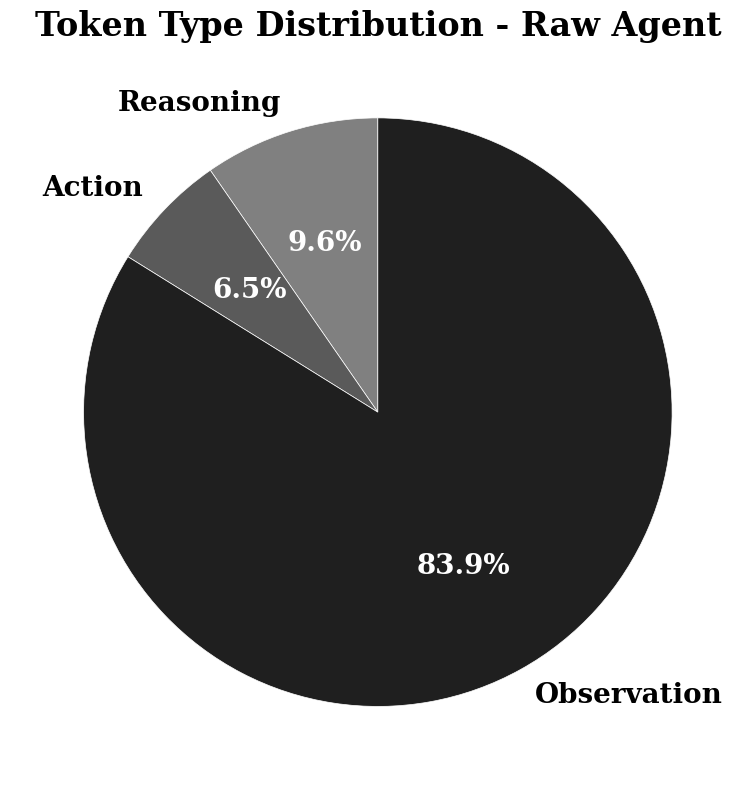
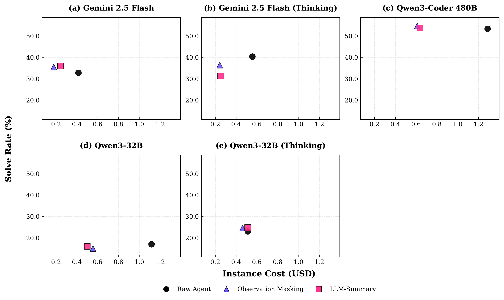
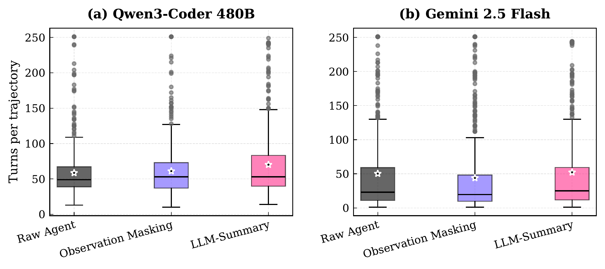
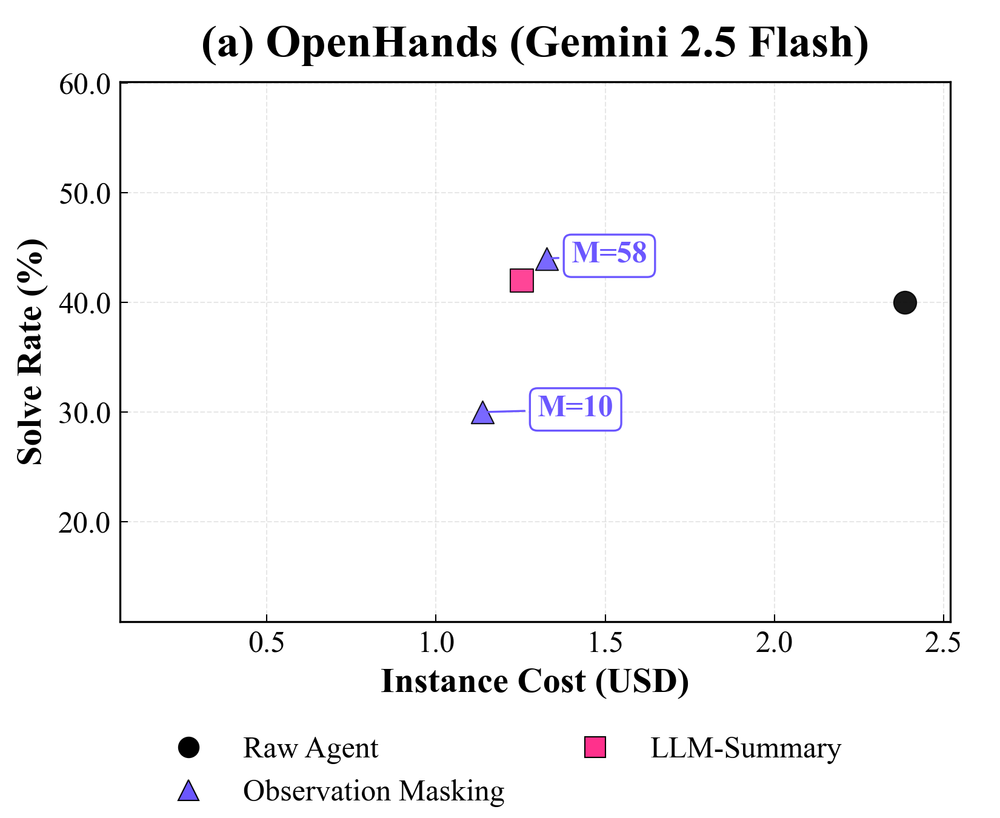
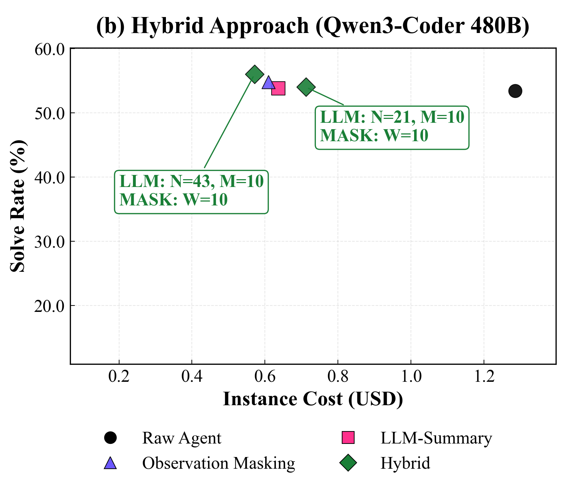
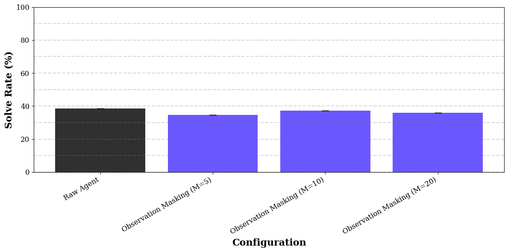
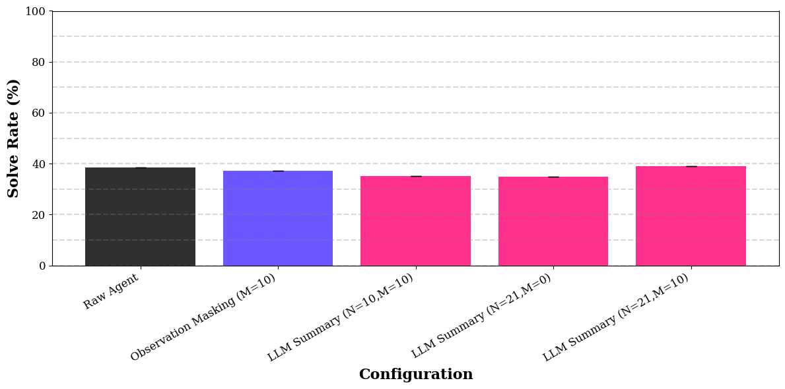
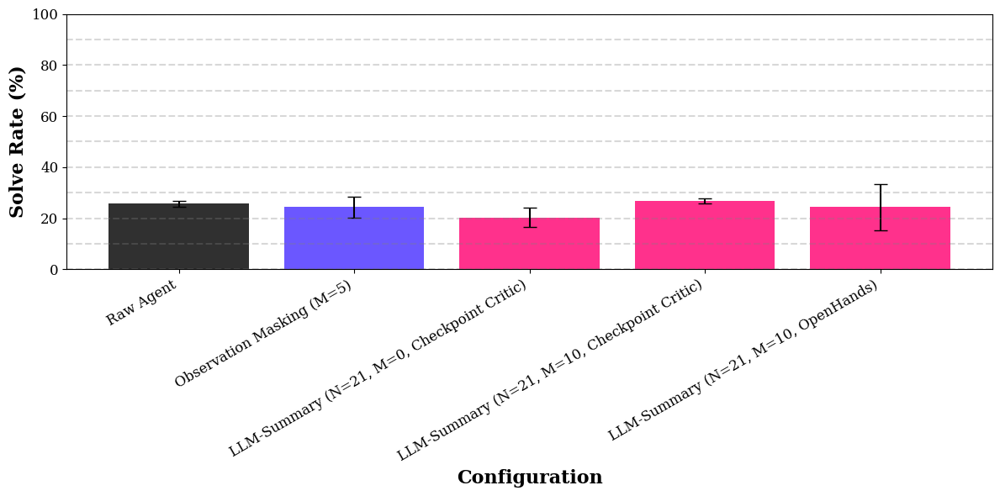
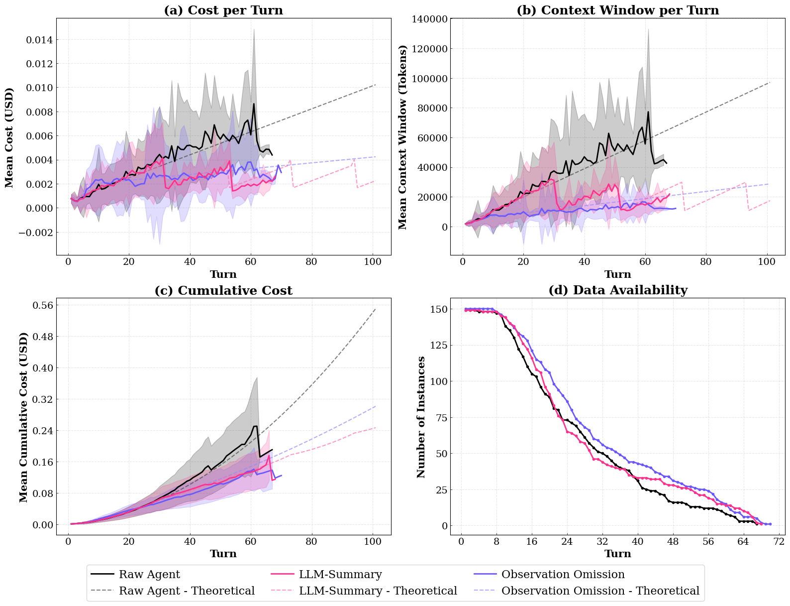
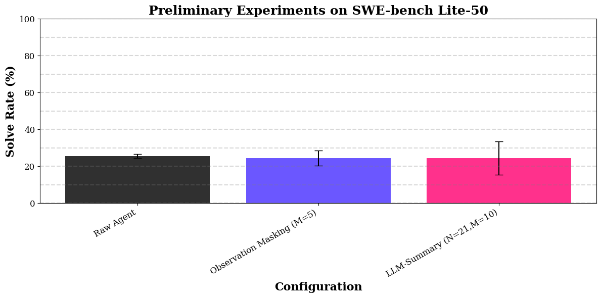

# The Complexity Trap: Simple Observation Masking Is as Efficient as LLM Summarization for Agent Context Management

[所属章节](../index.md) · [来源与阅读状态](../../../sources/papers.json)


**作者**：Tobias Lindenbauer、Igor Slinko、Ludwig Felder、Egor Bogomolov、Yaroslav Zharov（JetBrains Research；Technical University of Munich） <br>
**年份与固定版本**：2025；arXiv:2508.21433v3（论文页标为 2025-10-27，NeurIPS 2025 Workshop: Deep Learning for Code in the Agentic Era） <br>
**原始链接**：[arXiv 2508.21433v3](https://arxiv.org/abs/2508.21433v3)；[代码仓库](https://github.com/JetBrains-Research/the-complexity-trap)；[实验数据集](https://huggingface.co/datasets/JetBrains-Research/the-complexity-trap) <br>
**实际阅读范围**：固定 PDF 正文第 1–10 页、正文图 1–5 和表 1–2；作者 LaTeX 源中的实验配置、Qwen3-32B thinking 异常分析、详细 bootstrap 结果、额外消融、跨 turn 初步实验、LLM-Summary 与 critic-summary prompt。参考文献和 NeurIPS checklist 未逐条精读。本文所有实验结论均以该固定版本为准。

## 1. 问题：Agent 的历史为什么会变贵

软件工程 Agent 反复执行“模型推理/动作—环境观察”的循环。一次动作可能读取整个文件、递归列目录或运行测试，因此观察往往是数千 token 的长文本。历史越长，每一轮模型调用都要重新处理更多输入：API 成本随 token 计费，Transformer 注意力也带来随上下文长度增长的计算压力；即使上下文窗口达到百万 token，相关信息埋在中间仍可能出现“lost in the middle”。论文在初步 SWE-agent 实验中发现，平均一轮中约 **84%** 的 token 来自环境 observation（正文图 1、附录跨 turn 实验）。

论文把问题写成效果—效率权衡：效果用 SWE-bench Verified 的 solve rate，效率用每个实例的美元 **Instance Cost**。成本不是单纯“上下文 token 数”：它包含 Agent 主模型每轮调用、缓存命中/未命中带来的价格差异，以及 LLM-Summary 额外摘要调用；轨迹 turn 数也会改变总成本。论文没有把所有运行时延、GPU 电耗或总 FLOPs 作为统一指标报告，因此不能把美元下降直接表述为延迟或能耗下降。

### 三种策略

令任务历史在第 $`t-1`$ 轮结束时为

```math
\tau_{t-1}=(o_{sys},o_{user},(r_1,a_1,o_1),\ldots,(r_{t-1},a_{t-1},o_{t-1})),
```

其中 $`o_{sys}`$、$`o_{user}`$ 是不变的系统/用户提示，$`T_i=(r_i,a_i,o_i)`$ 是第 $`i`$ 个 turn，分别含 Agent 推理、动作和环境观察。第 $`t`$ 轮主模型 $`\pi`$ 根据历史生成 $`(r_t,a_t)\sim\pi(\cdot\mid\tau_{t-1})`$。

**Raw Agent** 保留全部历史：推理、动作和观察都不断累积。它是效果与成本的共同基线，而不是“无历史”的 Agent。

**Observation Masking** 保留所有 turn 的推理和动作，只替换距当前超过滚动窗口 $`M`$ 的旧 observation。作者定义

```math
\tau'_{t-1}=(o_{sys},o_{user},(r_1,a_1,o'_1),\ldots,(r_{t-1},a_{t-1},o'_{t-1})),
```

```math
o'_i=\begin{cases}
p_i,&i<t-M,\\
o_i,&i\ge t-M,
\end{cases}
```

其中 $`p_i`$ 是占位文本，例如“Previous 8 lines omitted for brevity.”。因此它不是删掉整个 turn：旧的“我运行了什么命令/采取了什么动作”的轨迹链仍在，只有旧观察细节被遮蔽。它能迅速压缩占比最大的 observation token，但由于推理和动作仍全部保留，增长速度变慢而非严格有界。

**LLM-Summary** 以另一个摘要模型 $`\pi'`$ 递归地把旧 turn 折叠成运行中的 summary。$`N`$ 是一次积累、准备摘要的 turn 数，$`M`$ 是保留在尾部的完整 turn 数；自上次摘要以后累积到 $`N+M`$ 才触发。令最近一次摘要覆盖到 $`t_{last}`$，内容为 $`s_{last}`$，摘要输入片段为

```math
\mathcal{T}_{sum}=(s_{last},T_{t_{last}+1},\ldots,T_{t-1-M}),
```

并生成

```math
s_t\sim\pi'(\cdot\mid o_{si},\mathcal{T}_{sum}),\qquad t_{last}=t-1-M.
```

主模型看到的历史重建为

```math
\tau'_{t-1}=(o_{sys},o_{user},s_t,T_{t-M},\ldots,T_{t-1}).
```

这使上下文增长有界：summary 递归替代更老历史，同时保留最后 $`M`$ 个完整 turn。代价是每次摘要要额外调用 $`\pi'`$，而摘要可能改变 Agent 对进展、失败信号和下一步的判断。

作者在 SWE-agent 中使用略改写的 OpenHands prompt。摘要被要求按任务类型维护 `USER_CONTEXT`、`COMPLETED`、`PENDING`、`CURRENT_STATE`；代码任务进一步要求 `CODE_STATE`、`TESTS`、`CHANGES`、`DEPS`、`VERSION_CONTROL_STATUS`，并跳过无关细节。一个能跟踪行为的任务状态例是：

```text
USER_CONTEXT: 修复认证 API 在约 30 分钟后报 Invalid token；JWT 应一小时过期。
COMPLETED: 修改 api/auth_utils.py 的 refresh_token()；单元测试通过。
PENDING: 查明集成测试为何在 32 分钟失败。
CODE_STATE: api/auth_middleware.py 的 validate_token() 已加日志。
TESTS: test_long_session 失败——Token expired at 32 minutes。
CHANGES: 在 token age > 2700 秒时加入自动刷新。
```

这是论文 prompt 中用于说明“摘要应保存什么”的结构化示例，不是 SWE-bench 主实验的单个实例输出；它也展示了摘要可能带来的风险：若把“已修改并通过单测”写得过于肯定，模型就可能继续沿着错误方向探索，而遮蔽策略不会伪造旧 observation 的语义总结。

## 2. 实验设计与公平条件

主实验在 **SWE-agent** scaffold 上运行，任务为 **SWE-bench Verified 的 500 个共同实例**；三种策略在每个模型配置上使用相同实例，结果用配对非参数 bootstrap 评估。统计细节是 $`B=10{,}000`$ 次 bootstrap、95% percentile CI，比较同一实例上的策略均值与 Raw Agent 均值；双侧 $`p<0.05`$ 标记为 $`\dagger`$。solve rate 是实例是否解决的百分比，Instance Cost 是每实例平均美元。

模型覆盖了模型家族、大小、许可证和推理模式：

| 配置 | 推理/部署条件 |
|---|---|
| Qwen3-32B | thinking 与 non-thinking；122K 上下文（YaRN）；本地 vLLM；2 张 H200，15 个 inference workers |
| Qwen3-Coder-480B-A35B-Instruct-FP8 | 默认 256K 上下文；本地 vLLM；8 张 H200，35 个 workers |
| Gemini 2.5 Flash | thinking 与 non-thinking；默认 1M 上下文；Vertex AI API；SWE-agent 8 workers，OpenHands 5 workers（配额限制） |

集群为 8 张 NVIDIA H200，每张 141 GB HBM、总本地盘 8 TB。主实验 turn limit 为 **250**。SWE-agent 的 Observation Masking 使用 $`M=10`$；LLM-Summary 使用 $`N=21,M=10`$，即首次摘要要等 **31 个 turn**；Agent temperature 为 0.8，摘要模型 temperature 为 0。Gemini thinking 为控制成本限制到 800 thinking tokens，非 thinking 为 0；Qwen3-32B thinking 使用其对应设置。

成本口径必须谨慎：Gemini 报 Vertex API 返回的成本；Qwen 在本地托管，作者按观测到的每轮 token 使用量、事后套用 Alibaba 官方 API 价格计算。Qwen3-32B 的官方价格不区分 cache hit/miss，所以该配置成本相对可能偏高。论文主要讨论 token 计费成本和上下文处理量，**没有**给出统一的输入 token、输出 token、总 token、延迟、FLOPs 曲线；summary 调用成本单独拆分，不能把“上下文被压缩”误写成“总 token 被等比例压缩”。



正文图 1（源文件 `token_type_distr.png`）是 observation、reasoning、action 的 token 构成图，核心读法是 observation 约占 84%，解释为什么只遮蔽 observation 就有强压缩效果。图来自作者 LaTeX 工程的 `data/token_type_distr.png`，未裁剪。



正文图 2（源文件 `figure1_cost_vs_solve_rate.pdf`）五个小图分别对应 Gemini 2.5 Flash、Gemini thinking、Qwen3-Coder 480B、Qwen3-32B、Qwen3-32B thinking；横轴为每轨迹平均 Instance Cost（美元），纵轴为 solve rate。Raw 是圆点、LLM-Summary 是方块、Observation Masking 是三角形。应沿左上方向理解有效率前沿：Observation Masking 在各配置通常最便宜，且 solve rate 与摘要相当甚至更高；Qwen3-Coder 480B 上它比 Raw 便宜 52%，solve rate 高 2.6 个百分点，比 LLM-Summary 再便宜 $`0.03（500 个实例约 `$15）。

## 3. 主结果：简单遮蔽为何打败复杂摘要

下表保留正文表 1 的主数字；括号为相对 Raw Agent 的变化，区间为对称写法的 95% bootstrap CI。表中“价格下降”是 Instance Cost 下降，不是 solve rate 或原始 token 数下降。

| 模型 | 策略 | Solve Rate (%) | Instance Cost ($) |
|---|---|---:|---:|
| Qwen3-32B | Raw | 17.0 ±3.3 | 1.12 ±0.18 |
|  | Masking | 15.0 ±3.1（−11.8%） | 0.55 ±0.09（−50.9%†） |
|  | Summary | 16.0 ±3.3（−5.9%） | 0.50 ±0.07（−55.4%†） |
| Qwen3-32B thinking | Raw | 23.0 ±3.7 | 0.51 ±0.07 |
|  | Masking | 24.6 ±3.8（+7.0%） | 0.46 ±0.05（−9.8%） |
|  | Summary | 24.8 ±3.9（+7.3%） | 0.51 ±0.06（0.0%） |
| Qwen3-Coder 480B | Raw | 53.4 ±4.3 | 1.29 ±0.26 |
|  | Masking | 54.8 ±4.4（+2.6%） | 0.61 ±0.06（−52.7%†） |
|  | Summary | 53.8 ±4.2（+0.7%） | 0.64 ±0.06（−50.4%†） |
| Gemini 2.5 Flash | Raw | 32.8 ±4.1 | 0.41 ±0.08 |
|  | Masking | 35.6 ±4.2（+8.5%） | 0.18 ±0.03（−56.1%†） |
|  | Summary | 36.0 ±4.1（+9.8%） | 0.24 ±0.04（−41.5%†） |
| Gemini 2.5 Flash thinking | Raw | 40.4 ±4.3 | 0.56 ±0.10 |
|  | Masking | 36.4 ±4.2（−9.9%†） | 0.24 ±0.04（−57.1%†） |
|  | Summary | 31.4 ±4.0（−22.3%†） | 0.25 ±0.05（−55.4%†） |

共同结论是：在轨迹足够长的配置中，两个管理策略通常把成本降到 Raw 的一半左右，且不显著牺牲 solve rate；三种策略中四个配置的最低成本由 Observation Masking 获得。它不是每一列都赢：Qwen3-32B non-thinking 的 LLM-Summary 最便宜（$`0.50 vs `$0.55），Gemini non-thinking 的摘要 solve rate 略高（36.0% vs 35.6%），但差距很小；Gemini thinking 则出现强烈反例，摘要不仅低于 Masking，也显著低于 Raw（31.4% vs 40.4%）。

附录的配对 bootstrap 更精确地说明了“显著”边界：所有配置的成本下降相对 Raw 都是 $`p=0.0000`$（10,000 次重采样没有跨过零）的，唯独 Qwen3-32B thinking 的 Masking 成本差异 CI 为 $`[-0.1255,0.0187]`$、$`p=0.1586`$，Summary 为 $`[-0.0785,0.0741]`$、$`p=0.9370`$；这一组轨迹太短，不能宣称管理策略带来显著成本优势。solve rate 差异多数不显著，例如 Qwen3-Coder 480B Masking 相对 Raw 为 +1.4 pp、CI $`[-1.6,4.4]`$、$`p=0.3856`$。

### 为什么 observation masking 便宜

它直接去除最占 token 的旧环境输出，不需要独立摘要调用，也只需 $`M=10`$ 个 warm-up turn；LLM-Summary 要到 $`N+M=31`$ 个 turn 才首次生效。于是短轨迹也能较早获得收益。保留下来的 reasoning/action 则维持了 Agent 的行动链，代价是旧文件内容、旧测试输出等细节消失。

这不是“语义信息一定不重要”的证明。作者的解释是：软件工程轨迹中最近观察通常足以支撑下一步动作，远处长日志既可能被模型利用不佳，也可能形成噪声。Observation Masking 的效果依赖 observation 占比很高这一结构条件；若环境交互短而语义信息密集，结论未必成立。

### 摘要造成更长交互（trajectory elongation）

作者用正文图 4 的 turn 数箱线图分析总轨迹长度，而不是只看单轮上下文。Gemini non-thinking 中，LLM-Summary 平均 **52 turns**，比 Masking 的 44 turns 高 15%，也比 Raw 的 50 turns 高 4%；Qwen3-Coder 480B 中，Summary 平均轨迹比 Raw 高 15%、比 Masking 高 13%。摘要将旧失败输出压缩掉后，可能同时遮蔽“这条路径已经失败、应该尽快退出”的信号；运行中的简洁状态反而鼓励 Agent 继续尝试，导致交互更长。较低的每轮上下文成本因而被更多轮数抵消。

Qwen3-32B non-thinking 是反例：这里 Summary 最便宜，而是 Masking 导致平均轨迹比 Raw 长 13%。因此“摘要必然延长交互”是作者在部分配置观察到的机制假设，不是普遍规律。



正文图 4（`trajectory_lengths_boxplots.pdf`）的纵轴为每实例 turns，箱线图展示 Qwen3-Coder 480B 与 Gemini 2.5 Flash 三策略分布，星号是均值。读图重点是 Summary 的均值右移；论文没有给出完整每实例轨迹表，因此不能从箱线图反推出每个失败类型。

## 4. 成本拆解：token、价格和总成本不能混为一谈

LLM-Summary 的总成本至少有两层：主 Agent 调用仍需处理新历史，摘要器 $`\pi'`$ 还要处理每个待折叠片段。摘要调用的独特输入序列使缓存几乎只能复用摘要系统 prompt；Gemini 等 API 的 cache hit 可能比 miss 便宜最多约 10 倍，因此摘要器输入即使 token 数不大，也可能按高价 miss 计费。

| 模型 | 平均每实例摘要 API 成本 ($) | 占 LLM-Summary 总成本 |
|---|---:|---:|
| Qwen3-32B | 0.0143 | 2.86% |
| Qwen3-32B thinking | 0.0033 | 0.65% |
| Qwen3-Coder 480B | 0.0439 | 7.20% |
| Gemini 2.5 Flash | 0.0161 | 6.71% |
| Gemini 2.5 Flash thinking | 0.0131 | 5.24% |

论文指出，扣除摘要器直接 API 成本后，大多数配置中 Summary 与 Masking 的效率差异大体消失；但总成本决策不能删除这部分，因为部署者确实需要支付它。与此同时，摘要造成的 trajectory elongation 是另一项总成本来源。作者没有把“摘要器 token 数”与主 Agent token 数汇总成一条总 token 曲线，也没有报告统一的平均延迟；因此应把表 2 解读为“摘要 API 费用占比”，而非“摘要文本只占这些 token”。

## 5. 跨 scaffold 与混合策略

### OpenHands 探测

作者用 OpenHands v0.43.0、Gemini 2.5 Flash non-thinking、SWE-bench Verified 50 个实例、250 turn limit，比较 Summary $`N=21,M=10`$ 和 Masking 的 $`M=10`$、$`M=58`$。直接复用 SWE-agent 的 $`M=10`$ 时性能大幅下降；调到 $`M=58`$ 后，Masking 才重新接近 Summary 的成本—solve-rate 表现。作者解释，SWE-agent 会直接从历史中省略 syntax-error retry，而 OpenHands 保留 retry turn，因此 OpenHands 需要更大的窗口才能保住有用上下文。这个结果支持“结论可跨 scaffold 的初步证据”，同时明确说明 $`M`$ 是 scaffold-specific 超参数，不能无调参移植。



正文图 5a（`openhands_scatter_plot.png`）是 OpenHands 50-instance slice 的成本—solve rate 散点；要点是 tuned Masking 与 Summary 接近，而未调参数的 $`M=10`$ 不可直接作为公平结论。

### 混合策略

作者把 Summary 延后作为长轨迹的最后手段，同时在等待摘要触发阶段使用 Masking。混合策略中的 $`W`$ 表示 rolling window，使用 $`N=43,M=W=10`$；作者选择 $`N=43`$，因为 Masking 下第 43 turn 的累计上下文约等于 Raw 在第 21 turn 的约 **30K tokens**。摘要时传入未遮蔽的完整上下文，避免摘要器只看到占位符。

机制是：短/中轨迹从一开始就得到 Masking 的快速收益；只有超长轨迹才承担一次递归摘要，从而获得有界历史。Qwen3-Coder 480B + SWE-agent + SWE-bench Verified-50 的探索实验中，混合策略比 Masking 再便宜 7%，比 Summary 便宜 11%，solve rate 比 Raw 高 2.6 个百分点；外推到完整 500 个 Verified 实例，作者估计相对 Masking 节省 $`20、相对 Summary 节省 `$35。这里是作者给出的 expected savings，不是完整 500 实例上重新执行的主实验结果。



正文图 5b（`qwen3_coder_single_scatter.png`）显示同一 Qwen3-Coder 480B 的 Verified-50 探索。关键反例是朴素复用 $`N=21,M=W=10`$：Masking 和摘要同时叠加导致 KV-cache 效率变差，再加摘要调用成本，整体成本效率反而下降。因此混合方法的收益来自触发时序设计，不是简单把两个模块叠加。

## 6. 消融、失败反例与模型模式差异

### 窗口和摘要触发参数

作者在随机 150 个 SWE-bench Verified 子集上用 GPT-4.1-mini 做附加配置实验。Observation Masking 的窗口大小在 $`M=10`$ 达到峰值，增大到 $`M=20`$ 后 solve rate 回落，所以主实验选 $`M=10`$。LLM-Summary 中保留尾部 turn（$`M>0`$）优于不保留尾部；相对于 OpenHands 的“摘要 turn/尾部 turn 五五开”，一次摘要更多 turn（主设置 $`N=21,M=10`$）效果更好。



附录图 `baseline_tail_length_ablation_configuration_results.png` 是 Masking 不同窗口大小的单次 150-instance 实验，支持 $`M=10`$ 的选择；它不是主实验的 500-instance CI。



附录图 `llm-config-solve-rate.png` 比较不同 $`N/M`$ 组合的单次 solve rate；作者结论是尾部保留和较大的摘要窗口相对尾部有帮助，主实验取 $`N=21,M=10`$。单次实验不应当被写成稳定统计显著性。

### critic-summary 的失败

作者进一步让摘要器同时做 execution-free critic：输出 `<CHECKPOINT>`（用户要求、代码状态、测试、变更、依赖）和 `<REFLECTIONS>`，反思是否跑偏、是否循环、是否需要换路线。其动机是让 summary 不只是压缩，也能指导 Agent 避免错误路径。

在 SWE-bench Verified 随机 150 实例、SWE-agent 的实验中，该联合 prompt **没有提高 solve rate**，却进一步增加成本，并产生比普通 Summary 更长的轨迹。作者给出的解释是，critic 的建议提供更多替代路线，延迟 Agent 识别死路和终止。它是“更智能摘要必然更好”的直接失败反例：额外反馈可能增加探索，而不增加解题成功。



附录图 `joint_critic_and_summarization_vs_openhands_ablation_configuration_results.png` 比较普通 Summary 与联合 critic-summary；应读作 solve rate 未改善、成本上升的消融，而非主模型配置。

### 跨 turn 的初步模拟与长轨迹行为

附录在 SWE-bench Lite-50 上用 GPT-4.1-mini、三次实验比较策略随 turn 的行为。作者把 Raw Agent 各类 token 的总平均写成

```math
\bar{x}=\frac{1}{T_{total}}\sum_{i=1}^{3}\sum_{j=1}^{50}\sum_{k=1}^{T_{local}}x_{ijk},\qquad x\in\{r,a,o\},
```

再用占位 token 构造重复的模拟 turn $`T_{sim}=(\bar r,\bar a,\bar o)`$，分别应用两种策略，观察任意 turn 数下的预期上下文、成本和压缩。经验曲线与模拟曲线在图 9a–c 接近：低 turn 数时两策略成本接近，Masking 因没有摘要调用、尽管 cache 行为较差，压缩更快；非常长轨迹中，Summary 的有界历史预计会出现优势。作者因此把主实验 turn limit 设为 250，但实际主结果显示 Summary 的额外 turn 数会侵蚀这一优势。



附录图 `preliminary_experiments.png` 的 (a)–(c) 是成本、上下文窗口及 token 行为的经验/模拟曲线，(d) 是随 turn 增长的稀疏经验数据；虚线是按平均 token 构造的 simulated trajectory，不是额外真实运行。



附录图 `preliminary_experiments_solve_rate.png` 的柱形为 SWE-bench Lite-50 三次实验均值，误差条为标准差；Masking 与耗费更多计算的 LLM 策略 solve rate 相当或更好。

### Qwen3-32B thinking 的模型模式差异

Qwen3-32B thinking 的中位轨迹约比 non-thinking 短 50%，这是仅开启 thinking 后的异常。作者核验了配置和数据，未发现 exit status 分布异常，只做了 20 条（4%）轨迹的定性检查；两模式都偶尔出现 function-calling 格式困难，但没有发现 thinking 模式明显更多的调用格式错误。因此作者暂把它视为有效结果，而非配置错误。

这解释了表 1 的例外：thinking 中位轨迹约 15 turns，LLM-Summary 需要 31 turns 才第一次生效，几乎没有机会省钱；Masking 在 10 turns 后已开始遮蔽，所以仍能有约 10% 的成本下降，但 bootstrap 不显著。两策略 solve rate 仍稳定，Summary 24.8%、Masking 24.6% 对 Raw 23.0%。这说明“上下文管理是否生效”由轨迹长度和触发点决定，不能只按模型能力或 thinking 标签推断。

## 7. 对 token-efficient Agent 研究的含义

这篇工作的核心不是“删除信息总是好”，而是把上下文管理的对象拆开：旧 observation、reasoning/action trace、摘要器调用和总交互轮数并非同一成本。一个实用系统应至少分别记录：

1. 主模型的输入、输出和缓存命中/未命中 token；
2. 摘要器的输入/输出 token、调用次数与其价格；
3. 每实例实际 turn 数、失败/提前退出原因与 turn limit；
4. solve rate 和 Instance Cost，而不是把输入 token 降低直接当成任务成本前沿。

在本论文条件下，observation 占比高、旧 observation 噪声大、主 Agent 需要保留动作链时，固定窗口遮蔽提供了很强的低复杂度起点。LLM 摘要只有在非常长轨迹上才有潜在的有界上下文优势，而且摘要器的独特输入削弱缓存、摘要可能遮蔽失败信号并延长交互。混合方案的逻辑是先用便宜快速的遮蔽，再在极长轨迹上摘要；触发参数必须按 scaffold、模型模式和轨迹长度调节。

## 8. 局限与应谨慎提出的问题

第一，所有主任务都在软件工程 SWE-bench，环境 observation 长且冗长，天然有利于 Masking；短 observation、强依赖远端事实的 Agent 不一定相同。第二，触发机制是固定 turn heuristic：Masking 不知道某个旧文件是否已被修改，Summary 也不理解语义边界或子目标。第三，OpenHands 只有 Gemini non-thinking 的 50-instance 探测，不能证明对所有 scaffold 或任务域普遍成立。第四，附加消融多为单次 150-instance，初步跨 turn 实验为 Lite-50 三次运行，证据强度弱于主实验 500 common instances。

更具体的未决问题是：摘要质量和摘要器模型若改变，trajectory elongation 是否仍存在；“信息被遮蔽但动作链保留”在需要回看旧测试日志时会不会造成系统性失败；缓存策略、托管模型价格和本地 GPU 账面成本变化时，7%/11% 的混合收益是否还能保留。论文没有测量这些维度，不能从当前结果推导完整的 token、延迟、FLOPs 或能源前沿。

## 图资产与定位

作者 LaTeX 工程使用 CC BY 4.0（见 `source/source-manifest.json` 的 `license_url`）。本任务已从固定 `latex-source.tar` 原样复制以下资产至 `assets/`，未裁剪；正文图使用原始编号和对应章节，附录图列出文件名而不虚构新的正文编号。

| 标记 | 原图/文件 | 定位与内容 | source URL | 许可/复用 |
|---|---|---|---|---|
| `figure1_token_type_distr` | `assets/token_type_distr.png` | 正文图 1；Introduction；token type 占比 | https://arxiv.org/abs/2508.21433v3 | CC BY 4.0；允许，需署名 |
| `figure2_cost_vs_solve_rate` | `assets/figure1_cost_vs_solve_rate.pdf` | 正文图 2；§4 前；五模型配置成本—solve rate | https://arxiv.org/abs/2508.21433v3 | CC BY 4.0；允许，需署名 |
| `figure3_management_strategies` | `assets/management-strategies.png` | 正文图 3；§3.1；Raw/Summary/Masking 历史结构 | https://arxiv.org/abs/2508.21433v3 | CC BY 4.0；允许，需署名 |
| `figure4_trajectory_lengths` | `assets/trajectory_lengths_boxplots.pdf` | 正文图 4；§4.4；turn 数箱线图 | https://arxiv.org/abs/2508.21433v3 | CC BY 4.0；允许，需署名 |
| `figure5a_openhands` | `assets/openhands_scatter_plot.png` | 正文图 5a；§5.1；OpenHands 探测 | https://arxiv.org/abs/2508.21433v3 | CC BY 4.0；允许，需署名 |
| `figure5b_hybrid` | `assets/qwen3_coder_single_scatter.png` | 正文图 5b；§5.3；Qwen3-Coder 混合探索 | https://arxiv.org/abs/2508.21433v3 | CC BY 4.0；允许，需署名 |
| `appendix_window_ablation` | `assets/baseline_tail_length_ablation_configuration_results.png` | Appendix §Additional Studies；Masking 窗口 | https://arxiv.org/abs/2508.21433v3 | CC BY 4.0；允许，需署名 |
| `appendix_summary_tail` | `assets/llm-config-solve-rate.png` | Appendix §LLM-Summary Configuration；$`N/M`$ 配置 | https://arxiv.org/abs/2508.21433v3 | CC BY 4.0；允许，需署名 |
| `appendix_critic_failure` | `assets/joint_critic_and_summarization_vs_openhands_ablation_configuration_results.png` | Appendix §Critic-Enhanced；普通/critic 摘要失败 | https://arxiv.org/abs/2508.21433v3 | CC BY 4.0；允许，需署名 |
| `appendix_preliminary` | `assets/preliminary_experiments.png` | Appendix §Behavior Across Turns；经验与模拟 | https://arxiv.org/abs/2508.21433v3 | CC BY 4.0；允许，需署名 |
| `appendix_preliminary_solve` | `assets/preliminary_experiments_solve_rate.png` | Appendix §Behavior Across Turns；Lite-50 solve rate | https://arxiv.org/abs/2508.21433v3 | CC BY 4.0；允许，需署名 |
