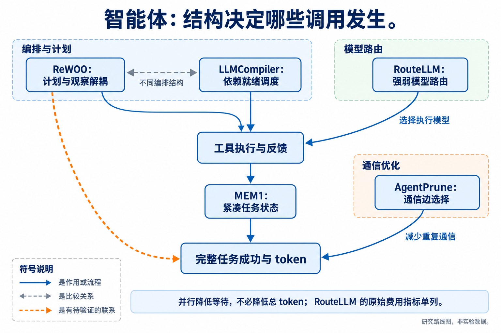
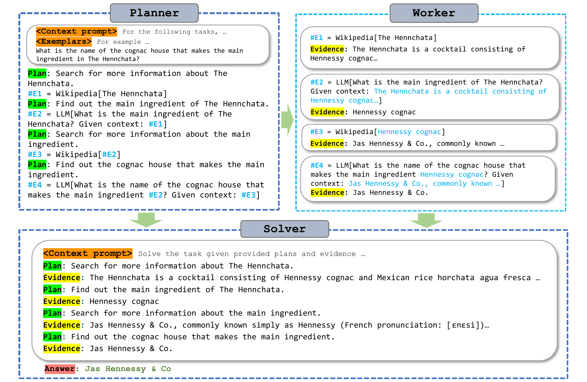
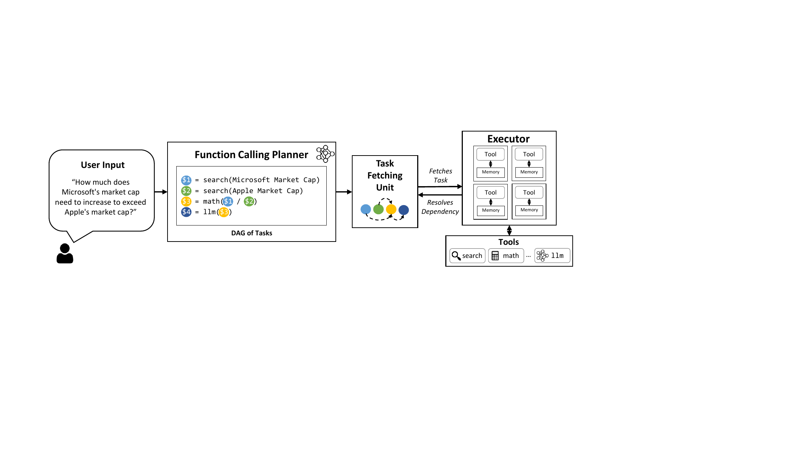
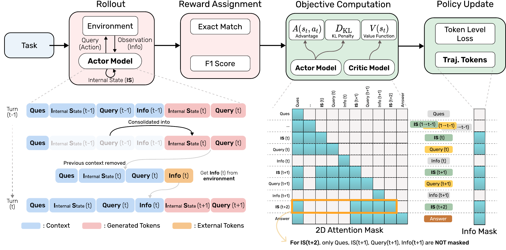
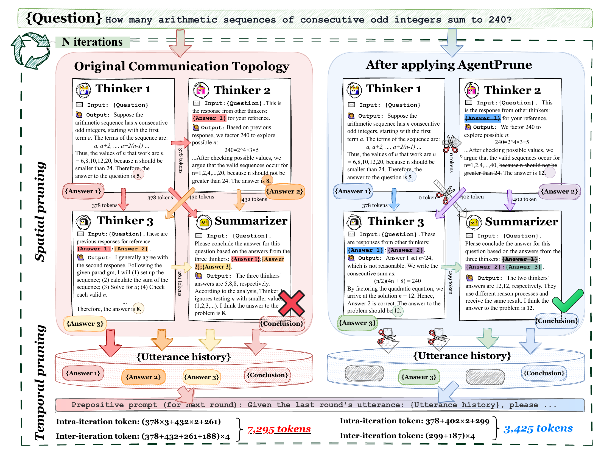
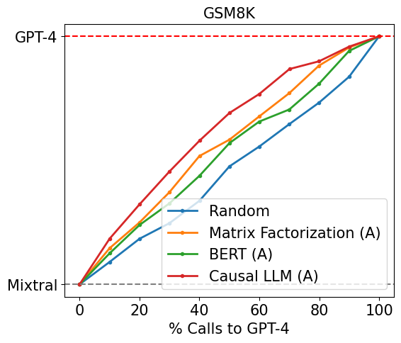

# 08 Harness、智能体与工具：决定哪些调用有必要发生

[上一章：上下文与记忆](../07-context/index.md) · [总论](../00-overview.md) · [下一章：多模态](../09-multimodal/index.md)

Harness 决定模型如何接收任务、调用工具、保存状态、处理错误以及结束。即使模型参数不变，编排也能显著改变重复读入、无效调用和通信量。本章将执行结构、状态压缩、通信拓扑和模型选择分开，避免把“使用更多组件”当作能力或效率的保证。

## 本章地图：从一次回答扩展到完整轨迹



本图由主代理综合正文关系后使用 GPT-Image 生成；连线表示文中说明的流程、比较或待验证联系，不表示统一性能排名。

| 路线 | 代表方法 | 控制的对象 |
|---|---|---|
| 解耦规划与观察 | ReWOO | 减少每个工具步骤都由模型重读历史、重新规划 |
| 显式依赖和流式调度 | LLMCompiler | 使可并行工具尽早执行，必要时重新规划 |
| 学习紧凑任务状态 | MEM1 | 让模型保留对后续行动有用的信息，丢弃不必要历史 |
| 稀疏通信 | AgentPrune | 决定哪些角色和轮次之间传递消息 |
| 模型路由 | RouteLLM | 在请求开始时选择强弱模型，原目标主要是质量—费用 |

工具能力也可通过[ReTool等后训练](../05-posttraining/index.md)学习，运行时的编排仍需单独设计。GUI、网页和代码任务的工具返回量、不可逆状态及验证方式不同，不能共用一份不加说明的成本曲线。

## ReWOO：先生成带依赖的计划，再集中使用观察

传统逐步思考—行动循环在每次工具返回后都让模型处理一次增长中的上下文。ReWOO 将过程分为 Planner、Workers 和 Solver：Planner 先写出带证据变量的计划，Workers 执行工具并替换变量，Solver 最后结合观察产生答案。[原论文](https://arxiv.org/abs/2305.18323)

一个教学计划可以是：

```text
#E1 = 查询城市A的人口
#E2 = 查询城市B的人口
#E3 = 计算 #E1 + #E2
Solver: 根据 #E1、#E2、#E3 形成带来源的回答
```

前两个查询相互独立，第三个依赖前两个。Planner 不需要在每条观察之后重新写出同样任务背景，Solver 也能一次读取整理后的证据。证据变量不是已验证的真实值，Workers 仍必须处理格式、异常和依赖顺序。

用 $`I_k,O_k`$ 表示每次模型调用的实际输入和输出，则两个系统都应计算 $`C=\sum_k(I_k+O_k)`$。ReWOO 的节省来自减少重复条件化及部分模型调用，不来自把工具输出从账上删掉。若计划失败后必须反复补规划，优势可能减小。



[查看原图，可放大](../../assets/papers/2305.18323/figure1-workflow.pdf) · [论文来源](https://arxiv.org/e-print/2305.18323)

作者流程图中的证据变量把计划与观察解耦，Solver 负责最终整合。原文在知识问答等任务报告效率和表现，并研究工具故障与较小Planner；开放交互探索环境则暴露预先计划的限制。需要边观察边改变任务结构的场景，不宜直接套用静态计划假设。[精读](reference/2305.18323.md)

## LLMCompiler：依赖关系同时影响等待和重复控制流

LLMCompiler 把工具调用组织成依赖图。Planner 可流式产生任务，Task Fetching Unit 找到依赖已满足的任务，Executor 执行工具；动态任务还可结合结果再次规划。[原论文](https://arxiv.org/abs/2312.04511)

```python
# 教学用依赖就绪判断，省略工具执行、异常与重规划。
deps = {"A": set(), "B": set(), "C": {"A", "B"}}
completed = {"A"}
ready = [task for task, required in deps.items()
         if task not in completed and required <= completed]
# B 已就绪，C 还需要等待B；不能为了并行忽略依赖。
```

这里有两种不同收益：并行独立工具缩短等待时间，程序承担确定性调度则可能减少模型反复输出控制步骤。前一种收益即使 token 数完全不变也能出现，因此延迟与 token 必须分别报告。



[查看原图，可放大](../../assets/papers/2312.04511/fig-overview.pdf) · [论文来源](https://arxiv.org/html/2312.04511v3)

原文的 ParallelQA、Game of 24 和 WebShop 分别检验静态并行、求解和动态执行。不同表中的 ReAct 与 ReAct† 配置并不完全相同，不能把一个表的延迟和另一个表的 token 合成同条件点。图调度也不保证计划语义正确；任务缺失、错误依赖和工具失败仍需要处理。[精读：比较条件和原表问题](reference/2312.04511.md)

ReWOO 与 LLMCompiler 都减少让模型承担重复控制流，但关注点不同：前者解耦规划和观察，后者显式表达依赖并调度执行。是否可以组合，应由实际接口和动态任务证据判断，不能因发表先后画成单向性能升级。

## MEM1：学习一个足够用的状态，而不是保存全部历史

MEM1 联合训练记忆与推理，让模型把历史压成对后续行动有用的内部状态，再根据新观察更新。这里的状态是模型生成的紧凑表示/文本过程，不等同于[连续latent推理](../04-architecture/index.md)中的向量接口。[原论文](https://arxiv.org/abs/2506.15841)

用 $`m_t`$ 表示保留状态，$`o_t`$ 表示新观察，可将行为概括为：

```math
m_{t+1}=f_\theta(m_t,o_t),\qquad
a_{t+1}\sim\pi_\theta(\cdot\mid m_{t+1}).
```

这个写法不保证 $`m_t`$ 是任务的充分统计量；被丢掉的信息可能在后面重新变得必要。方法需要通过任务训练，让保留与遗忘服务于最终成功，而不只是让摘要看起来简短。

例如，三轮任务先确定目标文件，再发现测试失败，最后修复。有效状态应保留目标、已确认的约束和失败原因，而不必重复大段终端输出；若把关键报错或已尝试的修复也删掉，后续可能循环试错。训练轨迹、注意力mask及RL奖励共同影响模型怎样形成这种状态。



[查看原图，可放大](../../assets/papers/2506.15841/fig-mem1-mechanism.pdf) · [论文来源](https://arxiv.org/abs/2506.15841v2)

原文的QA、WebShop、迁移以及RL/SFT对照说明联合学习的作用，并包含训练失败和格式奖励的分析。“状态长度有界”只有在历史增长时仍保留任务所需信息才有意义，不能从固定窗口直接得出可无限延长任务的结论。[精读](reference/2506.15841.md)

## AgentPrune：通信边也应有任务价值

AgentPrune 将多智能体的空间通信和跨轮时间连接表示为图，对连接mask进行学习与剪枝。它研究的是哪些消息路径有必要保留，而不只是把每条消息写短。[原论文](https://arxiv.org/abs/2410.02506)

可用采样图 $`G\sim p_\phi(G)`$ 和任务奖励 $`R(G)`$ 理解这类优化。在有限支持且可微等条件下，score-function 形式为：

```math
\nabla_\phi\mathbb E_{G\sim p_\phi}R(G)
=\mathbb E[R(G)\nabla_\phi\log p_\phi(G)].
```

它解释了为什么即使任务得分不能直接对图结构反向传播，仍可以学习连接概率。原方法还涉及空间/时间mask、DAG采样和低秩正则，不能把上式当作其全部算法或忽略剪枝后的结构约束。



[查看原图，可放大](../../assets/papers/2410.02506/figure-4-framework.pdf) · [论文来源](https://arxiv.org/abs/2410.02506v1)

假设一个代理生成100 token消息，两个接收者各读一次，相关成本包含一次输出和两次输入。去掉一条接收边能减少一次读入，但不一定消除发送者生成消息的成本。实际系统还可能因图改变而生成不同内容，因此输入与输出应分别统计。

原文在多种任务和通信图上比较剪枝比例、性能及输入输出，并有敏感性和退化结果。部分原表百分比与原始数字有算术差异，精读中单独列明。研究新多体方案还需要强单体和同预算独立采样对照，避免只证明比一个很冗长的讨论基线更便宜。[精读](reference/2410.02506.md)

## RouteLLM：费用路由是邻近问题，不能直接换成 token 结论

RouteLLM 利用偏好数据学习请求是否值得交给强模型。部署门控发生在选择目标模型时，而非默认先调用弱模型再调用强模型的串行级联。以预测强模型相对收益的分数 $`s(x)`$ 和阈值 $`\tau`$ 表示：

```math
\mathrm{route}(x)=
\begin{cases}\text{strong},&s(x)>\tau,\\
\text{weak},&\text{otherwise}.
\end{cases}
```

阈值改变强模型调用比例。偏好分数并不自动等于答案正确概率，也不直接预测该请求会生成多少 token；模型价格、输入长度和输出行为都会影响费用。[原论文](https://arxiv.org/abs/2406.18665v4)



[查看原图，可放大](../../assets/papers/2406.18665/main-part-1.png) · [论文来源](https://arxiv.org/abs/2406.18665v4)


[查看原图，可放大](../../assets/papers/2406.18665/main-part-2.png) · [论文来源](https://arxiv.org/abs/2406.18665v4)


[查看原图，可放大](../../assets/papers/2406.18665/main-part-3.png) · [论文来源](https://arxiv.org/abs/2406.18665v4)

原文比较多种router、数据增强和跨模型迁移，核心成本指标主要是强模型调用比例与价格估算。缺少逐请求完整 input/output/hidden token 测量，因此不能将费用节省倍率写成 token 节省倍率。把路由目标改为性能—实际token，本身仍需要新的预算预测、训练目标和评测。[精读](reference/2406.18665.md)

## 认识与行动入口

已有方法说明任务结构会制造重复控制、历史重读和通信冗余；把确定性步骤交给程序、学习紧凑状态、控制通信边，都有具体路线。仍不稳定的是这些机制在开放动态任务上的净收益：异常恢复、丢失状态、错误共识和验证开销可能抵消节省。

小团队可选择一个可重置的短工具环境，固定模型与判分，分别改变编排、记忆或通信中的一项。至少记录完整调用树、失败、重试、工具观察、最终环境状态和实际token，确保“完成”来自环境验证。新方法应说明相比ReWOO/LLMCompiler、简单遮蔽、MEM1或强单体究竟增加了什么机制，并预先给出什么结果会推翻其收益假设。
