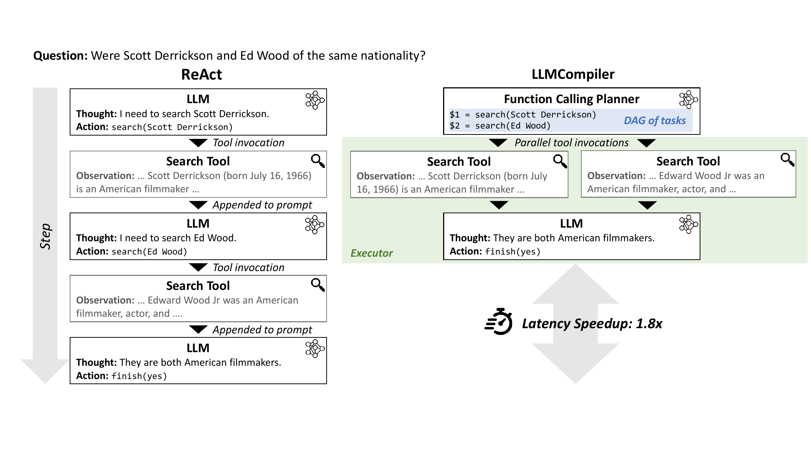
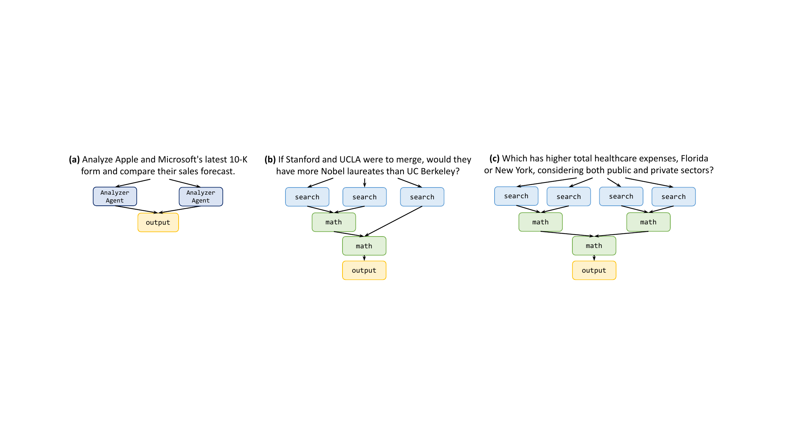
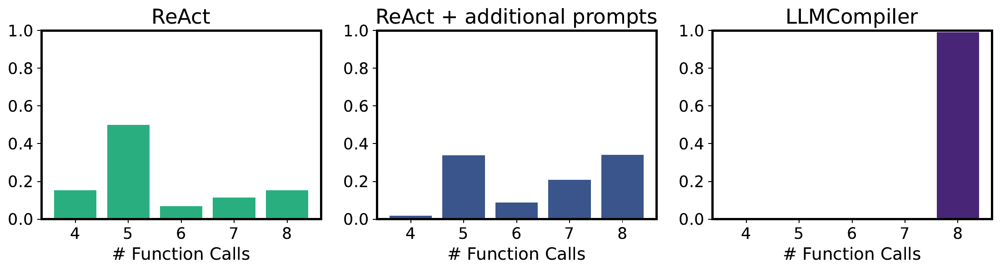
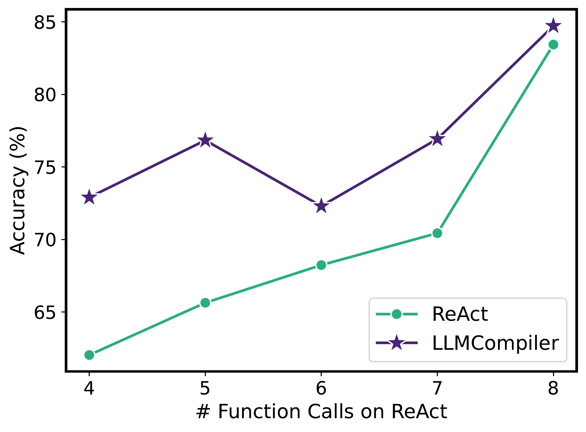
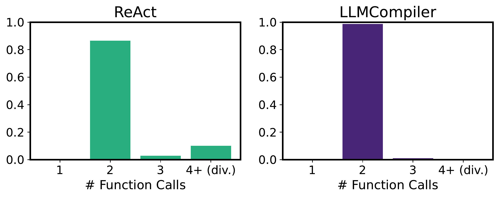
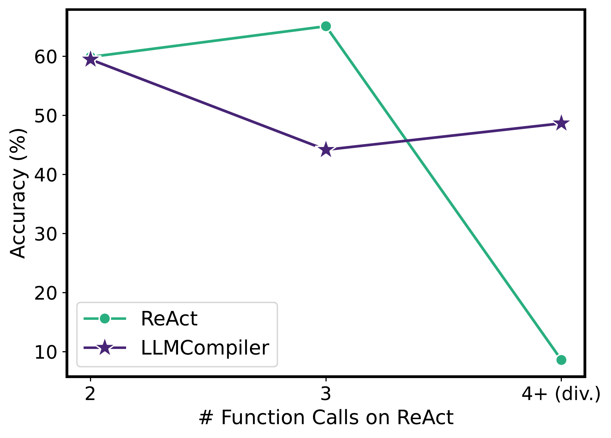
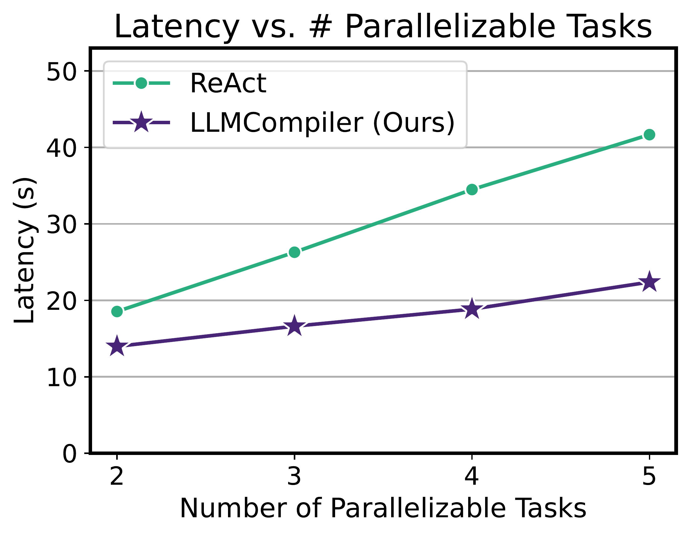
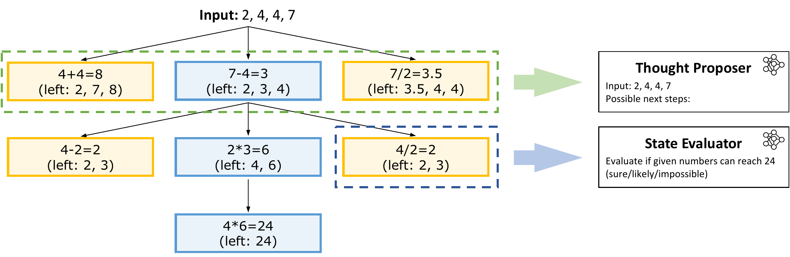

# An LLM Compiler for Parallel Function Calling：正文级精读

[所属章节](../index.md) · [来源与阅读状态](../../../sources/papers.json)


**作者**：Sehoon Kim、Suhong Moon、Ryan Tabrizi、Nicholas Lee、Michael W. Mahoney、Kurt Keutzer、Amir Gholami（前两位作者并列第一） <br>
**年份与版本**：ICML 2024；固定阅读版本 arXiv:2312.04511v3（2024-06-05 online，论文页脚标注 PMLR 235，2024） <br>
**原始链接**：[arXiv HTML v3](https://arxiv.org/html/2312.04511v3)、[论文 PDF](https://arxiv.org/pdf/2312.04511v3)、[作者实现](https://github.com/SqueezeAILab/LLMCompiler) <br>
**实际阅读范围**：固定版本正文第 1–9 页（摘要、引言、相关工作、方法、第 5 节实验、结论）以及为解释正文实验和方法边界而补读的附录 A、B、D、E、F、G、H、I、J、K；源文件为 `source/paper.pdf`、`source/tex/`，未把附录证明或全部相关工作当作正文结论。

## 这篇论文解决什么问题

LLM 调用搜索、计算器、API 或另一个专用 LLM 时，困难不只是“模型会不会调用工具”，还在于多个调用之间怎样排顺序。ReAct 的典型循环是：模型想一步、调用一个工具、把观察结果追加回提示词，再想下一步。若两个搜索互不依赖，这种串行循环会把本可同时发生的等待叠加起来；每一步重新读写提示词也增加输入 token、输出 token 和出错机会。论文提出 LLMCompiler，把用户问题先编译成带依赖的任务图，再由程序调度就绪任务并行执行，最后汇总结果。

这里的“compiler”是编排器而不是训练一个新的基础模型。它把模型的推理能力用于生成任务和依赖，把确定性的排队、变量替换和并发交给系统组件。作者报告的上限是：延迟最高约 $`3.7\times`$ 加速、估计成本最高约 $`6.7\times`$ 降低、准确率最高约提升 9%，但这些数字来自不同任务、模型和表格，不能拼成一个统一的成本—质量点。

论文的背景关系可以这样理解：Skeleton-of-Thought 能并行没有依赖的段落，却不能表达任务依赖；OpenAI 1106 版本的并行函数调用能同时生成若干调用，但主要规划当前一层，且依赖专有模型；ReWOO 把规划与执行观察分开以省 token，但论文强调它不提供同样的并行函数调用和动态重规划。LLMCompiler 的目标组合是：静态依赖图、就绪任务并行、必要时根据中间结果重新规划，并让这些能力适用于 GPT 和 LLaMA-2。

## 从输入到输出：三组件和一个反馈回路

### 1. Function Calling Planner：让 LLM 产生带占位符的 DAG

Planner 接收自然语言问题、工具定义和可选的 in-context 规划示例，输出任务序列及其依赖关系。每个任务可以看作一个节点，每条“某任务的输出是另一任务的参数”的关系是一条有向边。图在静态规划时是 DAG，节点参数中用 `$1`、`$2` 等占位符表示尚未得到的输出。Planner 不只是列出工具调用，还要决定调用参数和哪些节点可以并行。

以论文 Fig. 2 的问题“微软市值增加多少才能超过苹果市值”为例，规划可写成：

```text
$1 = search("Microsoft market cap")
$2 = search("Apple market cap")
$3 = math($1 / $2)
$4 = llm($3)
```

节点 `$1` 和 `$2` 没有共同前置条件，可以同时执行；`$3` 必须等两者完成并把实际搜索结果替换进参数；`$4` 再解释计算结果。这里的除法表达是论文示意图中的教学化任务链；实际工具返回的是文本，math 工具负责把它解释成可计算表达式。Planner 的提示词规定输出语法和依赖表达，工具说明必须包含名称、描述和参数规格，示例可帮助模型学习某类问题应该如何连边。论文没有把 Planner 训练成专门模型，也没有给出静态 DAG 正确率的独立标准；Planner 失败在 ParallelQA 失败分析中占 LLMCompiler 总失败的 8%。

### 2. Task Fetching Unit：只把已就绪的任务送进执行器

Task Fetching Unit（TFU）像处理器的 instruction fetching unit：维护队列，根据贪心策略寻找所有前置结果已到达的任务，并把它们发给 Executor。它还将节点参数里的 `$1`、`$2` 替换成上游真实输出，再检查下游是否因此解除阻塞。这个工作不需要再次调用 LLM，理论上是轻量的取指、替换和排队。

“贪心”意味着只要节点现在独立且就绪就立即发出，并不求解一个全局最优调度问题。若某节点没有完成全部前置任务，就不能发出；所以并行来自图的独立性，而不是简单地把任意多个工具请求同时提交。

### 3. Executor：并发执行任务并隔离中间记忆

Executor 异步接收 TFU 已保证互相独立的节点，并调用对应工具。工具可以是 Wikipedia 搜索、计算器、API，也可以是针对某子任务的 LLM agent。每个任务有自己的中间记忆；任务完成后，结果被转给依赖它的节点，而不是像 ReAct 那样把所有观察都无差别地追加到同一个全局 scratchpad。这样既能让不同任务并行，也能为下游提供相关上下文。

### 4. Dynamic Replanning：运行时重新编译依赖图

有些图在一开始无法确定。例如 Game of 24 中，下一轮要用哪些数字取决于当前候选状态的评估；把所有未来分支一次性静态展开既浪费又不准确。LLMCompiler 允许 Executor 把中间结果反馈给 Planner，Planner 生成新一轮任务及依赖，再交给 TFU 和 Executor。这个周期持续到得到最终答案。它类似编程语言遇到运行时分支后的重新编译，而非为所有可能分支写一棵静态树。

## 流式规划：隐藏 Planner 的一部分等待

若 Planner 必须完整生成整张图，TFU 和 Executor 会在 Planner 输出期间空等。论文因此允许 Planner 异步流式输出依赖图：一旦某个任务及其依赖已经形成，TFU 就可以接收并执行；Planner 继续生成后续节点。对独立任务，先产生的节点可和 Planner 后续生成重叠；在依赖链中，节点仍需等待上游完成。

论文附录给出三项端到端比较（Table C.1）：HotpotQA 无流式 4.00 s、有流式 3.95 s，$`1.01\times`$；Movie Recommendation 为 5.64→5.47 s，$`1.03\times`$；ParallelQA 为 21.72→16.69 s，$`1.30\times`$。作者将最大收益归因于 ParallelQA 的 math 工具执行时间较长，能够隐藏 Planner 生成后续任务的时间；HotpotQA 和 Movie Recommendation 的 search 较短，隐藏空间较小。流式是调度优化，不改变任务图语义。

## 一个小型依赖图算例

假设要回答“佛罗里达和纽约哪一州的公共加私人医疗支出总额更高？”。论文 Fig. 3(c) 的图式可以抽象为：

```text
F_public  = search("Florida public healthcare expense") ─┐
F_private = search("Florida private healthcare expense") ─┼→ F_sum = math(F_public + F_private) ─┐
N_public  = search("New York public healthcare expense") ─┐                                      │
N_private = search("New York private healthcare expense") ─┼→ N_sum = math(N_public + N_private) ─┤→ answer = math/llm(compare F_sum,N_sum)
```

第一层四个 search 节点可以并行。每州的 sum 节点要等本州两个结果；最终比较要等两个 sum。若 Florida 的两个结果先到，TFU 立即替换占位符并发出 `F_sum`，无需等待 New York；但最终答案仍需等待两州汇总。这个算例说明并行度随拓扑层变化：第一层宽度为 4，中间层最多 2，汇合层为 1。它也说明“有依赖”不等于“完全串行”。

对于严格的 DAG，可用如下伪代码追踪系统行为（这是教学化重写，不是论文源码）：

```python
pending = planner_stream(user_query)     # yields (id, tool, args, parents)
done, running = {}, set()
while pending or running:
    for task in pending:
        if all(parent in done for parent in task.parents):
            task.args = substitute(task.args, done)
            running.add(dispatch_async(task))
            pending.remove(task)
    finished = await_any(running)
    for task, output in finished:
        done[task.id] = output
        running.remove(task)
    if planner_needs_feedback(done):      # dynamic case
        pending.extend(planner_replan(done))
return final_answer(done)
```

伪代码的关键约束是 `parents` 完成后才替换并 dispatch；`await_any` 允许先完成的节点先解锁后继。动态重规划时，不能把 `planner_replan` 误解成每个节点都重新调用；它是在中间结果改变可行路径时生成下一批任务。

## 延迟模型：并行收益的条件

附录 E 对有 $`N`$ 个可并行任务的情形定义：ReAct 的总延迟近似为

```math
T_R=\sum_{i=1}^{N}\left(T_P^R(P_i)+T_E(E_i)\right),
```

其中 $`P_i`$ 是第 $`i`$ 个规划/思考输出，$`E_i`$ 是对应工具执行。LLMCompiler 将 Planner 输出相加，但并行执行只等待最慢工具：

```math
T_C=\sum_{i=1}^{N}T_P^C(P_i)+\max_{k\in\{1,\ldots,N\}}T_E(E_k).
```

因此速度比

```math
\gamma=\frac{T_R}{T_C}
```

只有在工具等待占主导且任务足够独立时才接近 $`N`$。理想上界假设执行时间主导且各任务同速，得到 $`\gamma_{\max}\approx N`$；若 Planner 时间主导，$`\gamma_{\min}\approx1`$。真实系统还受最慢任务的 straggler 影响。Movie Recommendation 中作者测得 Planner 平均约 1.88 s、最终回答约 1.62 s，合计已超过 LLMCompiler 总延迟的一半；最慢 search 平均 1.13 s，而所有 task 平均 0.61 s。因此 8-way 并行不会带来 8 倍端到端加速。

作者在 ParallelQA 按最大并行任务数分组（Fig. E.5）：ReAct 延迟随任务数近似线性增加，LLMCompiler 增长较缓但并非恒定，残余增长来自不可并行的 Planner/答案阶段。这里的横轴是可并行任务数，不能把它当作 token 数或模型规模的曲线。

## Token、成本与“省了什么”

论文直接测量的是 GPT 实验的输入 token、输出 token、端到端 latency 和按当时价格表估算的美元成本；没有报告总 FLOPs、GPU 能耗、训练成本或每个用户任务的完整 token—质量前沿。输入 token 包含反复调用带来的提示上下文，输出 token 是模型输出，工具返回文本本身怎样计价依赖其是否进入 LLM prompt；论文只给出表 2 的聚合输入/输出数。

表 2 的原始点如下，成本减少是相对同一 benchmark 的 ReAct 行：

| benchmark | 方法 | 输入 token | 输出 token | 成本（$/1k） | 相对 ReAct 成本降低 |
|---|---:|---:|---:|---:|---:|
| HotpotQA | ReAct | 2,900 | 120 | 5.00 | 1.00× |
|  | OAI Parallel Function | 2,500 | 63 | 2.66 | 1.87× |
|  | LLMCompiler | 1,300 | 80 | 1.47 | 3.37× |
| Movie Recommendation | ReAct | 20,000 | 230 | 20.46 | 1.00× |
|  | OAI Parallel Function | 5,800 | 160 | 6.14 | 3.33× |
|  | LLMCompiler | 2,800 | 115 | 3.04 | 6.73× |
| ParallelQA | ReAct | 46,000 | 470 | 480 | 1.00× |
|  | OAI Parallel Function | 25,000 | 370 | 260 | 1.81× |
|  | LLMCompiler | 9,200 | 340 | 103 | 4.65× |

这说明主要节省来自减少 LLM invocation 和重复读入提示词；Planner 的 in-context 示例只包含短计划，不包含观察结果，因此作者认为它比 OpenAI 并行函数调用的提示更短。它不是“工具执行免费”或“所有 token 都减少”：ParallelQA 的 LLMCompiler 输出 token 340 仍略低于 OAI 370，但输入 token 才是大头。成本数字只适用于作者当时 GPT 版本和价格表，不能直接外推当前 API 价格。

## 主实验一：独立任务的并行化

### 设置

HotpotQA 只取 comparison dev set，约 1.5k 个比较两个实体的问题，构成 2-way 独立搜索；Movie Recommendation 有 500 个样例，要从四部候选电影中找到与另一组四部电影最相似者，形成 8-way 独立搜索。两者使用相同 Wikipedia search 工具，不用与任务无关的 lookup tool；GPT 侧用 gpt-3.5-turbo（1106 release），并报告 OpenAI 的并行函数调用；同时用部署在两张 A100-80GB、vLLM 上的 LLaMA-2 70B 验证开源模型。除 Game of 24 的 proposer/evaluator 温度 0.7 外都为零温度；GPT 即使温度 0 仍有随机性，论文对准确率做 3 次平均。HotpotQA、Movie Recommendation、ParallelQA 分别使用 3、1、5-shot，方法间复用相同示例。

ReAct 的准确率出现循环和过早停止。表 1 因此同时列出原始 ReAct 与加入针对性提示的 `ReAct†`：后者提醒模型避免重复工具调用和提前终止。准确率/延迟比较用 ReAct† 作为延迟基线；原始 ReAct 的延迟因循环不可稳定测量。这个符号差异很关键：表 2 的 token 成本行写的是原始 ReAct，不能把表 2 的原始 ReAct token 与表 1 的 ReAct† latency 拼成一个“同条件成本—速度”结论。

### 表 1 结果（同一行内比较）

| 任务与模型 | 方法 | 准确率 | 延迟（s） | 相对 ReAct† 加速 |
|---|---|---:|---:|---:|
| HotpotQA, GPT | ReAct† | 62.47 | 7.12 | 1.00× |
|  | LLMCompiler | 62.00 | 3.95 | 1.80× |
| HotpotQA, LLaMA-2 70B | ReAct† | 54.40 | 13.44 | 1.00× |
|  | LLMCompiler | 57.83 | 9.58 | 1.40× |
| Movie Rec., GPT | ReAct† | 72.47 | 20.47 | 1.00× |
|  | LLMCompiler | 77.13 | 5.47 | 3.74× |
| Movie Rec., LLaMA-2 70B | ReAct† | 70.60 | 33.37 | 1.00× |
|  | LLMCompiler | 77.80 | 11.83 | 2.82× |

OpenAI 并行函数调用在两项 GPT 任务上分别为 HotpotQA 4.42 s、1.61×，Movie 7.42 s、2.76×；LLMCompiler 为 3.95 s、1.80×和 5.47 s、3.74×。准确率方面，HotpotQA GPT 的 LLMCompiler 62.00 略低于 ReAct† 62.47，但 Movie GPT 为 77.13 对 72.47；LLaMA-2 两项都更高。作者观察到原始 ReAct 在 Movie 约 85% 样例少于 8 次搜索就停止，而 LLMCompiler 约 99% 完成 8 次搜索；加提示后的 ReAct† 有改善但不能保证完整搜索。HotpotQA 的 LLaMA-2 ReAct 约 10% 样例重复调用超过 4 次，常导致发散，LLMCompiler 通常只执行两次搜索。附录图 A.2、A.4 进一步按 ReAct 调用次数分组，显示早停/重复调用与准确率下降的相关性；这是失败模式分析，不是关于所有任务的因果证明。

## 主实验二：有依赖的 ParallelQA

ParallelQA 是作者构造的 113 个数学事实问题，灵感来自 IfQA。每题使用 search 和 math 两个工具；math 的参数依赖 search 输出。图 3(b) 展示例如三个学校各自搜索 Nobel laureate 信息，再做加法和比较；图 3(c) 展示两州公共/私人医疗支出分别搜索、州内求和、两州比较。问题选成 Wikipedia 首段即可回答，以尽量排除搜索失败。GPT 使用 gpt-4-turbo（1106），LLaMA-2 仍为 70B；ReAct 与 LLMCompiler 共享工具和 5-shot 示例。

表 1 的 ParallelQA：GPT ReAct 89.09%、35.90 s，LLMCompiler 89.38%、16.69 s，2.15×；LLaMA-2 ReAct 59.59%、15.47 s，LLMCompiler 68.14%、26.20 s，2.27×。注意这里表格中 LLaMA 的延迟数字按论文排版对应 2.27×，读者应以原表列和版本为准，不拿 HotpotQA/Movie 的 token 成本点换算；论文正文把 LLaMA 的约 9 个百分点准确率提升与约 20% ReAct 重复调用联系起来。ParallelQA 总失败中约 10.6%（36 例）落在 LLMCompiler，失败归因是 Planner 8%、Executor 64%、最终回答过程 28%；Executor 常见是 math 选错属性或单位转换，最终回答会错误比较已收集的信息。Planner 仅 3 个实例明显出错，说明示例和工具定义有帮助，但不能把它解释为图规划已被证明可靠。

OAI Parallel Function 的成本为 260，而 LLMCompiler 为 103，对应相对 ReAct 1.81×和 4.65×；作者解释 OAI 方法需要先规划当前可并行层，再在后续层重新调用 LLM，而 LLMCompiler 可在一轮 Planner 输出中表达完整依赖图。这是调用次数和 prompt 结构上的解释，不是对 OpenAI 内部实现的实证证明；作者明确说明无法知道其额外开销来源。

## 主实验三：动态重规划的 Game of 24

Game of 24 给四个数字，要求每个数字恰好使用一次，通过基本四则运算得到 24。例如 2、4、4、7 可形成 $`4\times(7-4)\times2=24`$。Tree-of-Thoughts（ToT）每轮由 thought proposer 产生选两个数并做一步运算的候选，由 state evaluator 评估候选，再保留有希望的状态进入下一轮。ToT 的广度优先过程是串行的。

LLMCompiler 把 proposer 和 evaluator 在每轮并行执行，近似一个并行 beam search；`top_k_select` 按 evaluator 结果保留前 $`k`$ 个候选。如果这一轮没有候选达到 24，Planner 接收保留下来的状态并重新生成下一轮图。由于下一轮候选在上一轮评估后才知道，不能把整个问题编译成一个静态 DAG；论文只在每一轮内规划。评估 100 个实例，成功要求运算合法、结果为 24 且四个给定数字恰好使用一次；GPT-4（0613）和 LLaMA-2 的 proposer/evaluator 温度为 0.7，Planner 有 2 个 in-context 示例。

表 1 的 ToT 基线与 LLMCompiler：GPT 成功率 74.00→75.33%，延迟 241.2→83.6 s，2.89×；LLaMA-2 30.00→32.00%，952.06→456.02 s，2.09×。论文结论是并行减少等待且没有牺牲成功率；这里对比的是 ToT 基线，不应和 HotpotQA 的 ReAct† 速度点混合。

## 主实验四：WebShop 中的互动决策

WebShop 要求代理在语言环境中搜索商品并购买最符合指令的物品，候选和属性多，适合比较“多探索提高信息量”与“串行探索延迟”的权衡。实验用 500 条指令，指标是 success rate、average score、latency。LLMCompiler 的 `search` 返回通常十个商品，`explore` 并行点入这些商品取得价格、属性和特征，随后模型根据收集信息购买。基线是 ReAct、LATS 和 LASER；表 3 中 LATS/LASER 的部分结果来自论文原文，ReAct 结果由作者复现。

| 模型 | 方法 | 成功率 | 平均分 | 延迟（s） | N |
|---|---|---:|---:|---:|---:|
| gpt-3.5-turbo | ReAct | 19.8 | 54.2 | 5.98 | 500 |
|  | LATS | 38.0 | 75.9 | 1066 | 50 |
|  | LLMCompiler | 44.0 | 72.8 | 10.72 | 50 |
|  | LLMCompiler | 48.2 | 74.2 | 10.48 | 500 |
| gpt-4-0613 | ReAct | 35.2 | 58.8 | 19.90 | 500 |
|  | LASER | 50.0 | 75.6 | 72.16 | 500 |
|  | LLMCompiler | 55.6 | 77.1 | 26.73 | 500 |

按作者报告，gpt-3.5 的 LLMCompiler 成功率比 ReAct 高 28.4 个百分点、比 LATS 高 6 个百分点；gpt-4 比 ReAct 高 20.4 个百分点、比 LASER 高 5.6 个百分点；延迟相对 LATS 为 101.7×、相对 LASER 为 2.69×。但 LLMCompiler 在该环境略慢于 ReAct（gpt-3.5 的 10.48/10.72 s 对 5.98 s，gpt-4 的 26.73 s 对 19.90 s），Planner 开销造成轻微延迟；N 还不完全一致，gpt-3.5 的 LATS/LLMCompiler 小规模行是 50，不能当作 500 例的同条件排名。

作者的机制解释是 ReAct 经常在信息不完整时过早决定，LLMCompiler 则查看 search 返回的十个商品，因此成功率提高；LATS 探索最多约 30 条轨迹，信息更多但非常慢。LLMCompiler gpt-4 平均分 77.1，高于 LASER 75.6；gpt-3.5 小规模平均分 72.8±4.01，与 LATS 75.9 的差异落在标准差范围内。这里的主要收益是探索并行化和搜索覆盖，不是 token 表中的直接测量：WebShop 表 3 没有报告输入/输出 token 或美元成本。

## 图片与读图

 对应作者 Fig. 1，资产 [`assets/teaser_fix.pdf`](../../../assets/papers/2312.04511/fig-teaser.pdf)。左侧 ReAct 为 search Scott Derrickson→把观察重新放回 LLM→search Ed Wood→回答，右侧 Planner 一次生成两项 search，Executor 并行后回答；示例报告 1.8× HotpotQA latency speedup。读图时应注意这只是 2-way 说明图，不能代表所有任务的并行宽度。

 对应作者 Fig. 2，资产 [`assets/overview_fix.pdf`](../../../assets/papers/2312.04511/fig-overview.pdf)。图中 `$1/$2` 是并行搜索，`$3` 是依赖两者的 math，`$4` 是最终 LLM；TFU 的队列和 dependency resolution 把占位符替换为真实结果。这张图是理解三组件信息流的主证据。

 对应作者 Fig. 3，资产 [`assets/dependencies_new_3.pdf`](../../../assets/papers/2312.04511/fig-dependency-patterns.pdf)。图 (a) 是各自独立的 analyzer；(b) 是多个搜索→数学汇总→比较；(c) 是两组州级搜索→州内求和→比较。它把“并行宽度”和“依赖深度”放在同一张图里，支撑 HotpotQA/Movie 与 ParallelQA 的实验分类。

、、、 分别对应附录 Fig. A.1–A.4，资产是 `movie_dist.pdf`、`movie_acc.pdf`、`hotpot_dist.pdf`、`hotpot_acc.pdf`。它们不是新的主 benchmark，而是解释 ReAct† 为什么必要：Movie 约 85% ReAct 样例提前结束，LLMCompiler 约 99% 完成 8 次搜索；HotpotQA LLaMA ReAct 约 10% 超过 4 次重复调用。作者还指出某些三次调用的 ReAct 例子通过替代实体名搜索能成功，这是 ReAct 适应性的少量反例（少于 3%），不应省略。

 对应附录 Fig. E.5，资产 [`assets/custom.pdf`](../../../assets/papers/2312.04511/fig-parallelqa-scaling.pdf)，给出 ParallelQA 按最大并行任务数分组的延迟，展示 ReAct 近似线性增长和 LLMCompiler 较缓增长。 对应附录 Fig. J.6，资产 [`assets/tot.pdf`](../../../assets/papers/2312.04511/fig-tot.pdf)，展示 Game of 24 的 ToT 搜索树：节点是候选状态，边是单步运算，评估后保留 top-5；它帮助理解为何每轮需要动态重规划。

所有资产来自固定 v3 LaTeX 工程 `source/tex/figs/`，未裁剪、未改编。源清单给出 arXiv 非独占分发许可：[http://arxiv.org/licenses/nonexclusive-distrib/1.0/](http://arxiv.org/licenses/nonexclusive-distrib/1.0/)。复用应保留作者、论文标题、图号和 arXiv 链接；这些是作者原图，不是本项目自绘研究地图。

## 与推理时 token 效率的关系

LLMCompiler 的 token 效率来自控制流压缩：ReAct 每次工具调用都重新让模型解释观察，导致相同的任务上下文和已知控制流反复进入 prompt；Planner 一次性写出更多可确定的依赖，TFU/Executor 用程序完成等待、变量替换和并行，从而减少 LLM invocation。表 2 的输入 token 下降（HotpotQA 2,900→1,300；Movie 20,000→2,800；ParallelQA 46,000→9,200）是这一机制的直接证据，但它只覆盖 GPT 的三类任务，且成本按历史价格计算。并行本身首先节省 wall-clock latency；如果多个工具调用仍需向模型传回长观察，token 不必然按并行度下降。动态重规划则在“不知道未来分支”时重新支付 Planner token，以换取可行性和更短的执行等待。

对研究“推理时 token 效率”的启示是：应把模型思考 token、工具观察 token、编排器 prompt token 和工具/执行延迟分开记录。LLMCompiler 论文报告输入/输出 token和估计美元成本，却没有拆出每轮 Planner、最终回答、工具观察的完整账本，也没有 WebShop 的 token 结果；因此只能确认在其 GPT benchmark 上调用频率减少，不能宣称对所有 agent workload 都省 token。更宽的 DAG 也可能扩大一次 Planner 输出，任务失败或错误依赖会带来重规划成本。

## 局限、失败与可继续研究的问题

第一，Planner 是新的错误面。ParallelQA 中错误包括把错误的 identifier 接到下游参数，形成错误 DAG；作者认为工具定义和示例能把 Planner 错误降到 3 个实例，但没有给出跨模型、跨工具规模的系统可靠性曲线。第二，Executor 和最终回答仍会犯 math 属性、单位转换和比较错误，ParallelQA 失败分解中它们占多数；并行并不能修复工具本身或答案模型的语义错误。第三，端到端加速受 Planner、最终回答、straggler 和图中最长依赖链限制，低任务执行延迟时加速可接近 1。

第四，ReAct† 只是作者为公平测延迟加的额外提示，不是原始 ReAct；表 1 的准确率和 latency 基线、表 2 的原始 ReAct token 必须分开读。第五，不同表使用不同 GPT 版本、模型和任务，WebShop 的 LASER/LATS 数字还部分来自外部论文；不能跨表计算统一收益。第六，论文没有测量 GPU FLOPs、能耗、当前价格下的美元成本、失败重规划 token 或服务并发资源争用。最后，静态图适合可预见依赖，动态任务仍要逐轮回 Planner；如何用可靠的 schema 校验、确定性调度和预算感知重规划降低图错误，是自然的后续问题。

从研究设计角度，值得继续比较：在固定任务集合上，把原始 ReAct、ReAct†、一次性 DAG、流式 DAG 和动态重规划分别记录为同一份事件日志；同时报告成功率、输入/输出/观察 token、Planner 次数、重规划次数、工具等待和 p50/p95 latency。只有这样才能判断某个并行收益来自减少模型调用、减少上下文，还是单纯改变了探索量。
