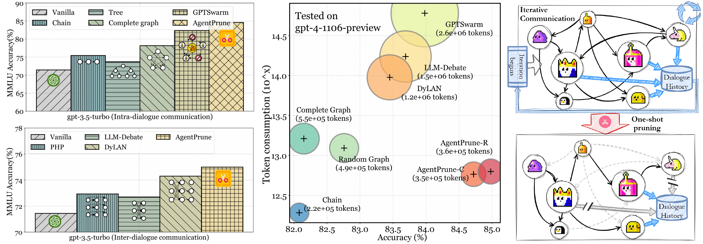
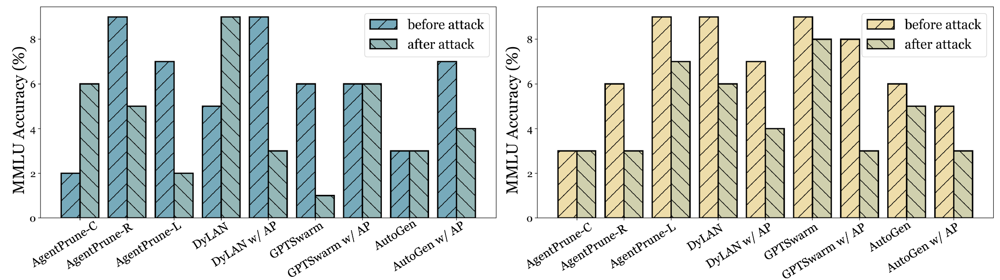
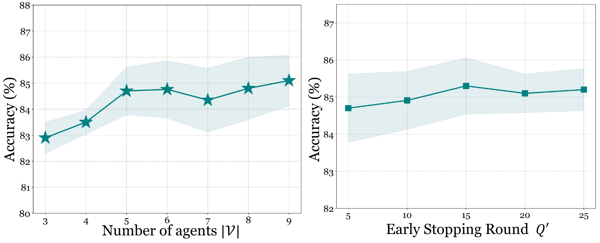
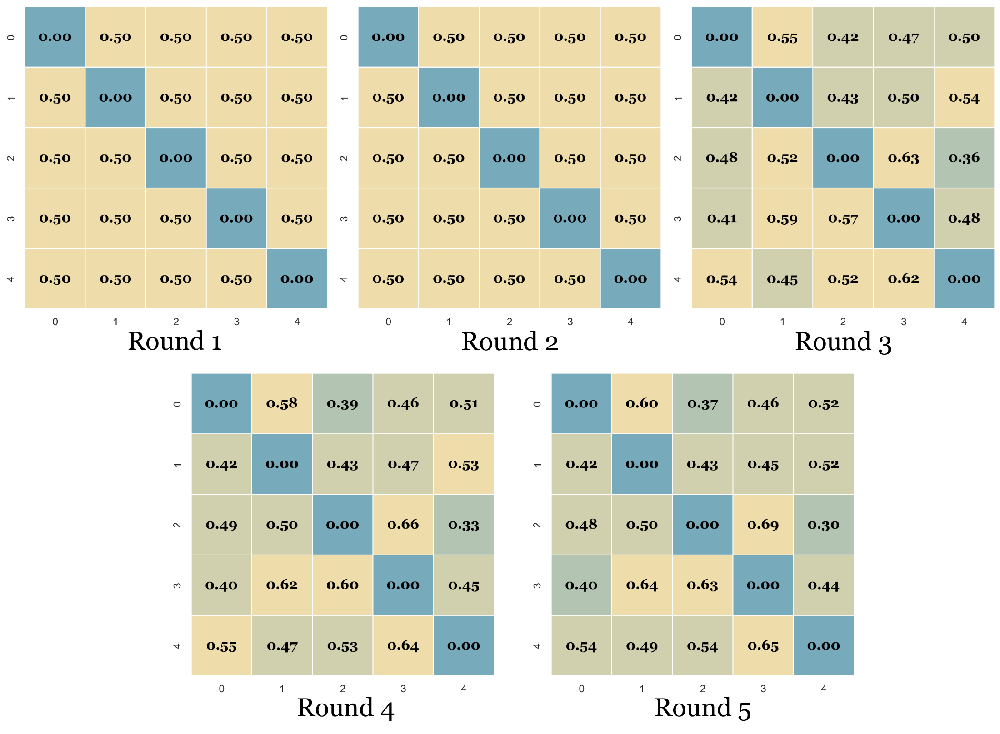
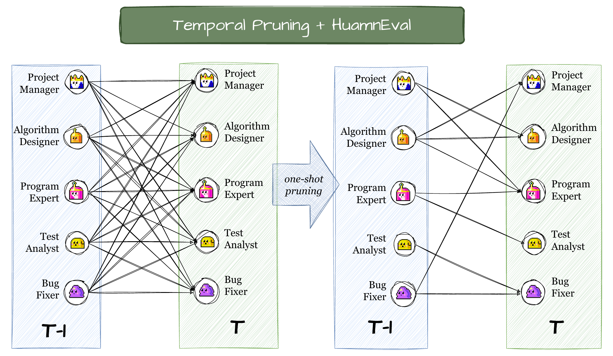
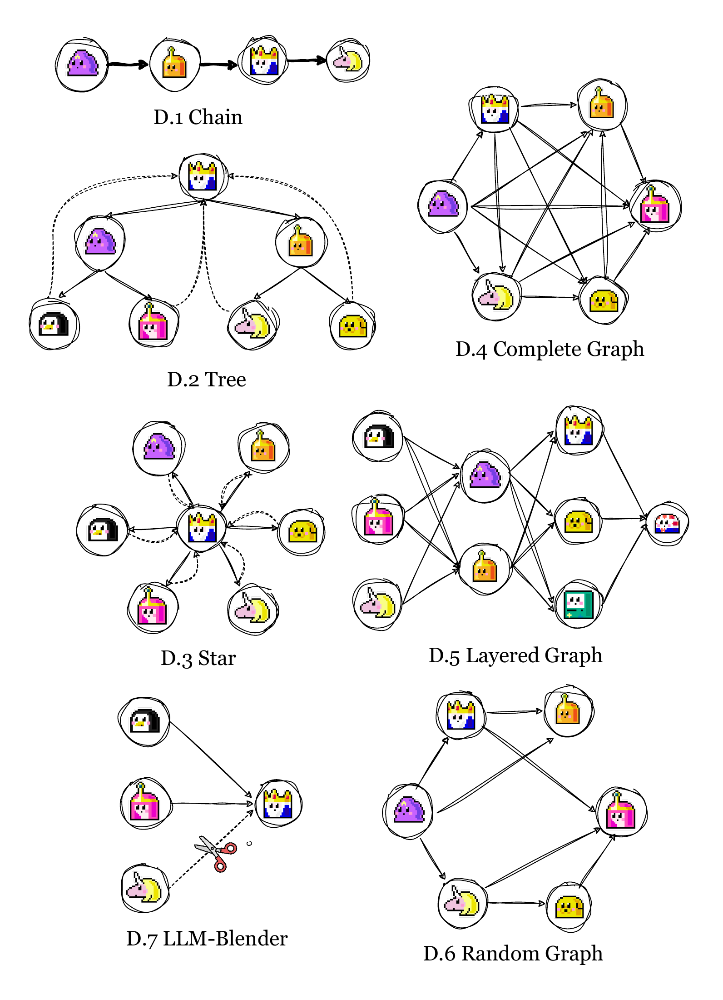

# AgentPrune：Cut the Crap: An Economical Communication Pipeline for LLM-based Multi-Agent Systems

[所属章节](../index.md) · [来源与阅读状态](../../../sources/papers.json)


作者：Guibin Zhang、Yanwei Yue、Zhixun Li、Sukwon Yun、Guancheng Wan、Kun Wang（通讯作者）、Dawei Cheng、Jeffrey Xu Yu、Tianlong Chen；2024。固定版本：arXiv:2410.02506v1（2024-10-03）。原文：[arXiv 摘要与论文](https://arxiv.org/abs/2410.02506v1)，代码链接为论文给出的 [AgentPrune GitHub](https://github.com/yanweiyue/AgentPrune)。

实际阅读范围：固定缓存的 `paper.pdf`、`paper.txt` 与 TeX 正文第 1–10 页、附录 A–I（第 16–37 页）及随源工程提供的图资产；正文主实验、算法和附录中的基线、攻击、消融、敏感性、图例均已读。本文是正文级精读，附录只在解释实验条件、算法细节和正文结论所需处补读。

## 1. 问题、动机与论文主张

LLM 多智能体系统（LLM-MA）以多个 LLM agent 的协作换取集体智能，但协作的每条消息都会进入后续 agent 的上下文，因而产生 prompt token、completion token 和 API 费用。论文先区分两种通信：同一轮内部 agent 之间交换消息的 **intra-dialogue/spatial communication**，以及上一轮到下一轮传递历史消息的 **inter-dialogue/temporal communication**。典型例子分别是完整图、链/树/GPTSwarm，以及 LLM-Debate 的“下一轮接收上一轮所有回答”。

论文的经验观察是：通信边并非都产生有用信息。MMLU 上用四个 gpt-3.5-turbo agent，在 mesh（空间）和 LLM-Debate（时间）中随机删掉 10%–30% 的边，准确率反而最多提高 2.83%（正文 Figure 3）；这只能证明存在冗余边，不能证明任意删边都安全。论文将目标写成：寻找子图 $`G_{sub}`$，使其效用不低于原图，同时通信边尽可能少。



**图 2 读图。** 左图对比单个 gpt-3.5 与三个 agent 的多种空间/时间拓扑，说明协作的准确率收益；中图比较 prompt token，复杂拓扑相对 chain 可放大约 $`2`$–$`11.8\times`$；右图是 AgentPrune 总览。图中是定性/单点比较，没有给出一条完整的任务质量–成本前沿；应把“高性能且更省通信”理解为这些设置下的结果，而不是普遍胜过强单体模型。

论文的三项主张是：

1. 用空间–时间通信图形式化冗余通信；
2. 用可训练图 mask 加低秩正则，短暂优化后一次性剪枝，得到固定稀疏拓扑；
3. 在六个 benchmark 上，性能接近或超过若干通信基线，降低 token/费用，并对两种 agent 攻击有一定鲁棒性。

## 2. 空间–时间图建模

整个系统表示成 $`G=(V,E)=\{G^S,G^T\}`$。节点不是只有一个 LLM，而是

```math
v_i=\{Base_i,Role_i,State_i,Plugins_i\},\qquad Plugins_i=\{F_j,C_j\}_{j=1}^{P}.
```

$`Base_i`$ 是基础模型，$`Role_i`$ 是预定义职责，$`State_i`$ 是历史交互累积的状态，插件由功能 $`F_j`$ 和配置 $`C_j`$ 组成（如搜索、Python 编译器）。空间边 $`e^S_{ij}=(M_{ij},O_{ij})`$ 表示同一 utterance 内从 $`v_i`$ 到 $`v_j`$ 的消息及操作；时间边 $`e^T_{ij}`$ 表示上一轮 $`v_i`$ 的输出是否传给下一轮 $`v_j`$。入邻居为

```math
N^T(v_i)=\{v_j:(j,i)\in E^T\},\qquad N^S(v_i)=\{v_j:(j,i)\in E^S\}.
```

空间图必须是 DAG，才能先按拓扑序执行依赖节点。第 $`t`$ 轮 agent 的输出抽象为

```math
M_i^{(t)}\sim P_\theta\!\left(M_i^{(t)}\mid q,Role_i,State_i,
\bigcup_{v_j\in N^T(v_i)}M_j^{(t-1)},
\bigcup_{v_j\in N^S(v_i)}M_{ji}^{(t)}\right).
```

经过 $`K`$ 轮后，系统用投票或 summarizer 聚合 $`a^{(K)}`$。Algorithm 1 的执行顺序是：每轮先检查终止条件；对 $`V`$ 做拓扑排序；收集时间邻居和空间邻居消息；生成各 agent 的 rationale/answer；聚合全部输出。这里的“token”是 API 输入/输出文本 token，边数本身不是 token；隐藏推理、模型内部 FLOPs 和失败请求没有单独测量。

**通信冗余定义。** 论文定义若存在 $`G_{sub}=(V,E'\cup E'')\subseteq G`$，其中 $`E'\subseteq E^S,E''\subseteq E^T`$，且 $`\phi(G_{sub})\geq\phi(G)`$，则被去掉的 $`(E^S\setminus E')\cup(E^T\setminus E'')`$ 是冗余。优化目标（式 6）为在 $`|\phi(G_{sub})-\phi(G)|\leq\epsilon`$ 的性能容差内最大化删边。这是定义层面的性能保证目标，论文实验用采样/评估近似，并没有给出对任意任务的定理保证。

## 3. AgentPrune 方法

### 3.1 连续 graph mask 与 DAG

给定原始二值邻接矩阵 $`A^S,A^T\in\{0,1\}^{|V|\times|V|}`$，分别引入可微 mask $`S^S,S^T\in\mathbb R^{|V|\times|V|}`$：

```math
A(G)=\{A^S,A^T\},\qquad A(\widetilde G)=\{A^S\odot S^S,A^T\odot S^T\}.
```

只有原图中已有的边才可能被保留，$`A_{ij}=0`$ 的位置会被乘成零。空间连续图经 `DAGSampling` 处理：复制空间图，若检测到环则 DFS 找一个环，随机删掉环上一条边，直到无环；再按拓扑序运行。这个随机删环过程会改变候选空间边，且论文没有说明固定随机种子或提供方差报告。

### 3.2 可学习权重、目标与优化

作者把 mask 的幅度当作边的重要性，但不直接把输出质量反传到不可微的 benchmark。式 (8) 的目标是效用最大化减去空间与时间 mask 的 rank：

```math
\max_{S^S,S^T\in\mathcal S}\;\mathbb E_{\widehat G^S,\widetilde G^T\sim G}
\left[\phi(\{\widehat G^S,\widetilde G^T\})\right]
-\sum_{X\in\{S,T\}}\mathrm{rank}(S^X),
\quad\text{s.t. }\|A^X-S^X\|_F\leq\delta.
```

第一项使重要通信边保留高权重，第二项偏好低秩、稀疏且作者认为更抗噪/抗攻击的结构；$`\delta`$ 是 mask 偏离原拓扑的噪声约束。rank 最小化是 NP-hard，于是式 (11) 用核范数替换：

```math
\min_{S^S,S^T\in\mathcal S}\sum_{X\in\{S,T\}}\|S^X\|_*\quad
\text{s.t. }\|A^X-S^X\|_F\leq\delta,
\qquad\|S\|_* = \sum_i\sigma_i(S).
```

由于 $`\phi`$ 往往依赖 API、编译器或离散答案，作者用 policy gradient。若独立采样 $`M`$ 个结构，式 (9) 的估计为

```math
\nabla_S\mathbb E[\phi]\approx {1\over M}\sum_{k=1}^{M}
\phi(\{\widehat G_k^S,\widetilde G_k^T\})
\nabla_S\log p_S(\{\widehat G_k^S,\widetilde G_k^T\}),
```

而式 (10) 用被采样边的 mask 概率乘积定义 $`p_S`$：

```math
p_S=\prod_{e^S_{ij}\in\widehat E^S}S^S[i,j]
\prod_{e^T_{ij}\in\widetilde E^T}S^T[i,j].
```

论文未在正文给出 mask 的初始化、概率参数化、$`M`$、学习率、核范数优化器或奖励归一化等复现级超参数；这些缺口应被看作实现细节未完全披露，而不是替作者补假设。

### 3.3 一次性剪枝与部署

令优化只进行前 $`K'\ll K`$ 轮。对空间或时间 mask $`S`$，保留原图中 mask 最大的 $`|A|(1-p\%)`$ 个位置：

```math
B=\mathbf 1\!\left(A\neq0\;\land\;
\mathrm{TopK}\big(S,|A|\times(1-p\%)\big)\right).
```

最终 $`A(G_{sub})=\{A^S\odot B^S,A^T\odot B^T\}`$，剩余 $`K-K'`$ 轮固定使用该图。注意附录 I 的可视化中，one-shot 后的图本身可能含环；真正执行前仍需再次 `DAGSampling`，因此图中的视觉边不必等同于最终顺序执行图。

一个可跟踪的教学例子来自 Figure 4：四个 thinker/summary 节点回答“若干连续奇数和为 240”的问题。原拓扑把答案 1、答案 2、答案 3 反复传给更多节点；空间剪枝让 Thinker 2/3 只收到必要结果，时间剪枝减少下一轮历史。论文图中文字给出的示意 token 账为：原结构 intra $`378\times3+432\times2+261`$、inter $`(378+432+261+188)\times4`$，合计 7,295；剪枝后 intra $`378+402\times2+299`$、inter $`(299+187)\times4`$，合计 3,425。这个案例同时显示删错消息会删掉纠错信息：原答案有人把 $`n`$ 的范围误判为小于 24，保留能识别该错误的消息才有益；所以剪枝以任务 utility 训练，不是按长度或固定角色硬删。

简化伪代码如下（`TopK` 只在非零原边中取最大项）：

```text
for t = 1 ... K':
    Gs = DAGSampling(A_S ⊙ S_S);  Gt = A_T ⊙ S_T
    for agent in topological_order(Gs):
        y[agent] = LLM(q, role, state, temporal_inputs(Gt), spatial_inputs(Gs))
    reward = task_utility(aggregate(y))
    update S_S, S_T by policy-gradient reward and nuclear-norm penalty
B_S, B_T = keep_top_edges(A_S ⊙ S_S, A_T ⊙ S_T, ratio=1-p%)
for t = K' ... K: execute fixed A_S ⊙ B_S, A_T ⊙ B_T
```

实现限制是：作者称至少需要超过 3 个 agent 且原通信结构需“适度复杂”；chain 或 direct-output 太简单，不适用。多查询设置中，前 $`Q'\ll Q`$ 个 query 作为训练阶段，剪枝后固定图处理其余 $`Q-Q'`$ 个 query；正文/附录实验用 $`Q'\in\{5,10\}`$（Figure 21 还画了更大的 $`Q'`$）。

### 3.4 输入、输出与成本账

单 query、$`K`$ 轮、空间/时间/查询消息平均 token 分别为 $`c_S,c_T,c_q`$ 时，论文式 (13) 的 vanilla 成本是

```math
C_G=K\left(c_S|E^S|+c_T|E^T|+c_q|V|\right).
```

AgentPrune 前 $`K'`$ 轮还使用完整边，之后空间/时间边仅剩 $`(1-p\%)`$；查询消息不必按边剪掉。论文给出的节省量为

```math
\Delta=\big(1+p\%\big)K-\big(M+p\%\big)K'
\;\left(c_S|E^S|+c_T|E^T|\right)
 +(1-M)K'c_q|V|,
```

其中 $`M`$ 是采样/优化相关的成本因子（原文没有在该段进一步展开其具体取值）。多 query 的式 (14)–(16) 将前 $`Q'`$ 个 query 的全图成本与剩余 query 的剪枝成本相加；$`Q'`$ 越小，摊薄的优化开销越低，但 mask 估计可能更不稳定。报告的是 prompt/completion token 和 USD，不是 FLOPs、端到端 latency、隐藏思考 token、失败轨迹或训练显存。

## 4. 实验设计

任务覆盖三类：一般推理 MMLU；数学 GSM8K、MultiArith、SVAMP、AQuA；代码生成 HumanEval。主要模型为 OpenAI `gpt-3.5-turbo-0301` 与 `gpt-4-1106-preview`，temperature=1；数学/一般推理 $`K=2`$，代码 $`K=4`$。主表除单 agent 外使用五个 gpt-4 agent；AgentPrune-C/L/R 分别从 complete/layered/random spatial graph 出发，时间通信统一为完全连接的 LLM-Debate 式结构。角色 profile 用 gpt-4 生成；基线包括 CoT、ComplexCoT、Self-Consistency、chain/tree/star/complete/layered/random、LLM-Blender、GPTSwarm、LLM-Debate、PHP、DyLAN。空间基线通常没有显式 inter-dialogue，$`K=2`$；LLM-Blender 是 single-turn；GPTSwarm 的开源代码原本只传 A/B/C/D，作者修改为连推理过程一起传，以和论文描述公平对齐。

### 4.1 主性能表（Table 1）

下表保留原始百分比；括号是相对 Vanilla 的百分点变化，平均值是六个任务列的简单平均（LLM-Blender 的 HumanEval 缺失，原表仍报告平均 86.10，具体分母需以实现核对）。

| 方法 | MMLU | GSM8K | MultiArith | SVAMP | AQuA | HumanEval | Avg. |
|---|---:|---:|---:|---:|---:|---:|---:|
| Vanilla | 82.14 | 85.40 | 93.15 | 87.18 | 70.34 | 71.68 | 81.65 |
| CoT | 82.65 (+0.51) | 87.17 (+1.77) | 94.79 (+1.64) | 88.32 (+1.14) | 73.91 (+3.57) | 75.52 (+3.84) | 83.73 |
| ComplexCoT | 83.78 | 87.62 | 95.86 | 90.17 | 77.58 | 74.94 | 84.99 |
| SC (ComplexCoT) | 83.65 | 86.14 (-0.74) | 96.94 | 89.72 | 77.69 | 77.94 | 85.35 |
| Chain | 82.35 | 85.57 | 94.38 | 83.41 (-3.77) | 70.94 | 80.88 | 92.92* |
| Star | 80.79 | 85.55 | 93.79 | 88.09 | 68.57 | 75.65 | 82.07 |
| Tree | 81.89 | 84.56 | 94.60 | 89.25 | 72.84 | 77.38 | 83.42 |
| Complete Graph | 83.15 | 86.49 | 97.20 | 89.48 | 79.21 | 83.75 | 86.55 |
| Layered Graph | 78.41 | 85.34 | 95.04 | 88.61 | 73.18 | 80.38 | 83.49 |
| Random Graph | 83.76 | 86.14 | 95.46 | 85.41 | 74.07 | 82.66 | 84.58 |
| GPTSwarm | 83.98 | 89.74 | 97.84 | 86.42 | 78.16 | 88.49 | 86.77 |
| LLM-Debate | 83.69 | 90.23 | 96.27 | 90.56 | 77.52 | 83.79 | 87.01 |
| PHP | 83.45 | 92.45 | 96.41 | 90.62 | 76.25 | 82.96 | 87.02 |
| DyLAN | 80.16 | 88.16 | 94.27 | 87.40 | 74.16 | 89.70 | 84.48 |
| AgentPrune-C | **84.72** | 95.62 | **97.25** | **91.85** | **79.47** | 89.38 | 89.72 |
| AgentPrune-L | 83.50 | 93.78 | 96.39 | 89.58 | 78.44 | 88.61 | 88.38 |
| AgentPrune-R | 83.94 | **95.83** | 96.30 | 91.68 | 78.60 | **90.30** | 89.44 |

`Chain` 行的 Avg.=92.92 与六项分数的直接平均明显不相容（直接平均约 84.49），是原表疑似排版/算术错误，不能用它宣称 Chain 胜过其他方法。AgentPrune 的确在 MMLU、数学和 HumanEval 多处高于基线，但与 GPTSwarm/DyLAN 等的比较仍受 topology、agent profile、模型调用和聚合规则影响。作者将 AgentPrune-R 的 HumanEval 90.30、GSM8K 95.83 作为代表性结果；这不等价于“省钱一定胜过更强单体”。

Figure 5 以 MMLU accuracy、HumanEval Pass@1、GSM8K accuracy 横轴/纵轴展示性能与 prompt token 的散点，点大小表示纵轴任务值；图 17–19（附录）进一步替换为 total token、completion token、USD。作者声称 AgentPrune 在 MMLU 上约 $`5.6 成本达到/超过 GPTSwarm 的约 `$43.56，在 GSM8K 上约 $`65.9 对 DyLAN 的 `$357.47；这是同一五 gpt-4 agent 实验中的经济比较，不是对单个强模型的成本–质量证明。

### 4.2 与更强代码基线（Table 2）

HumanEval Pass@1：Vanilla 71.68；AutoGen 85.41；Reflexion 91.40；CodeT+Parsel 85.10；MetaGPT 85.90；ANPL 86.60；AgentPrune-C 89.38；AgentPrune-R 90.30。AgentPrune-R 相对 Vanilla 的 18.62 个百分点低于 Reflexion 的 19.72 个百分点，因此论文的主要优势是质量–通信折中，而不是每个质量指标都取最高。

### 4.3 插入 AutoGen/GPTSwarm 的成本表（Table 3）

五 gpt-4 agent 结果如下；“# Prompt tokens”是 API 输入 token，“# Completion tokens”是 API 输出 token，USD 是作者报告的总费用。

| 数据集/框架 | 性能原→AP | prompt 原→AP | completion 原→AP | cost 原→AP |
|---|---:|---:|---:|---:|
| MMLU / AutoGen | 82.13→82.78 | 486,034→349,583 | 89,224→86,582 | $`7.537→`$6.093 |
| HumanEval / AutoGen | 85.41→86.65 | 492,273→315,105 | 130,196→139,714 | $`8.828→`$7.342 |
| GSM8K / AutoGen | 90.06→92.85 | 4,327,740→3,791,251 | 998,042→1,156,884 | $`73.21→`$59.60 |
| MMLU / GPTSwarm | 83.98→83.05 | 3,055,230→990,312 | 569,124→439,551 | $`47.60→`$23.05 |
| HumanEval / GPTSwarm | 84.49→84.96 | 2,736,136→745,617 | 1,004,616→745,926 | $`57.49→`$29.80 |
| GSM8K / GPTSwarm | 89.74→90.58 | 14,005,945→3,526,035 | 3,156,916→730,552 | $`234.76→`$57.17 |

按表中数字重新计算，prompt 的保留率/减少率分别为：AutoGen-MMLU 71.9%/28.1%，AutoGen-HumanEval 64.0%/36.0%，AutoGen-GSM8K 87.6%/12.4%；GPTSwarm-MMLU 32.4%/67.6%，GPTSwarm-HumanEval 27.3%/72.7%，GPTSwarm-GSM8K 25.2%/74.8%。因此表中括号的“71.9%、64.0%、59.9%、32.4%、27.2%、39.4%”与正文“reduction”混用了保留率/减少率，并且 GPTSwarm-HumanEval、GSM8K 以及 AutoGen-GSM8K 的括号和原始数字不相符；正文称 GSM8K+GPTSwarm 减少 60.6% 也与 $`3,526,035/14,005,945=25.2\%`$ 不符。应以原始 token 数为证据，不能照抄这些百分号。总 token（prompt+completion）减少率还会因 completion 改变而不同；论文没有给出所有场景的统一分母说明。

作者的经济结论是：AutoGen-HumanEval 省约 $`1.486；GPTSwarm-GSM8K 省约 `$177.58 且性能 +0.84。五 agent GPTSwarm GSM8K 成本 $`234.76，三 agent 附录 Table 5 为 `$68.34；agent 数增加并非只增加一条边，而会增加拓扑优化和消息规模。成本数字还依赖 OpenAI API 价格时点，论文未报告独立 latency、缓存、并发或隐藏 token。

### 4.4 对抗鲁棒性（RQ3）

两种攻击均随机选一个 agent：

- **Agent prompt attack**：把角色 prompt 替换成“只说谎、给错误答案并误导其他 agent”的 lier；要求第一行仍输出 A/B/C/D。
- **Agent replacement attack**：把高认知/规划 agent 换成随机输出 A/B/C/D 加同主题乱码的 dummy API。

Figure 6 报告 prompt attack 下的 MMLU accuracy，Figure 20 报告 replacement attack。chain 因拓扑过于简单，性能最多下降 20.8%；AutoGen/DyLAN 下降约 3.2%–6.2%。完整图接入 AgentPrune 后，无攻击准确率从 83.1% 到 84.7%，prompt attack 下从 78.4% 到 83.9%；作者称 DyLAN/AutoGen 鲁棒性最多提高 6.3%，GPTSwarm 因本身已有防御，增益较小。低秩 mask 的解释是滤除孤立、噪声或恶意边，但该证据是两类随机单 agent 攻击下的结果，不能推出对任意 prompt injection、串谋或多恶意 agent 的保证。



### 4.5 消融、敏感性和剪枝案例（RQ4）

Table 6 消融：

| 变体 | MMLU | GSM8K | MultiArith | SVAMP | AQuA | HumanEval |
|---|---:|---:|---:|---:|---:|---:|
| AgentPrune-C | 84.72 | 95.62 | 97.25 | 91.85 | 79.47 | 89.38 |
| C w/o profile | 84.3 | 93.7 | 96.2 | 91.7 | 79.1 | 87.8 |
| C w/o low-rank | 84.6 | 94.5 | 96.8 | 91.1 | 79.5 | 88.9 |
| AgentPrune-R | 83.94 | 95.83 | 96.30 | 91.68 | 78.60 | 90.30 |
| R w/o profile | 83.3 | 95.6 | 95.7 | 91.7 | 78.7 | 88.6 |
| R w/o low-rank | 83.5 | 95.4 | 96.0 | 91.3 | 78.4 | 89.3 |

去掉 profile 在一般推理和代码任务上的损失更明显，数学任务较小；去掉 low-rank 在多数列也下降，支持其作为优化辅助。但这些是单次/单设置结果，无标准差或多随机种子，且 profile、拓扑与 prompt 同时改变，不能把差值当作独立因果效应。

Figure 21 在 MMLU 上改变 agent 数 $`|V|\in\{3,4,5,6,7,8,9\}`$ 与 early stopping/query 轮数（图中文字列出 $`​Q'\in\{5,10,15,15,20,25\}`$，其中 15 重复，疑为排版错误）。从 3 增至 5 agent 有明显提升，5→9 边际收益小；增大 $`Q'`$ 使 mask 更精细、性能波动较小，但牺牲前期 token 节省，故作者主实验取 $`Q'\in\{5,10\}`$。正文同时把单 query 的 $`K'`$ 称作 dialogue round，而图/附录对多 query 用 $`Q'`$，符号需按上下文区分。



案例图显示 mask 权重会学习角色分工，而非只均匀删边：

- GPTSwarm+MMLU（Figure 22）：I/O agent 的入边被大量删掉，TOT agent 保留较多入边，作者推测 TOT 更适合汇总讨论。
- AutoGen+HumanEval（Figure 23）：manager、engineer、critic、executor、proxy 的图被压缩。
- Complete/Random+MMLU（Figures 24–25）：critic 保留较多入边，knowledge expert 保留较多出边；psychologist 在随机图中没有出边，作者据此推测其作用有限。
- Complete/Random+HumanEval（Figures 26–27）：保留代码生成工作流的外层边，Bug Fixer 无出边；这与“后处理/最终步骤”角色一致。
- Complete/Random+GSM8K（Figures 28–29）：一个 math solver 变成初步求解，另一个汇集其他节点做最终求解；分析型 agent 出度大而入度小，求解型 agent 入度大而出度小。
- 时间剪枝 Figures 30–31 删除跨轮的部分历史；空间优化 Figures 32–34 显示初始相同 mask 随轮次产生差异，幅度供之后 TopK 使用。







这些图是作者的可视化解释，不是边重要性的独立标注；尤其“某角色无出边=角色无用”只是作者的推测，可能与任务、profile 和随机 DAG 采样共同相关。

## 5. 论文贡献的边界与 token 视角

AgentPrune 的真正操作对象是 **消息传递边**：它先在少量轮次/少量 query 上学习空间与时间 mask，再按幅度一次性保留 top edges。于是直接降低的是 prompt 中被复制的上下文和关联 API 调用；completion token 未必下降，甚至 Table 3 中 AutoGen-HumanEval、GSM8K 的 completion 反而增加。费用下降来自 prompt 与整体调用结构共同变化，作者没有拆出每条边的输入/输出 token，也没有测 FLOPs、端到端延迟、GPU 显存、并发吞吐或失败重试。

因此与“推理时 token 效率”的关系是明确但局部的：若通信图在一次/多次任务中重复使用，剪枝可减少送入后续 agent 的历史/答案 token；$`Q'`$ 或 $`K'`$ 的优化期成本必须先付，规模小、任务少或图本来稀疏时收益可能消失。论文报告多预算散点与若干成本点，但没有完整任务成本前沿，没有比较相同质量下所有方法的置信区间，也没有把隐藏思考 token 计入总账。

作者没有测量输入与输出 token 的独立因果贡献、上下文窗口溢出、缓存命中、网络 latency 和本地模型部署成本；API 价格会改变美元值。表格百分比存在上述分母/算术矛盾，必须使用原始数字重算。AgentPrune 的“低秩带来鲁棒性”只在两个单 agent 随机攻击上得到局部支持；数学目标中的 rank/nuclear norm 仍是启发式正则，未提供全局最优或任务无关性能保证。最后，$`\epsilon,\delta,p\%,K',Q'`$ 的选择和 mask 优化细节没有完整复现实验级披露，图示中的 DAG 也要经过二次 `DAGSampling` 才能真正执行。
