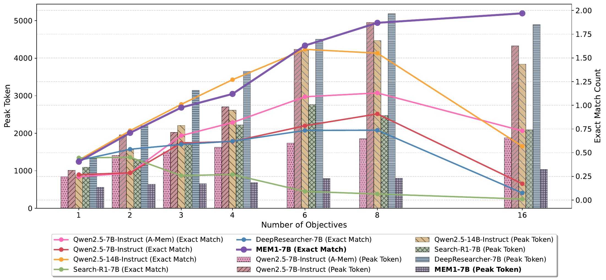
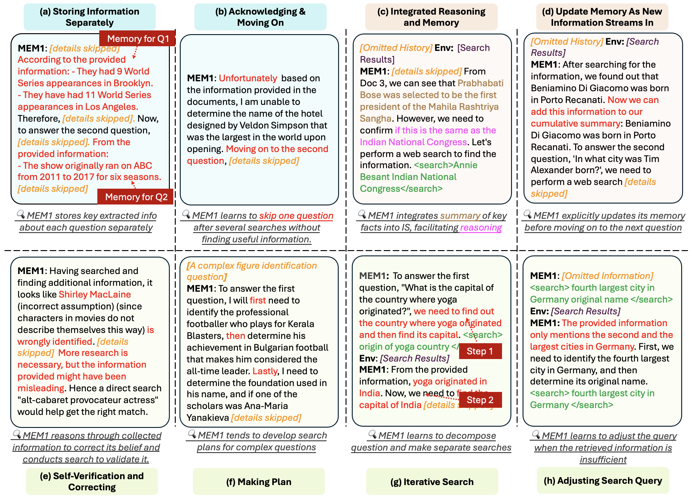

# MEM1：Learning to Synergize Memory and Reasoning for Efficient Long-Horizon Agents

[所属章节](../index.md) · [来源与阅读状态](../../../sources/papers.json)

作者：Zijian Zhou、Ao Qu、Zhaoxuan Wu、Sunghwan Kim、Alok Prakash、Daniela Rus、Jinhua Zhao、Bryan Kian Hsiang Low、Paul Pu Liang。2025，arXiv 2506.15841v2（2025-07-17）。原始版本：[arXiv](https://arxiv.org/abs/2506.15841v2)，代码：[MIT-MI/MEM1](https://github.com/MIT-MI/MEM1)。

实际阅读范围：固定缓存 paper.pdf（23 页）和 LaTeX 正文（摘要、1–5 节、结论）完整阅读；补读附录 A 的指标、提示词、算法、WebShop、attention 说明，以及附录 C、D 的训练曲线、RL/SFT 和 format-reward 分析。未把作者代码当作证据。

## 1. 问题

MEM1 针对有外部环境的长时程语言代理。代理可能检索、观察、改写查询、再检索，最后回答多个子问题；WebShop 中则读取页面、点击和购买。朴素 ReAct 把每轮思考、动作、观察都追加到下一轮 prompt，造成上下文/显存增长、训练 horizon 外推失败、无关信息稀释关键证据。摘要器、检索器和向量记忆通常独立训练，和代理策略脱节。

核心问题是：语言模型能否在下一步推理时同时把仍然必要的信息压缩成内部状态，使该状态成为下一轮唯一工作记忆？MEM1 不增加 memory network，也不直接奖励“短记忆”；rollout 会删除旧上下文，只有保留正确线索才能获得终局奖励。

## 2. 方法

正文用四类标记：IS_t 是内部状态，包含推理与历史压缩；query_t 是环境查询；info_t 是环境返回；answer_t 是终止答案。附录 prompt 有时写 think/search/information，机制相同。每轮先生成新的 IS，再生成 query 或 answer；若 query，环境返回 info。下一轮把 IS、query、info 消化成 IS(t+1)，删除旧轮。抽象地：

~~~math
C_t=(x,IS_t,query_t,info_t),\qquad
IS_{t+1}=f_\theta(IS_t,query_t,info_t;x).
~~~

正文说每时刻最多保留两个 IS、两个 query、一个 info。论文没有 IS 硬 token 上限；所以 constant memory 严格是槽位和实测 peak 近似常数，不是任意 horizon 的字面 token 定理。

丢弃发生在下一次前向输入：旧 info 不再可访问，事实必须先写进新 IS 才能跨轮。推理同时是 working memory：模型提炼事实、决定下一检索；可分别维护多问题、在困难问题上暂时转移、新证据到来时改写旧判断。论文没有独立 recall 指标，这些是训练约束和定性轨迹支持的解释。

PPO 的难点是动态上下文不是线性轨迹。作者把各轮拼成 τ_t=(IS_t,query_t,info_t)，最后 τ_T=(IS_T,answer_T)，用二维 attention mask 让第 k 个 token 只能看到其生成时仍在 memory 中的 token：

~~~math
\rho_k(\theta)=\frac{\pi_\theta(a_k\mid s_k)}
{\pi_{\theta_{\rm old}}(a_k\mid s_k)}.
~~~

另用一维 info mask，使 actor/critic 更新只作用于模型生成 token。附录承认每个 IS 前后两轮可能有不同 position id；为训练效率不复制 IS，而复用前一轨迹 id。这是近似，不是严格等价证明。

多目标任务把 HotpotQA/Natural Questions 的多跳问题组成一个 composite prompt。训练 2-objective，测试 3、4、6、8、16-objective。一次只能查一个问题，最终答案以分号分隔；标签错或答案数错得 0，否则每个正确子答案得 1。没有额外中间格式奖励。

## 3. 训练、部署与 token 账

所有 MEM1 从 Qwen2.5-7B Base 微调，RL 用 PPO；QA 用 EM 终局奖励，WebShop 用环境 reward。4 张 H100/H200，veRL 做 RL、Swift 做 SFT，batch/mini-batch=64，actor lr 1e-6、critic lr 1e-5、50-step warmup；评估单张 H200、vLLM、prefix caching、10 并发。论文未报告总步数、样本数或 GPU-hours。每轮 info 开头注入剩余 turns hint；1–4 objective 最大 6 turns，更难任务 20。

Wiki RAG 使用 2018 Wikipedia、FAISS-GPU/E5 Base、每次 3 passages；Online Web-QA 用 Serper top 10 标题/snippet/URL；WebShop 遵循原始 split。

Peak token usage 是整轨迹某个序列最大 token（GPT-4o-mini tokenizer，排除 system prompt），作为推理显存 proxy。Dependency 为

~~~math
Dependency=\sum_i\frac{(2n_o^{(i)}+n_p^{(i)})n_o^{(i)}}{2},
~~~

不是 FLOPs，也不含 API 检索成本；time 是整轨迹时间。

教学构造的三轮账：原问题 30 token；轮1输出40、info50；轮2输出45、info35；轮3输出38。取前缀 n_p=(30,120,110)，dependency 项分别 2,200、4,725、3,534，总计10,459；含输出的序列约158、200、148，peak约200。全历史模型在轮3还带轮1观察和旧动作，而 MEM1 不带。数字是示例，不是论文样本；不代表 IS 有硬上限或总生成 token 必然下降。

## 4. 实验

表1的2-objective：MEM1-QA EM/F1=0.709/0.838，peak=6.40×10^2，time=6.49s；Qwen2.5-14B-Instruct=0.732/0.902、15.6×10^2、5.49s；DeepResearcher=0.536/0.650、22.0×10^2、4.01s。8-objective：MEM1=1.87/2.31、8.01×10^2、8.68s；14B=1.55/1.87、44.7×10^2、16.2s。16-objective：MEM1=1.97/2.39、10.4×10^2、8.70s；14B=0.567/0.703、38.4×10^2、29.7s。MEM1 peak约27.1%、time约29.3%。多目标 EM/F1 是聚合分数，可超过1。16-objective 的部分 baseline 已 collapse，低 peak 可能是停止有效生成，不能作为内存成功。

 原图 assets/main_result_fig_high_quality.pdf（正文 Fig.4）：横轴 objective，纵轴为 EM count 和 peak token。只有平缓 peak 与仍上升 EM 一起支持 scalability。

WebShop 的 MEM1 reward=70.87、peak=0.81×10^3、dependency=0.15×10^6、time=2.61s；AgentLM-7B=63.60、2.24×10^3、0.28×10^6、3.91s；AgentLM-13B reward=70.80。作者报告相对 AgentLM-7B 的 peak/dependency/time 改善为2.8×/1.9×/1.5×。GPT-4o reward25.48，截断 prompt 后13.82，A-MEM后24.50；GPT时间未报，Agent-R效率缺失。

Wiki-RAG：MEM1 EM/F1=0.405/0.471、peak5.63×10^2、dependency0.76×10^5、3.79s；Search-R1 EM0.445、peak11.0×10^2、2.23s；SFT EM/F1=0.302/0.358。Online Web-QA zero-shot：MEM1=0.397/0.485、peak5.79×10^2、dependency0.44×10^5、1.84s；DeepResearcher F1=0.492、peak10.27×10^2、dependency2.86×10^5、2.87s。比较是条件化的，不构成统一排行榜。

## 5. 行为、失败与消融

 原图 assets/mem1_behavior_v2.jpg（Fig.5）展示：分别保存多个问题；卡住时转移；把检索事实写入下一查询；新证据到来时更新；自我验证；规划分解；迭代搜索；查询过窄时扩大。是定性轨迹，没有行为发生率。

附录 Fig.6 的训练阶段：前50 steps reward低、entropy高、合法动作约0.55；随后格式与 reward 上升；约step150 valid searches下降而 reward仍升，出现少搜索捷径；150–200 是合法但信息不足的局部最优；step200后搜索回升；250后 entropy下降、策略固化。

RL/SFT（附录 D Table 4）在1/2/3/4/6/8/16 objective 的 EM count：RL=0.410/0.709/0.976/1.120/1.630/1.870/1.900，SFT=0.300/0.433/0.648/0.626/0.088/0.027/0.000。SFT还额外见过1、3 objective，却在6以上 collapse；训练量与初始化未完全匹配，不能推出RL优于所有SFT。

Format reward（标签错误即终止并-1）更快收敛，却把2-objective EM从0.709降到0.466，peak从640降到514.9。少 token 不等于好记忆；作者认为格式奖励限制了探索有效 IS 的空间。

## 6. 图、效率关系与局限

资产从 source/tex/figure 原样复制到 assets/，未裁剪。manifest 许可证为 [CC BY 4.0](http://creativecommons.org/licenses/by/4.0/)。资产包括 Fig.1 mem1_flow_v3.jpg、Fig.2 mem1_token_comparison_v2.jpg、Fig.3 mem1_fig3.pdf、Fig.4 main_result_fig_high_quality.pdf、Fig.5 mem1_behavior_v2.jpg、Fig.6 的 num_valid_searches.png/ratio_valid_actions.png/rewards.png/entropy_loss.png、Fig.7 format_vs_no_format.png。

MEM1 直接减少每轮携带旧历史的 peak context 和 dependency；没有证明输出 token 的模型计算、检索成本、训练成本或总生命周期成本同步下降。局限包括：reward 必须可验证；错误压缩不可自动恢复；槽位常数不等于严格 token 常数；未报告 GPU 显存/FLOPs/GPU-hours/完整 cost frontier；baseline horizon、闭源状态和 collapse 造成条件异质；position-id 近似没有等价证明；合成多目标 QA 不等自然对话。

与推理 token 效率的准确关系是：在可验证长任务中，模型学习把历史依赖从随 horizon 增长改成近似平台，同时保留可完成任务的信息。后续应测每轮 memory token、删除事实的恢复率、正确率—总 token 曲线、检索延迟和显存字节。待追问：IS 是否需要硬 cap？开放式稀疏/延迟 reward 下如何避免少搜索捷径？二维 mask 的 position-id 近似是否适合更长轨迹？
