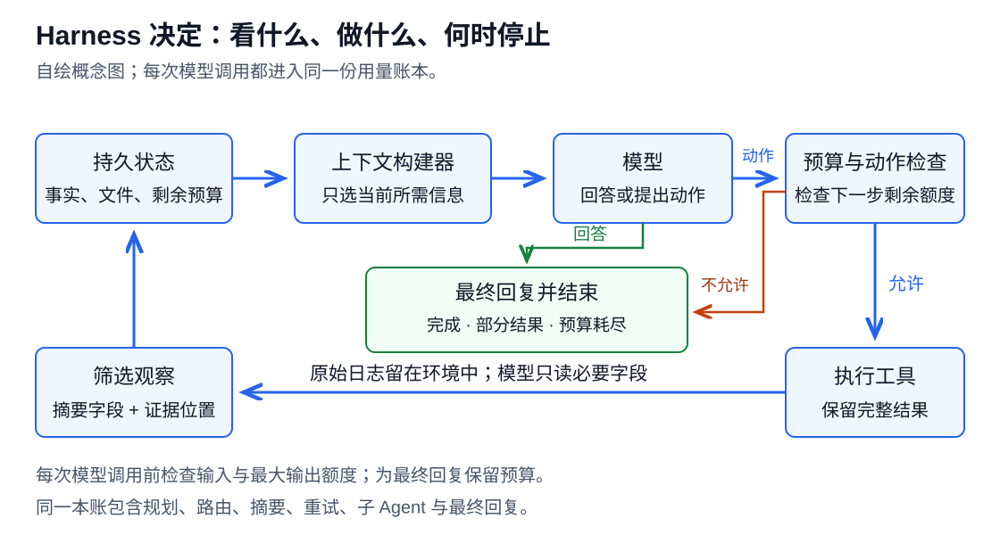

# 08 Harness 与多智能体：预算花在哪次调用上

[返回目录](../README.md) · [上一章：上下文](07-prompt-context.md) · [下一章：评测](09-evaluation.md)

Harness 决定什么时候调用模型、调用谁、给多少上下文、是否使用工具、何时验证和停止。多智能体只是其中一种组织方式。**本章比较的是完成同一任务的整套策略，所有分支、验证和失败调用都要计入。**

## 1. 六条主要路线

| 路线 | 代表方法 | 通俗机制 | 优化的对象 |
| --- | --- | --- | --- |
| 工具循环与任务分解 | ReAct → LLMCompiler | 从边想边调用，发展到先表达依赖图再执行 | 少重复推理/读入，也可并行提速 |
| 模型选择与级联 | FrugalGPT → RouteLLM | 简单请求先用便宜模型，或直接路由到合适模型 | 主要是美元/计算，token 可能增加 |
| 多路径搜索与分配 | Self-Consistency、ToT、compute-optimal allocation | 独立采样、树搜索、按难度分配顺序/并行预算 | 提高预算收益；不是天然节省 |
| 通信与参与稀疏化 | Sparse-MAD/GroupDebate → S²-MAD、AgentPrune | 减少冗余发言、接收者、轮数和通信边 | 可直接减少通信输入与输出 |
| 动态发现与程序执行 | Tool search、Programmatic Tool Calling | 按需加载工具，用程序处理大批中间结果 | 少读 schema、结果，少模型轮转 |
| 预算感知与停止 | BATS、DEER、硬预算/验证 | 告知剩余资源，试答、验证、继续或结束 | 防止过早放弃与过度探索 |

[原文记录](../sources/context-agents-map.md)与[企业公开实践](../sources/vendor-practice.md)保留条件。训练后内化这些决策的路线见[06 章](06-rlvr-agentic.md)。

这张保留的概念图用于标明观察、行动、反馈与停止的位置，没有预设一定要多代理。

## 2. ReAct、依赖图和程序化调用

ReAct 交替思考、行动、观察，使模型在外部反馈后调整路线，是工具 Agent 的基础范式。缺点是每次都可能重新读历史、重新决定显而易见的步骤，甚至陷入重复动作。[ReAct](https://arxiv.org/abs/2210.03629v3)

LLMCompiler 让 planner 先生成依赖 DAG，执行器并行运行就绪工具，需要时再规划。它不只缩短等待，也能减少反复调用模型表达控制流。Anthropic 的 Programmatic Tool Calling 则让模型直接写程序来调用、聚合和筛选工具结果。两者都将可确定的执行逻辑交给程序，但依赖错误和程序失败也可能产生新成本。[LLMCompiler](https://arxiv.org/html/2312.04511v3)、[Anthropic 官方方案](https://www.anthropic.com/engineering/advanced-tool-use)

工具发现处理的是另一种浪费：把所有工具定义预先放入每轮上下文。OpenAI 与 Anthropic 都公开了按需发现/延迟加载接口。它和程序执行可组合，一个减少“读说明书”，一个减少“读全部中间结果”；小工具库未必值得增加发现步骤。[OpenAI tool search](https://developers.openai.com/api/docs/guides/tools-tool-search)

## 3. 路由和多路径搜索为什么不能一概叫省 token

FrugalGPT 逐级调用模型，RouteLLM 更偏向在生成前选择强/弱模型。即使花更多 token，因用了便宜模型也可能省钱。研究若主目标是 token 曲线，应同时记录模型身份、每次输入/输出和路由开销；不能用美元降幅代替原始 token。[FrugalGPT](https://arxiv.org/abs/2305.05176)、[RouteLLM](https://arxiv.org/html/2406.18665v4)

Self-Consistency 为同题采多条链再投票；ToT 将思考组织成可回溯树，并调用评价器剪枝。它们开拓的是推理时计算，而不是默认节省。Snell 等进一步研究给定预算该分给多少并行样本、多少顺序修订或搜索：最优分配依赖题目难度，说明固定“一题 N 次”不是唯一选择。[Self-Consistency](https://arxiv.org/abs/2203.11171)、[ToT](https://arxiv.org/abs/2305.10601)、[计算分配](https://arxiv.org/abs/2408.03314)

这组工作是研究极大预算边际收益的入口；本项目更关注能否用更合理分配，在现有质量下减少总调用。验证器、回溯和分支的输入重读仍需全部计量。

## 4. 从“多几个人讨论”到“只有必要的通信”

MAD 的全互相阅读容易制造重复；Sparse-MAD/GroupDebate 减少邻居或分组，S²-MAD 进一步按意见差异决定谁参加下一轮，AgentPrune 学习剪去空间和时间通信边。它们的共同问题是“哪条消息改变了决策”，而不是让每个角色都输出一段话。[S²-MAD](https://aclanthology.org/2025.naacl-long.475/)、[AgentPrune](https://arxiv.org/abs/2410.02506)

但全体同意也可能全体错；相似度阈值和拓扑会随任务改变。相对一个很昂贵的多代理基线省很多，不代表优于同预算的单模型重复采样或一名强工具代理。研究应将后两者纳入竞争基线。

Anthropic 公开的研究系统采用 lead–worker 并行搜索并汇总，报告内部任务性能提升，同时说明多代理约消耗普通 chat 的 15 倍 token。它为复杂任务能力扩展提供实践证据，也明确暴露过度派工和重复搜索的风险。[官方系统文章](https://www.anthropic.com/engineering/multi-agent-research-system)

## 5. 预算感知与动态停止

BATS 把剩余工具预算显式写给 Agent，再结合计划、验证和重试。它是无需训练的控制方案；原实验显示较低工具上限也可能达到原策略较高上限的分数，但“上限减十倍”不等于实际用量减十倍。[Budget-Aware Tool-Use](https://arxiv.org/html/2511.17006v1)

DEER 在推理过程中触发试答，以置信度决定是否提前结束。它与 L1 的区别是部署时检测停止时机，而非预先训练服从长度；试答和置信度计算可能有额外开销。硬预算提供可靠上限，动态停止争取在达到上限前就完成，二者可以同时存在。[DEER](https://arxiv.org/abs/2504.15895)

## 6. 哪些实验证据可以直接使用

| 工作 | 原实验条件与结果 | 不能跨越的边界 |
| --- | --- | --- |
| LLMCompiler | HotpotQA，输入/输出约 2,900/120→1,300/80 | token 表对照原始 ReAct，其他性能表常用 ReAct†；不可跨表拼点 |
| S²-MAD | GPT-4-0613/GSM8K，MAD(5代理,4轮) 93.3%/50.4K→94.2%/2.78K 总 token | 针对既定讨论配置，仍应有现代单代理强基线 |
| AgentPrune | 5个GPT-4、AutoGen/HumanEval：输入492,273→315,105，输出130,196→139,714，分数85.41→86.65 | 原表总量；输入下降而输出上升；还须计入前期拓扑优化 |
| BATS Budget Tracker | Gemini-2.5-Pro/BrowseComp；原 ReAct 预算100为12.6%，Tracker预算10为12.8% | 实际综合成本 9.9→6.8美分，不是 token 减十倍；包含工具费用 |
| Anthropic PTC | 内部复杂研究任务，43,588→27,297 tokens | 不同内部准确率测试不可拼成同任务等性能点 |

S²-MAD 的 GPT-4/MMLU 也有90.8%→88.1%的下降；其相似度阈值随任务变化。AgentPrune 摘要的降幅不能直接套到完整I/O，原表部分百分比与绝对数不一致，来源卡保留定位。

多来源支持“按需执行和减少重复通信有潜力”，但尚无通用最优拓扑、路由器或停止规则。厂商采用相近机制加强了工程相关性，不能替代独立复现。

## 7. 阅读顺序与研究机会

先读 ReAct→LLMCompiler，再读 FrugalGPT→RouteLLM；多路径读 Self-Consistency→ToT→Snell；多代理读 Sparse-MAD/GroupDebate 的定位后深入 S²-MAD/AgentPrune；最后用 BATS/DEER 对照预算与停止。

| 初步 idea | 最近邻 | 有价值的差异 |
| --- | --- | --- |
| 少数 Agent 讨论、相同答案就停 | S²-MAD、AgentPrune | 怎样识别相关错误，保留少数正确异议？ |
| 把工具链写成程序省调用 | LLMCompiler、Programmatic Tool Calling | 动态工具失败与依赖不确定时，何时需要模型重新介入？ |
| 给 Agent 剩余预算提示 | BATS、TALE、L1 | 统一 token、工具和验证预算，并在变化成本下保持性能？ |
| 小模型不确定再找大模型 | FrugalGPT、RouteLLM | 更少美元是否也更少总 token，路由能否在新任务校准？ |

本地图的机会判断：对于小团队，状态压缩、程序化工具结果筛选和验证驱动停止，比大规模从头训练更容易做出独立、可重跑的等性能成本证据。采用现成 harness/环境后只改变一个决策机制，可以减少自研基础设施负担。

教学预算账与程序见[Harness 技术专题](technical/08-harness-agents.md)、[agent_budget_lab.py](../examples/agent_budget_lab.py)。

旧版小节链接已保留。原来的推导、算例和练习见[本章技术专题](technical/08-harness-agents.md)。
