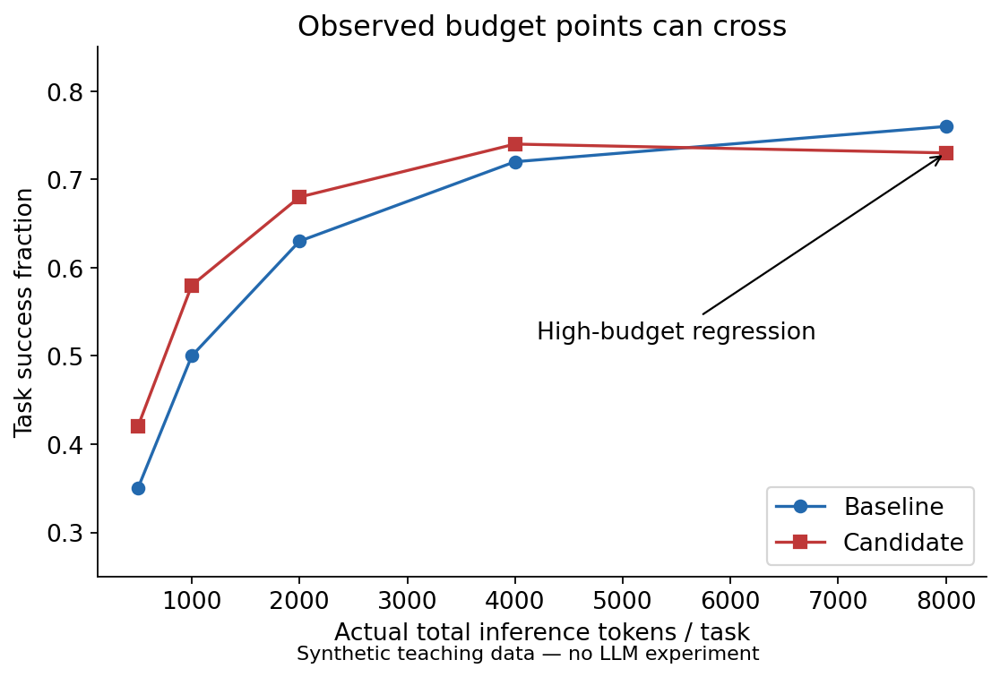
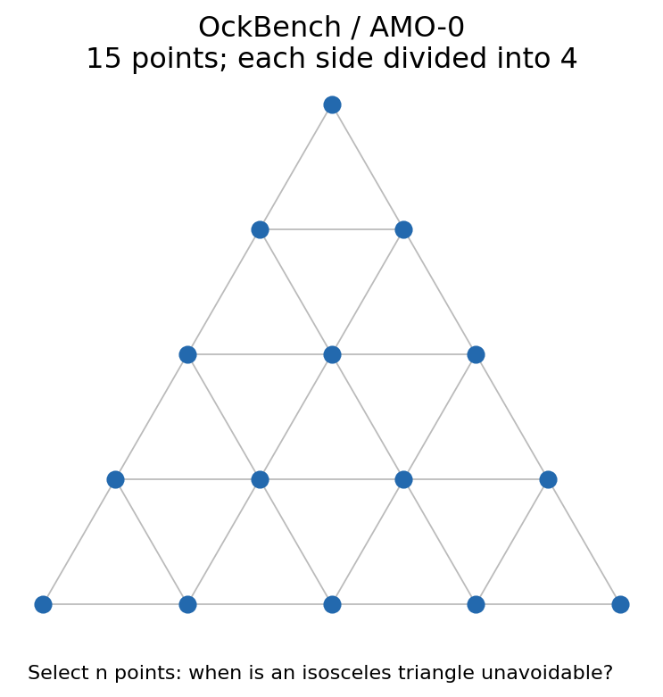
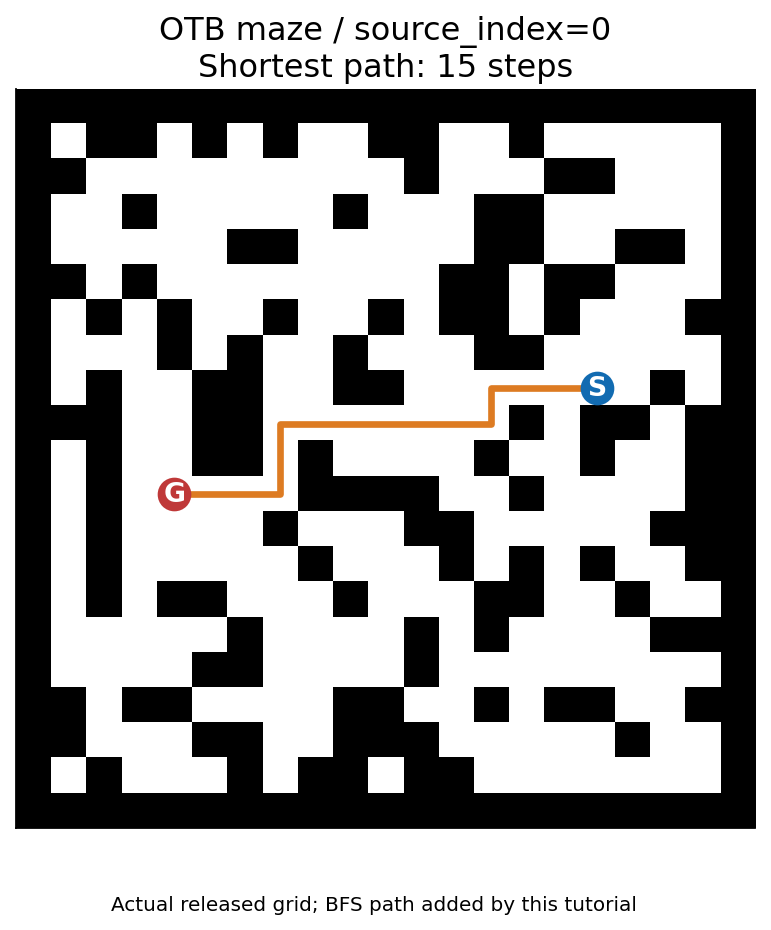
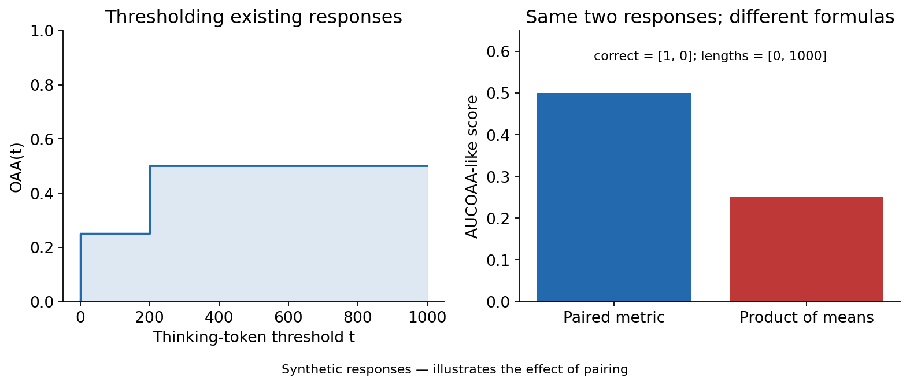
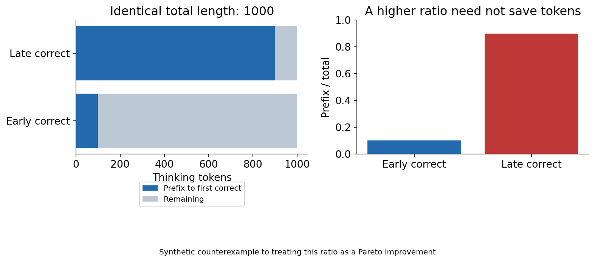
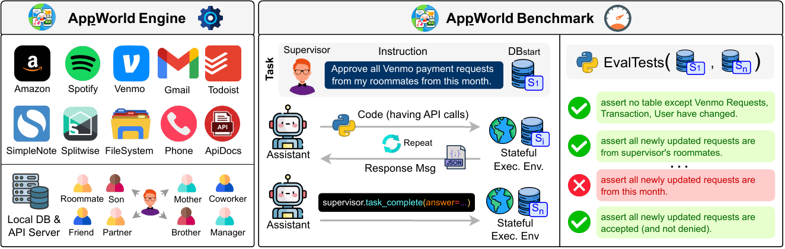

# 09 评测：怎样证明性能—token 曲线改善了

[返回目录](../README.md) · [上一章：智能体编排](08-harness-agents.md) · [下一章：相邻方向](10-other-directions.md)

评测领域的路线从“答对多少”扩展到“预算如何改变正确率”，再到“真实环境是否完成任务、是否产生副作用”。本章将这些路线接起来，再保留四个基准的真实实例与判分细节。样例用于理解任务，不是新增测试集。

## 0. 先看覆盖关系，避免拿一个分数回答所有问题

[Agent 评测综述](https://aclanthology.org/2026.findings-acl.1330/)按能力与应用分类；[AI Agents That Matter](https://arxiv.org/html/2407.01502v1)进一步区分模型比较、完整系统比较和成本优化。前者帮助找漏项，后者提醒：固定 harness 与允许每个系统优化 harness，回答的是不同问题。

| 评测路线 | 代表资源 | 比前一类多测了什么 | 仍看不到什么 |
| --- | --- | --- | --- |
| 答案/执行正确性 | MBPP、GPQA、数学题及其 OckBench 选集 | 终点是否正确 | 没有成本账便不知道是否经济 |
| 正确率与长度折中 | OckBench、OTB | 输出长度，或简单题/困难题的预算失配 | 原生口径未统一覆盖全输入、辅助模型与硬预算 |
| 推理过程诊断 | THINK-Bench | 参考步骤、首次正确后的冗余与反思 | 可见 CoT 不等于完整内部计算，过程分不等于任务前沿 |
| 有状态执行 | AppWorld、WebArena、OSWorld、SWE-bench | 环境终态、程序测试或副作用 | 不自动给出 token 最优策略，也不保证测试充分 |
| 显式经济规划 | CostBench、成本受控 Agent 评测 | 在有价格的动作/调用中选择策略 | 人工工具价格和历史 API 美元不是统一 token 单位 |

这些类别有交叉，不能按名称当作相互独立的证据。**OckBench 与 MBPP/GPQA-Diamond/HLE/OlympiadBench 的选题重叠**，不能把母集和选集的两次得分算成独立外测；不同数学集还需进行实际内容去重。OTB 的程序化推理与 THINK-Bench 的理科题扩大了覆盖，却不能替代有状态工具任务。AppWorld 可作为工具场景的外测，但无法直接验证视觉压缩或鼠标定位。

本项目据此采用“完整任务性能—实际成本曲线为主，原生基准分与过程指标为辅”的方案。这是测量设计判断，不声称已形成唯一行业标准。

## 1. 先固定实验合同

一个可比较的结果至少包含任务版本、模型版本、采样设置、输入模板、工具与环境、判分器、预算策略、失败规则和 token 用量。修改其中一项可能改变结果。把这些信息写进每次实验的 manifest，比只保存一张总分表更可靠。

| 项目 | 需要冻结或记录的内容 | 常见误判 |
| --- | --- | --- |
| 任务 | 划分、题目 ID、文件 SHA256、去污染规则 | 训练和测试使用同源改写题 |
| 模型 | 权重与 tokenizer revision、精度、服务版本 | 只记录可变模型别名 |
| 推理 | temperature、top-p、最大长度、采样次数、停止条件 | 把 8 次采样均值当 pass@8 |
| Harness | prompt、工具定义、允许动作、重置策略 | 多代理成本只算最后汇总 |
| 判分 | 规则/执行器/judge 权重与 prompt | 把 judge 同意当数学证明 |
| 成本 | 每次输入、输出、缓存、缺失项、失败调用 | 把缺失的隐藏思考填为 0 |
| 统计 | 固定分母、任务成对、场景分组、置信区间 | 只比较成功任务，漏掉失败开销 |

对每个预算配置运行同一批题，令第 $`i`$ 题得分为 $`s_i`$ ，实际整项任务 token 为 $`c_i`$ 。报告 $`\widehat Q=N^{-1}\sum_i s_i`$ 与 $`\widehat C=N^{-1}\sum_i c_i`$ 。多次采样时先保留每次的成对记录；题目应有相同权重，不能让采样次数更多的题占据更大比例。



图中是合成教学数据。候选方法在低预算较好，高预算却回落。因此应报告改善区间与原始点；连线仅帮助阅读，不表示中间预算已测量。预算上限必须在运行时执行；事后按实际长度筛掉昂贵任务不能得到同一种硬预算实验。

`examples/evaluation_lab.py` 提供逐调用成本账、Pareto 判断和成对 bootstrap。bootstrap 的抽样单位是任务；若同一场景有多个变体，应抽场景并保留其全部变体。小测试集、相关任务和不稳定 judge 都会让简单区间过于乐观。

## 2. 四个基准分别回答什么

| 基准 | 任务对象 | 核心性能标准 | 原生效率口径 | 对本地图主目标的用途 |
| --- | --- | --- | --- | --- |
| OckBench | 数学、代码、科学单轮问答 | 答案正确或代码测试通过 | 论文使用完整输出 token 与 OckScore | 直接看性能—生成长度折中；补全部输入账 |
| OptimalThinkingBench，简称 OTB | 简单问答与程序化复杂推理 | 简单题 judge，复杂题任务 verifier | 显式思考长度与 AUCOAA | 检查简单题浪费与难题能力是否同时改善 |
| THINK-Bench | 数学、物理、化学及参考步骤 | 答案和推理过程评判 | 首次正确答案前缀、反思与步骤指标 | 为机制提供证据，不单独承担效率结论 |
| AppWorld | 在模拟应用中执行跨工具任务 | 终态与副作用断言全部通过 | TGC/SGC 本身不含 token | 用真实任务完成率配合完整方法成本 |

### 2.1 OckBench：单轮正确率与完整输出

本章锁定仓库 `b72752a0ba5989d3c212675ec60d3eedcd838628` 的 Selected 文件：数学 100、代码 60、科学 40，共 **200 题**。代码选题全部来自 MBPP，科学全部来自 GPQA-Diamond；数学为 HLE Math 59、OlympiadBench 32、AMO 6，以及 MATH500/AIME24/AIME25 各 1。论文列出的候选来源不等于最终 Selected 文件包含全部来源。[固定数据目录](https://github.com/OckBench/OckBench/tree/b72752a0ba5989d3c212675ec60d3eedcd838628/data)

| 实际 ID | 典型题意与给定量 | 官方参考答案/测试 | 暴露的效率问题 |
| --- | --- | --- | --- |
| `AMO-0` | 等边三角形每边四等分，得到 15 个格点；至少任取多少点必有三个构成等腰三角形？ | 6 | 组合搜索、证明思路和冗余枚举 |
| `mbpp-55` | 实现等比数列第 n 项函数 `tn_gp(a,n,r)` | 三个测试：`(1,5,2)→16`；`(1,5,4)→256`；`(2,6,3)→486` | 短程序能否直接正确完成，是否无谓展开 |
| `GPQA-Diamond-8` | 类星体约 790 nm 处谱断裂；平坦 ΛCDM，H0=70、物质密度0.3、暗能量密度0.7，估计共动距离 | A：8 Gpc；其他选项7、6、9 Gpc | 科学知识、估算及反复自检的成本 |

这里报告发布数据的参考值，没有声称已重新科学审定全部标签。完整题面可按上述 ID 在固定数据文件中定位。



这是根据题面用代码绘制的 15 个点，不是论文截图。图帮助理解几何条件，没有画出证明。代码题则可以写成下面的候选答案；通过这三个测试只证明通过这三个测试，不能证明所有输入上正确。

```python
def tn_gp(a, n, r):
    return a * r ** (n - 1)

assert tn_gp(1, 5, 2) == 16
assert tn_gp(1, 5, 4) == 256
assert tn_gp(2, 6, 3) == 486
```

论文 v3 采用温度 0、每题一次生成；数学和科学描述为规则抽取与匹配，代码执行测试。它的标量分数为：

```math
\mathrm{OckScore}=100a-10\ln(1+\bar L/10000),
```

其中 $`a\in[0,1]`$ 为准确率， $`\bar L\ge0`$ 是平均完整输出 token（思考加答案）。例如 $`a=0.8,\bar L=1000`$ 时约为 79.0469。固定准确率时导数为 $`-10/(10000+\bar L)\lt 0`$ ，因此缩短输出提高分数；但是准确率下降也可能被长度奖励抵消，所以分数升高不足以证明 Pareto 支配。[论文 v3](https://arxiv.org/html/2511.05722v3)

**复现需要选择明确口径。** 上述固定仓库的数学实现使用 LLM judge，而 `scoring.py` 从 `tokens.total_tokens` 取平均成本，和论文输出长度口径不同。不要混用。可分别报告论文口径 OckScore 和本地图完整输入+输出曲线，并保存原始账目。[数学判分源码](https://github.com/OckBench/OckBench/blob/b72752a0ba5989d3c212675ec60d3eedcd838628/src/evaluators/math_eval.py)、[聚合源码](https://github.com/OckBench/OckBench/blob/b72752a0ba5989d3c212675ec60d3eedcd838628/src/core/scoring.py)

### 2.2 OptimalThinkingBench：别在简单题浪费，也别在难题草率

OTB 包含 OverthinkingBench 简单问答和 UnderthinkingBench 复杂推理。固定 Hugging Face 文件实际有 **1,327+550=1,877** 条，和论文的 **1,440+550=1,990** 不同。复杂部分是 11 类任务各 50 条。[官方固定数据](https://huggingface.co/datasets/facebook/optimal_thinking_bench/blob/949ee6b5dc7960928dab98704cb380ded43c7636/otl_bench.jsonl)

| 定位 | 真实实例 | 参考结果 |
| --- | --- | --- |
| 文件第30行，0-based row29 | `9 × 9`，Education/numeric | 81 |
| `ab / source_index=0` | 20 个 `A#/#A/B#/#B` 符号按相邻重写规则化简 | `#A #A #A B# B# A# B# A#` |
| `maze / source_index=0` | 下图21×21迷宫，原题用 `]` 标起点、反斜杠标终点，问最短步数 | 15 |

AB 的实际输入保存在[样例索引](../data/benchmarks/otb-examples.json)。规则为 `A# #A` 与 `B# #B` 消去，`A# #B` 和 `B# #A` 分别交换为 `#B A#`、`#A B#`。这类题要求应用规则至终态，不能靠回答一个常识事实完成。



黑格是墙，白格可通行，S/G 对应原题起止符号；橙色路径是本地图用广度优先搜索补充的解，15 步已与参考值核对。只改了视觉表示，未另造一个迷宫。

论文对每题作 8 次采样、温度 0.6，简单题由 Llama-4-Maverick 比较答案，复杂题调用 Reasoning Gym verifier。这是重复采样均值，不是“八次至少成功一次”。令每次是否正确为 $`c_i\in\{0,1\}`$ 、思考长度为 $`l_i\ge0`$ ，阈值为 $`t`$ ：

```math
\mathrm{OAA}(t)=\frac1N\sum_i c_i\mathbf1[l_i\lt t].
```

答错或超出阈值都记零，分母仍包含所有回答。令 $`T\gt 0`$ ，对阈值积分得到：

```math
A=\frac1T\int_0^T\mathrm{OAA}(t)\,dt
=\frac1N\sum_i c_i\max(0,1-l_i/T).
```

等号来自每条正确回答在区间 $`(l_i,T]`$ 才贡献面积。论文取 $`T=1000`$ ：正确且用200个思考 token，贡献0.8；正确但达到1000，贡献0；错误无论多短仍为0。**这是给已经生成的回答改变评分阈值，没有在每个阈值下重新运行模型。**[论文 §3–4](https://arxiv.org/html/2508.13141v1#S3)



右图用两次合成回答说明实现差异：先逐次算 $`c_i\max(0,1-l_i/T)`$ ，得到0.5；先算平均正确率与平均长度再相乘，得到0.25。固定代码 `f0be19697523ac8340fd5eb76cded26d97732952` 采用后一类聚合，所以复现时要声明选择哪一种。[eval.py](https://github.com/facebookresearch/RAM/blob/f0be19697523ac8340fd5eb76cded26d97732952/projects/otb/eval.py)

OTB 总分把简单题指标 $`A`$ 和困难题指标 $`U`$ 作调和平均： $`2AU/(A+U)`$ ；当两者都0时定义为0。这不是分类 precision/recall F1。公开复杂题代码直接平均 verifier reward，某些任务允许部分分，因此实际 $`U`$ 未必是严格二元准确率。[underthink evaluator](https://github.com/facebookresearch/RAM/blob/f0be19697523ac8340fd5eb76cded26d97732952/projects/otb/evals/underthink_eval.py)

其他版本风险也要记录：`t_max=1000` 是评分尺度，不是所有模型的生成上限；think 标签缺失会影响思考长度抽取；第一个或最后一个 boxed 的选择可能改变结果；服务名不保证背后的 judge 权重身份。正式运行应固定依赖、逐题输出与真正加载的模型。[官方实现目录](https://github.com/facebookresearch/RAM/tree/f0be19697523ac8340fd5eb76cded26d97732952/projects/otb)

### 2.3 THINK-Bench：用过程指标解释变化

发布 JSON 有 **1,375 题**：数学293、物理590、化学492；Easy689、Hard686。每题有答案、学科标签和一条或多条关键步骤路径。这些标注是用于评判的参考，不应预先假定所有过程都正确。下表选三个可以直接定位并理解的题。[数据文件](https://huggingface.co/datasets/zhiyuan218/Think-Bench/blob/78ed26bf4cac0f540c3d9caa2ae8e1eb553b250f/Think-Bench.json)

| `index` | 典型问题 | 官方答案 | 可以分析的过程 |
| --- | --- | --- | --- |
| 376 | 计算 log₂64 | 6 | 用指数定义、换底或幂的性质；允许多条解法 |
| 152 | PCl4F、BF3、CO2、CBr4，哪个分子为四面体？ | D：CBr4 | 中心原子电子域和 VSEPR 判断 |
| 39 | 将10 μF电容充到100 V，需要做多少功？ | C：0.05 J | 单位换算与电容储能 |

例如第三题可从电荷为 $`q`$ 时电压 $`V(q)=q/C`$ 推出：

```math
W=\int_0^{Q}\frac qC\,dq=\frac{Q^2}{2C}=\frac12CV^2=0.05\ \mathrm J,
```

这里假设电容 $`C\gt 0`$ 恒定，计算充电后储能；实际电路从电源取走的能量还可能包含耗散。这个推导是对题意的教学解释，不是模型实测的思考轨迹。

测试先生成推理与答案，再让 judge 对参考步骤、生成步骤和反思作比较。论文使用 Claude 3.7 Sonnet；实际代码可配置 judge 与 tokenizer。步骤 precision/recall 测的是与参考及合理推理的匹配，不能要求所有模型复现同一段文字。[论文](https://arxiv.org/abs/2505.22113)、[固定仓库](https://github.com/ZhiyuanLi218/Think-Bench/tree/43cd9672cc85027f34d578052de2a759daba4bb6)

容易误读的是 Efficiency。设完整思考长度为 $`L\gt 0`$ ，首次正确答案前的前缀长度为 $`F`$ ，该类指标为 $`F/L`$ ；未找到正确答案时按实现记0。它不等于正确率除以总成本，也不表示逐 token 验证“有用”。



两条合成轨迹都用了1000 token。若首次正确答案出现在100处，比率为10%；推迟到900处则为90%。后一条没有节省 token，也没有更早得到答案。因此它适合描述首次正确后的冗余，不能孤立用来宣称前沿改善。

代码还有几个需要明示的近似：Thought Num 根据少数英文转折词估计换思路次数；precision 允许参考外合理步骤；recall 在参考路径间取最好匹配；首次正确段落的切片目前不包含该段，可能导致第0段答对时前缀长度为0。原始输出应保留以便复查，而不是只发布过程综合分。[效率源码](https://github.com/ZhiyuanLi218/Think-Bench/blob/43cd9672cc85027f34d578052de2a759daba4bb6/efficiency.py)、[评分脚本](https://github.com/ZhiyuanLi218/Think-Bench/tree/43cd9672cc85027f34d578052de2a759daba4bb6/final_score)

### 2.4 AppWorld：用应用状态判断任务是否完成

AppWorld 是带数据库的应用模拟环境，主要通过代码/API 操作，**不是要求鼠标点击的桌面 GUI 基准**。原论文版本有9个业务应用、457个API，250个场景，每场景3个变体，共750项任务；train/dev/test_normal/test_challenge 分别105/60/168/417。这里使用原论文规模，没有把可变 main 分支当作已重新统计的数据包。[论文](https://arxiv.org/abs/2407.18901v1)、[官方仓库](https://github.com/StonyBrookNLP/appworld)



图由 Harsh Trivedi 等作者发布，来自 LaTeX 源工程 `images/main.pdf`；[原始PDF资产](../assets/papers/appworld-main.pdf)字节未改。这里只将单独图像PDF转成PNG供GitHub显示，未截取论文页面。许可 [CC BY 4.0](https://creativecommons.org/licenses/by/4.0/)，来源与校验和见[记录](../assets/papers/provenance.json)。左侧是模拟应用，中间是代码—执行反馈循环，右侧比较初态与终态。

以下三个例子都来自作者公开图表中的真实场景。它们是公开场景级示例；具体实例的人名、日期和数据库值由任务变体给出，本地图不补造这些参数。

| 官方定位 | 任务与初始信息 | 成功需要发生什么 | 典型错误 |
| --- | --- | --- | --- |
| 原论文框架图，`images/main.pdf` | 处理本月室友发来的全部 Venmo 付款请求；环境中还有其他请求 | 接受符合人物与月份条件的请求，满足允许变更范围 | 接受了不在本月的请求，主图中该断言失败 |
| 原论文主文示例表，`tables/examples-main.tex` 的 roadtrip 场景 | Spotify 中已建出游歌单，并通过手机消息向同行者征求建议 | 根据对应消息添加、移除目标歌单歌曲 | 使用同名干扰歌单或另一场出游的建议 |
| 原论文附录示例表，`tables/examples-appendix.tex` 的 reunion 场景 | 邀请名单 CSV 记录是否参加，手机中有多次回复 | 用每个人最新决定更新正确文件 | 使用较早回复，或改错目录中的干扰文件 |

这些场景展示状态和干扰项的重要性。应用里的钱、账户与消息都是模拟数据。[作者公开 LaTeX 源包](https://arxiv.org/src/2407.18901v1)

典型循环是初始化 `AppWorld(task_id)`，让 agent 读取合法任务信息，执行 `world.execute(code)`，把输出或错误送回模型，直到明确结束。参考解、评测代码和私有答案不属于模型可见输入。具体API接入以所安装的固定版本为准。[官方最小示例](https://github.com/StonyBrookNLP/appworld/blob/main/notebooks/minimal_agent.ipynb)

Task Goal Completion（TGC）要求任务全部断言通过。Scenario Goal Completion（SGC）要求同场景全部变体成功。设任务成功为 $`s_{gj}\in\{0,1\}`$ ，场景 $`g`$ 有 $`n_g`$ 个完整变体：

```math
\mathrm{TGC}=\frac{\sum_g\sum_{j=1}^{n_g}s_{gj}}{\sum_g n_g},\qquad
\mathrm{SGC}=\frac1G\sum_{g=1}^{G}\prod_{j=1}^{n_g}s_{gj}.
```

百分数显示时乘100。一个场景三次结果为成功、成功、失败，则TGC为66.7%，SGC为0。单题五条断言通过四条，不会使其以80%成功计入TGC。传入缺失变体会破坏SGC含义，所以教学代码要求先给出完整成员列表。[官方 evaluator](https://github.com/StonyBrookNLP/appworld/blob/main/src/appworld/evaluator.py)

环境除了主目标，还检查不应变化的数据库对象。终态检查不等于持续审计全部中间行为；某次错误操作是否被发现取决于任务断言覆盖。TGC/SGC 本身没有成本项，需在 agent 调用边界另外累计全部 token，再画预算曲线。

## 3. 电脑使用与软件工程：训练资源和测试资源有多独立

“有干净数据”至少要拆成三个问题：答案/终态能否可信验证，轨迹能否有效执行，测试是否独立于训练。以下是原论文版本，不将可变线上仓库的最新规模混入；[阅读范围与来源卡](../sources/evaluation-map.md)记录更多限制。

| 资源与界面 | 可用训练证据 | 可用测试与隔离 | 不能据此声称什么 |
| --- | --- | --- | --- |
| AppWorld：代码/API | train 105、dev 60；可执行环境与参考解资源 | normal 168、challenge 417；按官方划分使用 | 750 条都可用于训练，或这是 GUI 数据 |
| Mind2Web：网页快照/DOM | 1,009 个训练任务，人工动作；总计2,350 | cross-task252、cross-website177、cross-domain912 | 对齐动作就等于在线网站终态成功 |
| WebArena：自托管网页 | 官方主要提供评测任务；可自行在独立模板生成训练任务 | 812 意图、241 模板，答案/状态判分 | 812 条是与测试隔离的专家训练轨迹 |
| OSWorld：真实桌面 VM | 环境配置与判分可复用；原版不提供完整专家训练轨迹 | 369 Ubuntu 任务，另有43 Windows；不是常规三分数据集 | 公开任务配置等于大量干净训练演示 |
| SWE-Gym：仓库/终端 | 2,438 可执行 issue；491 条成功轨迹最多294道不同题 | 11 个可执行仓库与 SWE-bench 仓库分离，外测 Lite/Verified | Raw64,689条具有相同测试保证，或491轨迹是491独立题 |

来源：[AppWorld](https://arxiv.org/abs/2407.18901v1)、[Mind2Web](https://arxiv.org/abs/2306.06070v3)、[WebArena](https://arxiv.org/abs/2307.13854)、[OSWorld](https://arxiv.org/abs/2404.07972v2)、[SWE-Gym](https://arxiv.org/abs/2412.21139v2)。

Mind2Web 适合学“看到这个页面时如何选动作”，而 AppWorld/WebArena/OSWorld 更适合测“动作之后世界是否变成目标状态”。SWE-Gym 则提供带测试的程序修复过程。这些监督信号可以组合，但不可互换；例如多条等效路径会被单一路径匹配低估，测试通过又可能遗漏未覆盖的错误。

对于小团队，先复用可重置环境、官方 evaluator 与合法训练划分，核验一小批真实序列的输入/动作/终态，再生成训练轨迹。**零条可以仅凭数据集名字就认证为100%正确**；这不代表没有高可信数据，而是应按给定验证覆盖报告通过规模。测试集任务、参考解、隐藏断言都不能进入训练或部署上下文。去污染还须覆盖模板、仓库、站点与题族，不只是字符串去重。

## 4. 成本评测本身也有竞争路线

AI Agents That Matter 在 HotpotQA 的检索任务中比较准确率单目标与成本/准确率联合优化：GPT-3.5 的一个配置在相近检索质量下少约53%可变费用。它展示了仅盯准确率会选到昂贵系统，但这里的“成功”是找到全部支持文档，费用是当时美元，不能移植成问答正确率—token 曲线。[原文 §3](https://arxiv.org/html/2407.01502v1)

CostBench 把经济选择变成显式任务：六个旅行领域有不同价格的原子/组合工具，比较计划是否正确、与最优计划的成本差距以及轨迹匹配。过滤后有1,902训练、381测试。它能检查模型是否会选择便宜动作，但主要成本是人为分配的工具费用。对本研究需要另外记录模型调用 token；一个最便宜工具方案可能要求更长思考。[原文 §3–5](https://arxiv.org/html/2511.02734v1)

OckScore 和 AUCOAA 则把正确率与长度压成标量。它们适合统一约定下追踪配置，但其惩罚权重和积分区间带有价值选择。更高综合分、平均长度下降、胜过某一个默认配置，都不自动等于“同样性能显著向左”。应在开发集上匹配目标性能或扫描预算，报告测试集成本差、性能差与成对不确定性；未达到目标性能时如实记为未达标。

## 5. 怎样复用，而不是重造一个榜单

先选一个单轮基准和一个有状态环境。保留原任务和判分，在部署层增加成本日志；提供原生分数以及统一完整成本图。只有当现有任务无法测量你提出的机制时，再增加有明确目的的新测试，并保留独立泛化集。

一次评测可以采用这样的记录结构。它是本地图建议的日志格式，不冒充任何官方格式：

```json
{
  "task_id": "example-001",
  "method": "baseline",
  "budget_config": {"max_total_tokens": 8000},
  "calls": [{"input_tokens": 900, "output_tokens": 300, "cached_input_tokens": 0}],
  "status": "completed",
  "score": 1,
  "verifier_revision": "record-the-exact-version"
}
```

最小比较包括默认配置、强prompt和一个简单工程基线。若方法改变摘要、工具表示或多代理结构，应消融相应组件，并计入选择与摘要成本。测试上挑选最好的配置再只发布它，会把调参收益混进最终成绩；预算、配置选择在开发集完成。

## 6. 阅读顺序、证据缺口与研究设计

先读 AI Agents That Matter 理解完整系统成本，再读 OckBench→OTB 区分生成长度与预算失配，然后按需要用 THINK-Bench 分析过程。工具研究继续读 AppWorld，并用 WebArena/OSWorld/SWE-Gym 判断你的机制需要哪种环境；CostBench 用来补显式价格规划。

| 初步 idea | 必须比较的现有路线 | 可能成立的新证据 |
| --- | --- | --- |
| 做一个“准确率减长度惩罚”榜单 | OckScore、AUCOAA | 明确旧指标漏掉哪项成本，且新协议改变真实结论 |
| 用早停使思考更高效 | OTB、THINK-Bench、DEER/L1 | 在线停止策略在未见难题上保住能力；事后切片不足以证明 |
| 测 Agent 最优调用路线 | CostBench、AppWorld、AI Agents That Matter | 真实观察/重试成本下的可执行比较，而非只比理论最短路径 |
| 用公开桌面轨迹训练省 token | OSWorld、Mind2Web、SWE-Gym | 独立任务的终态成功、全部调用账和可重放性都得到验证 |

本地图的分析判断：优先复用现有任务，补齐预算运行器、成本口径与题族隔离。只有当失败机制确实未被现有基准覆盖时，再发布小而有针对性的补充集；**“新 benchmark 上赢 baseline”仍需排除按自身方法设计任务、弱基线与开发集过拟合，并用外部任务检验。**

可运行的评分程序、真实题目重算与练习保留在[评测技术专题](technical/09-evaluation.md)和[evaluation_lab.py](../examples/evaluation_lab.py)。这些程序验证计量逻辑，没有产生本地图的模型实测排行榜。

[返回目录](../README.md) · [上一章：智能体编排](08-harness-agents.md) · [下一章：相邻方向](10-other-directions.md)
