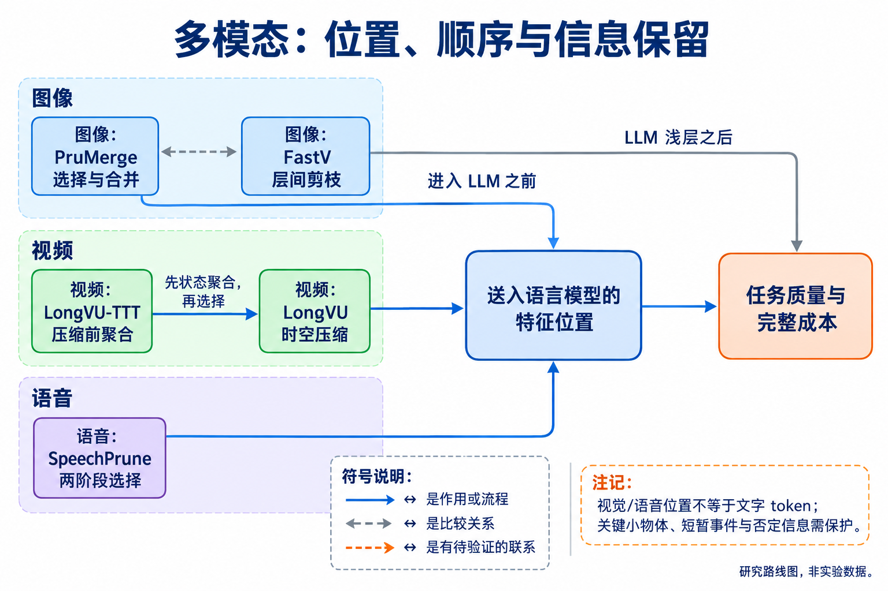
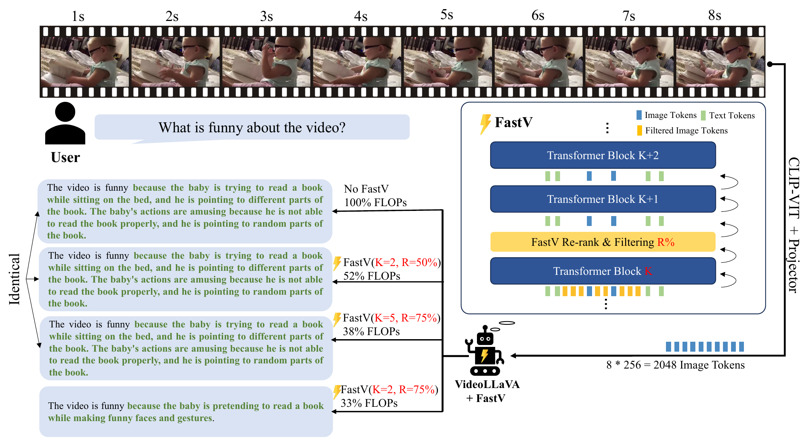
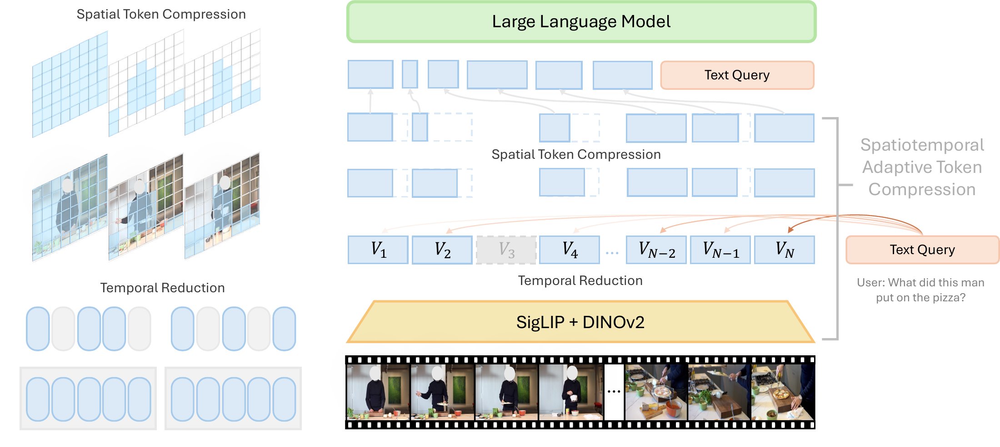

# 09 多模态与世界模型：先明确删掉的是哪种 token

[上一章：智能体](../08-agents/index.md) · [总论](../00-overview.md) · [下一章：系统部署](../10-systems/index.md)

图像、视频和语音通常先变成连续特征位置，再进入语言模型。这些位置常被称为视觉或音频 token，却不能与输出文字 token 直接一比一换算。本章关注在保持任务能力的条件下，减少必要输入位置和重复时空信息；世界模型相关路线则进一步研究怎样先聚合状态，再在有限预算下保留证据。

## 本章地图：同是压缩，操作的位置和信息不同



本图由主代理综合正文关系后使用 GPT-Image 生成；连线表示文中说明的流程、比较或待验证联系，不表示统一性能排名。

| 路线 | 代表方法 | 核心区别 |
|---|---|---|
| LLM层间剪枝 | FastV | 浅层先处理完整视觉输入，深层删除低分位置 |
| 视觉编码后选择与合并 | LLaVA-PruMerge | 以重要位置代表邻近/相似patch，并补充空间覆盖 |
| 时空分阶段压缩 | LongVU | 先去相似帧，再按文本选择空间信息，再处理跨帧冗余 |
| 查询相关语音压缩 | SpeechPrune | 先利用语音—文本相关性，再近似建模语音内部重要性 |
| 压缩前进行动态状态聚合 | LongVU-TTT | 在视频进入固定预算之前做因果快权重更新 |

2026年修订的多模态压缩综述按图像、视频、音频，再按变换、相似性、注意力和查询相关机制组织。这个分类比统一“删视觉token”更能解释方法差异；原实验仍需回到每种模型和任务。[综述](https://arxiv.org/abs/2507.20198v5)

## FastV：后面的层是否需要继续处理全部视觉位置

FastV 从注意力统计出发，观察一些LVLM中视觉位置在深层收到的注意力较少。方法先让前 $`K`$ 层处理完整输入，再按注意力相关评分删除一部分视觉位置，后续层处理缩短序列；system、instruction和输出位置不属于其删除对象。[原文](https://arxiv.org/abs/2403.06764v3)

注意力小不是因果上的“不重要”。可能是信息已经被转移到其他位置，也可能是在当前任务中没有被模型充分使用。FastV通过不同层和保留比例的下游实验验证剪枝，而不能只依据热图给每个patch独立的无损保证。

```python
# 教学用八个视觉位置的分数，保留四个后恢复位置顺序。
scores = [0.11, 0.04, 0.28, 0.02, 0.19, 0.06, 0.23, 0.07]
keep = sorted(sorted(range(8), key=lambda i: scores[i], reverse=True)[:4])
# [0, 2, 4, 6]；早期层仍处理全部8个视觉位置。
```

若共有 $`T`$ 层，前 $`K`$ 层输入长度为 $`n`$，后续为 $`n'`$，用单层计算估计 $`C(n)`$，则相对计算节省为：

```math
1-\frac{K C(n)+(T-K)C(n')}{T C(n)}.
```

总序列同时包含文字与视觉位置，所以 $`n'`$ 不能不加条件地写成对全部输入乘一个视觉保留比例。实际速度还受算子、batch和缓存实现影响。



[查看原图，可放大](../../assets/papers/2403.06764/fig-5-fastv.pdf) · [论文来源](https://arxiv.org/abs/2403.06764v3)

作者流程图展示剪枝在LLM层间发生。图像描述、VQA、MMMU及视频实验给出不同取舍，更早或更强剪枝也会损伤能力。其理论FLOPs曲线与A40等设备上的时延测试是不同证据，最终文字输出长度并非主测量对象。[精读](reference/FastV.md)

## PruMerge：重要patch作为代表，再收集相似信息

PruMerge在视觉编码与语言模型之间操作视觉特征。它利用CLS相关注意力等重要性信号选择显著位置，再依据key相似度把其他信息聚合到保留位置。PruMerge+补充空间均匀位置，缓解只看显著性时覆盖不足的问题。[原文](https://arxiv.org/abs/2403.15388v6)

可将聚合的核心作用表示为：

```math
\widetilde z_i=\sum_{j\in\mathcal N(i)}w_{ij}z_j.
```

$`\mathcal N(i)`$ 是与保留位置相关的邻域，$`w_{ij}`$ 表示聚合权重。这个示意不补造原文未明确的邻域数量或归一化约定。与直接删除相比，合并试图把部分被删位置的信息留下，但多个不同细节压到同一向量也可能相互干扰。


[查看原图，可放大](../../assets/papers/2403.15388/fig-pipeline.pdf) · [论文来源](https://llava-prumerge.github.io/)

图中选择、相似性匹配和聚合是连续步骤。若一个小物体不显著，均匀补点可能保留其位置；如果细节仍被合并抹去，最终问答会失败。正文的多任务、视频迁移和消融说明其条件，v6算法中有关补点规模的记号也存在需要谨慎解释的地方。[精读](reference/PruMerge.md)

FastV与PruMerge的区别首先在插入位置：前者用LLM浅层处理后的信息剪深层位置，后者在视觉特征进入LLM前选择/合并。把二者并列后，才容易提出可辨别的研究问题：同样保留预算下，收益来自任务条件、早期信息整合，还是空间覆盖。

## LongVU：先处理时间冗余，再处理空间冗余

LongVU面向长视频，利用DINOv2特征去掉相似帧，再通过文本相关信息决定帧特征的保留粒度，最后处理跨帧重复空间位置。顺序很重要：先删掉的帧，后面的空间选择无法再恢复其中的短暂事件。[原文](https://arxiv.org/abs/2410.17434)

```text
原视频帧 → 相似帧去冗余
         → 按问题相关性选择高/低分辨率信息
         → 跨帧空间压缩 → LLM回答
```

教学上可以想象十帧几乎静止、其中一帧出现关键动作：均匀采样可能漏掉这一帧，相似性压缩可能保留变化帧；但若关键物体很小、全帧特征差异也小，去冗余仍可能误删。文本相关性可以改善选择，却引入每个查询重新判断的成本。



[查看原图，可放大](../../assets/papers/2410.17434/main.pdf) · [论文来源](https://arxiv.org/abs/2410.17434v1)

作者结构图把视觉编码、时间筛选、空间选择和语言模型分开。VideoMME、MLVU等任务和正文消融支持这些组件的作用，但框架之间的训练数据、LLM和帧预算并非总能完全匹配；压缩比也不直接给出端到端延迟。[精读](reference/LongVU.md)

## SpeechPrune：查询相关性与语音内部关系是两个信号

SpeechPrune先比较语音特征和文本查询的余弦相似度，对约一秒的片段分配保留预算，再在片段内选择位置。若特征向量非零，基本相似性为：

```math
F_{ij}=\frac{s_i^\top t_j}{\|s_i\|_2\|t_j\|_2}.
```

这里 $`s_i`$ 是语音特征，$`t_j`$ 是查询特征。第二阶段使用第一层投影和二值化近似注意力，再减少语音位置。前一阶段利用查询关系，后一阶段考虑语音内部依赖；不能把两个分数都称为同一“重要性”。[原文](https://arxiv.org/abs/2412.12009)


[查看原图，可放大](../../assets/papers/2412.12009/fig1-method.pdf) · [论文来源](https://arxiv.org/abs/2412.12009v2)

原图的两次选择对应两种信息来源。对于“会议改到几点”的问题，包含时间的片段可能得到更多预算，但音频embedding的相似度并不是已经识别出的可靠文字标签。

SPIRAL包含1,012条样本，来自生成对话与语音合成，平均音频接近90秒；其分布不等于真实录音。原文Original对照截取30秒/750位置，第一阶段从更长音频选到相同基数，第二阶段再按PR剪枝。因此“PR=20%”不能写成仅删掉原始90秒音频的20%；困难子集也按特定模型的失败筛选，不能当作独立难度标签。[精读：基数、任务构造与主结果](reference/SpeechPrune.md)

## 2026 LongVU-TTT：先聚合，再在有限预算中保留证据

LongVU-TTT在视觉编码器和LLM之间加入因果的快权重更新，用卷积resampler在压缩前聚合时间信息，再结合均匀与变化感知选择保留帧。与仅选择静态特征的区别，是当前视频内容会改变中间状态。[原文](https://arxiv.org/abs/2608.25729)

可用一般更新形式理解快权重的角色：$`W_{t+1}=W_t-\eta\nabla_W\ell_t(W_t)`$，其中更新只使用当前及过去信息。这个简式解释测试时状态适应，不替代论文的分组卷积、具体目标和实现；梯度更新也属于内部计算成本。


[查看原图，可放大](../../assets/papers/2608.25729/architecture.pdf) · [论文来源](https://arxiv.org/abs/2608.25729v1)

论文比较卷积、MLP、注意力及状态模型等resampler，并在特定设置中先处理更多帧、再压到固定帧预算。分析表明快权重更像时间聚合状态，远处证据的作用会衰减，不能当作可靠的长期情景记忆。512到128是帧设置，实际视觉token和TTT计算仍需另记。[精读](reference/LongVU-TTT.md)

## 认识与行动入口

跨模态冗余有明确的任务和结构来源，但显著性、查询相关性、合并和动态状态各自可能损失不同信息。较稳定的研究做法是同时控制输入信息量、保留位置、模型和任务质量；仍有争议的是怎样保护短暂、小而关键或否定性的证据，以及怎样将输入位置节省转换为真实任务净收益。

小团队可先在同一公开模型中比较随机/均匀选择、重要性选择和合并，用短视频或语音检索任务检查关键事件是否被保留。报告原始帧/特征位置、送入LLM的位置、文字输出及选择器成本。世界模型或动态状态若只提高能力而没有测量相同预算下的净收益，应列为间接路线，不能用“记住更多”代替效率实验。
