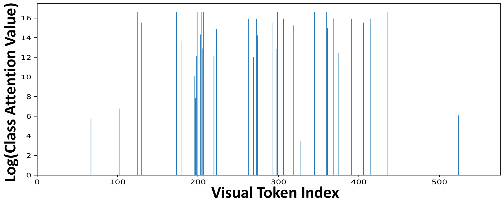
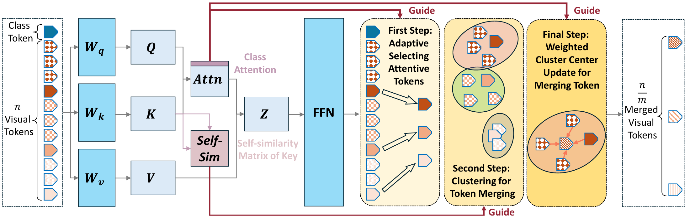
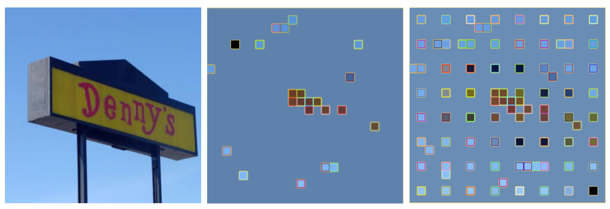

# LLaVA-PruMerge：面向高效大型多模态模型的自适应 Token 缩减

[所属章节](../index.md) · [来源与阅读状态](../../../sources/papers.json)

**作者**：Yuzhang Shang、Mu Cai、Bingxin Xu、Yong Jae Lee、Yan Yan  
**年份与固定版本**：2024 年首次提交；本文读取 arXiv:2403.15388v6，2026-01-31 修订。  
**原始链接**：[arXiv 2403.15388v6](https://arxiv.org/abs/2403.15388v6)，[作者项目页](https://llava-prumerge.github.io/)  
**实际阅读范围**：固定 PDF（12 页）、paper.txt、TeX 正文 0Abstract–5Conclusion，以及解释算法必需的 6Appendix（Algorithm 1 和 token 可视化）。参考文献未逐篇精读；实验数值以 v6 TeX/PDF 为准。

## 1. 问题与前作

LLaVA 类大型多模态模型（LMM）用 CLIP-ViT 将图像 patch 编成连续视觉向量，再经输入投影器映射到语言模型空间，与文本提示拼成 LLM 的输入前缀。LLaVA-1.5 在 $`336\times336`$ 图像上通常有 $`24\times24=576`$ 个视觉 tokens；Video-LLaVA 采样 8 帧、每帧 $`16\times16`$ 个 patch，共 $`2048`$ 个视觉 tokens。它们是图像 patch 的连续向量，不是回答文本中的离散词 token，也不能把视觉 token 数直接当成生成 token 数。

Transformer 自注意力对长度为 $`N`$ 的前缀形成 $`N\times N`$ 的分数矩阵。虽然 CLIP-ViT 相对于 Vicuna-7B/13B 较小，固定视觉前缀仍会增加 LLM prefill 的计算、激活和上下文长度；高分辨率图像与视频进一步放大问题。论文因此问：能否保留原 LLM 与视觉语义能力，同时删除大量冗余视觉 tokens？

早期小型 LMM、量化路线主要减少模型参数；ToMe、ATS、EViT 等单模态方法在 ViT 内部逐层减 token。本文的目标不同：让视觉编码器基本完成其计算，在末端一次性产生较短、信息密度更高的视觉前缀，从而直接减少 LLM 的输入长度。作者观察到 CLIP 的 [CLS] 对空间 patch 的注意力极其稀疏，于是提出 PruMerge；再以空间均匀 token 补回覆盖范围，得到 PruMerge+。

## 2. 模型、变量和重要性

输入图像切成 $`n`$ 个 patch。记 ViT 倒数第二层的 patch 输出为 $`\mathbf{Y}=\{\mathbf{y}_1,\ldots,\mathbf{y}_n\}`$，该层的 key、query 为 $`\mathbf K=\{\mathbf k_i\}`$ 和 $`\mathbf Q=\{\mathbf q_i\}`$。自注意力为

~~~math
\mathbf Y_{out}=\mathbf A\mathbf V,
\qquad
\mathbf A=\mathrm{softmax}\left(\frac{\mathbf Q\mathbf K^\top}{\sqrt{d_k}}\right).
~~~

对 [CLS] query 与全部 patch key，class attention 为

~~~math
\mathbf a_{cls}=\mathrm{softmax}\left(
\frac{\mathbf q_{cls}\mathbf K^\top}{\sqrt{d_k}}
\right).
~~~

$`a_{cls}[i]`$ 是第 $`i`$ 个空间 token 的分数。作者明确说使用 penultimate layer 的 class attention；$`\mathbf Y`$ 经过视觉到文本的投影器 $`\Theta_{X\to T}`$ 后才送入 LLM。PruMerge 位于视觉编码器末端，之后的投影器、LLM 和生成步骤不改。

### AITS：IQR 自适应选重要 token

把一张图中全部 $`a_{cls}[i]`$ 排序，令 $`Q_1,Q_3`$ 为第一、第三四分位数，$`IQR=Q_3-Q_1`$。上围栏为

~~~math
u=Q_3+1.5\,IQR .
~~~

因注意力非负，实际只用上围栏：$`a_{cls}[i]>u`$ 的 patch 被选中。索引集合记为 $`S`$，$`m=|S|`$。$`m`$ 随图像而变：蓝天中的简单广告牌可能只有少数高值 patch，含密集文字的屏幕会触发更多 patch。因而这里是按每图分布判定“异常重要”，不是跨图固定绝对阈值。

**教学算例（非论文样本）。** 若 8 个分数为 $`[0.01,0.02,0.01,0.03,0.02,0.02,0.20,0.50]`$，假设 $`Q_1=0.01,Q_3=0.03`$，则 $`IQR=0.02,u=0.06`$，最后两个 patch 被保留。图像换成文字更密的场景时，高值 patch 数可增加。

图 3(a) 的纵轴是对数尺度，显示多数 patch 接近零、少数处于高值尾部；图 3(b) 将这些位置映射回原图，文字区域常有更多标记。它是视觉 patch 的空间选择图，不是文本词重要性图。

## 3. TS：按 key 相似度合并被剪信息

高 attention patch 之外的 token 仍可能表达大目标的完整区域或背景结构。作者把保留 token 当作 cluster center，令相似的被剪 patch 回流到这些锚点。

每个 patch 的 key 作为表示，定义

~~~math
\mathrm{Sim}(\mathbf y_i,\mathbf y_j)
=\mathbf k_i\mathbf k_j^\top .
~~~

全体相似度是 $`\mathbf K\mathbf K^\top`$。对每个锚点 $`p\in S`$，找其 $`k`$ 个最相似 token，按它们各自的 class attention 做加权更新：

~~~math
\mathbf y'_p=\sum_{q=1}^{k}a_{cls}[j_q]\,\mathbf y_{j_q}.
~~~

因此输出是一组更新后的锚点向量，而不是 [CLS] 单向量。论文公式和 Algorithm 1 写的是 weighted sum，没有写权重和归一化，也没有在正文给出 $`k`$ 的具体值、重复近邻如何处理或 tie-breaking；这些应视为未报告的实现细节。

简化流程如下（只为追踪行为，未擅自补足论文未定义细节）：

~~~text
Y,K,Q = ViT_penultimate(image)
a = softmax(q_cls @ K.T / sqrt(d_k))
S = {i: a[i] > Q3(a) + 1.5*(Q3(a)-Q1(a))}
for p in S:
    Np = top_k_by_dot_product(K[p], K[j] for j != p)
    Yprime[p] = sum(a[j] * Y[j] for j in Np)
return [Yprime[p] for p in S]
~~~

图 2 的三步是：class attention/IQR 选择重要 token；以这些 token 为中心做 $`k`$ 近邻聚类；用加权向量更新中心。所有步骤在视觉编码器末端执行，LLM 只接收短序列。

## 4. PruMerge+：均匀补点及其记号问题

纯 PruMerge 的十倍以上压缩可能把低 attention 但有用的区域完全删掉。PruMerge+ 先得到 outlier 数 $`m`$，计算 $`r_o=m/n`$，再按该比例在图像网格中空间均匀抽取额外 token，与重要集合合并。这样以一部分压缩率换空间覆盖。

附录 Algorithm 1 写成先取 $`m`$ 个重要索引，再生成另一组空间 token $`\{i_{m+1},\ldots,i_{2m}\}`$；但 Ensure 仍说输出 $`m`$，所以 PruMerge+ 的 $`m/2m`$ 记号在论文伪代码层面不一致。正文结果把它描述为平均约四分之一视觉 tokens，本文不把该歧义改写成未经实现核实的精确预算公式。

作者在不同实验中报告了 5.5%（约 32/576）、6.9%（固定 40/576）和 25.0% 的比例；它们对应不同设置，不能混成单一结论。

图 3(b) 展示 PruMerge 与 PruMerge+ 的空间位置；后者在高 attention 锚点之外补充分散位置，因此覆盖更多背景。它支持空间覆盖的设计直觉，不证明每个 token 都是某项任务必需的。

## 5. 与 FastV、ViT 内部剪枝的界限

本文没有在 LLM 生成轨迹中删词。视觉 token 是 ViT patch 的连续向量，经投影后作为 LLM 前缀；PruMerge 的删除点在视觉编码器末端。

正文实际比较 ToMe、ATS、EViT 等 ViT 单模态 reduction：它们通常在多个视觉 Transformer block 内逐步减 token，直接省 ViT 内部注意力/FFN；PruMerge 让 ViT 基本完整运行，主要压缩后续 LLM 的视觉前缀。论文没有把 FastV 列为基线或方法对象，因此不能写成本文“击败 FastV”；公平比较需固定视觉层位置、最终预算、backbone、数据和评测协议。

作者给的差异理由是：ViT 分类可用一个 [CLS] 表示整图，而 LMM 需要一串 patch 保留细节；LMM 的主要计算来自 LLM；多模态编码器末层有可利用的稀疏性，逐层均匀剪枝未必能利用它。

## 6. 主实验：LLaVA-1.5

### 条件

主模型为 LLaVA-1.5，分辨率 336，语言骨干 Vicuna-7B 或 13B。作者用 LLaVA-1.5 instruction tuning data 做 LoRA 1 epoch；PT 列为 -，IT 为 665K。任务为 VQAv2、ScienceQA、TextVQA、POPE、MME、MMBench。完整 LLaVA 用 576 个视觉 token；PruMerge 数量自适应，表 1 以六任务平均约 32 个作概括；主表结果是微调模型，视频表则是训练自由插入。

### 表 1 的六任务结果

Vicuna-7B 完整 LLaVA 为 VQAv2/SQA/TextVQA/POPE/MME/MMB = **78.5/66.8/58.2/85.9/1510.7/64.3**；PruMerge 为 **72.0/68.5/56.0/76.3/1350.3/60.9**；PruMerge+ 为 **76.8/68.3/57.1/84.0/1462.4/64.9**。PruMerge 极限压缩下 SQA 略高，但 VQAv2、POPE、MME 明显掉分；PruMerge+ 恢复大部分差距，却不是逐项无损。

Vicuna-13B 完整模型为 **80.0/71.6/61.3/85.9/1531.3/67.7**；PruMerge 为 **72.8/71.0/58.4/78.5/1428.2/62.3**；PruMerge+ 为 **77.8/71.0/58.6/84.4/1485.5/65.7**。结论是“少量视觉 token 保留大部分能力”，不是“每个任务都无损”。

### 表 2：成本测量范围

表 2 是 Tesla V100 上的 roofline-based LLM-Viewer 理论估计，场景是 576 visual + 40 text tokens；PruMerge 极端例子保留约 40 visual tokens（$`576/14.4\approx40`$）。它测 FLOPs、理论 prefill、总显存、activation memory，不是端到端 wall-clock、输出 token 或训练成本。

Vicuna-7B FP16：完整模型 9.3 TB / 88.6 ms / 23.3 GB / 4.60 GB，PruMerge 0.91 TB / 15.3 ms / 13.7 GB / 0.28 GB；INT4：完整 2.3 / 151.6 / 5.9 / 1.20，PruMerge 0.28 / 14.9 / 3.5 / 0.07。Vicuna-13B FP16：18.2 / 170.5 / 41.6 / 7.30，PruMerge 1.80 / 29.5 / 26.6 / 0.44；INT4：4.6 / 294.9 / 10.5 / 1.80，PruMerge 0.45 / 29.0 / 6.8 / 0.11（列依次为 FLOPs TB、prefill ms、总显存 GB、activation GB）。

INT4 的理论 prefill 受算术/带宽条件影响，不按量化位数或 token 比例线性推断。视觉编码器、IQR 和近邻计算的端到端额外开销没有单列；作者只说它可与量化、矩阵分解正交。

## 7. 视频泛化

Video-LLaVA 采样 8 帧、2048 tokens。作者在推理时直接加 PruMerge/PruMerge+，不重训视频数据；正文写平均重要 token 为 256（12.5%）和 256（25.0%），文字与补点伪代码的规模表达仍需谨慎。表 3：

|方法|MSVD-QA Acc/Score|MSR-VT-QA Acc/Score|ActivityNet-QA Acc/Score|
|---|---:|---:|---:|
|Video-LLaVA|70.7/3.9|59.2/3.5|45.3/3.3|
|+ PruMerge|71.1/3.9|58.4/3.5|48.3/3.4|
|+ PruMerge+|71.1/3.9|59.3/3.6|47.7/3.4|

压缩后部分任务上升，但两种方法在 MSR-VT-QA、ActivityNet-QA 的方向不同；这是三项 benchmark 的局部结果，不是视频 LMM 普遍因果证明。

## 8. 消融和失败/分析

### 采样策略

表 4 在相近视觉预算下比较动态选择、顺序采样和空间均匀采样：

|任务|方法/视觉 token 数|性能|
|---|---|---:|
|TextVQA|PruMerge 40；Sequential 40；Spatial 5×8/8×5=40|54.00；42.72；46.85/47.42|
|MME|PruMerge 40；Sequential 40；Spatial 5×8/8×5=40|1250.07；703.60；1180.23/1142.32|
|POPE|PruMerge 35；Sequential 35；Spatial 5×7/7×5/6×6|76.2；11.7；69.8/71.1/67.9|
|ScienceQA|PruMerge 16；Sequential 16；Spatial 4×4|68.07；64.20；66.29|

展平后取前缀尤其在 POPE 失败；空间采样更稳但低于 class-attention 选择。TextVQA 的优势与文字区域被密集选取一致，属于支持性证据而非独立因果证明。

### AITS 和 TS

表 5 固定 40 tokens（6.9%）：完整模型 SQA/TextVQA/POPE/MME = **66.8/58.2/85.9/1510.7**；AITS = **66.5/54.8/75.7/1221.6**；AITS+TS = **68.5/56.0/76.3/1350.3**。TS 让四项指标都从纯选择恢复，但仍低于完整模型的 MME、POPE；没有单独消融 key 归一化、$`k`$ 或权重归一化。

### 训练自由与微调

表 6：无 LoRA 为 **68.0/54.0/76.2/1250.1**，LoRA-FT 为 **68.5/56.0/76.3/1350.3**（SQA/TextVQA/POPE/MME）。微调帮助 LLM 适应新视觉序列；视频表则使用训练自由版，不能直接与主表当同一条件比较。

### 与 ToMe/ATS/EViT/CrossGet

表 7 在 25%：ToMe = **66.0/62.7/56.0/51.0/1385.2/56.9**，ATS = **66.7/63.0/55.1/57.4/1313.2/54.9**，EViT = **65.5/64.1/54.2/60.1/1299.3/56.2**，PruMerge+ = **76.8/68.3/57.1/84.0/1462.4/64.9**（VQAv2/SQA/TextVQA/POPE/MME/MMB）。50% 时 CrossGet = **77.3/66.7/54.9/83.9/1510.2/64.7**，PruMerge+ = **77.6/68.5/57.6/85.1/1507.1/64.9**。CrossGet 数值由作者直接取其论文，非本文独立复现。

## 9. 图资产

TeX 源包中的图已放到 assets/figures/，许可为 [arXiv non-exclusive distribution license](http://arxiv.org/licenses/nonexclusive-distrib/1.0/)；公开复用需保留来源和许可。

|标记|原图/来源文件|读图用途|
|---|---|---|
|fig:intro|Figure 1 / brief_cvpr.pdf|视觉前缀缩短和复杂度直觉|
|fig:pipeline|Figure 2 / pipeline.pdf|AITS→kNN→加权聚合|
|fig:attn_cls_dirtibution|Figure 3(a) / class-attn.pdf|稀疏尾部和 IQR|
|figure:visualized_to_prumerge_plus|Figure 3(b) / token_visualization_prumerge_plus.pdf|重点区域与均匀补点|
|fig:sampling|Figure 4 / tokenposition.pdf|动态、顺序、空间采样|
|fig:token_postion|Figure 5 / token_visualization.pdf|附录选中 token 位置|

## 10. 对 token 效率研究的关系

论文测的是视觉前缀压缩对 LLM prefill FLOPs、理论 prefill 时间、显存和 activation 的影响，并在 VQA/OCR/幻觉/视频 QA 上测任务分数。未测输出文本 token、隐藏思维 token、每题生成长度、失败轨迹、完整端到端 wall-clock 和连续任务成本前沿。因此“14.4 倍视觉 token 压缩”不能写成“14.4 倍总 token 或总推理成本下降”。

更合适的资源分解是：视觉上下文长度、LLM prefill 计算、输出文本长度、隐藏计算分别记录。PruMerge 的重要性来自视觉编码器 attention，压缩后仍是连续视觉向量；这与文本 token 预算属于不同轴。

## 11. 局限与可检验问题

1. 论文没有报告 $`m`$ 的逐样本分布、极端图像上的 IQR 稳定性，或注意力不稀疏时的退化。
2. $`k`$ 的值、key 是否归一化、权重和是否归一化、近邻重复处理未定义；PruMerge+ Algorithm 1 还混用 $`m`$ 与 $`2m`$ 输出记号。
3. 未验证 LLaVA-Next AnyRes、多图、其他视觉编码器或更大语言骨干。
4. 表 2 是理论 roofline 估计，不是端到端实机延迟；选择和近邻开销未单列。
5. 主表含 LoRA-FT，视频表和部分消融训练自由；5.5%、6.9%、25% 是不同实验设置。
6. 没有置信区间和多次运行方差；CrossGet 是外部数字。

可继续验证：固定最终视觉预算，分别替换 IQR、key 相似度、attention 权重和空间补点；报告逐图 $`m`$ 与实际 prefill wall-clock；把视觉 token、输出 token、隐藏计算做成独立成本曲线；并在 FastV 等方法上固定层位置和协议比较。
