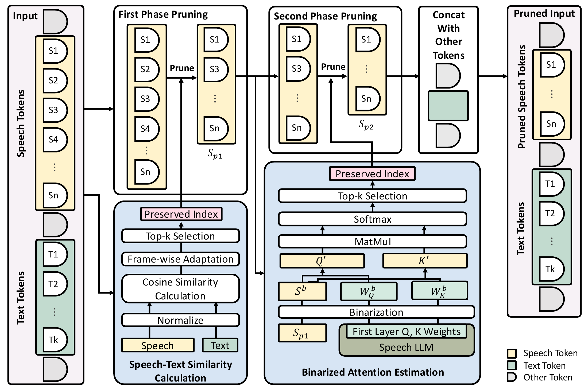
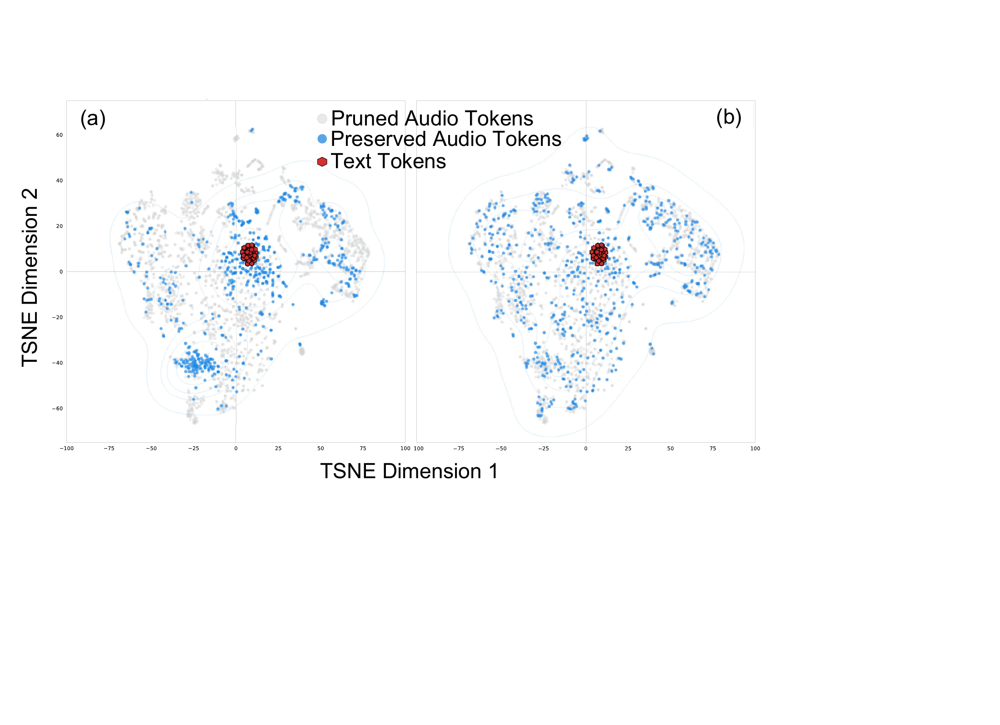
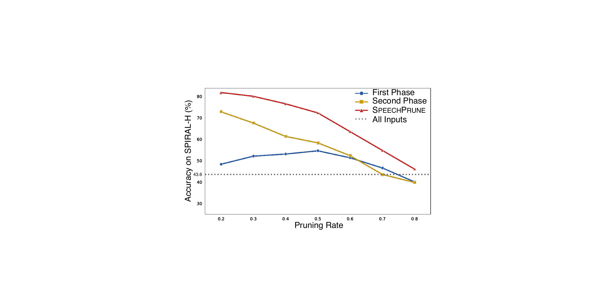

# SpeechPrune：面向语音信息检索的上下文感知 Token 剪枝

[所属章节](../index.md) · [来源与阅读状态](../../../sources/papers.json)


**作者**：Yueqian Lin、Yuzhe Fu（共同第一作者）、Jingyang Zhang、Yudong Liu、Jianyi Zhang、Jingwei Sun、Hai “Helen” Li、Yiran Chen（Duke University） <br>
**年份与固定版本**：arXiv v2，2025-03-30 在线版本（论文最初提交日期为 2024-12-16） <br>
**原始链接**：[arXiv:2412.12009v2](https://arxiv.org/abs/2412.12009v2)，[PDF](https://arxiv.org/pdf/2412.12009v2) <br>
**实际阅读范围**：固定缓存的 `paper.pdf`、`paper.txt` 和完整 LaTeX 正文（Introduction、Speech Information Retrieval、SpeechPrune、Experiments、Conclusion）；正文三幅图和两张表均已核对，附录不存在。参考文献只用于辨认前作，不将前作当成本论文实验。

## 1. 论文要解决什么问题

Speech LLM 把语音编码、跨模态融合和语言模型放在一个端到端系统里，因而能做识别、翻译、说话人和情绪等任务。但这些已有基准大多是短音频：论文引用 Dynamic-SUPERB phase-2 中 93% 的音频少于 30 秒，MMAU 和 AudioBench 的平均时长分别为 14.22 秒和 12.60 秒。作者关心的是更接近日常会议、讲座、访谈和客服录音的场景：用户给出一段很长的对话，再问一个只在某个未知位置出现的细节，例如“下周的活动约在几点？”模型必须在整段语音中找到相关片段并理解它。

论文把这一能力称为 **Speech Information Retrieval（SIR，语音信息检索）**。它同时考查两件事：定位长音频中的相关语音，以及理解相关语义后回答问题。长音频的瓶颈既是表示问题，也是计算问题：语音编码通常产生远多于文字的 token，后续 Transformer 自注意力的复杂度随序列长度呈 $`O(n^2)`$ 增长；论文用 Qwen2-Audio 的估算说明，约 10 分钟、约 15,000 个音频 token 需要 58.66 TFLOPS（SpeechPrune，方法部分，式（2）前后）。

作者的两个贡献因此是：

1. 定义 SIR，并构造约 90 秒长音频的 SPIRAL 基准；
2. 提出无需训练的 **SpeechPrune**，先用语音—文本相似度去除语义不相关 token，再用第一层的二值化近似注意力在剩余语音 token 中继续选择。

论文的核心主张需要精确读：在 SPIRAL 上，剪掉第二阶段目标输入的 20% 时，SpeechPrune 的准确率比原始模型高 28.85 个百分点（89.23% 对 60.38%，论文写作“nearly 29%”），比随机音频剪枝 RAP 高 46.74 个百分点（89.23% 对 42.49%）；在剪掉 80% 时仍有 62.45%。这不是一个已经被训练出的新模型，而是把选择操作插入现成 Speech LLM 输入侧的 training-free 方法。

## 2. SIR 任务与 SPIRAL 基准

### 2.1 任务定义

长语音写成按时间连续的片段 $`A=(a_1,\ldots,a_n)`$，问题为文本查询 $`q`$。某个关键事实位于未知位置 $`a_l`$，模型只能看到完整的 $`A`$ 和 $`q`$，输出正确答案：

```math
r^* = f(A,q).
```

为了让评测答案无歧义，SPIRAL 的每道题都是四选一，候选集合为 $`R={r_1,r_2,r_3,r_4}`$。这使准确率既反映能否找到关键位置，也反映能否理解问题和选项。作者说任务也可以推广到开放式问答，但本文没有报告开放式指标。

### 2.2 数据怎么构造

SPIRAL 有 1,012 个样本，平均音频时长 87.89 秒。场景分为讲座、会议和日常对话；每个场景再按更细的主题组织成层级主题结构。构造分为两阶段：

- **文本对话生成**：先人工/规则式整理覆盖日常生活、专业交流和社会互动的主题，再用 GPT-4o 生成多轮对话。提示要求有可变轮长、上下文连续性和口语填充词（如 “uh”“oh”），并同时生成四选一问题。论文把这种设计作为口语真实性的来源，但正文没有给出主题数量、每个场景的样本配额、问题位置分布或 GPT-4o 提示全文。
- **语音合成**：用 StyleTTS 2 将对话合成连续语音。说话人随机从 LibriTTS 的 train-clean-100 选择，并称按性别均衡；固定扩散步数和 embedding scale，拼接各轮以保持连续性。故这是 GPT-4o 生成文本 + StyleTTS 2 合成语音的 benchmark，不是自然录音采集，也不是完全人工标注的长会话。

质量检查包括 Whisper-v3-large 的词错误率 WER=0.0389，以及 UTMOS-22 预测的五分制 MOS=3.91（SIR，Quality Assessment）。这说明合成语音在自动转写和感知质量上看起来较好，但并不等价于真实录音域的稳健性。

SPIRAL-H 是 401 个样本的困难子集，定义方式是：在本文实验中，未经剪枝的 Qwen2-Audio 在这些样本上完全失败，因此其准确率为 0%。这一定义使 SPIRAL-H 特别适合看剪枝能否恢复“原模型找不到的关键信息”，但它同时是**以某个模型的失败为条件筛选**的子集，不能直接当成独立、模型无关的难度标签。

## 3. 音频 token 与成本的基准关系

方法部分以 Whisper 为例解释时间分辨率：25 ms 窗长、10 ms hop 的 80 通道 mel 频谱输入 Transformer 编码器，后接 stride=2 的池化；最终每个编码输出约对应原始音频 40 ms，因此 30 秒音频约有 750 个编码 embedding。音频 embedding 再经过 MLP 或 Q-Former 投影到与文字 token 相同的维度，随后和文字 token、系统提示拼接进入 LLM。

这里必须区分三个量：

- **音频 token 数**：编码器输出的语音帧数；约 40 ms 一帧，因此 30 秒约 750，87.89 秒若按同一换算约 2,197，但论文没有把该平均原始 token 数作为表格列报告；
- **保留率**：在一个明确的输入基数中保留的比例；
- **剪枝率 PR**：删除的比例。

主实验的“Original”不是把约 90 秒全量送进模型，而是把音频截到 30 秒（750 token）。SpeechPrune 的第一阶段先从更长音频中选到与 Original 相同的 750 token；第二阶段再按表中的 PR 删除。因而在实验设置语境下，PR=0.2/0.4/0.6/0.8 对应第二阶段大致保留 80%/60%/40%/20% 的 750-token 输入，即约 600/450/300/150 个语音 token。这个“第二阶段相对 750 的删除率”不能写成“删除了原始 90 秒音频的 20%”；相对于约 2,197 个原始编码帧，实际删除比例还包括第一阶段筛选。论文没有明确把所有数据的原始帧数、最终帧数逐样本列出，因此上述 2,197 和最终数量是由时长/40 ms 与实验设置得到的教学近似，不是作者报告的完整统计。

论文的 TFLOPS、prefill time、显存均以最终拼接输入测量。主表的 TFLOPS 从 Original 的 12.2 下降到 PR=0.8 的 3.66，prefill 从 779 ms 到 278 ms，激活存储从 0.19 GB 到 0.04 GB。它没有测量输出 token 数、生成总长度、端到端 wall-clock、训练成本或每个样本实际删除的原始 token 数；所以这里的 token 效率证据主要是输入侧序列缩短和模型前向成本，而不是完整任务成本曲线。

## 4. SpeechPrune：两阶段选择

### 4.1 第一阶段：语音—文本相似度保留语义相关帧

设剪枝前语音 embedding 为 $`\mathbf Sinmathbb R^{N\times D}`$，文本查询 token embedding 为 $`\mathbf Tinmathbb R^{L\times D}`$。这里 $`N`$ 是语音 token 数，$`L`$ 是查询 token 数；作者明确排除系统提示和特殊 token，只使用真实文本 query。每个语音 token 与每个查询 token 做余弦相似度：

```math
\mathbf F = \frac{\mathbf S}{\|\mathbf S\|_2}\cdot
\frac{\mathbf T^\top}{\|\mathbf T\|_2},
\qquad \mathbf F\in\mathbb R^{N\times L}.
```

每个 $`F_{u,v}`$ 衡量第 $`u`$ 个语音 token 是否像第 $`v`$ 个查询 token。直接逐 token 选最高分可能产生时间上零散的片段，因此作者按约一秒分帧。若每秒有 $`f`$ 个编码 token，帧数 $`m=\lceil N/f\rceil`$；根据 40 ms/帧的说明，$`f`$ 在 Whisper 示例中约为 25，但正文公式没有另行明确给出实验实现值。对第 $`i`$ 个帧，把其中每个语音 token 对所有文本 token 的平均相似度相加：

```math
\hat F_i=\sum_{j=0}^{f-1}
\mathrm{mean}(F_{i f+j,:},\mathrm{axis}=1).
```

再以帧级分数做 softmax，得到帧的预算分布 $`p`$，并为每帧分配预算 $`n_i=\lfloor Np_i\rfloor`$；在该帧内部按照 token 的平均相似度取 top-$`n_i`$：

```math
p=\mathrm{softmax}(\hat F),\qquad
\mathrm{indices}_{i}=\mathrm{topk}
\left(\mathrm{mean}(F_{if:(i+1)f,:},\mathrm{axis}=1),n_i\right).
```

保留的第一阶段序列为 $`\mathbf S_{p1}=\mathbf S[\cup_i\mathrm{indices}_i]`$。直观例子：查询是“会议改到周五几点？”，若某一秒里出现“Friday at 3 pm”，该帧的多个 token 会与 query 的 “Friday/time” 更相似，帧预算增加，帧内 top-k 更可能保留连续语义单元；与之相邻的寒暄帧得分低，预算变少。这个例子是对公式的教学演示，论文没有公布某个样本的真实相似度矩阵。

作者将一秒分帧与语音感知中的 1–2 Hz delta-band oscillation 联系起来，认为它与词汇/短语单位有自然对应关系。这里应区分作者的设计动机和严格保证：按帧选择保持时间索引顺序与局部连续性，但不保证保留后的 token 在原音频中连续，也不保证删掉否定词后语义永远不变。

公式中 $`N`$ 的记号有一处容易混淆：前文用 $`N`$ 表示剪枝前 token 数，而式（7）又说 $`N`$ 是“overall number of tokens to be retained”。正文没有另引变量（例如 $`N_{keep}`$）解决这一冲突。结合图 1、实验设置和表 I，应把式（7）中的 $`N`$ 理解为第一阶段目标保留总数，教学实现应显式分开 `N_before` 与 `N_keep`，并对 floors 导致的预算和不为目标总数作余数修正；论文正文未说明该修正的实现顺序。

### 4.2 第二阶段：第一层二值化近似注意力

第一阶段已经用 query 捕获语音—文本关系，第二阶段只在 $`\mathbf S_{p1}`$ 的语音 token 内建模 token 间依赖，避免再次把文字 token 放进这一步。取 Speech LLM 第一 Transformer 层的 $`W_Q,W_K`$，以及第一阶段的语音 embedding，逐元素取符号：

```math
(W_Q^b,W_K^b,S^b)=\mathrm{sign}(W_Q,W_K,S_{p1}).
```

用二值矩阵做近似投影：

```math
Q'=S^bW_Q^b,\qquad K'=S^bW_K^b,
```

再计算仅在候选语音 token 内的近似注意力：

```math
A=\mathrm{softmax}\left(\frac{Q'K'^\top}{\sqrt{d_k}}\right).
```

对每个候选 token 汇总其平均注意力（式（12）写成 $`\mathrm{mean}(A,\mathrm{axis}=1)`$），取 top-$`k`$ 得到最终语音序列：

```math
S_{p2}=S_{p1}[\mathrm{topk}(\mathrm{mean}(A,\mathrm{axis}=1),k)].
```

最后把 $`S_{p2}`$ 与其他必要 token（query、系统提示和特殊 token）重新拼接。图 1 显示的数据流是：完整 speech tokens → 相似度/帧预算 → $`S_{p1}`$ → 二值化 $`Q',K'`$ 和 softmax → $`S_{p2}`$ → 与文字/其他 token 拼接。二值注意力估计被作者称为不到总网络计算量的 1%，但正文没有给出层数、hidden size、实际计时或这一百分比的独立测量过程，因此只能当作作者的复杂度估计。

第二阶段的“注意力分数”不是原模型完整浮点第一层的真实 attention，也不是生成阶段的输出注意力；它是用 sign 后的权重和输入 embedding 算出的近似选择分数。第一阶段负责**与问题相关性**，第二阶段负责**候选语音 token 的内部重要性**，两者互补是论文对两阶段设计的解释。



**图 1 读图（原论文 Fig. 1，正文第 1 页图、方法 Section III）**：左侧输入含 speech tokens、text tokens 和其他 token；蓝色框是 speech-text similarity calculation，经过 normalize、cosine similarity、frame-wise adaptation 和 top-k 得到 preserved index；右侧黄色框是 binarized attention estimation，仅对 $`S_{p1}`$ 与第一层 $`Q/K`$ 权重二值化后做 MatMul/softmax/top-k；最后再拼接其他 token。图中没有画出训练模块，呼应 training-free 设定。原图来自缓存 LaTeX 的 `source/tex/figs/method.pdf`，已原样复制为 `assets/fig1-method.pdf`。论文声明页面许可为 CC BY 4.0（见 [arXiv 元数据](https://arxiv.org/abs/2412.12009v2)）；当前文件未裁剪，允许在遵守该许可和署名条件下复用。

## 5. 主实验：模型、比较对象与成本

主实验使用 Qwen2-Audio。论文比较：

- **Original**：完整方法输入被截成 30 秒/750 音频 token，作为原始模型基线；
- **RAP（Random Audio Pruning）**：随机选择非连续音频片段，达到目标输入率；
- **RAC（Random Audio Cropping）**：随机选一个连续片段，达到目标输入率；
- **Ours/SpeechPrune**：先从长音频选 750 token，再按 PR 做第二阶段选择。

计算指标为 TFLOPS（用 calflops 计算）、Quadro RTX6000 上的 prefill time，以及 LLM-Viewer 测得的 total memory 和 storing activation。表 I 中所有 PR 下前五个成本指标对 RAP、RAC 和 Ours 采用同一组值，说明成本比较匹配最终序列长度；随机方法与 SpeechPrune 的主要差异在保留哪些 token 和准确率。

### 5.1 表 I 的所有主结果

| 方法 | PR | TFLOPS | Prefill (ms) | Total memory (GB) | Activation (GB) | SPIRAL | SPIRAL-H |
|---|---:|---:|---:|---:|---:|---:|---:|
| Original（30 s/750） | — | 12.20 | 779 | 13.40 | 0.19 | 60.38% | 0% |
| RAP | 0.2 | 10.06 | 662 | 13.32 | 0.15 | 42.49% | 21.45% |
| RAC | 0.2 | 10.06 | 662 | 13.32 | 0.15 | 65.71% | 48.13% |
| **SpeechPrune** | **0.2** | **10.06** | **662** | **13.32** | **0.15** | **89.23%** | **81.64%** |
| RAP | 0.4 | 7.93 | 511 | 13.24 | 0.11 | 42.89% | 22.19% |
| RAC | 0.4 | 7.93 | 511 | 13.24 | 0.11 | 62.45% | 41.90% |
| **SpeechPrune** | **0.4** | **7.93** | **511** | **13.24** | **0.11** | **85.97%** | **76.43%** |
| RAP | 0.6 | 5.79 | 419 | 13.17 | 0.07 | 42.39% | 21.45% |
| RAC | 0.6 | 5.79 | 419 | 13.17 | 0.07 | 58.20% | 35.41% |
| **SpeechPrune** | **0.6** | **5.79** | **419** | **13.17** | **0.07** | **75.89%** | **63.77%** |
| RAP | 0.8 | 3.66 | 278 | 13.09 | 0.04 | 45.26% | 23.19% |
| RAC | 0.8 | 3.66 | 278 | 13.09 | 0.04 | 55.83% | 33.67% |
| **SpeechPrune** | **0.8** | **3.66** | **278** | **13.09** | **0.04** | **62.45%** | **46.15%** |

表 I 的 PR、TFLOPS、时间和显存是单次设定的测量；SPIRAL/ SPIRAL-H 是四选一准确率。不能把 SPIRAL-H 的 0% Original 与“模型完全不能做长音频”混用：SPIRAL-H 本身就是按这个模型失败筛出的 401 题。主要趋势如下：

- PR=0.2 时 SpeechPrune 达到 SPIRAL 89.23%、SPIRAL-H 81.64%；相对 Original 是 +28.85/+81.64 个百分点，相对 RAP 是 +46.74/+60.19 个百分点。相对提升百分比要另算，论文的“29%/47%”更接近百分点表述，不应写成严格的相对百分比。
- PR=0.4 时仍为 85.97%/76.43%；PR=0.6 时为 75.89%/63.77%；PR=0.8 时降到 62.45%/46.15%，但仍高于同一 PR 的 RAP（45.26%/23.19%）和 RAC（55.83%/33.67%），在 SPIRAL 上还高于 Original 60.38%。
- 成本随最终音频 token 数单调下降：从 12.2 到 3.66 TFLOPS（论文称约少 70%）、779 到 278 ms（约少 64%）、0.19 到 0.04 GB 激活（约少 79%）。总显存仅从 13.40 到 13.09 GB，下降很小；因此不能把 activation saving 写成同等幅度的 total-memory saving。
- RAP/RAC 的准确率并不随 PR 平滑下降，例如 RAP 的 SPIRAL 在 0.2/0.4/0.6/0.8 为 42.49/42.89/42.39/45.26%，这支持作者关于随机选择不稳定的观察，但它也说明仅用四个预算点不能证明一般的单调规律。

论文没有报告 RAP/RAC 的随机种子、重复次数、置信区间，也没有按样本报告保留片段位置；因此表 I 适合作为一次实验比较，不能据此给出随机基线方差或统计显著性。

## 6. 可视化、消融与跨数据集泛化

### 6.1 t-SNE 定性分析



**图 2 读图（原论文 Fig. 2，正文第 5 页）**：作者从 SPIRAL 一个样本取 token embedding，用 t-SNE 降到二维；横轴为 TSNE Dimension 1，纵轴为 TSNE Dimension 2。灰点为被剪掉的 audio tokens，蓝点为保留的 audio tokens，红点为 text tokens。(a) SpeechPrune，(b) random pruning。SpeechPrune 的蓝点更集中地围绕红色 text 点，随机剪枝的蓝点分散；作者据此把“保留 token 与 query 语义关系更紧”作为定性支持。t-SNE 是单样本、二维投影，不能作为精确相似度或因果证明。图源为 `source/tex/figs/qualitative_analysis.pdf`，已复制为 `assets/fig2-qualitative-analysis.pdf`，未裁剪；按论文 arXiv CC BY 4.0 元数据允许在署名条件下复用。

### 6.2 两阶段消融

消融在 SPIRAL-H 上比较三种变体：只第一阶段、只第二阶段、完整两阶段。图 3 的横轴是 PR=0.2、0.3、0.4、0.5、0.6、0.7、0.8，纵轴是 SPIRAL-H accuracy (%)；虚线“all inputs”是完整未剪枝输入，准确率 43.6%。这里的 all inputs 和表 I 的 Original 0% 不矛盾：表 I 的 Original 是 30 秒截断的 Qwen2-Audio，并且 SPIRAL-H 的定义把它筛成 0%；图 3 的 all inputs 是用于该消融的另一“完整未剪枝集合”，论文没有详细交代其具体输入长度/预处理差异，读者不应强行把两个基准点视为同一个实验条件。



**图 3 读图（原论文 Fig. 3，正文第 6 页）**：蓝色圆点是 First Phase，黄色方块是 Second Phase，红色三角是完整 SpeechPrune。完整方法在 0.2/0.3/0.4/0.5/0.6/0.7/0.8 约为 81.64/81/77/72/62/54/46%，只第一阶段约为 48/52/53/55/51/45/40%，只第二阶段约为 73/68/61/58/52/43/39%；正文明确给出 PR=0.2 的 48.13%（第一阶段）和 72.45%（第二阶段），以及完整方法 81.64%。图中完整方法在约 0.7 前保持优势，0.8 时三者趋于相近。作者的解释是第一阶段的跨模态相关性和第二阶段的语音内部注意力提供互补信息；这是合理机制解释，但并非单独的因果分解，因为两个变体还改变了候选集和预算分配。

### 6.3 跨基准、跨模型泛化

表 II 用 Qwen2-Audio 的 PR=0.2，以及 DiVA 的 PR=0.15；DREAM-TTS（DTTS）和 CN-College-Listen（CCL）只取音频时长超过 60 秒的样本（表中 *）。

| 模型 | SPIRAL | DTTS* | CCL* |
|---|---:|---:|---:|
| Qwen2-Audio | 60.38% | 53.69% | 52.91% |
| + SpeechPrune | **89.23%** | **65.19%** | **62.86%** |
| DiVA | 48.62% | 45.72% | 55.24% |
| + SpeechPrune | **57.51%** | **53.10%** | **56.19%** |

DREAM-TTS 来自 DREAM 文本对话阅读理解集再用 TTS 转语音，使用 60 个说话人并维持性别一致；CCL 来自 WavLLM 测试集，题目是中国高考英语听力理解。两者原本不是 SIR 专门基准，作者只选长于 60 秒的测试样本。SpeechPrune 在 Qwen2-Audio 上的绝对增益为 DTTS +11.50、CCL +9.95 个百分点；在 DiVA 上为 SPIRAL +8.89、DTTS +7.38、CCL +0.95 个百分点。CCL 上 DiVA 增益很小，说明“跨模型、跨基准一致改善”不能等同于效果幅度一致。正文没有报告这些子集的样本数、音频平均时长或每个 benchmark 的成本指标，也没有展示不同 PR 的泛化曲线。

## 7. 用一个教学排序例理解三种选择

假设长对话被编码成 8 个语音 token，问题是“活动改在周五几点？”；为便于演示，令一秒帧含 2 个 token。第一阶段先计算每个 token 对 query token 的平均余弦相似度：

| 帧 | token 平均相似度 | 帧累计分数（示意） | 直觉 |
|---|---|---:|---|
| $`S_1,S_2`$ | 0.05, 0.04 | 0.09 | 寒暄 |
| $`S_3,S_4`$ | 0.30, 0.28 | 0.58 | 提到周五 |
| $`S_5,S_6`$ | 0.45, 0.42 | 0.87 | 提到时间 |
| $`S_7,S_8`$ | 0.02, 0.03 | 0.05 | 结尾客套 |

softmax 后，$`S_3`$–$`S_6`$ 所在帧获得更多预算；若第一阶段目标保留 4 个 token，则在帧内 top-k 可能留下 $`S_3,S_4,S_5,S_6`$。这仍保留了“周五几点”的语义链，且帧的时间结构没有被任意打散。接着第二阶段不再看文本，而是用二值化第一层 $`Q/K`$ 估计四个候选 token 的相互支持度；如果 $`S_4`$ 和 $`S_5`$ 是连接日期和时间的关键内部节点，它们的平均近似注意力可能更高，最终 top-k 进一步留下 $`S_4,S_5`$。RAP 则可能随机留下寒暄 token，RAC 可能只截到对话开头。

这只是把论文公式改写成可跟踪的教学例子；论文没有给出真实 token 文本、相似度值或二值注意力矩阵，因此不能把该排序当成作者报告的实例。

## 8. 局限与对 token 效率研究的关系

论文的直接证据是：在合成长语音 SIR 上，query-aware 的输入选择可同时提高四选一准确率并降低模型前向成本。尤其 PR=0.2 的最强结果来自“先把约 90 秒压到 750，再从这 750 压到约 600”的输入预算；它不能简单概括为“任意语音都可删 20% 仍无损”。SPIRAL-H 是对 Qwen2-Audio 失败样本的条件子集，合成数据和 TTS 说话风格可能与真实会议有分布差异，t-SNE 只有单样本可视化，消融图的 all-inputs 与表 I Original 的关系也未完全说明。

从 token-efficient LLM 研究角度，SpeechPrune 测量的是**输入音频 token 数导致的 prefill/FLOPs/激活成本**；它没有测量输出 token、总生成 token、端到端延迟、失败重试、训练显存或完整任务成本，因此不能直接推断“每个正确答案的总 token 成本”或 Pareto 前沿。方法还依赖文本 query：没有 query 的语音摘要或纯转写场景不能直接套用第一阶段。它保留原始时间索引的子序列，却可能删除否定、转折或跨片段依赖；论文没有报告噪声、多人重叠说话、真实录音、极端口音或 query 为空时的失败率。

结论部分也承认需要在更多音频条件下提高鲁棒性，探索其他 token 选择方法，并让剪枝适配具体输入特征或经过微调的模型。因而较稳妥的结论是：SpeechPrune 提供了一个低额外计算、无需训练的语音输入 token 选择基线，证明跨模态相似度和近似语音内部注意力可以互补；其泛化范围、真实长音频效果以及完整任务级 token 成本仍未被正文建立。

### 正文图与资产定位

- ：原 Fig. 1，方法总览，LaTeX `secs/introduction.tex`，资产 `assets/fig1-method.pdf`；作者源图，未裁剪，CC BY 4.0 元数据，允许署名复用。
- ：原 Fig. 2，t-SNE 定性比较，LaTeX `secs/experiment.tex`，资产 `assets/fig2-qualitative-analysis.pdf`；作者源图，未裁剪，CC BY 4.0 元数据，允许署名复用。
- ：原 Fig. 3，两阶段消融，LaTeX `secs/experiment.tex`，资产 `assets/fig3-ablation-spiral-h.pdf`；作者源图，未裁剪，CC BY 4.0 元数据，允许署名复用。

正文没有其他实验图片；表 I 和表 II 已在上文按原表重排，分母均为对应 benchmark 的样本准确率，PR 的分母是实验设置中的目标输入（第一阶段 750-token 基数），而非完整 87.89 秒原始帧数。
