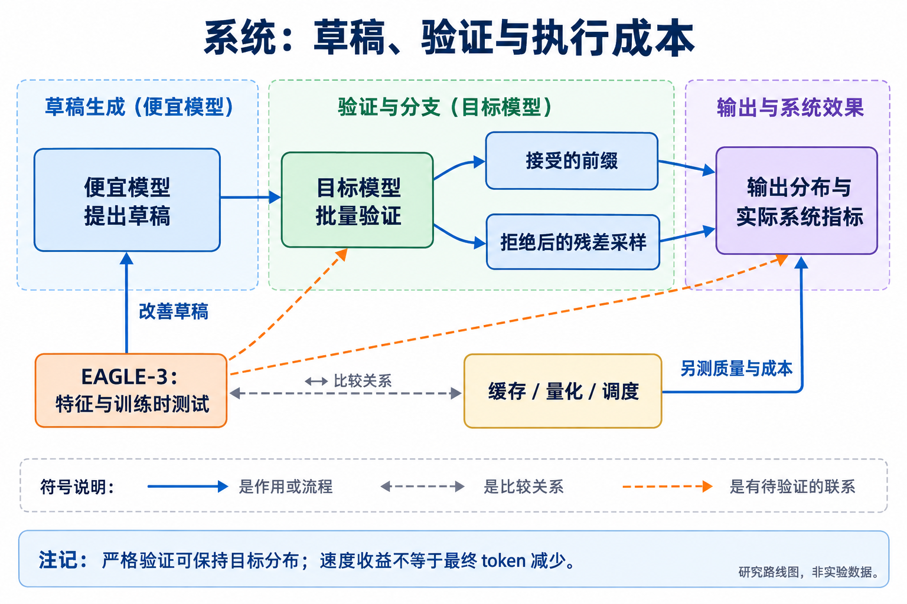

# 10 系统与部署：更快处理 token 与更少使用 token

[上一章：多模态](../09-multimodal/index.md) · [总论](../00-overview.md) · [下一章：评测](../11-evaluation/index.md)

系统优化可以让相同输出更快、更便宜地产生，也可以改变模型可使用的上下文和并发规模。本章保留这些路线，是为了说明它们与推理 token 目标的关系和可组合位置。吞吐、FLOPs、显存、费用和任务 token 分别报告，避免把一个轴上的收益换成另一个轴的结论。

## 本章地图：什么保持不变，什么被改变



本图由主代理综合正文关系后使用 GPT-Image 生成；连线表示文中说明的流程、比较或待验证联系，不表示统一性能排名。

| 路线 | 改变的对象 | 与推理 token 的关系 |
|---|---|---|
| 投机解码 | 草稿与验证的执行方式 | 正确实现下可保持目标输出分布，最终输出未必变短 |
| 特征辅助草稿 | EAGLE-3 | 改善草稿质量和接受率，仍需要目标验证 |
| KV/prefix缓存 | 历史计算的复用 | 逻辑输入可能不变，重复prefill和费用减少 |
| 量化与权重压缩 | 数值精度、存储与算子 | 能改变质量和速度；是否需要更多推理补偿要测量 |
| 批处理、并行与调度 | 请求如何共享硬件 | 延迟、吞吐、利用率不同，不能由并行度推导token节省 |
| 端侧与能耗约束 | 内存、功耗和通信环境 | 属于适用条件；能源收益不自动等于token收益 |

## 投机解码：便宜地提案，严格地验证

Speculative decoding 让便宜的模型 $`q`$ 提出候选，目标模型 $`p`$ 批量验证。若验证与拒绝后的采样正确执行，目标是保持 $`p`$ 的输出分布，同时减少昂贵模型的串行调用。[原论文](https://arxiv.org/abs/2211.17192v2)

考虑一个位置的离散分布，$`p`$、$`q`$ 都非负且总和为1。候选 $`x\sim q`$ 在 $`q(x)>0`$ 时以

```math
a(x)=\min\left(1,\frac{p(x)}{q(x)}\right)
```

接受。若拒绝，从归一化的正残差采样：

```math
r(x)=\frac{[p(x)-q(x)]_+}{Z},\qquad
Z=\sum_x[p(x)-q(x)]_+.
```

当 $`Z=0`$ 时两分布相同，拒绝事件概率为零，不应再计算这个分母。令接受概率 $`\alpha=\sum_x\min(p(x),q(x))`$，则 $`Z=1-\alpha`$。最终每个token的质量为接受部分与拒绝后补偿之和：

```math
\min(p(x),q(x))+(1-\alpha)r(x)=p(x).
```

这说明残差采样为什么重要。直接把所有草稿都接上，或拒绝后随意选一个词，都不会自动保持原分布。

```python
# 教学用二词表分布。
p = [0.7, 0.3]
q = [0.4, 0.6]
accepted_mass = [min(a, b) for a, b in zip(p, q)]  # [0.4, 0.3]
residual = [max(a - b, 0) for a, b in zip(p, q)]  # [0.3, 0]
final_mass = [a + b for a, b in zip(accepted_mass, residual)]
# [0.7, 0.3]；剩余0.3概率全补给第一个词。
```


[查看原图，可放大](../../assets/papers/2211.17192/figure1.png) · [论文来源](https://arxiv.org/abs/2211.17192v2)

作者图中的候选块按前缀依次接受，到第一次拒绝时使用对应修正；全部接受时还可利用目标模型多产生一个位置。每个目标条件分布都必须对应已经确认的前缀，不能把多个无条件候选概率混起来。

若用相同接受率近似每个位置，候选数为 $`\gamma`$，目标一次验证成本归一化为1，草稿每步成本为 $`c`$，则预期输出位置数与速度近似为：

```math
\mathbb E[N_{\mathrm{accepted+extra}}]
=\frac{1-\alpha^{\gamma+1}}{1-\alpha},\qquad
\text{speedup}\approx
\frac{\mathbb E[N_{\mathrm{accepted+extra}}]}{1+\gamma c}.
```

$`\alpha=1`$ 时第一项取极限 $`\gamma+1`$。这个模型依赖成本与接受率的近似，真实硬件、batch、序列和算子会改变收益。草稿太慢或接受率太低就可能不划算；候选数也不是越大越好。[精读：推导、主表与限制](reference/2211.17192.md)

对本地图尤其重要的是：目标输出分布保持时，最终回答的长度分布也保持。若还统计内部草稿和被拒候选，方法侧处理的token甚至可能更多。它提供的是执行效率，可与短CoT或输入压缩组合，但不能单独充当输出token减少的证据。

## EAGLE-3：让草稿在更接近部署的状态上学习

EAGLE系列利用目标模型的中间特征辅助草稿。EAGLE-3结合不同深度的信息，并通过 training-time test 改善训练与推理时的输入差异，让草稿学习面对自身预测带来的状态，而不只面对理想教师特征。[原论文](https://arxiv.org/abs/2503.01840)

可将多层特征融合的作用概括为 $`\widetilde h_t=W[h_t^{\mathrm{low}};h_t^{\mathrm{mid}};h_t^{\mathrm{high}}]`$。这些特征提供不同层次的条件信息，草稿仍需预测候选token，再由目标模型验证。融合本身没有取消最后的正确性约束。


[查看原图，可放大](../../assets/papers/2503.01840/fig-nofe-part-1.pdf) · [论文来源](https://arxiv.org/abs/2503.01840v3)


[查看原图，可放大](../../assets/papers/2503.01840/fig-nofe-part-2.pdf) · [论文来源](https://arxiv.org/abs/2503.01840v3)

作者图比较仅拟合特征和在训练中模拟测试过程的差别。前者可能在反复使用预测特征后累积误差；后者试图让训练更接近这种部署分布。它与OPD有共同的“训练/部署状态错配”问题，但模型角色、目标及最终验证机制不同。

论文在对话、代码、数学等任务、不同模型与serving配置上比较速度、接受长度和训练数据规模。设备说明中的个别冲突在精读中保留，不能自行补成一个统一平台。接受率更高仍不等于更短答案，最后输出的分布保证还依赖所采用的验证算法与采样模式。[精读](reference/2503.01840.md)

## 缓存、量化与系统选择怎样进入研究判断

缓存命中可以避免重复prefill，但请求的逻辑输入仍包含该历史。本库保留包含缓存的输入用量，并另报缓存命中、实际计算和费用；不通过改变计数口径制造前沿移动。量化则可能同时影响质量、显存和速度，如果模型因精度变化而多重试或多写推理，必须把任务级变化记录下来。

批处理和并行工具可以改变等待时间而不改变总工作量。端侧研究还会受到内存、功耗和数据传输约束；这些是有价值的工程目标，但本次地图只深入其与推理token存在明确联系的部分，不扩成完整系统优化综述。[相邻方向来源](../../sources/adjacent-map.md)

## 行动入口

适合小团队的验证是把一种行为压缩方法与一种执行加速方法正交组合，得到“原行为/短行为 × 原解码/投机解码”四组。同一模型和任务下分别测最终质量、输出token、内部提案、延迟与吞吐，避免把组合的所有收益归给一个组件。如果token降低而时延没有改善，应继续检查prefill、验证和硬件瓶颈；如果只更快而长度不变，就如实归入系统效率。
