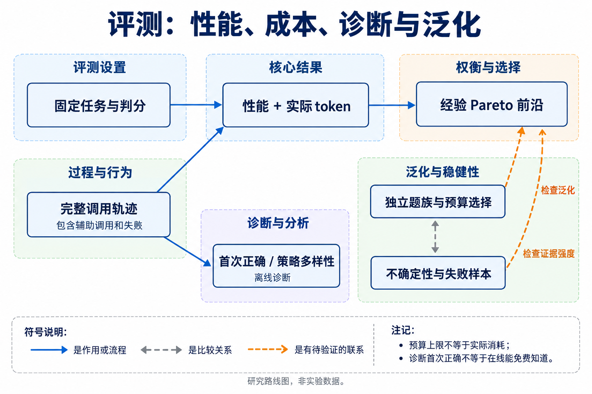
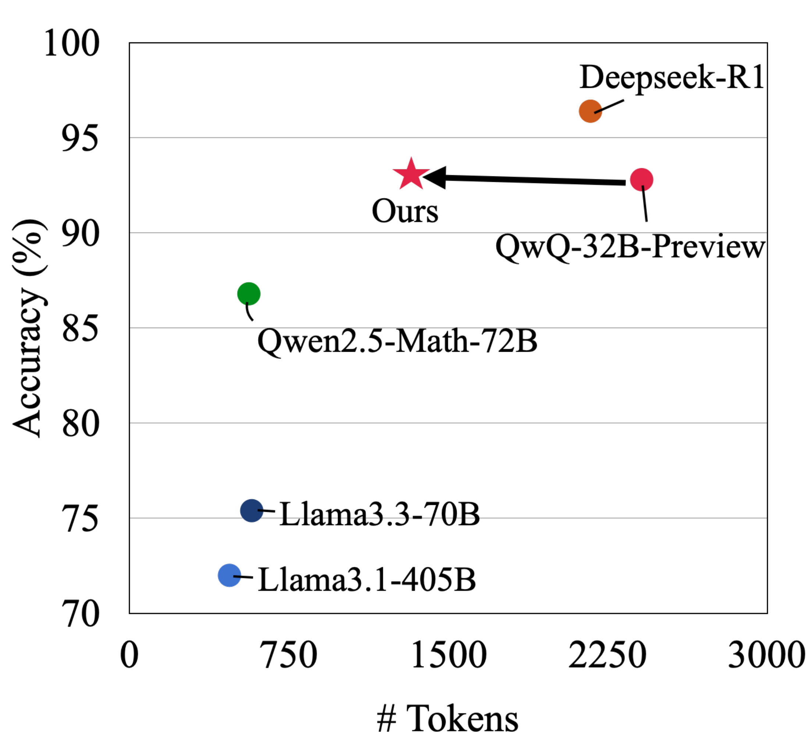

# 11 评测、诊断与可解释性：哪些证据支持前沿改善

[上一章：系统部署](../10-systems/index.md) · [总论](../00-overview.md) · [下一章：安全与可靠性](../12-safety/index.md)

效率研究至少需要同时回答两个问题：任务完成得怎样，为此实际用了多少token。过程指标可以解释失败和冗余，最终任务指标决定这些行为是否有用；单一综合分数不能代替二者的联合比较。

## 本章地图：任务、成本、过程与泛化



本图由主代理综合正文关系后使用 GPT-Image 生成；连线表示文中说明的流程、比较或待验证联系，不表示统一性能排名。

| 研究问题 | 代表入口 | 能回答什么 |
|---|---|---|
| 怎样联合优化与报告成本 | AI Agents That Matter | 开发与部署成本、Pareto工作点、基准过拟合 |
| 长响应里的增量贡献在哪里 | Overthinking诊断 | 首次正确位置、解法多样性及其统计分母 |
| 不同预算下是否都有效 | The Art、L1、test-time scaling研究 | 有限预算区间的取舍与能力保留 |
| 真实Agent是否完成任务 | AppWorld、WebArena、OSWorld、SWE类环境 | 环境状态、工具动作及判分，而非仅看最终文本 |
| 过程是否可解释 | 置信度、表示探针、因果消融 | 诊断线索与机制证据的不同强度 |

原有基准、真实样例和判分细节保留为[评测技术专题](../appendix/benchmark-guide.md)。来源与版本差异见[基准索引](../../sources/evaluation-map.md)，这些基准解决不同问题，不应拼成单一排行榜。

## 从预算上限到实际性能—成本点

固定题目分布、判分器和部署策略后，对多个配置记录 $`(C,S)`$。$`C`$ 是所有题的平均实际任务token，$`S`$ 是同一批题的性能；失败、超时和提前停止也保留在分母中。预算上限 $`B`$ 是配置，不自动等于实际消耗 $`C`$。

在已测试配置集合中，若另一配置成本不高、性能不低，且至少一项严格改善，原点被支配。没有被支配的点形成这个实验范围内的经验前沿。它不是所有可实现算法的理论最优前沿。

```python
# 教学点：质量相同而成本更低，或同成本质量更高，才构成支配。
def dominates(a, b):
    ca, sa = a
    cb, sb = b
    return ca <= cb and sa >= sb and (ca < cb or sa > sb)

dominates((700, .80), (1000, .80))  # True
dominates((500, .76), (1000, .80))  # False：这是取舍
```

单点同时改善可以支持局部结论；多个预算点更能判断是否只是选择了合适工作点、是否牺牲高预算能力。配置间性能接近时要报告不确定性；“没有显著差异”不等于已经证明等效。若使用不劣容差，应在比较前确定，不能看完数据再选择。

### 成本账的边界

部署中的摘要器、路由器、验证器、分支、子代理和重试都属于方法侧。独立评测grader、环境模拟用户和离线数据构造另列；同一个验证模型若在部署中决定选择哪个答案，就必须计入方法侧。

工具返回文本在被模型读入时计入输入，不能在工具返回和模型输入中无条件重复记两次；同一文本下一轮再次读入则再次计入。缓存命中的逻辑输入保留用量并单列缓存，隐藏reasoning用量不可得时标缺失。跨tokenizer、视觉位置与latent步另报共同参照与内部计算，不能强行相加成同质单位。

## AI Agents That Matter：评价会反过来塑造算法

这项工作指出只优化准确率会奖励昂贵的Agent设计；联合质量与成本、区分模型基准与真实应用、设计合适holdout，是研究结论的一部分。[原论文](https://arxiv.org/abs/2407.01502)


[查看原图，可放大](../../assets/papers/2407.01502/pareto-hotpot.png) · [论文来源](https://arxiv.org/abs/2407.01502v1)

作者图展示联合优化的候选工作点。HotpotQA实验中需要注意成功指标是检索到支持文档，不是独立测得的最终回答EM；原文的费用节省也不能按比例改成token节省。

训练或提示优化还有固定开发成本。若方法A的固定成本为 $`F_A`$、每次部署成本为 $`v_A`$，方法B相应为 $`F_B,v_B`$，使用 $`n`$ 次后的比较为：

```math
C_A(n)=F_A+n v_A,\qquad C_B(n)=F_B+n v_B.
```

当 $`F_A>F_B`$ 且 $`v_A<v_B`$，A需要足够使用次数才回本。这个线性模型要求相近任务、调用行为和单位成本；数据分布或价格变化后要重估。小团队尤其需要知道一次性教师生成、调参和训练能否被未来部署摊销。[精读](reference/AI-Agents-That-Matter.md)

## 过度推理诊断：正确性和新策略是两个分母体系

《Do NOT Think That Much for 2+3=?》把长响应分成多个解法，观察首次正确和后续策略的新颖性。它的诊断对象是可见输出，经外部模型分段/聚类，不能直接当作真实内部思维过程。[原文](https://arxiv.org/abs/2412.21187v2)

设共有 $`N>0`$ 条响应，第 $`i`$ 条总长为 $`T_i>0`$，$`\sigma_i`$ 表示其中是否出现过正确解，$`\widehat T_i`$ 是到首次正确解为止的前缀长度。其outcome efficiency为：

```math
\xi_O=\frac1N\sum_{i=1}^N\sigma_i\frac{\widehat T_i}{T_i}.
```

错误响应贡献0；正确响应在已经出现答案后继续增长，会降低这个比率。它衡量的是作者定义的前缀有效比例，不是部署时能免费知道何时第一次正确。若要把诊断变成在线停止器，还需要一个有成本、有错误的判定机制。

过程效率把提供新策略的解法所含token记为 $`D_i`$，定义：

```math
\xi_P=\frac1N\sum_{i=1}^N\frac{D_i}{T_i}.
```

这里不乘正确性，因此高多样性可能伴随错误。教学例中三段长度为4、5、6，第一段已正确，则单条outcome为4/15；若三段策略都不同，process可为1，若最后一段重复第一段则为9/15。两个量不能合并成“真实思考效率”。


[查看原图，可放大](../../assets/papers/2412.21187/figure-1-token-accuracy-part-1.pdf) · [论文来源](https://arxiv.org/abs/2412.21187v2)



[查看原图，可放大](../../assets/papers/2412.21187/figure-1-token-accuracy-part-2.pdf) · [论文来源](https://arxiv.org/abs/2412.21187v2)

原文的模型/任务比较显示冗余与准确率收益可以并存，困难题上的反思仍可能有用。首次正确位置分布只在存在正确解的响应中归一化，第 $`m`$ 个解法的新颖性只在拥有第 $`m`$ 段的响应中计算，不能外推为全部测试题的成功概率。外部分段与聚类模型的误差和成本也需要考虑。[精读](reference/Do-NOT-Think-That-Much-for-2-plus-3.md)

## 可解释性如何支持机制判断

注意力热图、token置信度、latent词表投影和案例都能提出机制假设，却有各自的选择条件。例如只在答对题上查看中间结果命中率，不能推出所有题上都拥有相同可解释性；低注意力也不证明某位置可被独立删掉。要支持因果解释，应通过受控消融或干预区分替代原因，同时保留性能与成本。[DeepConf](../06-reasoning/reference/DeepConf.md) · [CODI](../04-architecture/reference/CODI.md)

## 研究协议与否证条件

一项可审计的效率比较至少固定或明确记录：模型与版本、tokenizer、数据划分和题族、提示、采样、实际预算、所有辅助调用、判分器及失败处理。训练题、参考答案和测试时oracle信息不得悄悄进入部署条件；基础模型的未知预训练暴露则如实标为未知。

小团队可先用一组数学/代码题和一个短工具环境，比较同预算原模型、简洁提示、现成效率方法及新方法。保留成对逐题记录，再按难度、成功/失败和任务类型汇总。若总体节省来自更多失败、遗漏辅助调用、换计量单位或测试集调参，结论应相应收缩。地图本身通过最近邻、失败条件和证据冲突帮助选题，不声称已经通过读者实验测得idea重复率下降。
