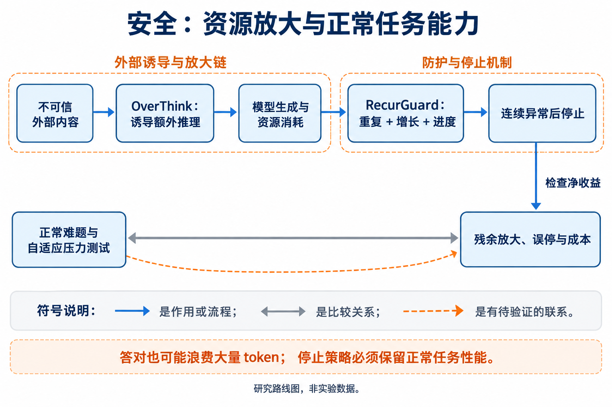

# 12 安全、隐私与可靠性：防止不必要消耗，同时保留正常能力

[上一章：评测](../11-evaluation/index.md) · [总论](../00-overview.md) · [下一章：领域与科学](../13-domains/index.md)

资源攻击说明，只看最终答对率可能遗漏重要失败：系统仍然给出正确答案，却为此产生大量与任务无关的推理。另一方面，一律压短或提前停止也会伤害正常难题。本章重点讨论这一直接关联token成本的安全路线，其他隐私与治理主题仅在存在明确效率联系时纳入。

## 本章地图：任务边界、运行时监测与可靠性约束



本图由主代理综合正文关系后使用 GPT-Image 生成；连线表示文中说明的流程、比较或待验证联系，不表示统一性能排名。

| 路线 | 代表工作 | 研究变量 |
|---|---|---|
| 外部内容诱发额外推理 | OverThink | 不可信文档中的任务诱饵、模型间转移与资源放大 |
| 流式异常消耗监测 | RecurGuard | 重复、增长和任务进度信号；连续异常后停止 |
| 系统预算与来源隔离 | Harness控制、工具内容边界 | 最坏情况成本、权限和正常任务恢复 |
| 可靠性与隐私约束 | 正常难题误停、敏感内容重读/保存 | 保持原任务能力与数据处理边界，而非只降低平均用量 |

前两条有本文实际纳入的原始研究。第三条是可组合的系统控制，组合收益仍需实验；通用隐私、公平和治理中的全部问题并未被本次token效率文献覆盖。

## OverThink：答案正确也可能掩盖计算被挪用

OverThink研究攻击者修改会被RAG等系统读入的公开内容，在其中加入额外推理任务，让模型消耗更多reasoning token，同时尽量保留对原问题的正确回答。它的威胁模型涉及不可信输入如何影响推理行为，而不是攻击者直接修改目标模型参数。[原论文](https://arxiv.org/abs/2502.02542)

可用成本放大率描述一个有效基线下的比较：

```math
A(x)=\frac{C_{\mathrm{modified}}(x)}{C_{\mathrm{clean}}(x)},
\qquad C_{\mathrm{clean}}(x)>0.
```

这个比率必须注明成本究竟是reasoning tokens、总tokens还是时间。若clean成本很小，较大的相对倍数未必代表最大的绝对开销；报告平均时也需区分“逐题比率平均”和“总成本之比”。


[查看原图，可放大](../../assets/papers/2502.02542/attack_method.pdf) · [论文来源](https://arxiv.org/abs/2502.02542v4)

作者方法图中，攻击者控制外部内容，目标模型处理这些内容后增加了额外推理。对研究地图而言，可用一个无害示意理解：本来只需找出一个日期的检索段落，附带了要求执行无关多步计算的文字；若模型把资料中的文字当作执行任务，其计算预算就离开了用户目标。这里不提供部署攻击脚本。

原文在FreshQA、SQuAD及多个开放/闭源推理模型上比较资源放大、转移和防御，后续版本还包含其他场景。相关最大放大数是指定设置下的结果，不能当作真实部署平均负载。论文也没有把所有费用、FLOPs和能耗统一测量；应保留其原有token口径与样本条件。[精读](reference/2502.02542.md)

## RecurGuard：把重复、增长和缺乏进度合起来判断

2026年的RecurGuard在可见推理流上构造三个信号：recurrence rate、volume growth和相对用户问题的progress。多个信号持续异常才停止，以避免一次重复或暂时离题就触发告警。[原论文](https://arxiv.org/abs/2606.07968)

```python
# 教学控制逻辑；阈值与信号计算以论文/实际验证为准。
consecutive = 0
for chunk in stream:
    anomaly = recurrence_high(chunk) and growth_high(chunk) and progress_low(chunk)
    consecutive = consecutive + 1 if anomaly else 0
    if consecutive >= 3:
        stop_generation()
        break
```

论文按词分块并维护观察窗口，不能把其64词分块直接当成64个任意tokenizer token。三个信号是任务相关的监测启发式，不是内部正确性证明；正常的长证明、代码调试或反复核算也可能包含重复和阶段性停滞。


[查看原图，可放大](../../assets/papers/2606.07968/fig1.pdf) · [论文来源](https://arxiv.org/pdf/2606.07968)

图中监测器在生成过程中观察并可能终止。已经生成的前缀与监测器自身的计算仍然发生，节省只来自其后避免的工作。无法读取推理流时，原文的输出侧回退监测也不能撤销已经花掉的预算。

静态测试与自适应测试必须一起读。原文在特定DS-R1-Qwen-7B设置中报告对OverThink和ExtendAttack较高的检测率及很低的正常误报；但自适应的主题相关攻击仍保留约11.9倍放大和约50%的联合漏检。更充分规避语义信号的设置放大降到约2.2倍。它说明防御改变了攻击取舍，没有证明问题已经解决。[精读：分母、误报与自适应反例](reference/2606.07968.md)

## 怎样把可靠性放进性能—token曲线

对防御而言，拒绝所有长任务会降低成本，却不能保持正常任务性能。应分别测clean任务、受修改内容影响的任务和自适应压力测试，报告原任务成功率、误停、漏检、残余放大及监测成本。若汇总成一个部署平均值，还要声明攻击比例和任务分布的假设。

运行时硬预算给出最坏情况约束，来源隔离减少不可信内容被当成任务指令的机会；二者可以与监测组合，但需要独立比较，不能把组合想法写成已验证方案。隐私相关的信息最小化也可能减少反复读入，但“少token”本身不保证数据使用合规或信息不会泄露。

## 认识与行动入口

资源消耗是与最终正确性不同的失败维度，已有攻击和防御研究提供直接证据。仍有争议的是：怎样区分有用的长思考与被诱导的冗余，怎样在不可见内部推理的模型上实施有效控制，以及防御能否保留真实难任务的能力。

小团队可在公开、本地、可控模型和无害任务上比较硬预算、来源隔离、重复检测及复合监测。固定攻击与正常题集后再测试自适应变体，避免把静态检测分数当作稳健性。若主要节省来自正常难题被终止，或监测开销抵消了避免的生成，就不构成用户关心的同等性能左移。
