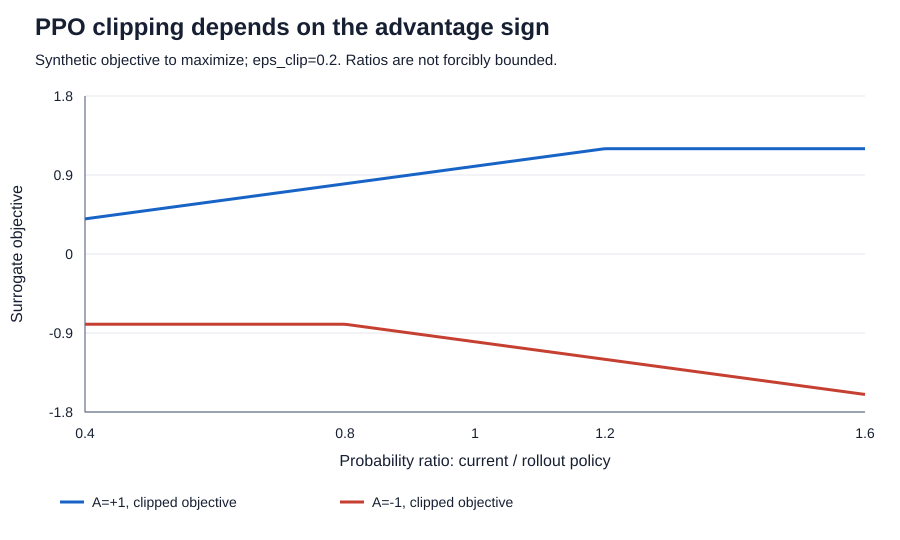
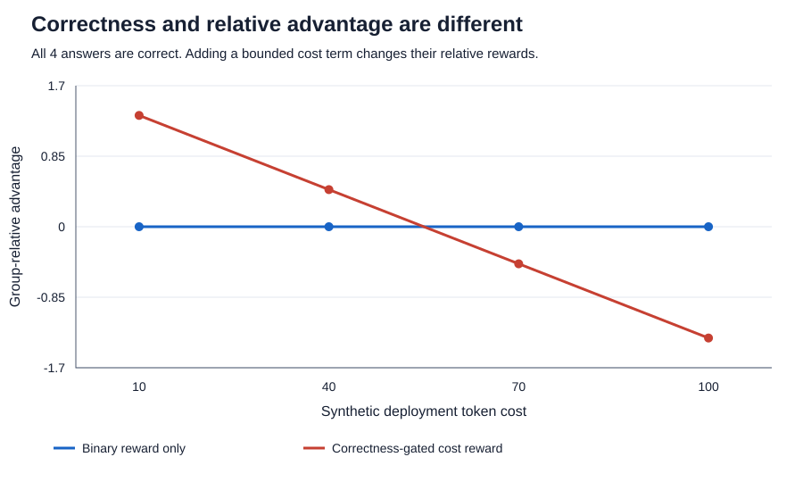
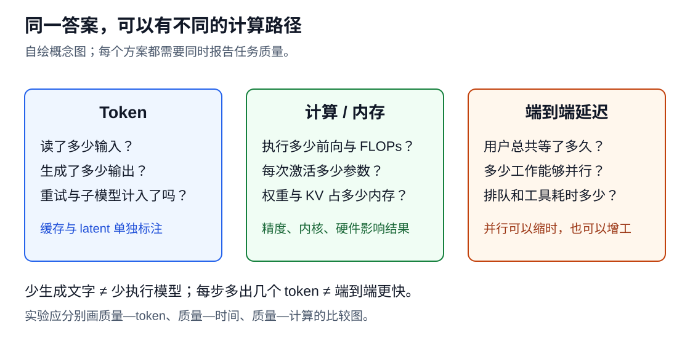

# 数学基础与成本定义

[附录目录](README.md) · [当前研究地图](../README.md)

本页集中解释通用目标与数学对象。具体论文的方法和实证结论仍在对应章节及精读页；这里的推导与教学奖励不作为新方法的有效性证据。

## 前沿、支配与质量约束

对同一道题，只写一个字可能非常省 token，也可能完全没有完成要求。因此本页的教学材料把 **token-efficient** 定义为：在固定任务分布、成功标准和计量口径下，以更少的推理 token 达到相同性能，或在相同 token 成本下达到更高性能。


上图是概念插画。向左看，是保持性能时节省 token；向上看，是保持成本时改善性能。真实模型不一定产生光滑、单调的曲线，必须画出实际观测点，不能用插画代替实验。

设任务 $`q`$ 来自预先固定的分布 $`D`$ ，方法 $`m`$ 包含模型权重、prompt、工具与控制流程。配置 $`b`$ 可以是最大输出长度、采样次数或整项任务预算。一次运行的轨迹为 $`\tau`$ ，任务得分为 $`s(q,\tau)`$ 。二元任务中它为 0 或 1，也可以是明确规定的连续分数。定义：

```math
Q(m,b)=\mathbb E_{q\sim D,\tau\sim m_b(\cdot\mid q)}[s(q,\tau)],\qquad
C(m,b)=\mathbb E_{q,\tau}[c(\tau)].
```

$`b`$ 是控制条件， $`C`$ 是实际消耗。设置 `max_tokens=8192`，不表示每个任务都用了 8192 token。不同方法提前终止的频率不同，因此主图应使用实际成本。

如果方法 A 在一个观测点上满足 $`C_A\le C_B`$ 且 $`Q_A\ge Q_B`$ ，至少一项严格，就称该点 **Pareto 支配** B。若 A 在低预算有优势、高预算却退化，只能报告对应区间的收益，不能说它在全部预算上更优。研究者常用一个加权分数压缩这两个量，但权重改变时排名可能改变。[OckBench](https://arxiv.org/abs/2511.05722) 和 [OptimalThinkingBench](https://arxiv.org/abs/2508.13141) 提供了两种不同折中方式，详见评测章。

## 逐调用成本与三本账

本页的教学材料的主口径为方法侧全部模型调用。若轨迹 $`\tau`$ 有 $`K(\tau)`$ 次调用，调用 $`k`$ 的输入和输出分别为 $`I_k,O_k`$ ，则：

```math
c(\tau)=\sum_{k=1}^{K(\tau)}(I_k+O_k).
```

输出包含能取得用量信息的思考与最终回答。规划、摘要、路由、子智能体、选择器、重试，以及方法实际调用的教师都计入。某段工具结果被下一次输入读入时，在该次输入中计数；不能既作为工具返回 token 又在输入中重复加一遍。重复读同一段上下文则会在多次调用中产生多份输入成本。

| 账目 | 主 token 账如何处理 | 还应记录什么 |
| --- | --- | --- |
| 提示、历史、工具定义与返回结果 | 按每次实际输入累计 | 上下文长度、截断策略 |
| 思考与答案 | 按实际输出累计 | 有无隐藏思考用量缺失 |
| 缓存命中的输入 | 仍属于输入 token；单独标记命中量 | 计费单价、计算节省 |
| 离线训练教师、prompt 搜索 | 另记开发/训练账 | GPU 时间、调用费、样本数 |
| 只用于评测的 grader、模拟用户 | 另记评测账 | 判分器版本和成本 |
| 部署期间调用的摘要模型、教师或选择器 | 进入主账 | 调用原因、失败与重试 |

例如一次主模型调用用了 2,000 输入和 500 输出，摘要模型用了 1,000 输入和 100 输出，第二次主模型用了 800 输入和 200 输出，总计 **4,600 token**。即使第一轮有 1,500 输入命中缓存，它们也没有从原始 token 账中消失。只报最终回答的 200 token 会漏掉主要开销。

这是本页的教学材料为公平比较指定的协议，不声称所有基准已经采用。跨模型分词器时，同一文本对应的 token 数可能不同，应同时报统一参考分词器的文本长度或字节数。潜在状态、字节 patch、扩散步不能伪装成零成本；还需报告内部计算量、调用次数和时间。相关例子见[相邻方向](worked-examples.md)。

## 数据选择与条件分布

令任务 $`q\sim P_{\rm test}`$ ，系统策略为 $`\pi`$ ，预算控制为 $`b`$ 。一次完整运行的轨迹记为 $`\tau\sim\pi(\cdot\mid q,b)`$ ，包括所有模型调用和工具交互。评分函数 $`S(q,\tau)\in[0,1]`$ 已事先固定。对第 $`j`$ 次模型调用，记录输入和输出 token 数 $`I_j,O_j`$ ，运行有 $`K(\tau)`$ 次调用。定义：

```math
C(\tau)=\sum_{j=1}^{K(\tau)}(I_j+O_j),\qquad
x(b)=\mathbb E[C(\tau)],\quad y(b)=\mathbb E[S(q,\tau)].
```

期望同时覆盖任务抽样和系统随机性，假定成本的期望有限。输入包含实际发送给模型的历史与工具反馈；同一段历史发送两次就计两次。多智能体的调用也要累加。缓存费用、墙钟时间和视觉编码成本可以另报，不能悄悄改成不同的 token 口径。无法观测的内部生成成本应标为缺失，不能填零。

给定 $`n\gt 0`$ 次运行，样本均值估计曲线上的一个点。若同一道题采样多次，它们不是新的独立题目；比较置信区间时应考虑题目或题族层面的相关性。测试集重复会同时扭曲性能分布和成本分布，例如背过题的模型更容易短答，造成虚假的左上移动。

判分器本身也能制造这种错觉。设真正成功事件为 $`Y=1`$ ，判分结果为 $`J=1`$ ，真实成功率 $`p=P(Y=1)`$ 。当正负样本均存在时，定义假阳性率 $`a=P(J=1\mid Y=0)`$ 、假阴性率 $`d=P(J=0\mid Y=1)`$ 。由全概率公式：

```math
P(J=1)=(1-d)p+a(1-p),\qquad
P(J=1)-p=a(1-p)-dp.
```

于是两个判分器的总分相同，不代表判错的是同一些题；假阳性与假阴性甚至可能互相抵消。如果长回答与短回答的判分错误率不同，优化“短而正确”之前必须先检查判分器是否对格式或长度有偏好。这个等式是概率恒等式，不是对任何真实数据集错误率的估计。

## 链式概率与预测损失

令原始文本为 $`s`$ ，固定 tokenizer 为 $`T`$ ，编码序列为 $`z_{1:L}=T(s)`$ 。 $`z_t`$ 是词表 $`V`$ 中的离散编号， $`L\gt 0`$ 为序列长度。为简化表述，序列包含结束标记；初始前缀由起始标记提供。概率链式法则给出：

```math
p_\theta(z_{1:L})=\prod_{t=1}^{L}p_\theta(z_t\mid z_{\lt t}).
```

这是按顺序展开联合概率的恒等关系。模型的近似在于用有限参数和有限上下文表达每个条件概率，而不是链式法则本身需要相邻 token 独立。

取负对数，把乘积变为求和。对包含 $`N_{\rm tok}\gt 0`$ 个有效目标 token 的语料，常用逐 token 平均负对数似然：

```math
\mathcal L_{\rm NTP}(\theta)
=-\frac{1}{N_{\rm tok}}\sum_{i}\sum_{t=1}^{L_i}
\log p_\theta(z_{i,t}\mid z_{i,\lt t}).
```

NTP 是 next-token prediction，即下一 token 预测。这里默认各有效位置权重相同，padding 不参与损失。把每篇文档的平均损失再平均，则会赋予短文档更高的每 token 权重，是另一个目标，不能不加说明地交换。softmax 为各词表项提供正概率，避免对零取对数。

为什么这个目标有意义？令 $`P(v\mid c)`$ 是数据在前缀 $`c`$ 下的真实条件分布。固定这个前缀，在有限词表、模型对真实分布支持集给出正概率的条件下：

```math
\mathbb E_{v\sim P(\cdot\mid c)}[-\log p_\theta(v\mid c)]
=H(P(\cdot\mid c))+
D_{\rm KL}\!\left(P(\cdot\mid c)\Vert p_\theta(\cdot\mid c)\right).
```

第一项是数据自身的不确定性，与模型参数无关；第二项衡量预测分布和数据分布的差异。训练是在数据出现的前缀上压低这种差异。它不直接要求模型遵守“给出最短正确解答”，因为这一偏好必须体现在数据或后续目标中。

困惑度定义为 $`\mathrm{PPL}=\exp(\mathcal L)`$ ，前提是损失使用自然对数，并且评估口径固定。不同 tokenizer 的 token 单位不同，PPL 不能直接横比。文本级比较可辅助报告每 UTF-8 byte 的负对数概率，但仍应固定文本、编码、边界与概率计算约定；它也不是任务正确率。

## 分词与公平计量

token 不是词的同义词。一个汉字、一个英语词、一段空白或代码符号，都可能被编码成一个或多个 token。BPE（byte-pair encoding）的基本思想是不断合并训练语料中频繁相邻的单元；SentencePiece 提供包括 BPE 和 unigram 在内的子词建模实现。[SentencePiece 官方实现](https://github.com/google/sentencepiece)

令一组非空测试文本为 $`s_1,\ldots,s_m`$ ，一个简单的长度指标是：

```math
r_T=\frac{\sum_i|T(s_i)|}{\sum_i|s_i|_{\rm char}}.
```

这里分母是 Unicode 字符数，而非字节数；语言之间的字符含义不同，所以应分语言、代码和数学表达式分别报告。 $`r_T`$ 越小，表示这些固定文本被切成的 token 越少。它没有说明模型会生成什么，也没有测量真实计算时间。

扩大词表往往能把常见表达编码得更短，却增加嵌入表或输出层规模；具体开销还取决于权重共享、模型维度和推理实现。对于已有模型，替换 tokenizer 会破坏 token ID 与嵌入语义的对应关系，不能只换一个配置文件就期待原能力保留。

跨模型比较还有一个计量问题：模型 A 的一百 token 和模型 B 的一百 token 可能承载不同文本长度。因此对同一底座的方法实验，优先固定 tokenizer；研究 tokenizer 本身时，同时报告各自 token 数、相同原文的字符或字节数、任务质量、延迟和计算资源。这样才能区分编码变化与推理步骤减少。

## 数据混合与目标分布

设底座参数为 $`\theta_0`$ ，一般文本分布为 $`P_g`$ ，领域文本分布为 $`P_d`$ 。用 $`\rho\in[0,1]`$ 表示领域采样权重，构造混合分布：

```math
P_\rho=(1-\rho)P_g+\rho P_d.
```

这里先把“样本”定义为固定长度的有效 token 块，避免一篇长文档与一篇短文档的采样权重混淆。令 $`\ell(\theta;z)`$ 是这个块的平均 NTP 损失，则：

```math
\mathcal L_\rho(\theta)
=(1-\rho)\mathbb E_{z\sim P_g}[\ell(\theta;z)]
+\rho\mathbb E_{z\sim P_d}[\ell(\theta;z)].
```

如果实现按文档抽样再做 packing，实际 token 配比通常不同于文档配比，应从加载器日志重新统计。重复阅读有限领域数据也会增加训练 token，但不会产生同等数量的新文档。

混合可以让旧分布继续提供训练信号。它不是免费保险：固定训练预算下，每增加一部分一般数据，就减少了领域数据的曝光；旧数据还可能获取不到。使用公开替代语料只能近似旧分布，其保留效果仍需要测量。

还可以用正则化约束模型偏离底座。一个教学形式是在一般前缀分布 $`\mu_g(c)`$ 上惩罚条件分布变化：

```math
\mathcal L_{\rm reg}(\theta)
=\mathcal L_d(\theta)
+\beta\mathbb E_{c\sim\mu_g}
D_{\rm KL}\!\left(p_{\theta_0}(\cdot\mid c)\Vert p_\theta(\cdot\mid c)\right),
\quad\beta\ge0.
```

这要求模型共享可比较的词表，并能取得底座在这些前缀下的分布。KL 的方向写在公式中；调换方向会改变目标。这个式子表达一种保留旧行为的设计思路，**不是本页的教学材料声称行业统一使用的中训练配方**。它增加参考模型计算，也无法保证未覆盖前缀上的能力保留。

## 梯度更新与遗忘

令一般域损失为 $`\mathcal L_g`$ ，领域损失为 $`\mathcal L_d`$ ，在当前参数处可微。只沿领域目标更新一步，学习率为 $`\eta\gt 0`$ ：

```math
\theta'=\theta-\eta\nabla\mathcal L_d(\theta).
```

如果一般域损失在附近具有有界二阶导数，做局部 Taylor 展开：

```math
\mathcal L_g(\theta')-\mathcal L_g(\theta)
=-\eta\left\langle\nabla\mathcal L_g(\theta),
\nabla\mathcal L_d(\theta)\right\rangle+O(\eta^2).
```

当两个梯度内积为负且步长足够小时，领域方向的一步更新可能提高一般域损失。两者方向一致时则可能同时改善。这个局部分析解释一种相互干扰机制，不能预测大模型长期训练必然遗忘，更不能把损失变化直接换算成任务正确率变化。

工程上可监控一般文本 loss、短上下文任务、长上下文任务以及目标领域任务，保存阶段检查点并比较。降低学习率、混合回放、改变顺序或使用参数约束都是可尝试的控制手段，每一种都需要自己的成本和消融。所谓“灾难性遗忘”应对应明确的大幅能力下降，不能把任何轻微波动都如此命名。

## SFT 的监督对象

监督微调（Supervised Fine-Tuning，SFT）使用示范对 $`(x_i,y_i)`$ 。 $`x_i`$ 是问题和上下文， $`y_i=(y_{i,1},\ldots,y_{i,T_i})`$ 是希望模型产生的回答。训练时给模型看到正确答案的前缀，让它预测下一个 token，称为 teacher forcing。这里的 teacher 不一定是一台教师模型，也可以只是数据里的标准序列。

令

```math
\ell_{i,t}=-\log\pi_\theta(y_{i,t}\mid x_i,y_{i,\lt t}),
```

其中 $`\theta`$ 是学生参数， $`\pi_\theta`$ 是学生概率。目标 token 的概率从 $`0.1`$ 增加到 $`0.5`$ ，负对数损失就降低。训练不会先执行答案再判断正确性；它默认标签值得模仿。因此，语法正确、单测通过、事实真实与损失小是不同属性。

对聊天或工具轨迹，通常只在要学习的 assistant 输出位置计算损失：包括推理、工具调用参数和最终回答。用户消息、工具观察可以作为输入，但不应无意间当作学生必须生成的目标。不同目标任务也可能有不同 mask；重要的是明确损失到底覆盖哪些 token。停止符也是行为的一部分，丢掉结束标记可能让模型学不好何时停止。

一个合格的效率示范不只是“把原答案砍短”：应保留必要信息、可执行工具参数和失败恢复。代码中的必要检查、引用中的出处、复杂任务中的验证步骤，都可能增加局部长度却降低整任务失败和重试成本。SFT 会模仿可见模式，不能自动理解我们删掉的是冗余还是关键步骤。

## 长度归一化的权重

对一个 batch，两个常见目标是：

```math
L_{\mathrm{token}}=\frac{\sum_i\sum_{t=1}^{T_i}\ell_{i,t}}{\sum_iT_i},
\qquad
L_{\mathrm{seq}}=\frac1B\sum_{i=1}^{B}\frac1{T_i}\sum_{t=1}^{T_i}\ell_{i,t}.
```

$`B`$ 是回答数， $`T_i`$ 只数被监督的位置。前者让每个目标 token 权重相同；后者先平均每条回答，再让每条回答权重相同。batch 中有一条 2-token 回答和一条 8-token 回答，前者把 80% 的 token 权重给长回答，后者两条各占 50%。若所有 token 损失恰好都是 1，两种总损失都显示 1，但梯度中各样本的权重仍不一样。

这不是两种“谁更正确”的选择。若长任务本来更复杂，降低其总权重可能削弱复杂能力；若训练库只是重复冗长解释，token 平均又可能让这些内容占据太多更新。跨设备、梯度累积和 sequence packing 时，也要确认分母是全局有效 token 数还是每个小 batch 的局部数。名称相同的“平均损失”不一定是相同目标。

尤其不要把 $`1/T_i`$ 理解成长度惩罚：这里 $`T_i`$ 来自固定标签，优化时没有对生成长度求导。它重新分配训练权重，并不直接奖励部署时少生成 token。研究长度归一化时应控制数据、训练 token 预算和推理预算，否则容易把多训练了一批数据的收益归到公式上。

## 蒸馏与 KL 方向

最容易复用的是序列蒸馏：让较强教师生成答案，筛选后给学生做 SFT。它需要教师文本，不一定需要 logits。若教师答案总是很长，学生也可能学到长解释；“由大变小”主要减少每 token 的计算成本，不保证 token 个数下降。教师错误也可能被继承，筛选需要同时考虑正确性、难度覆盖和行为多样性。

另一类做法使用教师的软分布。固定一个前缀 $`h`$ ，记教师分布为 $`q(v\mid h)`$ 、学生分布为 $`p_\theta(v\mid h)`$ ， $`v`$ 遍历词表。经典分布蒸馏常最小化

```math
D_{\mathrm{KL}}(q\|p_\theta)=\sum_v q_v\log\frac{q_v}{p_{\theta,v}}.
```

教师在多个合理候选上的概率也成为监督。温度 $`\tau`$ 可用 $`\mathrm{softmax}(z/\tau)`$ 软化 logits；这里的温度和生成时采样温度应分别记录。并非只有这一个蒸馏目标，下面的图展示反向 KL 的另一种惩罚形状。[经典蒸馏论文](https://arxiv.org/abs/1503.02531)


图示：本页的教学材料自绘的二动作概率例子，教师 $`q(A)=0.8`$ ；不是大模型实验。两条曲线都在学生等于教师时为零，但离开该点后的梯度不同。两者都不是可以为负的“相似度分数”。

## 学生前缀上的蒸馏目标

离线教师示范有一个问题：学生部署时可能很早就走到教师示范从未出现的前缀。例如教师第一轮检索正确，学生第一轮却搜错关键词，接下来需要纠错，而不是继续背教师的第二轮动作。

On-Policy Distillation（OPD）的关键是**学生先生成，教师再评价学生生成的前缀或动作**。典型循环为：取任务；学生采样；在相同前缀上取得教师概率反馈；更新学生；重新采样。这里的 on-policy 指样本来自正在学习的策略附近，不是泛指“教师在线连接着”。OPD 与选择何种散度是两个维度，不能把所有 OPD 都定义成反向 KL。[GKD：在自生成轨迹上蒸馏](https://arxiv.org/abs/2306.13649)

一个常见方向是

```math
D_{\mathrm{KL}}(p_\theta\|q)
=\mathbb E_{v\sim p_\theta}[\log p_\theta(v)-\log q(v)].
```

这叫 student-to-teacher 的反向 KL；上一节的 $`D_{\mathrm{KL}}(q\|p_\theta)`$ 是 teacher-to-student 的正向 KL。名称会随作者约定变动，最安全的办法永远是写清楚两个分布的位置。反向目标对学生大量生成而教师低概率的动作惩罚较强；“偏向某些模式”的直觉不是所有有限容量模型上的普遍保证。

固定一个状态和教师分布，以下取温度 $`\tau=1`$ 、学生 $`p=\mathrm{softmax}(z)`$ ，则可直接推出：

```math
\frac{\partial D_{\mathrm{KL}}(q\|p)}{\partial z_j}=p_j-q_j,
\qquad
\frac{\partial D_{\mathrm{KL}}(p\|q)}{\partial z_j}
=p_j\left(\log\frac{p_j}{q_j}-D_{\mathrm{KL}}(p\|q)\right).
```

本节代码用完整的小词表验证这两条梯度。实际大词表中，教师可能只返回学生所采样 token 的 logprob。这样的接口可以构造采样估计，却不能假装已经拿到了全词表软标签。只有文本输出的教师，通常需要改成答案蒸馏或其他评价方式。[OPD 实践说明](https://thinkingmachines.ai/blog/on-policy-distillation/)

对单个采样 token， $`\widehat d_t=\log p(y_t|h_t)-\log q(y_t|h_t)`$ **可能为负**；只有在对应分布下取期望后的 KL 保证非负。常见局部 OPD 配方把 $`-\widehat d_t`$ 当作反馈，在采样时冻结学生旧 logprob 和教师 logprob，再用策略梯度类目标更新当前学生。不要一边声称优势是固定反馈，一边无意中让梯度穿过它。上述概率必须定义在一致的动作/词表空间上；教师与学生 tokenizer 不同时，需要额外的对齐设计，不能直接逐下标相减。

还有一层细节：学生决定了**状态访问分布**。对完整回答 $`y\sim p_\theta`$ ，固定教师 $`q`$ ，完整反向 KL 梯度是

```math
\nabla_\theta D_{\mathrm{KL}}(p_\theta(y)\|q(y))
=\mathbb E_{y\sim p_\theta}\!\left[
\log\frac{p_\theta(y)}{q(y)}\nabla_\theta\log p_\theta(y)
\right].
```

式中的常数项通过概率归一化消掉，要求教师在学生支持集上有非零概率。把采样出的历史固定，再对每一步做局部 KL，是一种具体训练选择；它不自动等于上式的完整轨迹梯度。实现可能还使用旧策略、重要性权重、裁剪及不同信用分配，复现时需要读清楚。

## 成对奖励模型

设奖励模型为 $`r_\phi(x,y)`$ ，输出一个实数。Bradley–Terry 模型假设被选中的概率由奖励差决定：

```math
P_\phi(y_w\succ y_l\mid x)
=\sigma\big(r_\phi(x,y_w)-r_\phi(x,y_l)\big),
\quad \sigma(u)=\frac1{1+e^{-u}}.
```

对应负对数似然为

```math
L_{\mathrm{RM}}=-\mathbb E_{(x,y_w,y_l)}
\log\sigma(r_\phi(x,y_w)-r_\phi(x,y_l)).
```

奖励差为零时，模型认为两者各有一半概率被选中；差为正时，更相信 $`y_w`$ 。注意：两边奖励同时加上一个只依赖问题的常数，偏好概率完全不变。因此奖励分数通常不是可跨题直接解释的“百分制质量”。式中 sigmoid 的尺度也与标注噪声和奖励尺度有关。[DPO 论文 §3 对偏好模型的定义](https://arxiv.org/html/2305.18290v3#S3)

在效率任务中，一对标签最好同时记录成功判定、成本和选择理由。若 $`y_w`$ 的事实错了，只因更短而被选中，训练目标便已经偏离我们要的性能—成本曲线。随机交换回答展示顺序、控制长度差、抽查评判分歧，都可以帮助发现偏好信号中的捷径；这些是实验设计选择，并非某个算法自动保证的性质。

## 奖励与 KL 约束

奖励模型只看过有限数据。策略若毫无限制地寻找高分回答，可能找到奖励模型喜欢、真实用户却不喜欢的模式。常见做法保留参考策略 $`\pi_{\mathrm{ref}}`$ ，优化

```math
J(\pi)=\mathbb E_{x}\left[
\mathbb E_{y\sim\pi(\cdot|x)}r(x,y)
-\beta D_{\mathrm{KL}}(\pi(\cdot|x)\|\pi_{\mathrm{ref}}(\cdot|x))
\right],\quad\beta\gt 0.
```

这里的 KL 方向是**当前策略到参考策略**。参考策略通常被冻结，常见选择是 SFT 模型；它不同于稍后 PPO 中生成本批样本的旧策略。KL 惩罚使策略改变付出代价，但没有保证参考策略正确，也没有保证策略永不偏离。

对于自回归序列， $`\log\pi(y|x)`$ 是所有回答 token 条件 logprob 的和。完整序列 KL 可按当前策略访问的前缀分解成逐 token 条件 KL 的期望。若换成每 token 平均，再给不同长度回答相同权重，优化目标便发生变化，不能将二者当作单纯单位换算。

## 从最优策略推导 DPO

固定一个问题，把所有候选回答记作 $`y`$ 。假设参考分布覆盖需要的回答、奖励已固定，且下式的归一化常数有限。对约束 $`\sum_y\pi(y)=1`$ 引入乘子 $`\lambda`$ ：

```math
\mathcal L=\sum_y\pi(y)r(y)
-\beta\sum_y\pi(y)\log\frac{\pi(y)}{\pi_{\mathrm{ref}}(y)}
+\lambda\left(\sum_y\pi(y)-1\right).
```

对 $`\pi(y)`$ 求导并令其为零：

```math
r(y)-\beta\left(\log\frac{\pi(y)}{\pi_{\mathrm{ref}}(y)}+1\right)+\lambda=0.
```

移项后得到一个容易理解的结果：在参考概率上，按奖励大小重新加权。

```math
\pi^*(y|x)=\frac{\pi_{\mathrm{ref}}(y|x)e^{r(x,y)/\beta}}{Z(x)},
\qquad
Z(x)=\sum_y\pi_{\mathrm{ref}}(y|x)e^{r(x,y)/\beta}.
```

再反过来写奖励：

```math
r(x,y)=\beta\log\frac{\pi^*(y|x)}{\pi_{\mathrm{ref}}(y|x)}+\beta\log Z(x).
```

同一问题下，两个回答的奖励作差， $`\log Z(x)`$ 消掉。这一步是 DPO 的关键：用策略与参考策略的 logprob 比值，代替需要单独拟合的奖励。令

```math
m_\theta=
\log\frac{\pi_\theta(y_w|x)}{\pi_{\mathrm{ref}}(y_w|x)}
-\log\frac{\pi_\theta(y_l|x)}{\pi_{\mathrm{ref}}(y_l|x)},
\qquad
L_{\mathrm{DPO}}=-\mathbb E\log\sigma(\beta m_\theta).
```

这得到一个可以直接在离线偏好对上计算的损失，无需先训练显式奖励模型，也无需在每个训练 step 中重新采样回答。[DPO 原论文 §4、附录 A.1–A.2](https://arxiv.org/html/2305.18290v3#S4)

这里不是说有限数据、有限模型训练后必然得到理论最优策略：推导使用了偏好模型假设和理想优化条件。DPO 也并不保证每条好回答的绝对概率都上升，它优化的是相对参考策略的偏好间隔。未见问题、分布外任务和含噪偏好仍可能失败。

为什么 DPO 看上去没有显式 KL？因为参考策略的比值已进入损失，约束关系来自上述重参数化。也不要机械地说“增大 $`\beta`$ 就增大或减小每一步更新”：固定奖励的最优策略里它控制偏移，而 DPO 的梯度还取决于 $`\sigma(\beta m)`$ ，应结合实际目标与训练状态解释。

## PPO 的裁剪目标

当奖励能对新生成回答打分，就可以让策略继续采样和探索。PPO 使用旧策略 $`\pi_{\mathrm{old}}`$ 收集轨迹，再用同一批轨迹做若干次更新。对采样动作 $`a_t`$ 、状态 $`h_t`$ ，定义

```math
\rho_t=\frac{\pi_\theta(a_t|h_t)}{\pi_{\mathrm{old}}(a_t|h_t)},
\qquad
L^{\mathrm{clip}}_t=
\min\big(\rho_t\hat A_t,
\mathrm{clip}(\rho_t,1-\epsilon_{\mathrm{clip}},1+\epsilon_{\mathrm{clip}})\hat A_t\big).
```

这个表达式是**最大化**的目标；实现最小化 loss 时通常取负号。 $`\hat A_t`$ 是优势，即该动作的估计回报超过基线多少，常通过价值模型和回报估计得到。正优势鼓励该动作，负优势抑制该动作；奖励本身为正，不代表优势必为正。[PPO 原论文](https://arxiv.org/abs/1707.06347)



图示：纯公式自绘， $`\epsilon_{\mathrm{clip}}=0.2`$ 。正优势时，提高概率比超过 1.2 不再获得该项额外奖励；负优势时，把比值降到 0.8 以下不再获得该项额外收益。但不利方向仍可受惩罚。**这不是把模型所有概率比硬锁在区间内**；其他样本梯度、共享参数和优化器都可能推动比值越界。

PPO 的实现还常包含价值损失、熵项或 KL 项。这里的 ratio 比较当前策略与 rollout 旧策略，KL 可能比较当前策略与固定参考策略，两者用途不同。裁剪也不是可信域约束的严格等价物，不能把“用了 PPO”当成稳定性的保证。

## GRPO 的组相对优势

想象一位学生对同一题写了四份解答。与其再训练一个模型预测“这道题通常能得几分”，GRPO 可以直接用这四份的平均奖励作基线。对任务 $`x`$ ，从 rollout 策略采样 $`G`$ 个回答 $`y_1,\ldots,y_G`$ ，取得奖励 $`r_1,\ldots,r_G`$ 。

本页的教学材料使用总体标准差，定义

```math
\bar r=\frac1G\sum_{i=1}^{G}r_i,\qquad
s_r=\sqrt{\frac1G\sum_{i=1}^{G}(r_i-\bar r)^2},\qquad
\hat A_i=\frac{r_i-\bar r}{s_r+\epsilon_{\mathrm{std}}}.
```

$`\epsilon_{\mathrm{std}}\gt 0`$ 是数值保护。不同框架可能使用样本标准差、移除标准差归一化或改变 batch 聚合方式，因此复现时还要记录具体实现。DeepSeekMath 提出的 outcome-supervision GRPO 将同一回答的组相对奖励用于该回答各 token，并省去了 PPO 中额外训练的价值模型。[DeepSeekMath §4.1](https://arxiv.org/html/2402.03300v3#S4.SS1)

对纯二值奖励 `[1,1,0,0]`，均值为 0.5、标准差为 0.5，优势约为 `[1,1,-1,-1]`。但这不意味着“正确就天然是正优势”。优势比较的是**最终奖励与组均值**：奖励还包含成本或其他项时，正确回答也可能低于平均值；一组全都正确时，也可能有长短之分。

必须记住两个特殊情况：

- 若只有二值正确性奖励，全部正确 `[1,1,1,1]` 或全部错误 `[0,0,0,0]` 都得到零优势。
- 更一般地，只要组内最终奖励全相同，中心化后就全为零。零优势不等于整个训练系统零更新，因为另加的 KL、辅助损失或优化器状态仍可能产生更新。

若全部样本失败，盲目把组大小从 8 加到 64 可能只是更昂贵地确认能力下限。可以先检查题目可解性、提示、采样截断和模型能力，再考虑调整课程或引入 SFT。反之，全部成功的简单题在二值奖励下缺少组内改进信号；是否加入效率目标，应由部署需求决定。

## 标准差保护与概率比裁剪

GRPO 常沿用本页 PPO 的裁剪结构。对回答 $`i`$ 的第 $`t`$ 个模型 token：

```math
\rho_{i,t}=\frac{\pi_\theta(y_{i,t}|x,y_{i,\lt t})}{\pi_{\mathrm{old}}(y_{i,t}|x,y_{i,\lt t})},
```

```math
J_{\mathrm{task}}=\frac1G\sum_i\frac1{T_i}\sum_t
\min\!\left(\rho_{i,t}\hat A_i,
\mathrm{clip}(\rho_{i,t},1-\epsilon_{\mathrm{clip}},1+\epsilon_{\mathrm{clip}})\hat A_i\right).
```

上式展示原始风格的按回答平均，再按回答长度平均；后续方法也有其他归一化方式。另加参考策略 KL 正则时，可写作 $`J=J_{\mathrm{task}}-\beta J_{\mathrm{KL}}`$ ，需要说明 KL 的采样估计、权重和分布，不能只报“有 KL”。

| 参数 | 出现位置 | 作用 | 不承担的工作 |
|---|---|---|---|
| $`\epsilon_{\mathrm{std}}`$ | 奖励标准差分母 | 防止除零，缓和极小分母 | 不限制概率比 |
| $`\epsilon_{\mathrm{clip}}`$ | $`[1-\epsilon,1+\epsilon]`$ 区间 | 限制裁剪目标对某些方向的更新激励 | 不处理零标准差，也不硬锁概率比 |

二者恰好常被写作同一个希腊字母，但不可互换。把分母保护设成 0.2 与把裁剪设成 $`10^{-8}`$ ，都不是“差不多的防抖参数”。本页的教学材料代码特意使用两个不同变量名，避免在调参时混淆。

## 有界成本奖励及反例

最直观的设计是 $`r=\mathbf1[\mathrm{correct}]-\lambda C`$ ，其中 $`C`$ 是任务成本。但若正确答案花 100 个单位、 $`\lambda=0.02`$ ，奖励为 −1；立即交一个错误答案只花 1 个单位，奖励为 −0.02。优化器选择后者并不是“学坏了”，而是忠实地执行了目标。

一个更容易理解的教学设计是有界、正确性门控的成本项：

```math
r_i=c_i\left[1-\lambda\min\left(\frac{C_i}{B},1\right)\right],
\quad c_i\in\{0,1\},\quad B\gt 0,\quad0\le\lambda\lt 1.
```

$`B`$ 是成本标尺， $`C_i\ge0`$ 是该 episode 的完整部署 token 成本。错误奖励为 0，正确奖励在 $`[1-\lambda,1]`$ 中，所以任何正确回答的奖励都高于任何错误回答。这个性质来自有界惩罚和 $`\lambda\lt 1`$ ，不是因为名字叫“门控”。



图示：四个合成正确回答，成本分别为 10、40、70、100。蓝线只有正确性信号，红线还比较成本；它说明“全正确得到零优势”只适用于同奖励条件。图展示公式行为，不能作为模型训练有效的证据。

门控仍有局限：成本达到 $`B`$ 后惩罚饱和；全部失败时没有成本区别；高奖励不等于任何一条正确轨迹都有正优势。更重要的是，逐条正确奖励高于错误奖励，并不保证策略的成功率优先。取 $`\lambda=0.2`$ ，策略A总是成功且成本为 $`B`$ ，期望奖励为0.8；策略B成功率0.9、成功时成本为 $`0.1B`$ ，期望奖励为 $`0.9\times0.98=0.882`$ 。即使精确优化这个目标，也可能选择成功率更低的B；这不只来自采样噪声。更根本的目标可以写成约束问题：最大化质量，满足 $`\mathbb E C\le B`$ ；或最小化成本，满足 $`Q\ge Q_{\min}`$ 。用标量奖励只是优化取舍的一种方式，最终必须画出多预算下的性能—成本 frontier。

长推理、工具验证和重试有时是成功的必要条件。成本最好按任务或难度分层观察，而不是让简单题的短轨迹成为所有问题的统一模板。训练采样出的多条候选与教师打分是离线成本；若部署时也采样多条再投票，所有候选都必须计入部署横轴。

## 摘要的摊销条件

假设某次摘要把旧历史从 $`H`$ 缩到 $`S`$ 个 token，辅助摘要调用本身消耗 $`C`$ 个输入加输出 token。若新摘要在之后 $`K`$ 次请求中持续使用，且轨迹、动作和其他输入不变，净节省为：

```math
\Delta N=K(H-S)-C.
```

因此需要 $`K(H-S)\gt C`$ 。假设 $`H=6000`$ 、 $`S=600`$ 、 $`C=6800`$ ，则只再用一次时不回本，用两次才有正的 token 节省。这些是任意教学数值。

这个公式需要三个假设：摘要内容没有引发额外重试；未来调用次数不变；没有把同一段历史重复计入多个压缩事件。真实 Agent 可能同时违反这些假设。所以公式适合预估和解释，不足以替代整条轨迹的实测。

## 缓存输入与计算成本

前缀缓存保存此前输入的中间状态，下次遇到可复用前缀时，跳过相应预填充计算。vLLM 的自动前缀缓存文档明确区分了预填充收益与生成新 token 的解码阶段；它不会自动减少模型要生成的输出长度。[vLLM 官方文档](https://docs.vllm.ai/en/latest/features/automatic_prefix_caching/)

对同一次调用应记录：

```math
I=I_{\rm uncached}+I_{\rm cached},\qquad
N=I+O.
```

$`I`$ 是完整输入， $`O`$ 是输出。如果数据源已经报告完整输入，不能再加一次 cached 字段，否则会重复计数；也不能把 cached 字段从 $`N`$ 中扣除后仍称它为“总输入输出 token”。

价格可以另写成：

```math
C_{\rm money}=p_uI_{\rm uncached}+p_cI_{\rm cached}+p_oO.
```

$`p_u,p_c,p_o`$ 是各类 token 的单位价格。这里暂忽略缓存写入、存储和工具费用；实际供应商有其他收费项目时应另加，不能套用这个简式覆盖全部账单。

示例连续发送两次 1000 单位输入，总输出 100，第二次复用 900 单位。总量仍为 2100；若人为设定未缓存、缓存和输出的价格权重为 1、0.1、3，则加权成本为 1490。这只是数学演示，不是真实报价。

缓存还会影响压缩决策：一个很长但稳定的前缀可能拥有良好缓存命中率；频繁重写摘要会改变前缀。更短输入与更高缓存复用率之间可能存在取舍。应分别报告完整 token、缓存命中、延迟和费用，让读者知道收益来自哪里。

## 文本 token、计算与时间



这是计量对象的教学分类图。输入/输出 token、内部计算/显存与端到端延迟分别记录，不能相互替代；具体系统路线见[系统部署章](../10-systems/index.md)。
