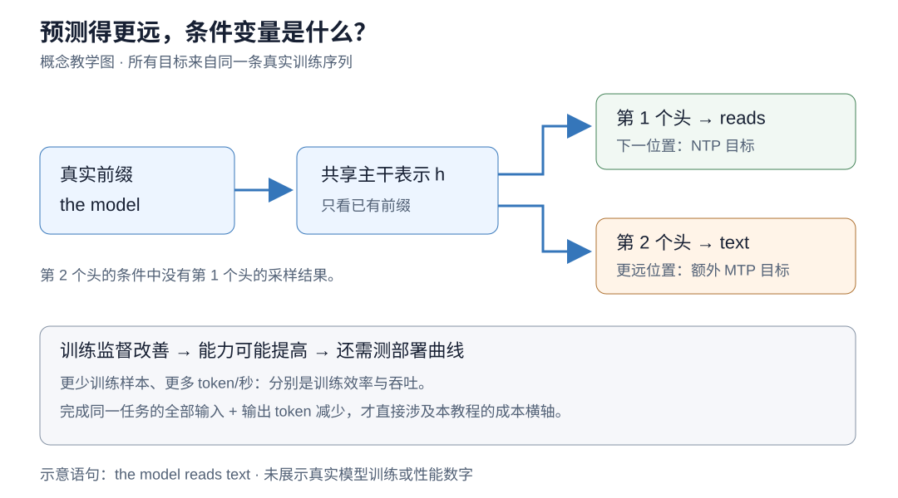
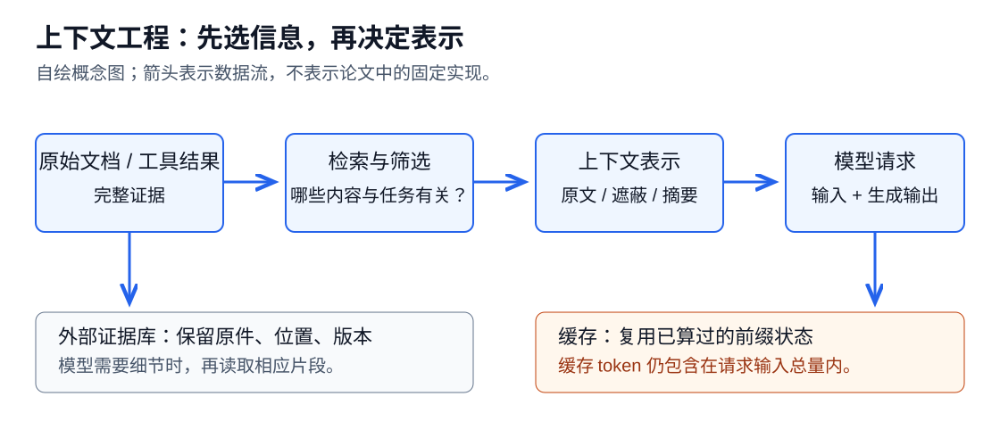
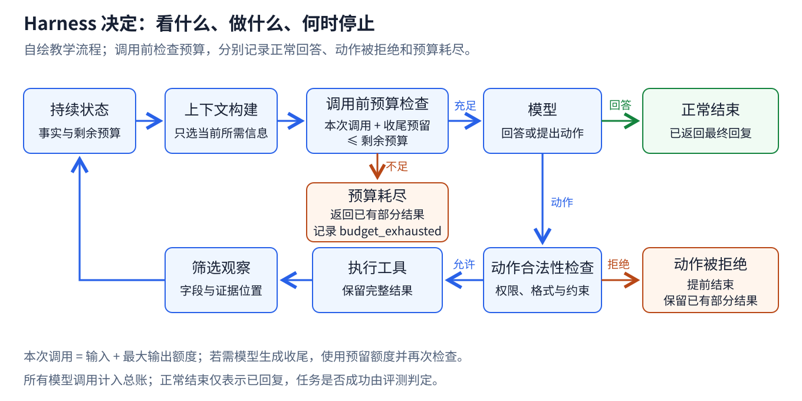

# 算例、教学程序与练习

[附录目录](README.md) · [当前研究地图](../README.md)

本页按计算任务组织可运行算例与练习，使用现有七个教学程序。代码输出检验计算流程，不能作为模型训练或部署效率结果。

## 预测目标与部署的区别

对“模型 预测 下一个 词元”，模型可以在看到“模型”时预测“预测”，看到“模型 预测”时预测“下一个”。真实的 tokenizer 可能把这些词切成不同的单元；为了讲解，先把空格分隔的项视作 token。

训练时，前缀来自数据中的真实文本，目标也是数据中的下一个 token。这个做法称为 teacher forcing。推理时，前缀可能包含模型自己采样出来的内容，因此某一步的错误会改变后续条件。训练损失是在数据前缀上测得的；实际任务表现还受自生成前缀、停止策略和工具交互影响。



*图 1：本页的教学材料自制概念图。上方表示不同监督目标；下方强调从目标改善到部署 token 曲线仍需要评测。箭头表示信息条件，不表示作者实验得到的数值收益。*

## 分词与条件概率实验

运行：

```bash
python3 examples/tokenization_lab.py --mode bpe
python3 examples/tokenization_lab.py --mode ntp
```

[完整代码](../../examples/tokenization_lab.py)中的 BPE 从字符起步，允许跨空白合并，并在频次相同时作确定性排序。它保留字符，因此能检查解码后与原文本完全一致；它没有生产级 tokenizer 的字节回退、预分词和特殊 token 规则。

程序只用合成训练文本学习 merge，不在测试句子上学习。英语训练的 merge 对中文句子可能毫无帮助；加入中文训练文本后可以压缩中文词组，但同样的 merge 数量也需要在语言之间分配。读输出时请对比 `chars`、`utf8_bytes` 和 `tokens` 三列，不能把它们混用。

第二个实验使用二元模型，把完整前缀近似为前一个 token。对计数 $`n(u,v)`$ 与平滑系数 $`\alpha\gt 0`$ ，预测为：

```math
\hat p(v\mid u)=\frac{n(u,v)+\alpha}
{\sum_{w\in V}n(u,w)+\alpha|V|}.
```

分母保证同一条件下概率和为一。代码会检查这一点，打印在 `model` 后出现 `reads / predicts / proves` 的概率，以及保留句子的 NLL 和 PPL。词表来自合成训练语料，遇到未知测试词会明确报错，而不会悄悄把测试词拿来训练。

这个模型没有注意力、参数优化和多步规划。它的价值是让损失的分子、分母与条件变量都能看见。把其中的计数表替换为 Transformer，需要张量库和训练基础设施；本节并未执行那种实验。

## 预测目标练习

预训练实验通常需要比这个教学例子大得多的规模，小模型的数据排序也未必在大模型上保留。更低损失可能主要改善常见词预测，而对少数高价值任务帮助有限。高频合并也可能改变数字和标识符的切分方式，其下游影响需要任务实验，不能由压缩率直接决定。

1. 把 BPE 的最大合并次数从 24 改成 8 和 48。分别记录三类测试文本的 token 数，不据此推断任务准确率。
2. 将 NTP 示例改成三元模型。明确新条件包含什么；未见过的前缀如何平滑？
3. 用两个相关的随机变量构造反例，说明两个未来位置的边缘概率乘积不等于联合概率。
4. 为“教育数据能让模型少思考”写出最小实验：固定哪些训练条件，部署时测哪些预算，什么结果会推翻假设？

## 固定总量的数据混合实验

运行：

```bash
python3 examples/tokenization_lab.py --mode adaptation
```

[完整代码](../../examples/tokenization_lab.py)构造一般文本和领域文本，使用二元模型重新拟合加权计数。一般文本经常出现 `model reads`，领域文本经常出现 `model proves`；因此两个分布在共享前缀后有不同偏好。

对领域权重 0、0.25、0.5、0.75、1，程序都保持加权训练总量相同，打印一般与领域保留句子的 NLL。你会看到提高领域权重有利于领域拟合，却可能降低一般文本拟合。这是合成分布上的精确计数实验，没有使用测试句子更新计数。

需要强调：程序每次都重新拟合一个平滑二元模型，**并未模拟神经网络从旧参数连续更新的轨迹**。它说明混合目标的取舍；上一节梯度公式说明局部参数干扰。两者互相补充，但都不提供真实 LLM 遗忘幅度的测量。

继续做实际中训练前，可以写一张小型实验表。保持底座、tokenizer、有效训练 token 数和优化日程相同，只改变一般/领域混合比例；另把序列长度作为独立变量。每隔固定训练 token 保存检查点，评估目标域、一般能力与成本曲线。若同时改数据、长度和学习率，即使效果提高，也很难知道应保留哪一项。

## 领域适配练习

1. 在合成领域语料中加入与一般语料相同的转移，观察取舍是否减弱。解释何时两个目标可能一致。
2. 如果按文档一半一半采样，但领域文档平均长四倍，估计领域 token 的实际占比；再列出 packing 会使估计失准的条件。
3. 设计一个“找得到信息但用错了条件”的长上下文题。解释为什么单次 needle 检索不能覆盖它。
4. 给“领域适配减少检索”写出可证伪假设。你的成本日志需要记录哪些调用，才能发现检索减少却回答变长的情况？

## 监督损失与蒸馏算术

在仓库根目录运行，无需 GPU 或第三方 Python 包：

```bash
python3 examples/posttraining_lab.py --section sft --self-test
```

想直接调用核心函数：

```python
from examples.posttraining_lab import forward_kl_grad, reverse_kl_grad

student_logits = [0.4, -0.2, 0.0]
teacher = [0.7, 0.2, 0.1]
print(forward_kl_grad(student_logits, teacher))
print(reverse_kl_grad(student_logits, teacher))
```

输出包含两个不同方向的 KL、梯度以及长回答权重。`--self-test` 用有限差分独立检查解析梯度。这个程序只有离散概率运算，没有加载模型，也没有展示 SFT 或 OPD 的真实性能收益。

练习：把教师第三个动作的概率改为很小但非零，并让学生很偏爱它，比较两个梯度；再把 2/8 的示范长度改为 2/80，解释两种平均方式的权重。最后设计一对“更短却更容易重试”和“稍长但一次成功”的轨迹，说明为何单条输出长度不足以选蒸馏数据。

进一步阅读：[GKD 原论文](https://arxiv.org/abs/2306.13649)、[OPD 官方说明](https://thinkingmachines.ai/blog/on-policy-distillation/)、[OpenCodeReasoning §4.1 的过滤消融](https://arxiv.org/html/2504.01943v1#S4.SS1)。最后一篇提供的是特定 SFT 条件下的经验，不能从“过滤可能丢失困难题”推出错误答案普遍更值得模仿。下一章讨论：当我们更容易比较两个回答，而不是写出唯一示范时，如何训练？

相关专题：[直接控制推理长度的三条路线](worked-examples.md)。

## 偏好优化算例

在仓库根目录运行：

```bash
python3 examples/posttraining_lab.py --section dpo --self-test
```

程序把 DPO 间隔 $`m`$ 当作一个独立标量，演示梯度下降：

```python
from examples.posttraining_lab import dpo_loss_grad, ppo_surrogate

margin = 0.0
for _ in range(5):
    loss, grad = dpo_loss_grad(margin, beta=0.5)
    margin -= 0.5 * grad
    print(round(loss, 4), round(margin, 4))
print(ppo_surrogate(1.5, 1.0))   # 1.2
print(ppo_surrogate(1.5, -1.0))  # -1.5
```

间隔增大、loss 下降，说明这个标量例子越来越相信赢家。真实语言模型中的间隔由大量共享参数决定，不能据此宣称模型效果已改善。自测还会用有限差分检查 DPO 梯度，并验证负优势的裁剪符号。

练习：把 ratio 换成 0.5，分别代入正负优势；解释为什么结果不是简单的 $`\mathrm{clip}(\rho)A`$ 。再给一个“短而错、长而对”的回答对，写出偏好规则。最后把两条回答交换，观察标签错误会如何改变更新方向。


## GRPO 与门控奖励算例

```bash
python3 examples/posttraining_lab.py --section grpo --self-test
```

也可以在仓库根目录执行下面的 Python 片段：

```python
from examples.posttraining_lab import group_advantages, gated_reward

print(group_advantages([1, 1, 0, 0]))
print(group_advantages([1, 1, 1, 1]))
rewards = [gated_reward(True, cost) for cost in [10, 40, 70, 100]]
print(rewards)
print(group_advantages(rewards))
```

第一行约为 `[1,1,-1,-1]`，第二行全零。最后一组都正确，但长回答得到负优势。程序没有 rollout 引擎，也没有把这个奖励宣称为推荐的生产训练配方；它用于核对定义和反例。

练习一：用 `[0,0,0,1]` 手算优势，解释唯一成功样本与三个失败样本的权重。练习二：将门控公式中的 $`\lambda`$ 设为 1.2，找出正确不再严格高于错误的反例；代码会拒绝这个参数，是为了守住示例所声明的条件。练习三：画出一次“搜索—阅读—总结—失败重试”的调用图，把每次模型的输入、输出 token 加入成本；说明把工具观察从策略 loss 中排除后，哪些费用仍存在。


相关专题：[直接控制推理长度的三条路线](worked-examples.md)。

## 上下文处理的调用顺序

假设要回答“仓库今天几点关门”。手册有 200 页，其中一句写着关门时间。把 200 页全部给模型，它可能找到答案，但也可能被别的日期、分店和例外条款干扰。只给“18:00”会很短，却丢掉“哪个仓库、哪一天、是否节假日”的适用条件。

这就是上下文工程的基本问题：找到**完成当前任务所需的信息集合**，并用模型能够正确使用的形式表达。真正的比较对象是任务结果，而不是字数排行榜。



*图示：本页的教学材料自绘。筛选和压缩改变模型的输入内容；缓存复用改变处理输入的计算过程。原始证据可以保存在模型上下文之外。*

设任务为 $`x`$ ，完整材料为 $`D`$ ，上下文构建器为 $`g_\phi`$ ，其参数 $`\phi`$ 可以包括检索数量、压缩率和保留窗口。模型收到 $`c=g_\phi(x,D)`$ 后生成 $`y`$ 。设 $`Q(y,x)`$ 是任务评分， $`N_{\rm task}`$ 是包括辅助模型在内的推理总 token。一个明确的研究问题是：

```math
\min_\phi\;\mathbb E[N_{\rm task}(\phi)]
\quad\text{满足}\quad
\mathbb E[Q(\phi)]\geq q_0.
```

这里的期望是在预先确定的任务分布上取平均， $`q_0`$ 是事先设定的质量要求。这个约束并不保证每个样本都不退步，因此还要检查高风险子集和失败类型。实际实验通常扫描多个 $`\phi`$ ，画出质量与 token 的曲线；并不一定直接解这个优化问题。

## 同一轨迹的三种上下文

在仓库根目录执行：

```bash
python3 examples/context_lab.py
python3 examples/context_lab.py --steps 12 --window 3
```

示例只使用 Python 标准库。它把空白分隔单元作为**合成教学单位**，没有调用 LLM、真实 tokenizer 或 LLMLingua-2。固定 8 次调用，每次基础输入 100 单位，动作 20 单位，观察 200 单位。规则摘要每积累 4 轮旧历史时触发一次，读入旧历史和 30 单位摘要指令，输出 35 单位；摘要中人为保留一个已植入的事实。

默认运行结果：

| 方案 | 主模型输入 | 主模型输出 | 摘要输入与输出 | 任务总量 | 最后上下文仍含植入事实 |
|---|---:|---:|---:|---:|---|
| 完整历史 | 6960 | 160 | 0 | 7120 | 是 |
| 最近 2 轮观察 | 3990 | 160 | 0 | 4150 | 否 |
| 每 4 轮规则摘要 | 3580 | 160 | 945 | 4685 | 是 |

这张表没有测量模型成功率。“保留植入事实”只是字符串检查。我们故意让规则摘要知道应保留什么，展示的是记忆保留机制；不能据此声称真实摘要优于遮蔽。下一步的真实实验应在同一环境检查点分别继续运行各策略，让后续成功或失败来判断压缩是否足够。

示例还提供一个四文档词项重合检索：原始材料共 26 教学单位，选择的片段有 6 单位。它没有向量检索、重排或回答模型，只让你看到输入选择如何进入账本。

## 上下文保留练习

1. **计算题：**旧材料长 3000，摘要长 500，摘要调用花 3600。忽略后续行为变化，至少再使用多少次才回本？
2. **错误诊断：**一种方法输入从 10000 降到 4000，输出从 1000 升到 2000，辅助压缩花 3000。它节省了多少？如果后来还多一次 2500 token 的重试呢？
3. **实验设计：**在示例里把仓库代码改成只在第 1 轮出现的“节假日例外”。怎样判断窗口遮蔽是否安全？
4. **证据练习：**给一条摘要中的事实增加原文件和段落位置。设计一次按需恢复原文的调用，并把这次调用也记账。

参考答案：第 1 题需 2 次，因为 $`2\times2500\gt 3600`$ 。第 2 题原方案 11000，新方案 9000，先节省 2000；增加重试后变成 11500，反而多 500。第 3 题不能只检查长度，应设计必须依赖该例外才能答对的后续任务，并与完整上下文对照；若规则把例外固定写入摘要，还要增加未预见的关键事实以检测规则偏置。

## 任务状态与调用前预算检查

单轮问答通常是“问题进、回答出”。Agent 会进行“观察环境—提出动作—执行工具—观察新结果”的循环。ReAct 是把推理与行动交替组织起来的代表工作；这个交互方式解释了为什么只统计最后一段答案会漏掉大量成本。[ReAct 论文](https://arxiv.org/abs/2210.03629)

例如修复一个小程序，最终回答只有“已修复，测试通过”，但过程中可能读过 20 个文件、打印过两次完整日志、试过三种错误补丁，并让另一个模型总结了历史。如果只记最后 10 个 token，就无法评价这次任务是否经济。

设所有模型调用构成集合 $`\mathcal C`$ ，其中包括主模型、摘要模型、路由模型和子 Agent。对调用 $`c`$ ， $`I_c`$ 为完整输入长度， $`O_c`$ 为完整输出长度，则：

```math
N_{\rm task}=\sum_{c\in\mathcal C}(I_c+O_c).
```

同一段文字先由一个模型生成，再被另一个模型读取，会在生成端和读取端分别计入；这是两次实际处理，不是错误的重复记账。同一请求的 usage 字段被采集两次则是日志重复，必须去重。

工具程序产生的字符串本身不是模型生成输出。它在送进后续模型请求时才成为模型输入。如果工具内部也调用了 LLM，则内部调用另入账。没有暴露内部 usage 的工具不能假设为零，应标记“内部模型用量未知”。



*图示：本页的教学材料自绘。持久状态和完整证据保存在环境中，模型上下文是其中一次有目的的投影。预算检查必须发生在调用之前。*

## 预算、通信与工具筛选实验

执行：

```bash
python3 examples/agent_budget_lab.py
```

这是标准库合成演示，没有调用真实 Agent。主要输出包括：

| 演示 | 默认运行结果 | 能说明什么 |
|---|---|---|
| 调用前预算检查 | 两次调用后花 670；第三次拒绝；最终总量 770，预算 1000 | 先预留最大用量，再按实际用量结算 |
| 路由阈值 0.6 | 合成成功率 0.9，平均总量 340 | 分配资源可以形成一条质量—成本曲线 |
| 总选强模型 | 合成成功率 0.9，平均总量 520 | 对照组也计入同一 20 单位路由开销，便于隔离选择机制 |
| 四工作 Agent、三轮、消息长 100 | 全互联生成 1200、读取 3600，共 4800 | 生成与多次接收分别入账 |
| 精确筛选工具结果 | 空白分隔单位从 4600 到 5；保留失败 ID 7 和 81 | 程序聚合能减少进入上下文的数据 |

路由演示的人为难度特征与人为成功标签故意高度相关，所以阈值 0.6 看起来很好。这不构成对真实路由器的验证。代码的价值在于让阈值、选择结果和成本公式完全可见。

真实的“总选强模型”部署通常无需运行路由器，因此应另给移除 20 单位路由开销的对照。这也提醒我们：为了控制变量而构造的教学对照，未必是实际工程里最强的 baseline。

工具筛选使用 Python 精确找出失败 ID。5 个空白分隔单位不是实际 tokenizer 的 5 个 token；它也只适用于“哪些失败”这一查询。如果任务要求诊断失败原因，就需要更多信息。

## 智能体编排练习

1. 总预算 5000，已结算 2600，两个并发调用已预约 1000，新调用输入 500、最大输出 600，最终保留 400，能否发送？
2. 五个工作 Agent 交流两轮，每条消息 80 token。在本节全互联假设下，通信总量是多少？星形假设下呢？
3. 弱模型一次花 300 token，失败率 0.4；失败后强模型花 900；判断是否升级花 50。忽略其他差异，先弱后强的期望总量是多少？
4. 将工具筛选示例改成“只显示第一个失败”。构造一个必须知道第二个失败才能正确决策的任务，并解释为什么压缩比不是充分指标。

参考答案：第 1 题为 $`2600+1000+500+600+400=5100`$ ，不能发送。第 2 题全互联为 $`5^2\times2\times80=4000`$ ，星形为 $`4\times5\times2\times80=3200`$ ，但这不比较任务质量。第 3 题为 $`300+50+0.4\times900=710`$ ，还需验证升级判断是否可靠以及总成功率是否达到要求。

## 三个计量错觉

运行第 8 章的脚本，并查看末尾 `resources` 字段：

```bash
python3 examples/agent_budget_lab.py
```

脚本使用纯 Python 精确枚举一个三项分布。目标分布为 $`(0.1,0.6,0.3)`$ ，草稿分布为 $`(0.5,0.3,0.2)`$ ，直接接受的概率质量为 $`(0.1,0.3,0.2)`$ ，总接受率为 0.6。加上归一化残差步骤贡献后，恢复出的分布恰好为 $`(0.1,0.6,0.3)`$ 。

这是单位置校正的算术验证，没有执行大模型或测量加速。它说明“保留采样分布”的含义，并提醒你不要把一个便宜草稿直接当作目标模型结果。

接着看两个合成资源计数：

| 项目 | 输出 | 正确解释 |
|---|---:|---|
| 输出长度 | 128 | 最终文字位置数 |
| AR 生成阶段新增位置 | 128 | 忽略预填充，每步新增一个位置 |
| 全序列扩散，16 轮 | 2048 次位置访问 | $`16\times128`$ ，不是 2048 个最终输出 token |
| 十亿权重、16 bit | 2,000,000,000 字节 | 理想权重数据大小 |
| 十亿权重、4 bit | 500,000,000 字节 | 未包括量化元数据、KV 和工作区 |

这些结果足以揭示单位混淆，但不足以决定哪个真实模型更好。下一步必须使用真实硬件计时，并确保同样的质量要求和测量边界。

## 计算口径练习

1. 一种推测解码使 1000 token 输出从 20 秒降到 12 秒，草稿另外生成 1400 token。可以分别声称什么？
2. 一个 latent 方案把 400 个文本推理 token 换成 100 次内部更新。仅凭这些数字，能否得出四倍加速？
3. 扩散方案输出 256 token，执行 32 轮完整序列处理。位置访问是多少？为什么不等于输出 token？
4. 一层有 1 亿共享参数、8 个各 2 亿参数的专家，每次激活 2 个。总参数和激活参数各约多少？为什么不能只按激活参数安排显存？

参考答案：第 1 题在所测配置下端到端速度比为 $`20/12\approx1.67`$ ；最终输出长度没减少，草稿工作另报，不能称总 token 减少。第 2 题不能，还需要每次更新的计算、缓存、预填充和质量。第 3 题为 $`256\times32=8192`$ ，相同输出位置被反复处理。第 4 题总参数约 17 亿，激活约 5 亿，但未激活专家仍须存储或按需调入，还存在 KV 与工作区。

## 题内长度标准化与奖励算术

Arora 与 Zanette 的 [Training Language Models to Reason Efficiently](https://arxiv.org/html/2502.04463v3#S4) 从已有推理模型开始在线 RL。每题采样多条回答，按该题**正确回答的长度**计算均值与标准差，再通过 sigmoid 形成有界惩罚。原论文采用 PPO 与 RLOO 优势估计，不应把它称为一种 GRPO 实现。

令 $`c_i\in\{0,1\}`$ 为正确性、 $`L_i\ge0`$ 为回答长度。若同题存在正确样本，记其长度均值和标准差为 $`\mu_+,s_+`$ ， $`\alpha\in[0,1)`$ 。教学实现增加明确的数值保护 $`\varepsilon\gt 0`$ ：

```math
z_i=\frac{L_i-\mu_+}{s_++\varepsilon},\qquad
r_i=c_i\left[1-\alpha\sigma(z_i)\right],\qquad
\sigma(z)=\frac{1}{1+e^{-z}}.
```

同题较短的正确回答获得较高奖励。用题内统计量，是为了让困难题的一千 token 与该题其他解比较，而不是一律与简单题的一百 token 比较。全错时不存在 $`\mu_+,s_+`$ ，下面直接返回零奖励；正确长度完全相同时，长度项不能区分这些回答。数值保护及这些边界处理是本教学代码明确选择的约定，生产复现须核对原实现。

```python
import math
from statistics import mean, pstdev

def length_rewards(lengths, correct, alpha=0.2, eps=1e-8):
    if len(lengths) != len(correct) or not 0 <= alpha < 1 or not eps > 0:
        raise ValueError("invalid arguments")
    if any(not math.isfinite(n) or n < 0 for n in lengths):
        raise ValueError("lengths must be finite and nonnegative")
    if any(c not in (0, 1) for c in correct):
        raise ValueError("correctness must be binary")
    good = [n for n, c in zip(lengths, correct) if c]
    if not good:
        return [0.0] * len(lengths)
    center, scale = mean(good), pstdev(good) + eps
    rewards = []
    for n, c in zip(lengths, correct):
        z = (n - center) / scale
        sigmoid = 1 / (1 + math.exp(-z)) if z >= 0 else math.exp(z) / (1 + math.exp(z))
        rewards.append(c * (1 - alpha * sigmoid))
    return rewards

r = length_rewards([100, 300, 1], [1, 1, 0])
assert r[0] > r[1] > r[2] == 0
assert length_rewards([1, 100], [0, 0]) == [0.0, 0.0]
assert length_rewards([100, 100], [1, 1]) == [0.9, 0.9]
```

RLOO 在组大小 $`G\gt 1`$ 时使用其余回答的平均回报作为基线：

```math
A_i=r_i-\frac{1}{G-1}\sum_{j\ne i}r_j.
```

它不需要额外价值网络。这里的 $`G-1`$ 是留一法的分母，需要至少两条回答；它与 [GRPO](../05-posttraining/index.md) 的标准差保护是不同问题。

原论文的最优性分析依赖可独立表示每题响应分布等简化假设，不能直接成为共享参数 LLM、有限采样、含噪 verifier 下的保证。原文的一些结果保留了大部分准确率但仍有下降；应把它们读成性能—长度折中，而不是写成所有预算上的无损压缩。
