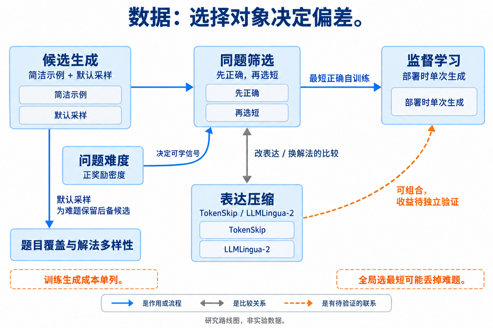

# 01 数据准备与合成：模型应该从哪些解法中学会节省

[总论](../../00-overview.md) · [下一章：预训练](../02-pretraining/index.md)

数据阶段能改变模型以后遇到问题时偏好的解法，也能改变效率训练是否获得足够的学习信号。本章关注三种选择：选哪些问题、同一道题选哪条轨迹、轨迹中保留哪些信息。它们分别改变题目覆盖、解法分布和表达形式，不能仅用“高质量短数据”概括。

## 本章地图：选择对象决定后面的偏差



本图由主代理综合正文关系后使用 GPT-Image 生成；连线表示文中说明的流程、比较或待验证联系，不表示统一性能排名。

| 路线 | 典型做法 | 怎样关联推理时 token | 必须同时检查 |
|---|---|---|---|
| 同题选择短正确轨迹 | Shortest-correct self-training | 将已有短解的概率质量教回模型 | 无正确候选的题是否被丢弃，难题覆盖是否下降 |
| 改变候选生成分布 | 简洁 few-shot 与默认采样混合 | 更容易找到短解，同时保留必要长解 | 教师、示例与候选采样属于训练开发成本 |
| 选择训练问题难度 | The Art 的 Easy/Full/Hard 对照 | 决定效率 RL 是否有足够正确短轨迹 | 难度相对当前模型定义，不能固定贴在数据集上 |
| 改写或删除表达 | C3oT、TokenSkip、LLMLingua-2 蒸馏数据 | 将相同过程写得更紧凑 | 删除后的逻辑是否仍成立，教师是否引入错误 |
| 选择一般训练信号 | FineWeb、DoReMi、Rho-1 | 可能改善底座能力，部署长度仍待测 | 训练 token、loss 与推理时 token 分别计量 |

这几条路线可以串联。例如先在每题内产生多条候选，再保留正确解，再按长度选择；也可以先把长解改写为短解，再验证。顺序决定得到的数据：先筛全局最短可能把难题删掉，先按题保留候选则有机会保护题目覆盖。具体方法的实验分别见[最短正确自训练](reference/2502.20122.md)、[The Art](../05-posttraining/reference/2602.20945.md)和[LLMLingua-2](../07-context/reference/src-7cc3fedc37b4.md)。

## 最短正确自训练：把离线选择变成部署时的默认行为

Munkhbat 等从一个观察出发：同一模型对同一道题的随机输出中，已经存在短而正确的解法。问题在于默认生成未必选到它。方法在训练阶段多生成几次，找到这样的轨迹，再通过监督微调改变部署分布。[原论文 §2–3](https://arxiv.org/abs/2502.20122v3)

设训练题为 $x$，该题的候选集合为 $\mathcal Y_x$，验证器 $v(x,y)\in\{0,1\}$ 判断答案是否正确，$\ell(y)$ 为固定 tokenizer 下的输出长度。先构造正确集合，再在其中选择：

```math
\mathcal C_x=\{y\in\mathcal Y_x:v(x,y)=1\},\qquad
y_x^*=\operatorname*{argmin}_{y\in\mathcal C_x}\ell(y).
```

这个表达要求 $\mathcal C_x$ 非空。论文会排除没有正确候选的题；这也使最终训练题目分布依赖模型当前的能力。多个候选长度相同时，选哪个属于实现细节，不影响“先按题筛正确、再选短”的核心区别。

随后用 $(x,y_x^*)$ 做普通监督训练。为说明学习对象，可把一条选中轨迹的损失写为：

```math
\mathcal L_x=-\sum_{t=1}^{\ell(y_x^*)}
\log\pi_\theta(y^*_{x,t}\mid x,y^*_{x,<t}).
```

模型学习的是选中轨迹里的下一 token 条件分布。部署时不再需要重复生成所有候选，也不必带上收集训练数据时的长 few-shot 示例。这就是训练阶段花预算、部署阶段收回节省的联系。上式仅说明监督对象；跨样本如何归一化必须按实际训练实现记录。

下面是教学用的最小选择过程。长度已经由同一 tokenizer 计算，`correct` 是验证结果，不能根据文本短就填为真。

```python
def shortest_correct(candidates):
    valid = [r for r in candidates if r["correct"]]
    return min(valid, key=lambda r: r["tokens"]) if valid else None

easy = [{"correct": True, "tokens": 80},
        {"correct": True, "tokens": 35},
        {"correct": False, "tokens": 9}]
hard = [{"correct": True, "tokens": 240},
        {"correct": False, "tokens": 18}]
# 每题分别得到 35 和 240；全局取最短会丢掉难题的 240-token 正确解。
```

选择只解决了“已有候选里哪条更好”。若短正确轨迹很少，增加候选数的收益会递减。论文因此使用八个简洁示例进行 few-shot conditioning，让候选分布本身先向简洁表达移动，再应用 Best-of-N。FS-Human、FS-GPT4o、FS-Self 的区别在示例来源，不能把所有方案都称为完全无教师自训练。

简洁示例又可能妨碍某些难题产生足够完整的解法。作者把默认零样本分布的候选并入同题候选池，作为 augmentation。此时模型既可以选择简洁提示产生的短解，也可以保留默认分布下较长但正确的解。默认 FS-BoN 加 augmentation 的生成预算高于朴素 BoN，因此论文另外报告 8+8 候选的预算匹配配置。[原论文 §3–4、表2](https://arxiv.org/abs/2502.20122v3)


[查看原图，可放大](../../../assets/papers-v3/2502.20122/fig3.pdf) · [论文来源](https://arxiv.org/src/2502.20122v3)

### 实验证据应怎样读

主实验覆盖五个中小规模模型，以 GSM8K 和 MATH 为主，部署统一使用贪心生成，成本是包括错误答案在内的平均输出 token。论文先按模型相对各自基线归一化，再汇总相对指标；“相对指标的平均”不能当作“两个平均值相除”。

| 论文表2的汇总结果 | 相对输出长度 | 相对准确率 | 可支持的解释 |
|---|---:|---:|---|
| GSM8K，FS-GPT4o-BoN | 64.25% | 97.00% | 大幅变短，仍有准确率取舍 |
| MATH，FS-GPT4o-BoN | 76.30% | 102.56% | 在该汇总设置中同时改善两项指标 |

这些是指定模型、题集和候选方案下的结果，既没有证明每个模型无损，也没有给出整个 Agent 的输入、工具和验证成本前沿。论文的逐题选择、augmentation 与难度分析比一个平均压缩数字更能指导新研究：它们解释了怎样避免用缩小题目覆盖换取表面效率。部署时延也有改善，但其测量与固定 batch 显存测量分别使用不同执行配置，不能拼成一个统一速度结论。[精读：实验与成本条件](reference/2502.20122.md)

## 问题难度与轨迹质量是两个独立选择

同题选短正确解，并不能保证后续 RL 获得足够的正信号。The Art 在特定基础模型上用采样成功率区分 Easy 与 Hard，发现难题集的正奖励过于稀疏时，长度训练更容易不稳定；较容易的训练问题反而能学到向困难测试集迁移的长度偏好。这里的“容易”由模型、采样数量、验证器和当前预算共同定义，不能推成所有效率训练都应该只用容易数据。[The Art §3.1](https://arxiv.org/abs/2602.20945v3)

两条路线的组合关系是：问题选择控制一个训练组里是否有可学信号，同题轨迹选择控制模型模仿哪一种成功行为。二者也会产生新的偏差——若只保留容易产生短解的题，可能同时损失长程推理和少见解法。后训练中的奖励与组内比较详见[后训练章](../05-posttraining/index.md)。

表达压缩又是另一层。TokenSkip 使用重要性模型制作压缩后的推理标签；LLMLingua-2 先让教师抽取式压缩，再对齐为保留/删除标签。它们可以与正确性筛选组合，但“由原文删词得到”只保证不新增词，删去否定词或条件仍会改变语义。[TokenSkip](../05-posttraining/reference/2502.12067.md) · [LLMLingua-2](../07-context/reference/src-7cc3fedc37b4.md)

## 目前的认识、争议与阅读顺序

现有证据支持部分模型具有可被选择、训练并迁移的简洁轨迹。它还支持一个更具体的限制：短训练数据的分布与覆盖同样重要。仅依据全局长度排序、强制短答案或教师改写，都可能损失能力。一般语料清理、领域重配和 selected-token loss 能改善训练信号，但本次相关原文没有给出足以把这些改善直接写成部署少 token 的证据；Rho-1 的具体机制放在[中训练章](../03-midtraining/index.md)。

建议先读最短正确自训练，再读 The Art 的数据难度对照，最后对照 TokenSkip 与 LLMLingua-2，区分“换一条解法”和“压缩同一条解法”。研究机会主要在尚未被这些工作隔离的变量：同等离线采样预算下，题目覆盖、解法多样性和短解选择各自贡献多少；跨题族和更难预算下，这些收益是否仍保持。

小团队的最小研究可以固定基座、训练题目和教师采样总量，仅改变逐题选择与覆盖保护。至少比较最短正确选择、随机正确选择、简洁提示及原模型，报告全部测试题的实际 token 和性能，并单独看无正确训练候选的题族。若收益只来自少学难题、只在训练近邻上成立，或等性能所需 token 没有减少，就不能把它作为新的效率机制。
