# Better & Faster Large Language Models via Multi-token Prediction

[所属章节](../index.md) · [来源与阅读状态](../../../../sources/papers.json)


- **作者**：Fabian Gloeckle, Badr Youbi Idrissi, Baptiste Rozière, David Lopez-Paz, Gabriel Synnaeve（FAIR at Meta；前两位等贡献）
- **年份**：2024；固定版本：arXiv v1，提交于 2024-04-30
- **原始链接**：[arXiv:2404.19737](https://arxiv.org/abs/2404.19737)；正文 HTML 阅读版：[ar5iv](https://ar5iv.labs.arxiv.org/html/2404.19737)
- **实际阅读范围**：正文第 1–6 节完整阅读；补读附录 A–M 中与正文结论直接相关的 S2–S16、S5–S14 表/图、替代架构、训练速度、微调、NLP/摘要/GSM8K、归因与超参数。本文不逐项复述所有参考文献。

## 这篇论文究竟改变了什么

普通因果语言模型在每个位置只用一个 next-token head 预测下一个 token。本文把训练目标扩展为：共享同一个 Transformer trunk，在位置 $`t`$ 同时用 $`n`$ 个独立输出头预测 $`x_{t+1},\ldots,x_{t+n}`$。推理时可以只保留第一个 head，因而保持通常的自回归模型；也可以把其余 heads 作为同一模型内的 draft，配合 blockwise/speculative decoding 加速。

必须把两个效果分开：

1. **训练效果**是辅助损失改变了共享 trunk 学到的表示，作者称其带来更高的样本效率；它不等于模型在一次生成中已经产生了 $`n`$ 个最终 token。
2. **推理效果**来自额外 head 作为草稿并由第一个 head/验证过程接受。它减少的是 forward 次数或每次 forward 的有效生成步数，论文没有把它表述成“最终输出 token 数减少”，也没有给出完整的任务质量—端到端成本前沿。

核心实证结论是条件性的：代码任务和部分自然语言生成任务收益明显，收益随模型规模上升；小模型上多 token 可能退化；标准选择题/似然指标上 4-token 训练在 7B 设置反而略差。$`n`$ 的最佳值依赖数据分布，代码主实验通常 $`n=4`$，但 APPS/Intro 更偏好 $`n=6`$，字节级模型更偏好 $`n=8`$。

## 背景与前作关系

作者把 teacher forcing 的局限概括为：训练时每一步都看到真实历史，部署时却必须使用自己前面生成的 token，错误会累积；只优化最近一步还会让模型偏向局部、容易的模式，忽略决定后续语义走向的选择点。多 token 预测不是让模型在训练中自由生成一段文本，也不是改变部署时的联合自回归分解，而是让同一上下文表示同时承担多个未来位置的预测任务。

相关的去噪、span corruption、permuted LM 等目标也让模型接触超出下一个位置的信息，但论文强调它们常只对输入的一小部分 token 回传梯度；本文的并行 heads 对每个位置的多个未来 token 计算监督，同时保留因果上下文。作者也将方法与 scheduled sampling 区分：后者把离散的模型错误 token 混入输入，容易产生不连贯序列且难以并行；本文始终用真实上下文训练，只增加未来位置的监督。

## 方法：共享 trunk、多个条件分布

设训练语料为 $`x_1,\ldots,x_T`$，历史上下文为 $`x_{t:1}=x_t,\ldots,x_1`$。普通目标是

```math
L_1=-\sum_t \log P_\theta(x_{t+1}\mid x_{t:1}).
```

本文的多 token 目标写作

```math
L_n=-\sum_t \log P_\theta(x_{t+n:t+1}\mid x_{t:1}),
```

其中实际架构采用独立输出头的条件分解：共享 trunk $`f_s`$ 先把历史变成 $`z_{t:1}=f_s(x_{t:1})`$，第 $`i`$ 个 head $`f_{h_i}`$ 预测距离当前位置 $`i`$ 的 token，再用共享 unembedding $`f_u`$ 得到词表分布：

```math
P_\theta(x_{t+i}\mid x_{t:1})=
\operatorname{softmax}\bigl(f_u(f_{h_i}(f_s(x_{t:1})))\bigr),\quad i=1,\ldots,n.
```

因此训练时使用的是多个**条件边缘预测头**的损失，可理解为对各个 future-token cross-entropy 求和；这些边缘分布的乘积可以定义带条件独立假设的模型联合分布，但不保证恢复真实未来 token 的相关性，也不等同于主自回归模型逐步条件化得到的联合分布。独立 head 也不意味着未来 token 在真实语言分布中彼此独立，只是输出层的建模/计算分解。部署的主 next-token 分布仍是 $`i=1`$ 的 head；其余 head 预测的是从同一历史表示出发的不同偏移位置。

一个最小例子：上下文是 `def f(x):`，$`n=4`$ 时共享 trunk 产生一个表示；head 1 预测下一 token，head 2 预测再后一个 token，直到 head 4。训练中四个真实目标都回传到 trunk。推理时若只用 head 1，输出循环仍是“生成一个 token、把它接回上下文、再运行 trunk”；若用 self-speculative decoding，额外 heads 先给出候选块，再由主 head/树注意力验证接受。候选被拒绝时不会把 draft 当作最终真值。

### 参数公平与 head 设计

为比较相同总参数量，增加 $`n-1`$ 个 head 层时从共享 trunk 中扣除相同数量的层；完整架构和超参数见正文表 S14、S13。默认 head 是 Transformer 层，最后共享 unembedding。线性 head、causal head、anticausal head 和并行 head 都可实现，但表 S4 显示并行架构整体更稳定；4-token、7B、200B code tokens 的代表性结果为 MBPP pass@1：parallel 33.8，causal 31.9，anticausal 30.8，linear 33.6；HumanEval pass@1：parallel 24.0，causal 20.9，anticausal 20.9，linear 21.9。

### 内存高效反向传播

词表大小 $`V`$ 远大于 trunk 表示维度 $`d`$。若同时物化 $`n`$ 个 logits 及其梯度，峰值近似为 $`O(nV+d)`$。本文在 trunk forward 后，依次对每个 head 做 forward/backward，累积回传到 trunk；当前 head 的 logits/梯度释放后再处理下一个 head，因此长期保留的主要是 trunk 梯度，峰值降为 $`O(V+d)`$。这不是减少数学上的监督项，而是改变执行顺序。表 S5 的实测训练时间相对 $`n=1`$ 略有开销：13B 为 $`n=2:1.04`$、$`n=4:1.09`$；作者归因于 FSDP 通信与计算重叠丢失，认为更好实现可消除。故“无训练时间开销”是设计目标/近似说法，实测并非每项严格等时。

## 真实数据实验

### 统一设置

代码模型从头训练，规模覆盖 0.3B–13B；主要设置为 7B 模型、约 200B code tokens，另有 313/314B bytes 的字节级设置、500B 和 1T code tokens，以及 7B 的 200B/500B natural-language tokens。多数上下文长度为 4096，字节级为 8192；Adam，$`\beta_1=0.9,\beta_2=0.95`$，权重衰减 0.1，梯度裁剪通常 1.0。代码用 MBPP、HumanEval、APPS/Intro，报告 pass@1/10/100；每题通常采样 200（图 3 使用 1000）个样本，温度在表 S12 中按任务和 $`k`$ 选择，属于 test-score oracle，不能当作单一固定温度下的结果。

### 规模效应：小模型会退化，大模型才稳定受益

图 3/表 S7 显示 300M–13B 的趋势。0.3B 上，MBPP pass@1 为 $`n=1:1.8`$、$`n=2:1.7`$、$`n=4:1.0`$；HumanEval 为 1.9、1.5、1.2，说明多 token 并非普遍增益。13B 上则 MBPP pass@1 为 26.0、30.5、30.5，HumanEval 为 14.1、15.2、15.8；pass@100 也从 MBPP 77.0 提升到 79.4/79.2，HumanEval 从 56.0 提升到 60.0/63.5。作者据此认为方法的有效性随规模上升，可能解释此前该训练损失常被小模型实验低估。

### 7B 代码主表与 $`n`$ 的选择

正文表 1 的 7B、200B tokens、32k tokenizer 结果如下：

| future tokens $`n`$ | MBPP @1/@10/@100 | HumanEval @1/@10/@100 | APPS/Intro @1/@10/@100 |
|---|---|---|---|
| 1 | 30.0 / 53.8 / 73.7 | 22.8 / 36.4 / 62.0 | 2.8 / 7.8 / 17.4 |
| 2 | 30.3 / 55.1 / 76.2 | 22.2 / 38.5 / 62.6 | 2.1 / 9.0 / 21.7 |
| 4 | **33.8 / 55.9 / 76.9** | **24.0 / 40.1 / 66.1** | 1.6 / 7.1 / 19.9 |
| 6 | 31.9 / 53.9 / 73.1 | 20.6 / 38.4 / 63.9 | **3.5 / 10.8 / 22.7** |
| 8 | 30.7 / 52.2 / 73.4 | 20.0 / 36.6 / 59.6 | 3.5 / 10.4 / 22.1 |

所以“$`n=4`$ 最优”只适用于这组代码分布和指标：HumanEval/MBPP 全面偏向 4，APPS/Intro 偏向 6。训练 1T tokens（约 4 epochs）后，差距缩小但没有完全消失：MBPP pass@1 40.7→43.1，HumanEval pass@100 83.0→86.2；其余格子有时相近或轻微回落，表明多 token 更像样本效率改进，而不是无限训练仍固定增益。

### 字节级训练：长距离模式与 token 口径

7B byte-level 模型在 314B bytes（正文称约等于 116B tokens）上训练。$`n=8`$ 相对 next-byte 在 MBPP pass@1 提高 67%，HumanEval pass@1 提高 20%；作者认为它接近 token 模型性能且使用了约 $`1.7\times`$ 更少的数据。这里训练单位是 bytes、模型输入序列也更长，不能把“预测 8 bytes”直接与“预测 8 BPE tokens”比较，也不能把 pass@1 增益解释成输出长度减少。字节模型的自 speculative 速度在表 S3 中最高达约 $`6.4\times`$（8 heads，batch 16），但这仍是解码速度，不是生成质量或最终 token 数的变化。

### 推理加速：自草稿/验证，不是联合一次性输出

作者实现 greedy self-speculative decoding：用 4-token 模型的多个 head 产生候选，再由主模型验证，测试未见过的 code/text prompt，生成 512 tokens，xFormers，异质 batch。7B code 上平均每次接受约 2.5 个候选（3 个 suggestions），相对标准自回归最高约 $`3.0\times`$；text 约 $`2.7\times`$。表 S2 在 batch 42 的 code 为 heads 2/3/4 时相对速度 1.85/2.54/3.05，平均每次 forward 取得 1.94/2.78/3.50 tokens。Wikipedia 和 Books 的 4-head 速度分别 2.74、2.67。附录强调速度在不同 batch size 基本稳定，但最大理论 speedup 受使用的 head 数限制。

这里的 “tokens / forward” 是一次 forward 经验证/预测所取得的 token 数，不是模型最终少生成了这些 token；验证拒绝会降低接受数。论文没有报告完整的端到端任务成本、能耗或在质量约束下的 token/FLOP 前沿。

### 微调与自然语言差异

将 7B code 预训练 checkpoint 微调到 CodeContests，比较保持 4-token loss 与剥离额外 heads、改用 next-token loss。两种都优于 next-token 预训练基线；在正文图 4 的 pass@k（每个温度 1000 samples，$`T\in\{0.5,\ldots,0.9\}`$，取温度 oracle）中，4-token 预训练后再用 next-token 微调总体最好，符合“辅助预训练、任务特定目标微调”的常规范式。附录 D 也显示直接把已有 Llama 2 用 4-token loss 微调并没有稳定增益，作者猜测新损失对初始化改变太剧烈。

自然语言 7B、200B tokens 设置更复杂：6 个选择/似然 benchmark 的平均准确率中，$`n=2`$ 与 next-token 基线大致持平，$`n=4`$ 退化（图 5、表 S12）。作者认为这些指标不能充分判别生成能力，于是做摘要和 GSM8K。8 个摘要数据集、ROUGE-L $`F_1`$ 的平均增量：200B 训练时 $`n=2:+0.51`$、$`n=4:+0.46`$；500B 时分别 $`+0.28`$、$`+0.31`$。但个别数据集反例明显，例如 WikiSummary 在 500B 的 $`n=2:-0.17`$、$`n=4:-0.99`$，说明不是所有生成任务都收益。GSM8K 8-shot、nucleus 0.95、采样 $`k=1,10,100`$：200B 时 $`n=2`$ 明显优于 baseline，500B 时顺序反转，$`n=4`$ 全程更差。作者将其解释为数据不足时多 token 加快正确 CoT 电路形成，电路形成后额外约束反而有代价；这是作者解释，不是因果证明。

## 合成实验：模型学到了什么

### 归纳头（induction）

在儿童故事数据上，把人物名替换成 tokenizer 下由两个 token 构成的新名字。名字首 token 主要由语义上下文决定；名字曾出现后，第二 token 是否能被正确接回，测的是复制/归纳能力。模型规模 1M–1B non-embedding parameters，训练最多 90 epochs，并以测试指标早停，因此有 epoch oracle。图 7 的两次独立 seed 显示：30M 及以下，2-token loss 明显更容易形成 induction；到 100M 及以上差距消失，且该受限任务上多 token 可能反而略伤。

这项结果的意义不是“多 token 永远带来更强 in-context learning”，而是提示它可能更早促成跨位置的信息传递；一旦 induction feature 已由较大模型或更高质量数据形成，任务就近似变成局部 next-token 预测。附录 J 用 9:1 books/children stories 混合数据强制更早形成 induction，除最小模型外优势也消失。

### 多项式算法推理

在 $`\mathbb F_7[X]/(X^5)`$ 上生成带一元负号、加法、乘法、复合的多项式表达式，模型输出结果系数。训练表达式操作数 $`m\in[1,5]`$，测试在 $`m\le 5`$ 的域内和 $`m>5`$ 的域外；每个难度 2000 个固定样本，greedy 解码，比较 30M 和 100M 模型。图 8 显示 multi-token 在各难度提升准确率，尤其改善 OOD，但绝对值仍低；把模型从 30M 增到 100M 的帮助小于替换训练损失。这是小型受控任务证据，不能直接等同真实 LLM 的数学推理能力。

加入 5/10 个 pause tokens 后，多 token 仍胜过基线，但优势幅度与无 pause 类似，未能验证“它更会把计算分配到需要的位置”的 computation-sharing 假说。HumanEval/MBPP 人为加入空格/换行的附录测试，平均增益很小。作者因此把 computation-sharing 保留为未证实的解释。

## 为什么可能有效：作者的解释与严格边界

### 选择点加权

若一个关键转折 token 后面的多个 token 都依赖该转折，那么预测未来多个位置会反复把该转折的难度传回训练目标。图 9 的计数结论是：$`n`$-token loss 对 consequential choice point 的隐式权重可达 $`n(n+1)/2`$，对不影响后续的普通点约为 $`n`$。直觉是模型更多关注决定后续语义轨迹的 token，而非仅仅容易的局部延续。这是对损失项的结构性计数和作者的解释，不能单独证明下游能力提升来自该机制。

### 信息论分解

令 $`X`$ 为下一个 token，$`Y`$ 为第二个 token，省略上下文 $`C`$。地面真值熵满足

```math
H(X)=H(X\mid Y)+I(X;Y),
```

而两项 future-token 熵为

```math
H(X)+H(Y)=H(X\mid Y)+2I(X;Y)+H(Y\mid X).
```

相比普通目标，2-token 目标把 $`X,Y`$ 间互信息的显式系数从 1 提到 2；$`H(X\mid Y)`$ 表示不影响后续的局部变体，互信息表示 $`X`$ 对后续 $`Y`$ 的约束。附录 L 把这一步推广到模型交叉熵：相对互信息 $`I_{p\|q}(X;Y)`$ 可用 KL 差定义，并得到相同的“局部条件交叉熵 + 两倍相对互信息 + shifted next-token cross-entropy”结构。它说明了训练目标鼓励预先计算有助于下一位置的特征，但不是说模型直接学习了一个可在推理时任意采样的联合分布。

因此，不能把论文的 $`L_n`$ 简化为“最大化严格联合概率所以推理一次生成 $`n`$ 个 token”。实际实现是多个共享上下文上的条件预测头；推理加速则额外依赖草稿候选和验证接受机制。

## 图表索引与复用信息

论文在 arXiv 页面声明 CC BY 4.0 许可。下面只记录可供主代理定位的原图；本次没有成功取得作者 TeX/图像到临时目录，因此 `local_file` 均为 `null`。原图可从 [arXiv v1 source 页面](https://arxiv.org/abs/2404.19737) 的 “TeX Source” 取得后再决定正式复用。

- `figure-1`: 总览：训练时共享 trunk + 4 heads，推理时只用 next-token head 或启用额外 heads；下方为 MBPP 随模型规模的 pass@1。来源同上；CC BY 4.0；`reuse_allowed: true`；
- `figure-2`: $`n=2`$ 时逐 head forward/backward 的顺序与释放 logits 梯度的内存机制；来源同上；CC BY 4.0；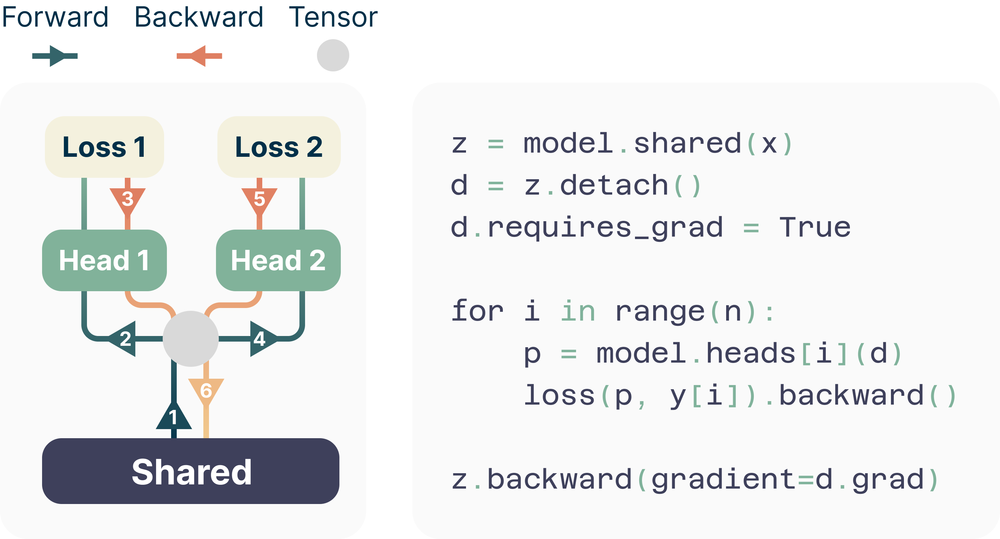
- `figure-3`: 0.3B–13B 代码模型在 MBPP/HumanEval 的 pass@1/10/100，显示小模型退化、规模上升后反转；来源同上；CC BY 4.0；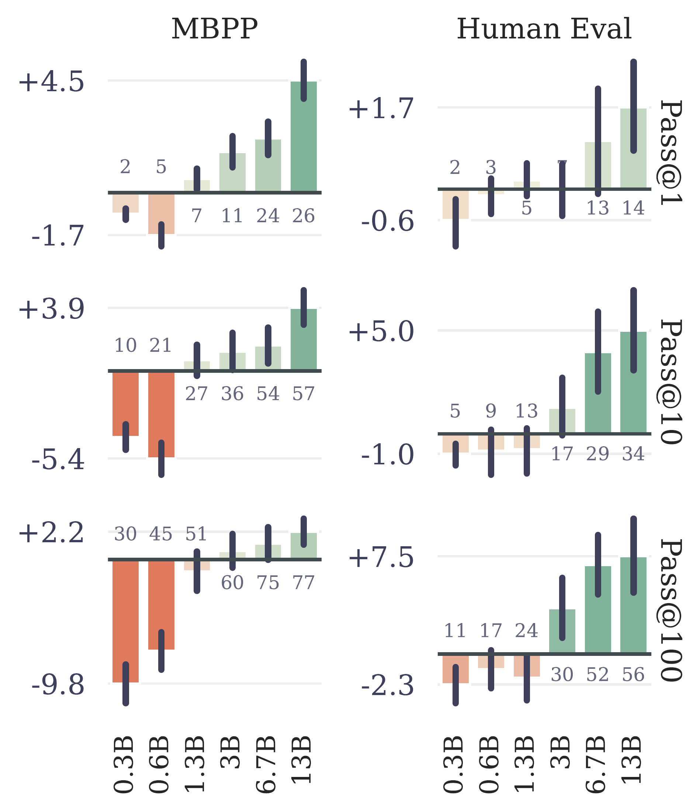
- `figure-4`: CodeContests 微调，比较 $`n'=1`$ / $`n'=4`$ 及 next-token 预训练基线，横轴 pass@k、温度取 oracle；来源同上；CC BY 4.0；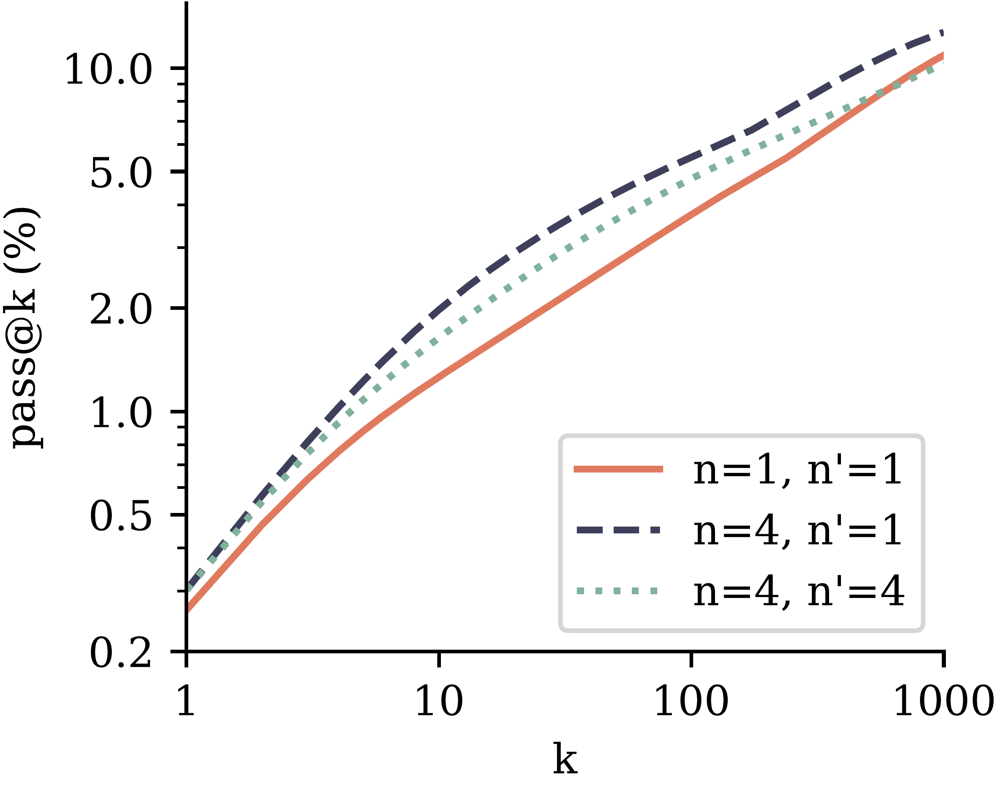
- `figure-5`: 7B、200B natural-language tokens 的 6 个选择/似然 benchmark 平均准确率，$`n=2`$ 近似基线、$`n=4`$ 退化；来源同上；CC BY 4.0；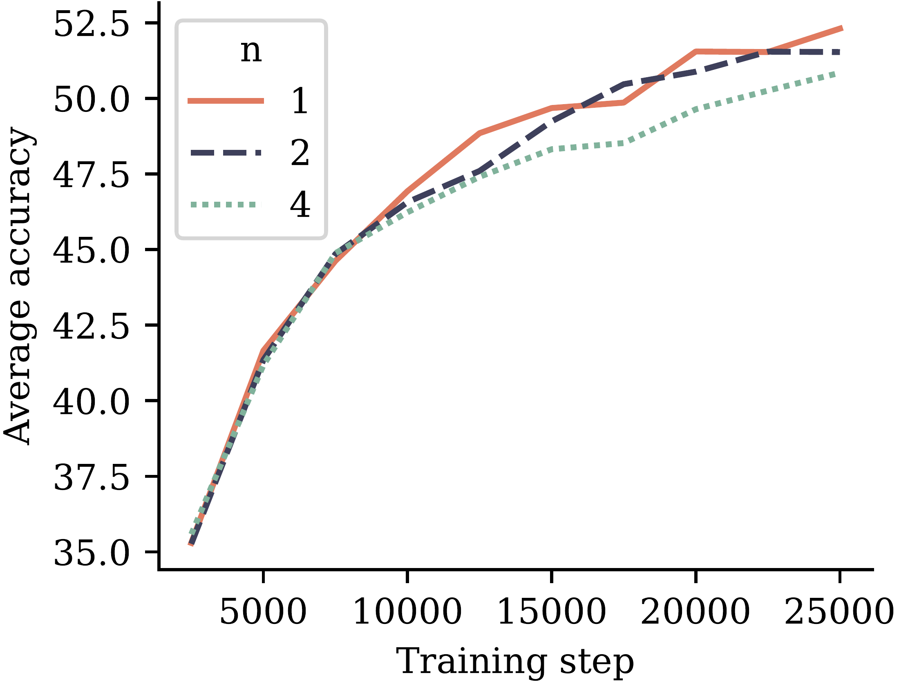
- `figure-6`: 8 个摘要 benchmark 的平均 ROUGE-L $`F_1`$，200B/500B 训练数据，$`n=2,4`$ 多数提升但个别数据集反例；来源同上；CC BY 4.0；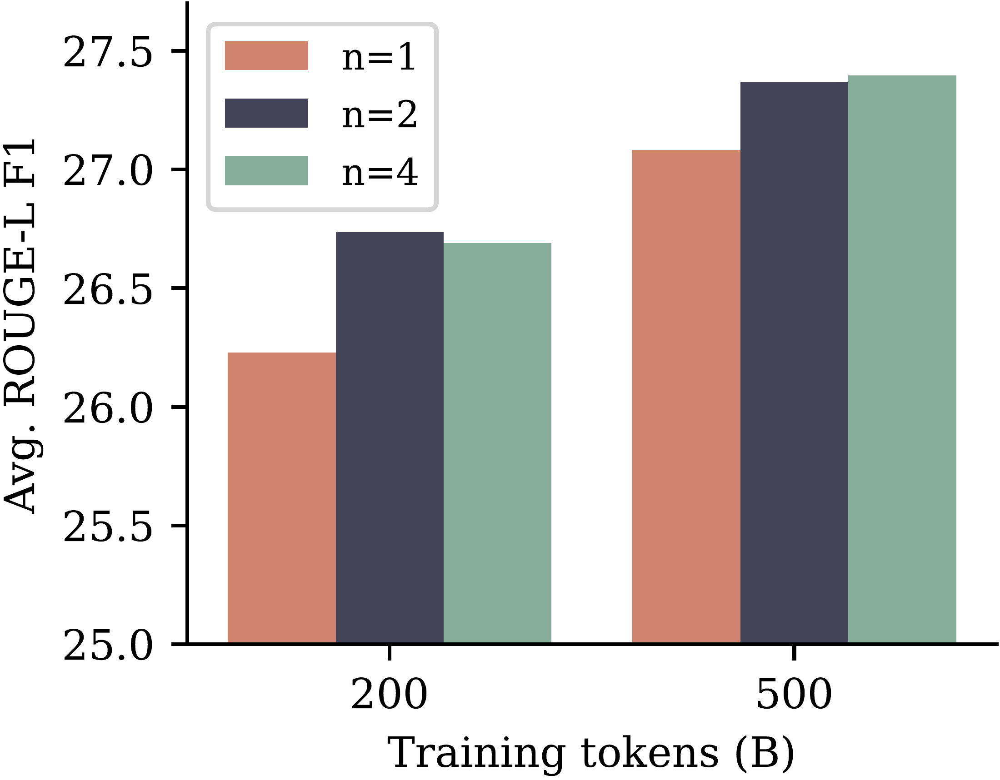
- `figure-7`: 1M–1B 模型归纳能力，30M 以下 2-token 更强，100M 后差异消失；来源同上；CC BY 4.0；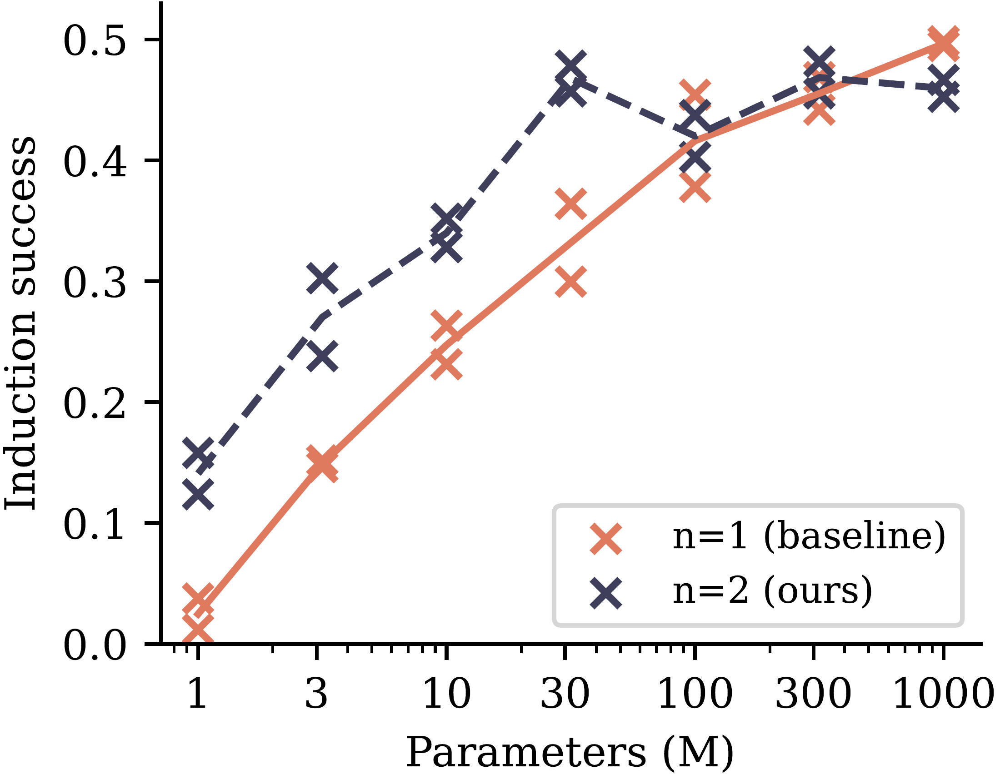
- `figure-8`: 多项式算术的域内/域外泛化，multi-token 跨难度提升；来源同上；CC BY 4.0；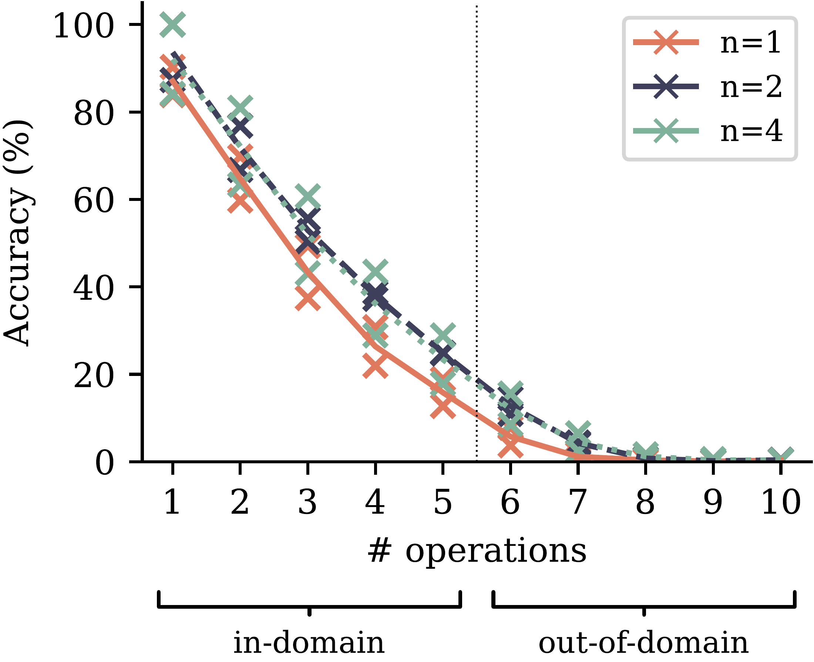
- `figure-9`: consequential choice point 的隐式加权示例；来源同上；CC BY 4.0；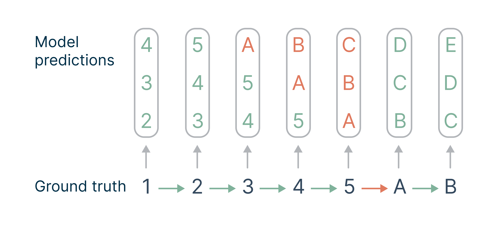
- `figure-S10`: self-speculative 相对速度/延迟随 head 数，见附录 A；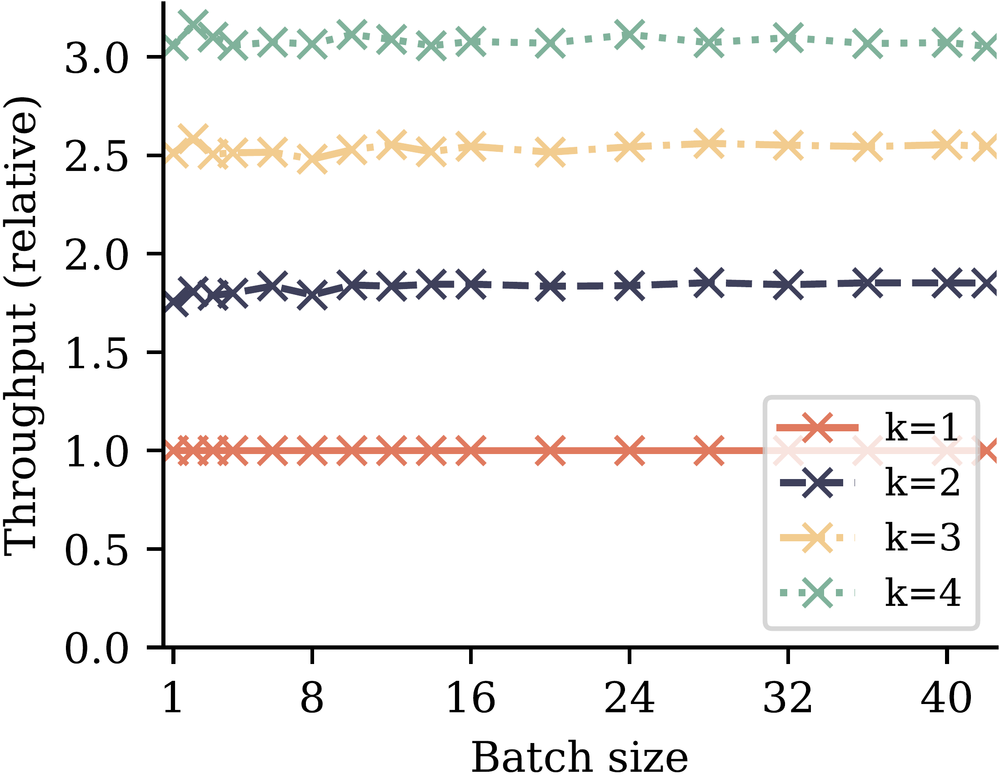

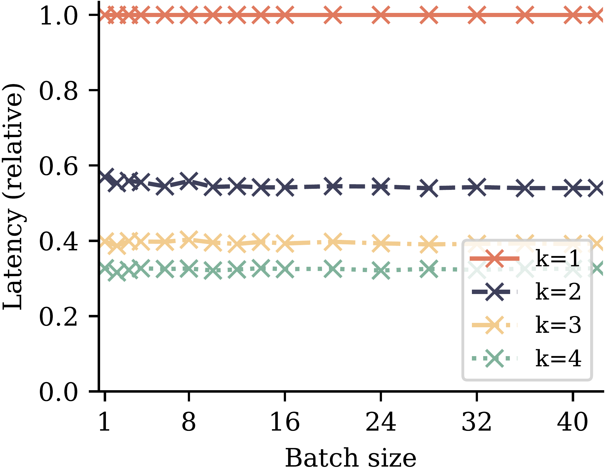
- `figure-S13`: GSM8K 200B/500B 的采样 pass@k，展示数据规模反转与 $`n=4`$ 退化；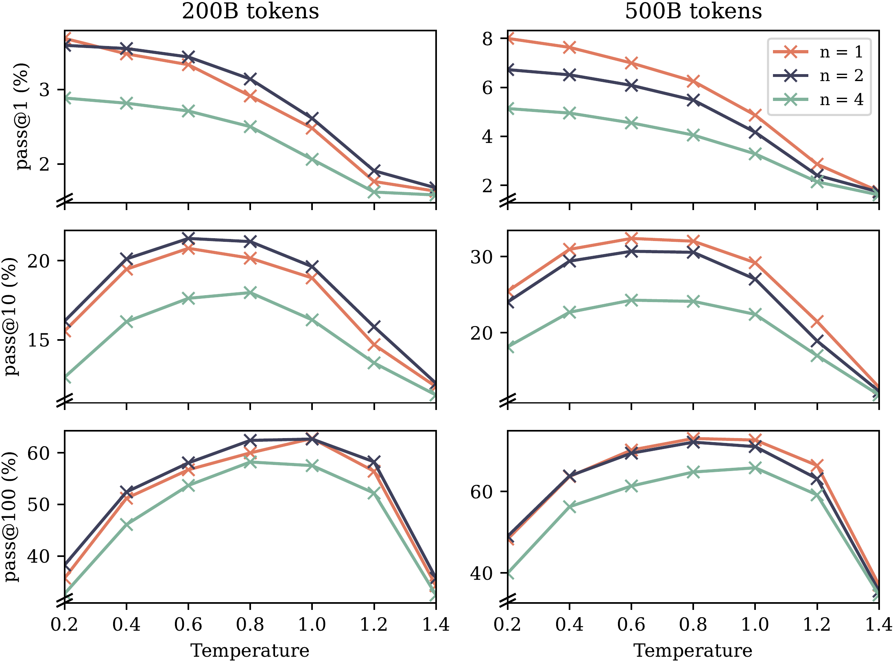
- `figure-S14`–`S16`: 更高质量数据下 induction、pause-token 多项式任务、模型规模对比；用于定位附录中的阴性/未证实解释。

## 与推理时 token 效率的关系、局限与问题

这篇论文对推理时 token 效率的直接贡献是 self-speculative decoding：额外预测头可在一次共享 trunk forward 周围提出多 token 候选，再由验证过程接受一部分，代码 7B 约 $`3\times`$、字节模型约 $`6.4\times`$ 的相对速度是论文实测的特定 greedy 设置。训练贡献是通过未来位置辅助损失改变表示与样本效率；它不能被改述为“训练一次就把每个输出压缩成更少 token”，也不能保证所有语言、规模、数据预算和解码器上都提升。

局限包括：小模型和 natural-language choice/GSM8K 上的退化；$`n`$ 对数据分布敏感；代码 pass@k 使用 oracle temperature；主实验没有完整披露统一的端到端 FLOP、能耗或质量约束下成本曲线；推理实验以 greedy、固定 prompt/生成长度和 self-speculative 实现为主；作者的 choice-point、互信息、computation-sharing 解释主要是结构分析或小任务证据，不是严格的机制因果验证；直接对已有 Llama 2 的 4-token 微调也没有稳定收益。还需进一步确认不同 tokenizer、采样策略、长上下文和大于 13B 模型下的效果，以及多 head 的验证开销、拒绝率与真实服务吞吐。

**供主代理继续核对的问题**：作者 TeX 中图 1–9 的原始文件名和具体许可声明；代码实现是否公开并与本文 v1 完全对应；主表 1 使用的 7B checkpoint、采样脚本和 oracle temperature 是否可复现；后续工作是否改变了“独立条件 heads”与 speculative verifier 的定义。
