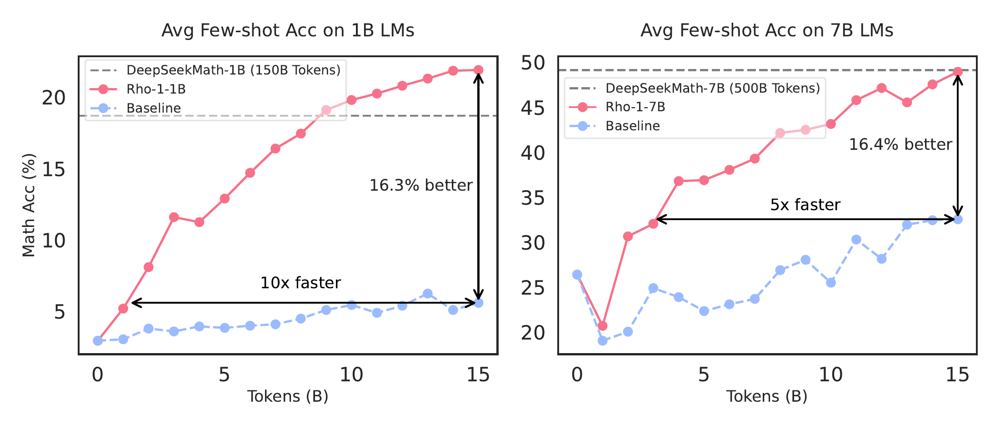
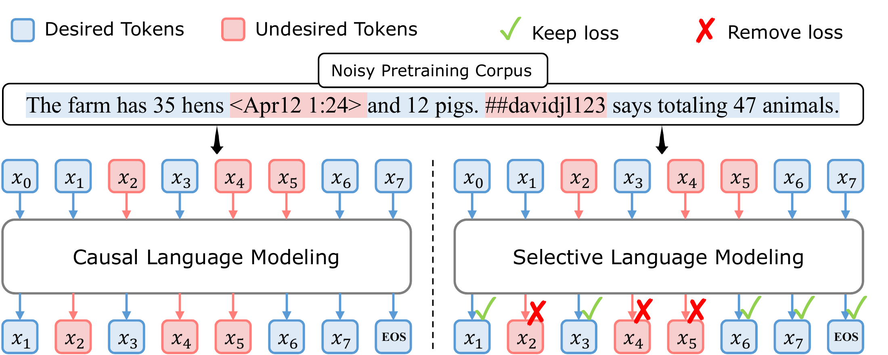
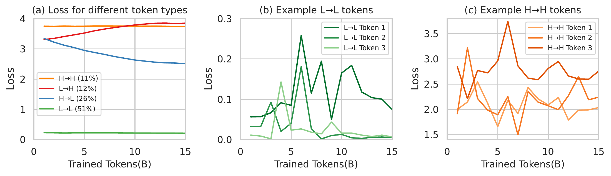
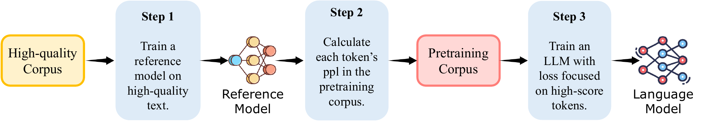
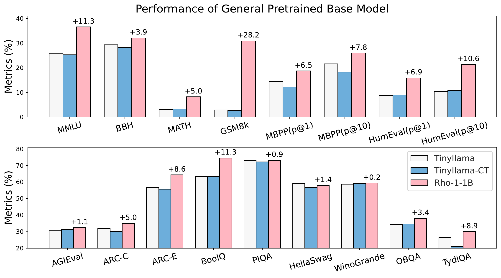
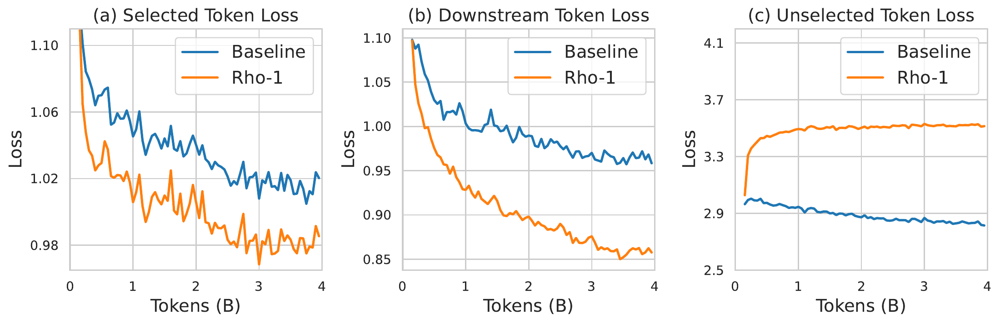
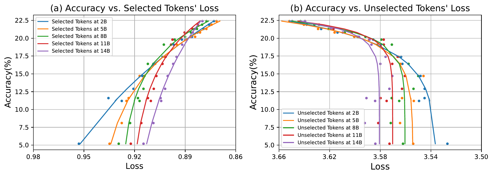
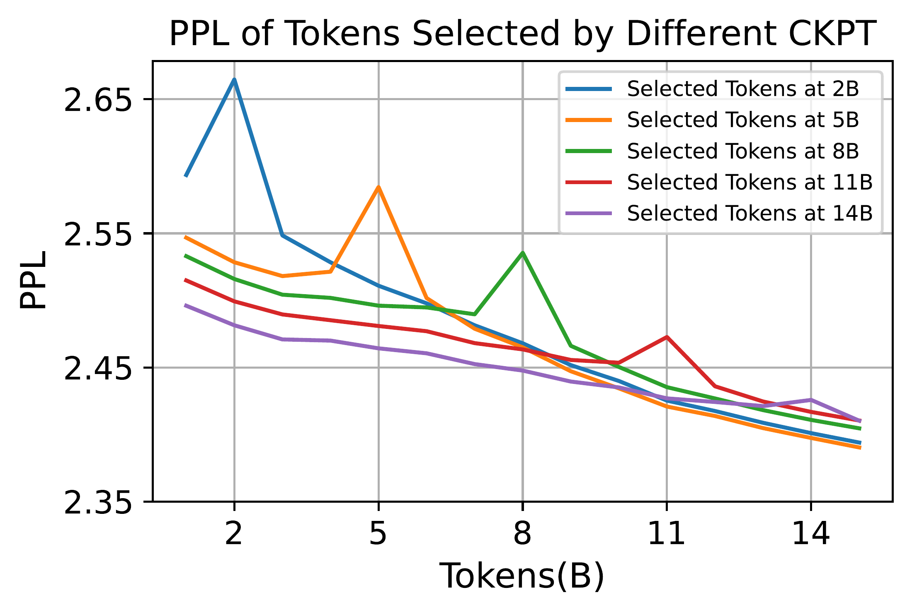
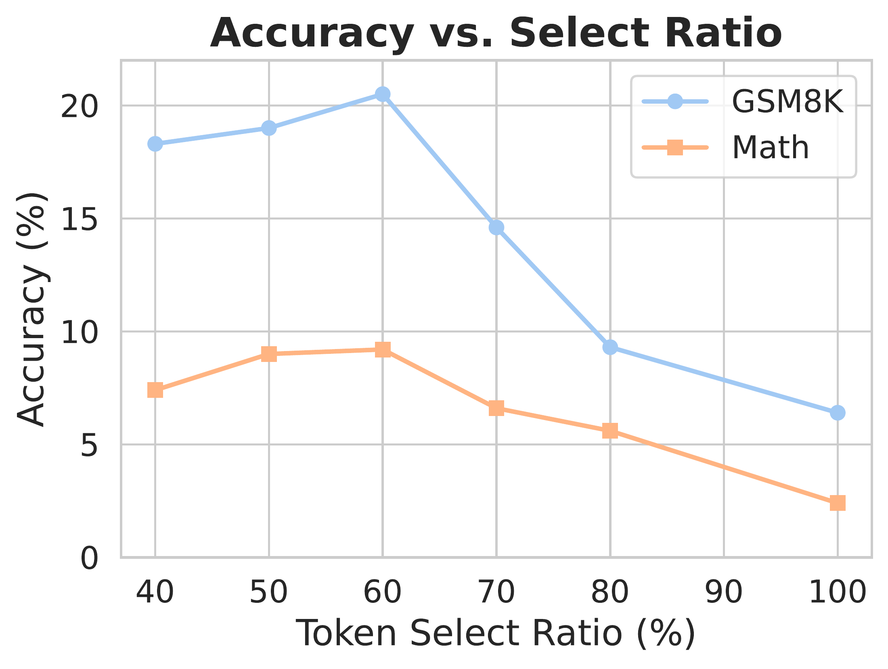

# Rho-1: Not All Tokens Are What You Need

[所属章节](../index.md) · [来源与阅读状态](../../../../sources/papers.json)


- **作者**：Zhenghao Lin, Zhibin Gou, Yeyun Gong, Xiao Liu, Yelong Shen, Ruochen Xu, Chen Lin, Yujiu Yang, Jian Jiao, Nan Duan, Weizhu Chen（前两位作者 equal contribution）
- **年份与固定版本**：2024；arXiv v1，提交于 2024-04-11（固定阅读截止 2026-09-09）
- **原始链接**：[arXiv:2404.07965v1](https://arxiv.org/abs/2404.07965v1)，[v1 HTML](https://arxiv.org/html/2404.07965v1)
- **实际阅读范围**：v1 正文 §§1–5（Introduction、Selective Language Modeling、Experiments、Related Works、Discussion and Future Work），正文图 1–9 与表 1–3 的文字/表格；为理解正文补读附录 B 的四类 token 说明、C 的评测索引、D 的 loss–下游关系说明、E 的 token 例子说明。未将 v2–v4 的修改作为证据。

## 1. 问题与核心主张

标准 causal language modeling（CLM）对序列中的每一个下一个 token 都计算 next-token cross-entropy。论文的出发点是：即使文档级过滤已经做得很好，文档内部仍有噪声、幻觉、歧义或与目标任务无关的 token；删掉这些 token 会破坏上下文或引入偏置，而对每个 token 一律反向传播又可能把计算花在已经会的 token 或难以收敛的噪声 token 上。因此作者问的是更细的粒度：一个序列仍然完整输入模型，但是否只应让一部分 token 的预测误差产生训练信号？

论文提出 **Selective Language Modeling（SLM）**，并据此训练 Rho-1。它不从文本中删除 token，也不改变 token 在上下文中的位置；它只把低价值 token 的 loss mask 掉。关键筛选分数是“训练模型对该 token 的 loss”相对“高质量参考模型对该 token 的 loss”的 **excess loss**。高 excess loss 的 token 同时满足两点：当前模型还没有学好，而且参考模型认为它更符合期望分布、因而较可学习。主实验在 OpenWebMath 数学持续预训练及 80B 一般语料持续预训练上验证 SLM。

这是一种训练目标/训练 token 预算方法。论文报告的是训练阶段使用的 token 数、few-shot/微调后的任务准确率和 loss 曲线；它没有测量推理时输入/输出 token 数、生成长度、端到端延迟或 KV-cache 占用。因此“token efficiency”在本文中首先是训练信号和训练 token 的效率，不能直接解释成部署阶段会少生成 token。

## 2. 训练动态动机：四类 token

作者用 TinyLlama-1B 在 OpenWebMath 上继续训练 15B token，每消费 1B token 保存一个 checkpoint，再在约 320,000 token 的验证集上反复计算逐 token loss。按训练开始和结束时的高/低 loss 及轨迹，正文图 3 将 token 分成：

1. **H→H**：持续高 loss，约 11%，可能包含高 aleatoric uncertainty 或噪声；
2. **L→H**：从低 loss 变高，约 12%，训练中反而恶化；
3. **H→L**：从高 loss 降低，约 26%，是明显从训练中受益的 token；
4. **L→L**：始终低 loss，约 51%，大多已经被模型学会。

总体 loss 平滑下降并不意味着每个 token 的 loss 都稳定下降。图 3(b)(c) 展示 L→L 与 H→H 中仍可能有大幅波动；附录 B 的内容检查显示不少这类 token 是噪声。作者因此把“对全部 token 一律训练”解释为会产生大量无效或不稳定的梯度更新。这个四类分析是动机性观察，不是 SLM 的在线分类规则；实际 SLM 使用参考模型 loss 与当前训练 loss 的差来排序。

## 3. SLM 定义与训练流程

### 3.1 三步管线

**Step 1：训练参考模型（reference model, RM）。** 先选能代表目标分布的高质量数据，在其上用普通 cross-entropy 训练 RM。数学 RM 使用约 0.5B 数学 token（GPT 合成数据与人工整理数据的混合），一般 RM 使用约 1.9B 开源指令/高质量数据（例如 Tulu-v2、OpenHermes-2.5），均训练 3 epochs。主实验中 RM 与持续预训练模型初始化自同一个 base model；弱到强实验单独测试了 1B RM 引导 7B 模型。

**Step 2：用 RM 给大语料逐 token 打分。** 对语料中的 token $`x_i`$，参考损失是

```math
\mathcal{L}_{\mathrm{ref}}(x_i)=-\log P_{\mathrm{RM}}(x_i\mid x_{<i}).
```

RM 不是在每一步重新训练，而是一个固定的目标分布评估器。小的 RM loss 表示该 token 在高质量目标分布下更容易/更符合；它本身不是选择分数。

**Step 3：训练目标模型，只保留高 excess-loss token 的 loss。** 先定义目标模型当前的逐 token loss $`\mathcal{L}_{\theta}(x_i)`$，再定义

```math
\mathcal{L}_{\Delta}(x_i)=\mathcal{L}_{\theta}(x_i)-\mathcal{L}_{\mathrm{ref}}(x_i).
```

在一个 batch 的 $`N`$ 个 token 中，按 $`\mathcal{L}_{\Delta}`$ 排序，选 top $`k\%`$，令指标函数

```math
I_{k\%}(x_i)=
\begin{cases}
1,&x_i\text{ 位于 excess loss 的 top }k\%,\\
0,&\text{否则}.
\end{cases}
```

SLM loss 为

```math
\mathcal{L}_{\mathrm{SLM}}(\theta)=
-\frac{1}{N\,k\%}\sum_{i=1}^{N}I_{k\%}(x_i)\log P_{\theta}(x_i\mid x_{<i}).
```

分母按选中 token 数归一化，避免只是因为 mask 了 token 就把梯度整体缩小。$`k`$ 是选中比例，不是序列长度截断比例；例如 $`N=10`$、$`k=60\%`$ 时，10 个 token 都进入前向上下文，但只有 excess loss 最大的 6 个位置进入 loss/反向信号。若一个 token 对 RM 也很难，二者 loss 都高，则差值未必高；若目标模型已会而 RM 认为它容易，差值也低。故筛选偏向“目标模型还不会、RM 认为有价值且可学习”的 token。

### 3.2 哪些 token 参与前向与 loss

SLM 的输入仍是完整序列：被选中与未选中的 token 都作为上下文参与 transformer 的前向计算，后续 token 的 hidden state 也会看到它们。mask 只作用于逐位置 cross-entropy 及其反向梯度；未选中位置不直接贡献目标 loss。论文把它描述为“selectively removes the loss”，而不是从文本中删除 token。由此可以保留语义和邻接关系，但不能声称前向 FLOPs 按 $`k\%`$ 等比例减少：logits 仍需为整段序列计算，且 RM 打分本身是额外的离线/预处理成本。

一个可跟踪的教学例子：设句子 token 为 `[Solve, 2, +, 2, =, 4]`，当前模型与 RM 对 `4` 的 loss 分别为 2.0 和 0.4，excess 为 1.6；对 `Solve` 分别为 0.3 和 0.2，excess 为 0.1。若 batch 的 top-50% 选中 `4` 及另一高差值位置，`Solve` 仍被输入模型并帮助预测后续 token，但其自身 CE 项乘以 0，不产生直接梯度。这个例子只说明 mask 机制，不是论文报告的样本或数值。

### 3.3 实现与边界

作者称在 batch 内按 excess loss 排序并取 top $`k\%`$，可以不增加预训练阶段的额外成本、容易集成；严格地说，RM 的评分需要预先跑过语料，且每个训练 batch 仍需先得到当前模型的逐 token loss 才能排序。正文没有给出分布式 tie-breaking、跨 batch 统计、动态更新 RM、精确 wall-clock 或 FLOPs accounting；这些实现细节不能由公式补造。$`k`$ 是经验超参，主实验 TinyLlama 用 60%，Mistral-7B 用 70%。

## 4. 实验设置

数学持续预训练使用约 14B token 的 OpenWebMath（OWM）。一般域使用 SlimPajama、StarCoderData 与 OWM，总计 80B token，混合比例 6:3:1。数学实验从 TinyLlama-1.1B 与 Mistral-7B 开始，学习率分别为 $`8\times10^{-5}`$ 与 $`2\times10^{-5}`$；一般域 TinyLlama 用 $`10^{-4}`$。batch size 都是 1M token；最大序列长 1B/7B 分别为 2048/4096，参考模型训练部分给出最大 LR $`5\times10^{-5}`$（1B）与 $`10^{-5}`$（7B）、cosine decay。基线是同 base model、同 OWM 的普通持续 CLM：Tinyllama-CT 与 Mistral-CT。评测用 lm-eval-harness、math-eval-harness，推理加速用 vLLM 0.3.2。

数学 few-shot CoT 的任务是 GSM8K、MATH（采用 OpenAI 子集，规避公开训练污染）、SVAMP、ASDiv、MAWPS、TAB、MQA/MMLU STEM、SAT。SAT 只有 32 道四选一题，作者在可用时对最后三个 checkpoint 平均。表 1 的 `Uniq. Toks` 只统计唯一数学相关 token；对 Rho-1 该列只算真正用于训练的 selected token，`Train Toks` 则是训练消耗量，不能把两列混为同一个数据量。

## 5. 主实验结果

### 5.1 Few-shot CoT（表 1）

在 TinyLlama-1B 持续预训练上：

- Tinyllama-CT 使用 15B train token，平均 21.6；
- Rho-1-Math 用 9B train token（相对 15B 少 40%），平均 38.1，较 CT 高 16.5 个百分点；GSM8K 29.8、MATH 14.0、SVAMP 49.2、ASDiv 61.4、MAWPS 79.8、TAB 25.8、MQA 30.4、MMLU STEM 24.7、SAT 28.1；
- 多 epoch 的 Rho-1-Math 用 30B train token，平均 40.9，说明更长训练仍可提高结果，但这不是与 9B 预算相同的比较。

在 Mistral-7B 上：Mistral-CT 用 15B token，平均 55.8；Rho-1-Math 用 10.5B（少 30%），平均 66.2，提升 10.4 个百分点。它在 GSM8K/MATH 为 66.9/31.0，CT 为 42.9/22.2。论文将 Rho-1-7B 的 15B OWM 预训练（其中 10.5B selected）与 DeepSeekMath-7B 的 500B 数学相关 token 相比，称取得可比的 few-shot 结果；但这是不同模型、数据管线和训练预算定义下的文献对照，不是严格同条件复现或相同计算量证明。

图 1 展示随训练 token/进度的平均 GSM8K+MATH 曲线：SLM 超过 CLM baseline，且达到 baseline 精度约快 5–10 倍。图中是任务准确率随训练进程的间接效率证据，并非部署推理 token 曲线。

### 5.2 Tool-integrated reasoning（表 2）

作者把预训练模型再在 ToRA-69k 上微调：约 16k GPT-4 生成的工具轨迹与 53k LLaMA answer-augmented 样本。TinyLlama-CT+ToRA-69k 平均 50.7，Rho-1-Math-1B 平均 56.9，提升 6.2；其 GSM8K/MATH 为 59.4/40.6。Mistral-CT 平均 72.6，Rho-1-Math-7B 平均 75.3，提升 2.7；MATH 为 51.8。Rho-1 的 MATH 40.6%（1B）与 51.8%（7B）被作者称为当时 SOTA，并与 DeepSeekMath-7B 的 52.0 对照。未参与 SFT 的 unseen 类任务也有收益：表 2 中包含 SVAMP、ASDiv、MAWPS、TAB、GSM-Hard，作者报告平均提升分别为 6.2 与 2.7。这里的“fine-tuning 后结果”不能归因于 SLM 单独完成推理能力，因为两者都接受 ToRA SFT，能确认的是 SLM 预训练初始化更有利。

### 5.3 一般域（图 5）

TinyLlama-1.1B 在 80B 一般 token 上继续训练。相对普通 CLM，SLM 在 15 个 benchmark 的平均表现提高 6.8%，code 与 math 子任务提升超过 10%。正文图 5 是总体对比图，HTML 文字未列出 15 个任务逐项表格与完整数值，所以这里不擅自补列。一般域实验说明参考分布并不只适用于数学，但规模仍是 1B 模型、低于 100B token 的研究范围。

## 6. 分析与消融

### 6.1 Selected token loss 与下游性能（图 6、图 7）

作者用 RM 选出的 token，比较在全部 token 上训练（CLM）与选中 token 上训练（SLM）的 loss。图 6 的预训练总量约 4B token：在 selected token 上，Rho-1 的平均 loss 降得更快；在 unselected token 上，普通 CLM 的下降更明显。将图 6(a)/(c) 与 downstream loss 图 6(b) 结合，作者观察到 selected-token loss 的下降更贴近下游 loss 改善；CLM 虽能降低全体平均 loss，却不一定有效降低下游语料 loss。

图 7 在 2B、5B、8B、11B、14B checkpoint 将 selected/unselected token 平均 loss 与 GSM8K+MATH 平均 few-shot accuracy 做幂律拟合。selected-token loss 与任务准确率呈正相关（此处 loss 越低通常对应更高准确率的曲线关系），unselected-token loss 呈负相关。作者据此主张无需让所有 token loss 都下降。它是五个 checkpoint 的相关/拟合证据，不是独立因果证明。

### 6.2 选择了什么（图 8、附录 E）

OpenWebMath 的可视化样本中，保留 token 多数与数学内容相关，说明 RM 的目标分布会在 token 粒度筛掉一般网页噪声。图 8 比较在 2B、5B、8B、11B、14B checkpoint 选择出的 token 的 PPL：后期 checkpoint 选择的 token 在后期评估时 PPL 更高、早期时更低，作者解释为先处理“较大可学习空间”的 token。选中 token 的样本级 PPL 还出现先升后降的 double-descent 形态，可能是每阶段按 excess loss 选择当前最需要学习的 token 所致。这里仍然是作者的机制解释，不能把 PPL 轨迹直接等同于推理时生成长度。

### 6.3 选择比例（图 9）

作者在 1B 模型上用 SLM 训练 5B token，改变 selected ratio。图 9 显示约 60% 的比例合适，因而 TinyLlama 主实验用 60%；Mistral-7B 主实验用 70%。正文没有给出完整表格或一个跨模型、跨数据的最优比例定律，结论应限于该消融设置。

### 6.4 Weak-to-strong（表 3）

为检验 RM 不必与目标模型同规模，作者以 TinyLlama-1.1B 作为 RM，引导 Llama-2-7B 的数学持续预训练。Llama-2-7B-CT 的 GSM8K/MATH/SVAMP/ASDiv/MAWPS/TAB/MQA/MMLU-STEM/SAT/AVG 为 28.4/13.6/50.3/62.8/79.5/37.6/34.1/41.6/43.5/43.5；加 1B RM 后为 29.8/16.0/55.5/63.7/80.4/37.9/34.3/38.2/43.8/44.4。平均提高 0.9 个百分点，但 SAT 降低 5.3，说明弱 RM 的收益并非每个任务均匀。若词表不同，作者建议做 token alignment，并留作未来工作。

## 7. 讨论、局限与和推理 token 效率的关系

作者承认 SLM 会快速收敛到 RM 所代表的领域，同时提高未选择 token 的 loss；数学实验中尚未观察到明显 bias 等副作用，但一般文本/代码 loss 可能需要防止过拟合。当前验证规模受预算限制，仅覆盖不超过 7B 参数、低于 100B token；大模型也许已经自然学会压缩有用信息，SLM 的增益能否保持未知。RM 的训练成本、质量与领域覆盖是额外前置成本；作者提出未来可用高质量小模型、开源强模型甚至提供 input log-prob 的专有 API 来替代专门训练 RM，但本文没有比较这些方案。

对“推理时 token 效率”的直接关系必须分层说明：

1. **直接测量**：本文测了训练数据 token、selected token 数、训练阶段的 token-level loss、任务准确率和某些验证/下游 loss；没有测量生成输入 token、输出 token、隐藏思考 token、每题总 token、解题失败后重试 token、推理延迟或成本。
2. **间接链条**：RM 选择数学/目标分布相关 token → 预训练中 selected-token loss 下降及下游数学准确率上升 → 在相同 few-shot 评测提示下得到更高准确率，且达到 CLM baseline 准确率所需训练 token 更少。这个链条支持“以更少训练 token 学到更有用能力”，不支持“每次部署会生成更短答案”。
3. **不能替换的概念**：训练 token 节省是优化/数据效率；推理 token 减少是输出长度、隐藏推理预算或解码计算的减少。Rho-1 的输入序列仍完整前向，SLM 的 mask 不会自动减少单次部署的前向 token 数。

### 重要图与复用状态

-  图 1：数学持续预训练时 GSM8K/MATH 平均 few-shot accuracy 与训练进度，SLM 达到 CLM baseline 约快 5–10×。来源为 v1 HTML/PDF；原图 TeX/图片资产在当前网络环境未能下载，故 `local_file` 缺失。
-  图 2：上部说明文档级过滤后仍有 token 噪声；左 CLM 对所有 token 算 loss，右 SLM 仅对 useful/clean token 算 loss。方法概念图，不应误读为删除上下文。
-  图 3：四类 token loss trajectory 及 L→L/H→H 的波动示例；约 26% H→L、51% L→L、11% H→H、12% L→H。
-  图 4：RM 训练→逐 token RM scoring→按 excess loss 选择→SLM 预训练的三步流程。
-  图 5：TinyLlama-1B 在 80B general tokens 上的 15-task 结果，平均提升 6.8%，code/math 超过 10%。
-  图 6：selected/unselected token 的训练 loss 与 downstream loss（约 4B 预训练 token）。
-  图 7：selected/unselected token loss 与 GSM8K+MATH accuracy 的幂律关系。
-  图 8：不同 checkpoint 选中 token 的 PPL 与动态选择现象。
-  图 9：token selection ratio 消融，约 60% 合适。

这些图片均可从 [arXiv v1 HTML](https://arxiv.org/html/2404.07965v1) 的图引用进入作者生成的页面；本文没有确认 CC 图片许可，复用时应以 arXiv 页面许可和作者 TeX 工程实际声明为准。

## 8. 作者结论、可推出解释与未决问题的区分

- **作者结论**：token 级训练动态异质；用 RM loss 和当前 loss 的 excess loss 选 token，能在数学及一般持续预训练中以更少 selected/train token 获得更高下游表现；小 RM 也能弱到强引导。
- **公式直接推出**：未选 token 仍在上下文前向中，只有其直接 CE 项被置零；因此 SLM 是 loss selection，不是 sequence truncation 或词面删除。
- **教学化解释**：“高 excess loss”可理解为“目标模型还不会但高质量 RM 觉得值得学”的位置；它有助于理解，但不等于作者证明了 token 的因果价值。
- **未决问题**：wall-clock/FLOPs 是否节省、RM scoring 前置成本如何摊销、top-$`k`$ 是否需要动态/跨 batch 策略、不同词表对齐、7B 以上规模、长上下文及部署推理 token 曲线，正文均未充分回答。
