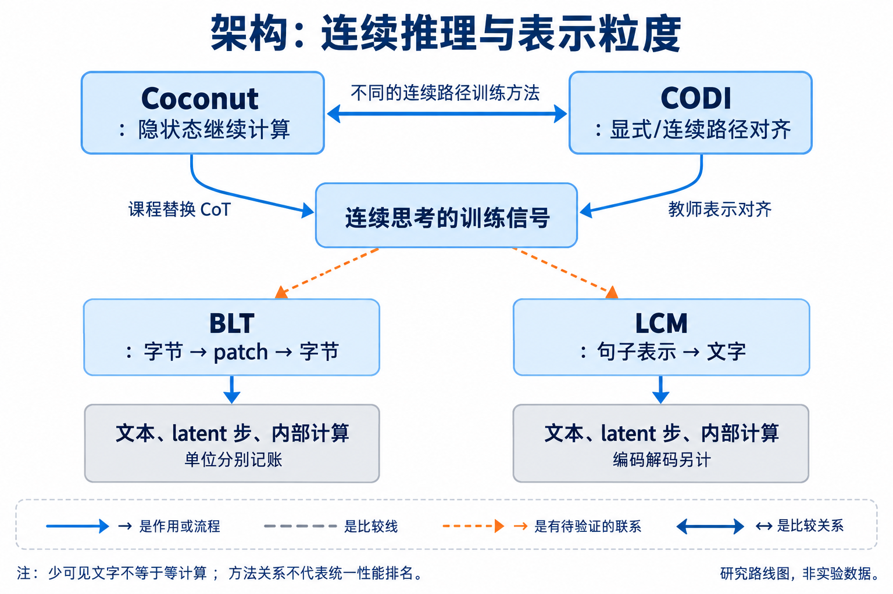
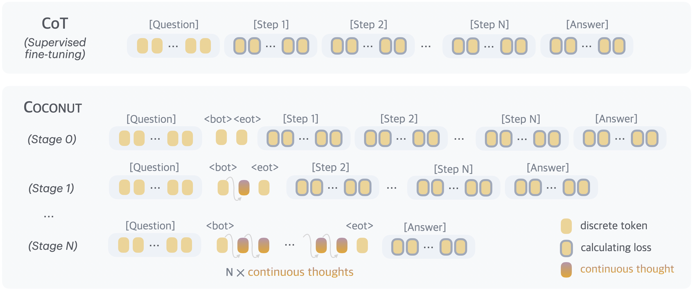
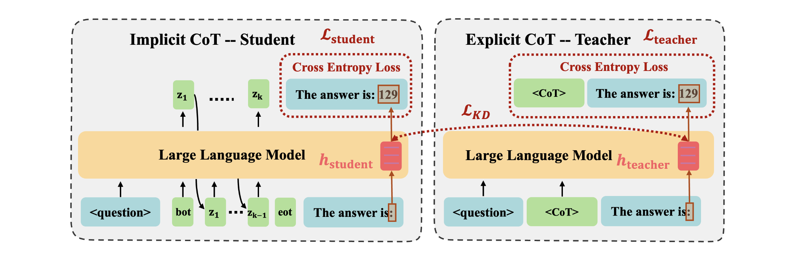
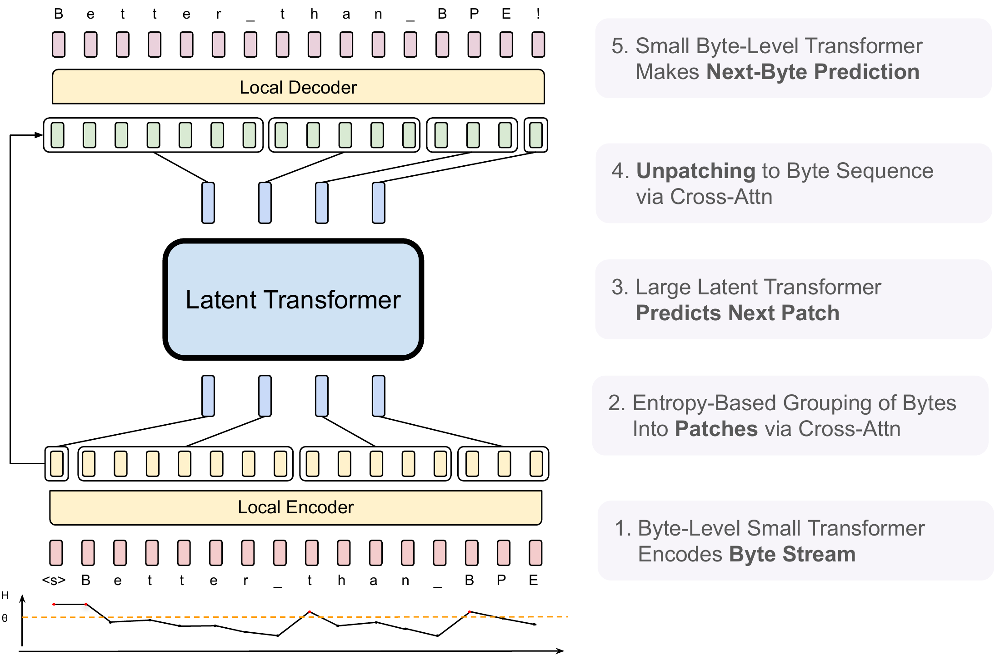

# 04 架构、表示与内部计算：少写 token 之后，计算去了哪里

[上一章：中训练](../03-midtraining/index.md) · [总论](../../00-overview.md) · [下一章：后训练](../05-posttraining/index.md)

显式 CoT 用语言 token 承载中间计算。架构路线允许模型在输出文字之前维护连续状态、反复使用网络，或者用更粗的表示处理输入。它扩展了研究空间，也改变了成本单位：可见文本变短，可以伴随仍然存在的 latent 步、局部编码器或额外前向。

## 本章地图：推理状态、输入表示与执行深度



本图由主代理综合正文关系后使用 GPT-Image 生成；连线表示文中说明的流程、比较或待验证联系，不表示统一性能排名。

| 路线 | 代表方法 | 机制差异 | 本次证据位置 |
|---|---|---|---|
| 连续状态替代文字推理 | Coconut | 上一步 hidden state 直接作为下一步输入，以课程逐步去掉显式 CoT | 有结构化推理和数学实验，任务与 latent 步数影响明显 |
| 把显式计算蒸馏进连续状态 | CODI | 教师读 CoT，学生走 latent 路径，在答案前对齐表示 | 某些配置接近显式 CoT，也有明显准确率损失 |
| 动态选择表示粒度 | BLT | 局部字节模块＋patch 级大 Transformer | 主要改善 byte/BPB/FLOPs 关系，普通 token 不再是共同单位 |
| 句子/概念级预测 | Large Concept Models | 在句子嵌入空间预测，再解码回文字 | 编码解码与扩散成本另计，详见预训练关联 |
| 改变每个位置使用的参数或层数 | MoE、SSM、循环深度 | 条件激活、状态更新或复用计算层 | 大多是内部计算效率；须另证部署 token 效果 |

关系上，Coconut 先提出连续思考接口，CODI 改变教会连续路径的方法；它们不是把相同字符串换一种 tokenizer。BLT 改变的是输入/输出字节如何分组，也不能被当作 Coconut 的变体。循环深度、MoE 和 SSM 则改变一次处理使用多少计算，与以上表示路线可以相交。[来源关系](../../../sources/adjacent-map.md) · [LCM 精读](../02-pretraining/reference/2412.08821.md)

## Coconut：让隐状态继续参与下一轮计算

普通自回归生成先从 hidden state 得到词表分布，再采样一个离散 token，将其 embedding 送回模型。Coconut 的 latent 模式省去这个离散化步骤：将当前位置最后一层的 hidden state 作为下一位置的输入表示。语言模式仍负责读取题目和输出最终答案。[原论文](https://arxiv.org/abs/2412.06769v4)

用 $h_t$ 表示模型在位置 $t$ 的输出状态，$e_{t+1}$ 表示下一位置输入，$E$ 为 token embedding。两种模式可写为：

```math
e_{t+1}=\begin{cases}
E(y_{t+1}),&\text{语言模式，先得到离散 token }y_{t+1},\\
h_t,&\text{连续思考模式。}
\end{cases}
```

这只定义接口，不能说明 $h_t$ 已经是一条可读推理步骤。它仍是高维向量，可能承载多个相关线索，也可能承载无助于解题的状态。每增加一个连续位置，模型仍需处理该位置及其历史，KV 状态和顺序依赖不会凭空消失。

训练使用分阶段替换：从显式 CoT 监督出发，逐步用连续位置替换前面的推理步骤，保留剩余的文字与答案作为监督。latent 位置没有必须匹配的词表标签，但后续文字和答案的损失可以通过连续计算传回前面的状态。这与把全部 CoT 直接删掉再做答案 SFT 不同：模型仍获得一段中间计算空间。

```text
state = encode(question)
for step in fixed_latent_budget:
    state = transformer_next(input_embedding=state, history=history)
    history.append(state)
answer = generate_text(history, end_of_thought_marker)
```

伪代码仅解释连续接口，省略了模型层、缓存和训练 curriculum。`fixed_latent_budget` 是内部计算预算，不是零成本占位。对一个需要两次中间计算的问题，文字解法可能写许多连接词，连续路径则只保留若干状态；是否仍算对必须由任务验证，不能从状态数直接推出。

作者在 ProsQA 等结构化推理任务上观察到连续路径与显式 CoT 的差异，并借助路径、注意力及解码分析讨论类似广度探索的行为。它为“一个状态容纳多个候选线索”提供了分析入口，但并不证明连续状态等同于一个已验证的广度优先搜索算法。数学任务、课程安排和 latent 数量的结果也表明，替换表示本身不足以保证原有能力。[精读：主实验、消融与解释边界](reference/2412.06769.md)



[查看原图，可放大](../../../assets/papers-v3/2412.06769/fig2.png) · [论文来源](https://arxiv.org/src/2412.06769v4)

作者的训练流程图需要与上述语言/latent 模式一起读：被替换的是监督轨迹的一部分；保留下来的文字监督和后续答案损失仍决定模型学到什么。

## CODI：教师看到推理过程，学生学习答案前的表示

CODI 给连续路径增加更直接的教学信号。教师路径读取问题和正确 CoT；学生路径读取问题，运行固定数量的连续 thoughts 后作答。两条路径使用共享模型，但在蒸馏项中，教师表示作为停止梯度的目标。[原论文 §3](https://arxiv.org/abs/2502.21074v3)

设第 $l$ 层答案提示位置的表示为 $h_T^l$ 与 $h_S^l$，共 $M$ 层。核心对齐可概括为：

```math
\mathcal L_{\mathrm{KD}}
=\frac1M\sum_{l=1}^{M}\left\|\operatorname{sg}(h_T^l)-h_S^l\right\|_1,
\qquad
\mathcal L=\alpha\mathcal L_S+\beta\mathcal L_{\mathrm{KD}}+\gamma\mathcal L_T.
```

$\operatorname{sg}$ 表示教师目标不接受该对齐项的梯度；$\mathcal L_S$ 是学生答案损失，$\mathcal L_T$ 是教师显式轨迹相关的监督目标。原实现还对激活尺度做归一化，系数随模型配置变化；上式用于突出三个学习信号，不代表可省略这些实现条件。

关键点是对齐位置。CODI 并不要求第一个 latent 必须翻译成第一句 CoT，而是让学生在准备回答时达到与教师相近的表示。举一个教学用的标量简化：教师答案前状态为 2，学生为 0，L1 对齐推动学生靠近 2；若教师路径的监督使目标也在训练中变化，停止梯度只限制本次蒸馏更新方向，不表示整个教师分支永久冻结。



[查看原图，可放大](../../../assets/papers-v3/2502.21074/fig-codi-method.png) · [论文来源](https://arxiv.org/abs/2502.21074v3)

作者方法图的两条路径对应 $\mathcal L_T$ 和 $\mathcal L_S$，跨路径的对齐连接对应 $\mathcal L_{\mathrm{KD}}$。训练时两条路径都存在，部署只运行学生路径，因此要分开计算训练开销与部署节省。

| 原文比较 | 结果及含义 |
|---|---|
| GPT-2，GSM8k | CODI 43.7%，CoT-SFT 44.1%，接近但并非严格无损 |
| LLaMA3.2-1B-Instruct，GSM8k | CODI 55.6%，CoT-SFT 61.6%，仍有明显差距 |
| 移除 L1 蒸馏，GPT-2 | 43.7%降到24.5%，支持对齐项在该配置中的作用 |
| 结构化/较冗长 CoT 的效率比较 | 压缩比与 A100、batch=1 的速度收益不同；不能按同一比例外推 |

这些比较还存在解码条件差异：原文 CoT-SFT 取多次采样平均，其他若干方法采用确定性生成。连续 thoughts 仍有计算成本，固定 thought 数也限制按题适应。将 latent 投影到词表的分析提供可检查线索，但不是完整的自然语言证明。[精读：设置、完整结果与局限](reference/2502.21074.md)

## BLT：大模型处理 patch，局部模块仍处理字节

Byte Latent Transformer 把固定词表边界改为动态字节分组。一个较小的 entropy model 预测下一字节分布，熵较高的区域需要更细粒度处理；local encoder 处理字节并形成 patch 表示，global Transformer 在 patch 级计算，local decoder 再生成字节。[原论文 §2–3](https://arxiv.org/abs/2412.09871)

设位置 $t$ 的下一字节分布为 $p_t(b)$，字节集合为 $\mathcal B$，其熵为：

```math
H_t=-\sum_{b\in\mathcal B}p_t(b)\log p_t(b).
```

采用 $0\log0=0$ 的约定。熵刻画模型对下一个字节的不确定性；它不是这个字节对最终任务的“价值标签”。论文研究基于熵阈值等分块策略。长而容易预测的片段可以组成较大的 patch，困难位置则可能形成较小 patch。



[查看原图，可放大](../../../assets/papers-v3/2412.09871/architecture.pdf) · [论文来源](https://arxiv.org/abs/2412.09871v1)

作者结构图中的字节流始终存在，patch 只减少昂贵 global 模块的处理位置。因此一个 100-byte 文本变成 20 个 patch，并不表示模型只生成了 20 个普通 API token；编码、熵预测、cross-attention 和字节解码仍需计算。

论文同时改变 patch 大小和 global 模型规模，研究固定每 byte 推理 FLOPs 时的能力与训练投入。其接近 50% 的推理 FLOPs 节省属于这一特定比较，不是实测所有部署延迟减半，也不是相同 tokenizer 下的推理文本压缩。字符操作、噪声和部分低资源语言结果支持字节访问的用途，另有词级任务与个别语种方向的反例。[精读：固定 FLOPs、BPB 与下游比较](reference/2412.09871.md)

## 当前认识与可检验机会

连续推理已有具体训练方法，且能在一些任务中用较少显式位置达到接近或更好的结果。它的主要争议包括：连续路径学到了通用计算还是数据模式，固定 latent 数是否限制难题，以及训练和部署总计算是否划算。BLT 和 LCM 则提示另一种研究对象：预测单位本身的选择。但跨表示比较需要共同的任务、原始信息量和辅助计算账，不能只看各自叫作 token 的数字。

小团队可以先固定底座和任务，比较短显式 CoT、答案 SFT、连续思考和蒸馏连续思考；对齐实际顺序计算次数并同时记录文本 token、latent 步与时间。若优势只来自少展示文字或换计量单位，应据实报告；若相同内部预算下性能提高，才有理由进一步研究表示本身。阅读顺序是 Coconut → CODI → BLT/LCM，再回到[预训练](../02-pretraining/index.md)与[系统部署](../10-systems/index.md)判断改动在哪一层。
