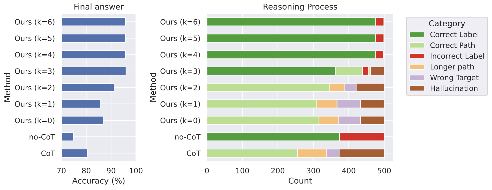
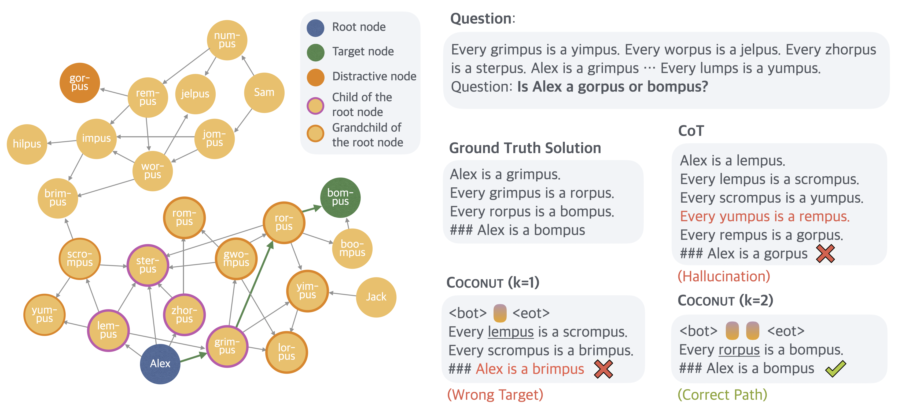
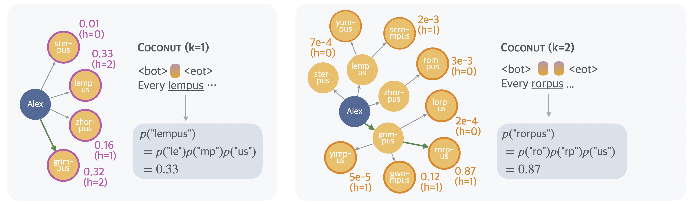
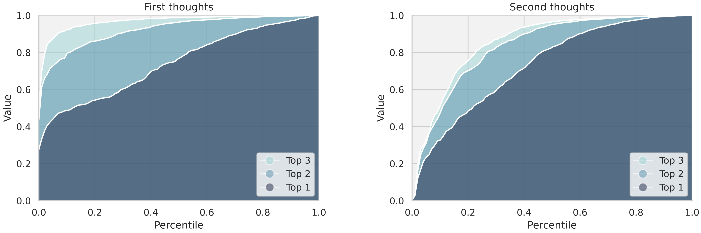
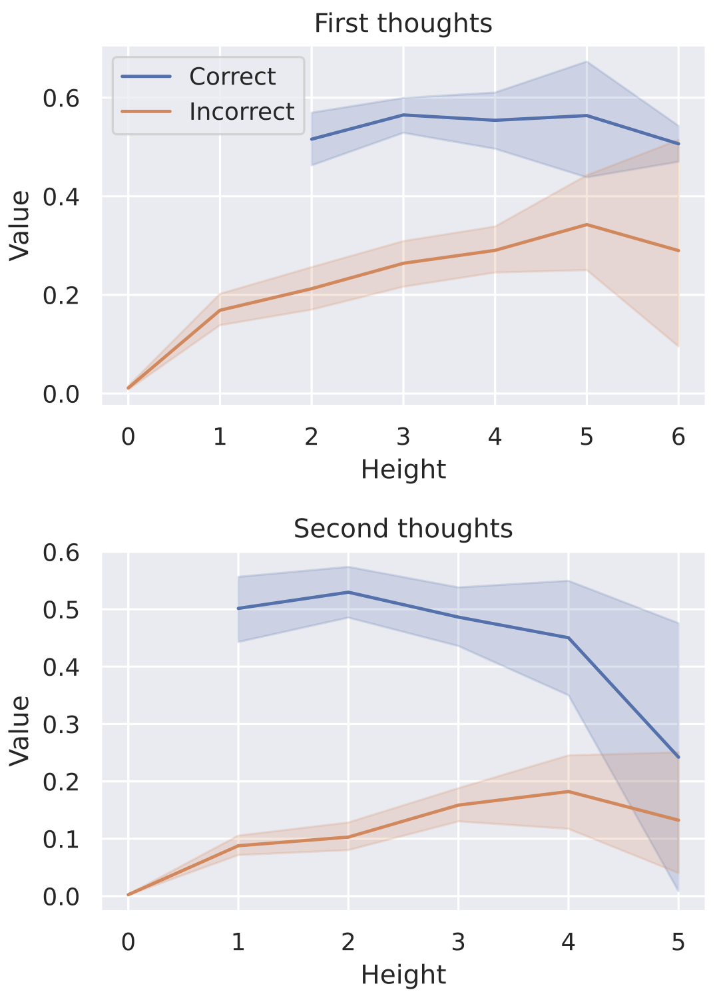
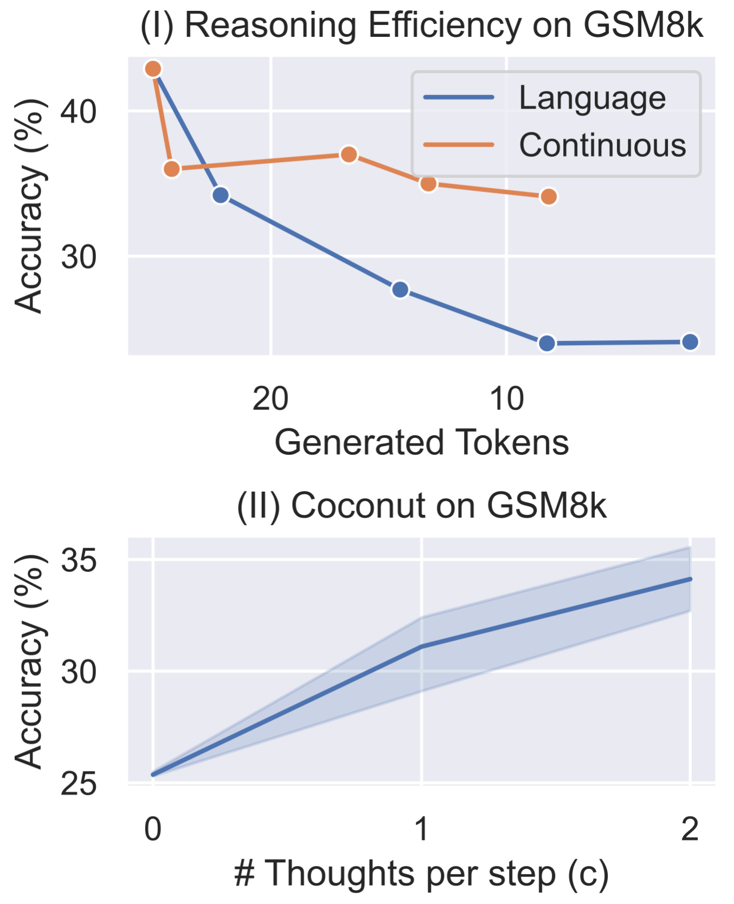
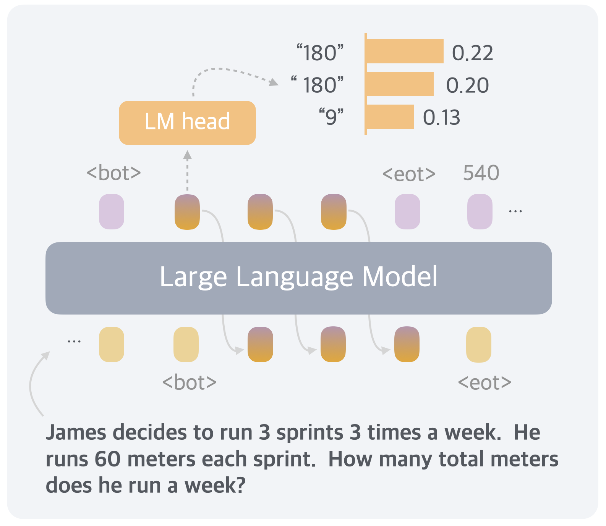

# Training Large Language Models to Reason in a Continuous Latent Space（Coconut）

[所属章节](../index.md) · [来源与阅读状态](../../../../sources/papers.json)


- **作者**：Shibo Hao, Sainbayar Sukhbaatar, DiJia Su, Xian Li, Zhiting Hu, Jason Weston, Yuandong Tian
- **年份/版本**：2026；arXiv:2412.06769v4，最后修订 2026-08-23（在 2026-09-09 截止日前的固定版本）
- **原始链接**：[arXiv abs](https://arxiv.org/abs/2412.06769)、[HTML 正文](https://arxiv.org/html/2412.06769)、[作者代码](https://github.com/facebookresearch/coconut)
- **实际阅读范围**：v4 HTML 全部正文（§1–§6）、表 1–5、图 1–9 的图注与正文解释、附录 A（ProsQA 构造和统计）、附录 B（时钟时间）、附录 C（更多连续思维和更大模型）。后续取得作者 v4 TeX 工程后，已按 `paper.tex` 的 caption/label 核对并缓存图 1–9 原始资产到 `assets/`；未宣称独立复现。

## 1. 问题、主张和边界

标准 LLM 用 next-token prediction，把中间推理写成离散语言。作者的出发点是：推理所需计算在不同 token 之间很不均匀；许多 token 主要服务语言流畅性，少数关键 token 却需要规划。语言空间还迫使模型在每一步过早选择一个词，从而难以回溯或同时保留多个候选路径。Coconut（Chain of Continuous Thought）把模型最后一层的 hidden state 直接当作下一步输入 embedding，不经过语言模型头的离散化和 embedding 查表。它的主实验性主张是：在 GPT-2、GSM8k、ProntoQA 和新构造的 ProsQA 上，这种 latent mode 可提高部分任务的准确率，并用少量可见 token 换取连续计算；在 ProsQA 上，连续表示表现出近似 breadth-first search（BFS）的行为。

这里的“BFS”必须按证据强度理解。作者没有实现显式队列、分支复制或可验证的搜索算法，而是从强制解码中间 latent thought 后得到的候选概念概率、top-1/2/3 累积曲线和节点高度相关性，提出一种行为解释。论文证明的是一组受控的 probe 现象与性能趋势，不能由此推出每个 hidden state 真的存储了可枚举的 BFS 队列，也不能推出一般任务上一定优于 CoT。

## 2. Coconut 的对象与前向计算

给定 token 序列 $`x=(x_1,ldots,x_T)`$，令 $`e(x_t)`$ 为 token embedding，$`E_t=[e(x_1),ldots,e(x_t)]`$，Transformer 输出所有位置的最后 hidden state $`H_t`$，最后一个为 $`h_t=H_t[t,:]`$。标准语言模式是

```math
H_t=\operatorname{Transformer}(E_t),\qquad
\mathcal M(x_{t+1}\mid x_{\le t})=\operatorname{softmax}(Wh_t).
```

在 Coconut 中，`<bot>` 标记连续思维开始，`<eot>` 标记回到语言模式。若 `<bot>` 位于 $`i`$、`<eot>` 位于 $`j`$，则 latent 区间 $`i<t<j`$ 的输入序列变为

```math
E_t=[e(x_1),\ldots,e(x_i),h_i,h_{i+1},\ldots,h_{t-1}].
```

这里每个 $`h_{r}`$ 已经过模型的最终 normalization，直接作为下一个位置的 embedding。latent 区间不把 $`h_t`$ 映射回词，因此论文定义的 $`\mathcal M(x_{t+1}\mid x_{\le t})`$ 在该区间没有语言输出；仍可计算 $`\operatorname{softmax}(Wh_t)`$ 作为 probe。进入 `<eot>` 后，后续位置再次使用 token embedding。这一接口只改了 hidden state→词→embedding 的离散往返，Transformer 参数仍可端到端反向传播。

直观例子：问题输入后模型得到 `<bot>`，第一个 latent forward 产生 $`h_1`$；第二次 forward 把 $`h_1`$ 当输入，产生 $`h_2`$；连续若干次后插入 `<eot>`，模型才开始输出答案或剩余语言 CoT。与“输出一个不可见的 pause token”不同，每个连续思维是一个 $`d`$ 维向量并重新经过 Transformer，它不是一个固定 embedding 的重复占位符。

## 3. 训练：用 CoT 引导，再逐步替换

直接让问题—答案监督学习所有 latent thought（论文称 `w/o curriculum`）效果很差，所以 Coconut 采用多阶段课程。Stage 0 用完整语言 CoT 训练。第 $`k`$ 个后续 stage 将 CoT 开头的前 $`k`$ 个 reasoning steps 删除，并用 $`k\times c`$ 个连续思维替代；$`c`$ 是“一条语言 reasoning step 对应几个 latent thoughts”的超参，`<bot>`/`<eot>` 不计入 $`c`$。若原链短于 $`k`$，则删除其全部语言思维。阶段切换时重置 optimizer state。

损失仍是普通自回归负对数似然，但只在连续思维之后的保留 token 上计算；问题 token 与 latent thought 都 mask 掉。因而训练目标不是“把被删掉的语言步骤逐字压缩进 hidden state”，而是要求 latent 状态帮助模型预测后续 reasoning/answer。这个位置非常关键：连续向量可以编码比人类语言更适合预测未来的表示，但论文并没有给出一个独立的 latent reconstruction loss 或语义可解码约束。

若当前 stage 有 $`n`$ 个 latent thoughts，训练需要 $`n+1`$ 次 sequential forward：逐次产生每个 $`h`$，再额外 forward 剩余文本以得到 loss。KV cache 可以避免重复计算，但连续依赖仍限制并行化；论文把训练效率优化留作未来工作。

部署时问题后立即插入 `<bot>`。`<eot>` 可以由 latent-thought 二分类器决定，也可以固定 padding 长度；二者在作者实验中表现相近，正文结果采用固定长度。所有表 1 推理使用 greedy decoding。

**教学伪代码（按作者接口写，`loss` 的 mask 是要点）：**

```text
for stage k = 0..N:
    reset_optimizer_state()
    for (question, cot_steps, answer) in data:
        prefix = question + <bot>
        # 删除前 k 个语言步骤；每步由 c 个 latent state 代替
        latent = []
        state = prefix
        for r in 1..(k*c):
            h = Transformer(state).last_hidden
            latent.append(h)
            state = state + h                 # h 是下一位置的 embedding
        suffix = <eot> + cot_steps[k:] + answer
        logits = Transformer(state + suffix)
        loss = CE(logits, suffix)              # question 和 latent 区间 mask
        update(loss)
```

伪代码是教学展开：实现中可用 KV cache，且 stage 的 epoch/数据细节随任务变化。它不表示作者实现了显式搜索或将 latent 分支复制。

## 4. ProsQA：控制 latent 长度的搜索证据

ProsQA 是作者新建的逻辑数据集：每个问题给出由自然语言陈述表达的 DAG，询问实体是否属于概念 A 或 B。图保证从实体到 A 有路径而到 B 无路径；概念 A/B 在每题随机置换以减少位置捷径。新节点随机从旧节点连入，使用 descendant group 的 bitwise OR 标记避免同时落在两类分支；边数、深度和干扰支路使其比 ProntoQA 更要求规划。附录统计为 17,886/300/500 train/validation/test，平均 23 个节点、36 条边、最短路径长度 3.8、最短路径数 1.6（表 2–3）。

ProsQA 的 GPT-2 设置：学习率 $`10^{-4}`$，有效 batch size 128；最大 reasoning steps=6，6 个 stage，每 stage 5 epochs，最后 stage 继续训练直到总计 50 epochs，选 validation accuracy 最好 checkpoint。CoT baseline 用完整 CoT 训练并完整生成；no-CoT 只用问题—答案。为隔离推理空间，Coconut 的同一模型权重在推理时手动决定 $`k\in\{0,1,2,3,4,5,6\}`$ 个 latent thoughts，之后才输出从第 $`k+1`$ 步开始的语言链；这些变体只差 inference-time 的 `<eot>` 位置。

评估同时看最终答案和路径类别：Correct Path（到正确答案的最短路径）、Longer Path（有效但非最短）、Hallucination（不存在边/断开的路径）、Wrong Target（有效路径但目标错）；若模型只给标签则为 Correct Label/Incorrect Label。这避免把只有答案的 no-CoT 与显式路径混成同一类别。

**图 3（）**给出最终准确率和路径类别随 $`k`$ 的变化：CoT 常在早期走错后幻觉不存在边或指向错误目标；增加连续思维提高正确路径/标签比例并减少两类错误。**图 4（）**的单例中，CoT 卡在死路后虚构 “Every yumpus is a rempus”；Coconut $`k=1`$ 仍到无关节点，$`k=2`$ 解对。这个例子说明延迟语言承诺可能有用，但不是平均因果证据。

**隐状态反馈的 BFS 式解释。**作者在中间 latent state 后强制模型输出语言概念，估计每个概念所有 token 条件概率的乘积，把它称为隐式 value function。图 5（）案例中第一步候选 `lempus` 的 value 最高为 0.33；第二步最高变为 `rorpus`（0.87），它是另一分支 `grimpus` 的子节点，而非沿着第一步的贪心选择继续。这支持“先保持多个候选、后续再聚焦”的类 BFS 描述。图 6（）在测试集画第一/第二 latent thought 的 top-1/2/3 累积 value 分位数：第一步三条曲线间隔较大，第二步间隔收窄，作者据此解释为先并行探索后收敛。

作者进一步定义节点 height 为到叶子的距离，并观察图 7（）中 correct/incorrect 节点的 value 与 height。低 height 节点的概率评估更确定，高 height 节点更模糊；这符合“离终点近更容易评估，故先延迟远端决定”的解释。证据限度是：value 是在强制解码 probe 下的概念 token 概率，height 与正确性来自合成 DAG；曲线和一个案例揭示相关关系，不能证明 hidden state 显式维护 BFS frontier，更不能把它等同于带完备性保证的图搜索。

## 5. 主实验、消融和成本

表 1 使用 GPT-2，GSM8k 训练数据是由既有工作生成的 synthetic CoT 数据；GSM8k 使用 $`c=2`$，初始 stage 后再 3 个替换 stage，并加一个用 $`3c`$ latent thoughts、删除全部剩余语言链的 stage；初始 stage 6 epochs，其余各 3 epochs。ProntoQA/ProsQA 使用 $`c=1`$、6 个替换 stage、每 stage 5 epochs。所有任务最终 stage 都训练到总 50 epochs，验证集选 checkpoint。表中 #Tokens 是**推理时新生成的离散 token 数**，不是 latent forward 次数、隐藏向量维度、训练 FLOPs 或总 wall-clock；因此 Coconut 的 8.2/9.0/14.2 不包含连续思维的隐式计算成本。

| 方法 | GSM8k Acc / tokens | ProntoQA Acc / tokens | ProsQA Acc / tokens |
|---|---:|---:|---:|
| CoT | $`42.9\pm0.2`$ / 25.0 | $`98.8\pm0.8`$ / 92.5 | $`77.5\pm1.9`$ / 49.4 |
| No-CoT | $`16.5\pm0.5`$ / 2.2 | $`93.8\pm0.7`$ / 3.0 | $`76.7\pm1.0`$ / 8.2 |
| iCoT | $`30.0^*`$ / 2.2 | $`99.8\pm0.3`$ / 3.0 | $`98.2\pm0.3`$ / 8.2 |
| Pause token | $`16.4\pm1.8`$ / 2.2 | $`77.7\pm21.0`$ / 3.0 | $`75.9\pm0.7`$ / 8.2 |
| **Coconut** | **$`34.1\pm1.5`$ / 8.2** | **$`99.8\pm0.2`$ / 9.0** | **$`97.0\pm0.3`$ / 14.2** |
| w/o curriculum | $`14.4\pm0.8`$ / 8.2 | $`52.4\pm0.4`$ / 9.0 | $`76.1\pm0.2`$ / 14.2 |
| w/o thought | $`21.6\pm0.5`$ / 2.3 | $`99.9\pm0.1`$ / 3.0 | $`95.5\pm1.1`$ / 8.2 |
| pause as thought | $`24.1\pm0.7`$ / 2.2 | $`100.0\pm0.1`$ / 3.0 | $`96.6\pm0.8`$ / 8.2 |

`*` iCoT 的 GSM8k 数字来自引用工作，不是本论文同一训练流程重新测得的数值。Coconut 相对 no-CoT 在 GSM8k 从 16.5 到 34.1、ProsQA 从 76.7 到 97.0，并在 ProntoQA 几乎与 iCoT 持平；相对 CoT，ProntoQA/ProsQA 用更少可见 token 达到更高准确率，但 GSM8k 仍低于 CoT。两种 synthetic logical 任务中 iCoT、w/o thought、pause as thought 也很强，说明这些任务可能不受纯计算容量限制；GSM8k 的上下文建模更难，连续思维收益更明显。

图 8（）进一步比较推理准确率—生成 token 的折中：$`c`$ 从 0→1→2 时 GSM8k 准确率上升。作者训练一组逐渐内化 $`m=0,1,2,3,\mathrm{ALL}`$ 个 CoT 步骤的语言模型，发现省略越多语言步骤准确率快速掉；用每步两个连续思维替代时掉幅较小。图 9（）把第一个连续思维 probe 成语言 token，常对应数学中间变量；这是可解释性示例，不是训练目标或忠实性证明。

消融的关键失败是 `w/o curriculum`：直接在最后 latent stage 训练，GSM8k 14.4、ProntoQA 52.4，接近或差于 no-CoT；因此 CoT→latent 的替换课程是必要条件。`w/o thought` 保留课程却不放连续向量，和 iCoT 思路相近但 schedule 不同；`pause as thought` 用固定 `<pause>` token 加同一课程，均在 ProsQA 低于 Coconut，说明收益不能简单归因于增加占位长度。作者也报告 $`c=3`$ 在 GSM8k 训练不稳定：尤其最后 stage 一次增加三个 latent thought 会造成 loss spike 和性能/方差恶化（附录 C.1）。这是明确的负结果，支持更细粒度替换 schedule 的未来方向。

**时钟时间与 token 不能混同。** 附录 B 在 batch size=1 的 Nvidia A100 上测每测试样例平均推理秒数：No-CoT 为 GSM8k/ProntoQA/ProsQA 的 0.03/0.03/0.08，CoT 为 0.26/0.85/0.47，Coconut 为 0.09/0.11/0.15。时钟时间大致随新生成 token 增长，但 Coconut 的 latent steps 仍需 sequential forward；论文没有报告按 latent step、FLOPs、显存或训练时间归一化的完整成本前沿，也没有把 8.2 等 token 当作总计算量。表 1 的效率结论应读作“更少可见输出 token 下的准确率—token trade-off”，而不是“同等硬件成本下已证明更快”。

更大模型附录 C.2：Llama 3.2-3B 在 GSM8k no-CoT 26.0、Coconut 31.7；Llama 3-8B 为 42.2、43.6，均为 $`c=1`$，初始 3 epochs、后续各 1 epoch。增益小于 GPT-2；作者推测大模型已经大量语言预训练，转入 latent reasoning 更难。这是可推广性的警示，不是大模型规模定律。

## 6. 图目录与复用状态

作者 v4 TeX 工程已提供原始图片；以下按 `paper.tex` 的 caption/label 与 include 路径核对。论文页面使用 arXiv perpetual non-exclusive license，尚未核对逐图第三方许可，故 `reuse_allowed` 仍标为 `unknown`，整合发布前应再次核验。

- `fig1`：方法总览，CoT 的离散 token 序列与 Coconut 直接反馈最后 hidden state 的比较。TeX `paper.tex:69-74`, label `fig:motivation`, include `figures/figure_1_meta_3.png`；`local_file: assets/fig1-motivation.png`，`reuse_allowed: unknown`。
- `fig2`：多阶段训练，每步以 $`c`$ 个连续思维替代语言步骤，剩余 token 上算 CE。TeX `paper.tex:126-132`, label `fig:training`, include `figures/training_stage_figure.png`；`local_file: assets/fig2-training-stage.png`，`reuse_allowed: unknown`。
- `fig3`：ProsQA 最终答案准确率和路径类别随 Coconut 变体变化。TeX `paper.tex:169-174`, label `fig:analysis`, include `figures/figure_5_revised_1111.png`；`local_file: assets/fig3-prosqa-results.png`，`reuse_allowed: unknown`。
- `fig4`：ProsQA 失败/成功案例，CoT 幻觉边，Coconut $`k=2`$ 解对。TeX `paper.tex:192-202`, label `fig:interpret`, include `figures/new_figure_6.png`；`local_file: assets/fig4-prosqa-case-study.png`，`reuse_allowed: unknown`。
- `fig5`：潜在搜索树与概念 value（0.33→0.87 的非贪心路径）。TeX `paper.tex:192-212`, label `fig:height`, include `figures/new_figure_7.png`；`local_file: assets/fig5-latent-search-trees.png`，`reuse_allowed: unknown`。
- `fig6`：第一/第二 latent thought 的 top-1/2/3 累积 value 分位数。TeX `paper.tex:222-229`, label `fig:percentile`, include `figures/percentile.png`；`local_file: assets/fig6-parallelism.png`，`reuse_allowed: unknown`。
- `fig7`：节点 height 与正确/错误节点 value 的相关。TeX `paper.tex:238-244`, label `fig:height_pred`, include `figures/value_stats_meta_2.png`；`local_file: assets/fig7-height-value.png`，`reuse_allowed: unknown`。
- `fig8`：不同推理空间和 $`c`$ 的准确率—token 效率比较。TeX `paper.tex:318-326`, label `fig:merge`, include `figures/merged_efficiency.png`；`local_file: assets/fig8-efficiency.png`，`reuse_allowed: unknown`。
- `fig9`：数学题中将连续思维 probe 成语言 token 的中间变量示例。TeX `paper.tex:334-341`, label `fig:case`, include `figures/figure_4_meta.png`；`local_file: assets/fig9-decoded-thought.png`，`reuse_allowed: unknown`。

## 7. 对 token 效率研究的关系和局限

Coconut 把“可见 token”与“推理计算步骤”拆开：一个 latent thought 不是一个输出 token，而是一次把 $`d`$ 维 hidden state 回灌 Transformer 的顺序计算；多个 latent thought 可以减少语言序列长度，却可能增加 sequential forward、KV cache、训练反向传播和部署延迟。论文实测的可用证据是表 1 的新生成 token、附录 B 的 A100 单例秒数，以及在固定 $`c`$ 下的准确率变化；未报告的是按 latent step/FLOPs/训练显存统一计价的总成本、长上下文吞吐、并发服务成本和完整 accuracy–latency Pareto 曲线。

因此，它给 token-efficient reasoning 的直接启示是：在关键规划位置使用可微、不可见的状态，可能把语言的“表达负担”换成更密集的内部计算，并延迟早期错误承诺。设计风险也同样直接：没有课程时 latent 学不会；$`c`$ 太大造成 loss spike；固定 latent 长度缺少自适应预算；BFS 解释依赖 probe，不能当成可验证搜索保证；GSM8k 上 Coconut 仍低于 CoT，Llama 大模型增益较小。作者的结论是方向性 proof of concept：需要 latent-space pretraining、可扩展的阶段策略和更系统的成本评估，才能判断它是否在广泛任务上优于语言 CoT。
