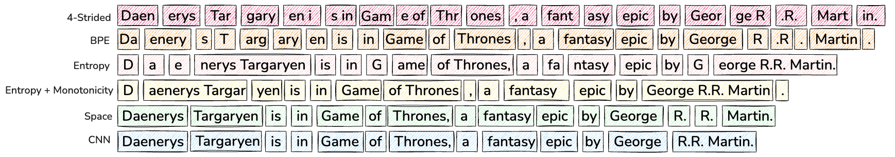
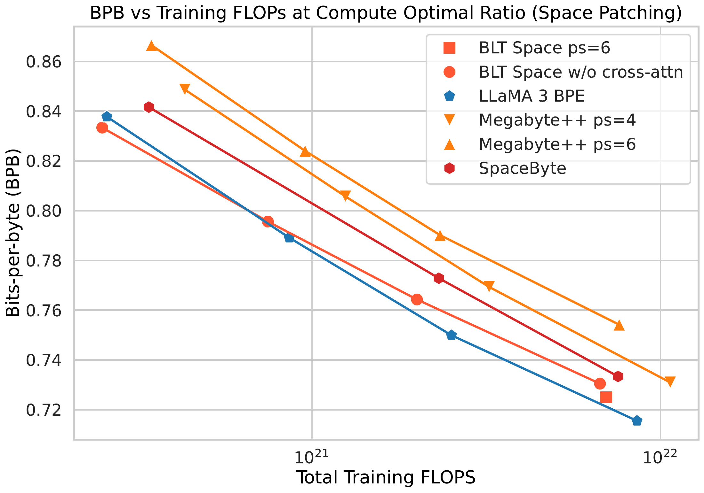
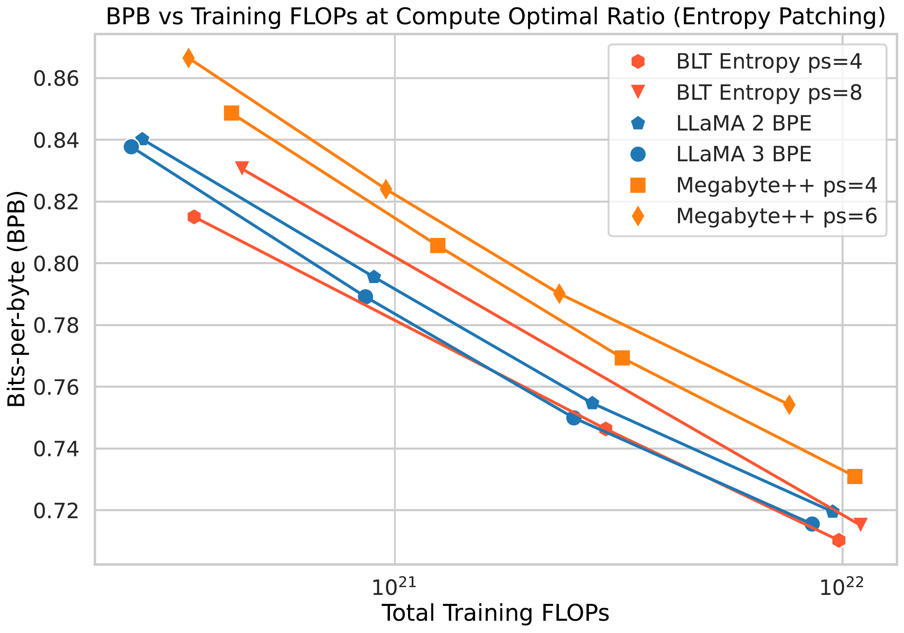
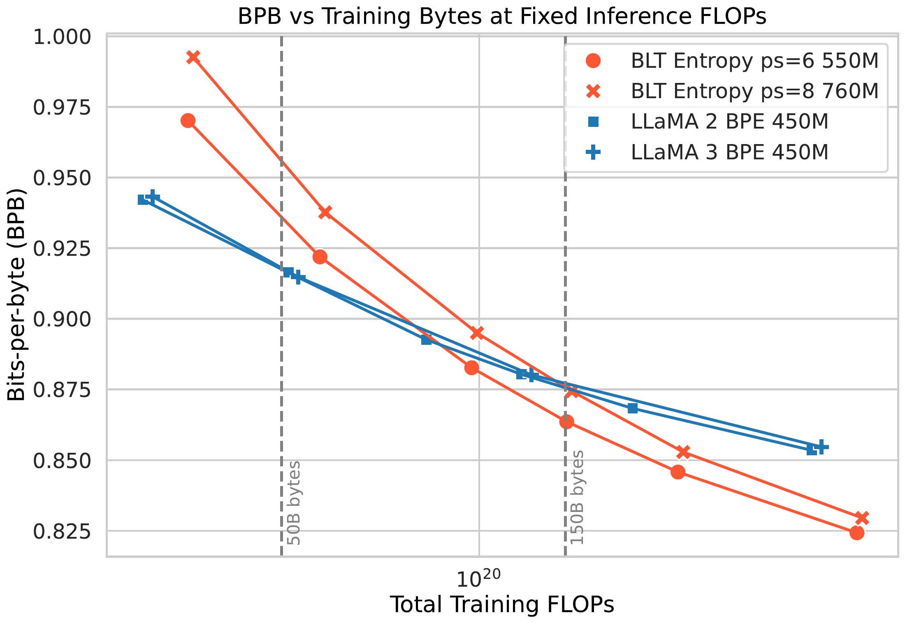
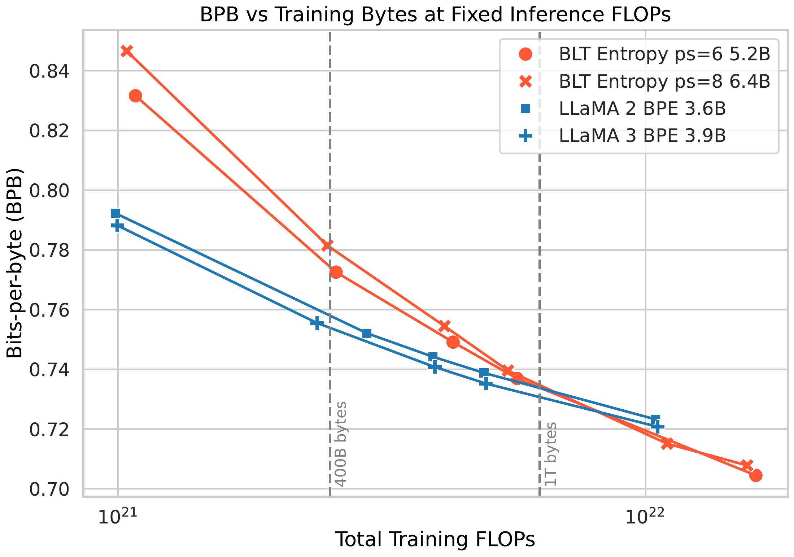

# Byte Latent Transformer: Patches Scale Better Than Tokens

[所属章节](../index.md) · [来源与阅读状态](../../../../sources/papers.json)

**作者**：Artidoro Pagnoni 等 14 人，FAIR at Meta 等  
**年份**：2024；**固定版本**：arXiv:2412.09871v1，2024-12-13  
**原始链接**：[arXiv:2412.09871v1](https://arxiv.org/abs/2412.09871v1)；代码：[facebookresearch/blt](https://github.com/facebookresearch/blt)  
**实际阅读范围**：固定 PDF、paper.txt、完整 paper.tex；正文第 1–9 节、正文图 1–8、表 1–9，以及为解释正文公式而读取的附录表 10、FLOPs、hash、频率 n-gram、MMLU patch 示例。图资产来自作者 TeX 工程并复制到本目录 assets/。

## 1. 问题与核心判断

普通 LLM 先将 UTF-8 字节变成固定词表中的 BPE token，再在 token 序列上运行 Transformer。token 是预先确定的字节组，每个 token 都触发相近的大模型计算；可预测词尾和高不确定句首因此获得相同算力。固定词表还隐藏了字符组成，影响噪声鲁棒性、拼写/字符操作和多语种长尾。直接在 byte 序列上跑大 Transformer 又会使序列变长数倍。

BLT（Byte Latent Transformer）动态把字节分成 patch：轻量 local 模块保留 byte 分辨率，昂贵的 global latent Transformer 只在 patch 表示上运行；patch 边界由 next-byte 预测熵决定。可预测字节组成长 patch，困难位置触发新 patch。patch 是上下文动态组成、无固定词表的字节组，和 token 不同；patch 表示仍从原始字节计算。

论文的证据包括：1B–8B、训练 FLOPs 对齐的 scaling 达到或超过 Llama 3 BPE 的 BPB；8B BLT-Entropy 的 7 项任务平均 61.1，Llama 3 为 60.0；固定推理 FLOPs 时可以同时增大 latent model 与平均 patch size。作者报告最多约 50% inference FLOPs savings，这是 FLOPs 估算，不是输出文字更短、API token 更少或壁钟延迟已被证明更快。

## 2. Patching

令字节序列为：

~~~math
\mathbf{x}=\{x_i\mid i=1,\ldots,n\}.
~~~

patching 函数为每个字节输出边界标记，把 $`n`$ 个字节分为 $`m<n`$ 个 patch。主 Transformer 步数由 $`m`$ 决定，平均 patch size $`n/m`$ 是计算控制量；这里的 size 是 bytes，不是 BPE token 或输出文本长度。

三种边界方案是固定 stride、space patching 和 entropy patching。stride 每 $`k`$ bytes 切分，易控制 FLOPs，却可能把同一词切法改变，并在数学等高信息区域算力不足。space patching 在 space-like byte 后切分；space-like 是不是拉丁字母、数字或 UTF-8 continuation byte 的字节，并要求 patch 至少含一个非 space-like byte。它按词首配置计算，但对无空格语言和非语言域不灵活。

entropy patching 训练一个小 byte LM $`p_e`$，使用论文给出的 next-byte entropy：

~~~math
H(x_i)=\sum_{v\in\mathcal V}p_e(x_i=v\mid\mathbf{x}_{<i})\log p_e(x_i=v\mid\mathbf{x}_{<i}).
~~~

论文原式未加负号，阈值沿其实现约定使用。边界规则为：

~~~math
\text{Global: }H(x_t)>\theta_g,\qquad
\text{Approx. monotonic: }H(x_t)-H(x_{t-1})>\theta_r.
~~~

前者用全局阈值，后者检测相对前一 byte 的熵上升。边界在 dataloader 轻量预处理阶段计算，并非端到端 boundary classifier。图 4 的 “Daenerys … George R.R. Martin” 中，G 和 e 超过阈值，G 成为单字节 patch，后续低熵字符合并为长 patch。

图 3（assets/patching_types.png）并列 stride-4、Llama-3 BPE、entropy、space 和 CNN entropy。patch 数对应主 Transformer 步数，不表示语义 token 数。

生成时边界必须只依赖前缀：

~~~math
f_p(\mathbf{x}_{<i})=f_p(\mathbf{x})_{<i}.
~~~

BPE 的同一前缀可能随未来字符被合并成不同 token，所以不满足增量性质（插入 delimiter 会增加序列长度）。这是 BLT 可在线生成的必要条件。

## 3. 架构：byte、patch、global latent

图 2（assets/blt_architecture.pdf）展示 byte stream → Local Encoder → patch representations → Latent Transformer → Local Decoder → next bytes。global model $`G`$ 是 block-causal 自回归 Transformer，在 patch 级工作，承担主要 FLOPs。Local Encoder $`E`$ 和 Decoder $`D`$ 的层数远小于 $`G`$，分别完成 byte→patch 和 patch→byte。

Encoder 将 byte embedding 与 3–8 gram rolling-polynomial hash embedding 相加：

~~~math
g_{i,n}=\{b_{i-n+1},\ldots,b_i\},\qquad
e_i=x_i+\sum_{n=3}^{8}E_n^{hash}(\operatorname{Hash}(g_{i,n})).
~~~

主实验用一个 hash 函数、500K hash、n=3…8。它是有碰撞的 embedding table，不是完整 patch 词表。

Encoder cross-attention 以每个 patch 的 pooling 表示为 query，以所属 byte hidden states 为 key/value，并只允许读取该 patch：

~~~math
P_{0,j}=E_C(f_{bytes}(p_j)),\qquad
P_l=P_{l-1}+W_o\operatorname{softmax}\left(\frac{QK^\top}{\sqrt{d_k}}\right)V.
~~~

这一步保留 byte 信息，只把全局计算长度变成 patch 数。Decoder 交换角色：byte representations 为 queries，global patch outputs 为 keys/values，再逐 byte 预测。图 5（assets/cross_attention.pdf）中的 Cross-Attn $`k=2`$ 是局部维度到 global 表示的拼接比，不是 patch 长度。

## 4. 实验和成本口径

数据为 Llama 2 数据集（约 2T tokens）和 BLT-1T（约 1T tokens，含 Datacomp-LM 子集）；论文声明不含 Meta 产品数据。BPE 基线使用 128K Llama 3 tokenizer。模型有 400M、1B、2B、4B、8B 规模；局部/全局块沿用 Llama 3 的 SwiGLU、RoPE（仅 self-attention，$`\theta=500000`$）、RMSNorm。固定 mask 用 FlashAttention，动态 cross-attention 用 FlexAttention。AdamW：$`\beta_1=.9,\beta_2=.95,\epsilon=10^{-8}`$，学习率 $`4\times10^{-4}`$，2000 warmup、cosine decay、weight decay .1、gradient clipping 1.0。

默认 entropy model 是 100M 参数、14 层、hidden 512、512-byte window。为不让大 patch 因更长上下文获利，Llama 2 平均用 8K bytes、BLT-1T 用 16K bytes，同时每批平均 16M bytes；大 patch 相应缩短 sequence。训练打包 patch 以避免 latent padding，并将字节序列 pad/truncate 到 12K/24K bytes。BLT-Entropy 大规模设置在换行处重置 entropy context，并用 relative rule 减少重复选择题中的 entropy drift。

FLOPs 是 Chinchilla 风格估算：FFN、QKVO、attention 和输出投影相加，embedding lookup 记 0 FLOPs，backward 为 forward 两倍。BLT 每 byte 的 global 项使用 $`m=n_{ctx}/n_p`$，local 项仍使用 byte context；因此：

~~~math
\operatorname{FL}_{BLT}=
\frac{\operatorname{TransfFL}(h_G,l_G,m=n_{ctx}/n_p,V=0)}{n_p}
+\operatorname{TransfFL}_E+\operatorname{TransfFL}_D
+\operatorname{CrossAttnFL}_E+\operatorname{CrossAttnFL}_D.
~~~

$`n_p`$ 是平均 patch size，$`V=256`$ 只用于 byte decoder 输出。patch size 8 的约 50% savings 是 global/latent 调用的估算下降，local encoder、decoder 和 cross-attention 仍在运行；论文未报告端到端延迟、吞吐、能源或生成文本变短。

质量使用 tokenizer 无关的 BPB：

~~~math
\operatorname{BPB}(x)=\frac{\mathcal L_{CE}(\mathbf{x})}{\ln 2\cdot n_{bytes}}.
~~~

任务指标是选择项 prompt-scoring accuracy 或代码 pass@1，不是 token 数。

## 5. 主实验

### 参数匹配 scaling

在 Llama 2 数据上按 Llama 3 参数/训练数据比率训练 1B–8B。BLT 的 Latent Transformer 与对应 BPE Transformer 匹配。图 6 右侧 entropy BLT 达到或超过 BPE；左侧去掉 n-gram 和 cross-attention 的 space patching 虽优于 MegaByte，仍落后 Llama 3，说明架构改进和动态 patching 共同重要。Llama 2/3 BPE 平均为 3.7/4.4 bytes/token，BLT 在平均 6 或 8 bytes/patch 仍有相近 scaling；ps=8 在 1B 较差、约 7B 超过 BPE。作者把它归因于 local 模块增长慢于 global 模块，但未做单独因果实验。

图 6（assets/compute_op_space.pdf、assets/compute_op_entropy.pdf）横轴训练 FLOPs，纵轴训练分布 BPB；左图隔离 space，右图组合 n-gram、cross-attention、entropy patching。

### 8B BLT-1T 下游

训练 FLOPs 等价的 Llama 3 BPE、BLT-Space、BLT-Entropy（分别 1T tokens、6T bytes/6.1 bytes per patch、4.5T bytes/4.5 bytes per patch）结果：

|任务|Llama 3|BLT-Space|BLT-Entropy|
|---|---:|---:|---:|
|ARC-E|77.6|75.4|79.6|
|ARC-C|53.3|49.8|52.1|
|HellaSwag|79.1|79.6|80.6|
|PIQA|80.7|81.1|80.6|
|MMLU|58.1|54.8|57.4|
|MBPP|40.2|37.6|41.8|
|HumanEval|31.1|27.4|35.4|
|平均|60.0|58.0|61.1|

Entropy 在 7 项中 4 项胜出。Space 除 PIQA 外均低于 Llama 3，但有更大 patch。Entropy 推理时把阈值从 0.6 调到 0.1，性能提高但步数增多，所以训练和推理 patch 预算不同；Space 覆盖约 30% 更多数据，可能偏离 BPE compute-optimal 比率。

### 固定 inference FLOPs

从 400M/3.6B Llama 2 tokenizer 出发，构造 FLOPs 相等的 Llama 3 BPE 与 BLT-Entropy ps=6/8：

|Llama 2|Llama 3|BLT ps=6|BLT ps=8|每 byte inference FLOPs|BPE 最优 bytes|crossover bytes|
|---:|---:|---:|---:|---:|---:|---:|
|470M|450M|610M (1.2×)|760M (1.6×)|$`3.1\times10^8`$|50B|150B|
|3.6B|3.9B|5.2B (1.3×)|6.6B (1.7×)|$`2.1\times10^9`$|400B|1T|

图 1（assets/500m_fixed_inference_vert.pdf、assets/4b_fixed_inference_vert.pdf）横轴训练 FLOPs，纵轴 BPB，每个 panel 固定 inference FLOPs。小预算 BPE 较好，随后 BLT 超过；crossover 约是 BPE compute-optimal 预算的 3 倍，大 FLOPs 档约 2.5 倍。该结论是相同估算推理成本下 patch 可换取更大 latent model，不是输出 bytes、token 或实际延迟减少。

## 6. 鲁棒性、长尾和 byte-ify

8B、1T-token Llama 3/BLT 与 16T-token Llama 3.1 的 HellaSwag 原始分为 79.1/80.6/80.7，五种噪声平均为 56.9/64.3/64.3。BLT 在 Drop、RandomCase、Repeat、UpperCase 高于 Llama 3.1，在 AntSpeak 低于它（57.9 对 61.3），所以是总体趋势。G2P 5-shot 为 11.8/13.0/18.9；CUTE 总分为 27.5/54.1/20.0，BLT spelling 与 inverse spelling 均 99.9%，但删除/插入词等词级操作 BPE 更强。

FLORES-101 SentencePiece BLEU 总体平均：语言→英语 Llama 3/BLT=12.1/14.0，英语→语言=5.9/6.4。低资源 Armenian 1.7→6.3、Bengali 4.7→12.7、Georgian 1.7→7.4 提升明显；English→Vietnamese 28.4→23.7、English→Thai 10.5→7.7 下降。作者没有验证方向差异的因果解释。

把 Llama 3.1 非 embedding global Transformer 初始化给 BLT，global 学习率为 local 的 1/10。220B-token 设置的 MMLU 为 Llama 3 26.5、从头 BLT 25.2、BLT-from-Llama3.1 63.7、完整 15T-token Llama 3.1 66.3；HumanEval 为 9.2、7.3、34.2、37.2。说明 byte-ify 可改善收敛，但数据混合和超参数仍需优化。

## 7. 消融、局限和 token 目标关系

entropy model 从 1M 到 100M 参数、context 从 64 到 512 bytes；两者增大都改善 BPB scaling，超过 50M/512 后递减。图 8（assets/entropy_ablations.pdf）是训练 FLOPs–BPB 曲线，支持边界信号质量影响 scaling，不证明更大 entropy model 对所有规模都最优。

8B patching 消融（Llama 2 最优步数）为：ARC-E BPE/Space/Entropy=67.4/67.2/68.9，ARC-C=40.5/37.6/38.3，HellaSwag=71.3/70.8/72.7，PIQA=77.0/76.5/77.6。space 结果来自无 cross-attention 的早期 run，不能当作完全同配置因果实验。1B cross-attention 消融显示 decoder cross-attention 最有效；encoder 只有 pooling 初始化有轻微收益。1B hash 消融从无 hash 的 Wikipedia/CC/Github/Train=0.892/0.867/0.506/0.850 降至 3–8 gram、每种 400K 的 0.831/0.846/0.478/0.826；约 300K hash 后递减。配合 hash 时，1/9 local encoder/decoder 比 5/5 更好（Train BPB 0.822 对 0.844）。

局限包括：沿用 BPE scaling laws，尚无 BLT 自己的最优数据/参数比；许多选择只在 1B 左右充分研究；FLOPs 估算尚未证明 wall-clock parity；entropy patching 仍由独立模型生成。对推理 token 效率，论文真正测量的是 byte 序列上的动态 patch 计算：相同估算 inference FLOPs/byte 时，patch 6/8 减少 global 调用并换取更大 latent Transformer。没有测量 API token 数、总生成 bytes、隐藏推理轨迹、端到端延迟或完整任务成本前沿，因此不能把结果写成“推理文字更短”“总 token 更少”或“实际 GPU 一定更快”。
