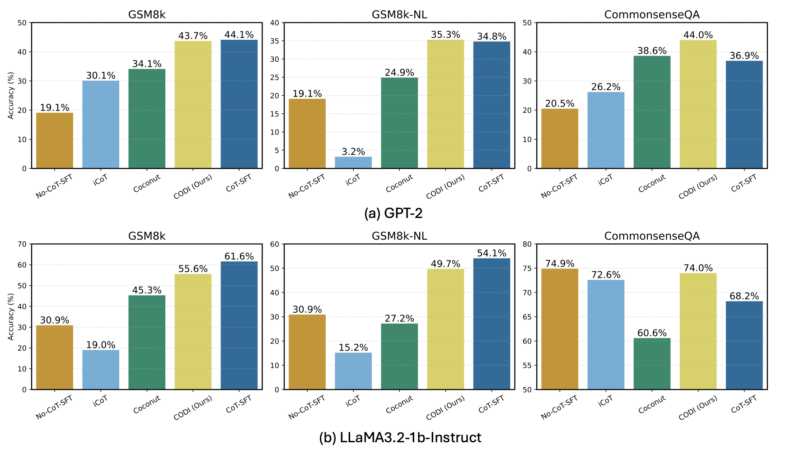
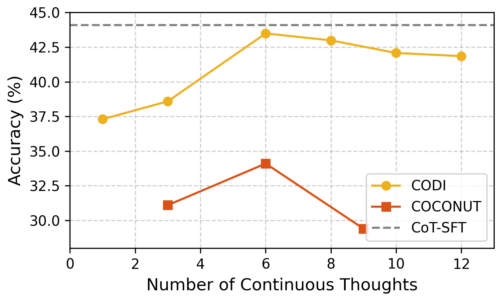
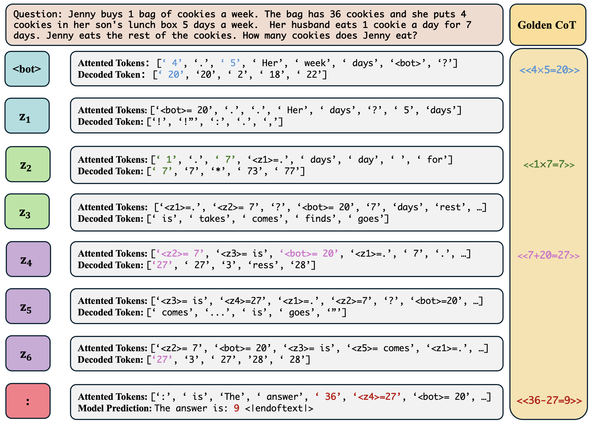
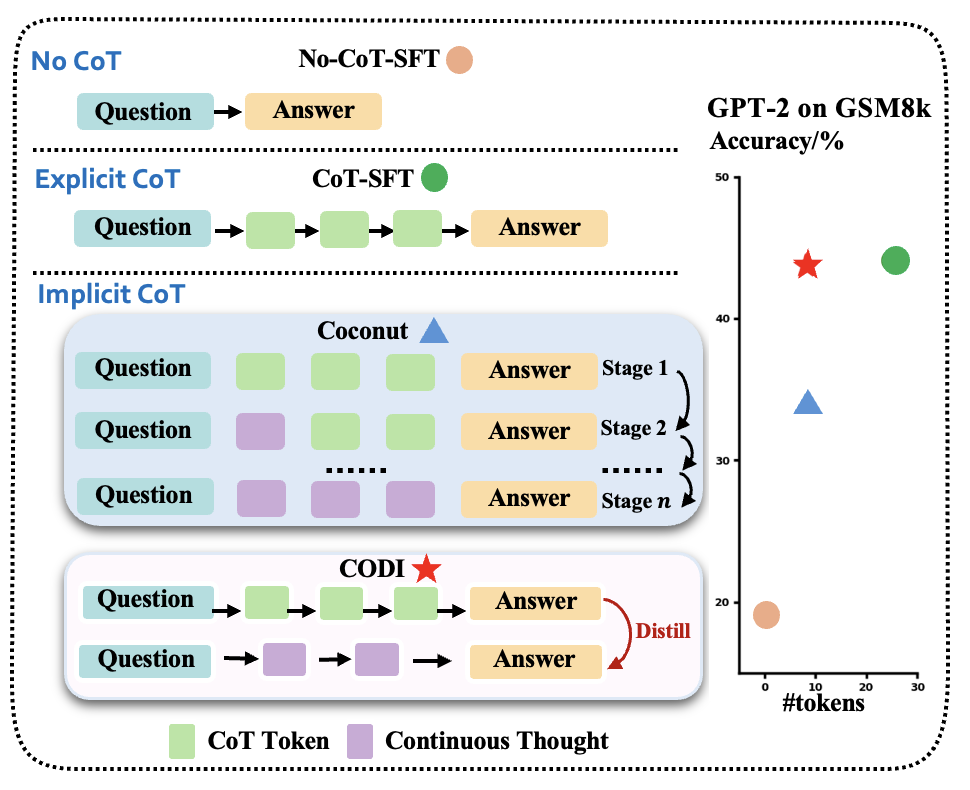
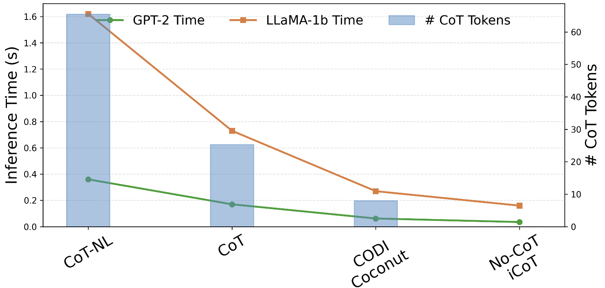

# CODI：通过自蒸馏把思维链压缩到连续空间

[所属章节](../index.md) · [来源与阅读状态](../../../../sources/papers.json)


**作者**：Zhenyi Shen, Hanqi Yan, Linhai Zhang, Zhanghao Hu, Yali Du, Yulan He <br>
**年份与固定版本**：2025；arXiv:2502.21074v3（论文页标注 2025-09-23） <br>
**原始链接**：[arXiv:2502.21074v3](https://arxiv.org/abs/2502.21074v3)；代码链接见论文摘要：[github.com/zhenyi4/codi](https://github.com/zhenyi4/codi)。 <br>
**实际阅读范围**：固定缓存的 `paper.pdf`、`paper.txt` 与 TeX 正文、附录 A（实现细节）、B（hidden-state shift 推导）、C（数据统计）、D–G（模式、可解释性与消融）。正文覆盖第 1–7 节；附录只用于核对方法条件、训练配置、数据规模和正文结论所需的补充实验。

## 1. 这篇论文要解决什么问题

标准 Chain-of-Thought（CoT）把问题 $`Q`$ 变成“问题—若干自然语言推理步—答案”的序列。它让 Transformer 获得额外的逐步计算位置，但自然语言是为沟通优化的媒介，常含比计算本身更多的词。显式 CoT 还有一个风险：模型逐 token 模仿标注措辞，可能记住表面语言模式。于是论文问：能否保留 CoT 带来的额外计算，又把长的离散推理压缩成少量连续隐状态？

此前的 implicit CoT 方法（额外 dummy/thinking token、iCoT 的逐阶段 internalization、Coconut 的 curriculum）让中间状态不再输出成词，但效果普遍落后于直接 CoT-SFT。作者把差距归因于课程学习各阶段之间的遗忘：模型先学显式 CoT，再逐步删除词，前面学到的能力可能在后续阶段被破坏。CODI（Continuous Chain-of-Thought via Self-Distillation）的核心变化是一次联合训练：同一个语言模型同时扮演“显式 CoT teacher”和“连续 CoT student”，用 teacher 在答案前关键位置的隐状态监督 student，而不是把某一段文字作为 student 的硬目标。

这里的“自蒸馏”是行为层面的称呼。teacher 和 student 不是两个预先独立的模型，而是共享参数、共享初始化、在同一训练过程中共同更新的两个输入路径；teacher 路径看到标注 CoT，student 路径只产生连续向量。论文也把它视为 multitask learning，但蒸馏项把两个任务联结起来。

## 2. CODI 的对象、路径与损失

设问题 token 为 $`Q`$，显式推理 token 为 $`c`$，答案 token 序列为 $`y`$，并令 $`r=[c,y]`$。推理 prompt 采用类似 `The answer is:` 的形式；冒号 `:` 是作者默认的蒸馏位置。student 另有可学习的 `<bot>` 与 `<eot>` 标记，以及固定数量 $`n`$ 个连续思维 token。正文实验使用 $`n=6`$，因此连续思维连同两个边界标记共占 8 个“推理 token”位置。

### Teacher：有语言 CoT 的行为参照

teacher 接收 $`Q`$ 和 ground-truth $`c`$，使用 teacher forcing，在 $`r=[c,y]`$ 上做标准语言模型交叉熵：

```math
\mathcal{L}_{\text{teacher}}
=-\frac1N\sum_{i=1}^{N}\log P(r_i\mid r_{1:i-1},Q).
```

这条路径保留了“先把问题算成显式推理，再生成答案”的完整监督。训练数据里作者刻意删去产生最终答案的最后一个 CoT step；否则 teacher 在冒号位置可能直接从最后一步抄出答案，蒸馏到 student 的就会是捷径而非较完整的推理状态。

### Student：连续状态自回归，答案仍用语言 token

student 先读 $`Q`$，接入 learnable `<bot>`，随后逐步把每一步的最后隐状态经过“两层 MLP + LayerNorm”投影，再作为下一步输入。它在连续空间中自回归地产生 $`Z=(z_1,\ldots,z_n)`$，没有要求任何 $`z_i`$ 等于某个真实词向量，也没有逐步语言标签。遇到固定的 `<eot>` 后，模型切回正常 vocabulary generation，生成答案 $`y`$：

```math
\mathcal{L}_{\text{student}}
=-\frac1N\sum_{i=1}^{N}\log P(y_i\mid y_{1:i-1},Q,Z).
```

因此，student 的梯度来自最终答案交叉熵和蒸馏对齐，而不是“把第 $`i`$ 个自然语言 CoT 词预测对”。一个可跟踪的推理例子是 GSM8k-Aug 中的 `600*30/100=180; 600*10/100=60; 180+60=240; 600-240=360`：teacher 逐词读这些式子；student 只插入六个连续状态，最后在 `<eot>` 后输出 `360`。六个状态不是四个表达式的一一硬编码，模型可用自己的连续轨迹完成相同任务。

### 关键蒸馏：只对齐答案前的一个 token，但跨全部层

作者的假设是 CoT 对查询位置的主要影响可近似看成 hidden activation 的“位移”。令 $`Q`$ 为问题、$`R`$ 为 CoT rationale、$`P`$ 为答案提示、$`q`$ 为最后的冒号 token，在第 $`l`$ 层 attention 输出中，论文给出（省略 softmax 与缩放后的分析形式）：

```math
h^l_{\text{CoT}}\approx h^l_{\text{no-CoT}}+f\!\left(W_VR(W_KR)^Tq\right).
```

也就是说，CoT 的信息可以进入答案提示位置的附加 shift。CODI 选择 teacher/student 都对应“冒号”的 hidden state $`h^l`$，跨模型全部 $`M`$ 层做 L1 对齐：

```math
\mathcal{L}_{\text{KD}}
=\frac1M\sum_{l=1}^{M}\left|\operatorname{sg}[h^l_{\text{teacher}}]-h^l_{\text{student}}\right|.
```

这里 `sg` 是 stop-gradient：teacher 作为目标，只让 student 朝 teacher 的表示移动。实现中每层的 hidden activation 还按当前 batch 中 teacher 对应激活的标准差归一化，因为不同层的范数差异很大；这不是额外的“准确率损失”，而是使 L1 的量纲可比。总目标为

```math
\mathcal{L}=\alpha\mathcal{L}_{\text{student}}+\beta\mathcal{L}_{\text{KD}}+\gamma\mathcal{L}_{\text{teacher}}.
```

默认 $`\alpha=\beta=\gamma=1`$；但 LLaMA 的蒸馏损失量级约比 GPT-2 小十倍，实际 LLaMA-1b 设 $`eta=20,\gamma=20`$（$`\alpha=1`$），GPT-2 设 $`eta=1,\gamma=1`$。论文的消融显示，单靠 student CE 只能获得很小收益；单靠 multitask 也不能保证连续路径真的吸收显式推理，决定性连接是 $`\mathcal L_{KD}`$。

### 训练和部署的路径差异

训练时 continuous thoughts 动态生成，作者逐步解码并用 KV cache 保存先前 key/value；然后把 teacher 冒号位置和 student 冒号位置的所有层表示配对。teacher 和 student 共享同一 LLM 以获得“先学会显式推理、再压缩”的 reference learning，同时避免加载两个模型造成的内存开销。正文明确说这并不等于一个冻结 teacher：两条路径在同一模型内共同训练，而蒸馏目标通过 stop-gradient 单向作用到 student。

推理时只执行 student 路径：问题后接 `<bot>`，模型自回归产生 $`n`$ 个连续状态；推理结束时由程序手动插入 `<eot>`，然后生成最终自然语言答案。当前实现使用固定 $`n`$，不能按题目难度自适应停止。连续状态仍需逐步运行 Transformer，因此它减少的是 vocabulary 中的输出 token 数与相应解码开销，不是把六步计算变成零计算。

## 3. 实验怎么比较

### 数据、模型、指标与公平条件

训练集有三类：

* `GSM8k-Aug`：用 GPT-4 扩展到 385,620 条，去掉自然语言串联，只保留结构化数学式；平均 CoT 20.3 tokens。
* `GSM8k-Aug-NL`：保留自然语言解释，384,625 条，平均 CoT 49.0 tokens，用于测试压缩更冗长的 CoT。
* `CommonsenseQA-CoT`：原数据没有 CoT，作者用 GPT-4o-mini 生成并按正确性过滤 8,096 条，平均 CoT 85.0 tokens；1,221 条验证题用于评估。

数学 OOD 测试为 SVAMP（1,000）、GSM-Hard（1,319，放大数字）、MultiArith（500）；GSM8k 测试集为 1,319。主要指标是最终答案 accuracy。模型是 GPT-2 与 LLaMA3.2-1b-Instruct。对比包括 No-CoT-SFT、CoT-SFT、iCoT 和 Coconut；CODI 与 Coconut 都使用 6 个连续思维。CoT-SFT 以 temperature=0.1 采样 10 次取均值，其余方法为确定性单次运行，所以数字不能理解成所有方法都有相同的随机采样预算。

实现层面各方法的共同条件包括 AdamW、cosine scheduler、前 3% steps linear warm-up、effective batch size 128、bf16；CoT-SFT/No-CoT-SFT/CODI 用 LoRA rank 128、alpha 32。GPT-2 学习率 $`3\times10^{-3}`$、40 epochs、单张 A100 80GB 约 36 小时；LLaMA-1b 学习率 $`8\times10^{-4}`$、10 epochs、单张 A100 约 48 小时。论文没有报告完整训练 FLOPs、总 GPU-hours 的统一跨方法统计，因此不能把推理 speedup 外推成端到端训练成本下降。

### 主结果：准确率



图 3 横向是 GSM8k、GSM8k-NL、CommonsenseQA，顶部 GPT-2、底部 LLaMA3.2-1b-Instruct，纵轴为 accuracy。固定版本图中读到的数值是：GPT-2 在 GSM8k 上 No-CoT 19.1%、iCoT 30.1%、Coconut 34.1%、CODI 43.7%、CoT-SFT 44.1%；在 GSM8k-NL 上分别为 19.1%、3.2%、24.9%、35.3%、34.8%；在 CommonsenseQA 上为 20.5%、26.2%、38.6%、44.0%、36.9%。LLaMA-1b 在 GSM8k 上为 30.9%、19.0%、45.3%、55.6%、61.6%；GSM8k-NL 为 30.9%、15.2%、27.2%、49.7%、54.1%；CommonsenseQA 为 74.9%、72.6%、60.6%、74.0%、68.2%。

结论需要按条件读：在 GPT-2 的 GSM8k，CODI 达到 CoT-SFT 的 99%（43.7 vs 44.1），并超过 Coconut 9.6 个百分点；在 LLaMA-1b，CODI 仍明显超过其他 implicit 方法，但为 CoT-SFT 的约 90%（55.6 vs 61.6）。GSM8k-NL 的长自然语言 CoT 反而让两种模型的 CoT-SFT 变差，CODI 在 GPT-2 上超过 CoT-SFT，在 LLaMA 上也达到 49.7%，但仍低于 CoT-SFT 54.1%。CommonsenseQA 的含义不同：GPT-2 上 CoT 有益且 CODI 最高；LLaMA 上 GPT-4o-mini 的 CoT 风格可能与 LLaMA 的原有模式不匹配，CoT-SFT 降到 68.2%，CODI 74.0% 接近 No-CoT-SFT 74.9%。作者把后者解释为连续表示较少过拟合某一措辞模式，这属于对结果的解释，不是因果实验。

### OOD 与复杂 CoT

表 1 把 `GSM8k-Aug` 训练模型迁移到 OOD：GPT-2 上 SVAMP / GSM-Hard / MultiArith 分别为 No-CoT 16.4/4.3/41.1，CoT-SFT 41.8/9.8/90.7，iCoT 29.4/5.7/55.5，Coconut 36.4/7.9/82.2，CODI 42.9/9.9/92.8；LLaMA-1b 上分别为 44.1/7.1/70.9，66.7/15.6/99.3，40.9/4.4/39.0，48.8/9.9/90.1，61.1/12.8/96.1。CODI 在 GPT-2 的三个 OOD 集都超过 CoT-SFT 和所有 implicit baseline；LLaMA 上超过 iCoT/Coconut，但仍低于 CoT-SFT。作者将鲁棒性归因于没有强迫模型逐词复制训练 CoT，因此可能较少记忆表面模式；表格本身支持的是相关性。

在 GSM8k-Aug-NL 上平均 CoT 长度为 49.0（正文还报告用于效率比较的平均长度 65.5，具体口径随图中测量设置而变，不能混为同一统计量），CODI 用固定 8 个推理位置，压缩比达到 8.2。结构化 GSM8k-Aug 的图 4 报告平均约 3.1× CoT compression、约 2.7× inference speedup；verbose 设置报告约 8.2× compression、约 5.9× speedup。图 4 的延迟是在 batch size=1、NVIDIA A100 上按每道数学题测量，speedup 不是 token 数的理论换算，也未报告不同 batch/硬件下的稳定性。

### 连续步数与组件消融



图 5 改变训练时连续 thought 数，CODI 在所有压缩比都超过 Coconut，二者都在 6 步附近达到峰值。少于 6 步可能不足以承载平均 CoT 的多个推理步骤；多于 6 步会增加序列长度和优化困难，而多数题并不需要更多步骤。这个结果说明压缩率是数据集相关的预算选择，不支持“越少越好”或“越多越好”的普遍结论。

表 2（GPT-2、GSM8k）给出 No-CoT-SFT 19.1%，完整 CODI 43.7%；独立静态 teacher 27.1%，在 student 侧增加 CoT generation multitask 后恢复到 42.2%；去掉 L1 蒸馏为 24.5%；保留 CoT 最后一步为 31.7%；去掉连续 token 的 projection 为 42.5%。这组对照分别表明：显式 CoT 参考学习很关键；仅把两个任务并列训练而没有 $`\mathcal L_{KD}`$ 不足以整合；保留最后一步可能给 teacher 走捷径；MLP+LayerNorm projection 有小幅帮助。

附录的权重消融补充了尺度条件：LLaMA 上 $`eta=1,5,10,20,30`$ 的 accuracy 为 46.5%、50.2%、49.1%、51.9%、51.4%，因此选 20；GPT-2 上增大 $`\gamma`$ 会更快收敛但最终 student 表现可能变差。默认答案 prompt 的 5 次独立运行均值为 39.0%，换成 `Answer:`、`Therefore... final answer is:` 或改蒸馏位置的变体都在 ±2×std=1.8 的范围内，作者据此称其对 prompt 设计有鲁棒性；这是小样本 informal t-test，而非大规模显著性检验。

## 4. 连续隐状态究竟学到了什么

CODI 不给 $`z_i`$ 文字目标，但作者把每个连续 thought 的最后 hidden state 乘词表 embedding，投影回 vocabulary space，并检查它注意到的 top-10 token。 图 6 的案例显示，$`z_2`$ 可同时关注上下文中的 `1` 与 `7`，投影后 top token 出现 `7`；运算符本身不在 attention 可见项中，因为它已在上下文中，作者推测 Transformer 层隐式完成了乘法。某些中间结果之间还夹着看似无意义的连续 token，作者假设它们是占位/过渡状态，让网络多跑一轮以完成计算。

定量上，表 3 在正确预测的题上比较 decoded top-5 与参考 CoT 的中间结果：需要 1 个中间结果时匹配率 97.1%，2 步为 83.9%，3 步为 75.0%。另一个分析称，在正确答案中，最后一个 continuous thought 的 top-5 命中参考倒数第二中间结果 71.7%，放宽到全部 thoughts 为 81.3%，接近 CoT-SFT。附录 D 又把解码出的结果或“运算符+结果”人工写回 CoT 数据训练 GPT-2，准确率仅 34.0%/35.7%（CODI 43.7%，No-CoT 19.1%），说明这类可见 token 不是 CODI 全部知识的等价文字替代；这是支持 richer latent information 的间接证据。

## 5. 对 token 效率研究的准确解读

论文实际测量了三种不同对象，不能混称为“token 成本下降”：

1. **推理序列长度**：CODI 固定 6 个连续 thoughts + `<bot>/<eot>` 共 8 个位置；它把平均显式 CoT 的 20.3 或更长的自然语言推理压到固定 latent budget。
2. **推理时间**：图 4 在 A100、batch=1、单题上直接测量 latency，报告约 2.7×/5.9× speedup。连续步仍然需要 Transformer 前向和 KV cache，且论文未报告完整的 FLOPs 分解、不同 batch 的吞吐、显存与 API 计费 token。
3. **训练成本**：正文与附录给了单张 A100 的 GPT-2 约 36 小时、LLaMA 约 48 小时，但没有统一的 CoT-SFT/iCoT/Coconut/CODI 训练成本曲线。蒸馏训练同时保留 teacher/student 路径，不能直接从推理压缩比推断训练成本同比下降。

所以 CODI 的主张是：在小模型、数学/常识微调场景里，少量连续计算位置可以用显著更短的输出序列逼近显式 CoT 的准确率，且可迁移到 OOD；它还没有证明任意任务、任意模型或动态长思考下都具有同样的成本前沿。

## 6. 局限与研究问题

第一，连续路径的梯度只能从最终答案处反传；6 个 thought 时第一个状态要隔至少 6 步才收到有用信号，复杂任务需要更长链时优化可能更难。第二，固定 thought 数不能自适应分配难度。第三，可解释性是 probe：单 token 投影无法还原多 token 实体（如 tokenizer 把 `35649` 拆开时只能观察首 token），也不等于模型真实执行了人类可读的同一算术步骤。第四，默认把“冒号”作为蒸馏 token 可能不是最优；答案以 `-` 开头时，论文报告移除该类样本会变好，第二答案 token 或结束 CoT 的位置都可能更合适。第五，实验规模集中于 GPT-2 和 1B 模型，作者明确说没有足够资源扩展到更大模型；论文提到并行工作的 3.5B 预训练结果，不是 CODI 的实验，不能当作其扩展性验证。

对 token-efficient reasoning 的直接问题是：连续 token 的“一个位置”内部仍包含完整层数的计算，未来比较应同时报告输出 token、前向次数、FLOPs、KV-cache 显存、真实 wall-clock 和训练/部署硬件。还需要在更长、多解、视觉或工具调用任务上检验：teacher 的单点 hidden shift 是否足够承载多步计划，以及固定 $`n`$ 是否会造成短题浪费、难题欠算。

## 图与表索引

* ：Figure 1，三种推理策略比较（No-CoT-SFT、CoT-SFT、Coconut、CODI）；本版本源图为 `assets/codi_illustrate16.png`。
* ：Figure 2，student 连续路径、teacher forcing 路径和跨层 L1 蒸馏；源图 `assets/codi_method_v4.png`。
* ：Figure 3，GPT-2/LLaMA 在 GSM8k、GSM8k-NL、CommonsenseQA 的 accuracy；源图 `assets/codi_main_result_v5.png`。
* ：Figure 4，A100 batch=1 的每题推理时间与 CoT token 数；源图 `assets/codi_efficiency_v2.png`。
* ：Figure 5，连续 thought 数与 GSM8k accuracy；源图 `assets/codi_lat_num.png`。
* ：Figure 6，六个 latent thoughts 的 attended/decoded tokens；源图 `assets/codi_interpretability_3steps_v2.png`；附录还提供 1/2-step 版本。

所有图均从论文随附的 LaTeX source 提取，论文声明 CC BY 4.0（[许可](http://creativecommons.org/licenses/by/4.0/)）；没有裁剪。正文中的 Figure 3、4、5、6 已在相应段落解释，Figure 1、2 用于方法总览。附录图仅保留为理解正文可解释性所需的原资产。

## 与推理时 token 目标的关系与有定位的局限

CODI 给出了一个具体的“短输出、保留隐式计算”范式：6 个连续 thoughts 在实验中替代平均约 20–65 个显式 CoT token，并在指定 A100/batch=1 条件下报告 2.7×–5.9× latency speedup；但推理过程仍执行每个 latent step 的全模型层，论文未建立跨硬件、批大小、FLOPs、显存和训练成本的完整前沿。结果也依赖共享 teacher/student、单点 hidden-state 对齐、固定思维步数以及小模型和合成 CoT 数据。上述边界决定了它是对连续隐式推理训练的强小规模证据，而不是一般 LLM 部署成本已被证明下降。
