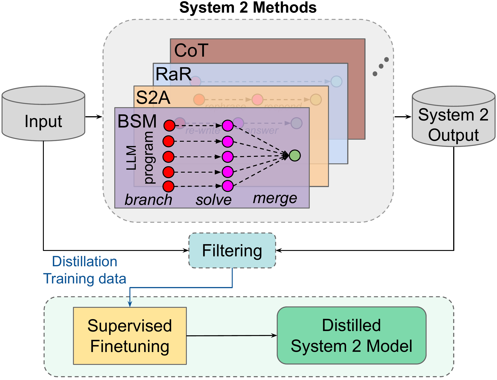
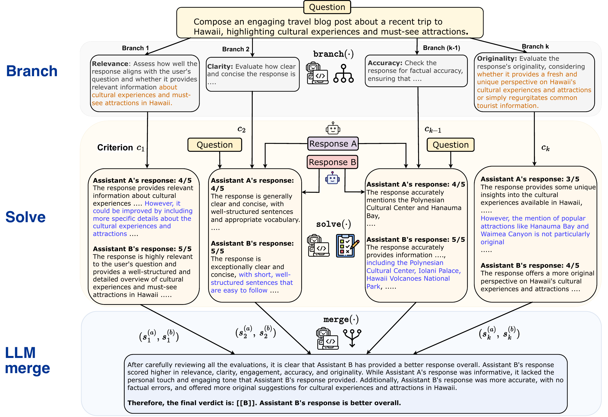
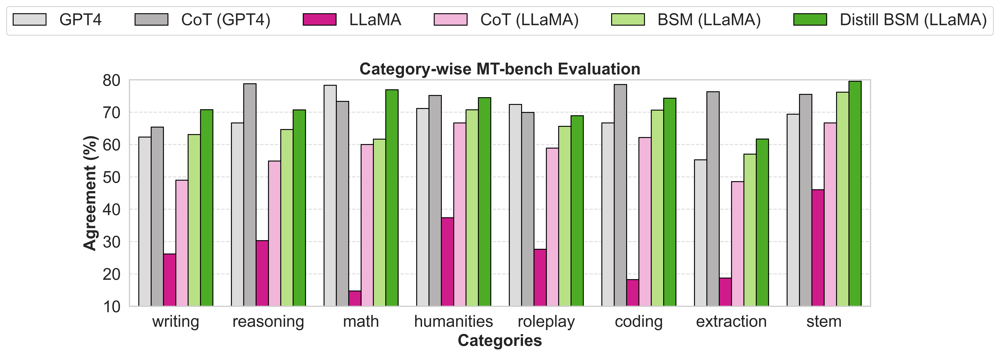

# Distilling System 2 into System 1：把慢思考编译进直接生成

[所属章节](../index.md) · [来源与阅读状态](../../../../sources/papers.json)


**作者**：Ping Yu、Jing Xu、Jason Weston、Ilia Kulikov（Meta FAIR） <br>
**年份/固定版本**：2024；arXiv:2407.06023v3（2024-07-24） <br>
**原始链接**：[arXiv 2407.06023v3](https://arxiv.org/abs/2407.06023v3) <br>
**实际阅读范围**：固定版本 PDF、`paper.txt` 与作者 LaTeX 工程的正文（第 1–6 节）、正文表格和图；补读附录中的全部 prompt、模型训练设置、BSM 示例、MT-Bench 分类表和作者图源。未逐一复核参考文献所引论文的正文，也未把附录之外的未提供材料当作证据。

## 这篇论文要解决什么问题

标准 LLM 给定输入后直接生成答案，论文把这种一次前向、没有离散中间输出的模式称为 System 1。System 2 则是在最终答案前生成中间 token，可能重复调用模型、改写问题、分支搜索或汇总多个结果。例如 Chain-of-Thought（CoT）把思路写出来，Rephrase and Respond（RaR）先改写问题再回答，System 2 Attention（S2A）先删掉用户输入中的偏见或无关上下文，Branch-Solve-Merge（BSM）先制定评价标准、再逐项评分、最后合并判断。它们往往提高质量，却要付出更多输出 token、更多调用和更高延迟。

论文的核心问题是：如果已经有一批只有输入、没有人工标签的数据，能否离线运行昂贵的 System 2，把质量更好的最终答案筛出来，再训练同一个 LLM，使它在部署时只做 System 1 的直接回答？这不是把 CoT 思维链逐 token 教给一个更小的学生模型，而是把 System 2 的最终行为作为 target；中间 token $z$ 只在数据生成阶段使用，之后丢弃。作者将此过程类比成人类把反复练习的技能从有意识的 System 2 转成自动化的 System 1。

## 对象、符号与总流程

给定输入 $x$，基础自回归语言模型为 $p_\theta$。System 1 直接生成输出 $y$：

```math
S_{\mathrm{I}}(x)=p_\theta(x)\rightarrow y.
```

System 2 是包裹着同一模型的一段算法：它可以重复调用 $p_\theta$，产生中间 token $z$，再返回最终输出 $y$：

```math
S_{\mathrm{II}}(x;p_\theta)\rightarrow z,y.
```

$z$ 可以是改写后的问题、CoT、分支计划、各分支评分或其它内部文本；它不要求是“真正的思维”，只要是算法在最终输出前生成并继续处理的离散 token。论文的 System 2 distillation 使用未标注输入集合 $\mathcal X$：

1. 对每个 $x_i\in\mathcal X$ 运行 System 2，得到 $y^i_{S_{\mathrm{II}}}$；
2. 丢弃所有中间输出 $z$，并用无监督一致性规则筛掉不可靠的最终答案；
3. 得到 $(\mathcal X_{S_{\mathrm{II}}},\mathcal Y_{S_{\mathrm{II}}})$；
4. 从当前 $p_\theta$ 初始化，以交叉熵继续 SFT。损失只施加在答案部分，不要求模型在训练样本中生成中间推理；
5. 产出参数更新后的 $\hat p_\theta$，部署时只将原始输入送入一次 System 1。

过滤器有两类。对于短答案且正确答案通常唯一的任务，**输出自一致性**在同一输入上采样 $N$ 次，取多数答案；没有多数赢家就丢弃。对于答案应当对输入表示不敏感的任务，**输入扰动下自一致性**对输入做不改变语义的扰动（如交换选择题选项或交换待评价回答的顺序），分别运行 System 2；若结果不一致就丢弃。二者的假设都是“稳定答案更可能正确”，而非逻辑上保证正确；过滤器错误会把错误标签稳定地写进学生。

```text
for x in unlabeled_inputs:
    candidates = [System2(x) for _ in range(N)]       # 离线，包含 z 和 y
    target = majority_or_discard(candidates)          # 或对等价扰动做一致性检查
    if target is accepted:
        add (x, target)                                # 只保存最终答案，不保存 z
SFT(base_Llama2_70B_chat, accepted_pairs, answer_only_CE)
```

这里的“训练”成本和“部署”成本必须分开：前者包括生成候选、过滤调用与 SFT；后者只看评测阶段每个输入产生的 token。论文报告的 `#Tokens` 是平均每个输入生成的 token；System 2 的数字包含中间生成和最终输出，System 1/蒸馏模型则是直接输出。论文没有报告完整的离线 System 2 数据生成 FLOPs、总训练 FLOPs、GPU 小时、美元成本或端到端延迟，因此不能把 token 数字当成完整成本前沿。



**图 1（作者图 `Distillation_paper_figure.pdf`）读法**：左侧输入进入四类 System 2 机制（CoT、RaR、S2A、BSM），它们通过改写、分支、求解和合并等步骤产生较高质量答案；过滤器把可接受的输入—答案对组成训练集，最后用监督微调把目标写回标准 System 1。图中真正保留到训练 target 的是最终输出，图示的中间路径是离线教师过程。原始图源见 `assets/fig-distillation-overview.pdf`，来自作者 arXiv 工程；论文许可证为 CC BY-NC-ND 4.0，作为整图复用需遵守该许可。

## 实验共同设置

所有实验使用可微调的 Llama-2-70B-chat：它要足够强，能在 System 2 模式下工作，同时开放权重。System 1 基线是该模型的 zero-shot 直接回答。任务指标按任务而定（准确率、精确匹配、LLM-as-a-judge 与人工偏好的一致率等），另报平均生成 `#Tokens`。表中的 CoT、RaR、S2A 和 BSM 都与各自蒸馏模型使用同一基础模型或明确标出的 GPT-4 对照；因此结果比较的是推理程序与蒸馏训练后的同一模型，而不是一个单一“大教师—小学生”设定。

附录给出的 SFT 共同设置是：Llama2-70B-chat 初始化，交叉熵只作用在 answer 部分，dropout 0.1，学习率 $5.5\times10^{-6}$，warmup 1。不同方法的训练步数/每步 token 为：RaR-last-letter 3/66k，RaR-coin-flip 100/66k，S2A-TriviaQA 350/23k，BSM-OASST2 600/131k，CoT-GSM8K 5000/33k。论文没有给出这些设置对应的总 wall-clock 或显存峰值。

## RaR：改写问题，把任务说明编译进直接回答

RaR 先让 LLM 重述并扩展原问题，再让 LLM 根据改写后的问题回答。1-step 把改写和回答放在一次 prompt；2-step 用两个独立调用，第二个调用只接收改写结果和任务要求。其作用不是显式演算，而是把容易漏读的关系、格式要求或隐含操作变得更清楚。

作者选了两个 RaR 原论文表现好的符号任务。**Last Letter Concatenation** 要求取一串英文单词的最后字母并拼接；作者从 1200 个唯一英文词随机构造训练、验证、测试各 200 个样本。2-step 的第一步特别要求改写问题并保持两个词不变，第二步回答。每个输入用 8 次采样，并对答案多数投票；coin-flip 的每个阶段也采样 8 次，作者说明这是因为一次采样的改写阶段质量不足。

在 last-letter 测试中，System 1 只有 30.0% exact match，1-step RaR 39.5%，2-step RaR 44.5%；蒸馏 2-step RaR 的 System 1 达到 98.0%，平均生成 25.5 token，低于 2-step RaR 的 41.5 和 1-step 的 106.6，接近原始 System 1 的 27.1。这里蒸馏学到的似乎是任务操作本身，而不是通用答案模仿：同一模型从 zero-shot chat 的直接生成转为训练后的直接执行。

过滤器是关键消融：不做一致性筛选时，蒸馏准确率为 87.5%，做筛选为 98.0%；只用 System 1 自身预测生成并筛选，得到 69.5%，说明增益不能简单归因于“任何伪标签 SFT”。

coin-flip 任务从 heads/tails 初态和一串自然语言“flip/does not flip”事件推断最终面；有 20k 未标注训练、3.33k 验证和 1.33k 测试样本。System 1 为 56.1%，1-step RaR 58.5%，2-step RaR 77.2%，蒸馏 2-step 为 75.69%，平均 token 分别为 61.9、158.9、112.4 和 50.3。它几乎保留 2-step 的准确率，同时少掉两阶段改写调用。提示词本身是重要混淆因素：直接在输入后加“Flip means reverse.”使原 System 1 从 56.11%升到 66.84%；完整再加“Answer the Yes or No question.”反而是 52.89%。蒸馏 System 2 在三种提示下为 75.69%、78.92%、74.49%，比蒸馏 System 1 的 54.54%、62.64%、63.39%更稳定。作者把这种较低 prompt 敏感性视为优点，但这只是所测提示集合内的结果。

## S2A：先去偏，再把无偏答案写入学生

System 2 Attention 的第一阶段要求模型从用户文本中提取“无偏且非意见”的上下文，同时保留问题；第二阶段把这个清理后的上下文作为条件，要求无偏回答。它与 RaR 的方向相反：RaR 扩展问题，S2A 压缩并去掉可能诱导模型迎合的内容。附录的例子中，用户误猜 Christopher Robin 的父亲是 Roald Dahl；普通 System 1 会长篇纠正，S2A 先清理后回答，蒸馏模型直接输出“A.A. Milne”。

实验使用 SycophancyEval/TriviaQA 风格数据：6668 个未标注训练输入，400 个评测输入，其中 350 个带偏见、50 个无偏。蒸馏时对每个样本采样 20 个回答，再用 Llama-70B-chat 执行 Universal Self-Consistency（USC）prompt，从候选中合成多数一致的最终 target。若 20 个答案太长放不进 Llama-2 context，作者少量情况下减到 10 个，若仍超长则随机选一个；这是实际数据构造限制，意味着 USC 并非每个样本都严格使用 20 个候选。

在偏见集上，直接 System 1 准确率 51.6%，S2A 76.0%，蒸馏 S2A 81.3%；无偏集分别为 73.8%、69.3%、78.6%。平均生成 token 为 165、147、56。去掉 USC 后为 78.6%/75.3%/58 token，说明目标选择质量影响学生；但该表没有报告训练集保留率、USC 具体错误率或离线采样/训练成本。S2A 成功的机制解释是：教师在离线阶段显式处理了偏见上下文，学生只需在参数中吸收“在这类问法下应关注什么”的映射；这不证明学生内部真的执行了可解释的去偏步骤。

[原始表格/补充示例](https://arxiv.org/abs/2407.06023)

**S2A 例图（附录 `s2a_example`）读法**：同一个有错误猜测的事实问题，System 1 回答较长；S2A 第二阶段给出无偏事实回答；蒸馏模型只给出短答案。图展示输出风格和 token 压缩，不能单独证明普遍准确率提升。原始示例来自作者 LaTeX；许可同上，复用时保留作者归属。

## BSM：把 LLM-as-a-judge 的评估程序压缩成四个 token

BSM 用三个模块评价两个候选回答。**Branch** 读取用户问题，提出最多五个评价维度（如 helpfulness、relevance、accuracy）；**Solve** 针对每个维度独立给 Assistant A/B 打 1–5 分；**Merge** 把各维度分数和解释合并，输出 `[[A]]`、`[[B]]` 或 `[[C]]` 的最终判定。原始程序会并行或顺序地产生大量中间文本，成本约为普通直接 judge 的 5–6 倍。

BSM 蒸馏数据来自 OASST2 英文 turn-1 训练集：19,672 个“问题+两个回答”输入。为了避免位置偏见，作者对原顺序和交换顺序各运行一次 BSM；只有两次选出同一赢家才保留，目标是两种表示下稳定的 winner。评测使用 OASST2 validation（273 个样本，英文、turn 1）和 MT-Bench（8 个领域，分布外），指标是与人类偏好的 Agreement，以及交换回答位置后结果改变的 `% Inconsistent`。

OASST2 上，Llama System 1 Agreement 32.0%、不一致 56.7%、4 token；CoT(Llama) 45.2%/37.7%/432.6；BSM 49.1%/30.4%/2117.8；蒸馏 BSM 58.4%/12.2%/4。GPT-4 直接 judge 是 44.7%/35.5%/4。MT-Bench 上，Llama System 1 28.1%/80.9%/4，CoT(Llama) 58.9%/30.8%/411.8，BSM 64.5%/21.1%/2063.1，蒸馏 BSM 72.4%/9.1%/4；GPT-4 为 68.1%/25.6%/4，GPT-4 CoT 为 73.8%/16.2%/548.8。蒸馏 BSM 在 OASST2 超过 GPT-4 直接 judge，在 MT-Bench Agreement 略低于 GPT-4 CoT/接近 GPT-4 直接 judge，但一致性更好、token 极少。

按 MT-Bench 类别，蒸馏 BSM 相对基线在 writing、reasoning、math、humanities、roleplay、coding、extraction、stem 都有提升；但仍落后 GPT-4 的 reasoning、coding、extraction，在 writing、math、STEM 超过 GPT-4。附录还给出“label only”蒸馏，某些类别更高（例如 math 76.95%），说明保存完整评分解释与只保存最后标签的目标形式也会改变结果，不能把 BSM 蒸馏概括为单一固定收益。



**BSM 图读法**：作者注明该图复制自 BSM 原论文，展示 branch 产生维度、多个 solve 分支分别评分、merge 汇总判决的程序结构；本论文的创新是把该程序的最终判定作为直接输出 target，而不是重新设计 BSM。原图资产为 `assets/fig-bsm-overview.pdf`，来源为作者工程；根据 CC BY-NC-ND 4.0 许可复用需保留归属并遵守非衍生/非商业条件。



**MT-Bench 分类图**：正文图 `MT_bench_wo_tie.png` 的纵轴/分组是各类别 Agreement，比较 Llama System 1、CoT、BSM、蒸馏 BSM 与 GPT-4。正文结论是 CoT 在全部类别超过 Llama 基线，BSM 超过 CoT，蒸馏 BSM 又超过 BSM；但蒸馏模型在 reasoning、coding、extraction 仍低于 GPT-4。图只支持类别层面的比较，不提供 token 成本曲线。原图在 `assets/fig-mt-bench-category.png`。

## CoT：GSM8K 的严重反例

CoT 要模型在答案前显式生成逐步推理。作者测试 zero-shot CoT（prompt 加“step by step”）和 8-shot CoT（上下文示例包含 question–CoT–answer）。蒸馏数据来自 GSM8K 训练 split：用 CoT 生成候选并以 $K=10$ 多数投票，留下 7461 个 question–answer 对，训练 target 不包含中间推理；这些自监督 targets 事后估计的准确率只有 56.81%。这已经提示过滤器并没有把数学答案可靠地验证成金标签。

GSM8K test 的结果清楚显示蒸馏失败。普通 8-shot、无 CoT 的 System 1 在 $k=1/5/10$ 投票下是 7.58%/9.40%/10.31%，生成 57/295/620 token；zero-shot CoT 是 52.77%/57.54%/59.44%，代价 270/1385/2760 token；8-shot CoT 是 36.39%/54.97%/63.84%，代价 297/1560/3120 token；**蒸馏 CoT** 只有 7.13%/7.13%/7.35%，却只生成 18/90/180 token。不同解码超参数下都很差。也就是说，直接把多数 CoT 的最终答案做成无推理的伪标签，并不能把多步算术程序写进 System 1；在这里，短输出不是效率胜利，而是能力严重退化。

该反例说明论文主张是条件性的：对于 RaR 的任务澄清、S2A 的去偏改写、BSM 的结构化评估，最终行为可以通过重复练习写入直接生成；对于 GSM8K 这类依赖离散多步中间状态和可验证算术链的任务，学生缺失了过程，错误目标又会被训练放大。作者没有证明具体的充分条件，也没有比较“保留 CoT 训练”或过程监督等替代方案，只指出何时能蒸馏仍是开放问题。

## 应如何理解“成功”与 token 效率

论文最有力的成功场景不是一个统一的数学推理能力提升，而是把特定 System 2 程序的外显行为编译成直接输出：last-letter 从 30.0% 到 98.0%，S2A 在 biased TriviaQA/SycophancyEval 从 51.6% 到 81.3%，BSM 在 OASST2 从 32.0% Agreement 到 58.4%且不一致率从 56.7%降至 12.2%。这些结果都伴随着部署输出 token 降低，尤其 BSM 从 2117.8 到 4。coin-flip 则几乎保持 2-step RaR（77.19%→75.69%），而 token 从 112.4 降至 50.3。

但“token 减少”只描述评测时生成端。离线教师要为未标注数据进行多次采样、USC 或扰动一致性检查，学生还要承担 SFT 的训练显存、训练 token 和更新成本；论文没有报告这些总成本，也没有把预训练/数据生成/训练成本折算成 amortized per-query cost。System 2 和 System 1 的 token 还可能有不同的输入 prompt 长度与并发调用数，因此不能仅凭输出 token 直接声称端到端延迟或美元成本按同倍数下降。

## 局限与可检验问题

作者在正文限制部分明确承认三点：第一，方法效果依赖任务和数据，CoT/GSM8K 是失败例；第二，自监督性能依赖过滤器，本文只研究输出一致性和输入扰动一致性，没有探索其它数据质量策略；第三，三种成功蒸馏方法的结果不能推广到所有 System 2。实验还存在一些需要谨慎解释的边界：S2A 的数据描述同时使用 SycophancyEval 和表题 TriviaQA，正文没有给出完整样本构成；BSM 的 Agreement 依赖人类偏好标注与位置交换协议；RaR 的 prompt 工程对 coin-flip 影响很大；各任务的蒸馏数据量、训练步数和过滤保留率并不统一。

对推理时 token 效率的直接启示是：先判断 System 2 是否主要提供“任务重述、去偏、结构化评估”这类可被答案标签吸收的行为，再设计能暴露错误的自监督过滤；不要因为教师能生成长 CoT 就默认其最终答案适合无过程蒸馏。至少应同时报告：学生与教师的任务指标、过滤后数据质量、System 2 中间与最终 token、System 1 输出 token、离线数据生成与 SFT 成本，以及失败任务的能力变化。本文贡献的是一种可行的离线编译范式和一组有条件的证据，而非一条对所有复杂推理都成立的压缩定律。
