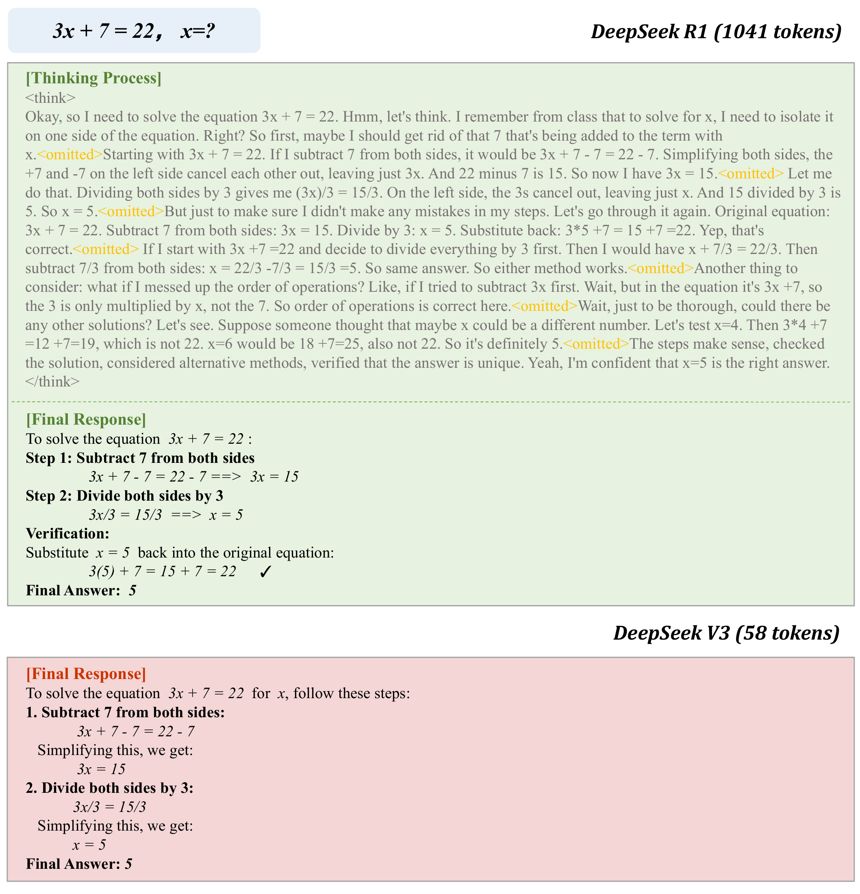
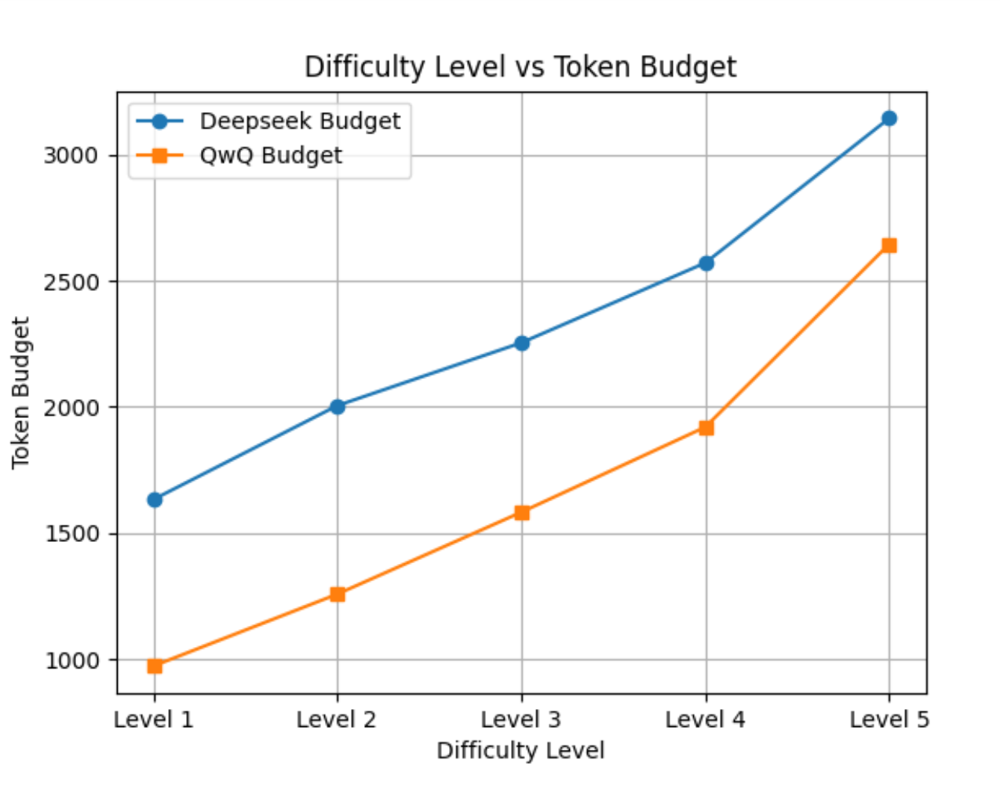
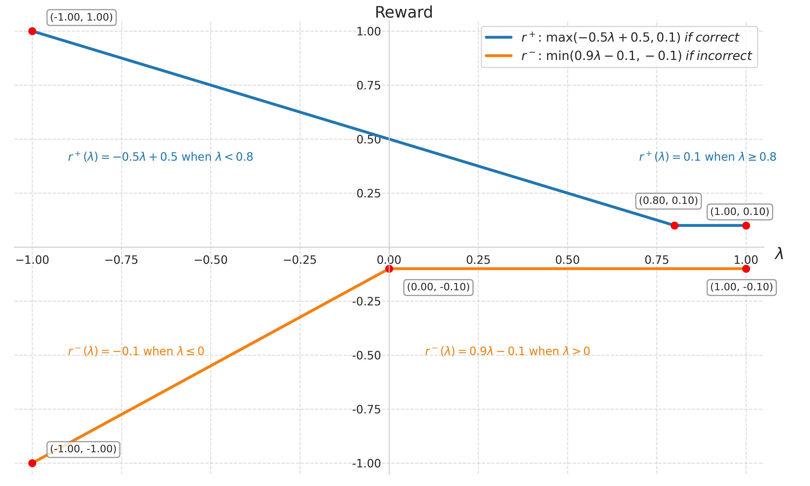
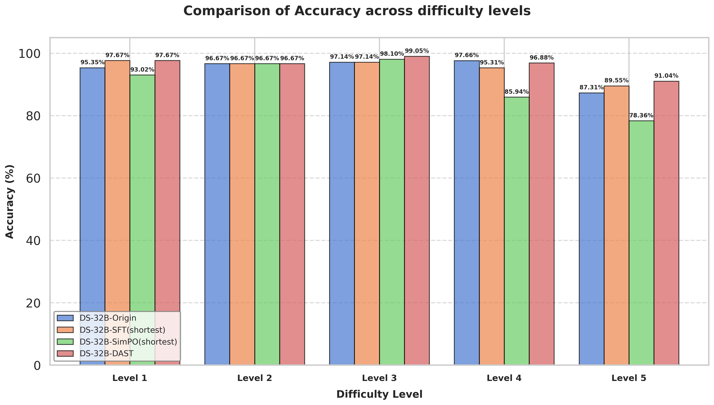
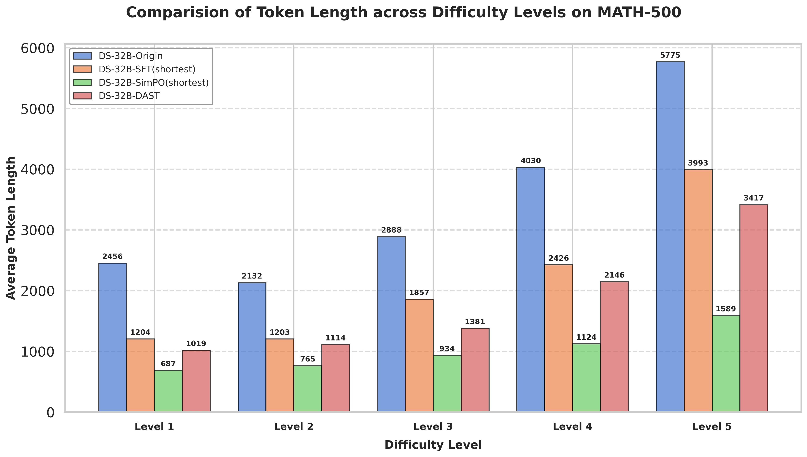
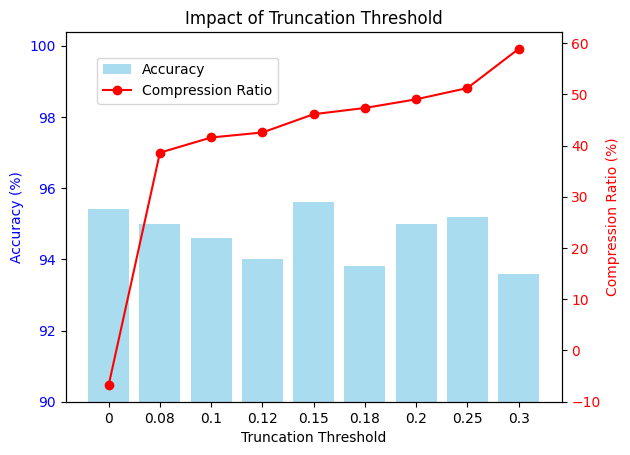

# DAST: Difficulty-Adaptive Slow-Thinking for Large Reasoning Models

[所属章节](../index.md) · [来源与阅读状态](../../../../sources/papers.json)


- 作者：Yi Shen, Jian Zhang, Jieyun Huang, Shuming Shi, Wenjing Zhang, Jiangze Yan, Ning Wang, Kai Wang, Zhaoxiang Liu, Shiguo Lian（China Unicom）
- 年份：2025；本文固定版本：arXiv v3，2026-01-12（页面注明 EMNLP 2025 Industry Track）
- 原始链接：[arXiv 摘要页](https://arxiv.org/abs/2503.04472)、[v3 PDF](https://arxiv.org/pdf/2503.04472)、[作者代码仓库](https://github.com/AnonymousUser0520/AnonymousRepo01)
- 实际阅读范围：v3 PDF 正文第 1–8 页（引言、相关工作、方法、实验、结论与正文局限）；正文中引用的 Appendix A/B 未展开阅读。表 1–3、图 1–6 均按 PDF 正文核对。

## 1. 要解决的问题

DeepSeek-R1 一类慢思考模型能通过自反思、纠错和多策略探索解决困难数学题，但会把简单题也写成很长的思维链。论文给出的例子是方程 $3x+7=22$：DeepSeek-V3 用 58 个 token 给出答案，而 DeepSeek-R1 的示例超过 1000 个 token（图 1）。这浪费推理计算，也给用户造成信息负担。

已有压缩方法大致有三类：在 prompt 中要求“简洁”或给固定上限；在解码时压缩/删减中间步骤；用 SFT 或长度奖励做后训练。它们的共同风险是“一刀切”：简单题和难题都缩短，因而难题可能失去必要的推理长度。DAST 的问题设定是：能否让模型自己把题目难度映射到相应的 CoT 长度，简单题短答、难题保留更长推理？

论文的关键贡献不是提出一种新的通用 DPO 算法，而是构造了带有“题目难度—目标长度”关系的偏好数据：先用 TLB 给每道题设预算，再把正确性和长度偏差合成为奖励，最后才用 SimPO（一个 reference-free preference objective）训练。换言之，SimPO 是优化载体，DAST 的方法贡献主要在预算、奖励校准和成对偏好构造。

## 2. 方法：从采样到自适应长度

### 2.1 Token Length Budget（TLB）

对训练问题 $x$，从当前 backbone reasoning model 采样 $N$ 个回答。设其中有 $c$ 个最终答案正确，采样准确率为

```math
p=\frac{c}{N}.
```

设正确回答的平均 token 长度为 $L_r$，生成上限为 $L_{max}$，则题目的 Token Length Budget 是

```math
L_{budget}=pL_r+(1-p)L_{max}. \tag{1}
```

当模型在一题上很容易采到正确答案时，$p$ 高，预算靠近正确回答平均长度 $L_r$；当题目很难、几乎采不到正确答案时，$p$ 低，预算靠近最大长度 $L_{max}$。所以 TLB 同时使用了正确性和长度分布：它不是人工把题目分成几个固定长度档，也不是只看一个外部难度标签。

这个定义的边界很重要。若 $p=0$，论文把题目视为极难，$L_{budget}=L_{max}$，训练应鼓励模型继续思考；若 $p=1$，预算就是已观察到的正确回答平均长度。若正确样本很少，$L_r$ 的估计也会变得不稳定，论文正文没有给出置信区间或跨采样次数的稳定性分析。

图 3 在 MATH 训练集上用 $L_{max}=4096$，比较 QwQ-32B-preview 与 DeepSeek-R1-Distill-Qwen-32B（DS-32B）的平均 TLB。随 MATH 难度等级提高，TLB 整体增大。DS-32B 的 TLB 更高，作者解释为它的结构化输出同时含 reasoning chain 和 final answer，因此长度口径不同。

**具体例子（教学计算，不是论文额外实验）。**假设一题采样 20 次，16 次正确，正确回答平均 100 token，最大长度 4096，则 $p=0.8$，$L_{budget}=0.8\times100+0.2\times4096=899.2$。这道题不应被压到 100 token 以下，也不应默认让每次都跑满 4096；预算给出了一个由当前模型经验决定的中间目标。另一题只有 2/20 正确，即使正确样本平均 500 token，预算也为 $0.1\times500+0.9\times4096=3736.4$，给困难题留下较长的探索空间。

### 2.2 奖励校准：正确性乘上“是否用对长度”

对同一问题的候选回答 $i$，记其长度为 $L_i$，相对预算的偏差为

```math
\lambda=\frac{L_i-L_{budget}}{L_{budget}}.
```

论文把传统规则奖励改成：

```math
R_i=\begin{cases}
\max(-0.5\lambda+0.5,\,0.1),&\text{回答正确},\\
\min(0.9\lambda-0.1,\,-0.1),&\text{回答错误}.
\end{cases} \tag{2}
```

正确回答：若 $L_i>L_{budget}$，$\lambda>0$，奖励随超长下降；若它比预算短，奖励变大，但最低被截在 0.1。因此在简单题上，过长的正确回答会被惩罚，短而正确的回答更受偏好。错误回答：若 $L_i<L_{budget}$，奖励更负，表示思考不足；长度向预算靠近时奖励提高，但最高仍被截在 -0.1。超过预算后错误回答不会因继续变长而获益。

图 4 展示了这两个分段函数。它表达的是“正确且不冗余”与“错误但仍在努力接近预算”之间的条件化取舍，而非一个普遍的越短越好奖励。图 4 的实现还带来一个不对称：正确回答最低可到 0.1，错误回答最高只有 -0.1，正确性始终是主要信号，长度用于在同一正确性类别内部塑形。

### 2.3 偏好对怎样构造

对每个问题，把 $N$ 个候选回答按 $R_i$ 排序，组成 $(x,y_w,y_l)$，其中 $y_w$ 是 winner、$y_l$ 是 loser。作者明确区分两种主类别：

1. **DCP（Dual-Correct Pair）**：两条回答都正确，但 winner 更短，即 $|y_w|\ll |y_l|$。它让模型在不损失答案正确性的前提下，在题目预算内去冗余。
2. **DICP（Dual-Incorrect Pair）**：两条回答都错误，但 winner 更长，即 $|y_w|\gg |y_l|$，且仍处于相应 TLB 的有益方向。它告诉模型：如果尚未解对困难题，过早停下不是好行为，应保留更多探索。

论文脚注说明还有第三类 CICP（Correct-Incorrect Pair），但正文实验发现加入它没有改善，因此主训练集不依赖它。CICP 的排除很能说明 DAST 的重点：普通“正确胜过错误”偏好已经是大多数 RLHF/DPO 的标准信号，DAST 更需要在同一正确性状态内学习长度方向。

每题先为 DCP 和 DICP 各找奖励差距最大的候选对，奖励间隔为 $\Delta R=R(y_w)-R(y_l)$。随后按阈值 $\delta$ 删除候选集中底部 $\delta|D|$ 个最小间隔对，每题最多保留两个最高间隔样本（一个 DCP、一个 DICP）。这样既提高排序信号的统计区分度，又控制训练数据规模。DS-7B 取 $\delta=0.15$，留下 10,295 对；DS-32B 取 $\delta=0.18$，留下 9,813 对。

仍需把“偏好构造”与“通用 DPO/SimPO”分开理解：若把 DAST 的 $y_w,y_l$ 换成普通人工偏好或仅按最短正确答案选择，SimPO 仍能优化，但不会得到论文声称的难度自适应。TLB 和 DCP/DICP 才是把“简单题缩短、困难题保长”的规则写进训练信号的部分。

### 2.4 最后的优化目标：SimPO

作者选择 SimPO，因为它是 reference-free 且对回答长度较敏感。其目标为

```math
\mathcal L_{SimPO}(\pi_\theta)=-\mathbb E_{(x,y_w,y_l)\sim D}
\left[\log\sigma\left(
\frac{\beta}{|y_w|}\log\pi_\theta(y_w|x)
-\frac{\beta}{|y_l|}\log\pi_\theta(y_l|x)-\gamma
\right)\right]. \tag{3}
```

$|y|$ 是回答 token 数，$\beta$ 与 $\gamma$ 是超参数。按长度归一化的 log-probability 差异使模型学习“每 token 更偏好 winner”，从而避免仅凭回答长短累积概率。训练阶段对 DAST 构造的偏好对做一轮 AdamW，学习率 $5\times10^{-6}$；评测时使用贪心解码，最大生成长度 32,768。

## 3. 图与流程



图 1 是方程 $3x+7=22$ 的过度思考例子：对照 DeepSeek-V3 的 58 token 与 DeepSeek-R1 的 1041 token，说明相同正确答案不代表相同推理成本。它支持的是问题动机，不是 DAST 的训练结果。


图 2 展示端到端流程：推理模型对问题采样 A–E 等回答；用 TLB 做 reward calibration；从排序结果构造成对数据；用 SimPO 得到带 DAST 的 reasoning model。关键箭头是“同一个问题的预算”同时进入奖励和偏好排序。



图 3 展示不同难度的平均 TLB，横向比较 QwQ-32B-preview 与 DS-32B，并标出 $L_{max}=4096$。它说明 TLB 是连续的经验长度参考；不能把图中的相关性直接解释为因果证明。



图 4 是以 $\lambda$ 为横轴的校准奖励曲线：正确曲线在超预算后下降、在短于预算时上升并有下限；错误曲线在预算不足时更负、靠近预算时上升并有上限。它直接解释 DCP 与 DICP 为何方向相反。





图 5 把 DS-32B 在 MATH-500 五个等级的准确率和 token length 分开画出。DAST 的压缩在 Level 1 最大，Level 5 最小；SimPOShortest 的长度压缩更均匀，却在难题上牺牲能力。



图 6 是截断阈值 $\delta$ 的网格搜索。DS-32B 在 $\delta=0.15$ 达到峰值准确率并有约 47% CR；DS-7B 在同一 100 个 MATH-500 随机样本上选到 $0.18$。$\delta=0$ 时会出现很低甚至负的 CR，作者归因于低区分度、过长的 DICP 造成 reward hacking。

作者 TeX 工程现已提供正文图的原始资产，已按 caption/label 复制到 `assets/`：图 1 `overthinking.pdf`、图 2 `DAST.pdf`、图 3 `token_budget.png`、图 4 `reward_function.png`、图 5 的两个子图 `level_accuracy.png` 与 `level_token.png`、图 6 `accuracy_compress_ratio.png`。图 5 的一个正文图标记对应两个并列子资产；附录中的 `case1.pdf`、CCoT/CoD prompt 图未纳入正文六图映射。

## 4. 实验设置与指标

骨干模型是 DeepSeek-R1-Distill-Qwen-7B（DS-7B）和 32B（DS-32B）。训练偏好对来自 MATH 训练集；每题采样 20 个候选回答，最大长度 4096 来计算 TLB。评测包括：MATH-500（500 道、Level 1–5）、AIME 2024（30 道）和 GPQA（198 道 PhD-level 物理/化学/生物题）。训练在 8×H100 上进行一 epoch。

指标为最终答案准确率 ACC；所有回答平均长度 LEN；仅在正确回答上平均长度 C-LEN；相对原模型的 token 减少率 CR；正确回答长度的减少率 C-CR。论文测的是输出 token 数，不是 FLOPs、墙钟延迟、GPU 能耗或训练成本；隐藏思考、失败轨迹和真实部署中的每题采样次数也未作为评测成本报告。

比较基线覆盖不同干预位置：CCoT 只在 prompt 追加“Be concise”；CoD 要求中间步骤简短；SFTShortest 用采样回答中最短的正确回答做 SFT；SimPOShortest 用最短正确回答胜过最长正确回答；SimPOCosine 只替换 DAST 的奖励排序为 cosine reward；SimPOLenPenalty 使用另一种长度惩罚奖励选对。因而 DAST 的比较既包括提示压缩，也包括“最短正确答案”这一强压缩偏好和两个奖励函数对照。

## 5. 主结果：长度与正确性不是单一排名

表 1 的原始数字如下（ACC 为百分比，LEN/C-LEN 为 token）：

| 模型/方法 | MATH-500 ACC/LEN/CR | AIME24 ACC/LEN/CR | GPQA ACC/LEN/CR |
|---|---:|---:|---:|
| DS-7B 原始 | 93.2 / 4039 / — | 60.0 / 10603 / — | 47.98 / 8021 / — |
| DS-7B DAST | 93.6 / 3309 / 18.1% | 70.0 / 10804 / -1.9% | 51.51 / 7684 / 4.2% |
| DS-32B 原始 | 94.4 / 3782 / — | 73.3 / 10955 / — | 65.15 / 6410 / — |
| DS-32B DAST | 95.8 / 2044 / 46.0% | 76.7 / 7023 / 35.9% | 65.15 / 5535 / 13.7% |

DS-7B 的 MATH-500 仅小幅增准并压缩 18.1%；AIME 平均长度反而增加 1.9%，但准确率从 60.0% 到 70.0%。这正是方法声称的自适应行为：难题不被强行截短。GPQA 在只用数学训练的条件下 ACC 从 47.98% 到 51.51%，压缩 4.2%，但论文没有把它解释成全面跨域泛化。

DS-32B 的收益更整齐：MATH-500 95.8% 与 46.0% CR，AIME 76.7% 与 35.9% CR，GPQA 准确率持平而 CR 13.7%。不过“全面优于基线”需要同时看数值：SimPOShortest 和 SimPOLenPenalty 在某些列的 CR 更大，但准确率下降得更多；例如 DS-32B 上 SimPOLenPenalty 的 MATH CR 68.5% 而 ACC 90.6%，DAST 是 CR 46.0%、ACC 95.8%。因此作者的目标是联合折中，不是最大化压缩率。

prompt 方法不稳定：DS-7B 上 CoD 的 AIME ACC 从原始 60.0% 降到 43.3%，说明一个全局简洁指令难以区分难度。SFTShortest 在 DS-32B 上整体较强，但 AIME 仍不能有效缩短；作者推测只用最短回答做 SFT 可能损害指令跟随和正常终止。SimPOCosine 与 DAST 都允许在有益时生成较长回答，但 DAST 在两种模型和多个基准上总体同时更好，支持预算奖励比一般 cosine 长度奖励更贴合任务。

## 6. 难度分层、消融与失败现象

在 DS-32B 的 MATH-500 分层分析（图 5、表 2）中，SimPOShortest 的 CR 为 Level 1–5：72.0%、64.1%、67.6%、72.1%、72.5%，几乎没有随难度有规律变化。DAST 的 CR 为 58.5%、47.7%、51.9%、46.7%、40.8%；越难压得越少，Level 5 保留更多计算。作者同时报告 DAST 在 Level 5 的准确率显著优于其他方法，说明难题能力保护与长度曲线方向一致。

表 3 在 DS-7B/MATH-500 上拆开 DCP 与 DICP：

| 变体 | ACC | LEN | C-LEN | CR |
|---|---:|---:|---:|---:|
| DS-7B 原始 | 93.2 | 4039.13 | 3506.64 | — |
| DAST | 93.6 | 3309.16 | 2708.63 | 18.0% |
| w/o DCP（只留 DICP） | 94.6 | 4759.07 | 3996.78 | -17.8% |
| w/o DICP（只留 DCP） | 90.0 | 1624.60 | 1299.50 | 59.8% |
| + CICP | 93.2 | 3295.96 | 2573.00 | 18.3% |

w/o DCP 只剩“错误时多想”，准确率 +1.4%，但长度比原模型多 17.8%；w/o DICP 只剩“正确时变短”，压缩达到 59.8%，准确率下降 3.2%。两者合并才在长度和正确性之间平衡，说明 DCP 与 DICP 是互补的训练信号。把 CICP 加入后 ACC 仍为 93.2%，没有显著收益；这不是普通 DPO 正确性偏好的缺失，而是作者观察到跨正确/错误类别的这类额外对在该设置下不改善。

阈值敏感性是一个实际失败点。作者在 100 个 MATH-500 随机样本上网格搜索 $\delta$，DS-32B 选 0.15、DS-7B 选 0.18。$\delta=0$ 时，保留低区分度且过长的 DICP，导致 reward hacking，SimPO 学到错误的长度方向，CR 甚至为负。也就是说，筛掉低 margin 对不是实现细节，而是数据质量门槛。

## 7. token 效率上的真实含义

DAST 实际优化的是生成输出 token，报告的是 LEN/C-LEN/CR/C-CR。它没有直接测量 FLOPs、首 token 延迟、总墙钟延迟、GPU 能耗、训练数据构造成本或部署时每题需要的候选采样成本。尤其 TLB 的离线构造要为每道 MATH 训练题采样 20 个回答，且 DAST 训练仍需一轮 SimPO；因此“平均 token 减少”不能直接等同于端到端总成本同比减少。

它给出的最有价值的效率证据是条件化曲线：简单题的 CR 高，困难题的 CR 低；DS-7B 的 AIME 例子甚至是长度增加但准确率上升。由此可以把 DAST 看成在推理阶段学习一个隐式的题目—计算分配函数，而不是把所有回答截到同一上限。这个解释是由 TLB/奖励公式和分层结果共同支持的机制性总结；论文没有给出完整的 accuracy–token–latency Pareto 曲线，也没有比较不同采样预算和不同 TLB 估计噪声。

## 8. 局限与可复用判断

论文正文承认三项局限。第一，评测集中在 STEM：数学、物理、化学，未覆盖代码生成和一般领域任务，因此 GPQA 的小幅跨域结果不能替代代码/通用任务证据。第二，$\delta$ 敏感，需要额外验证成本，而且 DS-7B 与 DS-32B 的最优值不同。第三，方法是用预先构造的偏好数据做 off-policy 学习，可能不如在线 RL 充分利用新策略产生的轨迹；作者将 on-policy 版本列为后续方向。

从研究判断看，DAST 最难替代的部分是“同一正确性类别内按难度预算排序”：DCP 避免把正确答案机械变短，DICP 避免把困难题机械截短。SimPO 本身只是把这些排序转成参数更新。若研究者只复用 SimPO 或 DPO，而没有 TLB、奖励分段和 DCP/DICP，就只能得到一个通用偏好优化器，不能声称复现 DAST 的难度自适应。

## 与推理时 token 目标的关系

这篇工作把 token 效率目标具体化为“按题目难度分配输出思维链长度”：正确的简单题应尽量接近较小 TLB，困难且尚未答对的题应允许接近更大 TLB。它证明的是离线偏好训练后，在三个 STEM 基准上的输出 token 与准确率折中，最强证据是 DS-32B 的 46.0%/35.9%/13.7% CR 与准确率不降反升或持平；它没有证明端到端推理成本、延迟或能耗按同样比例下降。

主要未决问题包括：TLB 在低采样准确率和小样本正确回答下是否稳定；DCP/DICP 是否能迁移到代码、长文和工具调用；在线 RL 是否能修正离线候选分布偏差；以及在固定延迟或 FLOPs 预算下，DAST 与动态解码、早停和 latent reasoning 的真实比较。论文正文没有回答这些问题。
