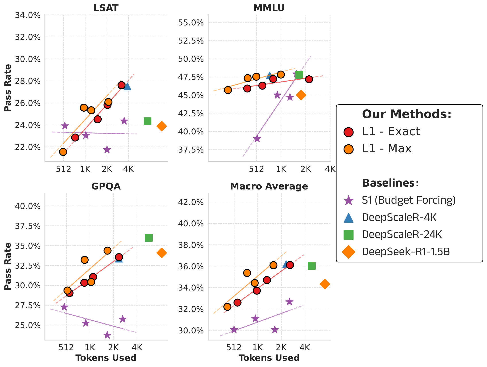
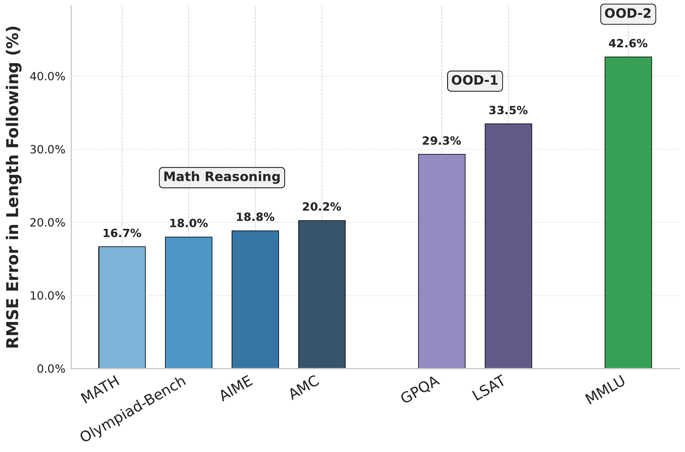
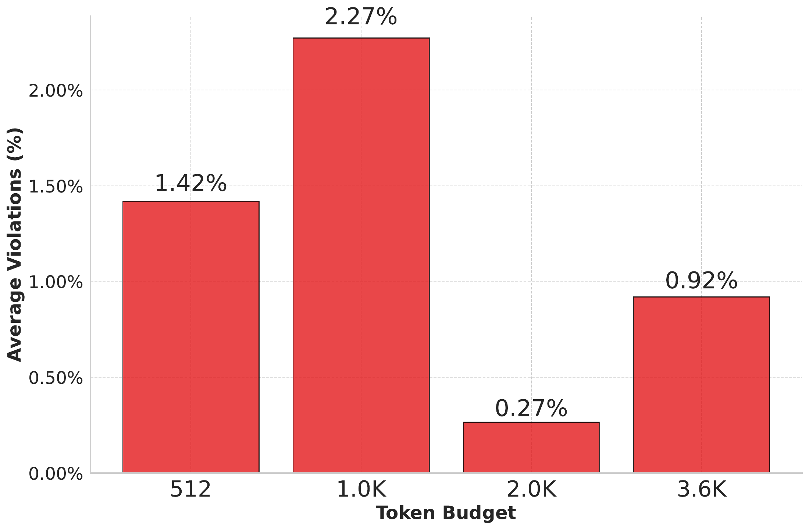
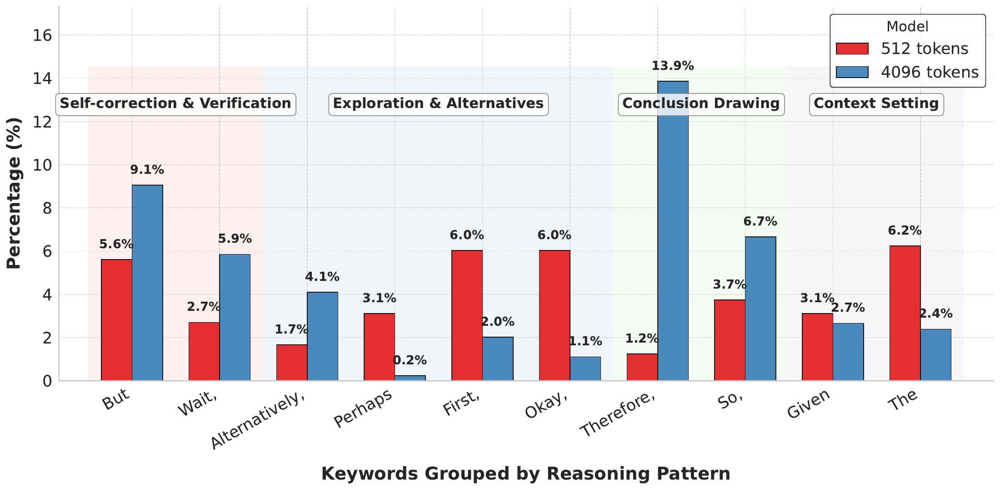
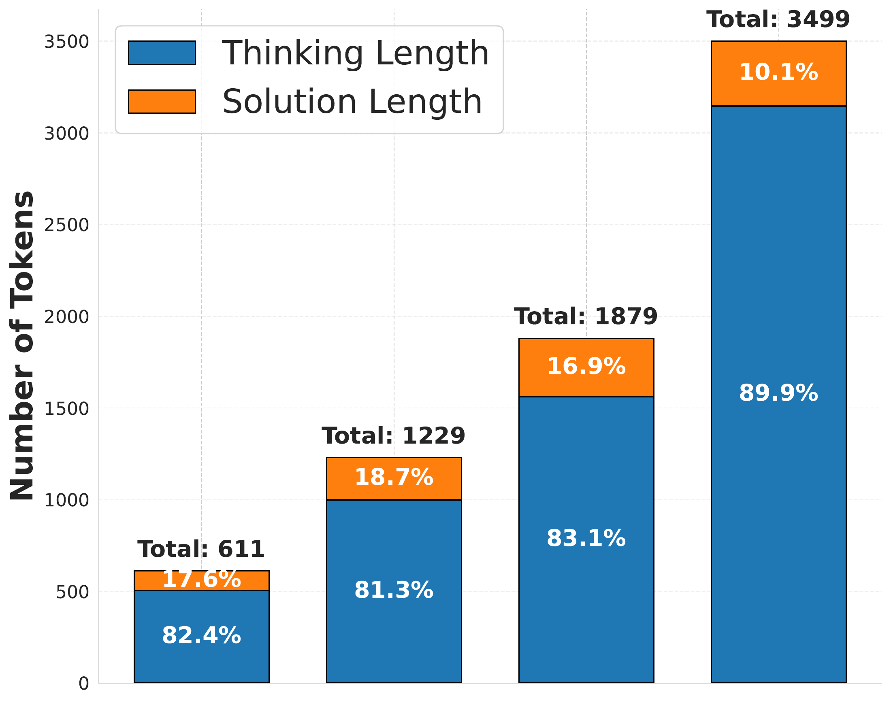
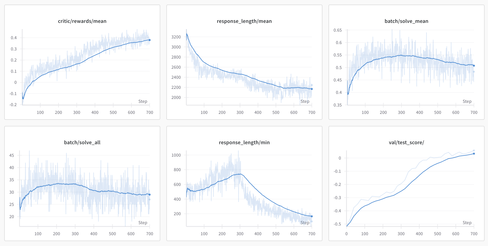

# L1: Controlling How Long A Reasoning Model Thinks With Reinforcement Learning

[所属章节](../index.md) · [来源与阅读状态](../../../../sources/papers.json)


**作者**：Pranjal Aggarwal、Sean Welleck（Carnegie Mellon University） <br>
**年份与版本**：COLM 2025；arXiv:2503.04697v2，2025-10-03 版本 <br>
**原始链接**：[论文页面](https://arxiv.org/abs/2503.04697v2) · [固定 PDF](https://arxiv.org/pdf/2503.04697v2) · [作者代码与模型](https://cmu-l3.github.io/l1) <br>
**本稿阅读范围**：完整阅读固定 PDF 的正文第 1–7 节、正文 Figure 1–7 和 Table 1；补读附录 A.1–A.10 中与正文判断直接相关的 Figure 8–21、Table 2–6，以及作者 TeX 源和原始图资产。参考文献未逐条展开。论文发布版本和 arXiv v2 的正文内容以临时目录中的 `source/paper.pdf`、`source/paper.txt` 为准。

## 1. 论文要解决什么问题

这篇论文关注的是推理模型的测试时计算分配。以 R1、o1 一类模型为例，模型往往通过生成更长的 chain-of-thought（CoT）来提高复杂题准确率；但用户只能给一个总的最大生成长度，无法可靠地要求模型“恰好思考 512 个 token”或“最多思考 1,024 个 token”。模型可能过早停止，也可能在简单题上继续生成数千 token。前者损失正确率，后者浪费延迟、显存和推理费用。论文的目标不是把所有回答都缩短，而是让用户在准确率与生成长度之间可控地换挡。

论文把目标形式化为：给定题目输入 $`x`$、目标长度 $`n_{gold}`$，模型生成回答 $`y`$，其输出长度为 $`n_y`$；理想行为是在回答正确的同时最小化

```math
|n_{gold}-n_y|.
```

这里的长度是模型的**完整生成输出**长度，包含思考段和最终答案，而不是只数 `<think>` 内部的 token。作者在 Limitation 中明确说，按思考 token 单独控制是未探索的后续方向。因此“token 效率”在本文中首先意味着实际生成 token 的预算控制；论文没有把它换算为 FLOPs、美元、端到端延迟或训练成本，也没有给出完整的任务成本前沿。

作者的直接对照是 S1 的 budget-forcing：达到预算后截断，或插入 `Wait`/`Final Answer` 一类特殊 token 迫使回答结束。作者认为这种后处理会在推理中间截断步骤，降低准确率和可解释性；反复使用特殊 continuation token 也可能形成僵硬模式。本文选择把长度作为训练时的在线奖励，而不是在测试时硬截断。

## 2. LCPO 的训练对象和数据

训练从一个已经具备长 CoT 能力的推理模型 $`LLM_\theta`$ 开始。数据集 $`D=\{(x_i,y_{gold,i})\}_{i=1}^N`$ 只有题目和最终答案，不提供人工或蒸馏的中间推理轨迹。对每个样本，从训练区间均匀采样目标长度 $`n_{gold,i}\sim U(100,4000)`$，把指令附加到题目末尾：

```math
x_i^{new}=\operatorname{Concat}\bigl(x_i,\;\text{“Think for }n_{gold,i}\text{ tokens.”}\bigr).
```

训练所得 $`D^{new}`$ 仍然只有最终答案作为正确性判据。作者使用 GRPO（Group Relative Policy Optimization）进行 RL 微调：对同一个输入采样一组回答，分别计算规则奖励，再在组内用相对奖励/优势更新策略，并保留 GRPO 的参考策略约束。论文没有重新推导 GRPO 的截断比率、KL 项或组内优势公式；因此这些属于所采用的基础算法背景，LCPO 的论文贡献是**输入中加入长度要求和奖励设计**，不是新的 GRPO 更新式。训练时使用的 VeRL 实现和 DeepScaleR-1.5B-Preview 的 GRPO 超参数为学习率 $`10^{-6}`$、batch size 128、训练上下文上限 4K。

这种在线 RL 结构很关键：同一题在不同 $`n_{gold}`$ 下可以得到不同轨迹和不同长度误差，策略必须学会重新安排推理步骤，而不是把一条离线轨迹的固定长度标签复制给所有输入。附录 A.6 的 SFT 对照支持这一点：即使把已有回答的实际长度重新写成指令-回答对，SFT 模型在请求 512、1,024、2,048、4,096 token 时仍分别平均生成 21,388、22,749、21,426、20,903 token。作者的解释是每道题的离线长度分布过窄，模型会忽略长度指令；同时没有在线的长度敏感奖励来迫使模型适应不同难度与预算。这是作者的解释，不是额外的因果实验。

## 3. LCPO-Exact：正确性和精确长度的联合奖励

L1-Exact 使用的奖励是论文 Equation (1)：

```math
r_{\mathrm{Exact}}(y,y_{gold},n_{gold})
=\mathbb{I}(y=y_{gold})-\alpha\,|n_{gold}-n_y|.
```

$`\mathbb{I}(y=y_{gold})`$ 是最终答案正确时为 1、否则为 0 的指示函数；$`n_y`$ 是完整输出长度；$`\alpha`$ 控制准确率与长度误差的相对权重。本文实验固定 $`\alpha=0.0003`$，没有广泛调参。该奖励有两个同时发生的效果：正确答案得到正的正确性项，但任何偏离目标的 token 都会扣分；即使少写几百 token 已经能答对，模型也会继续接近指定长度。较小的 $`\alpha`$ 更偏向正确性，较大的 $`\alpha`$ 更强调长度匹配。

一个可追踪的数值例子：若目标 $`n_{gold}=512`$、回答长度 $`n_y=480`$，且答案正确，那么 $`r=1-0.0003\times32=0.9904`$；若长度 512 且正确，$`r=1`$；若长度 700 且正确，$`r=1-0.0003\times188=0.9436`$；若长度 512 但答案错，$`r=0`$。因此在这组参数下，长度偏差约 3,333.33 token 才会抵消一个正确性单位（1/0.0003），但论文没有报告这种奖励尺度下不同题目难度的校准曲线。若同一题有两个正确轨迹，奖励会偏好离目标更近的轨迹；若一个短轨迹正确、一个目标长度轨迹错误，前者不一定总是胜出，具体取决于错误轨迹的长度误差。这个取舍正是 LCPO 的核心：长度是软奖励，不是脱离正确性的硬验收。

推理阶段只需把同一个长度要求附加到测试题，例如 `Think for 1024 tokens.`；模型可以在不同题目上使用不同 target。实验中主要比较 $`\{512,1024,2048,3600\}`$ 四个目标点。Exact 模式的含义是趋向**绝对误差最小**，不是保证每个样本逐 token 精确等长。

## 4. L1-Max：最多不超过预算的变体

许多部署场景只需要一个最坏情况预算：简单题可以早点停，难题也不能超过上限。L1-Max 从 L1-Exact checkpoint 继续 RL 微调，使用 Equation (2)：

```math
r_{\mathrm{Max}}(y,y_{gold},n_{gold})
=\mathbb{I}(y=y_{gold})\cdot
\operatorname{clip}\bigl(\alpha(n_{gold}-n_y)+\delta,0,1\bigr),
\qquad \delta=0.5.
```

这是**乘法的软约束**。正确性为 0 时总奖励为 0；正确时，长度项把奖励限制在 0 到 1。若 $`n_y=n_{gold}`$，长度项为0.5；若提前结束，长度项随余量增大，足够短时才被clip到1，所以简单题可以少用token；若超出预算，$`n_{gold}-n_y<0`$，奖励随超出量逐渐下降，而不是到达上限后突然截断。$`\delta=0.5`$ 使得略微超预算但正确的回答仍有可能优于错误回答；Equation (2) 中的 $`\alpha`$ 控制超预算惩罚，但论文没有在正文实验设置中单独给出 L1-Max 的数值，因此不能擅自把它等同为 Equation (1) 的 $`0.0003`$。

论文说明，L1-Max 的 dual objective 保留精确长度模式：提示要求 exact length 时用 Equation (1)，否则使用 Equation (2) 的 maximum constraint 模式。它因此既可以输出固定长度曲线，也能在“最多 $`n_{gold}`$”场景按题目难度提前结束。这里的“soft”不是没有预算目标，而是违反时仍保留渐进奖励，便于 GRPO 的相对更新传播；它也意味着“最大长度”不是形式化的绝对保证。

奖励变体的算例能说明为何不能只看违约率。设 $`n_{gold}=1000`$、正确回答长度 $`n_y=1100`$，取 $`\alpha=0.003`$、$`\delta=0.5`$，则长度项为 $`\operatorname{clip}(0.003(-100)+0.5,0,1)=0.2`$，总奖励为 0.2；若回答正确且 $`n_y=700`$，长度项为 $`\operatorname{clip}(0.003(300)+0.5,0,1)=1`$，总奖励为 1；若回答错误，即使长度完美，总奖励仍为 0。这里的 $`\alpha=0.003`$ 只是解释公式的教学数值，论文没有声称采用它。论文附录 A.7 的 Addition 变体使用加法奖励 $`\mathbb{I}(y=y_{gold})-\alpha|n_{gold}-n_y|`$，确实达到 0% budget violation，但模型坍缩为极短 CoT，准确率显著下降。它是“长度验收漂亮、任务结果失败”的反例。

## 5. 训练和评测设置

训练数据是 DeepScaleR-Preview-Dataset 的 40K 数学问答，来源包含 AIME、AMC、Omni-Math、STILL。基础模型是由 Qwen-2.5-1.5B-Instruct 经 DeepSeek-R1 推理轨迹和 DeepScaleR RL 得到的 DeepScaleR-1.5B-Preview；原始模型有 24K context，但 LCPO 受算力限制训练时改为 4K context，评测扩到 8K。L1-Exact 训练 700 个 RL steps，L1-Max 从它继续训练 120 steps。目标长度训练区间是 100–4000 token；推理比较点是 512、1,024、2,048、3,600。评测每项使用 16 个随机种子、temperature 0.6。

主要数学测试集为 AIME 2025、MATH、AMC、Olympiad-Bench；OOD 分析加入 GPQA、LSAT、MMLU。基线包括：DeepSeek-R1-Distill-Qwen-1.5B、未做长度控制的 DeepScaleR-24K、同样用 4K context 的 DeepScaleR-4K，以及 S1 budget-forcing。公平性上，L1 与 DeepScaleR-4K 共享相同基础模型家族和 4K 训练上下文；DeepScaleR-24K 保留更长上下文，因而是性能上限式参照，不是完全匹配的训练条件。作者也报告了非推理 Qwen-2.5-1.5B-Instruct、GPT-4o、Llama-3.3-70B 的短 CoT 对照，但这些模型、训练和解码体系不同，适合回答“相同生成 token 下的表现如何”，不适合构成普适模型排名。

准确率指标是 Pass Rate/Pass@1 solve rate；长度指标是目标与实际生成长度的平均误差，正文 Figure 4 还画了不同数据集的长度分布。L1-Max 的 soft violation 在文中定义为 $`|n_y-n_{gold}|>500`$；正文 Figure 5 报告跨预算约 0.27%–1.42%（平均约 1.3%，附图文字称各预算低于 2.5%）。附录 Figure 12 另报 hard violation 平均约 9%，且 512 token 预算最高。论文正文和附录叙述没有给出 hard violation 的精确定义（例如是否是任意非零偏差、是否只算超上限），因此只能记录“作者报告的 hard 曲线”，不能把它改写成一个已核实的数学事件。

## 6. 主要结果：长度—准确率曲线

**Figure 2（原图：，TeX 原图资产 `assets/figures/pass_rate_vs_tokens_used.pdf`；来源为论文作者 TeX，CC BY 4.0 论文许可，允许复用）** 是整篇论文的核心图。横轴是实际使用的 token budget，纵轴是各数学基准的 pass rate；图中同时放 L1-Exact、L1-Max、S1、DeepScaleR-4K、DeepScaleR-24K、DeepSeek-R1-1.5B。阅读图时要区分“预算点相同”与“每题实际长度完全相同”：Exact 接近请求长度，Max 可提前停止。

在 512 和 1,024 token 处，作者报告 L1 相比 S1 有约 100–150% 相对提升、20–25 个百分点绝对提升；这是在相同长度控制场景下的比较，主要原因被归因于 L1 学会重排/压缩推理，而 S1 可能在中间步骤截断。L1 在更长预算继续上升，并接近 DeepScaleR-4K；L1-Exact 约比同基础模型的 DeepScaleR-4K 低 1%，差距主要出现在 AIME 这类复杂题，因为统一精确长度会给简单题多分配 token、给难题又可能不够。L1-Max 通过按题目难度提前结束，作者称其常可用约少一半 token 达到相近效果，并在许多点匹配或超过 L1-Exact。这个“最多可少用”来自图和作者叙述，论文没有给出每题成本分布的完整统计，不能推广为所有任务都减半。

作者将曲线近似为 pass rate 对 $`\log(n_y)`$ 的线性趋势：L1 斜率约 0.24，S1 约 0.37。较小斜率表示 L1 在短预算区间效率更高，但不能单独推出 L1 在所有更长预算上支配 S1；图中是有限的四个预算点，且各方法训练上下文与后处理不同。对 DeepScaleR-24K，作者只说若用更长 context 训练 LCPO，L1 可能匹配或超过它，这是未来推测，不是本文实验结果。

**Figure 3（原图：，`assets/figures/pass_rate_vs_tokens_used_ood.pdf`，CC BY 4.0）** 展示 GPQA、LSAT 和 MMLU。GPQA/LSAT 的 pass rate 随预算呈与数学任务相似的上升趋势，在可比预算接近 DeepScaleR-4K；MMLU 的线性关系更弱，作者给出 $`R^2=0.66`$，解释为知识题不太需要长推理。GPQA、LSAT 没有出现在 LCPO 数学 RL 数据中，MMLU 被认为更远离 R1-1.5B 训练分布；不过“可能在基础模型训练域内”是作者对数据暴露的判断，不是严格去污染证明。

**Figure 4 与 Figure 5（原图：、，资产为 `length_error_comparison*.pdf` 与 `budget_violations_combined_soft_high.pdf`，CC BY 4.0）** 表明数学任务的平均长度误差约 3%，目标 512、1,024、2,048、3,600 都能形成相应长度分布。OOD 误差更高：正文称约 20–40%，附录 Figure 11 给出的均值约为数学任务 2.2%–2.9%、GPQA 6.6%、LSAT 20.8%、MMLU 40.5%；MMLU 在高目标长度尤明显。附录 Figure 9 显示 MMLU 的长预算误差可达约 49%，因为额外 CoT 对知识题帮助有限，模型会倾向于提前/偏离目标。附录 Table 2 的额外 500 RL steps（L1-Exact+）把数学 mean error 从 3.01% 变为 3.15%，但 RMSE 从 18.44% 降到 10.04%；OOD-1 mean error 从 21.22% 降到 10.89%，OOD-2 从 40.54% 降到 23.57%。更严格的跟长会在高预算轻微损伤准确率，说明控制精度与可为难题继续思考之间存在取舍。

## 7. 短 CoT 能力、推理模式和新颖性证据

Table 1 把 L1 作为 Short Reasoning Model（SRM）与非推理 Qwen-1.5B、GPT-4o、Llama-3.3-70B 在相近实际输出长度下比较。四个数学基准的平均行中，512 组 L1-Max 为 382 token、42.6%，Qwen-1.5 为 752 token、41.0%；1,024 组 L1-Max 为 866 token、48.5%，GPT-4o 为 840 token、45.6%。作者据此称 L1 平均比自身非推理基座好约 5%，比 GPT-4o 好约 2%。这些是特定 benchmark、解码和长度匹配条件下的结果；模型规模、训练数据和评测协议不同，不能写成“1.5B 普遍超过 GPT-4o”，也不能和 Figure 2 的同一基础模型对照混为一谈。作者还用 AIME 2025 做时间隔离检查：L1-Exact 从 AIME 2024 到 2025 下降约 2.3 个百分点，DeepScaleR-24K 下降 12.9，R1-1.5B 下降 7.5，Llama-3.3-70B 下降 23.5；这支持“不是只靠记忆”的解释，但不是完整的去污染审计。

**Figure 6（原图：，`assets/figures/keyword_comparison_by_pattern.pdf`，CC BY 4.0）**按输出中关键词的归一化出现率比较 512 与 4,096 token。作者将词分为 self-correction/verification、exploration/alternatives、context setting、conclusion drawing 四类。长输出中自校验和结论词约增加 2 倍至 10 倍，探索类相对频率多数下降，“Alternatively”是例外。它说明不同预算下不是简单把同一轨迹截长或截短，而是改变推理模式的相对比例；关键词统计仍是表面代理，不能证明隐藏推理步骤一定执行了对应认知操作。

**Figure 7（原图：，`assets/figures/thinking_vs_solution_analysis_figure.pdf`，CC BY 4.0）**比较 `<think>` token 与最终 solution token。总长度约为 611、1,229、1,879、3,499 时，solution 占比约 82.4%、81.3%、83.1%、89.9%（图中标注为 thinking/solution 分布，具体比例以作者图为准）。作者的解释是短 CoT 常接近只输出答案，长 CoT 主要增加 thinking 而非让最终解答无限变长；图能支持“模型把预算主要用于思考区”，但正文没有报告仅控制 thinking token 的实验。

附录 Figure 20–21 给出同一道复数题的定性例子：目标 512 时模型算出约 625.6 并答错，目标 3,600 时中间重新核对平方和，得到正确 540。这个例子直观展示较长预算可以容纳纠错，但不能作为定量因果证据。**原图标记：[原始表格/补充示例](https://arxiv.org/abs/2503.04697)**；TeX 源为 `figures/qual_example1.tex`，PDF 本身在固定论文中，当前资产目录没有单独导出页面图，因此主代理整合时应以 PDF 页面 26–27 或从 TeX 重新编译为准。

## 8. 失败、消融和额外实验

**奖励函数消融（附录 A.7，Figure 15–17）。** 从同一 L1-Exact checkpoint 各训练 120 steps，比较标准 dual-objective L1-Max、只用 Max 项的 Single Objective、加法 Addition 和 Sigmoid。三者的违约曲线大致相近；Addition 甚至稳定 0% violation，但其性能曲线明显最低，因为它坍缩成极短 CoT，满足上限却不再承担推理任务。Single Objective、Sigmoid 和标准乘法在图上相近，没有显著差异；作者最终选标准 L1-Max，理由是双目标简单且兼顾正确性。这里“没有显著差异”是作者对图的描述，正文没有提供逐点置信区间或统计检验表。

**采样参数稳健性（Table 4）。** temperature 从 0.0、0.3、0.6 到 1.0，四个目标长度平均后，长度偏差分别为 6.0%、6.3%、6.2%、5.6%，solve rate 为 46.6%、46.6%、46.5%、46.4%，平均 token 长度 1,778、1,782、1,778、1,765；理想平均长度是四个目标的均值 1,796。它说明控制能力没有明显依赖训练时 temperature 0.6，但只覆盖这组指标和目标集合。

**已有模型直接提示（Table 5）。** DeepScaleR-24K 即使被提示 “Think for exactly N tokens”，N=512、1,024、2,048、3,600 时实际平均分别为 5,491、6,072、5,846、6,421 token。也就是说，提示本身不足以把不可控的长 CoT 变成可控模型；必须改变训练目标或采用 S1 一类外部干预。

**平行与顺序扩展（附录 A.8，Figure 18）。** 论文以总生成 token 作为成本，比较一条更长 CoT（sequential scaling）和多条较短回答多数投票（parallel scaling）。顺序扩展几乎总优于相同 token 成本的平行扩展；但平行多数投票仍能给某些模型带来超过 10% 的提升，且具有低单请求延迟优势。L1-Max 1,024 在短轨迹下从多数投票中受益明显；L1-Max 3,600 的曲线可匹配 DeepScaleR-4K 的平行扩展。最后一个平行点只有 1 个 seed，作者明确认为小幅下降不具统计意义。这里的结论是特定模型/预算/投票协议下的成本比较，不是顺序推理对所有系统的普遍支配。

**扩展到 7B（附录 A.9，Figure 19）。** 作者把 LCPO 应用到 DeepSeek-R1-Distill-7B，观察到与 1.5B 类似的长度控制、低违约率和跨预算性能趋势。图没有在正文中给出每个点的完整数值表、训练步数或完整成本统计，因此它是可扩展性的初步证据，不是足以比较 1.5B 与 7B 的规模定律。

**训练动态（附录 Figure 14，原图 ，`assets/figures/training_logs.png`）。** 前约 300 steps，模型首先提高 solve rate，同时最短回答长度下降；约第 300 step 后，reward 和 token-adherence（reward 减 solve mean）快速上升，最短长度骤降并接近训练下限 100。作者称之为“aha moment”，即策略在训练中突然学到长度概念。它是训练日志中的相变描述，不等于普适的优化理论。

## 9. 论文贡献应如何理解

论文最稳固的贡献是一个可实现的训练范式：把用户预算写进输入，把最终答案正确性和长度误差放进在线 GRPO 奖励，再用 Exact/Max 两种约束语义训练。对于 1.5B 基础模型和本文的数学/OOD 设置，结果显示它比 S1 的硬干预更能保留短预算准确率，同时实际长度更接近目标；Max 还允许简单题提前结束。LCPO 还暴露出一个有趣现象：长 CoT 模型经过长度条件训练后，在短 CoT 上比原始非推理基座更强。

但不能把 Figure 2 的有限预算曲线写成“全面 dominance”。L1-Exact 在某些点低于 DeepScaleR-4K，L1-Max 的提前结束成本优势依赖题目分布；更长于训练区间的请求没有验证；MMLU 长预算长度误差高；hard violation 仍约 9% 且定义不完整；Addition 变体展示了极端长度服从会伤害正确性的失败模式。论文没有报告端到端延迟、FLOPs、美元成本、训练成本、隐藏 reasoning token 的单独预算、多个模型规模的完整 Pareto 前沿，也没有证明 7B、24K 训练或其他 RL 算法会保持同样趋势。

## 10. 与推理时 token 效率的关系和局限

这篇工作把“token 效率”落实为可提示的生成长度—正确率曲线：用户可以在 512、1,024、2,048、3,600 等点选择计算预算，而不是接受模型不可预测的自然停止长度。Exact 适合需要固定槽位、便于批处理或成本预算的场景；Max 适合给每题一个上限、允许简单题提前停止的场景。正确性项必须保留，否则 Addition 的 0% 违约反例会把优化目标变成“尽可能少说”。实践中应把目标长度、实际长度、答案正确性、soft/hard violation 和解码温度一起记录，不能只报一个平均 token 数。

局限首先是训练—部署长度外推：训练目标上限约 4,000、训练 context 4K，作者明确承认对更长请求未验证；评估 context 8K 也不等于训练出 8K 的能力。其次，论文控制的是完整输出 token，不是隐藏思考 token；最终答案格式、工具调用、KV-cache 显存、并发和端到端延迟均未纳入奖励。再次，OOD 误差和 hard violation 表明“软预算”不能替代运行时的真正硬上限；若部署必须绝不超预算，仍需要外部停止策略，而外部截断又可能重现 S1 的损伤。最后，AIME2025 的时间隔离与 SFT/奖励消融提供了支持性证据，但没有构成全面去污染审计，也没有独立复现实验。因此，这篇论文适合作为“用 RL 学习预算条件推理”的方法起点和实验基线，不能单独证明它在所有任务或成本定义下都优于更短但准确率较低的方案。

## 图资产索引

本文使用作者 TeX 工程中的原始图，论文与资产许可信息见 [CC BY 4.0](http://creativecommons.org/licenses/by/4.0/)。以下均未裁剪；`source/latex-source.tar` 保留完整 TeX 工程。

| figure-id | 论文图 | 内容 | local_file | 复用 |
|---|---|---|---|---|
| figure1-teaser | Figure 1 | L1 与 S1/不可控模型的长度—准确率概览 | `assets/figures/teaser_figure_image.pdf` | 允许，CC BY 4.0 |
| figure2-main-results | Figure 2 | 四个数学任务和 macro average 的 pass rate—token 曲线 | `assets/figures/pass_rate_vs_tokens_used.pdf` | 允许，CC BY 4.0 |
| figure3-ood | Figure 3 | GPQA、LSAT、MMLU OOD 曲线 | `assets/figures/pass_rate_vs_tokens_used_ood.pdf` | 允许，CC BY 4.0 |
| figure4-length-control | Figure 4 | 各数据集目标/实际长度分布 | `assets/figures/length_error_comparison*.pdf` | 允许，CC BY 4.0 |
| figure5-violations | Figure 5 | L1-Max soft violation 率 | `assets/figures/budget_violations_combined_soft_high.pdf` | 允许，CC BY 4.0 |
| figure6-keyword-patterns | Figure 6 | 四类推理关键词在 512/4096 的相对频率 | `assets/figures/keyword_comparison_by_pattern.pdf` | 允许，CC BY 4.0 |
| figure7-thinking-solution | Figure 7 | thinking/solution token 分布 | `assets/figures/thinking_vs_solution_analysis_figure.pdf` | 允许，CC BY 4.0 |
| figure14-training-dynamics | Appendix Figure 14 | 训练中的 solve/reward/长度变化 | `assets/figures/training_logs.png` | 允许，CC BY 4.0 |
| figure12-hard-violations | Appendix Figure 12 | hard violation 曲线 | `assets/figures/budget_violations_combined_hard.pdf` | 允许，定义需注明未清楚 |
| figure13-soft-violations | Appendix Figure 13 | soft violation 曲线 | `assets/figures/budget_violations_combined_soft.pdf` | 允许，CC BY 4.0 |
| figure18-scaling | Appendix Figure 18 | parallel vs sequential scaling | `assets/figures/pass_rate_vs_tokens_used_majority.pdf` | 允许，CC BY 4.0 |
| figure19-7b | Appendix Figure 19 | 7B LCPO 扩展 | `assets/figures/scaling_results_7b.png` | 允许，CC BY 4.0 |
| figure20-21-qualitative | Appendix Figures 20–21 | 同一道题在 512/3600 的错误/正确回答 | TeX `figures/qual_example1.tex`；论文 PDF pp. 26–27 | 需从源重新编译/裁页 |
