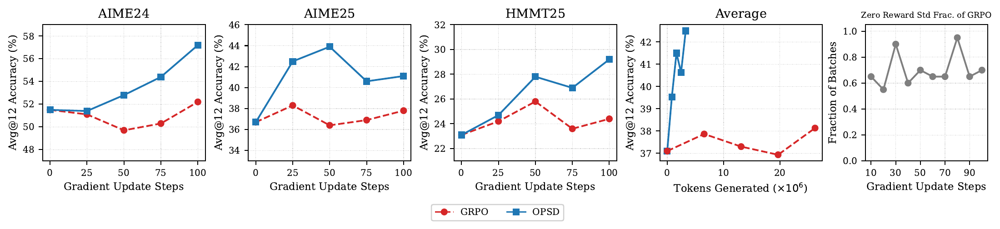

# Self-Distilled Reasoner: On-Policy Self-Distillation for Large Language Models

[所属章节](../index.md) · [来源与阅读状态](../../../../sources/papers.json)


- 作者：Siyan Zhao、Zhihui Xie、Mengchen Liu、Jing Huang、Guan Pang、Feiyu Chen、Aditya Grover
- 年份：2026；固定版本：arXiv:2601.18734v3（2026-03-20）
- 原始链接：[arXiv 页面](https://arxiv.org/abs/2601.18734v3)；[代码仓库](https://github.com/siyan-zhao/OPSD)
- 实际阅读范围：固定 PDF 的正文第 1–9 页、附录 A–D（限制、训练/评测配置、token 分类、STaR 对照与 policy-gradient 推导），以及随源工程提供的 `sections/*.tex` 和四个图形资产。参考文献未逐条核验。下文把作者在正文中的 OPSD 结果与作者自己的解释分开陈述。

## 1. 这篇论文要解决什么

在数学推理后训练中，SFT 用专家解答训练，却在训练时只见固定轨迹；部署时模型会走自己的前缀，因而有 exposure bias。GRPO 一类 RLVR 让模型采样自己的轨迹，分组后用最终答案的 0/1 正确性给奖励，但一个样本的所有 token 通常共享同一个 advantage；整组答案全对或全错时，组标准差为零，采样成本已经支付却没有更新信号。传统 on-policy distillation 可以在学生自己的轨迹上提供 token 级教师分布，但需要另一个、通常更强更大的 teacher。

OPSD（On-Policy Self-Distillation）的中心问题是：同一个 LLM 能否在不同上下文中扮演“有答案提示的 teacher”和“部署条件下的 student”？论文将参考解 $y^\star$ 当作训练期间的 privileged context，让 teacher 在看到它后评价 student 的轨迹；student 仍只看到题目，所以训练分布中的采样前缀与部署条件一致。方法并不声称 teacher 能在部署时看到答案，也没有把答案拼到 student 的输入中。

## 2. 对象、上下文和一轮训练

数据集是问题–参考解对

```math
\mathcal S=\{(x_i,y_i^\star)\}_{i=1}^N,
```

其中 $y^\star$ 可以含 chain-of-thought。两种 policy 共享同一组参数 $\theta$，区别只在条件上下文：

```math
p_S(\cdot\mid x)\triangleq p_\theta(\cdot\mid x),\qquad
p_T(\cdot\mid x,y^\star)\triangleq p_\theta(\cdot\mid x,y^\star).
```

实际 teacher prompt 先给题目和 reference solution，再要求“理解参考解后，用自己的方法尝试解决”；例如正文图 2 用 $f(x)=3x^2+2x-5$ 在 $x=2$ 求导的例子。这个“尝试解决”是为了使从 reference context 过渡到 student prefix 更自然，但 teacher 不采样输出，不另生成一段 rationale；它通过 prefilling/reference context 的一次 forward pass 产生每个位置的 logits。训练 teacher 固定为初始 policy，而不是随着 student LoRA 更新的当前 policy；作者认为这既稳定，也像对初始模型的正则化。

一轮步骤如下：

1. 从 $\mathcal S$ 取 $(x,y^\star)$，只用 student prompt 自回归采样
   $\hat y=(\hat y_1,\ldots,\hat y_{|\hat y|})\sim p_S(\cdot\mid x)$。
2. 对同一个 student 前缀 $\hat y_{<n}$，分别计算
   $p_S(\cdot\mid x,\hat y_{<n})$ 和
   $p_T(\cdot\mid x,y^\star,\hat y_{<n})$。teacher 因为已经看过正确解，能在 student 到达的状态上提供条件化分布。
3. 在每个位置比较两个完整词表分布，沿 student 轨迹取平均，然后只把梯度传入 student logits。参考解进入 teacher 的条件计算，但 teacher 分支在目标中 stop-gradient。

教学伪代码（省略优化器和 padding mask）是：

```text
for (x, y_star) in minibatch:
    y_hat = sample(student(x), max_new_tokens=L)
    with no_grad():
        teacher_logits = teacher(x, y_star, prefix=y_hat[:-1])
    student_logits = student(x, prefix=y_hat[:-1])
    loss = mean_n(clip_or_raw_divergence(teacher_logits[n], student_logits[n]))
update(loss, student_parameters_only)
```

这里的 `sample` 是 on-policy；teacher 的“自我解释”并不是一次额外生成，因此 token efficiency 的采样账本只统计 student rollout，但全词表 teacher/student forward 仍有显存和计算成本。

## 3. 目标函数：全分布匹配与裁剪

对于 student 轨迹，正文定义 trajectory-averaged divergence：

```math
D(p_T\|p_S)(\hat y\mid x)=
\frac1{|\hat y|}\sum_{n=1}^{|\hat y|}
D\!\left(p_T(\cdot\mid x,y^\star,\hat y_{<n})\;\middle\|\;
p_S(\cdot\mid x,\hat y_{<n})\right).
```

整体目标为

```math
\mathcal L_{\mathrm{OPSD}}(\theta)=
\mathbb E_{(x,y^\star)\sim\mathcal S}
\mathbb E_{\hat y\sim p_S(\cdot\mid x)}
\left[D(p_T\|p_S)(\hat y\mid x)\right].
```

论文允许 forward KL、reverse KL 或广义 JSD。其 JSD 定义为

```math
\operatorname{JSD}_\beta(p_T\|p_S)=
\beta D_{KL}(p_T\|m)+(1-\beta)D_{KL}(p_S\|m),
\quad m=\beta p_T+(1-\beta)p_S.
```

主实验采用 forward KL $D_{KL}(p_T\|p_S)$。这不是只提高 student 对“实际抽到的 token”的概率：每个位置都对整个 vocabulary 做 softmax 后比较，所以 teacher 对替代 token 的相对偏好也进入梯度。直观上，student 走到一个可能错误的前缀，teacher 仍能在这个前缀上给出“下一步哪些 token 更像通往正确解”的软分布。

作者观察到词表级 KL 重尾：少数风格词对 divergence 的贡献高于数学词，会让模型学习措辞而非解题。因此对每个位置、词表项 $v$ 的 $f$-divergence 贡献

```math
\ell_{n,v}^{(f)}=p_T(v\mid\cdot)
f\!\left(\frac{p_S(v\mid\cdot)}{p_T(v\mid\cdot)}\right)
```

逐项裁剪，再求位置和词表的平均：

```math
D_{\mathrm{clip}}^{(f)}(p_T\|p_S)=
\frac1{|\hat y|}\sum_{n=1}^{|\hat y|}\sum_{v\in\mathcal V}
\min(\ell_{n,v}^{(f)},\tau).
```

这只是稳定训练的贡献上限，不是把整条序列的 KL 做一次 clip。附录明确说作者没有调 $\tau$；因此更大模型在相同 100-step 预算下是否还能从该超参获益仍未知。

论文还实现了一个低内存对照：只看 sampled token 的 teacher/student log-probability，令

```math
A_n=\log p_T(\hat y_n\mid x,y^\star,\hat y_{<n})-
\log p_S(\hat y_n\mid x,\hat y_{<n}),
```

并优化 $-\frac1{|\hat y|}\sum_n A_n\log p_S(\hat y_n\mid\cdot)$。计算 $A_n$ 时 stop-gradient，因此梯度是标准 policy-gradient 形状 $A_n\nabla_\theta\log p_S$。它只在已采样 token 上塑形，不能等同于全词表 divergence；Qwen3-4B、distillation length 2048 的对照也显示两者并非同一算法。

## 4. 它和 SFT、普通 OPD、RLVR 的真实区别

SFT 在 reference prefix 上最大似然/蒸馏离散 token 序列；其数据是 off-policy，student 没有在自己的错误前缀上被纠正。OPSD 的输入答案仍是 reference，但 teacher 的软目标作用于 student 自己的 prefix，并且是全词表 token 分布。因而它继承 on-policy visitation，同时保留 dense supervision。

普通 on-policy distillation 也在 student 自采样轨迹上匹配 teacher 分布，区别是 teacher 是独立模型（通常更大或能力更强）。OPSD 的 teacher 和 student 参数相同，唯一“能力差异”来自 privileged answer context。故“无 external teacher”不等于“无 teacher computation”，也不等于 student 从没有答案的模型凭空发现答案；正确解数据仍是整个训练信号的来源。

GRPO 对每题采样一组 $G$ 条回答，用二元正确性 $r_i$ 做组归一化

```math
A_i=\frac{r_i-\operatorname{mean}(r_1,\ldots,r_G)}
{\operatorname{std}(r_1,\ldots,r_G)}.
```

一个回答的所有 token 共享该 outcome advantage；全组同奖时 advantage 失效。OPSD 不需同题 8 条 rollout，也不等最终答案正确才有信号：teacher distribution 在每个位置给反馈。附录 D 把 sampled-token OPSD 写成 dense policy gradient，但主实验的 full-vocabulary OPSD 更准确地说是沿 on-policy 轨迹的条件分布匹配，不能把所有 OPSD 变体笼统称作 GRPO。

STaR 是另一种 self-training：采样 rationale 和答案，只保留最终答对的样本再 SFT。作者在附录把它写成 sequence-level binary reward $\mathbf1(y=y^\star)$ 的 policy gradient；错误样本没有梯度，正确样本中所有 token 也共享同一个信号。OPSD 用 $r_n=\log p_T(\hat y_n)-\log p_S(\hat y_n)$ 逐 token 给 dense reward，即便最终答案错也可学习。

## 5. 实验设置与公平比较

训练模型为 instruct-tuned Qwen3-1.7B、4B、8B；训练数据是 OpenThoughts 的数学推理子集，最多抽取 30K 个带 chain-of-thought 的问题–解对。测试为竞赛数学 AIME 2024、AIME 2025、HMMT 2025。主评测用 Qwen3 blog 推荐的 temperature 1.0、top-p 0.95、最多 38,912 new tokens、每题 12 次采样，报告 Avg@12；附录表 8 给出这些评测配置。

SFT、GRPO、OPSD 都用同一数据。LoRA rank 64、alpha 128，目标模块为 q/k/v/o、gate/up/down projection；8 张 A100 或 H100，gradient checkpointing、Flash Attention 2、AdamW、bfloat16。GRPO/OPSD 有效 batch size 都为 32、学习率 $5\times10^{-6}$；GRPO 训练 500 steps、每 prompt 8 条 generation、最大 completion 16,000、temperature 1.2；OPSD 训练 100 steps、每 prompt 1 条 rollout、最大 1,024、temperature 1.1。SFT 100 steps、最大序列长 16,000。

主表对 GRPO 取 500 steps 内峰值，对 OPSD 每 20 steps 检查至 100 步并取最好值。因此“OPSD 在 100 步胜过 GRPO”不是同一个 checkpoint 选择规则，也不能直接当作相同 wall-clock 或相同总训练 FLOPs 的严格 Pareto 前沿。

## 6. 主结果

Table 2 的 Avg@12（百分数）如下，粗体为各模型组最好值：

| 模型/方法 | AIME24 | AIME25 | HMMT25 | Average |
|---|---:|---:|---:|---:|
| Qwen3-8B Base | 75.8 | 65.6 | 43.9 | 61.8 |
| 8B SFT | 72.3 | 64.2 | 42.9 | 59.8 |
| 8B GRPO | 76.4 | 68.9 | **46.7** | 64.0 |
| 8B OPSD | **77.8** | **70.8** | 45.8 | **64.8** |
| Qwen3-4B Base | 74.9 | 66.4 | 42.2 | 61.2 |
| 4B SFT | 70.2 | 62.3 | 43.4 | 58.6 |
| 4B GRPO | 75.6 | 68.1 | 44.4 | 62.7 |
| 4B OPSD | **76.4** | **68.3** | **46.1** | **63.6** |
| Qwen3-1.7B Base | 51.5 | 36.7 | 23.1 | 37.1 |
| 1.7B SFT | 48.4 | 36.3 | 22.7 | 35.8 |
| 1.7B GRPO | 51.1 | 38.3 | 23.7 | 37.7 |
| 1.7B OPSD | **57.2** | **43.9** | **29.2** | **43.4** |

作者结论是 OPSD 在三个规模和三个任务上都胜过同数据 SFT，并且每组 Average 都达到或超过 GRPO；但 HMMT25 的 8B 单项仍是 GRPO 更高（46.7 对 45.8）。SFT 的一致下降被归因于 OpenThoughts reference 解较简洁，直接模仿会使测试时 reasoning length 变短；这是作者解释而不是单独的因果实验。1.7B 的提升最大（Average 37.1→43.4），不能据此断言规模越小普遍越受益。



图 3（原文件 `assets/methods_tokens.pdf`，正文 Figure 3）把 Qwen3-1.7B 的 Avg@12 对 training steps 和 total tokens generated 并列，右侧画 GRPO 每批 reward standard deviation 为零的比例。两者 effective batch size 相同；OPSD 每步至多 32 个问题各一条、长度封顶 1,024，GRPO 每题 8 条、长度封顶 16K。因此图中的生成 token 预算大致按“每题 1×1,024 对 8×16,000”拉开，作者观察到 100 步内 OPSD 用更少 sampled tokens 却在三任务上更高。右图的实质是 reward diversity collapse：超过一半 GRPO batches 在 100 步内零 reward std，因而没有 outcome-gradient。该图证明的是训练采样 token/学习步效率；它没有测量部署时每道题的输出 token、总推理 token、延迟、FLOPs 或 KV-cache。

## 7. 消融和分析

### 7.1 Divergence 选择

Qwen3-1.7B、AIME25、相同 pointwise clipping 下，Table 3 报告 Avg@12：

| 目标 | Base | Step 50 | Step 100 |
|---|---:|---:|---:|
| forward KL $\mathrm{KL}(p_T\|p_S)$ | 36.7 | **43.9** | **41.1** |
| reverse KL $\mathrm{KL}(p_S\|p_T)$ | 36.7 | 37.5 | 35.0 |
| JSD ($\beta=0.5$) | 36.7 | 36.9 | 39.0 |

作者因此把 forward KL 用于其余实验。这个单任务、单规模消融支持“该设置在此配置下更好”，不能推广成 forward KL 在所有 teacher/student context 或所有任务都更优。

### 7.2 Thinking style 与 token 类别

Qwen3 有 Thinking Mode on（生成 self-reflective CoT）和 off（直接生成）。作者将 student/teacher 的四种组合按 math、style、other token 分类，在 10 个问题上求平均每-token KL。附录表 5 的 math/style/other 数值为：

| Student | Teacher | 1.7B | 4B | 8B |
|---|---|---|---|---|
| TM-off | TM-off | 0.68 / 0.12 / 0.11 | 0.61 / 0.06 / 0.10 | 0.56 / 0.05 / 0.11 |
| TM-on | TM-off | 0.51 / 0.10 / 0.17 | 0.41 / 0.05 / 0.18 | 0.33 / 0.05 / 0.15 |
| TM-on | TM-on | 0.51 / 0.09 / 0.08 | 0.50 / 0.04 / 0.09 | 0.42 / 0.04 / 0.08 |
| TM-off | TM-on | **0.85 / 0.14 / 0.25** | **0.92 / 0.10 / 0.29** | **0.79 / 0.06 / 0.25** |

每格依次是 math/style/other；“math token”由预定义英文关键词列表构成，包含 equation、factor、integer、coefficient 等，不是自动语义标注。TM-off student/TM-on teacher 的 math KL 最大，作者据此选作主配置；style/other 贡献的重尾现象也解释了 pointwise clipping 的必要性。这里的关键词分析只能说明该定义下的 KL 分解，不能直接证明模型真的只学数学语义。

### 7.3 Pointwise clipping

Figure 4（`assets/clipping_curve.pdf`）是 Qwen3-1.7B 在 AIME24 的有/无 per-token KL clipping 学习曲线。无 clipping 时后期性能明显塌陷，clipping 稳定了 100-step 内的快速收敛。作者没有展示不同 $\tau$ 的网格，也没有把 clipping 与其他正则化、teacher 更新策略拆开，因此它支持“该裁剪在当前实现下有稳定作用”，不支持唯一机制归因。

### 7.4 Student generation length

Figure 5（`assets/gen_length_curve.pdf`）在 Qwen3-1.7B 上比较 1,024 与 4,096 的 student rollout length，任务是 AIME25 和 AIME24，均用 full-vocabulary distillation。4,096 并没有稳定优于 1,024。作者推测早期 token 是更关键的分支点；prefix 变长后，teacher 对后续 token 越可预测，新增位置带来的 divergence/有效监督较少。这个解释与曲线一致，但论文没有做位置级 credit ablation，也没有报告每个长度对应的训练 wall-clock 或全词表 logits 显存峰值。

### 7.5 全词表 vs sampled-token

Qwen3-4B、distillation length 2,048，报告 pass@8：

| 变体 | AIME25 | HMMT25 |
|---|---:|---:|
| Full-vocabulary logit distillation | **84.1** | **60.0** |
| Sampled-token distillation | 82.1 | 57.3 |

全词表变体把每个位置所有 vocabulary logits 纳入 divergence；sampled-token 变体只把 student 抽到的 token 作为 advantage。作者认为完整 teacher 分布提供更多监督，但明确承认它需要保存每个位置的词表大小 logits，峰值显存更高。这是性能–内存 trade-off，不是“全词表同时更省 token 和更省算力”。

## 8. token efficiency 到底指什么

论文所谓 token efficiency 实际测的是训练期间的 sampled/generated tokens 与 learning steps：在相同 effective batch size 下，OPSD 每 prompt 1 条、上限 1,024；GRPO 每 prompt 8 条、上限 16,000。Figure 3 将这些生成 token 与 Avg@12 随训练步的变化放在一起，因此“更少 tokens”是训练采样预算或样本效率的说法。

它没有测量或报告以下部署指标：学生最终回答的 input/output/total tokens，正确答案条件下的平均 reasoning length，hidden thinking tokens，FLOPs，端到端延迟，GPU energy，或每个 benchmark 的 cost–accuracy curve。评测阶段反而使用最多 38,912 new tokens、每题 12 次采样；不能从训练 rollout 的 1,024 上限推断部署轨迹会缩短，也不能从 Avg@12 的提升推断总推理成本下降。全词表蒸馏还增加训练显存和 forward 计算。更稳妥的表述是：在作者给出的训练预算和 checkpoint 选择下，OPSD 以更少的 student rollout tokens 获得了更好的数学后训练结果；“部署推理更 token-efficient”未被这篇论文验证。

## 9. 失败、条件、泄漏边界与局限

方法成立依赖于 reference solution 可用且足够可靠；$y^\star$ 被直接放入 teacher context，是明确的训练期 privileged information。若 benchmark 题目或解答泄漏到 OpenThoughts，teacher 分支可把记忆的答案转成强监督；论文没有给出去污染审计、题目去重、reference correctness 的独立统计，因而不能把结果解释成无答案外部知识的自我发现。

作者报告 reverse KL/JSD 在该消融中提升有限甚至下降；无 clipping 会在 AIME24 后期崩溃；把 rollout 从 1,024 加到 4,096 没有一致收益；SFT 在同数据上普遍退化；GRPO 在 OpenThoughts 上出现大量零 reward std 批次并可能后期 entropy collapse。负面结果和条件都是正文结论的一部分。

限制附录 A 承认只测到 8B，规模外推未知；当前目标没有显式利用 generated answer 的 correctness verification；若题目超过模型理解阈值，即便给 teacher 正确解，模型也未必能产生有意义的 rationalization。作者建议 curriculum，但没有实验。除此之外，full-vocabulary logits 的内存成本、未调的 clipping $\tau$、单一 OpenThoughts 数据源、数学任务范围、teacher 固定为初始 policy，均限制了向一般推理任务和长程部署的外推。

## 10. 图资产与定位

图资产来自固定版本 LaTeX 工程 `source/tex/sections/figs/`，已复制到本目录 `assets/`；论文与图均为 arXiv 页面所标示的 CC BY 4.0 版本，复用时保留论文题名/作者/版本和原图 caption。`opsd.pdf` 是正文 Figure 1 的方法总览；正文 Figure 2 是 TeX 中的 prompt 示例但未作为独立图文件提供，需由主代理从 PDF 或 tex 重排。`methods_tokens.pdf`、`clipping_curve.pdf`、`gen_length_curve.pdf` 分别对应正文 Figures 3–5。表格没有独立图片文件，应从正文表格重排而不是把截图当原图。

## 11. 与推理时 token 目标的关系

OPSD 对推理时 token efficiency 的直接贡献尚未建立：它训练时把每个 student prefix 的 teacher 全词表分布转成 dense update，学生部署时仍只接收题目；训练中的 privileged answer 不可用。已证据支持的是训练 sample efficiency（少采样 token、单 rollout、100 步内达到结果）和数学准确率，不是部署 output token、隐藏 CoT、端到端延迟或总成本。若研究目标是推理时 token 节省，后续必须独立记录相同解题准确率下的输出/隐藏 token、截断失败率、延迟与显存，并控制评测采样次数；当前论文没有这些测量。
