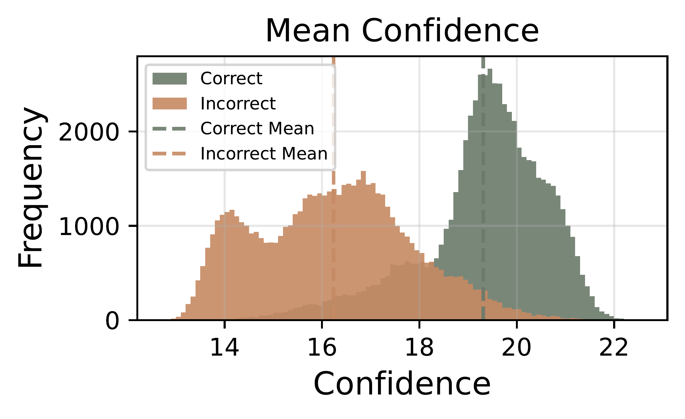
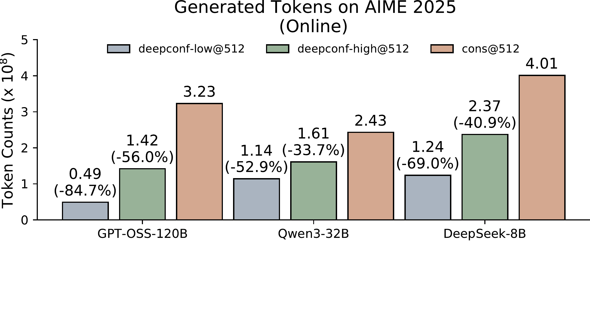
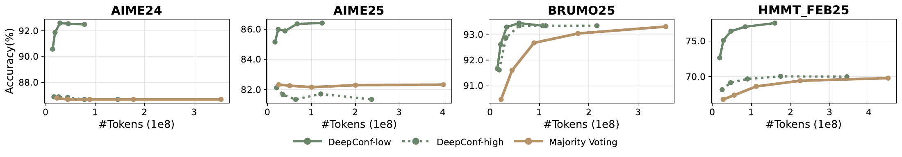

# Deep Think with Confidence：用模型内部置信度压缩并行推理

[所属章节](../index.md) · [来源与阅读状态](../../../../sources/papers.json)


- **作者**：Yichao Fu、Xuewei Wang、Yuandong Tian、Jiawei Zhao（Meta AI；Fu、Zhao 等贡献说明见论文首页）
- **年份与固定版本**：2025；arXiv `2508.15260v1`（2025-08-21）
- **原始链接**：[arXiv 摘要与论文页面](https://arxiv.org/abs/2508.15260v1)，[PDF](https://arxiv.org/pdf/2508.15260v1)
- **实际阅读范围**：固定版本 PDF 全文正文（摘要、§1–§6、正文图 1–7、表 1–2）及为解释正文算法所需的附录 B–F（表 3–12、图 8–11、生成设置）；LaTeX 工程中的图资产也已检查。附录 A 的相关工作用于定位，未逐篇复核其所引论文。

## 这篇工作要解决什么

Self-consistency 的基本做法是对同一问题独立采样很多条思维轨迹，再把每条轨迹抽出的最终答案做多数投票。它把推理预算从“单条链有多长”扩展到“有多少条链”，通常提高准确率，却使生成 token 数近似随轨迹数线性增长。论文用一个具体动机说明这个代价：在 AIME 2025 上，Qwen3-8B 从 68% 的 pass@1 提高到 82% 的多数投票准确率，需要 511 条额外轨迹，约 1 亿额外 token（§1）。此外，更多样本的收益会饱和，错误轨迹若数量足够仍会影响票型，而普通多数投票把好坏轨迹等权处理。

Deep Think with Confidence（DeepConf）提出一个推理时方法：直接使用模型每一步已经产生的 token 分布作为“轨迹质量的内部信号”，把低置信度轨迹在离线阶段过滤，或在在线生成阶段尽早截断。它不训练额外模型、不增加训练，也不改变基础模型；改变的是并行采样的保留、加权和停止规则。这里“置信度”是模型对下一个 token 的分布确定性，论文把它当作正确性的统计相关信号，而不是一个经过校准、可解释为真实概率的置信度。

论文的贡献分成两个层面：离线 DeepConf 让完整轨迹先生成完，再按局部置信度排序、过滤并加权投票；在线 DeepConf 则先用少量完整轨迹校准阈值，在新轨迹的滑动窗口置信度跌破阈值时停止该条轨迹，并在答案共识足够高时停止继续采样。在线方法因此同时节省“被截断轨迹剩余部分”的 token 和“不必再生成的整条轨迹”。

## 从 token 分布到局部轨迹分数

设模型在轨迹第 $i$ 个位置输出词表分布 $P_i$，$P_i(j)$ 是第 $j$ 个词表 token 的概率。论文先回顾 token entropy：

```math
H_i=-\sum_j P_i(j)\log P_i(j).
```

熵低表示分布尖，模型在这个位置更确定。作者实际采用的 token confidence 是 top-$k$ 个 token 对数概率的负平均：

```math
C_i=-\frac{1}{k}\sum_{j=1}^{k}\log P_i(j).
```

由于对数概率通常为负，这个量是正数；在作者的定义和实现中，分数越高表示分布越集中、越有把握。$k$ 是 top-$k$ 候选的数量，不能把 $C_i$ 当作采样 token 的单一概率，也不能把它与整条轨迹的长度混为一谈。

最简单的轨迹分数是全轨迹平均：

```math
C_{\mathrm{avg}}=\frac{1}{N}\sum_{i=1}^{N}C_i,
```

其中 $N$ 是该轨迹实际生成的 token 数。它可以区分正确与错误轨迹，但会把局部崩溃平均掉：一段“非常确定”的铺垫可能掩盖中间连续低置信度的错误推理；并且只有完整轨迹结束后才能计算，不能用于早停。

DeepConf 将观察窗口放到推理局部。对每个位置构造包含当前 token 和此前 $n-1$ 个 token 的重叠窗口 $G_i$，窗口置信度为：

```math
C_{G_i}=\frac{1}{|G_i|}\sum_{t\in G_i}C_t.
```

论文考察四类轨迹级聚合。

1. **Bottom-10% Group Confidence**：取所有滑动窗口中置信度最低的 10%，求这些窗口分数的平均。它保留了“多个坏局部”的信息，比单一极小值稳定。
2. **Lowest Group Confidence（LGC）**：直接取最低窗口，$C_{\mathrm{least}}(t)=\min_{G_j\in G}C_{G_j}$。它是 Bottom-10% 的极端版本，也是在线早停使用的主信号。
3. **Tail Confidence**：仅平均最后固定数量的 token（实验中通常为最后 2,048 个）。作者的动机是长数学链的末段包含结论和最终答案，前面正确不保证末段没有出错。
4. **Average Trace Confidence**：上述全局基线。

图 2 用 HMMT25 的 30 个问题、每题 4,096 条轨迹画出正确/错误轨迹的分布。论文报告 Bottom-10% 和 Tail 比全轨迹均值更好地分离两类分布；这支持“局部坏段比总平均更有判别力”的经验判断，但没有证明置信度对每个问题都校准。

 **读图**：三个小面板分别是全局均值、最低 10% 窗口和末段置信度的直方图；横轴是 confidence，颜色区分正确/错误轨迹。读图重点是两类分布的相对分离，不是把横轴直接当正确概率。

### 离线聚合：加权投票与 top-$\eta$ 过滤

设完整轨迹集合为 $T$，`answer(t)` 是从轨迹中抽出的答案字符串。普通多数投票为：

```math
V(a)=\sum_{t\in T}\mathbf{1}[\mathrm{answer}(t)=a],\qquad
\hat a=\arg\max_aV(a).
```

DeepConf 以轨迹置信度 $C_t$ 替换等权票：

```math
V_C(a)=\sum_{t\in T}C_t\,\mathbf{1}[\mathrm{answer}(t)=a],\qquad
\hat a=\arg\max_aV_C(a).
```

随后按 $C_t$ 排序，只保留 top-$\eta$% 轨迹再做加权投票。论文固定比较 top 10% 和 top 90%：top 10%（DeepConf-low）集中在少数最可靠轨迹上，往往精度增益最大，却容易遭遇“模型很自信但答案错”；top 90%（DeepConf-high）保留更多多样性，是较稳妥的选择。这里的 10%/90% 是保留比例，不是错误率，也不是对答案概率做归一化；例如 $K=512$ 时 top 10% 大约保留 51 条轨迹。

论文图 3 的示意显示，轨迹可因不同的局部指标得到不同排序，过滤后再对答案做置信度加权。该权重改变的是候选答案之间的总票权，不能理解为对模型 logits 做一次新的 softmax。

 **读图**：图 4 将在线过程画成“每条轨迹的滑动窗口—阈值—早停”和右侧的 warmup/过滤流程；$s$ 是按 warmup 轨迹得到的窗口置信度阈值。箭头的含义是：生成新 token、更新当前窗口、若低于 $s$ 则终止该轨迹；不是把已经生成的 token 删除后重采样。

## 在线 DeepConf：阈值从哪里来、何时停止

在线版本不能等待每条轨迹完整结束，因此需要先校准一个和当前问题、当前模型有关的阈值。对每个新 prompt，先完整生成 $N_{\mathrm{init}}$ 条 warmup 轨迹。对每条轨迹计算 LGC 分数 $C_t$，然后定义：

```math
s=\mathrm{Percentile}_{100-\eta}\left(\{C_t:t\in T_{\mathrm{warmup}}\}\right).
```

论文的写法是保留 warmup 中 top-$\eta$ 的轨迹，因此：

- DeepConf-low：$\eta=10\%$，$s$ 是 warmup LGC 分数的第 90 百分位，只有落入最高 10% 水平以上的局部才被视为可继续；
- DeepConf-high：$\eta=90\%$，$s$ 是第 10 百分位，阈值较宽松，保留更大的候选池。

这两个命名容易反读：low/high 指保留比例对应的过滤激进程度，不是“低置信度/高置信度输出”。在线生成一条新轨迹时，每个 token 都更新当前 2,048-token 重叠窗口；一旦 $C_{G_i}<s$，停止这条轨迹。被停止轨迹只贡献已经产生的 token，之后的 token 不会发生。

对已经完成或被早停的轨迹，系统继续按同一个阈值对应的 LGC 规则聚合答案。论文的伪代码写作是：先生成 $N_{\mathrm{init}}$ 条 warmup，初始化票权和当前答案；只要当前共识低于 $\tau$ 且轨迹数小于预算 $B$，就继续生成一条轨迹。

在线共识定义为当前票权最高答案的票权占总票权：

```math
\beta=\frac{V(\hat a)}{\sum_aV(a)}.
```

当 $\beta\ge\tau$ 时停止继续采样，否则直到预算上限 $B$。正文实验用 $\tau=0.95$，$B\in\{32,64,128,256,512\}$；$N_{\mathrm{init}}=16$。因此“64 次”与“512 条轨迹”是两个不同概念：前者是对每个设置独立重抽样运行的重复次数，后者是单次问题的最大轨迹预算；不能用 64 去除 token 总量，也不能把 512 误写成 512 次实验。

### 一个自写数值算例

假设某问题 warmup 得到 16 个 LGC 分数，排序后的第 90 百分位为 $s=17$，因此采用 low 配置。新轨迹生成到第 3,600 个 token 时，当前 2,048-token 窗口分数从 18.2 降到 16.4；因为 $16.4<17$，轨迹在 3,600 token 处终止。它此前的 3,600 token 计入成本，后面本可生成的 1,400 token不计入。若当前已完成轨迹的加权票权为答案 A：190、答案 B：10，则 $\beta=190/200=0.95$，达到阈值，系统也不再启动下一条轨迹。这个例子只说明计费和停止逻辑，数字不是论文的实验样例。

## 实验设计：比较了什么、token 怎么算

模型覆盖三族、五个开源推理模型：DeepSeek-R1-0528-Qwen3-8B（论文简称 DeepSeek-8B）、Qwen3-8B、Qwen3-32B、GPT-OSS-20B、GPT-OSS-120B。任务是 AIME24、AIME25、BRUMO25、HMMT25 四个数学竞赛数据集及 GPQA-Diamond 研究生 STEM 问答。主基线是 self-consistency 的无权多数投票；指标包括 pass@1、Cons@K、置信度加权 Measure@K 和过滤后的 Measure+top-$\eta$%@K。

公平比较使用每题预生成的 4,096 条完整轨迹池。离线每次从池中重抽 $K$ 条；在线则从同一采样框架驱动动态生成。每个设置均做 64 次独立运行、每次 fresh resampling。论文报告的 token 是所有生成轨迹的端到端生成 token 总数：在线早停轨迹只计停止前已有 token，warmup 的完整轨迹也计入，不能只统计“被保留下来的轨迹”，也不能把输入 token、上下文窗口、FLOPs 或服务延迟写成作者测量的成本。作者没有报告完整的输入/输出 token 成本曲线、金钱成本或端到端延迟；这里的成本指标明确是 generated tokens。

生成设置也会影响比较：DeepSeek/Qwen 温度 0.6、top-p 0.95（Qwen top-k 20）；GPT-OSS 温度 1.0、top-p 1、top-k 40；最大序列长度分别为 64k、32k 和 130k。Qwen3/GPT-OSS 提示要求逐步推理并把答案放进 `\boxed{}`，GPT-OSS 保留官方系统提示并使用 reasoning effort=high。答案抽取依赖 `\boxed{}`，解码在 EOS 或最大长度处结束（附录 F）。

## 主实验结果

### 离线：局部置信度能否改善投票

表 1 在三种模型、五个数据集、$K=512$ 上比较全局均值、Bottom-10% 和 Tail。过滤前，置信度加权通常与普通多数投票相近；过滤 top 10% 往往带来最大收益。例如 DeepSeek-8B/AIME25 的 Cons@512 是 82.3%，Bottom-10% top 10% 为 87.5%，Tail top 10% 为 87.4%；Qwen3-32B/AIME24 的多数投票为 85.3%，Bottom-10% top 10% 达 90.8%。GPT-OSS-120B/AIME25 的 Tail top 10% 达 99.9%，而 pass@1 为 91.8%、Cons@512 为 97.0%。这些结果说明筛掉低分轨迹可能比单纯增加票数有效。

但过滤不是普适保证。表 1 同样显示，在某些设置中 top 10% 会下降；论文将其归因于错误答案轨迹也集中在高置信度区域。top 90% 更保守，例如它在多数任务与多数投票持平或略优。论文的实质结论是“内部置信度是有用的排序信号”，不是“置信度高就必然正确”。

图 5 进一步只看 DeepSeek-8B 的 LGC（窗口 2,048），随投票预算从 1 增至 512。top 10% 相对该数据集多数投票最佳点提升 0.26–9.38 个百分点，平均 +5.27；top 90% 提升幅度较小但四个任务均持平或略升（+0.16–0.57 个百分点）。相对单轨迹，top 10% 的平均提升为 +14.30 个百分点，top 90% 为 +9.31。这里是不同预算曲线上的“最佳准确率”比较，不能把它表述为在每个相同预算点都严格提升。

### 在线：同时减少局部浪费与后续采样

表 2 报告 $B=512$、$N_{\mathrm{init}}=16$、$\tau=0.95$ 的主结果。DeepConf-low（top 10%）相对多数投票节省 43–79% token；DeepConf-high（top 90%）节省 18–59%。GPT-OSS-120B/AIME25 是最醒目的例子：Cons@512 为 97.1%、$3.23\times10^8$ token；high 为 97.0%、$1.42\times10^8$（−56.0%）；low 为 97.9%、$0.49\times10^8$（−84.7%）。DeepSeek-8B/AIME24 则 low 从 86.7% 提到 92.5%，token 从 $3.55\times10^8$ 降到 $0.78\times10^8$（−77.9%）。

阴性结果不能省略：Qwen3-32B/BRUMO25 的 low 是 92.4%，低于多数投票 93.3%；GPT-OSS-120B/HMMT25 的 low 是 92.0%，低于 92.8%。high 通常更稳，但也并非零损失。图 6 用 GPT-OSS-120B 的四个数学任务显示 token 柱状差异；图 7 用 DeepSeek-8B 画准确率—token 曲线，作者报告 low 平均节省 62.88%、high 47.67%（同等准确率水平的比较）。

 **读图**：纵轴是 generated token counts，单位 $10^8$；每个任务并列 majority、high、low，括号是相对 majority 的百分比变化。它不是单条轨迹长度，也不是模型参数量。

 **读图**：横轴为总 generated tokens（$10^8$），纵轴为 accuracy；不同 marker 表示 majority、high、low，点沿预算变化。判断方法应看同一准确率附近的 token 横坐标，而不是只看最高点。

## 消融、扩展和反例

**共识阈值。** 附录表 3 在 Qwen3-32B/AIME24 比较 $\tau\in\{0.85,0.90,0.95,1.0\}$，并以不做共识早停的 budget-only 版本为基线。$\tau=0.95$ 在 $B=512$ 时 low 节省 52.8%、high 节省 54.7%，准确率无变化；$\tau=0.85$ 节省更多（low 69.6%、high 69.0%），但 low 的准确率下降 0.31 个百分点。$B=32$ 只能在 warmup 之后最多省掉 16 条生成，$B=512$ 可作用于剩余 496 条，因此同一早停率在大预算下带来更大相对 token 节省。

**warmup 大小。** 表 4 比较 $N_{\mathrm{init}}=8,16,32$、$B=512$、low。增加 warmup 往往使阈值分布更稳定、线上准确率更接近离线基线，但关系不单调；它同时增加固定的完整轨迹成本，却可能减少后续轨迹平均浪费。DeepSeek-8B/AIME24 从 8 到 16 到 32 的 token 约为 1.60、1.51、1.52（$\times10^8$），准确率 92.2%、92.5%、92.9%，离线为 93.3%/3.55。论文选择 16 是稳定性与 warmup 开销之间的折中，而不是理论最优值。

**过滤比例。** 表 5 扫描 top 90、75、50、25、10%。在 DeepSeek-8B 上 top 10% 常得到最佳结果，例如 AIME24 为 93.3%、HMMT25 为 79.0%；但 Qwen3-8B/AIME25 的多数投票为 82.6%，top 10% 反而是 77.9%，top 90% 为 82.7%。因此保留比例依赖模型和任务；top 10% 的高收益和高方差必须一起报告。

**置信度指标与窗口。** 附录表 6–9 显示 head-only 信号通常接近普通投票，甚至过滤后变差，因为早期 token 更多是铺垫、改写和探索；tail、Bottom、Lowest 更稳定。跨 23 个模型—数据集设置，LGC(2k)@10% 平均 84.4%，Bottom-10%@10% 和 Bottom-50%@10% 均 84.0%，Mean@10% 为 83.9%；Tail(10%)@10% 和 Tail(2k)@10% 分别为 84.6% 和 84.5%。窗口从 512、1k 到 2k 在表 8 中总体差异不大，2k 是论文在线默认选择。

**预算扩展。** 附录图 8 在离线 $B=1\ldots512$ 上画曲线：top 90% 相对多数投票变化 −0.21 到 +0.73 个百分点，平均 +0.17；top 10% 在 20 个设置中有 12 个提升 +0.26 到 +9.38 个百分点，但其余 8 个下降 −4.69 到 −0.31，平均仍 +1.22。图 9 的在线成本—准确率曲线说明 low 在成功匹配基线的场景可节省 19–96%，high 可节省 13–84%，但正文明确列出无法在 $B\in[32,512]$ 内以更少 token 匹配多数投票的模型—数据集例外。附录图 10–11 的 GPQA-Diamond 结果也保持同一模式：high 较安全，low 节省更大但在 DeepSeek-8B 上可能略低。

**论文自己指出的局限。** 未来工作部分明确承认模型可能对错误推理过度自信，并提出更好的校准和不确定性量化。除此之外，从实验设计可以直接看出：阈值需要每个 prompt 的完整 warmup；端到端延迟、输入 token 和 GPU/FLOPs 没有测量；4,096 完整轨迹池加 64 次重抽样提供了统计比较，但不是部署流量上的长期成本评估。方法还依赖可获得的 token logprob、滑动窗口在线服务支持，以及答案能被 `\boxed{}` 稳定抽取。作者没有证明对开放式答案、工具调用、外部 verifier 或非推理模型同样成立。

## 与推理时 token 效率的关系

DeepConf 的 token 目标非常具体：减少并行推理中最终不会影响答案的生成 token。它不缩短基础模型已生成的 token，不压缩输入上下文，也没有报告训练成本或服务延迟的下降；在线收益来自两层：LGC 低于阈值时少生成一条轨迹的后缀，票权共识达到 $\tau$ 后少生成后续整条轨迹。warmup 的 $N_{\mathrm{init}}$ 和所有早停轨迹的前缀都算入总 token，因此“84.7% 节省”是相对同预算多数投票的 generated-token 总量，不是只在过滤后候选中计算的比例。

从研究实践看，这是一种“先用模型内部局部不确定性做质量路由，再用投票做聚合”的部署层压缩。若任务允许多轨迹采样、模型能返回 logprob，并且错误轨迹往往在某个局部出现低置信度，它能把相同答案质量搬到更低 token 支出；若模型存在系统性的高置信错误，top 10% 会把错误集中起来，high 或普通投票才是更稳妥的基线。最终可迁移的结论是 Pareto 曲线，而不是单个最高准确率：比较时必须同时写清预算 $B$、warmup $N_{\mathrm{init}}$、保留比例 $\eta$、共识阈值 $\tau$、窗口大小、独立重抽样次数和端到端生成 token 分母。

## 图资产说明

图资产从固定版本 LaTeX 工程提取，原论文页面为 https://arxiv.org/abs/2508.15260v1，许可证为 [CC BY 4.0](http://creativecommons.org/licenses/by/4.0/)，允许在保留署名与许可证信息的前提下复用。`figure-2-confidence-distributions.pdf` 对应正文 Fig. 2；`figure-4-online-diagram.pdf` 对应 Fig. 4；`figure-6-generated-tokens.pdf` 对应 Fig. 6；`figure-7-online-lowest.pdf` 对应 Fig. 7。未裁剪，文件位于本任务目录的 `assets/`；正文其余图（尤其 Fig. 5、附录 Fig. 8–11）在 LaTeX 包内可重新提取，但本稿只复制上述四幅直接支撑方法和 token 结果的图。
