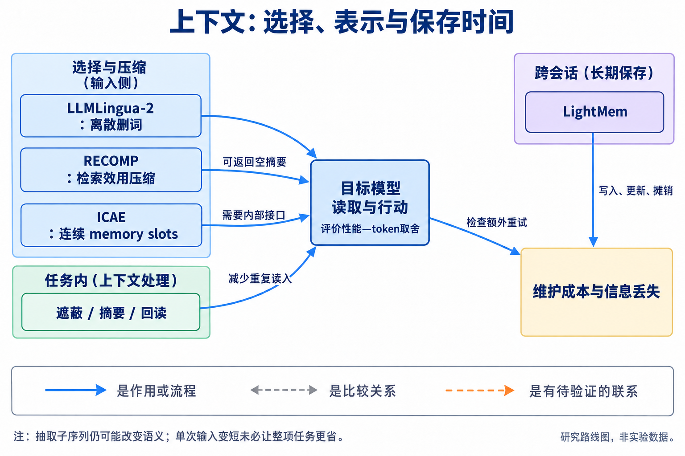
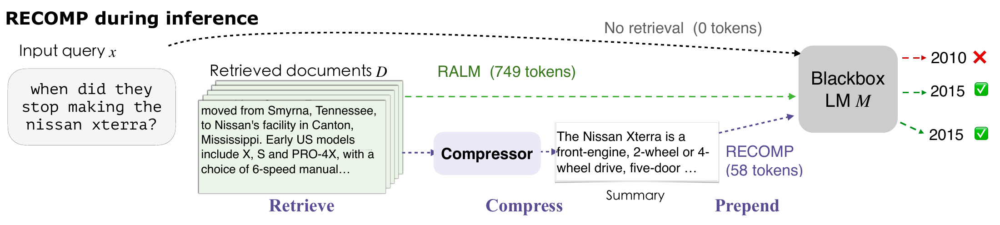
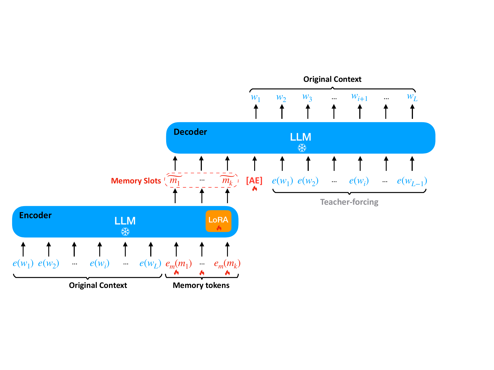
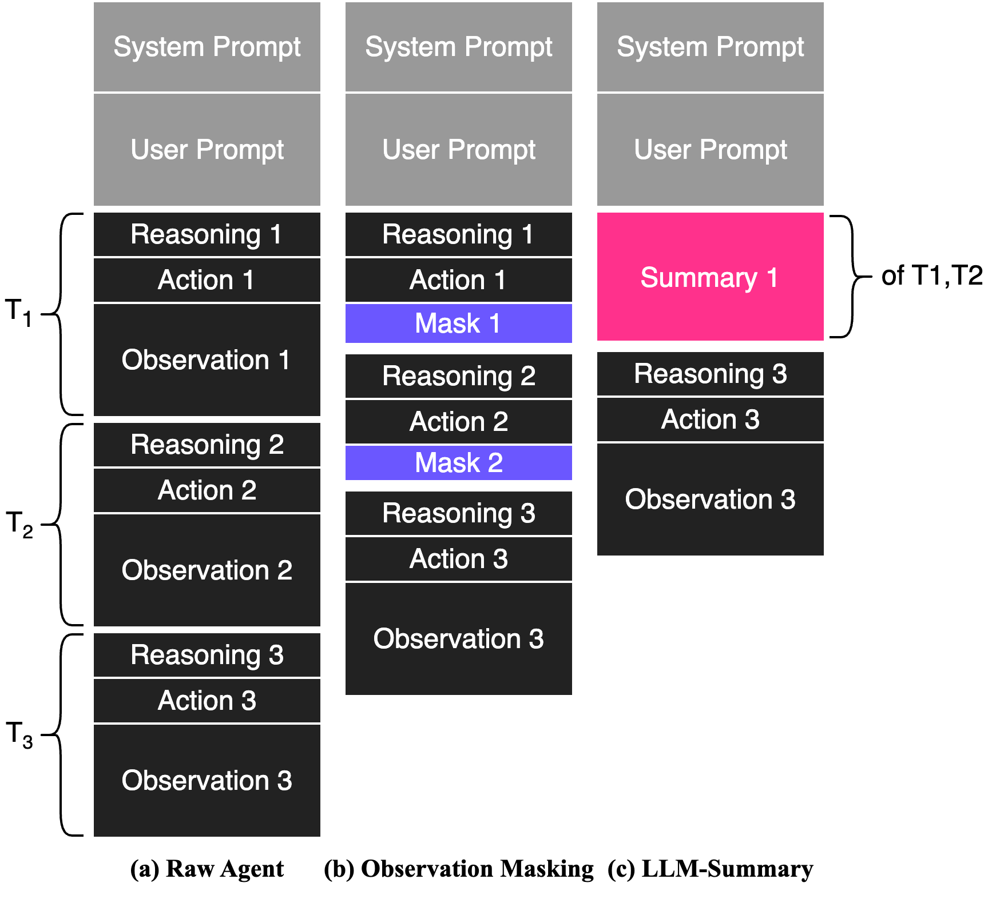
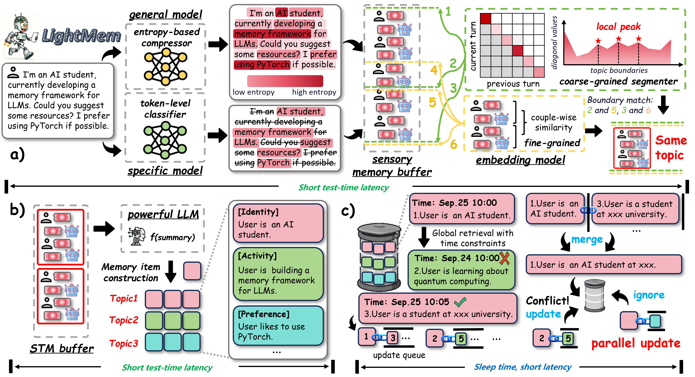

# 07 Prompt、检索、上下文与记忆：减少读入，同时保留可用信息

[上一章：推理与验证](../06-reasoning/index.md) · [总论](../../00-overview.md) · [下一章：智能体](../08-agents/index.md)

长任务的成本不仅来自模型写了多少，也来自同一段历史被反复读了多少。本章把本次输入选择、连续表示压缩、任务内状态维护和跨会话记忆分开讨论。一个输入变短的系统仍可能因为遗漏信息而多搜索、多重试，因此必须把压缩器和后续行为一起测量。

## 本章地图：选择什么、怎样表示、保存多久



本图由主代理综合正文关系后使用 GPT-Image 生成；连线表示文中说明的流程、比较或待验证联系，不表示统一性能排名。

| 路线 | 代表方法 | 与其他路线的区别 |
|---|---|---|
| 离散输入压缩 | LLMLingua→LongLLMLingua→LLMLingua-2 | 从困惑度删词、问题相关选择，发展到监督重要性分类 |
| 检索结果的效用压缩 | RECOMP | 用下游模型效用训练抽取或生成压缩，必要时不给额外信息 |
| 连续上下文表示 | ICAE、AutoCompressors | 输出可注入模型内部的向量，不是普通 API 可直接读取的短文本 |
| 任务内历史管理 | Observation masking、摘要、回读与折叠 | 改变旧观察被重复读入的方式；不等同跨会话记忆 |
| 跨会话记忆 | LightMem、MemGPT 类系统 | 决定写入、合并、更新与检索的时机，写入成本需要摊销 |

Prompt 优化还可以改变模型的检索与写作行为，DSPy/GEPA 等提供自动优化入口；其离线搜索属于开发账，部署时使用的长提示和额外模块仍计成本。[相关来源](../../../sources/context-agents-map.md)

## LLMLingua-2：将保留信息学习成分类问题

LLMLingua-2 用 GPT-4 构造抽取式压缩样本，再把原文与压缩结果对齐成保留/删除标签，训练较小的双向 encoder。它区别于依据因果语言模型困惑度逐步删除的方案：分类器显式学习教师提供的保留目标，并能同时利用左右文。[ACL正式论文 §3](https://aclanthology.org/2024.findings-acl.57/)

数据构造不能跳过。教师可能改写或重排，作者使用约束提示、分块、局部对齐及过滤。数据统计中的5,169个样本与41,746个分块是不同单位，512-token的单块上限不能与整条样本平均长度混为一谈。Variation Rate 检查压缩结果出现原文外词的比例，Alignment Gap 检查匹配与命中之间的差异；它们减少标签错误，但不构成语义无损证明。

设输入位置表示为 $`h_i`$，二分类头给出保留概率：

```math
p_i=\operatorname{softmax}(Wh_i+b)_{\mathrm{preserve}},\qquad
\mathcal L=-\frac1N\sum_{i=1}^{N}
[y_i\log p_i+(1-y_i)\log(1-p_i)].
```

这里 $`N>0`$ 为有效训练位置，$`y_i`$ 是对齐标签，概率须处于对数有定义的范围。实际系统还要把同一词的子词评分聚合，避免只留下半个词。预算控制根据保留概率选择词，再恢复原始顺序。

```python
# 教学用词级选择；真实模型先计算并聚合子词概率。
words = ["付款", "尚未", "完成", "请", "核实"]
scores = [0.8, 0.95, 0.9, 0.1, 0.7]
chosen = sorted(sorted(range(len(words)), key=lambda i: scores[i], reverse=True)[:3])
compressed = " ".join(words[i] for i in chosen)  # 付款 尚未 完成
```

这个例子显示预算选择和原序恢复是两步。若删掉“尚未”，压缩器没有新增任何词，却改变了语义；因此原文子序列这一结构性质，不能替代事实与下游任务检查。


[查看原图，可放大](../../../assets/papers-v3/src-7cc3fedc37b4/figure-1.pdf) · [论文来源](https://aclanthology.org/2024.findings-acl.57.pdf)

作者框架图中的教师只参与训练数据构造，部署用小分类器；目标LLM读取压缩后的文本。分类器的输入处理和训练成本仍然存在。

MeetingBank 的指定 GPT-3.5 设置中，约3,003到970个输入 token 对应 QA 分数87.75到86.92；Mistral设置则有压缩后分数提高的现象。LongBench、ZeroSCROLLS、GSM8K和BBH的主实验包含较高压缩下的退化，任务相关的 LongLLMLingua 在若干长文配置更强。论文还分别报告压缩器和端到端时延，不能把两种加速倍数混写。[精读](reference/src-7cc3fedc37b4.md)

## RECOMP：检索到的信息不一定都值得交给生成模型

RECOMP 位于检索器与生成模型之间。抽取式压缩器选择有用的句子，生成式压缩器将多个检索文档压为较短文本；训练信号来自它们对下游模型的帮助，而不只是与查询的表面相似度。[原论文](https://arxiv.org/abs/2310.04408v1)

用一个说明性评分表达这种区别：给定问题或前缀 $`x`$、目标后续 $`y`$ 和候选信息 $`c`$，可比较

```math
U(c)=\sum_t\log p_{\mathrm{LM}}(y_t\mid x,c,y_{<t}).
```

这是用真实目标后续评价候选信息的训练视角，部署时并不知道 $`y`$。它能帮助构造正负样本或摘要监督，但不能把这种训练评分当作线上可免费取得的oracle。

例如查询要知道某事件年份，检索返回许多相近主题的段落；只有一句给出所需年份，其余句子可能提高相似度却无助于答案。抽取器可以保留这句，生成器可以组合多条必要证据。若检索内容没有提供帮助，选择性增强允许输出空摘要，避免强行加入无关信息。



[查看原图，可放大](../../../assets/papers-v3/2310.04408/figure-1-recomp-pipeline.pdf) · [论文来源](https://arxiv.org/src/2310.04408v1)

图中检索、压缩和最终生成是独立阶段。判断节省要计入摘要器的调用，并检查漏掉证据后的重检索。原文的语言建模、QA和跨模型转移实验支持选择性压缩，压缩器自身延迟和完整任务成本仍有测量缺口。[精读](reference/2310.04408.md)

## ICAE：压缩成连续向量，需要模型内部接口

ICAE 在上下文后附加可学习的 memory tokens，通过目标LLM的LoRA编码版本得到若干隐藏向量。之后将这些向量作为固定目标LLM的输入前缀，接上新问题并生成答案。编码端有适配参数，解码端保持目标模型权重不变。[原论文](https://arxiv.org/abs/2307.06945v4)

设上下文为 $`c`$，编码器产生 $`z_\phi(c)`$，冻结解码器参数为 $`\theta_0`$。两类目标可以用负对数似然解释：

```math
\mathcal L_{\mathrm{AE}}=-\sum_i\log p_{\theta_0}(c_i\mid z_\phi(c),c_{<i}),\qquad
\mathcal L_{\mathrm{LM}}=-\sum_t\log p_{\theta_0}(y_t\mid z_\phi(c),y_{<t}).
```

第一项重建上下文，第二项预测上下文之后的文本；后续指令训练再让memory适配问答。解码器权重冻结，并不阻断损失对输入向量和编码器的梯度。



[查看原图，可放大](../../../assets/papers-v3/2307.06945/fig-ae-learning.pdf) · [论文来源](https://arxiv.org/abs/2307.06945v4)

作者图中长上下文只进入编码器，memory slots进入解码器。向量不是自然语言摘要，也不能通过普通文本API把同一串向量直接交给另一个模型。因此白盒接口、编码计算及跨模型兼容性都是方法的适用条件。

教学流程是“编码一次文档→保存slots→对多个问题重复使用”；若每次问题都迫使重新编码，成本收益就不同。原文的重建、困惑度、问答、压缩率和多片段分析说明容量取舍，不能把重建样例当作任意信息严格无损。[精读](reference/2307.06945.md)

## 任务内历史：摘要需要击败简单遮蔽

Observation masking 将较旧、较长的工具观察替换为简短占位，保留近期观察以及所需的行动/推理记录。它不生成新的摘要，因此没有摘要LLM的调用成本；代价是旧细节不再直接可见。摘要则用额外模型调用形成可读状态，可能保留更多关系，也可能遗漏细节或改变后续决策。

```text
old observation: 很长的测试输出或文件内容
masking:        [旧观察已省略]
summary:        保留任务目标、已确认事实、失败原因与下一步所需状态
```

The Complexity Trap 在软件智能体上对照这些策略，发现简单遮蔽可以具有很强的成本—成功率竞争力；摘要有时延长轨迹，使单次输入变短的节省被更多交互抵消。结果依模型模式、Agent框架与配置变化，不能写成摘要在所有环境都更差。[原论文](https://arxiv.org/abs/2508.21433)



[查看原图，可放大](../../../assets/papers-v3/2508.21433/figure3_management_strategies.png) · [论文来源](https://arxiv.org/abs/2508.21433v3)

图中的窗口与历史压缩操作决定哪些文本被下一轮重新读入。应比较全任务成功率、轮数、输入/输出、摘要调用，以及必要时的回读。ReadAgent/AgentFold一类系统进一步保留可回读或分层折叠的结构，为遮蔽与摘要之间增加恢复能力，但也增加管理开销。[精读与反例](reference/2508.21433.md)

## 跨会话记忆：写入与更新成本要能摊销

LightMem 将感知、短期和长期记忆分开：先筛选/压缩输入，按主题组织内容，再累积并更新长期记忆，将部分维护放到非实时阶段。它改变了频繁调用LLM做记忆更新的模式，不等于免费获得一个准确的知识库。[原论文](https://arxiv.org/abs/2510.18866)



[查看原图，可放大](../../../assets/papers-v3/2510.18866/figure2-architecture.png) · [论文来源](https://arxiv.org/abs/2510.18866v4)

作者图中在线写入与sleep-time更新属于不同路径。长期事实变化、相互冲突的旧记忆及主题分割错误，会影响以后检索到的内容；离线更新也应分摊回服务的任务。

以文本摘要系统为教学模型，假定同一tokenizer、同等质量和固定后续输出长度。一份文档原长 $`I`$、摘要长 $`M`$，生成/维护摘要用量为 $`K`$，重复使用 $`R`$ 次，则仅由这部分得到的净节省为：

```math
\Delta C=R(I-M)-K.
```

只有 $`\Delta C>0`$ 才在这组假设下回本。若压缩使回答变长、增加检索或重试，就要把这些变化加入；连续编码器的内部计算也不能随意换成同单位的 $`K`$。LightMem的LongMemEval/LoCoMo实验及更新消融应据各自数据和成本设置阅读。[精读](reference/2510.18866.md)

## 认识、争议与行动入口

输入中存在可压缩冗余有多条研究路线支持，但压缩器、信息丢失和行为变化决定净收益。较稳定的比较方法是同时看信息是否保留、同一段内容读了多少次、维护成本怎样摊销；仍有争议的是如何在新领域可靠判断重要性、怎样更新错误记忆，以及连续压缩是否值得额外接口和训练投入。

小团队可从遮蔽、任务相关抽取和简单摘要三种低成本基线开始，再考虑训练压缩器或复杂记忆。固定Agent与任务，不只比较prompt长度，还比较成功率、总轮数、全部模型调用和证据遗漏。如果收益只在重复使用次数很高时成立，或以更多失败换取短输入，应把条件明确写进结论。研究机会应与LLMLingua-2、RECOMP、ICAE及强遮蔽基线逐一对齐。
