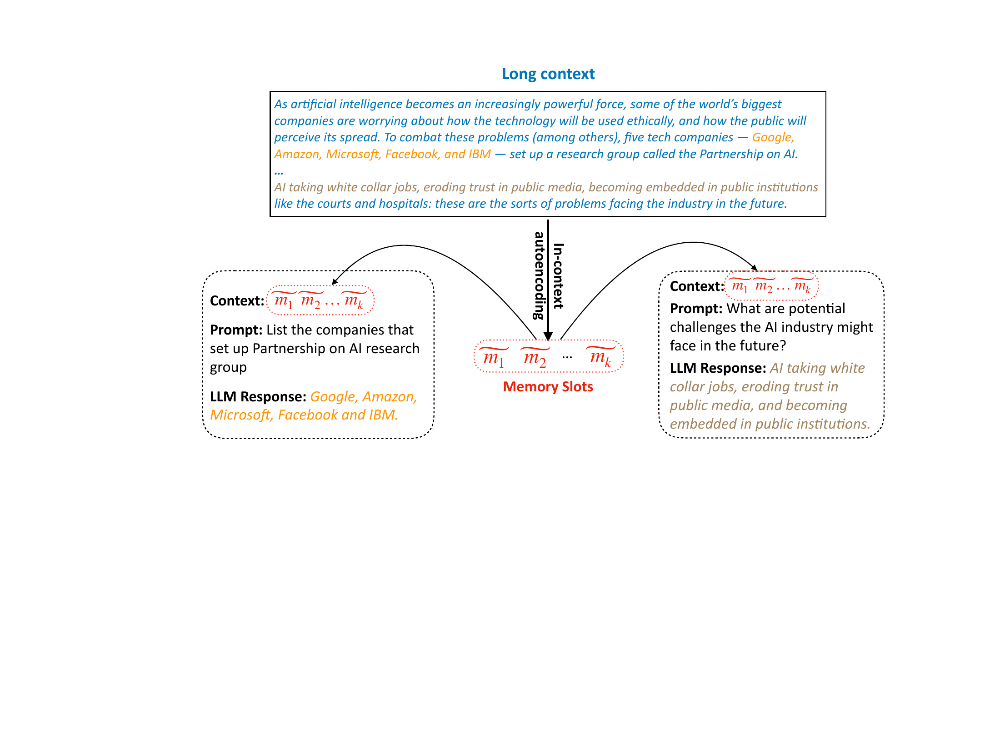
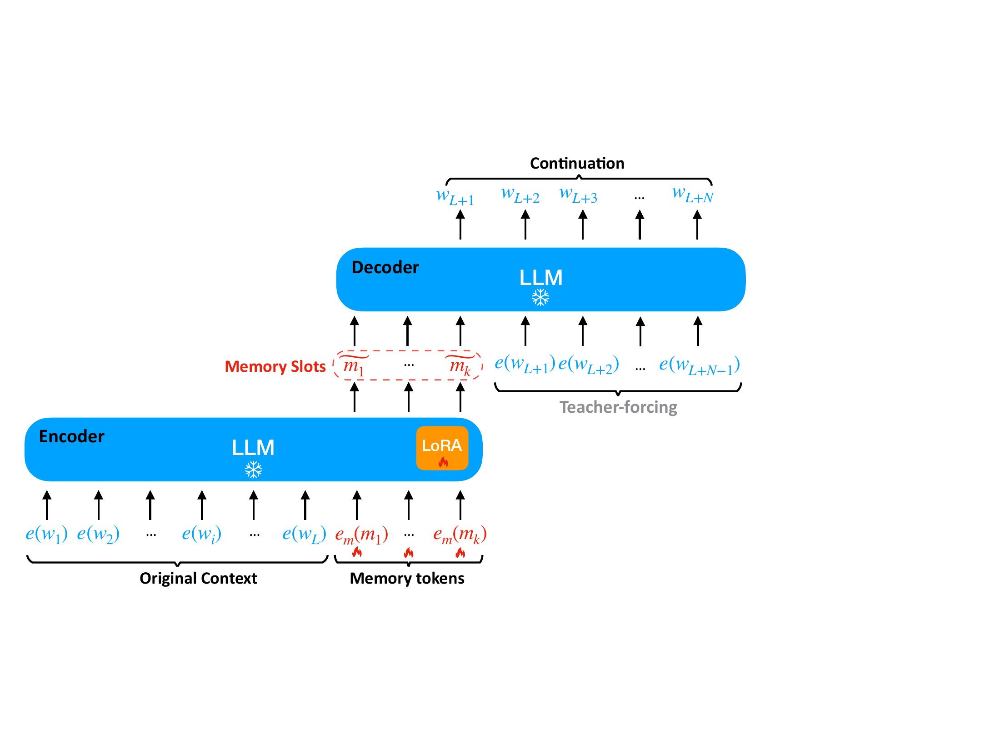
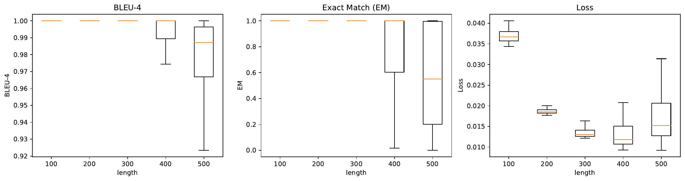
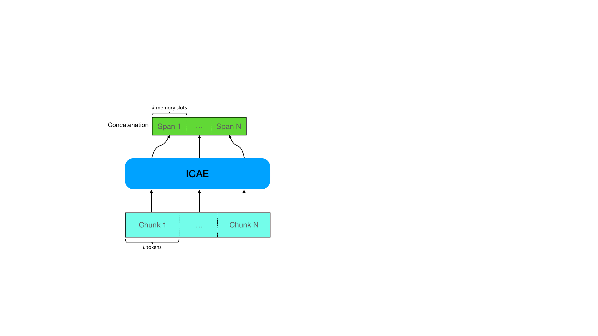
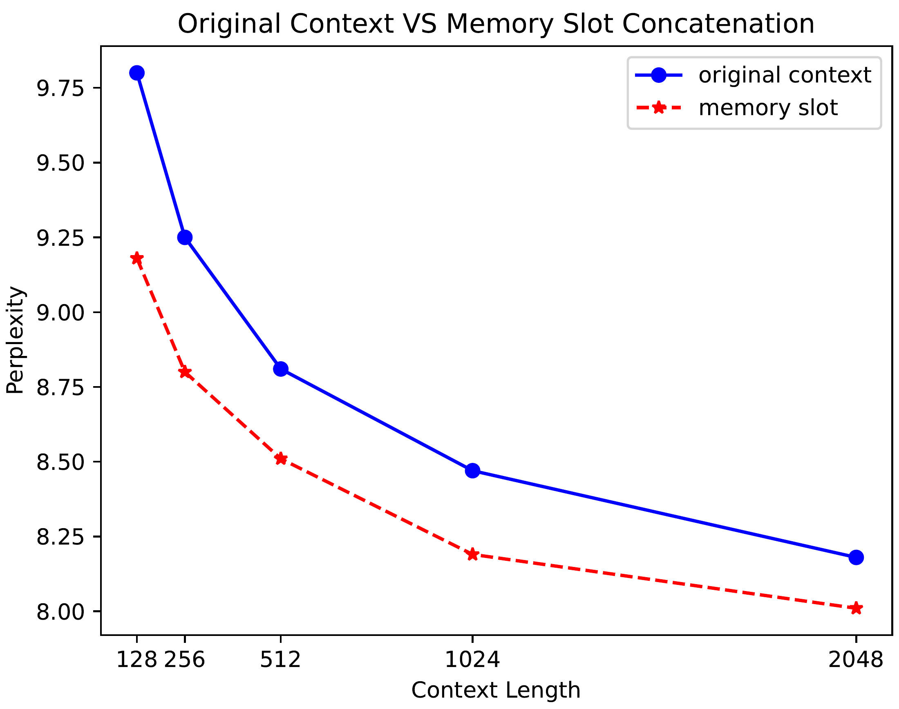

# In-context Autoencoder for Context Compression in a Large Language Model：正文级中文精读

[所属章节](../index.md) · [来源与阅读状态](../../../../sources/papers.json)


**作者**：Tao Ge、Jing Hu、Lei Wang、Xun Wang、Si-Qing Chen、Furu Wei（Microsoft） <br>
**年份与版本**：ICLR 2024；arXiv:2307.06945v4，2024-05-08 版本 <br>
**原始链接**：[arXiv 页面（v4）](https://arxiv.org/abs/2307.06945v4)，[作者代码与模型仓库](https://github.com/getao/icae) <br>
**实际阅读范围**：固定缓存的 `paper.pdf`、`paper.txt` 与 `icae_iclr24.tex`；正文第 1–9 页全部阅读，附录 A（训练图和超参数）、B（延迟配置）、C（PwC 数据集）、D（GPT-4 评价与输出示例）为解释正文实验所需的补读。图资产从固定版本 `latex-source.tar` 提取至本任务 `assets/figures/`。参考文献只用于辨认作者在正文中指向的前作，未对新发现论文另行精读。

## 1. 论文要解决什么问题

Transformer 语言模型的自注意力让更长的输入同时带来计算量和 KV-cache/显存压力。已有 Longformer、Compressive Transformer、Recurrent Memory Transformer、LongNet 等路线主要改动模型架构；作者指出，即使复杂度下降，长上下文仍可能出现明显的理解或“丢失中间信息”退化。因此论文把问题改写为：能否先把一段长文本变成更短的、仍可直接被原 LLM 使用的连续表示，然后让 LLM 像读取普通上下文一样使用它？

ICAE（In-context Autoencoder）的核心是把一个长度为 $L$ 的上下文变成 $k$ 个连续 memory slots（默认 $k=128$，典型 $L=512$），再把这 $k$ 个向量作为目标 LLM 的前缀来回答提示。它不是生成可读摘要，而是学习到目标 LLM 隐空间中的 soft context。作者报告：在 Llama 上增加约 1% 可学习参数，默认设置可以做到 $4\times$ 压缩，并降低部署时的解码长度和显存占用。




图 1 的关键不是“先总结再问答”，而是两阶段接口：长 context 只在编码阶段出现；问答阶段把 memory slots 当作 context，目标 LLM 继续接收 prompt 并生成 response。作者的长处主张是 memory slots 仍能被未改造的目标 LLM 条件化；其代价是编码器的训练和每个新上下文的压缩计算要另行支付。

## 2. ICAE 的对象、接口和参数共享

设原始上下文为

```math
\boldsymbol c=(w_1,w_2,\ldots,w_L),
```

其中 $w_i$ 是目标 LLM 词表中的 token。编码器先查普通词嵌入 $e(w_i)$，再在上下文末尾追加 $k$ 个特殊 memory tokens $(m_1,\ldots,m_k)$。这些 token 不代表要输出的自然语言词，而是通过一个单独的可学习 embedding lookup $e_m(m_j)$ 注入序列。带 LoRA 的 LLM 处理完整序列后，最后 $k$ 个位置的隐藏状态

```math
\widetilde m_1,\ldots,\widetilde m_k
```

就是这段 context 的 memory slots。因为 $k\ll L$，它们构成压缩表示。

编码器与解码器的关系是本方法的关键设计：编码器是“目标 LLM 的 LoRA 适配版本”，LoRA 只加在多头注意力的 query 和 value 投影上；解码器是保持不变的目标 LLM 本身。也就是说，基础 Transformer 权重来自同一个目标 LLM，解码器权重冻结，训练时只更新 $\Theta_{LoRA}$ 和 memory-token embedding $e_m$。论文没有把两个模块描述成两个独立的大模型副本，也没有把 LoRA 参数加到解码器上；所谓“共享”应理解为编码端以目标 LLM 为基座、输出与该 LLM 兼容的连续隐藏状态，部署时解码端仍用未经 LoRA 改写的目标 LLM。

这个接口是“白盒”的：memory slots 不是目标 LLM 词表中的离散 token，也不能直接用普通 tokenizer 还原。它们是编码器最后若干位置的 hidden vectors，直接作为解码器输入 embedding 序列的前缀。解码器知道它们是连续向量，但不需要增加新的 attention 算子或改变 forward pass；`[AE]` 只是训练 autoencoding 任务的控制 token。论文正文没有给出 memory vector 的量化、序列化或跨模型传输方案，因此不能把 ICAE 的 memory 当作自然语言摘要或可独立读取的文件格式。


图 3（原始 LaTeX 标签 `fig:icae_ae`）把数据流画得很清楚：编码器输入是 $e(w_1),\ldots,e(w_L),e_m(m_1),\ldots,e_m(m_k)$；输出的 $\widetilde m_j$ 被接到解码器前缀，随后是 `[AE]` 与 teacher-forcing 的原文 embedding $e(w_1),\ldots,e(w_{L-1})$。因此 AE 的训练信号来自解码器预测原文下一个 token，但反向更新只需要穿过固定解码器回到 LoRA 与 $e_m$。解码器在推理时可以把相同的 slots 接到一个新 prompt 后面。

可以用下面的教学伪代码跟踪一次编码与使用（伪代码只表达接口，不是作者代码的逐行实现）：

```text
slots = Encoder_LLM_LoRA(context_tokens + memory_token_ids)[last_k_hidden_states]
if task == "AE":
    Decoder_LLM(prefix=slots + [AE], teacher_forcing=context_tokens)
elif task == "continuation":
    Decoder_LLM(prefix=slots, teacher_forcing=continuation_tokens)
else:
    Decoder_LLM(prefix=slots + prompt_tokens, generate=response_tokens)
```

## 3. 训练目标：重建、语言模型和 instruction tuning

### 3.1 Autoencoding 目标

预训练的第一个目标是从 slots 重建原上下文：

```math
\mathcal L_{\mathrm{AE}}
=\max_{\widetilde m_1,\ldots,\widetilde m_k}
P(\boldsymbol c\mid \widetilde m_1,\ldots,\widetilde m_k;\Theta_{LLM})
=\max_{\Theta_{LoRA},e_m}
P(\boldsymbol c\mid m_1\ldots m_k;\Theta_{LLM},\Theta_{LoRA},e_m).
```

第二个等式只是把“优化 memory slots”落实成可训练参数：目标 LLM $\Theta_{LLM}$ 固定，只优化 LoRA 和 memory embeddings。解码器前缀追加 `[AE]`，让同一个 LLM 区分“此时要逐 token 重建原文”的任务。因为不需要人工标注，作者可以在 The Pile 上做大规模自监督预训练。

### 3.2 Text continuation 目标

只做逐字重建可能让压缩器过度适应一个单一任务，于是作者从原上下文之后取一段 continuation $\boldsymbol o=(w_{L+1},\ldots,w_{L+N})$，让解码器在 slots 条件下预测后续 token：

```math
\mathcal L_{\mathrm{LM}}
=\max_{\widetilde m_1,\ldots,\widetilde m_k}
P(\boldsymbol o\mid \widetilde m_1,\ldots,\widetilde m_k;\Theta_{LLM})
=\max_{\Theta_{LoRA},e_m}
P(\boldsymbol o\mid m_1\ldots m_k;\Theta_{LLM},\Theta_{LoRA},e_m).
```

预训练组合为 $\mathcal L_{\mathrm{pretrain}}=\lambda\mathcal L_{\mathrm{AE}}+(1-\lambda)\mathcal L_{\mathrm{LM}}$；正文脚注报告 $\lambda=0.4\sim0.6$ 最好，但没有给出完整的逐 $\lambda$ 曲线。AE 偏向保留可逐 token 恢复的细节，LM 迫使 slots 保留对后续语言有用的语义/结构信息；这是由目标定义可以推出的功能分工，论文并没有把它证明成严格的互补分解。



附录图 7（原始标签 `fig:icae_lm`）展示 continuation 版本：context 只进入编码器，slots 进入解码器，然后解码器预测 context 后面的 token。该目标测的是压缩后继续建模能力，不是“把输入完全还原”能力，所以作者用 PPL 与原 context 直接条件化的 PPL 做比较。

### 3.3 Instruction fine-tuning

预训练只保证“记住”或“续写”，不保证 slots 能和各种用户 prompt 组合。作者因此构造 Prompt-with-Context（PwC）数据集，每个样本是 $(\text{text},\text{prompt},\text{answer})$。对每个从 The Pile 抽取的文本，GPT-4 生成 10 个与文本具体相关的 prompt（前 5 个偏 instruction、后 5 个偏 question）以及 5 个通用 prompt（重述、摘要、标题、关键词、续写），再给出答案。最终训练集 240k、测试集 18k；测试样本大多超过 500 tokens。这个数据集由 GPT-4 生成，并非人工逐项标注。

指令微调只更新同一组 $\Theta_{LoRA},e_m$，目标变为在 slots 和 prompt 条件下生成 response：

```math
\mathcal L_{\mathrm{FT}}
=\max_{\widetilde m_1,\ldots,\widetilde m_k}
P(r_1\ldots r_n\mid \widetilde m_1\ldots\widetilde m_k,p_1\ldots p_m;\Theta_{LLM})
=\max_{\Theta_{LoRA},e_m}
P(r_1\ldots r_n\mid m_1\ldots m_k,p_1\ldots p_m;\Theta_{LLM},\Theta_{LoRA},e_m).
```

因此，预训练和 instruction tuning 的差别在于解码器的监督位置：前者要求 memory 表示原文或原文后的 continuation；后者要求 memory 支撑一个 prompt 下的目标回答。附录图 8（`fig:icae_ft`）把 slots、prompt、response 三段画成训练序列。

## 4. 实验设置与指标

作者以 Llama 为目标 LLM，默认 $L\le512$（不计 memory slots），$k=128$，LoRA rank $r=128$，LoRA 作用于 attention 的 query/value 投影；最终增加约 1% 可学习参数。预训练使用 The Pile，指令微调使用 PwC。训练在 8 张 80GB A100 上进行，bf16；AdamW，预训练学习率 $10^{-4}$、微调 $5\times10^{-5}$，batch size 256，warmup 300，更新次数分别 200k/30k，gradient clip norm 2.0（附录表 8）。

预训练 ICAE 的重建用 BLEU-4、EM 和 cross-entropy loss。EM 不是整句 exact match，而是“从开头连续正确的 prefix 长度 / 总长度”：512-token 样本若前 256 个 token 完全正确、257 个错误，EM 就是 $256/512=0.5$。续写用 PPL；instruction 结果使用 GPT-4 pairwise judge，输出 win/lose/tie，并报告 win+tie（on par）。评测时随机交换两个回答顺序以减轻位置偏差。作者还提醒 GPT-4 judge 偏好更长回答，而 ICAE 因 PwC 微调往往回答较短，所以该评价可能低估 ICAE；这不是独立人工评测。

## 5. 主实验结果

### 5.1 预训练 ICAE 的重建能力

在 Llama-7b、$k=128$ 的图 4（LaTeX `fig:ae_result_main`）中，横轴是原始 context 长度的分箱中心，例如 100 表示 95–105 tokens。长度不超过 300 时，BLEU 和 EM 都接近 100%，loss 低于 0.05；长度超过 400 后，128 个 slots 的容量开始不足。到长度约 500 时，BLEU 中位数仍超过 0.98，而 EM 中位数接近 0.6，也就是前缀约 300 tokens 可以连续恢复，但后续可能开始出错。BLEU 高而 EM 明显下降，说明大量词仍与参考文本相似，但第一个错误会截断 EM 的连续前缀；两者不能混用作“整段无损恢复”。



图 5（`fig:bleu_loss_length`）把 $k=32,64,128$ 放在同一坐标下。$k$ 越小，长样本的 BLEU 越快下降、loss 越快上升；$k=128$ 在长度 500 仍可超过 95% BLEU，而 $k=64$ 和 $k=32$ 难以无损保留原文。作者由此认为超过 $4\times$ 压缩很难，但这是在 Llama-7b、512-token 训练长度与该数据分布下的观察，并不是信息论上限。

续写表 1 给出相同 $k=128$ 下的压缩比比较：

| 原 context → memory | 原 context PPL | memory PPL | 增量 |
|---|---:|---:|---:|
| 128→128（1×） | 9.99 | 10.15 | +0.16 |
| 256→128（2×） | 9.45 | 9.77 | +0.32 |
| 512→128（4×） | 9.01 | 9.50 | +0.49 |

压缩比越高，续写 PPL 增量越大。这个实验只测预测 context 之后文本的语言建模损失，不等价于问答质量或事实保真度。

### 5.2 记忆内容的结构依赖

表 2 的单例显示，模型会做类似“按语义理解后的记忆”：原句 `large pretrained language models` 被恢复成 `large pretrained models`，`The results prove` 被恢复成 `The experimental evidence proves`。作者把这解释为 LLM 选择性保留和改写信息，类比人类记忆；更稳妥的读法是，AE 目标允许模型用其语言先验生成高概率近似，而不是强制逐 token 复制。

表 3 固定 512-token 输入和 128 slots，比较内容类型：正常文本 loss 0.01、BLEU 99.3；把正常文本的 token id 每个加 1 得到 patterned random text，loss 1.63、BLEU 3.5；完全随机文本 loss 4.55、BLEU 0.2。说明压缩能力高度依赖输入是否符合模型学到的语言分布。作者据此提出“LLM 的记忆模式像人类”的解释，但这仍是类比性归因；实验直接证明的是随机/低先验内容显著更难编码。

### 5.3 PwC 指令任务：memory 与原文竞争

表 4 在约 512-token context 的 PwC 测试集上，用 GPT-4 比较“读取 memory slots 的 ICAE”与“读取原文的基线”。Llama-7b ICAE（$k=128$）相对 Alpaca 的 win/lose/tie 为 56.7/26.9/16.4%，on-par 73.1%；相对 StableLM-7b 为 74.1/18.8/7.2%，on-par 81.3%。但相对作为 gold 的 GPT-4，只有 3.4% win、69.4% lose、27.2% tie，on-par 30.6%，所以“优于开源基线”不代表接近 GPT-4。

换成 Llama-2-7b-chat 后，$k=64$、128、256 的 ICAE 相对同底座原文系统的 on-par 分别为 48.4%、54.6%、77.8%；相对 GPT-4 的 on-par 分别为 55.3%、74.2%、79.5%。Llama-2-13b-chat、$k=256$ 相对原文系统 on-par 79.2%，相对 GPT-4 为 80.8%。随 $k$ 增加，压缩变弱但质量接近原 context；更大的目标 LLM 也有更好的绝对表现。这里的“on-par”含 tie，不是准确率，也不说明每个任务都保持信息。

### 5.4 预训练、memory 长度和摘要基线消融

表 5 固定 Llama-2-7b-chat，做 GPT-4 pairwise 比较：

| 比较 | win | lose | tie | win/lose |
|---|---:|---:|---:|---:|
| $k=128$ 预训练 vs $k=64$ 预训练 | 57.6 | 19.5 | 22.9 | 3.0 |
| $k=64$ 预训练 vs $k=32$ 预训练 | 44.7 | 21.8 | 33.5 | 2.1 |
| $k=64$ 预训练 vs $k=128$ 无预训练 | 33.1 | 28.0 | 38.9 | 1.2 |
| $k=128$ 预训练 vs $k=128$ 无预训练 | 60.4 | 9.5 | 30.1 | 6.4 |
| $k=128$ 预训练 vs 仅 AE 预训练 | 36.4 | 28.5 | 35.1 | 1.3 |
| $k=128$ 预训练 vs 仅 LM 预训练 | 35.1 | 24.9 | 40.0 | 1.4 |
| $k=128$ 预训练 vs GPT-4 生成的 128-token 摘要 | 34.1 | 17.6 | 48.3 | 1.9 |

结果有三个层次。第一，$k=128$ 预训练胜过 $k=64$ 预训练，压缩率升高通常损失质量；但 $k=64$ 预训练可与 $k=128$ 无预训练相当，说明“压缩率”与“压缩器质量”是两个变量。第二，在同一 $k$ 下，联合预训练明显胜过无预训练；只做 AE 或只做 LM 也弱于 AE+LM。第三，128 个 soft slots 与 GPT-4 约 100 词的自然语言摘要进行同长度比较，win/lose 约 1.9，表明连续 memory 在该评测下比可读摘要保留更多任务相关信息。此处比较的摘要由 GPT-4 生成，且“长度相同”是 token 长度，不是相同计算成本。

附录表 9 给出预训练/非预训练的错误例：问题问法国公务员 Quennedey 可能面临的刑期，预训练 ICAE 回答 30 年，非预训练写成 3 年；另一例中预训练正确识别 Ranga Rangachari 是 Red Hat 的 Storage and Hyperconverged Infrastructure 副总裁，非预训练误称 CEO。它支持“预训练降低幻觉”的局部观察，但只有示例，不能代替表 5 的聚合评测。

### 5.5 规模、延迟与多段 memory

表 6 固定 512→128 的 $4\times$ 压缩比较目标 LLM：

| 目标 LLM | AE BLEU | AE loss | 原文续写 PPL | memory 续写 PPL | 增量 |
|---|---:|---:|---:|---:|---:|
| Llama-7b | 99.1 | 0.017 | 9.01 | 9.50 | +0.49 |
| Llama-2-7b | 99.5 | 0.009 | 8.81 | 9.18 | +0.37 |
| Llama-2-13b | 99.8 | 0.004 | 8.15 | 8.45 | +0.30 |

模型变强后，重建和续写损失都改善。作者将其视为可扩展性证据；实验范围只到 13B，不能外推到更大模型的确定压缩率。

延迟表 7 在一张 80GB A100、Llama-7b、生成长度 128 上测试，比较“原文直接生成”与“先 ICAE 压缩再生成”。批次×输入长度为 8×2048 时，直接 LLM 解码 24.0，ICAE 压缩 3.4（可缓存）+ 解码 3.9，总计 7.3，标注为 3.3×；8×512 时为 9.3 对 0.6+3.7=4.3（2.2×）；32×512 时为 24.3 对 2.6+4.2=6.8（3.6×）。单位是作者 profiling 的时间单位，正文没有标明毫秒。若 context 经常重复、slots 能预先缓存，部署路径只需付解码端的短前缀成本，作者据此估计可能超过 7×，但这是缓存情形的推断而非表中直接测得的总端到端结果。

这也给出 soft-context 的计算转移边界：编码阶段仍需跑一次长 $L$ 序列，所以对一次性、低复用的请求，压缩时间可能抵消收益；收益主要来自后续生成 token 多、batch 大，或同一 context 被多次复用。解码阶段 attention 的 KV 序列从 $L$ 缩到 $k$，但编码器自身仍是目标 LLM 规模的前向计算，且需要额外 LoRA 分支。论文测了总时间的三个 batch/长度点，却没有报告能覆盖复用次数、生成长度、不同硬件或并发度的完整成本前沿，也没有直接测训练成本。

[原始表格/补充示例](https://arxiv.org/abs/2307.06945)

多段 memory 的实验（图 6）把长 context 切成 $N$ 个 chunk，各自压缩后串接 slots。作者一开始发现直接拼接失败，因为训练没有见过“多个 slots span 连续出现”的模式；加入少量多段拼接样本训练后才可用。这说明 memory slot 的可组合性不是结构上自动保证的能力，而是依赖训练分布。图 6 右比较原文与 $4\times$ 压缩后的 memory：例如 4096-token 原文压成 1024 slots，2048 slots 在 PPL 上可与 4096-token context 大致相当。作者按 Llama-7b fp16、无 flash attention 的测量给出 2048 context 约 24GB、4096 context 约 44GB，认为用 2048 slots 可省约 20GB；这是该硬件/实现设置下的显存差，不是所有推理后端都相同。





## 6. 与前作的关系和接口边界

论文将 ICAE 与 GIST、AutoCompressors、prompt compression/context distillation 及 NUGGET 区分。GIST 也学习 soft gist tokens，但其 prompt 通常是短任务指令，且生成的 gist 需要在特别调过的模型中使用；ICAE 目标是较长 context，并强调 slots 可以喂给未修改的目标 LLM。AutoCompressors 递归压缩长文本，训练更复杂；ICAE 是一次 context→slots，必要时对多个 chunk 重复。与直接生成自然语言摘要的 LLMLingua 类方法相比，ICAE 输出不可读的连续向量，容量和接口不同。

这里的“可被未改造 LLM 使用”有一个精确边界：未改造的是解码器的模型权重和 forward 结构，不是说任意别的 LLM 都能理解这些 slots。slots 由特定目标 LLM 的隐藏空间、词嵌入和位置/层归纳偏置定义；换一个架构或 tokenizer，必须重新训练兼容的 encoder/adapter。论文只在 Llama、Llama-2 系列内验证，不报告跨模型直接迁移。

从计算角度，ICAE 把工作拆成“长上下文编码一次 + 短上下文多次解码”：

```text
长 context L  --(LoRA 编码器，仍需处理 L)-->  k 个连续 slots
                                      --(固定目标 LLM + prompt)--> response
```

因此它不是消灭长上下文计算，而是把长输入的成本前置并允许缓存；只有当后续解码、复用或显存受限的收益超过一次压缩成本时，token 效率才转化为端到端效率。论文直接测量的是 PPL、BLEU/EM、GPT-4 pairwise 和 profiling latency；没有测量原始输入 token 数减少后对数据传输、训练 token 预算、跨请求缓存命中率或能耗的影响。

## 7. 图像资产与许可

正文关键图均从作者提供的 LaTeX 源码包提取，未裁剪；对应 PDF 文件在本任务 `assets/figures/` 下。源包来自 [arXiv 2307.06945v4](https://arxiv.org/abs/2307.06945v4)，其声明的许可链接为 [arXiv nonexclusive-distrib/1.0](http://arxiv.org/licenses/nonexclusive-distrib/1.0/)。该许可允许在遵守其分发条件并保留归属的前提下复用；整合到公开报告前仍应保留作者、论文标题、arXiv 链接和许可说明。

| 图标记 | 原图编号/说明 | 本地文件 | 复用说明 |
|---|---|---|---|
| `fig-icae-usecase` | Fig. 1，长 context→memory→prompt/response | `assets/figures/icae_usecase.pdf` | 可在许可条件下复用，需署名 |
| `fig-char-word-memory` | Fig. 2，字符/词/token/memory 长度对比 | `assets/figures/char_word_memory.pdf` | 可在许可条件下复用，需署名 |
| `fig-ae-learning` | Fig. 3，LoRA encoder 与固定 decoder | `assets/figures/ae_learning.pdf` | 可在许可条件下复用，需署名 |
| `fig-ae-result-main` | Fig. 4，Llama-7b、$k=128$ 的 BLEU/EM/loss | `assets/figures/llama_mem128_ae_result.pdf` | 可在许可条件下复用，需署名 |
| `fig-bleu-loss-length` | Fig. 5，$k=32/64/128$ 敏感性 | `assets/figures/bleu_loss_length.pdf` | 可在许可条件下复用，需署名 |
| `fig-multiple-span` | Fig. 6，多段 slots 与 PPL/显存讨论 | `assets/figures/icae_concat_demo.pdf`, `assets/figures/multi_span_result.pdf` | 可在许可条件下复用，需署名 |
| `fig-lm-learning` | Fig. 7，continuation 预训练（附录） | `assets/figures/lm_learning.pdf` | 可在许可条件下复用，需署名 |
| `fig-icae-ft` | Fig. 8，instruction fine-tuning（附录） | `assets/figures/icae_ft.pdf` | 可在许可条件下复用，需署名 |
| `fig-pwc-samples` | Fig. 9，PwC 构造 | `assets/figures/PwC_samples.pdf` | 可在许可条件下复用，需署名 |
| `fig-test-lengths` | Fig. 10，测试 context 长度分布 | `assets/figures/test_lengths.pdf` | 可在许可条件下复用，需署名 |

## 8. 与推理时 token 效率的关系、局限和待核问题

ICAE 的 token 目标是让目标 LLM 的**解码上下文长度**从 $L$ 变成 $k$，同时尽量保持原文对 prompt 的可用信息。论文中被直接测量的比例主要是 512→128（$4\times$），以及多段场景中 4096→1024、4096→2048 等等价长度比较。它没有把训练输入 token、编码器 token、解码器 token、生成 token 和总系统 token 预算合并成一个指标；因此“$4\times$ context compression”不能直接写成端到端 token 消耗降低 $4\times$。编码器仍读完 $L$ 个 token，且低复用场景还要支付压缩延迟。

主要局限如下：

1. 实验只到 Llama-2-13b，作者自己也把更大模型的收益写成未来验证；不能把规模趋势当作已证实的无限扩展定律。
2. 训练最大 context 为 512，图 6 的多段长上下文依赖额外少量拼接样本；正文没有给出这些样本的数量、分布和完整训练细节，也没有在更多任务上检验跨 chunk 的顺序/指代保真度。
3. PwC 由 GPT-4 生成，主评测又由 GPT-4 判分；judge 偏好长回答，而 ICAE 输出较短，作者承认可能低估性能。没有人工盲评、任务分解准确率或事实性指标来替代该单一 judge。
4. EM 是连续正确前缀指标，BLEU 是 n-gram 相似度；二者不能证明整段无损复制。表 2 的语义近似示例也意味着重建可能改变否定、数字或专名，实际 RAG/法条使用需要专门的事实保真测试。
5. soft slots 依赖特定目标 LLM 的隐藏空间；“无需改动现有 LLM”只适用于作为 decoder 的同一模型族，不能推断成跨模型通用压缩格式。
6. 延迟表没有公开时间单位和完整硬件/软件优化对照，只给三个 batch×length 点；缓存收益是部署假设，未报告缓存命中率、更新策略和跨用户复用的工程成本。

对 token-efficient reasoning 的直接启示是：ICAE 更像可缓存的 working-memory 前端，而不是减少所有计算的 tokenizer。若上下文长期不变、后续需要多次推理，预先把文档编码成 slots 可把长前缀成本转移到一次离线/低频阶段；若每次 context 都不同且只生成很短回答，压缩器可能只是增加一道模型前向。评估它时应分开记录：原始 $L$、slots $k$、编码 FLOPs/延迟、解码 PPL/任务质量、生成长度、缓存命中率和总端到端 wall-clock。
