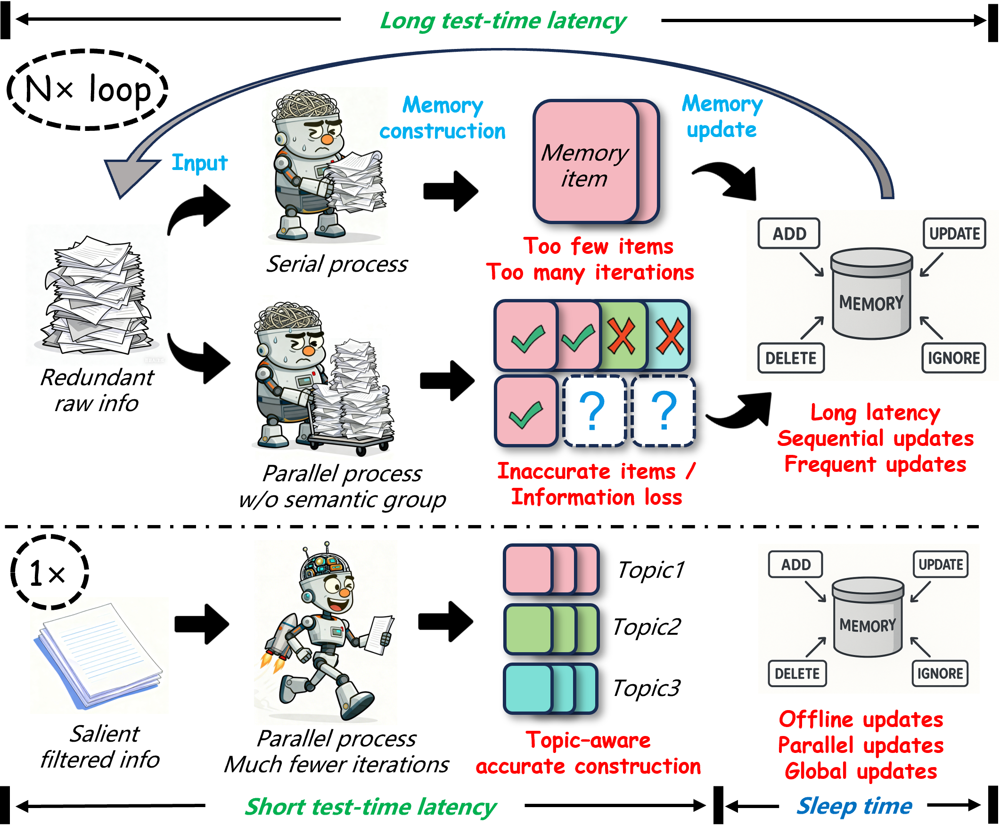
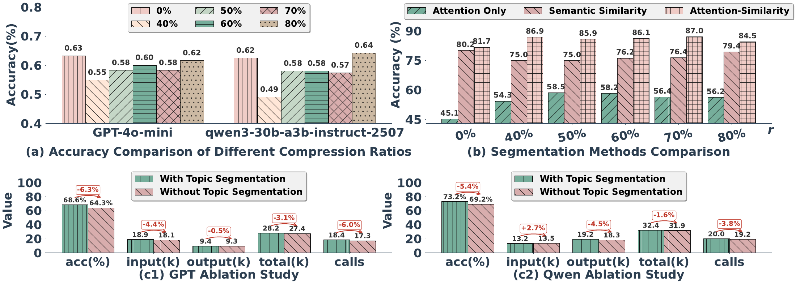
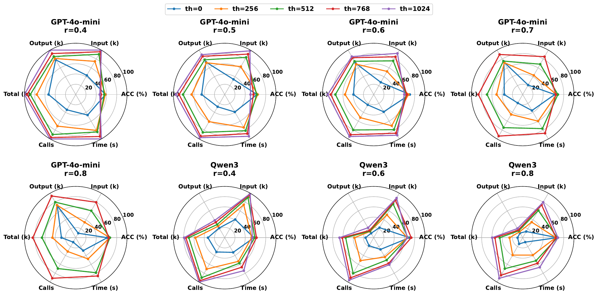
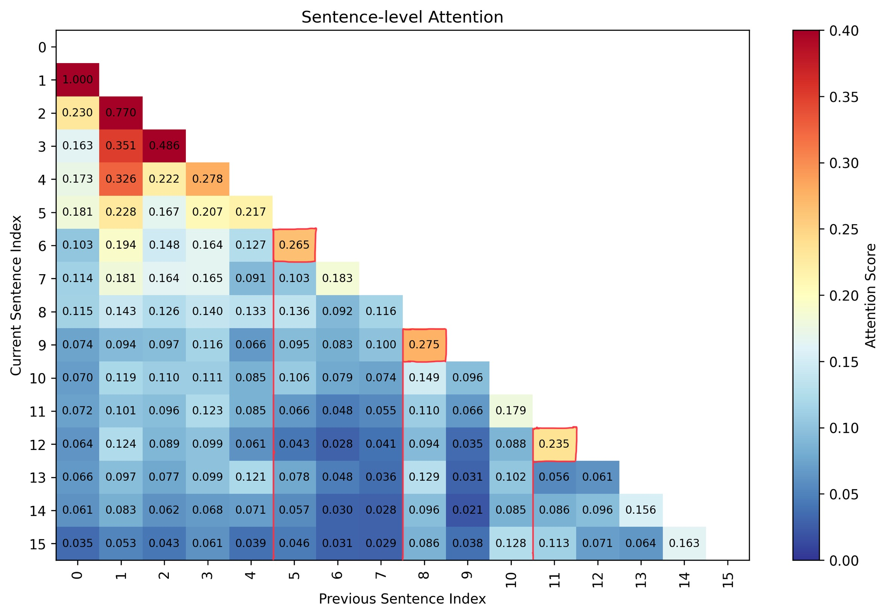
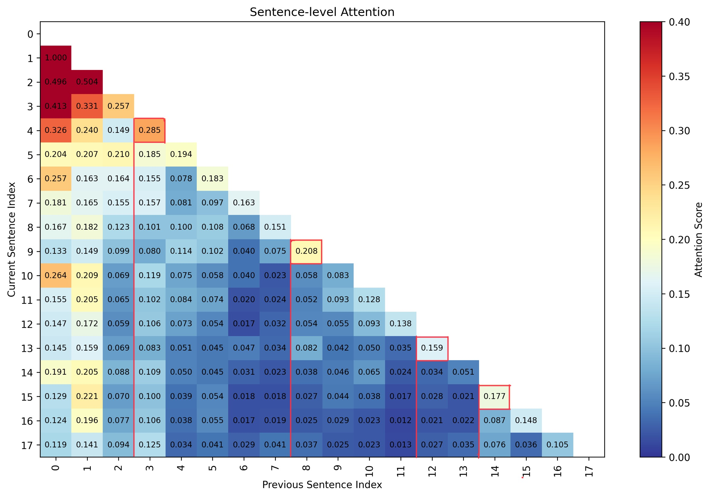
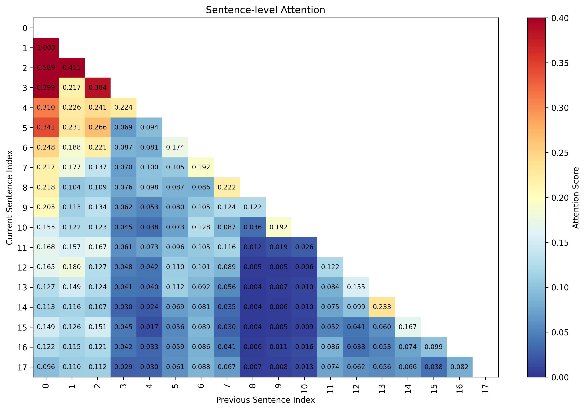

# LightMem: Lightweight and Efficient Memory-Augmented Generation

[所属章节](../index.md) · [来源与阅读状态](../../../../sources/papers.json)


- **作者**：Jizhan Fang、Xinle Deng、Haoming Xu、Ziyan Jiang、Yuqi Tang、Ziwen Xu、Shumin Deng、Yunzhi Yao、Mengru Wang、Shuofei Qiao、Huajun Chen、Ningyu Zhang
- **年份/版本**：2026，ICLR 2026 conference paper；固定版本为 arXiv `2510.18866v4`（2026-02-28）
- **原始链接**：[arXiv:2510.18866v4](https://arxiv.org/abs/2510.18866v4)，代码链接：[zjunlp/LightMem](https://github.com/zjunlp/LightMem)
- **实际阅读范围**：固定缓存 `source/paper.pdf`、`source/paper.txt`、完整 LaTeX 工程（正文 §1–§7，附录 A–E，含表 1–9、图 1–5、LLM-as-judge 提示词）；重点核对了方法公式、复杂度、主实验、类别结果、参数网格和主题分割实现。没有把二手博客或搜索摘要当作实验依据；没有运行作者代码。

## 1. 论文要解决什么问题

长对话记忆系统通常把每轮交互切分、总结、索引到向量库，再在新问题到来时检索并更新旧记忆。论文认为这种管线有三个瓶颈：原始用户输入和模型回答包含大量冗余，直接交给强 LLM 既浪费 token 又可能削弱上下文学习；以固定 turn/session 粒度构建记忆会混合主题或调用过于频繁；更新和遗忘若严格放在推理时，会把连续的 LLM 更新延迟叠加到每次交互上，而且更新操作可能把“相关但不冲突”的信息误删。

LightMem 借用 Atkinson–Shiffrin 的感知记忆、短期记忆（STM）和长期记忆（LTM）三段结构，但这里是工程类比，不是对人类记忆机制的认知实验验证。核心主张是：先用轻量压缩去掉冗余，再用主题边界组织 STM，在线阶段只做带时间戳的软写入，把昂贵的合并/删除/抽象延后到 sleep-time，并把彼此独立的更新队列并行执行。

论文把传统系统抽象为两大阶段。记忆库构建为

```math
D^{(g)}=f_{seg}(D;g),\quad E=f_{sum}(D^{(g)}),\quad M'=f_{update}(M,R;U),
```

其中 $`g`$ 可为 turn、session 或 topic，$`M`$ 是旧库，$`R`$ 是新记忆条目，$`U`$ 是更新/遗忘策略。使用阶段则是检索相关条目，把它们与问题拼成 prompt，再调用聊天模型。LightMem 主要改变构建阶段；公平比较时，检索、聊天和检索条目数保持相同，因此论文把构建阶段的总结/更新 token、API calls 和 runtime 作为主要成本。



**图 1（正文图 1，原始工程中 `figure/motivation.png`，本任务未复制为可复用资产）**把既有系统和 LightMem 的冗余输入、固定粒度和在线更新问题并列展示。读图重点是数据流位置：LightMem 的轻量压缩和主题切分发生在大模型总结之前，离线更新发生在在线交互之外，而不是把所有成本删除。

## 2. LightMem 的三层设计

### 2.1 感知记忆：压缩后再做主题切分

#### 2.1.1 Pre-compress

给定输入 token 序列 $`x=(x_1,ldots,x_m)`$，轻量模型 $`θ`$ 为每个 token 输出“保留/丢弃”二分类 logits。保留概率为

```math
P(\mathrm{retain}\ x_i\mid x;\theta)=\mathrm{softmax}(\ell_i)_1,
```

阈值设为保留分数的 $`r`$ 分位数：

```math
\hat{x}=\{x_i\in x\mid P(\mathrm{retain}\ x_i\mid x;\theta)>\tau\},\qquad
\tau=\mathrm{Percentile}(\{P(\mathrm{retain}\ x_j)\},r).
```

因此文中的 $`r`$ 是保留比例（例如 $`r=0.7`$ 目标上保留约 70% token），不是“压掉 70%”。实现使用 LLMLingua-2；论文也说明可替换为一般生成式 LLM，并给出基于 token 交叉熵/不确定性的过滤解释：条件熵较高、较不易从上下文预测的词可能更具信息独特性。这个解释是作者的设计动机，实际实验主线使用 LLMLingua-2。

压缩不是零成本：LongMemEval 中同一消息可能需要迭代压缩 $`x`$ 次；若压缩后句子为空则保留未压缩句子，若仍超过 LLMLingua-2 的 512-token 最大输入限制，则以 $`r=0.5`$ 继续压缩。论文把这个额外模型的时间计入 Runtime，报告其推理显存低于 2 GB，但没有把它换算成 backbone LLM 的 token/API 成本。

#### 2.1.2 Topic segmentation

压缩结果进入容量为 512 token（实验默认）的 sensory buffer。缓冲区满后，LightMem 同时用 LLMLingua-2 的注意力和 embedding 相似度找主题边界。对用户句子序列（只取 user sentence，理由是 assistant 回复通常跟随同一轮主题且可能过长），构造 turn-level 注意力矩阵 $`M\in\mathbb{R}^{n\times n}`$。对相邻句子的注意力序列找局部峰值：

```math
B_1=\{k\mid M_{k,k-1}>M_{k-1,k-2},\ M_{k,k-1}>M_{k+1,k},\ 1<k<n\}.
```

相邻句子的 embedding 相似度低于阈值 $`τ`$ 时得到

```math
B_2=\{k\mid \mathrm{sim}(s_{k-1},s_k)<\tau,\ 1\le k<n\},\qquad B=B_1\cap B_2.
```

这里 $`B_1`$ 是注意力候选，$`B_2`$ 是语义相似度过滤；最终只在两者交集切分。附录给出的实现细节是：把首尾三个 token 的贡献 mask 掉以减少 attention sink；取 LLMLingua-2 的第 8–11 层，先在 token 维平均成句间注意力，再跨层平均；对每个当前句子指向此前句子的分数归一化。句子被判为峰值时，切点在该句**之前**，所以峰值句是新主题的起点；残余片段带到下一个 buffer 继续处理。这种下标关系很容易误读成“在峰值句之后切”。


**图 2（正文图 2，资产 `assets/figure2-lightmem.png`）**是总架构图。箭头应按“raw turn → LLMLingua-2 预压缩 → sensory buffer → attention/similarity topic segmentation → STM → backbone summary/index → timestamped LTM → sleep-time queue/update”读；图中三层不是三个都由大模型串行调用，前两层包含轻量模型和 buffer，LTM 的复杂更新在离线触发。

### 2.2 主题感知 STM：把一组主题片段一次性总结

每个主题片段先形成 `{topic, message turns}`，其中 `message turns={user_i, model_i}`，再放入 STM buffer。累计 token 达到阈值 $`th`$ 时，才调用 backbone 总结每个结构：

```math
s_i=f_{sum}(S_i),\qquad S_i\subseteq\{user_i,model_i\},\quad S_i\ne\varnothing,
```

再形成长期库条目：

```math
\mathrm{Entry}_i=\{\mathrm{topic},\ e_i=\mathrm{embedding}(s_i),\ user_i,\ model_i\}.
```

也就是说，summary 供检索和紧凑语义表示，原始 user/model turns 仍随条目保存，便于保留完整语义。$`th`$ 越大，调用次数越少、每次总结输入越长；$`th`$ 太小则主题单元被过早送入总结，利用不足且延迟/调用数增加。主题约束的批量输入意图是在减少调用的同时避免把多个无关 session 粘成一个错误记忆，不等于任意增大窗口。

### 2.3 LTM：在线软写入，睡眠时合并

#### 在线写入与读取关系

新条目到达时，LightMem 不在用户请求路径上执行 add/delete/update/merge 的“硬更新”，而是直接插入 LTM，带上时间戳 $`t_i`$。这称为 soft update：新信息可立即被检索，当前 STM 也可提供短期上下文，在线延迟不等待复杂冲突判断。

在离线触发时，对每个条目 $`e_i`$ 计算候选更新队列：

```math
Q(e_i)=\mathrm{TopK}\left(\{(e_j,\mathrm{sim}(v_i,v_j))\mid t_j\ge t_i,\ j\ne i\};n\right),
```

其中 $`v_i`$ 是 embedding，候选必须是时间不早于 $`e_i`$ 的条目，保证“后来的信息更新较早的信息”。队列只是相似检索，不是已经发生的更新。所有队列建立后，每个队列对应独立的 $`f_{update}`$；作者据此并行执行合并、删除、修改或新增。这给出离线批处理的并行机会，但依然要支付检索、队列建立和每个更新 LLM 调用的成本。

一个具体例子是论文的 Tokyo/Kyoto 案例：周一 14:00 用户计划东京旅行，周一 16:00 用户询问京都列车。硬更新可能把记忆覆盖成“用户计划京都旅行”，丢掉东京上下文；soft update 先保留两条，离线更新可判断它们相关但不矛盾，选择合并或继续共存。这个例子说明的是避免不可逆在线误删的设计动机，不是对所有冲突都能正确解决的证明。

```text
for each incoming topic entry e:
    append e=(summary, raw turns, embedding, timestamp) to LTM
    # online path ends here; retrieve(e) can still read it
when offline trigger arrives:
    for each e_i in LTM:
        Q(e_i) = top-n cosine neighbors with t_j >= t_i
    in parallel for each queue:
        backbone f_update(old entry, later related entries)
        apply add/delete/update/merge according to the model output
```

上面伪代码把“教学化流程”和作者实现区分开：论文没有给出完整的并发锁、冲突优先级、删除判定或失败重试协议，不能把并行队列理解为已经形式化保证无竞态。

## 3. 复杂度和成本：节省来自哪些假设

令对话有 $`N`$ 轮，每轮平均 $`T`$ token；压缩执行 $`x`$ 次后保留 $`r^xT`$ token；STM 容量为 $`th`$；一次总结的输入模板和输出分别为 $`L_{sum-in},L_{sum-out}`$，更新调用分别为 $`L_{up-in},L_{up-out}`$；每次总结生成 $`M_1`$（基线）或 $`M_2`$（LightMem）条目，触发更新的比例为 $`R_1/R_2`$。论文表 1/附录表 6 给出：

```math
\begin{aligned}
\mathrm{Baseline\ summary\ tokens}&=N(L_{sum-in}+T+L_{sum-out}),\\
\mathrm{Baseline\ update\ tokens}&=NM_1R_1(L_{up-in}+L_{up-out}),\\
\mathrm{LightMem\ summary\ tokens}&=\frac{Nr^xT}{th}(L_{sum-in}+th+L_{sum-out}),\\
\mathrm{LightMem\ update\ tokens}&=\frac{Nr^xT}{th}M_2R_2(L_{up-in}+L_{up-out}),\\
\mathrm{LightMem\ API\ calls}&=\frac{Nr^xT}{th},\qquad
\mathrm{runtime}=O\left(\frac{Nr^xT}{th}\right).
\end{aligned}
```

这里的摊销逻辑是：基线每轮总结，LightMem 只有压缩后累计达到 $`th`$ 才总结，因此调用数按 $`Nr^xT/th`$ 缩放；主题和时间过滤还应使 $`M_2R_2`$ 小于基线的 $`M_1R_1`$。但这不是无条件的端到端复杂度定理：$`x`$ 可能随数据增长，预压缩、attention 矩阵、embedding、队列检索和并行调度的成本没有完整地代入上述 token 公式；作者只说明预压缩时间计入实际 Runtime，且更新可离线并行。若离线资源、GPU 和等待时间受到约束，在线成本下降并不意味着总墙钟时间必然按该大 O 缩放。

实验报告的 token 是**记忆库构建阶段 LLM 调用的输入、输出及总 token**，单位千 token；同时报告 backbone API calls 和构建 runtime。检索和最终问答阶段被固定以便公平比较，因此不代表整个 agent 的所有 token。论文区分了“在线 soft update”行和“在线+离线 OP-update”行：后者才是主文对总效率的口径，前者只反映纯在线代价。

## 4. 实验设置

- **数据**：LongMemEval-S，500 个评测问题，每题约 115k token 历史；LongMemEval-M 可达 150 万 token，但未采用。问题含信息抽取、多 session、知识更新、时间推理和 abstention。LoCoMo 每段约 300 turns、约 9k token，问题含 single-hop、multi-hop、temporal、open-domain。
- **模型/硬件**：实验主 backbone 为 GPT-4o-mini、Qwen3-30B-A3B-Instruct-2507 和 GLM-4.6；表中 LightMem 主要报告 GPT、Qwen，LongMemEval 另有 GLM。预压缩与注意力均用 LLMLingua-2，embedding 用 `all-MiniLM-L6-v2`，向量检索为 cosine similarity；硬件为 4×RTX 3090、双 Xeon Gold 6133（40 核/80 线程）、256 GB RAM。
- **基线**：Full Text、Naive RAG、LangMem、A-MEM、MemoryOS、Mem0。Full Text/Naive RAG 没有可比的 memory construction LLM token，故表中成本为破折号或只报告运行项。LightMem 的新模型只有 LLMLingua-2，且它的 runtime 被计入。
- **公平性**：所有系统使用相同 chat backbone；构建后检索策略、聊天调用和检索条目数相同；效率只对 Summary/Update LLM 调用聚合。准确率 ACC 由 GPT-4o-mini judge 判定。LongMemEval 有 5 个损坏字符样本（索引 74、183、278、351、380），压缩器失败后被 LightMem 丢弃，但准确率统一按 false 计入；这是重要数据处理异常。

## 5. 主结果：准确率与成本必须一起读

### 5.1 LongMemEval-S（正文表 2）

下表保留正文中足以复核趋势的关键行；所有 token 为千 token，Calls 是构建阶段 API calls，Runtime 是秒。LightMem 的 `OP-update` 行是离线并行更新后的总成本；没有 OP 标记的行是在线 soft update。

| Backbone/方法 | ACC | Summary in/out | Update in/out | Total | Calls | Runtime |
|---|---:|---:|---:|---:|---:|---:|
| GPT FullText | 56.80 | –/– | –/– | 105.07 | – | – |
| GPT A-MEM | 62.60 | 214.66/42.82 | 1157.52/190.81 | 1605.81 | 986.55 | 5132.06 |
| GPT Mem0 | 53.61 | 424.13/17.76 | 560.17/150.56 | 1152.62 | 811.57 | 4248.49 |
| GPT LightMem $`(r=.7,th=512)`$ | **68.64** | 18.88/9.37 | –/– | **28.25** | **18.43** | **283.76** |
| GPT LightMem OP-update | 67.07 | –/– | 79.38/4.06 | 83.44 | 125.47 | 496.03 |
| Qwen A-MEM | 65.20 | 219.21/66.98 | 1260.54/318.20 | 1864.93 | 989.30 | 5367.51 |
| Qwen LightMem $`(r=.6,th=768)`$ | **70.20** | 13.19/19.21 | –/– | **32.40** | **19.97** | **417.13** |
| Qwen LightMem OP-update | 65.14 | –/– | 97.11/5.92 | 103.03 | 152.93 | 1023.56 |
| GLM A-MEM | 70.60 | 444.95/63.40 | 1992.04/403.39 | 2903.78 | 450.40 | 8068.80 |
| GLM LightMem $`(r=.6,th=256)`$ | **73.20** | 16.55/13.99 | –/– | **30.54** | **10.78** | 1077.69 |

作者按不同配置与最强基线比较，称 GPT ACC 提升 2.09–6.40 个百分点、Qwen 最高 7.67 个百分点；总 token 最多降 38×（GPT）和 21.8×（Qwen），Calls 最多降 30×/17.1×，Runtime 最多快 12.4×/6.3×。只看在线 soft update 时，报告的最大 token 降幅是 GPT 105.9×、Qwen 117.1×，API calls 降幅 159.4×/309.9×。应注意：在线行不含离线更新；含 OP-update 后，LongMemEval 的成本明显回升（例如 GPT 28.25 → 83.44k total），所以“纯在线”数字不能当作完整生命周期成本。

LightMem 也不是每个配置都单调更优：GPT $`r=.6,th=256`$ 达 67.78% 在线 ACC，但 OP-update 后为 65.39%；Qwen $`r=.8,th=1024`$ 在线 68.69%，OP 后 67.34%。这说明离线更新有时会降低当前答案准确率，不能笼统宣称“睡眠更新总能提升”。

### 5.2 LoCoMo（正文表 3）

| Backbone/方法 | ACC | Summary in/out | Update in/out | Total | Calls | Runtime |
|---|---:|---:|---:|---:|---:|---:|
| GPT FullText | 71.83 | –/– | –/– | – | – | – |
| GPT A-MEM | 64.16 | 182.74/49.29 | 729.89/187.52 | 1149.43 | 1175.47 | 6060.73 |
| GPT Mem0 | 61.69 | 851.32/20.53 | 632.12/189.42 | 1693.39 | 1602.20 | 4432.87 |
| GPT LightMem $`(.8,768)`$ | **72.99** | 62.82/17.95 | 4.14/.28 | **85.19** | **29.83** | 815.32 |
| Qwen FullText | **74.87** | –/– | –/– | – | – | – |
| Qwen A-MEM | 56.10 | 158.29/60.85 | 924.19/483.51 | 1626.80 | 1175.40 | 5543.90 |
| Qwen Mem0 | 43.31 | 827.09/18.64 | 763.88/189.80 | 1799.40 | 1614.50 | 4540.70 |
| Qwen LightMem $`(.6,768)`$ | 71.36 | 56.68/34.14 | 8.31/.74 | 99.87 | **29.10** | 815.70 |

LoCoMo 上 GPT LightMem 最高 ACC 为 72.99，略高于 FullText 71.83；Qwen 最强 FullText 74.87，高于 LightMem 的最高表内配置 72.60（$`r=.8,th=1024`$）。因此作者“LightMem 在两数据集和两个 backbone 上占优”的总体表述需要结合具体行：它相对 memory baseline 的准确率和效率明显强，但并非超过 FullText 的所有设置。作者汇总的相对强 memory baseline 提升为 GPT 6.10–18.12 个百分点、Qwen 4.41–29.29 个百分点；总 token 最多节省 20.92×/18.02×，API calls 39.78×/55.48×，Runtime 8.21×/5.57×。这里 LoCoMo 表把 online 与 offline 结果合并，ACC 是离线更新后结果，不能把它和 LongMemEval 单独的 soft/OP 行直接等同比较。

### 5.3 类别结果（附录表 7）

LongMemEval 分类显示 LightMem 的优势集中在需要跨轮整合和信念更新的任务。GPT 配置下，LightMem 在 Temporal/Multi-Session/Knowledge-Update/Single-User/Single-Assistant/Single-Preference 分别为 67.18/71.74/83.12/87.14/32.14/68.18%；A-MEM 对应 47.36/48.87/64.11/92.86/96.43/46.67%。也就是说，LightMem 在 temporal、多 session、知识更新和偏好上升，但 Single-Assistant 明显跌到 32.14%，低于 A-MEM 和 Naive RAG 的 96.43%/98.21%。Qwen 下 LightMem 为 54.20/51.91/66.67/80.00/31.25/80.00%，在 Single-Assistant 同样仅 31.25%。Single-Preference 样本只有 30，方差应谨慎解读。该结果支持“主题/时间记忆帮助长程整合”，也暴露了局部任务类型的回归。

## 6. 消融、敏感性与负面结果

### 6.1 压缩比例与额外成本（正文图 3a、附录表 8/9）

作者从 LongMemEval 随机抽取五分之一，把不同 $`r`$ 的压缩上下文直接喂给 LLM 做 in-context QA。GPT 的图 3a 在 $`r=0.5,0.6,0.7,0.8`$ 上准确率约为 0.55、0.60、0.63、0.62；Qwen 约为 0.49、0.58、0.58、0.57（图中标注值）。因此 50–80% 保留范围大体接近未压缩表现，但低保留率并不总是安全；压缩率最优点依赖 $`th`$ 和 backbone。LLMLingua-2 本身额外占用低于 2 GB GPU，但它的压缩运行时仍被算入 Runtime。

附录完整网格揭示准确率与成本的非单调性。GPT 在线 soft update：$`th=0`$、$`r=.6`$ 为 70.35 ACC、43.37k total、45.86 calls；$`th=512,r=.7`$ 为 68.64、28.25k、18.43 calls；$`th=1024,r=.6`$ 为 59.68、18.20k、7.69 calls。Qwen：$`th=0,r=.6`$ 为 69.56、55.16k、48.63 calls；$`th=768,r=.6`$ 为 73.20、32.40k、9.97 calls；$`th=1024,r=.8`$ 为 68.69、33.31k、9.43 calls。增大 $`th`$ 通常省成本，但准确率会下降或先升后降，不能把 buffer 更大写成普遍更好。



**图 3（资产 `assets/figure3-analysis.pdf`）**包含四个部分：3a 横轴是保留比例 $`r`$、纵轴是直接 QA accuracy，分别画 GPT-4o-mini 与 Qwen3；3b 比较 attention-only、semantic-similarity-only 与混合切分；3c1/3c2 是去掉主题分割的 GPT/Qwen 消融。它只在 3a 测压缩上下文的可理解性，不包含完整 LightMem 的主题分割和 LTM 更新，因此不能单独证明端到端记忆效果。

### 6.2 主题分割正确性与消融（正文图 3b/c）

LongMemEval 构造中的 session 边界被当作 ground truth，分割准确率是正确切点数除以标签数。图 3b 比较 attention-only、semantic-similarity-only 和混合策略；混合策略在所有压缩率下更高，绝对 accuracy 超过 80%。但这是用 session 边界评估在线主题切分的近似标注，未证明所有真实主题都与 session 边界一致。

去掉 topic segmentation 后，GPT accuracy 从 68.6% 降到 64.3%（下降 6.3 个百分点），总 token 28.2k→27.4k，calls 18.4→17.3；Qwen 73.2%→69.2%（下降 5.4 个百分点），total 32.4k→31.9k，calls 20.0→19.2。效率仅小幅改善，却损失显著准确率，支持“切得更语义化”而不是只压缩的作用。

**图 3b/c（正文图 3 中的分割比较和去分割消融）**：3b 看边界预测 accuracy；3c1/3c2 同时给 GPT/Qwen 的 ACC、input/output/total token 与 calls。图中负号百分比是消融后的变化，不能误读成成本也大幅改善。

### 6.3 STM 阈值 $`th`$（正文图 4、附录图 4/表 9）

正文图 4 用八个 radar chart（不同模型和 $`r`$）把 ACC、input/output/total token、calls、runtime 归一化显示。稳定趋势是 $`th`$ 增大带来更少 calls、更低 token 和 runtime；ACC 非单调，最佳阈值随模型和 $`r`$ 变化。由此 $`th`$ 是性能—成本旋钮，不是只要设大即可。



**图 4（附录图 4，资产 `assets/figure4-radar.pdf`；TeX 源文件为 `figure/lightmem_radar.pdf`）**每个雷达图固定一个 backbone/$`r`$，轴值已归一化，所以只能比较同一图内形状，不应从半径直接读出绝对 token 或 runtime。正文图 3 的文件名虽然是 `figure4.pdf`，其内容实际是图 3 的压缩/分割/消融组合，不能与本雷达图混淆。

### 6.4 注意力矩阵示例（附录图 5）

附录图 5 的几个压缩率 50% 示例中，局部峰值出现在句子 5、8、11 等位置，实际边界在 4–5、11–12 等句间；另一个示例峰值为 3、8、12、14，边界在 7–8、11–12、13–14。作者称方法能和多数真实边界对齐，但也承认得到更细粒度切分。这些是代表性可视化，不是全测试集的置信区间。







**图 5（附录图 5，资产 `assets/figure5-attention-matrix1.png`、`...matrix2.png`、`...matrix3.png`）**热图需结合“峰值句之前切分”的规则阅读；横纵轴是句子，色块是经过 mask、句内归一化及层平均后的注意力。资产来自作者 LaTeX 工程，不能据此宣称所有边界均被正确识别。

### 6.5 Sleep-time update 的案例分析与阴性信息

正文 §5.6 只有一个 Tokyo/Kyoto 案例，论证 soft append 可以避免硬覆盖；没有给出独立的冲突集合、更新精度、删除精度、合并成功率或离线 wall-clock 并行效率表。LongMemEval 表 2 中多个 OP-update 行的 ACC 低于对应 online 行（GPT $`r=.6,th=256`$: 67.78→65.39；$`r=.7,th=512`$: 68.64→67.07；Qwen $`r=.6,th=768`$: 70.20→65.14），这是睡眠更新可能改变答案质量的直接负面结果。LoCoMo 只合并报告 offline 后 ACC，因而无法分离 soft 与 OP-update 的影响。

## 7. 读取流程、部署时序和一个可追踪例子

部署时每个 turn 的实际路径是：

1. 用 LLMLingua-2 在原始 turn 上打保留分数，保留约 $`r`$ 的 token；若触发长度/空句异常，按附录规则保留原句或继续以 0.5 压缩。
2. 将压缩的 user 句逐步写入 sensory buffer；buffer 满时，依据相邻句 attention 局部峰值与 embedding 低相似度交集切主题；未完成片段进入下一 buffer。
3. 主题段和对应 user/model turns 写入 STM；累计压缩 token 达到 $`th`$ 时，大模型为每个主题结构生成 summary，embedding 后写入 LTM。
4. 新查询到来时，用 cosine retrieval 取相关条目，与查询一起交给相同 chat backbone；这一读路径在各方法间固定。
5. 在线只追加带 timestamp 的条目；离线触发时为每条目找不早于自身时间的 top-$`n`$ 邻居，建立队列并并行调用更新模型。

例如一段对话先聊东京旅行，随后切换到京都列车。attention/similarity 可能在切换句前后产生主题边界；STM 分别总结两个主题；在线查询“东京旅行计划是什么”时，检索仍能读到第一条，即使第二条较新。睡眠阶段再决定是否将两条合并为一个包含两个地点和不同时间的用户计划。若第二条被错误地当作冲突而删除第一条，长时间知识就会丢失；论文的 soft update 只能推迟这个风险，不能消除 backbone 更新错误。

## 8. 论文没有测量或明确的局限

1. **长时间知识修改仍依赖 LLM 判断**：soft append 避免实时误删，但 offline `f_update` 仍可能错误覆盖、删除或合并；正文没有提供冲突检测准确率、保留率、更新延迟分布或失败重试机制。对持续变化的用户偏好、事实和矛盾时间线，不能把 timestamp 约束等同于正确性。
2. **离线不是免费**：OP-update 产生额外 update input/output tokens、API calls 和 runtime；例如 LongMemEval GPT $`r=.7,th=512`$ online 28.25k/18.43 calls/283.76 s，OP 后仍有 83.44k/125.47/496.03 s。论文没有给出离线队列构建的独立耗时、并发度、GPU/服务成本或 sleep 窗口限制。
3. **复杂度公式省略重要项**：$`O(Nr^xT/th)`$ 主要描述 backbone 总结/更新的摊销调用；预压缩迭代 $`x`$、attention 矩阵、embedding、全库 top-k 检索、并行调度和内存 I/O 没有完整进入 token 公式。作者将压缩模型延迟纳入 runtime，但没有报告其单独的 token/API 等价物。
4. **数据处理和评测偏差**：5 个 LongMemEval 样本因压缩器遇到损坏字符直接丢弃并按错计分；准确率由 GPT-4o-mini 二值 judge 给出，时间题允许天数 off-by-one，知识更新题只要包含最新答案即可判对。不同 judge 或更严格的旧答案冲突标准可能改变结果。
5. **覆盖范围有限**：只用 LongMemEval-S，未实测 1.5M-token LongMemEval-M；LoCoMo 的平均 9k token 也低于前者。对 multimodal、知识图谱多跳、跨用户隔离、隐私删除和高并发在线服务没有实验。
6. **基线和成本口径不完全同质**：Full Text/Naive RAG 没有 memory-construction token，部分 baseline 只报告 update，LightMem 的预压缩是额外模型但成本主要以 runtime 体现；检索/聊天阶段固定虽然利于比较构建器，却不能推出整套 agent 端到端 token 节省。
7. **主题切分的 ground truth 较弱**：用 session 边界作为切分标签，代表性热图仅给案例；未报告不同阈值 $`τ`$、候选峰值数量、句子长度变化、跨语言或强 topic drift 的误切/漏切分析。
8. **隐私与偏差**：作者伦理声明指出持久存储会放大隐私、偏见和错误事实，但没有给出匿名化、用户同意、删除请求或错误记忆修正协议。

论文结尾提出未来用预计算 KV cache 加速 offline update，引入轻量知识图谱以支持显式多跳推理，并扩展到视觉/听觉输入；这些是未来计划，不是当前结果。

## 9. 与推理时 token 效率的关系

LightMem 的直接贡献是把 token 预算从“每轮原始 turn 都调用大模型总结/更新”改成“轻量压缩 + topic 聚合后按 STM 阈值批量调用”，再把更新 token 移到离线窗口。它实际测量的是 memory-bank construction 的 backbone 输入/输出 token、API 调用和 runtime；没有测量隐藏思考 token，也没有给出最终聊天响应的总 token/FLOPs 前沿。因此 $`38\times`$、$`20.92\times`$ 等数字应读作特定 benchmark、配置和成本口径下的构建阶段效率，不是通用的端到端推理加速比例。

对做 token-efficient reasoning 的研究者，最可迁移的设计点有两个：第一，压缩和语义边界检测可以作为昂贵推理前的预算控制器，但必须同时报告压缩器开销与信息损失；第二，在线/离线解耦允许把更新 token 放在非关键路径，却需要用生命周期成本、队列等待和长期知识修改成功率来评估，而不能只展示在线数字。本文没有证明离线更新对长时知识的一致性，也没有完整 cost-quality Pareto 曲线；其结果更准确的表述是“在两个对话记忆 benchmark 上，以明显更低的构建调用成本保持或提高多数 memory baseline 的 ACC，同时暴露了若干配置和任务类别的回归”。
