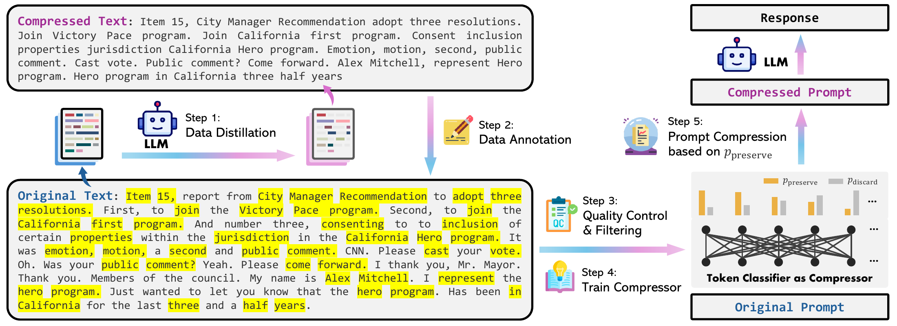
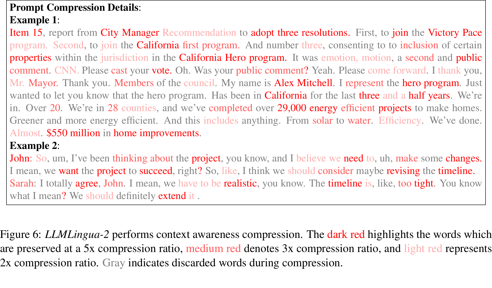

# LLMLingua-2：Data Distillation for Efficient and Faithful Task-Agnostic Prompt Compression

[所属章节](../index.md) · [来源与阅读状态](../../../../sources/papers.json)


- 作者：Zhuoshi Pan、Qianhui Wu、Huiqiang Jiang、Menglin Xia、Xufang Luo、Jue Zhang、Qingwei Lin、Victor Rühle、Yuqing Yang、Chin-Yew Lin、H. Vicky Zhao、Lili Qiu、Dongmei Zhang
- 年份/版本：2024，Findings of ACL 2024，pp.963–981；DOI [10.18653/v1/2024.findings-acl.57](https://doi.org/10.18653/v1/2024.findings-acl.57)
- 原始链接：[ACL Anthology 正式页](https://aclanthology.org/2024.findings-acl.57/)；[正式 PDF](https://aclanthology.org/2024.findings-acl.57.pdf)
- 实际阅读范围：固定 PDF 的正文第 1–6 节（含方法、主实验、消融、结论/局限）及附录 A–P。`source/paper.txt` 是该 PDF 的全文抽取；图、表按 PDF 原页码和图表号核对。没有把已有来源卡当正文证据。

## 1. 问题和核心判断

长上下文提示可以把检索文档、多个示例、思维链或会议记录一起交给黑盒 LLM，但 token 会增加推理费用和首 token 延迟，还可能让模型在冗长上下文中丢失关键信息。任务无关压缩的目标，是在不知道下游问题的情况下删除冗余词，保留足以完成多种任务的信息。前一代 Selective-Context 和 LLMLingua 主要依据 LLaMA-7B 等因果小模型的单向信息熵删除 token；作者指出信息熵不是“压缩后下游任务仍成功”的直接目标，并且只看到左侧上下文。任务感知方法可以使用问题而取得较好结果，却需要同一文档随问题反复压缩，泛化和部署效率较差（正文第 1–2 节，pp.963–965）。

LLMLingua-2 的中心想法是把压缩学习成二分类：对原 prompt 中每个词预测 `preserve` 或 `discard`。标签由 GPT-4 的“只删词”压缩结果蒸馏而来；部署时仅运行一次较小的双向 Transformer encoder（XLM-RoBERTa-large 或 mBERT），按 preserve 概率选词，再按原顺序拼回。因此，输出天然是原文的子序列，保真性来自抽取式结构；全双向上下文提供比因果熵更完整的词重要性；小模型直接学习压缩目标而非在每条输入上迭代计算困惑度，降低压缩器开销。

论文的两个研究问题是：如何用 LLM 构造与压缩目标对齐的数据集（Q1），以及如何利用完整双向上下文设计有效而低延迟的压缩器（Q2）。贡献包括 GPT-4 数据蒸馏、MeetingBank 抽取压缩数据集、token 分类压缩器，以及在 MeetingBank、LongBench、ZeroScrolls、GSM8K、BBH 上的跨任务、跨目标模型评测。



图 1（PDF p.965）是流水线总览：MeetingBank 原文先送 GPT-4 数据蒸馏，再将压缩文本与原文对齐成二值标签，经过质量控制/过滤训练 token classifier；推理时分类器给每个词 `p_preserve`，选出目标预算的词交给下游 LLM。图中的压缩对象是输入 prompt；下游 LLM 仍是黑盒目标模型，分类器不生成答案。

## 2. GPT-4 数据蒸馏：从“会改写”变成“只删词”

### 2.1 目标和指令

理想蒸馏样本同时满足三点：减少 token，保留完成任务所需信息，并且不引入幻觉。直接让 GPT-4 摘要并不可靠：它可能改写措辞、重排词、改变时态/单复数，甚至凭空加入文本中不存在的词。作者因此用强约束抽取指令（正文 §3.1，Fig.2；完整 System/User prompt 在附录 Fig.9）：

1. 只能删除不重要的词；
2. 不重排原词；
3. 不改变原词；
4. 不用缩写或 emoji；
5. 不添加新词或符号。

随后要求“尽可能短，同时保留尽可能多的信息”。这里故意不指定固定压缩率。不同句子和说话人的信息密度不同，固定 5% 或固定目标 token 会迫使 GPT-4 在密集句子上删过头或在冗余句子上删得不够。Fig.3 显示句级压缩率有宽分布（约 1–20），甚至整句被删；这是一种由教师模型自行分配预算的蒸馏信号，而不是部署时必须复现的固定率。

### 2.2 分块是必要的分布修正

GPT-4-32k 对很长输入会倾向于异常激进压缩（Fig.4，原文上下文越长，压缩率越高），作者将其归因于长上下文处理能力限制。解决方式不是相信一个全局长输出，而是将每个会议 transcript 切成不超过 512 token 的 chunk，并在完整句号处结束，逐块压缩。附录 A 给出设置：GPT-4-32k，temperature=0.3、top_p=1.0、最多生成 4096 token；超过 28K token 的 transcript 截断，以给 4K 生成预算。这个 chunking 既减少教师的长上下文失真，也使每个原文-压缩文本对更容易对齐。

数据统计（附录 Table 8）要区分三种单位：原表的 `Data Size` 是 5,169 个 samples，`Chunk` 是 41,746 个分块，`Sentence (Avg)` 是每个 sample 平均 232 句，`Token (Avg)` 是每个 sample 平均 3,635 token；压缩后仍为 5,169 samples/41,746 chunks，平均 1,415 token，平均压缩 2.57×。因此 3,635 token 是一个样本的平均长度，不与单个 chunk 的 ≤512 token 上限矛盾。这里的 2.57× 是教师数据集平均值，不等于所有下游实验的目标压缩率。

### 2.3 一个可跟踪算例

原句：`Item 15, report from City Manager Recommendation to adopt three resolutions. First, to join the Victory Pace program. Second, to join the California first program.`

GPT-4 输出可类似：`City Manager Recommendation adopt three resolutions. Join Victory Pace program. Join California first program.`。理想标签是保留 `City Manager Recommendation adopt three resolutions Join Victory Pace program California first program` 等原词，删除冠词、介词、口语填充和重复连接词。若 GPT-4 把 `joining` 改成 `join`，需依靠词形还原后的模糊匹配；若输出原文没有的 `approved`，该词不能成为任何原词标签。

## 3. 词级对齐、过滤与数据质量

GPT-4 输出并不严格服从“只删词”，所以作者没有简单做字符串子序列匹配，而是设计滑窗、双向搜索和词形还原的自动标注算法（正文 §3.2、Algorithm 1、附录 B）。原文词表记为 `S_ori`，压缩词表记为 `S_comp`；所有原词初始标签 `False`。

对每个压缩词 `w`，从上一个匹配位置 `prev` 附近搜索，窗口大小为 `s`，实际尝试 `prev+i` 与 `prev-i`（`i=1...2s`，边界截断）。先找到的原词标为 `True`，并把 `prev` 更新到该位置。这一局部窗口有两个作用：同一词多次出现时选择邻近实例（解决 ambiguity），以及 GPT-4 局部重排时允许向前/向后找（解决 reorder）；对不在原文的新词，窗口限制可以防止它“跳跃”匹配到远处的相似词。

在匹配前使用 spaCy lemmatization，将 `works/working` 等还原到 lemma，再做 fuzzy match，以处理时态、语态和单复数变化（variation）。下面是安全的教学化伪代码；论文 Algorithm 1 的边界写法按原文呈现，但实现时必须保证索引满足 `0 ≤ j < len(S_ori)`。`fuzzy_match` 表示词形还原后的近似比较：

```text
labels = [False] * len(S_ori); prev = 0
for w in S_comp:
    for i in 1..2*s:
        for j in [prev+i, prev-i]:
            if j < 0 or j >= len(S_ori): continue
            if fuzzy_match(w, S_ori[j]):
                labels[j] = True; prev = j; break
        if matched: break
return labels
```

一个现实例子是原文包含两个 `program`：压缩输出中第一个 `program` 从 `Victory Pace program` 附近开始搜，会标到第一个邻近位置；而不是把它误配给后句。若输出 `properties inclusion jurisdiction`，顺序略有变化，双向局部搜索仍可能得到三个原词标签。这个算法只产生保留/删除标签，不把 GPT-4 的改写作为训练目标，故部署时仍保留原 prompt 的词和原顺序。

作者用两个过滤指标检查教师输出和标签。

- Variation Rate（VR，式(1)）按词计数，且只对非空压缩词表定义：

  $$\mathrm{VR}=\frac{1}{|S_{\mathrm{comp}}|}\sum_{w\in S_{\mathrm{comp}}}\mathbf{1}[w\notin S_{\mathrm{ori}}].$$

  它衡量压缩文本中不在原文的词占比；高 VR 表示 GPT-4 更可能违反只删词指令并产生幻觉。数据蒸馏样本按最高 5% VR 排除。
- Alignment Gap（AG，式(2)–(4)）也按词计数，要求 `S_ori` 与 `S_comp` 非空。先定义 Matching Rate：

  $$\mathrm{MR}=\frac{1}{|S_{\mathrm{ori}}|}\sum_{w\in S_{\mathrm{ori}}}\mathbf{1}[l(w)=\mathrm{True}],$$

  再定义 Hitting Rate 和 Alignment Gap：

  $$\mathrm{HR}=\frac{1}{|S_{\mathrm{ori}}|}\sum_{w\in S_{\mathrm{comp}}}\mathbf{1}[w\in S_{\mathrm{ori}}],\qquad \mathrm{AG}=\mathrm{HR}-\mathrm{MR}.$$

  完美对齐时 AG=0；较高 HR 但较低 MR 说明压缩词确实来自原文，却映射到了错误/重复的原词。作者排除 AG 最高 10% 的样本。

表 7 的消融说明过滤/指令/分块共同重要。在 LongBench SingleDoc QA 上，`LLMLingua-2 w/o Chunk` 的压缩率为 21×、VR 6.0、QA F1 27.9；完整 LLMLingua-2 的压缩率为 2.6×、VR 2.2、QA F1 36.7。四个较松指令的 VR 为 13.7、7.8、9.6、9.4，QA F1 19.1、26.1、23.7、24.9，完整指令显著较稳；21×是该消融配置的实际结果，不应理解为完整方法的目标压缩率。

## 4. 压缩器和预算决策

### 4.1 双向 token 分类

给原 prompt 的词序列 `x={x_i}_{i=1}^N`，Transformer encoder `f_θ` 输出每个位置的双向表示 `h={h_i}`（式(5)）。在线性分类头上：

$$p(x_i,\Theta)=\mathrm{softmax}(W h_i+b),$$

其中输出维度 2，对应 `{preserve, discard}`，`Θ={θ,W,b}`（式(6)）。训练标签 `y_i` 来自上节的 GPT-4 对齐结果，使用平均 token 交叉熵：

$$L(\Theta)=\frac{1}{N}\sum_{i=1}^{N}\mathrm{CrossEntropy}\bigl(y_i,p(x_i,\Theta)\bigr).$$

这里的 $`N`$ 是分类序列中的词数；VR/AG 则使用空格切分得到的词集合，部署阶段的实际长度还受目标 tokenizer 的子词计数影响。

模型有两种：`LLMLingua-2` 用 355M 参数的 XLM-RoBERTa-large，`LLMLingua-2-small` 用 110M multilingual-BERT。两者在 MeetingBank 蒸馏数据上训练 10 epochs，Adam，learning rate `1e-5`，batch size 10；PyTorch 2.0.1、CUDA 11.7。训练约 23 小时（XLM-R-large）和 16 小时（mBERT）。附录 I 的 2.1GB 是 LLMLingua-2 在 MeetingBank 推理时的峰值 GPU memory，不是训练峰值；附录 H 只报告训练时长和模型规模。

为什么这比因果语言模型熵更贴合任务：分类器直接拟合“教师认为下游可删/不可删”的目标；某词右侧出现的限定词、后文定义和跨句线索也能进入 `h_i`；输出在结构上只保留原词且保持原顺序，因此不会由压缩器新增词或重写词，但删除否定词、限定词仍可能改变语义，语义保真需由下游指标和重建分析检验。代价是压缩器需要针对语言分布训练，并且训练集主要是英文会议转录，跨领域表现需实证验证。

### 4.2 预算控制的具体算例

论文将 `1/τ` 称为压缩比，并定义：

$$\widetilde{N}=\tau N.$$

如果原文有 $`N=20`$ 个词，目标 $`1/\tau=4\times`$，则 $`\tau=0.25`$、$`\widetilde{N}=5`$。分类器给出 `p_preserve`：例如位置 1–20 中概率最高的五个位置为 `{2,6,9,14,18}`，保留原文第 2、6、9、14、18 词，再按原位置排序拼接。不会按概率排序重排，也不会生成新词。

实现时还要处理子词：附注 2 规定多 token 词的完整性必须保留，将一个词的所有 subword preserve 概率平均，使用平均值决定该词，防止拆出半个词。部署目标率可以按词/模型 token 近似控制；论文表格中的 Tokens 是下游输入 token 计数，压缩器输出率并非所有 tokenizer 完全相同。

固定样本率之外，附录 L 给出 sample-wise dynamic compression ratio（DCR）：先对所有样本的 token 计算 `p_preserve`，在全语料总预算下选一个阈值，超过阈值的 token 全保留。这样信息密度高的样本可得到更多 token。LongBench SingleDoc QA 上，相对于每个样本固定率（FR），DCR 在 2,000-token 约束时 QA 29.5、2,125 tokens，3,000-token 约束时 QA 32.2、3,164 tokens；固定率对应 QA 25.1/27.4。作者报告在 7×、5×语料级压缩约束下分别提高 4.4%、4.5%。

LLMLingua-2 也可替换旧 LLMLingua 的 token-level iterative module，而继续使用其 budget controller（附录 K）。在 RAG/多文档 QA 中，LongLLMLingua 的问题感知 coarse level 先根据问题为文档分配不同预算，再在文档内部用 LLMLingua-2；NaturalQuestions 20-doc 上 `LLMLingua-2+` 的 1st/5th/10th/15th/20th 位置指标 74.0/70.4/67.0/66.9/65.3，reorder 71.9，平均 739 tokens（3.9×），比单独 LLMLingua-2 的 48.6/44.5/43.6/40.9/39.9、reorder 46.2（748 tokens）高。这是混合的任务感知系统，不能解读成纯任务无关模型的结果。



图 6（PDF p.974）把同一会议文本在 2×、3×、5×预算下的保留词着色：深红是 5×保留，中红 3×，浅红 2×，灰色删除。可见预算变紧时，实体、数字、项目名和决策动作优先留下，口语填充消失。这是作者对“上下文感知”的定性证据，不是独立的人类重要性标注。

## 5. 实验设置：比较时到底测了什么

目标 LLM 默认是 GPT-3.5-Turbo-0613，temperature=0、greedy decoding；另用 Mistral-7B-v0.1（论文表写 v0.1）测试跨目标模型。基线包括 task-agnostic 的 Selective-Context、LLMLingua（两者均用 LLaMA-2-7B 作为小模型），以及任务感知的 SBERT、OpenAI、LongLLMLingua。论文用 MeetingBank 测摘要和新构造 QA；LongBench、ZeroSCROLLS 测长文场景；GSM8K 测数学推理；BBH 测 few-shot/in-context learning。压缩率由 2,000/3,000 token constraint 或表中 1/τ 约束给定。

MeetingBank QA 来自测试集 862 个 transcript。作者先用 GPT-4-32K 每条生成 10 个 QA，丢弃答案超过 50 token 的对，再人工检查答案确实出现在 transcript 中，最终每条保留 3 对；摘要 ground truth 也由 GPT-4 生成（附录 F）。指标：QA Exact Match；摘要 Rouge-1/2/L、BLEU、BERTScore；长文按 LongBench 指标。

### 5.1 MeetingBank（表 1）

GPT-3.5 目标下，原 prompt 3,003 tokens，QA EM 87.75，摘要 Rouge-1/2/L 为 47.28/26.66/35.15。LLMLingua-2 在约 3.1×压缩、970 tokens 下达到 QA 86.92、Rouge-1/2/L 48.64/22.96/34.24；small 在 3.0×、984 tokens 下 QA 85.82、Rouge 48.33/23.07/34.36。Selective-Context 2.5×、1,222 tokens 仅 QA 66.28；LLMLingua 2.5×、1,176 tokens QA 67.52。即 LLMLingua-2 在更短输入上接近完整 prompt，并明显超过熵删除基线；摘要 Rouge-1 甚至高于原文，但 Rouge-2/L 与原文仍略低，不能声称全面无损。

Mistral-7B 结果（表 4）：原文 QA 66.95、摘要 Rouge-1 26.26；LLMLingua-2 970 tokens、3.1×时 QA 76.22、Rouge-1 30.18，small QA 75.97。作者推测 Mistral-7B 对长上下文不如 GPT-3.5，压缩后的高信息密度反而更易处理；这是作者解释，不是另行测得的机制证明。

### 5.2 LongBench 与 ZeroSCROLLS（表 2）

在 2,000-token constraint（约 5×）下，原 prompt LongBench 平均 44.0、10,295 tokens，ZeroSCROLLS 34.7、9,788 tokens。LLMLingua-2 为 LongBench 39.1（SingleDoc/MultiDoc/Summ./FewShot/Synth./Code：29.8/33.1/25.3/66.4/21.3/58.9），1,954 tokens；ZeroSCROLLS 33.4、1,898 tokens。small 为 38.2 与 33.3。它们超过 Selective-Context（24.8/19.4）和 LLMLingua（34.6/27.2），但低于任务感知 LongLLMLingua（48.0/32.5）。

3,000-token constraint（约 3×）下，LLMLingua-2 LongBench 平均 42.4（35.5/38.7/26.3/69.6/21.4/62.8）、3,392 tokens；ZeroSCROLLS 33.5、3,206 tokens。原文为 44.0/34.7，故短输入保持相当性能，Synth 子任务仍明显损失（原 37.8→21.4）。Zero-shot 只有 23.5/10.8，却用极少 token，说明“压缩”必须和上下文信息保留同时评估。

中文 LongBench（附录 J，表 10）是跨语言检查：5×时 LLMLingua-2 平均 38.1（SingleDoc 46.7、MultiDoc 23.0、Summ.15.3、FewShot32.8、Synth72.6），约 3,023 tokens；LLMLingua 28.6，原文 42.5。尽管训练数据是英文，XLM-R/mBERT 的预训练多语能力可能解释迁移；该解释来自作者，数据没有中文蒸馏。

### 5.3 GSM8K 与 BBH（表 3）

1-shot constraint 下，GSM8K full-shot EM 78.85，2,366 tokens；LLMLingua-2 79.08、457 tokens（5×），small 78.92、437；half-shot 约 14×时，LLMLingua-2 77.79、178 tokens，small 77.48、161。BBH full-shot 70.07、774 tokens；LLMLingua-2 70.02、269（3×），small 69.54；half-shot 约 5×时，LLMLingua-2 61.94、176 tokens，small 60.35。LLMLingua 在若干设置更高（例如 GSM8K 79.08），所以结论是稳定接近/超过 full prompt 且更快，不是每项都赢。

附录 Fig.11 的 BBH 水果例子说明差异：LLMLingua 熵法破坏词形和句法（如 `fruits` 被截碎），LLMLingua-2 保留 `clarinet, nectarine, strawberry, violin` 等词和算式，仍能得到答案。Fig.12 的 GSM8K 购买荧光笔例子中，它保留 12×30、5×6、330/3、220+15−120 等算术链；这是定性样例，不能替代表 3 的平均 EM。

### 5.4 延迟和内存（表 5、附录 I）

V100-32G 上，未压缩 end-to-end 14.9 s。LLMLingua-2 在 2×/3×/5×时总耗时 9.4/7.5/5.2 s，即 1.6×/2.1×/2.9×端到端加速。仅压缩器耗时分别为 0.5/0.4/0.4 s；Selective-Context 15.9/15.6/15.5 s，LLMLingua 2.9/2.1/1.5 s。因此“压缩器 3–6×快”与“端到端 1.6–2.9×快”是两个不同指标，不能混写成相同 speedup。作者还报告推理峰值 GPU memory 2.1GB，而 LLMLingua 16.6GB、Selective-Context 26.5GB，约 8×内存降低；未报告训练成本、API 金钱成本或生成 token 成本。

## 6. 其他分析、例外与局限

**上下文和重建。** Fig.7/8 用 GPT-4 接收压缩 transcript 并要求“只删词后重建”。200→98 token 和 160→83 token 的示例能重建出接近原意的 198/123 token 文本。它是可读性/信息保留的定性检查，重建模型本身可能补全缺失内容，不能当作严格无损证明。

**GPT-4 的保留偏好。** Fig.16 比较 POS 分布，名词、形容词、数词在压缩文本中相对更常保留；这符合实体、属性、数字常承载信息的直觉。它是教师输出统计，不是分类器显式 POS 规则。

**GPT-4 vs LLMLingua-2。** 表 9 的 MeetingBank：GPT-4 压缩 2.5×、1,221 tokens，QA 84.86；LLMLingua-2-small 3.0×、984 tokens，85.82；LLMLingua-2 3.1×、970 tokens，86.92；原文 87.75。作者推测，训练全集可能使小模型平均化教师噪声，因而比单次 GPT-4 压缩略高；论文没有做机制验证。

**更多训练数据。** 将 TriviaQA-wiki 50K 样本加入 MeetingBank，表 6 在 2,000-token constraint 下 LongBench 平均从 39.1 提到 39.5，tokens 1,954→1,853；增益小，作者猜测不同领域的冗余模式相似，MeetingBank 已学到可迁移模式。不能据此宣称更多数据不重要。

**长上下文限制。** Mistral-7B 的 8K context 可能使超长输入不公平；附录 P 只保留原文小于 8K 的样本时，表 13 中 LLMLingua-2 仍在 MeetingBank QA 81.75、LongBench 35.0（2K）和 36.3（3K）高于原文 71.27/31.4，缓解但不能消除目标模型差异问题。

**主要局限。** 蒸馏只用 MeetingBank 训练样本（英文会议摘要域），标签质量依赖 GPT-4 指令、fuzzy alignment 和 VR/AG 阈值；压缩器虽跨 LongBench、ZeroScrolls、数学、BBH 泛化，任务感知 LongLLMLingua 在长文仍更强。抽取式压缩保留原词顺序，无法做需要重排/释义的压缩；长文 chunk 边界可能切断跨 chunk 依赖。论文只测固定压缩率或总 token 预算，未测 FLOPs、真实 API 费用、输出长度变化、不同 tokenizer 的严格 token-faithfulness，也未给出人工语义审计或统计显著性。所谓“faithfulness”主要由抽取约束、下游指标、重建样例间接支持。

## 7. 与推理时 token 效率的关系

这篇工作把“减少推理时输入 token”建模为一个可训练的选择问题：离线用 GPT-4 付出一次数据蒸馏成本，在线对每个原词做一次小 encoder 前向，按目标预算保留 token，再把短 prompt 交给目标 LLM。能节省的是输入 token、目标模型 prefill/端到端时间和压缩器 GPU 内存；论文没有测量输出 token、完整推理 FLOPs、训练能源或金钱成本，不能把 2–5×输入压缩直接换算为同倍总成本。动态阈值适合语料级预算，LongLLMLingua+适合需要问题相关文档分配的 RAG；推理链、数字和代码场景仍需检查被删 token 是否破坏局部结构。可复用的设计模板是：教师只删词 → 原/压缩对齐与质量门 → 双向 token 分类 → 概率排序/阈值预算 → 原序重组 → 在目标 LLM 上同时报告任务分数、压缩器耗时、端到端时延和实际 token 数。

## 8. 图表和资产记录

正文重要图表已在上文用 、 标记并解释；实验主表为 Table 1–5，分析表为 Table 6–13，正文/附录图为 Fig.1–16。作者 TeX 已安全解包到 `source/tex/`：主框架为 `figures/framework.pdf`，压缩率分布为 `figures/meetingbank_sentence2.pdf`，长度关系为 `figures/comp_ratio_vs_length.pdf`，POS 图为 `figures/posratios.pdf`，而上下文感知 Fig.6 以彩色 LaTeX 文本嵌在 `acl_latex.tex`（label `fig:context_aware_compression`），没有独立 PDF。Microsoft 官方 [LLMLingua GitHub](https://github.com/microsoft/LLMLingua) 另提供代码、数据管线和运行脚本。ACL 页面说明 2016 年后材料采用 CC BY 4.0；若整合图像，应保留作者、论文、ACL 和许可归属。若资产不便渲染，仍可直接从正式 PDF 读取对应页（Fig.1 p.965，Fig.2–5 pp.965–967，Fig.6–8 pp.974–975，Fig.9–14 pp.976–979，Fig.15–16 pp.979–980），不要按文字重绘成“原图”。

## 9. 证据边界

本文的数值、公式、图表号和实验条件均来自固定正式 PDF 的正文及附录；作者解释（例如 Mistral 长上下文较弱、跨域冗余模式相似、多语迁移源于 XLM-R/mBERT）已用“作者推测/猜测”标明；上文的抽取标签算例和伪代码是对 Algorithm 1 的教学化重写，不是论文新增实验。没有把代码仓库宣传页的速度描述当作论文新证据，也没有声称独立复现。
