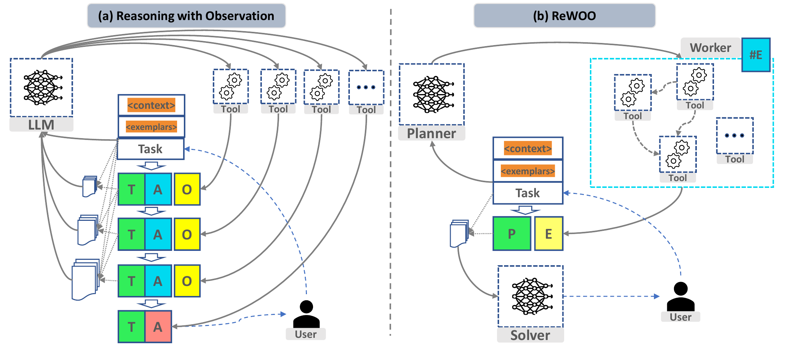
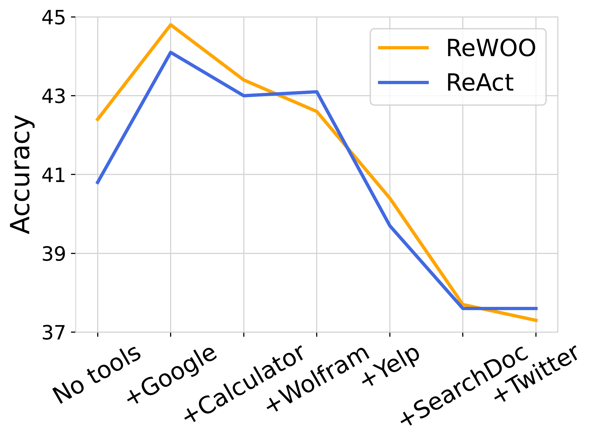
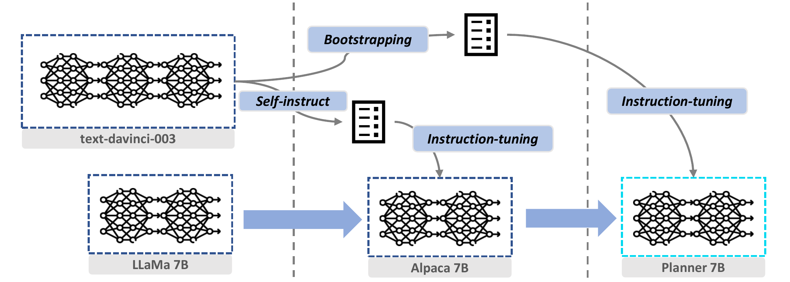
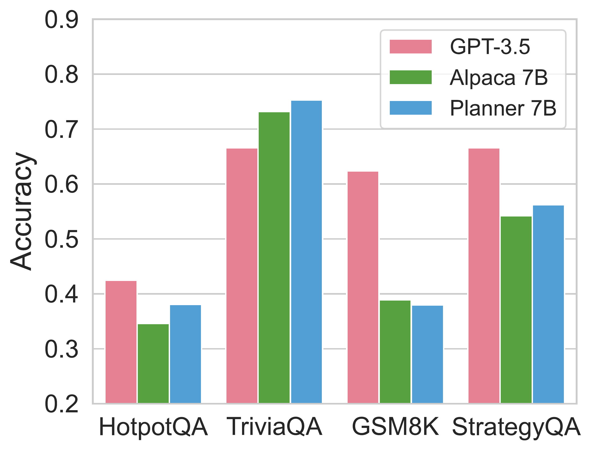

# ReWOO：把推理与观察解耦的高效增强语言模型

[所属章节](../index.md) · [来源与阅读状态](../../../../sources/papers.json)


- **作者**：Binfeng Xu、Zhiyuan Peng、Bowen Lei、Subhabrata Mukherjee、Yuchen Liu、Dongkuan Xu
- **年份 / 固定版本**：2023；arXiv v1，提交于 2023-05-23
- **原始链接**：[arXiv:2305.18323](https://arxiv.org/abs/2305.18323)，[PDF](https://arxiv.org/pdf/2305.18323)，[作者 TeX 源](https://arxiv.org/e-print/2305.18323)
- **实际阅读范围**：固定版本正文全文（摘要、引言、Methodology、Experiments、Related Work、Conclusion、Limitations and Future Work），并从附录只补读正文理解所需的实现/轨迹背景；核对了作者 TeX 源中的表格、公式、图注和图资产。未把附录全部轨迹、全部超参数和引用文献逐篇追读。

## 1. 论文要解决的具体问题

增强语言模型（ALM）把语言模型和 Wikipedia、搜索、计算器、文档检索或行动 API 接起来。典型的 ReAct 式系统按 `Thought → Action → Observation` 循环工作：模型生成一段思考和工具调用，等待工具返回，再把此前的上下文、示例、所有思考、动作和观察一起重新放进下一次模型请求。黑盒 LLM 通常无状态，所以重复输入不是实现细节，而是每轮 API 调用的真实输入 token。

论文认为，许多任务中，模型可以先规划“需要查什么、如何使用前一步结果”，而不必看到每一步的真实观察后才写下一步计划。这种在未知具体证据前预测后续行动结构的能力被作者称为 **foreseeable reasoning**。ReWOO（Reasoning Without Observation）把一个任务拆成三个模块：Planner 先产出不含工具返回值的全局计划；Workers 执行计划并写入证据；Solver 最后综合计划与证据给出答案。目标首先是降低重复 prompt 和调用成本，同时保留或提高问答质量；其次是因为 Planner 与工具返回解耦，可以把规划能力迁移到更小的模型。

## 2. 方法：Plan–Work–Solve

### 2.1 Planner、Worker、Solver 的对象和变量

给定问题 $`Q`$，Planner 接收任务上下文 $`C_{planner}`$ 和少量格式示例 $`m S`$，输出若干 `(Plan, #E)` 对。第 $`s`$ 个计划 $`P_s`$ 是对当前子任务的自然语言描述，`#E_s` 是一个证据变量，而不是已经得到的证据。Worker 根据该计划中的工具指令执行外部调用，并把返回文本填入 $`E_s`$。如果后续计划需要此前结果，Planner 可以在计划中引用 `#E_s`；当 Worker 执行时，该引用被替换为已经取得的 $`E_s`$。Solver 接收原问题、所有 $`P_s`$ 与对应 $`E_s`$，在 $`C_{solver}`$ 下生成最终回答 $`R`$。

重要的是，Planner 的输出可以含有依赖关系，却不含真实观察。例如：

```text
计划1：找出《银翼杀手》的导演。
工具1：Wikipedia[Blade Runner]
#E1
计划2：根据 #E1 找导演的出生年份。
工具2：Wikipedia[#E1]
#E2
计划3：比较导演出生年份和另一位导演的出生年份。
工具3：Calculator/LLM[由 #E1、#E2 计算比较结果]
```

这里计划 2 的输入模板依赖 `#E1`，所以 Worker 2 必须在 Worker 1 返回后执行；与前面无依赖的 Worker 可以并行。论文正文把这种依赖关系描述为天然的 DAG，但没有给出一个完整的调度算法；实际论文实现主要依赖计划中的引用和顺序执行。

一个更贴近论文工具集合的两跳例子是问题“Is the Speaker of the House this year older than last year?”：Planner 可以先规划（1）在 2023 年 SOTU 私有文档中找今年 Speaker；（2）用今年人物名搜索其年龄；（3）搜索 2022 年 Speaker；（4）用 Calculator 比较年龄。Worker 分别调用 `SearchDoc[query]`、`Google[query]` 和 `Calculator[prompt]`，Solver 再把计划与实际片段对齐后作答。Planner 在第 1 步并不知道文档返回的名字，但仍能写出后续引用链。

论文把工具抽象为带自然语言参数的调用，正文实验使用：`Wikipedia[query]`、`Google[query]`、`WolframAlpha[query]`、`LLM[prompt]`、`Calculator[prompt]`、`SearchDoc[query]`；策划的真实应用示例还加入 `Location`、`Stock`、`Twitter`、`Yelp`、`Email`、`TradeStock`、`Draw`。工具返回的是非参数证据，进入 `$E_s$`；Planner 和 Solver 是参数化的语言模型模块。

### 2.2 观察依赖式 TAO 的重复输入

论文用 $`k`$ 表示推理步数，$`T_j,A_j,O_j`$ 分别表示第 $`j`$ 步 Thought、Action、Observation，$`C`$ 表示固定上下文，$`m S`$ 表示示例。观察依赖式 ALM 的输入 token 数（正文 Eq. (1)）为：

```math
\begin{aligned}
\#Token_I^{TAO}
&=\Theta(C+\bm S+Q)
 +\sum_{j=1}^{k-1}\Theta\left(C+\bm S+Q+\sum_{t=1}^{j}(T_t+A_t+O_t)\right)\\
&=k\Theta(Q)+k\Theta(C)+k\Theta(\bm S)
 +\sum_{j=1}^{k-1}(k-j)\Theta(T_j+A_j+O_j).
\end{aligned}
```

前 $`k`$ 次调用重复发送 $`Q,C,\bm S`$；第 1 步的 TAO 会被之后的 $`k-1`$ 次请求再次发送，第 2 步会被之后的 $`k-2`$ 次发送。因此，若每步轨迹长度近似相同，历史轨迹项随 $`k`$ 呈二次累积；固定上下文、示例和问题项至少呈 $`k`$ 次累积。这里讨论的是 LLM 输入 token；工具内部若也调用 LLM，实际总量还会增加。

### 2.3 ReWOO 的替换与 token 公式

令 $`P_j,\hat E_j,E_j`$ 分别表示计划、计划中的证据变量和真实工具证据。ReWOO 的 Planner 只调用一次，Workers 执行计划，Solver 只对收集后的内容做一次综合。正文 Eq. (3) 给出总输入 token 近似式：

```math
\begin{aligned}
\#Token_I^{ReWOO}
&=\Theta(C_{planner}+\bm S+Q)
 +\Theta(C_{solver}+Q+\sum_{j=1}^kP_j+E_j)\\
&\approx 2\Theta(Q)+2\Theta(C)+\Theta(\bm S)
 +\sum_{j=1}^k\Theta(P_j+E_j).
\end{aligned}
```

因此问题和上下文只分别进入 Planner、Solver 两次，示例只给 Planner 一次；历史 TAO 不会逐步堆叠。若把 TAO 数和 PE（Plan–Evidence）数人为对齐，作者说相对 TAO 方案，节省量对 $`Q,C,\bm S`$ 是线性的、对每步 $`T,A,O`$ 的累积项随 $`k`$ 呈二次差异。这个推导只说明输入 prompt 的重复结构；它没有推出总墙钟延迟、工具服务成本或 Solver/Planner 输出 token 一定更少。作者实验把 LLM-based tool 的 token 也计入总 token，但公式本身明确忽略了工具内部复杂度。

### 2.4 为什么拆开还能完成依赖任务

ReWOO 并没有声称 Planner 预测证据内容，而是预测“证据将被用于哪一步”。`#E_s` 充当变量名，使计划可以先写出数据流；Worker 到达该节点后才填入实际字符串；Solver 看到完整的 $`(P_s,E_s)`$ 对并进行最后判断。对可以预先知道查询对象的知识问答、计算、比较和文档检索，这相当于把“决定要查什么”与“读取查到什么”分开。对必须先探索环境、再决定下一动作的任务，拆分会退化，见局限部分。

论文还提出 **near-zero-shot prompting**：用一两个与测试题无关的例子教模型输出 `Plan`、`#E` 和工具格式，同时尽量不泄漏测试内容。实验中 HotpotQA/TriviaQA/GSM8K 的 Planner 分别使用 6、1、1 条人工轨迹；PhysicsQuestions、SportsUnderstanding、StrategyQA 用其他任务的 1 条格式示例。ReAct 使用等价示例，保证比较重点是推理范式而不是示例数量。

## 3. 主实验设置和指标

作者用 gpt-3.5-turbo 做主要比较，测试六个公共数据集和一个更新知识的自建数据集 SOTUQA：HotpotQA、TriviaQA、GSM8K、StrategyQA、PhysicsQuestions、SportsUnderstanding，以及围绕 2023 State of the Union 的文档/在线知识组合问答。HotpotQA 等任务使用 Wikipedia、LLM 等工具；数学任务加入 WolframAlpha、Calculator；StrategyQA、PhysicsQuestions、SportsUnderstanding 给更大的通用工具集合；SOTUQA 使用 LLM、Calculator、Google、SearchDoc。测试规模在表 1 中是 HotpotQA/TriviaQA/GSM8K 各 1000，StrategyQA/SportsUnderstanding 各 300，PhysicsQuestions 53；SOTUQA 未在表中给出样本数。

基线为 Direct Prompt、CoT 和 ReAct。Direct 不显式推理或调用工具；CoT 用一个例子要求逐步思考；ReAct 按 Thought–Action–Observation 交错生成，并把工具描述放入上下文。性能指标是 GPT-4 语义评分的 Acc、字符级 F1 和可用时 EM；效率指标是包括 LLM 工具在内的总 token、推理步数和每 1000 个查询的美元成本。文中没有测量 FLOPs、端到端墙钟延迟、并发吞吐或真实 API 账单的全部固定费用。

## 4. 主结果：质量与 token 的具体权衡

下表重排正文 Table 1 的关键数字；所有数字均为原表值，成本列是作者标注的每 1k 查询美元成本。ReWOO 与 ReAct 的工具数和示例数按任务对齐。

| 数据集（样本数） | 方法 | Acc | F1 | EM | 总 token | 步数 | $/1k |
|---|---|---:|---:|---:|---:|---:|---:|
| HotpotQA (1000) | ReAct | 40.8 | 39.6 | **32.2** | 9795.1 | 4.97 | 19.59 |
|  | ReWOO | **42.4** | **40.1** | 30.4 | **1986.2** | 4.45 | **3.97** |
| TriviaQA (1000) | ReAct | 59.4 | 53.2 | 47.4 | 4212.9 | 5.21 | 8.43 |
|  | ReWOO | **66.6** | **60.6** | **51.8** | **1340.9** | 3.55 | **2.68** |
| GSM8K (1000) | ReAct | 62.0 | **37.3** | — | 1874.3 | 2.86 | 3.75 |
|  | ReWOO | **62.4** | 36.2 | — | **1089.3** | 3.21 | **2.18** |
| StrategyQA (300) | ReAct | 64.6 | 64.6 | 64.6 | 1686.3 | 2.58 | 3.37 |
|  | ReWOO | **66.6** | **66.6** | **66.6** | **1287.1** | 3.20 | **2.57** |
| PhysicsQA (53) | ReAct | 64.1 | **16.2** | — | 2163.3 | 2.77 | 4.33 |
|  | ReWOO | **66.0** | 14.0 | — | **1225.7** | 2.56 | **2.45** |
| SportsU. (300) | ReAct | 58.6 | 51.9 | 49.3 | 1720.0 | 2.64 | 3.44 |
|  | ReWOO | **61.3** | **55.8** | **55.3** | **854.2** | 3.04 | **1.71** |
| SOTUQA | ReAct | 64.8 | 42.7 | — | 1840.3 | 2.43 | 3.68 |
|  | ReWOO | **70.2** | **44.8** | — | **1048.8** | 2.24 | **2.09** |

作者报告六个公共基准平均减少 64% token、Acc 绝对提升 4.4%；摘要用 HotpotQA 概括为约 5 倍 token efficiency 和 4% accuracy gain。逐表看，ReWOO 在六个公共数据集的 Acc 都高于 ReAct，但并非每个辅助指标都赢：HotpotQA 的 EM、GSM8K 的 F1、PhysicsQA 的 F1 由 ReAct 更高。ReWOO 也不总是减少“步数”（GSM8K、StrategyQA、SportsU. 反而略多），所以节省主要来自每次请求不重复整段轨迹，而不是简单地减少规划步数。

SOTUQA 是更接近现实 ALM 的更新知识/私有文档场景：ReWOO Acc 70.2 对 ReAct 64.8，token 1048.8 对 1840.3，约少 43%。不过表格将 Direct/CoT 的低 token 和高低质量同时列出，说明外部工具不是无条件有益；在多个公共任务中 Direct 或 CoT 的 Acc 可能高于带工具的两种方法，不能把 ReWOO 的优势解释成“调用工具总会提升准确率”。


**图 1（`Figure1.pdf`，作者原图）读法。** 图展示完整数据流：问题先进入 Planner，Planner 在没有观察的条件下写互相引用的计划；Worker 按每个计划调用外部工具，产生证据；Solver 将计划和证据配对后输出最终答案。图中的箭头表达模块边界和证据回填，不代表 Planner 与 Worker 可以在所有任务上并行。



**图 2（`Figure2.pdf`，作者原图）读法。** (a) 是 TAO：每个观察返回后都将旧历史堆回下一次 LLM 输入；(b) 是 ReWOO：Planner 先完成计划，Worker 产生证据，Solver 末端一次读取计划-证据集合。该图对应 Eq. (1) 和 Eq. (3)，它解释的是 prompt 复用关系，不是神经网络缓存或 KV-cache 实现。

## 5. 消融、鲁棒性和额外分析

### 5.1 工具数量：多给工具会伤害决策

作者在 HotpotQA 从相同两工具设置开始，逐步增加工具，比较 ReWOO 和 ReAct。Google 在初始阶段能暂时提高准确率，但总体上工具数量增加后性能下降。作者抽查了 20 个“2 工具 ReWOO 成功、7 工具 ReWOO 失败”的问题，其中 17 条轨迹出现工具误用，例如用 `Yelp[query]` 搜索名人。这里的失败不是 token 公式能解决的：更大的工具动作空间让 Planner 产生无关调用和冗余证据。图的 y 轴/具体曲线应以 `assets/figure-extra-tools.pdf` 为准；正文只明确报告上述趋势与 17/20 的质检统计。



### 5.2 工具故障：ReWOO 的错误传播更局部

作者强制所有工具返回 “No evidence found.”。HotpotQA 正常条件下，表 2 给 ReAct Acc 40.8、9795.1 token、$`21.29/1k，ReWOO Acc 42.4、1986.2 token、`$3.97/1k；工具故障相对正常值的变化为：ReAct Acc -40.8、token +851.1、成本 +1.70；ReWOO Acc -29.2、token -110.8、成本 -0.22。也就是说，ReAct 可能在失败观察上继续反复生成和重试，ReWOO 仍可让 Solver 依靠其他计划、已有参数知识或部分证据作答，且整体代价较小。这里“更鲁棒”是相对该人为故障设置的结论，不是对任意 API 异常的全面证明。

### 5.3 更换基础 LLM：对话 RLHF 可能改变工具推理

把 HotpotQA 的 gpt-3.5-turbo 换成 text-davinci-003 后，作者报告 ReAct Acc +1.7、token -466.8、成本 -0.93；ReWOO Acc +2.6、token -90.5、成本 -0.18。作者将其解释为 conversation-aligned RLHF 可能轻微损害 commonsense reasoning；这只是两个模型在该设置下的对照，不能外推成一般 RLHF 定律。

## 6. Planner 专门化：从 175B 级模型迁移到 7B

解耦的第二个收益是可以单独训练 Planner，而不需把非参数工具轨迹纳入端到端训练。作者用 text-davinci-003 在 HotpotQA 与 TriviaQA 混合训练数据上生成约 4000 条 `(Plan, #E)` blueprint，再保留最终答案正确的约 2000 条作为 Planner instruction data。流程是：

1. LLaMA 7B 用 52k self-instruct 数据进行指令微调，得到具有一般能力的 Alpaca 7B；
2. 在约 2000 条正确规划轨迹上继续微调 Alpaca，得到专门预测计划和证据变量的 Planner 7B；
3. 在 ReWOO 中替换 Planner，Solver 与 Worker 流程保持模块化。

作者用单张 RTX4090、LoRA 完成 7B 微调；图 3 说明从 GPT-3.5 生成监督、先做通用指令对齐、再做 foreseeable-reasoning 专门化。



**图 3（`Figure3.pdf`）读法。** 左侧是 GPT-3.5 产生的计划数据，中间先得到 Alpaca 7B，右侧再用正确的计划数据得到 Planner 7B。监督目标是规划行为而非工具返回内容，所以工具仍可在部署时替换。



**图 4/正文 `finetuning.pdf` 读法。** 横轴是任务/基座 Planner，纵轴是准确率；作者声称 Planner 7B 在 HotpotQA、TriviaQA、StrategyQA 上匹配约 25 倍大的 GPT-3.5，并且 Alpaca 7B 到 Planner 7B 的准确率提升显示专门化有效。图注明确 Planner 7B 在 HotpotQA 和 TriviaQA 上调优，因此跨任务泛化证据有限。训练示例只展示 Wikipedia 和 LLM，但作者定性观察到配合工具描述后 Planner 7B 对 Google、Calculator 的能力比 Alpaca 更强；这是小规模定性观察，未给出独立的工具泛化曲线或置信区间。

这个实验支持“参数效率”而不是“总系统成本已被证明降低”：Planner 7B 只替换了规划模块，Worker 的外部服务、Solver 的模型和所有 API 成本仍在系统中。论文没有报告完整的端到端延迟、峰值显存、训练 token 成本或与 GPT-3.5 价格相同口径的总拥有成本。

## 7. 失败模式与限制

论文给出的核心反例是 AlfWorld：房间中列出大量 drawer、shelf、cabinet 等对象，任务是“put some vase in safe”。Planner 在没有环境观察时不知道花瓶在哪个容器，必须枚举潜在计划；其推理步数会接近观察依赖式搜索的最坏情况。这个例子明确了 ReWOO 的适用条件：后续动作结构必须可以从问题、工具说明和一般常识中预先预测。若动作必须先观察未知状态才能决定候选动作，提前写完整计划会造成枚举、错误依赖或无法行动。

其他局限由正文实验直接显示：

- ReWOO 的准确率提升依赖 Planner 能生成有效的工具链；工具越多，工具误用越容易发生。
- 计划和证据的替换是字符串/提示层面的协议，正文没有形式化验证 `$#E_s$` 的唯一绑定、类型安全、循环依赖检测或调度失败处理。
- 理论只计算输入 prompt token；真实系统还受工具返回长度、LLM 工具内部 token、API 并发、网络等待和失败重试影响。作者没有测端到端墙钟时间或并发收益，不能把 token 节省直接换算成延迟比例。
- Solver 可能凭自身知识补偿 Planner/Worker 错误；因此最终准确率不能单独证明“提前规划”在每一步都正确。
- 主表是单次设置的平均结果，未提供完整的随机种子/置信区间，也未给出跨预算、不同 Planner-Solver 模型组合的全面成本前沿。

作者提出的后续方向是：把 Planner、Solver 等专门能力继续迁移到小模型；学习工具表示，使相似工具在表示空间中接近并支持端到端训练；用 DAG 和并发算法优化执行图。这些是未来设计方向，正文没有实现或实证证明。

## 8. 与推理时 token 效率的关系

ReWOO 的实证贡献是把“每一步都重复发送上下文和历史 TAO”改成“Planner 一次、Workers 按局部计划取证、Solver 一次”，并在六个公共基准上报告平均少 64% token；HotpotQA 的原表为 9795.1 → 1986.2，约 79.7% 减少，Acc 40.8 → 42.4。它测量的是 LLM 总 token（作者说明含 LLM-based tools）、推理步数和美元成本，未测 FLOPs 或完整墙钟延迟，也没有给出隐藏的 KV-cache、批处理或并发指标。

对今天的 token-efficient reasoning 研究，最可迁移的抽象是“把可预见的控制流与不可预见的证据内容分开”：控制流只生成一次，证据在 Worker 侧填槽，末端再做一次受约束的综合。但该抽象的收益上限取决于计划是否能在无观察条件下写出；开放环境探索、工具选择高度依赖实时反馈时，ReWOO 的线性/二次 prompt 分析不再描述主要成本。因而应把它看作一种模块化协议和成本分析，而非适用于所有 Agent 的通用替代方案。

## 9. 图资产与来源

正文图均从作者 TeX 源原始 `figs/` 目录复制到本任务 `assets/`，未裁剪。arXiv 页面链接的论文许可为 [CC BY 4.0](https://creativecommons.org/licenses/by/4.0/)；复用时应署名作者和论文、保留许可证链接并标注改动。图文件对应关系：

- `figure1-workflow.pdf`：Figure 1，Workflow of ReWOO，`_s1_introduction.tex`，可复用，CC BY 4.0。
- `figure2-tao-vs-pws.pdf`：Figure 2，observation-dependent reasoning vs. ReWOO，`_s1_introduction.tex`，可复用，CC BY 4.0。
- `figure3-specialization.pdf`：Figure 3，offloading foreseeable reasoning，`_s3_method.tex`，可复用，CC BY 4.0。
- `figure-extra-tools.pdf`：正文工具增量消融图，`_s4_experiments.tex`，可复用，CC BY 4.0。
- `figure-finetuning.pdf`：正文 Planner 基座替换/专门化结果图，`_s4_experiments.tex`，可复用，CC BY 4.0。
- `figure-scatter.pdf`：正文引言中的总体性能散点图，`_s1_introduction.tex`，可复用，CC BY 4.0。

作者原图存在多个未使用的旧版本和注释掉的图（例如 `token-usage-inspect*.pdf`）；本稿只复制正文实际引用的资产，避免把草稿图误当成定版结果。

## 10. 候选但未追读文献

- [ReAct: Synergizing Reasoning and Acting in Language Models](https://arxiv.org/abs/2210.03629)：本文最直接的观察依赖式基线，建议主代理在做路线去重时核对其工具轨迹和示例协议。
- [Toolformer: Language Models Can Teach Themselves to Use Tools](https://arxiv.org/abs/2302.04761)：工具调用训练的对照背景，解释 ReWOO 为何强调把可参数化推理能力与非参数工具分离。
- [AlfWorld](https://arxiv.org/abs/2010.03768)：论文限制段落所用的开放环境反例，建议核对其观察依赖任务定义。
- [Self-Refine](https://arxiv.org/abs/2303.17651)：论文相关工作提及的迭代反馈范式，可作为 ReWOO 计划先验与反馈耦合的对照。

**定位依据**：方法与公式来自作者 TeX `sections/_s3_method.tex`（Eq. (1)、Eq. (3)）；实验表、指标、工具、消融和故障表来自 `sections/_s4_experiments.tex`（Table `main_exp_table`、`fail_tool_table`、`extra_tool_figure`、`finetuning`）；局限来自 `sections/_s7_limitation.tex`。数值没有用搜索摘要或二手资料补齐。
