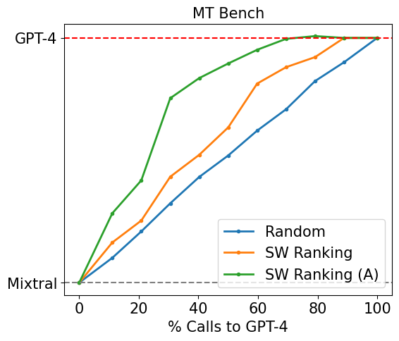
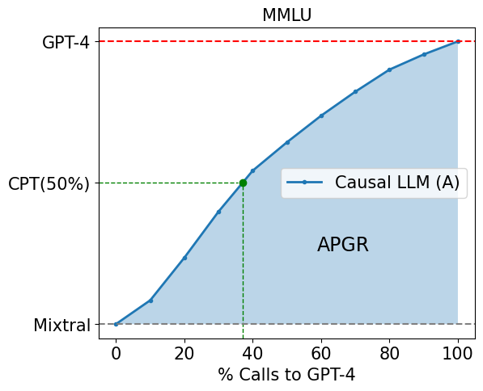
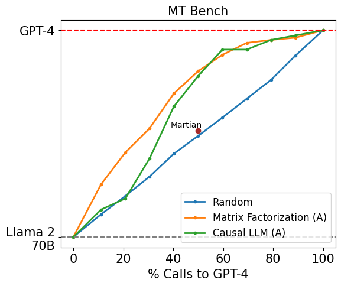
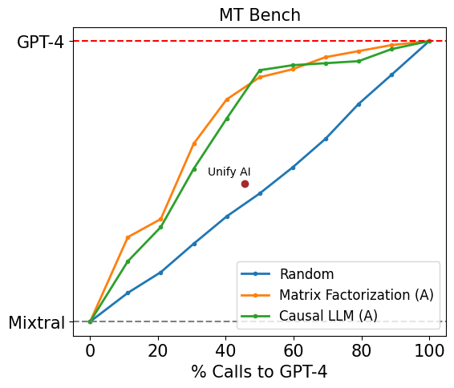

# RouteLLM：利用偏好数据学习 LLM 路由

[所属章节](../index.md) · [来源与阅读状态](../../../../sources/papers.json)


**作者**：Isaac Ong、Amjad Almahairi、Vincent Wu、Wei-Lin Chiang、Tianhao Wu、Joseph E. Gonzalez、M Waleed Kadous、Ion Stoica（前两位等贡献；UC Berkeley、Anyscale、Canva） <br>
**年份**：2024 年 arXiv 预印本；缓存固定版本为 `2406.18665v4`（ICLR 2025 论文版本） <br>
**原始链接**：[arXiv:2406.18665v4](https://arxiv.org/abs/2406.18665v4)，[PDF](https://arxiv.org/pdf/2406.18665v4) <br>
**实际阅读范围**：固定版本 PDF 全文 16 页；作者 TeX 的摘要、Introduction/Related Work、LLM Routing（问题定义和指标）、Methodology、Experiments、Conclusion，以及附录中模型分层、数据污染、相似度、成本、独立基准和补充曲线。作者正文和附录 PNG 已原样提取到 `assets/`。参考文献只用于识别论文讨论的前作，没有逐篇阅读。

## 1. 问题、动机和论文主张

部署 LLM 时，能力和服务成本通常随模型大小反向拉开：大型模型回答质量较高，却昂贵；较小模型便宜，却可能处理不好复杂问题。论文以 GPT-4 与 Mixtral-8x7B 为代表，指出每个请求都调用强模型会浪费成本，而每个请求都调用弱模型会牺牲质量；Introduction 用 Claude-3 Haiku 与 Opus 的输出价格作直观例子（每百万输出 token 约 $`1.25 对 `$75）。路由器先看 query，再只选择一个模型，目标是在给定质量目标下减少强模型调用，或者在成本约束下尽量恢复强弱模型之间的质量差。

论文刻意研究二路路由：强模型集合 $`\mathcal M_{\mathrm{strong}}`$ 和弱模型集合 $`\mathcal M_{\mathrm{weak}}`$。它不是让多个模型都生成后再挑答案，也不是先由小模型回答、再决定是否级联到大模型；每条请求只调用一个被选中的模型，因此直接减少多模型方法的延迟。作者希望一个路由器还能跨查询分布泛化，并在替换强/弱模型后不重新训练。

相关工作包括 LLM-Blender 的多模型生成后选择、FrugalGPT 的级联、AutoMix 的小模型自验证，以及使用合成标签的 Hybrid-LLM 和使用奖励模型标签的 Zooter。RouteLLM 的差异是：训练信号主要来自 Chatbot Arena 的人类偏好，比较多个路由器架构，并用去污染的公开基准检验域外泛化；代价是其二路设定尚未覆盖多路模型和真实应用分布。

## 2. 形式化对象：偏好概率再转成模型选择

每个模型 $`M:\mathcal Q\to\mathcal A`$ 把 query $`q`$ 映射成回答 $`a=M(q)`$。偏好数据为

```math
\mathcal D_{\mathrm{pref}}=\{(q,l_{s,w})\mid q\in\mathcal Q,\ l_{s,w}\in\{\mathrm{win}_s,\mathrm{tie},\mathrm{win}_w\}\},
```

其中标签比较同一个 query 上强模型 $`M_s`$ 与弱模型 $`M_w`$ 的回答。路由器先拟合强模型胜出的概率 $`P_\theta(\mathrm{win}_s\mid q)`$，通过最大化观测偏好标签的对数似然来学习参数：

```math
\max_\theta\sum_{(q,l_{s,w})\in\mathcal D_{\mathrm{pref}}}\log P_\theta(l_{s,w}\mid q).
```

部署时用阈值 $`\alpha\in[0,1]`$ 将连续概率离散化：

```math
R^\alpha(q)=
\begin{cases}
\mathcal M_{\mathrm{weak}},&P(\mathrm{win}_s\mid q)<\alpha,\\
\mathcal M_{\mathrm{strong}},&P(\mathrm{win}_s\mid q)\ge\alpha.
\end{cases}
```

因此 $`\alpha`$ 越高，越少 query 能达到“强模型胜出概率至少为阈值”，路由会更偏向弱模型，成本降低但质量风险增大；$`\alpha`$ 越低则更偏向强模型。最终模型输出是

```math
M_{R^\alpha}(q,M_s,M_w)=
\begin{cases}
M_s(q),&R^\alpha(q)=\mathcal M_{\mathrm{strong}},\\
M_w(q),&R^\alpha(q)=\mathcal M_{\mathrm{weak}}.
\end{cases}
```

这里的“强/弱”是任务和数据上的模型类，而不是假定强模型对每个 query 都赢。模型先验来自 Chatbot Arena leaderboard 的模型分层，具体 tier 表在附录；训练时只保留 winner identity，不把两边回答文本交给路由器。

### 教学二模型例

设 $`q_1`$ 是“把 2x+3=11 解出来”，预测 $`P(\mathrm{win}_s\mid q_1)=0.18`$；设 $`q_2`$ 是多步数学证明，预测为 0.86。若 $`\alpha=0.5`$，$`q_1`$ 走 Mixtral（弱模型），$`q_2`$ 走 GPT-4（强模型）。提高到 $`\alpha=0.9`$ 时，即使 $`q_2`$ 也不能达到阈值，会更多走弱模型；降低到 $`0.1`$ 时二者都更可能走强模型。这个教学例只解释阈值行为，不声称论文测过该具体 query，也不把模型的概率当作校准后的真实胜率。

### 评测指标

强调用率是成本代理：

```math
c(M_{R^\alpha})=\frac1{|\mathcal Q|}\sum_{q\in\mathcal Q}\mathbf1\{R^\alpha(q)=\mathcal M_{\mathrm{strong}}\}.
```

质量为路由答案分数的平均值 $`r(M_{R^\alpha})`$；分数可以是 MMLU 的正确率，也可以是 MT Bench 的 1–10 评定。相对弱模型恢复的强弱差距为

```math
PGR(M_R)=\frac{r(M_R)-r(M_w)}{r(M_s)-r(M_w)}.
```

所以 $`PGR=0`$ 对应弱模型平均质量，$`PGR=1`$ 对应强模型平均质量（在定义成立且分母非零时）。单独看 PGR 会偏爱永远调用强模型的平凡路由器，因此作者扫描阈值形成 call-performance graph。APGR 是曲线相对于弱模型基线的面积：

```math
APGR(M_R)=\int_0^1PGR(M_R)\,d(c(M_R)),
```

论文实际把强调用百分比离散为十个 $`c_i`$，每个点找满足调用约束的 $`\alpha_i`$，以十个 PGR 的均值近似 APGR。CPT($`x\%`$) 是达到 $`PGR=x\%`$ 所需的最小强模型调用百分比；例如图中的 CPT(50%) 表示达到强弱质量差的一半要调用 GPT-4 多少次。表中的 APGR 是质量—调用率曲线的汇总，CPT 是特定目标点的成本读数。

## 3. 偏好数据：从稀疏的人类投票到两类增强

### Chatbot Arena 数据和模型分层

原始 Chatbot Arena 有约 80K battles：用户提交 prompt，匿名模型各生成一份回答，用户投票选胜者或平局。任意两个模型之间的直接比较标签平均不到 0.1%，直接把模型对当作路由类别会严重稀疏。作者依据 leaderboard 分数把模型用动态规划聚成 10 个 tier，以减小 tier 内变异；tier 0 和 tier 1 作为强模型类，tier 2 作为弱模型类。附录列出完整分层，例如 tier 0 含 `gpt-4-0125-preview`、`gpt-4-1106-preview`，tier 2 含 `mixtral-8x7b-instruct-v0.1`、Claude-2、GPT-3.5、Gemini Pro 等。这个处理把许多具体模型的观察压缩成强/弱比较标签，但也意味着训练路由器学到的是分层后的相对偏好，而非每个部署模型的独立能力。

实验从 80K 中留出 5K 验证样本，删除少于 16 字符的 prompt，剩下约 65K 比较、64 个模型，覆盖 100 多种语言；英语占 81%，中文 3.1%，俄语 2.2%。模型分成 10 类以降低比较标签稀疏。作者只保留 query 与 winner identity，训练时不直接输入回答；这使训练更像“query → 哪类模型更可能赢”的预测。

### 两种数据增强

第一种是 golden-labeled $`\mathcal D_{\mathrm{gold}}`$。作者取 MMLU validation split 约 1,500 道选择题，知道正确选项后，分别运行强/弱模型，根据哪一个回答与 golden answer 一致生成 $`l_{s,w}`$。由于约 1,500 条不足总训练量 2%，它是一个很小但与 MMLU 同分布的 in-domain 补丁。

第二种是 LLM-judge 数据 $`\mathcal D_{\mathrm{judge}}`$。Nectar 数据集已有 GPT-4 回答，作者把它作为强模型输出，再用 Mixtral-8x7B 生成弱模型回答，最后让 GPT-4 judge 两者并给出偏好标签，并采用 MT Bench 论文建议的去偏做法。共约 120K 样本，收集成本约 $700。这里的标签是 GPT-4 判定而不是人类投票；作者使用它是为了扩大开放式聊天领域覆盖。美元数是标签数据构造成本，不能转换成训练 token 节省或推理 token 节省。

## 4. 四种路由器

所有路由器输出强胜概率，区别在于如何由 query 和偏好数据参数化它。

### 4.1 相似度加权（SW ranking）

对测试 query $`q`$ 和每个训练 query $`q'`$，用 text-embedding-3-small 计算余弦相似度，并除以 $`q'`$ 与训练集各样本的最大余弦相似度进行缩放：

```math
\mathcal S(q,q')=
\frac{\epsilon\cdot\epsilon'}{\lVert\epsilon\rVert\lVert\epsilon'\rVert\cdot
\max_s\frac{\epsilon'\cdot\epsilon_s}{\lVert\epsilon'\rVert\lVert\epsilon_s\rVert}.
```

每个训练样本的权重为 $`\omega'=\gamma^{1+\mathcal S(q,q')}`$，论文选择 $`\gamma=10`$。然后用带权二元交叉熵拟合 Bradley–Terry 的强、弱系数 $`\xi_s,\xi_w`$，并用 $`1/(1+e^{\xi_s-\xi_w})`$ 作为强胜概率。它在推理时求解，不需要单独训练路由参数；代价是每次要与训练 query 做相似度处理。论文没有解释 tie 在“二元”损失中的具体编码方式，这是一个实现细节缺口。

### 4.2 矩阵分解（Matrix Factorization）

作者把每个模型和 query 映射成向量，学习潜在质量函数 $`\delta(M,q)`$；若模型在该 query 更好，应有更高 $`\delta`$：

```math
P_\theta(\mathrm{win}_s\mid q)=
\sigma\big(\delta(M,q)-\delta(M',q)\big).
```

具体打分为

```math
\delta(M,q)=w_2^T\big(v_m\odot(W_1^Tv_q+b)\big),
```

其中 $`v_m\in\mathbb R^{d_m}`$ 是模型 embedding，$`v_q\in\mathbb R^{d_q}`$ 是 query embedding，$`W_1`$ 和 $`b`$ 把 query 投影到模型向量维度，Hadamard 乘积让模型身份与 query 特征交互，$`w_2`$ 产出标量。它相当于在 query × model 的质量矩阵上学习一个低秩结构。实验训练约 10 epochs，batch 64，Adam，学习率 $`3\times10^{-4}`$，weight decay $`10^{-5}`$，用 8GB GPU。实验中的输入 embedding 是 text-embedding-3-small。

### 4.3 BERT 分类器

BERT-base 先将 query 编码成上下文表示 $`h_{\mathrm{CLS}}`$，再用线性头和 sigmoid 输出强胜概率：

```math
P_\theta(\mathrm{win}_s\mid q)=\sigma(Wh_{\mathrm{CLS}}+b).
```

作者在偏好数据上全参数微调，用 2 张 L4 24GB GPU 训练约 2,000 steps，batch 16，最大长度 512，学习率 $`10^{-5}`$，weight decay 0.01。它容量高于非参数相似度方法，但在稀疏 Arena 数据上容易过拟合或泛化不足。

### 4.4 因果 LLM 分类器

作者用 Llama 3 8B 做 instruction-following 路由器：提示中放入 query，让模型以 next-token prediction 输出胜负标签，而不是接分类头；标签类作为额外 vocabulary token，并对标签集合 $`\mathcal L`$ 做 softmax 得到概率。训练用 8 张 A100 80GB，约 2,000 steps，batch 8，最大长度 2048，学习率 $`10^{-6}`$。这是最重的路由器，但能利用大语言模型的上下文表达能力；在低数据 Arena-only 条件下并不稳定。

## 5. 评测设计和公平条件

具体主实验固定强模型为 `gpt-4-1106-preview`，弱模型为 Mixtral 8x7B；每个 query 只调用其中一个。四种路由器的训练输入均来自 Arena 或增强数据；SW 与矩阵分解使用 OpenAI `text-embedding-3-small`。BERT 与因果 LLM 全参数微调，并用验证集选择模型。基线是在相同强调用约束下随机路由的 random router。评测包括：

* MT Bench：160 个开放式问题，LLM-as-a-judge 评分；
* 5-shot MMLU：57 科目共 14,042 题；
* 8-shot GSM8K：1000 多道小学数学题。

作者还做 embedding 交叉污染检查：用 `text-embedding-3-small` 对评测和训练 prompt 做相似度搜索，阈值 0.95，删掉被污染的评测例后报告 uncontaminated 分数。主实验的数值因此是去污染结果，不能与含污染的外部运行直接比较。

## 6. 主实验结果：质量—调用率曲线的数值解读

### 6.1 MT Bench：Arena 与 GPT-4 judge 增强

表 1 的随机基线为 CPT(50%) $`49.03\pm4\%`$、CPT(80%) $`78.08\pm3\%`$、APGR $`0.500\pm0.02`$。仅用 Arena 训练时，BERT 反而最差（CPT50 78.09%，CPT80 87.64%，APGR 0.391，较随机 −21.8%）；因果 LLM 为 28.82%、77.53%、0.573；矩阵分解为 25.32%、74.26%、0.580；SW 为 37.85%、58.99%、0.610，APGR 较随机 +22.1%。也就是说在 MT Bench 分布较接近 Arena 时，简单的相似度/低秩方法已经有效，而参数很多的 BERT/因果 LLM 没有从稀疏偏好中受益。

用 $`\mathcal D_{\mathrm{judge}}`$ 增强后，随机基线不变；BERT 的 CPT50/CPT80/APGR 为 19.58%/34.02%/0.751（+50.2%），因果 LLM 为 31.50%/48.75%/0.679（+35.8%），矩阵分解为 13.40%/31.31%/0.802（+60.4%），SW 为 23.21%/36.04%/0.759（+51.8%）。矩阵分解在该表最好，达到 CPT(80%) 约需随机所需强调用的一半。表注给出 MT Bench 在 CPT(50%) 的分数为 8.8，是 GPT-4 9.3 的 95%；这表示“少调用”是在仍接近强模型质量的目标下测得的。





图 1（原图文件 `assets/gsm8k.png`、`mt-bench.png`、`mmlu-main.png`）把 GPT-4/Mixtral 的 call-performance 曲线并列展示：左图强调 GSM8K 上超过随机的路由器；中图用 MT Bench 展示增强数据（图中 A）把曲线向左上推；右图解释绿色 CPT 线和蓝色 APGR 阴影。图的关键不是单一终点，而是阈值变化时强调用率和恢复质量之间的整条关系。

### 6.2 MMLU：小量同域 golden data 的效果

MMLU 的随机基线 CPT50 $`50.07\pm0\%`$、CPT80 $`79.93\pm0\%`$、APGR 0.500。只用 Arena 时 BERT、因果 LLM、矩阵分解、SW 的 APGR 分别是 0.502、0.499、0.524、0.473，均接近随机；最佳矩阵分解 CPT50 为 45.00%，CPT80 为 76.86%。这支持作者的 OOD 解释：Arena 多是聊天请求，不含足够多的 MMLU 学科选择题。

加入约 1,500 条 MMLU golden-labeled 样本后，BERT 为 CPT50/CPT80/APGR 41.30%/72.20%/0.572（+14.4%），因果 LLM 为 35.49%/70.31%/0.600（+19.9%），矩阵分解为 35.46%/71.40%/0.597（+19.5%），SW 为 35.40%/71.55%/0.603（+20.7%）。因此所有方法大约比随机少 20% 的 GPT-4 调用即可达到 PGR 50%。表注说明 CPT(50%) 的 MMLU 分数 75 约为 GPT-4 分数 81 的 92%。


图 1 右图给出抽象的 APGR/CPT 读法；附录 `unaugmented-mmlu.png` 与 `augmented-mmlu.png` 给出所有路由器曲线的原始补充图。增强只占训练数据不到 2%，但由于分布匹配，对 MMLU 的曲线影响明显。

### 6.3 GSM8K：judge 增强让所有路由器越过随机基线

GSM8K 随机基线 CPT50 $`50.00\pm2\%`$、CPT80 $`80.08\pm1\%`$、APGR $`0.497\pm0.01`$。只用 Arena 时 BERT 的 CPT50/80/APGR 为 58.78%/83.84%/0.438，因果 LLM 56.09%/83.56%/0.461，矩阵分解 53.59%/85.24%/0.4746，SW 54.43%/82.11%/0.4753，全部低于随机。加入 $`\mathcal D_{\mathrm{judge}}`$ 后，BERT 为 44.76%/79.09%/0.531（+6.9%），因果 LLM 33.64%/63.26%/0.622（+25.3%），矩阵分解 38.82%/72.62%/0.565（+13.8%），SW 41.21%/72.20%/0.568（+14.3%）。因果 LLM 此时最好：达到 CPT50 比随机少约 17% GPT-4 调用，CPT80 也少约 17%。表注给出 CPT50 分数 75，约为 GPT-4 分数 86 的 87%。


附录 `unaugmented-gsm8k.png` 和 `augmented-gsm8k.png` 是对应的全路由器曲线；它们说明增强后的收益不是只来自某个单点，而是整个阈值扫描的曲线改善。作者解释为数学问题在 Arena 中分布外，judge 数据提供了更多开放式/推理相关 query；这是一种与 benchmark 分布相符的相关性证据，不能单凭该结果证明 judge 标签在所有任务上都可靠。

## 7. 跨模型迁移：路由器不重新训练

作者将已在 $`\mathcal D_{\mathrm{arena}}+\mathcal D_{\mathrm{judge}}`$ 训练好的同一个路由器直接替换模型对，并且新模型不在训练数据中：

1. 强 Claude 3 Opus / 弱 Claude 3 Sonnet；
2. 强 Llama 3.1 70B / 弱 Llama 3.1 8B。

在 Claude 对上，随机基线 CPT50 $`49.89\pm3\%`$、CPT80 $`72.27\pm4\%`$、APGR 0.493；BERT 34.85%/39.04%/0.682，因果 LLM 28.12%/50.00%/0.656，矩阵分解 31.86%/36.43%/0.762，SW 23.27%/51.85%/0.772。SW 的 APGR 较随机 +56.6%，矩阵分解 +54.6%。

在 Llama 对上，随机为 47.52±3%/76.26±2%/0.512；BERT 30.15%/38.91%/0.673，因果 LLM 34.05%/45.96%/0.689，矩阵分解 25.83%/37.30%/0.738，SW 21.18%/29.39%/0.767。SW 在 CPT50、CPT80 和 APGR 均最好，APGR +49.8%。作者据此认为路由器学到了 query 的一般难度/能力需求特征，而不是只记住训练时的特定模型身份。证据仍限于两个新的 MT Bench 模型对，不能推出任意模型或任意领域都无需再训练。

[原始表格/补充示例](https://arxiv.org/abs/2406.18665)

## 8. 数据—基准相似度分析

作者定义基准 $`B`$ 与偏好数据 $`D`$ 的相似度为每个评测 prompt 到训练集合最近邻 cosine 相似度的平均：

```math
\mathcal S(B,D)=\frac1n\sum_{i=1}^n\max_{1\le j\le m}
\frac{b_i\cdot d_j}{\lVert b_i\rVert\lVert d_j\rVert}.
```

选最大相似度而非平均相似度的理由是：对路由来说，少量与当前 query 很相似的偏好样本可能比大量不太相似的样本更有用。表 5 的分数为：MT Bench—Arena 0.6078、Arena+$`D_{judge}`$ 0.6525；MMLU—Arena 0.4823、Arena+$`D_{gold}`$ 0.5678；GSM8K—Arena 0.4926、Arena+$`D_{judge}`$ 0.5335。高相似度与相应 benchmark 上更强的路由结果相关；Arena 本身在 MT Bench 上的相似度高于 MMLU/GSM8K，正对应其 Arena-only 结果更好。该分析是相关性诊断和数据选择启发，不是因果证明，也没有给出置信区间或跨任务的预测模型。

## 9. 成本、吞吐和路由开销：美元不能冒充 token 节省

### 质量约束下的美元成本估算

作者以 `gpt-4-1106` 价格（输入 $`10/百万 token，输出 `$30/百万 token）和训练集平均 prompt 95 token、平均回答 264 token，得到输入/输出比约 95/264，估算 GPT-4 平均 $`24.7/百万 token；Mixtral 假定输入输出同价，平均 `$0.24/百万 token。表 6 对每个 benchmark 的最佳路由器给出相对 GPT-4 的成本节省比：MT Bench CPT50（对应 95% GPT-4 质量）3.66×，CPT80 2.49×；MMLU CPT50（92% GPT-4 质量）1.41×，CPT80 1.14×；GSM8K CPT50（87% GPT-4 质量）1.49×，CPT80 1.27×。

这些数是用“随机基线强调用率 / 最佳路由器强调用率”的倒数估算，因为作者认为 GPT-4 是主要成本。它们不是对每条样本真实输入、输出或隐藏推理 token 的计数；论文没有报告路由后各路径的实际 token 分布、总 token/FLOPs 曲线、reasoning token、失败轨迹，或生成长度改变带来的成本。平均 95/264 只用于美元价格换算。因此“最多 3.66× 成本节省”不能写成“节省 3.66× token”，也不能证明推理 token 数下降。

### 路由器自身开销

作者用 Chatbot Arena 随机对话测请求处理速率，再用 VM 小时价格换算每百万请求开销；embedding 成本也计入需要 embedding 的路由器。SW ranking 在 CPU-only Google Cloud `n2-standard-8` 上，成本 $`39.26/百万请求、2.9 requests/s、`$0.39/小时；矩阵分解在单 L4 `g2-standard-4` 上 $`3.32、155.16 requests/s、`$0.8/小时；BERT $`3.19、69.62 requests/s、`$0.8/小时；因果 LLM $`5.23、42.46 requests/s、`$0.8/小时。作者说 SW 的最高路由成本不超过 GPT-4 生成成本的 0.4%。这仍是路由服务成本/吞吐的 profiling，而非语言模型输出 token 的测量。

## 10. 独立基准、补充图和失败模式

附录把最佳路由器与商业 Unify AI、Martian 在 MT Bench 上比较。实验根据各系统支持的弱模型在 `gpt-4-turbo-2024-04-09` 与 Mixtral-8x7B 或 Llama-2-70B 之间路由；Unify 选 dashboard 上最佳配置，Martian 以 $`10.45/百万 token 的最大成本近似 50% GPT-4 调用。作者报告 Arena+`$D_{judge}$ 的矩阵分解和因果 LLM 在相同质量下比商业系统少最多 40% GPT-4 调用。该比较依赖公开价格、一比一输入输出假设和不同系统配置，适合当作附加参照，不是完全同条件的模型复现。





原图 `indep-benchmarks-llama.png` 与 `indep-benchmarks.png` 并列展示独立商业系统比较。附录还提供 `unaugmented-mt-bench.png`/`augmented-mt-bench.png`、`unaugmented-mmlu.png`/`augmented-mmlu.png`、`unaugmented-gsm8k.png`/`augmented-gsm8k.png`，分别展开三张主表在不同训练数据下的完整曲线。

## 11. 作者结论、局限和读者应保留的判断

作者的结论是：偏好数据训练的二路路由器可以在开放问答、知识和数学 benchmark 上降低强模型调用；同域或 judge 增强比单纯扩大路由器容量更关键；已训练路由器可迁移到未见的强/弱模型对；路由器本身的服务成本相对 LLM 生成较小。

论文明确承认三项局限。第一，真实应用分布可能与三个公开 benchmark 差别很大，因此建议收集少量 in-domain 数据再增强；这并不等于已证明真实生产泛化。第二，本文只研究两模型路由，未来才扩展到 $`N`$ 路模型。第三，没有所有任务都通用的最佳 router：延迟、成本、查询类型和路由器开销应整体权衡；同一训练集上不同路由器在同一 benchmark 的结果可能差异很大，作者没有给出清楚解释。

从推理时 token 效率角度，本文最可靠的贡献是“按 query 选择昂贵模型”的质量—强调用率曲线，以及数据分布匹配对曲线的影响；它不是减少单次回答的输出 token、压缩上下文或减少隐藏思维 token 的方法。训练显存、训练步数、router 请求吞吐和平均 prompt/response 长度均有报告，但**推理 token 是否实测：未报告**。没有每条请求真实 input/output/hidden reasoning token 的日志，不能把调用率、美元价格或 GPT-4 cost ratio 解释为 token 数下降。还应注意：偏好标签含 tie，但 SW 段落以二元交叉熵写法描述，作者未在正文说明 tie 的具体编码；PGR 分母假设强弱模型质量差非零；APGR 只用十个强调用率点近似面积；相似度—性能是相关性而非因果证明。

## 图像清单（作者原始资产）

所有文件均从固定版本 `latex-source.tar` 的 `Figs/` 原样提取到 `[temporary reading packet]`，未裁剪或重绘。来源 URL 为 [arXiv 2406.18665v4](https://arxiv.org/abs/2406.18665v4)；缓存 manifest 给出许可证 URL `http://arxiv.org/licenses/nonexclusive-distrib/1.0/`。按该 arXiv 分发许可，在遵守许可条件时允许复用；主代理整合时仍应保留论文归属和来源。

* `main`：作者图 1，TeX label `fig:main`，由三个子图组成：`gsm8k.png`（左）、`mt-bench.png`（中）、`mmlu-main.png`（右）；caption 是 GPT-4/Mixtral call-performance、增强效果、CPT 和 APGR 说明。draft 标记分别用 、、。
* `independent-benchmark`：附录图，TeX label `fig:independent-benchmark`，`indep-benchmarks-llama.png` 和 `indep-benchmarks.png`；商业 Unify/Martian 对比，标记 

。
* `unaugmented-mt-bench` / `augmented-mt-bench`：附录补充 MT Bench 曲线；文件分别为 `unaugmented-mt-bench.png`、`augmented-mt-bench.png`。
* `unaugmented-mmlu` / `augmented-mmlu`：附录补充 5-shot MMLU 曲线；文件分别为 `unaugmented-mmlu.png`、`augmented-mmlu.png`。
* `unaugmented-gsm8k` / `augmented-gsm8k`：附录补充 8-shot GSM8K 曲线；文件分别为 `unaugmented-gsm8k.png`、`augmented-gsm8k.png`。
